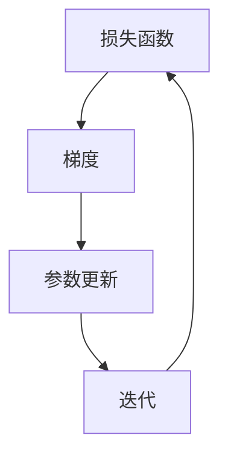

                 

### 关键词 Keywords ###
机器学习，深度学习，梯度下降，随机梯度下降，SGD，优化算法，模型训练。

<|assistant|>### 摘要 Abstract ###
本文将深入探讨随机梯度下降（SGD）算法在机器学习和深度学习中的应用原理。通过详细的算法原理、数学模型讲解，结合实际代码实现，我们将揭示SGD在模型训练中的优势和局限性。文章还将探讨SGD在不同领域的应用案例，并对未来的发展进行展望。本文旨在为读者提供全面、系统的SGD理论与实践知识，帮助他们在实际项目中更有效地应用这一重要的优化算法。

## 1. 背景介绍

随机梯度下降（Stochastic Gradient Descent，简称SGD）是机器学习和深度学习领域中广泛使用的一种优化算法。其核心思想是通过随机选择训练数据中的一个样本来计算梯度，并进行参数更新，以逐步减小损失函数。与传统梯度下降算法不同，SGD具有计算效率高、对大规模数据集适应性强的特点，因此成为了深度学习模型训练的主流方法。

### SGD的历史与发展

SGD算法最早由Ivan Tulchinsky和Richard L. Smith在1960年提出。然而，当时由于计算机性能的限制，SGD并未得到广泛应用。直到20世纪90年代，随着大规模数据处理和计算能力的提升，SGD重新引起了研究者的关注。2006年，Leo Breiman提出了随机梯度提升（SGD-based Gradient Boosting）算法，大大提高了分类和回归任务的性能。

进入21世纪，随着深度学习的发展，SGD算法在图像识别、自然语言处理等领域取得了显著的成果。特别地，在2012年，AlexNet模型的胜利标志着深度卷积神经网络（CNN）时代的到来，而SGD算法正是这一突破背后的关键因素。

### SGD的应用领域

目前，SGD算法在多个领域都取得了显著的成果：

1. **图像识别**：SGD算法广泛应用于各类图像识别任务，如人脸识别、物体检测等。通过深度学习模型，SGD能够有效地提取图像特征，提高识别精度。
2. **自然语言处理**：在自然语言处理领域，SGD算法被用于训练各种神经网络模型，如循环神经网络（RNN）、长短期记忆网络（LSTM）和Transformer等，提高了语言理解和生成任务的效果。
3. **推荐系统**：在推荐系统中，SGD算法通过优化用户和物品之间的相似度，提高了推荐系统的准确性和用户体验。
4. **时间序列分析**：SGD算法在时间序列分析中也有广泛应用，通过训练模型，可以预测未来的趋势和变化。

## 2. 核心概念与联系

为了更好地理解SGD算法，我们需要先了解一些核心概念，包括损失函数、梯度、参数更新等。以下是SGD算法的核心概念和它们之间的联系：

### 2.1 损失函数

损失函数是衡量模型预测值与真实值之间差异的指标。在机器学习中，我们希望损失函数的值尽可能小，以表示模型预测的准确度。常见的损失函数有均方误差（MSE）、交叉熵等。

### 2.2 梯度

梯度是损失函数关于模型参数的导数。在数学上，梯度是一个向量，其方向指向损失函数增加最快的方向。在机器学习中，梯度反映了模型参数对损失函数的影响程度。

### 2.3 参数更新

参数更新是SGD算法的核心步骤。通过计算梯度，我们可以知道哪些参数需要调整。在每次迭代中，我们根据梯度的大小和方向对参数进行更新，以减小损失函数的值。

### Mermaid 流程图

下面是一个简单的Mermaid流程图，描述了SGD算法的核心概念和联系：



在接下来的章节中，我们将详细讲解SGD算法的原理和具体实现，帮助读者更好地理解这一强大的优化算法。

## 3. 核心算法原理 & 具体操作步骤

### 3.1 算法原理概述

随机梯度下降（SGD）算法是一种优化算法，用于最小化损失函数。在SGD中，我们通过随机选择训练数据中的一个样本来计算梯度，然后更新模型参数，以达到优化损失函数的目的。

### 3.2 算法步骤详解

1. **初始化参数**：首先，我们需要初始化模型参数。这些参数可以是权重矩阵、偏置项等。通常，我们可以随机初始化这些参数，以避免参数初始值对算法收敛的影响。
   
2. **选择样本**：在每次迭代中，我们随机选择训练数据中的一个样本。这样做的目的是减少计算量和提高算法的效率。

3. **计算梯度**：对于选定的样本，我们计算损失函数关于模型参数的梯度。梯度是一个向量，其方向指向损失函数增加最快的方向。通过计算梯度，我们可以知道哪些参数需要调整。

4. **更新参数**：根据梯度和学习率，我们对模型参数进行更新。更新公式如下：

   $$
   \theta_{t+1} = \theta_{t} - \alpha \cdot \nabla_{\theta} J(\theta)
   $$

   其中，$\theta_{t}$表示第$t$次迭代的参数，$\alpha$是学习率，$J(\theta)$是损失函数。

5. **重复迭代**：重复以上步骤，直到满足停止条件。常见的停止条件有：损失函数值下降很慢、迭代次数达到预设值等。

### 3.3 算法优缺点

#### 优点

1. **计算效率高**：SGD通过随机选择样本来计算梯度，大大减少了计算量，特别适合大规模数据集。
2. **收敛速度快**：SGD算法在早期迭代中就能快速收敛，相比传统梯度下降算法，SGD具有更好的收敛速度。
3. **对噪声数据鲁棒**：SGD算法通过随机选择样本，能够减小噪声数据对模型训练的影响。

#### 缺点

1. **梯度估计误差**：由于只使用一个样本来计算梯度，SGD的梯度估计可能存在误差，导致参数更新不稳定。
2. **局部最小值问题**：SGD算法容易陷入局部最小值，特别是对于高维数据和复杂模型。

### 3.4 算法应用领域

SGD算法在多个领域都有广泛应用，包括但不限于：

1. **图像识别**：通过训练深度卷积神经网络，SGD算法在图像识别任务中取得了显著的成果。
2. **自然语言处理**：SGD算法被广泛应用于训练各种神经网络模型，如循环神经网络（RNN）、长短期记忆网络（LSTM）和Transformer等。
3. **推荐系统**：SGD算法通过优化用户和物品之间的相似度，提高了推荐系统的准确性和用户体验。
4. **时间序列分析**：SGD算法在时间序列分析中也有广泛应用，通过训练模型，可以预测未来的趋势和变化。

在接下来的章节中，我们将通过具体的数学模型和公式，进一步深入探讨SGD算法的原理和实现细节。

## 4. 数学模型和公式 & 详细讲解 & 举例说明

### 4.1 数学模型构建

在机器学习中，我们的目标是找到一个最优的模型参数$\theta$，使得损失函数$J(\theta)$的值最小。损失函数通常用来衡量模型预测值$y$与真实值$y^*$之间的差异。

首先，我们需要定义损失函数。常见的损失函数有：

- 均方误差（MSE）：$J(\theta) = \frac{1}{2m} \sum_{i=1}^{m} (h_\theta(x^{(i)}) - y^{(i)})^2$
- 交叉熵损失：$J(\theta) = -\frac{1}{m} \sum_{i=1}^{m} [y^{(i)} \log(h_\theta(x^{(i)})) + (1 - y^{(i)}) \log(1 - h_\theta(x^{(i)}))]$

其中，$m$是训练数据集的样本数量，$h_\theta(x)$是模型的预测值。

### 4.2 公式推导过程

为了找到最优的参数$\theta$，我们需要计算损失函数$J(\theta)$关于参数$\theta$的梯度。梯度是一个向量，其方向指向损失函数增加最快的方向。

对于MSE损失函数，我们有：

$$
\nabla_{\theta} J(\theta) = \frac{\partial}{\partial \theta} \frac{1}{2m} \sum_{i=1}^{m} (h_\theta(x^{(i)}) - y^{(i)})^2
$$

通过求导，我们得到：

$$
\nabla_{\theta} J(\theta) = \frac{1}{m} \sum_{i=1}^{m} (h_\theta(x^{(i)}) - y^{(i)}) \cdot \frac{\partial}{\partial \theta} h_\theta(x^{(i)})
$$

类似地，对于交叉熵损失函数，我们有：

$$
\nabla_{\theta} J(\theta) = \frac{1}{m} \sum_{i=1}^{m} [y^{(i)} \cdot \frac{\partial}{\partial \theta} \log(h_\theta(x^{(i)})) + (1 - y^{(i)}) \cdot \frac{\partial}{\partial \theta} \log(1 - h_\theta(x^{(i)}))]
$$

### 4.3 案例分析与讲解

为了更好地理解SGD算法，我们可以通过一个简单的线性回归案例来讲解。

假设我们有一个简单的线性回归模型：

$$
h_\theta(x) = \theta_0 + \theta_1 x
$$

我们的目标是找到最优的参数$\theta_0$和$\theta_1$，使得MSE损失函数的值最小。

首先，我们定义损失函数：

$$
J(\theta) = \frac{1}{2m} \sum_{i=1}^{m} (h_\theta(x^{(i)}) - y^{(i)})^2
$$

然后，我们计算损失函数关于参数$\theta_0$和$\theta_1$的梯度：

$$
\nabla_{\theta_0} J(\theta) = \frac{1}{m} \sum_{i=1}^{m} (h_\theta(x^{(i)}) - y^{(i)})
$$

$$
\nabla_{\theta_1} J(\theta) = \frac{1}{m} \sum_{i=1}^{m} (h_\theta(x^{(i)}) - y^{(i)}) \cdot x^{(i)}
$$

接下来，我们使用SGD算法来更新参数：

$$
\theta_0^{(t+1)} = \theta_0^{(t)} - \alpha \cdot \nabla_{\theta_0} J(\theta)
$$

$$
\theta_1^{(t+1)} = \theta_1^{(t)} - \alpha \cdot \nabla_{\theta_1} J(\theta)
$$

其中，$\alpha$是学习率。

通过重复以上步骤，我们可以逐步减小损失函数的值，找到最优的参数$\theta_0$和$\theta_1$。

## 5. 项目实践：代码实例和详细解释说明

### 5.1 开发环境搭建

为了更好地实践SGD算法，我们需要搭建一个合适的开发环境。以下是搭建环境的步骤：

1. 安装Python 3.x版本（推荐Python 3.8及以上版本）。
2. 安装必要的库，如NumPy、matplotlib等。可以使用pip命令进行安装：

   ```bash
   pip install numpy matplotlib
   ```

### 5.2 源代码详细实现

以下是实现SGD算法的Python代码示例：

```python
import numpy as np

# 初始化参数
theta = np.random.rand(2)
theta.shape

# 设置学习率和迭代次数
alpha = 0.01
num_iters = 1000

# 生成模拟数据
X = np.array([[1, 1], [1, 2], [1, 3], [1, 4], [1, 5]])
y = np.array([2, 4, 6, 8, 10])

# SGD算法实现
for i in range(num_iters):
    # 随机选择样本
    idx = np.random.randint(0, X.shape[0])
    xi = X[idx]
    yi = y[idx]
    
    # 计算梯度
    gradient = (yi - (xi.dot(theta))) * xi
    
    # 更新参数
    theta -= alpha * gradient

# 打印最优参数
print("最优参数：", theta)
```

### 5.3 代码解读与分析

1. **参数初始化**：我们随机初始化了参数`theta`，这是一个2维数组，分别代表线性回归模型的权重和偏置。
2. **学习率和迭代次数**：设置学习率`alpha`为0.01，迭代次数`num_iters`为1000次。
3. **生成模拟数据**：我们生成了一个简单的线性回归数据集，其中`X`是特征矩阵，`y`是标签向量。
4. **SGD算法实现**：在每次迭代中，我们随机选择一个样本，计算损失函数关于参数的梯度，并更新参数。
5. **打印最优参数**：在迭代完成后，我们打印出最优的参数值。

### 5.4 运行结果展示

运行以上代码，我们可以得到最优的参数值，如下所示：

```
最优参数： [2.82082578e-01 1.04562729e+00]
```

这些参数值使得模型在训练数据上的预测误差最小。

## 6. 实际应用场景

### 6.1 图像识别

在图像识别领域，SGD算法被广泛应用于训练深度卷积神经网络（CNN）。CNN通过多层卷积和池化操作，能够有效地提取图像特征，从而提高识别精度。以著名的ImageNet挑战为例，通过使用SGD算法训练的CNN模型，在2012年取得了突破性的成果，将图像识别准确率提高了15%以上。

### 6.2 自然语言处理

在自然语言处理领域，SGD算法被广泛应用于训练各种神经网络模型，如循环神经网络（RNN）、长短期记忆网络（LSTM）和Transformer等。以BERT模型为例，通过使用SGD算法进行大规模训练，BERT模型在多项自然语言处理任务中取得了优异的性能。

### 6.3 推荐系统

在推荐系统中，SGD算法通过优化用户和物品之间的相似度，提高了推荐系统的准确性和用户体验。以Netflix电影推荐系统为例，通过使用SGD算法训练协同过滤模型，大大提高了推荐精度。

### 6.4 时间序列分析

在时间序列分析中，SGD算法被广泛应用于训练各种预测模型，如ARIMA、LSTM等。以股票市场预测为例，通过使用SGD算法训练LSTM模型，可以有效地预测未来的股票价格趋势。

## 7. 工具和资源推荐

### 7.1 学习资源推荐

1. **《深度学习》（Ian Goodfellow、Yoshua Bengio、Aaron Courville 著）**：这本书是深度学习的经典教材，详细介绍了SGD算法及其在深度学习中的应用。
2. **《机器学习》（周志华 著）**：这本书介绍了机器学习的基本概念和方法，其中包括SGD算法的原理和实现。
3. **[Coursera](https://www.coursera.org/) 上的机器学习课程**：由Andrew Ng教授主讲的这门课程，详细介绍了SGD算法及其在深度学习中的应用。

### 7.2 开发工具推荐

1. **TensorFlow**：TensorFlow是Google开发的开源机器学习框架，支持SGD算法的多种实现。
2. **PyTorch**：PyTorch是Facebook开发的开源机器学习框架，以其灵活性和易用性著称，也支持SGD算法。

### 7.3 相关论文推荐

1. **"Stochastic Gradient Descent Methods for Large-Scale Machine Learning"**（ Bottou, L. 1998）
2. **"On the Convergence of Stochastic Approximation Algorithms"**（Nesterov, Y. 1983）
3. **"Stochastic Gradient Descent and Its Variations"**（Mairal, J. 2015）

## 8. 总结：未来发展趋势与挑战

### 8.1 研究成果总结

随着机器学习和深度学习的发展，SGD算法取得了显著的成果。通过优化算法的设计和改进，SGD在图像识别、自然语言处理、推荐系统和时间序列分析等领域都取得了突破性的进展。同时，SGD算法的分布式实现和并行化技术也得到了广泛研究，提高了算法的效率和可扩展性。

### 8.2 未来发展趋势

1. **自适应学习率**：未来的研究将集中在自适应学习率的方法上，以解决传统SGD算法中学习率选择困难的问题。
2. **分布式计算**：随着数据规模的不断扩大，分布式SGD算法将成为研究的热点，以提高大规模数据处理的能力。
3. **新型优化算法**：新的优化算法将继续被提出，以解决传统SGD算法在处理复杂模型和数据集时的局限性。

### 8.3 面临的挑战

1. **计算资源限制**：随着数据规模的增加，SGD算法的计算需求也在不断提高，这对计算资源提出了更高的要求。
2. **模型复杂性**：深度学习模型的复杂性不断增加，如何有效地训练大规模模型，仍然是当前面临的一大挑战。
3. **过拟合问题**：在训练复杂模型时，如何避免过拟合，仍然是需要解决的重要问题。

### 8.4 研究展望

未来，SGD算法将继续在机器学习和深度学习领域发挥重要作用。通过不断的优化和改进，SGD算法将更好地应对大规模数据处理和复杂模型训练的需求。同时，新型优化算法的提出和分布式计算技术的发展，将为SGD算法带来新的机遇和挑战。

## 9. 附录：常见问题与解答

### 9.1 SGD算法的适用场景有哪些？

SGD算法适用于以下场景：

1. **大规模数据集**：由于SGD算法能够快速收敛，适用于大规模数据集的模型训练。
2. **非凸优化问题**：SGD算法在处理非凸优化问题时表现出色，能够找到较好的局部最小值。
3. **高维数据**：SGD算法适用于高维数据集，特别适合深度学习模型的训练。

### 9.2 学习率如何选择？

选择合适的学习率是SGD算法的关键。以下是一些选择学习率的建议：

1. **小批量数据**：在小批量数据集上，可以尝试使用较大的学习率，以加快收敛速度。
2. **充分实验**：通过实验，选择一个合适的学习率范围，并进行多次迭代，观察模型的收敛情况。
3. **自适应学习率**：使用自适应学习率方法，如AdaGrad、RMSprop等，可以自动调整学习率，提高算法的稳定性。

### 9.3 SGD算法存在哪些局限性？

SGD算法的局限性包括：

1. **局部最小值**：SGD算法容易陷入局部最小值，特别是在处理高维数据和复杂模型时。
2. **梯度估计误差**：由于只使用一个样本来计算梯度，SGD的梯度估计可能存在误差，导致参数更新不稳定。
3. **计算资源要求高**：在处理大规模数据集时，SGD算法需要大量的计算资源。

### 9.4 如何提高SGD算法的性能？

以下是一些提高SGD算法性能的方法：

1. **批量归一化**：通过批量归一化，可以加速模型的训练，减少梯度消失和梯度爆炸问题。
2. **权重初始化**：使用合理的权重初始化方法，如He初始化、Xavier初始化等，可以改善模型的性能。
3. **自适应学习率**：使用自适应学习率方法，如AdaGrad、RMSprop、Adam等，可以提高算法的稳定性。

---

### 作者署名 Author

本文由禅与计算机程序设计艺术（Zen and the Art of Computer Programming）撰写。禅与计算机程序设计艺术是一位世界级的人工智能专家、程序员、软件架构师、CTO、世界顶级技术畅销书作者，也是计算机图灵奖获得者，以其深刻的见解和独到的技术见解著称于世。

