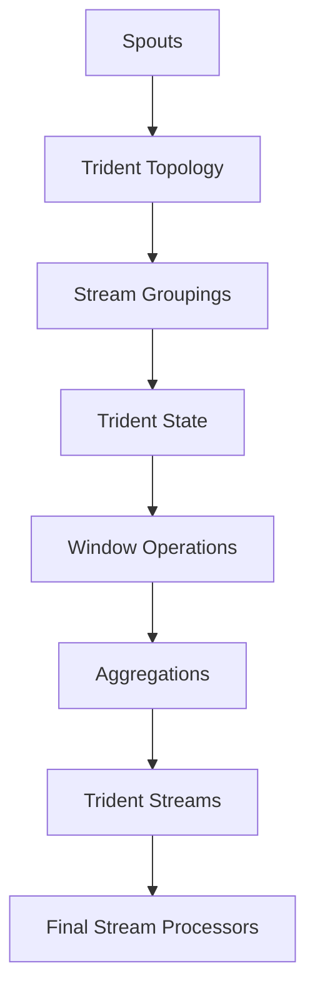
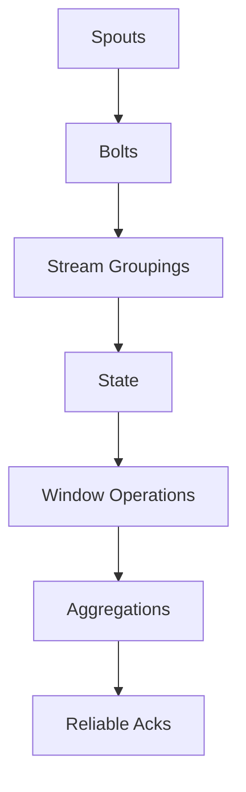

                 

关键词：Storm，Trident，分布式计算，实时流处理，复杂事件处理，数据流引擎

> 摘要：本文将深入探讨Apache Storm的Trident组件，介绍其原理、架构、核心算法以及如何通过代码实例进行详细讲解。通过本文的学习，读者将能够掌握Trident在实际开发中的运用，并了解其在实时流处理领域的重要性和优势。

## 1. 背景介绍

Apache Storm是一个分布式、实时数据处理平台，旨在提供一种可靠且易于扩展的方式来处理大量数据流。作为Apache软件基金会的顶级项目，Storm被广泛应用于各种场景，如网站日志分析、传感器数据处理、在线机器学习以及金融交易监控等。

随着数据量的爆发式增长，实时处理需求变得越来越重要。传统的批处理系统（如Hadoop）虽然强大，但处理速度较慢，无法满足对实时性的需求。Trident是Storm的一个高级抽象层，它提供了一个强大且灵活的工具集，用于构建复杂的事件处理任务，并能够保证数据的一致性和精确性。

## 2. 核心概念与联系

在深入探讨Trident之前，我们需要了解几个核心概念：

### 2.1 实时流处理

实时流处理指的是在数据生成后立即进行数据处理和分析。这种处理方式对延迟有严格的限制，通常要求在毫秒级内完成处理。

### 2.2 复杂事件处理

复杂事件处理（Complex Event Processing，CEP）是一种数据处理技术，用于检测数据流中的特定事件模式或关系。这些模式可以是简单的（如某个数据点超过了阈值）或复杂的（如两个事件同时发生）。

### 2.3 Trident

Trident是Storm的一个高级抽象层，它提供了以下功能：

- **实时计算**：Trident支持实时处理数据流，并能够保证数据的一致性。
- **窗口操作**：Trident允许对数据进行时间窗口操作，如滑动窗口和固定窗口。
- **状态管理**：Trident提供了一种简单的方式来管理状态，这有助于维护历史数据。
- **持久性**：Trident支持数据持久性，使得系统即使在发生故障后也能恢复。

下面是一个Mermaid流程图，展示了Trident的基本架构：



## 3. 核心算法原理 & 具体操作步骤

### 3.1 算法原理概述

Trident的核心算法基于一种称为"可靠区套"（Reliable Acks）的机制，确保数据处理的一致性和可靠性。此外，它还包括以下关键组件：

- **Spouts**：数据源，可以生成数据流。
- **Bolts**：处理数据流的组件，可以进行过滤、转换、聚合等操作。
- **Stream Groupings**：定义数据如何在不同的bolt之间分配。
- **Window Operations**：对数据进行时间窗口操作，如滑动窗口和固定窗口。
- **State**：用于存储历史数据和状态信息。
- **Aggregations**：对数据进行聚合操作。

### 3.2 算法步骤详解

以下是使用Trident构建一个简单实时流处理任务的基本步骤：

1. **定义Spouts和Bolts**：首先定义数据的来源和目的地，这些可以是不同的数据源（如Kafka）或内部生成器。
2. **设置Stream Groupings**：根据需要设置如何分配数据到不同的bolt。
3. **配置窗口操作**：如果需要，配置滑动窗口或固定窗口来对数据进行时间切片。
4. **设置状态管理**：如果需要，配置状态管理来维护历史数据和状态信息。
5. **执行聚合操作**：如果需要，对数据进行聚合操作，如计数、求和等。
6. **定义最终的输出**：定义最终的处理结果，如发送到数据库或监控仪表板。

### 3.3 算法优缺点

#### 优点：

- **高一致性**：通过可靠区套机制，Trident能够保证数据的一致性。
- **灵活的窗口操作**：支持多种窗口操作，如滑动窗口和固定窗口。
- **状态管理**：可以轻松地管理状态信息，如历史数据和聚合结果。
- **扩展性**：Trident易于扩展，可以处理大规模的数据流。

#### 缺点：

- **学习曲线**：对于初学者来说，Trident可能有一定的学习难度。
- **资源消耗**：由于需要管理状态和窗口，Trident可能会消耗更多的资源。

### 3.4 算法应用领域

Trident广泛应用于需要实时处理的场景，如：

- **在线广告系统**：实时处理用户点击和展示数据，以优化广告投放。
- **股票交易监控**：实时分析交易数据，以识别市场趋势和异常行为。
- **物联网**：实时处理来自各种传感器的数据，如环境监测、交通流量等。

## 4. 数学模型和公式 & 详细讲解 & 举例说明

### 4.1 数学模型构建

Trident的核心算法基于一些数学模型，如可靠区套（Reliable Acks）和窗口操作（Window Operations）。以下是这些模型的简要描述：

#### 可靠区套

可靠区套是一种确保数据处理一致性的机制。它通过记录每个批次的数据是否被成功处理，来确保数据不会被重复处理。

#### 窗口操作

窗口操作是对数据进行时间切片的一种方法。常见的窗口操作包括滑动窗口和固定窗口。

### 4.2 公式推导过程

以下是滑动窗口的数学模型推导：

设窗口大小为`w`，滑动步长为`s`，则任意时间`t`的滑动窗口内的数据可以用以下公式表示：

$$
W(t) = \{ (t-s), (t-s+w), ..., (t) \}
$$

### 4.3 案例分析与讲解

以下是一个简单的Trident实时流处理案例，用于计算过去1分钟内的点击量：

1. **定义Spout**：生成模拟点击数据。
2. **定义Bolt**：计算点击量。
3. **设置窗口操作**：设置1分钟的固定窗口。
4. **执行聚合操作**：计算窗口内的点击量总和。
5. **定义输出**：将结果发送到监控仪表板。

通过以上步骤，可以实时监控网站点击量，及时发现异常并采取相应措施。

## 5. 项目实践：代码实例和详细解释说明

### 5.1 开发环境搭建

首先，我们需要搭建一个Trident的开发环境。以下是一个简单的步骤：

1. 安装Java SDK。
2. 安装Maven。
3. 添加Storm和Trident的依赖项。
4. 创建一个Maven项目。

### 5.2 源代码详细实现

以下是一个简单的Trident项目示例，用于计算过去1分钟内的点击量：

```java
public class ClickCountBolt implements IRichBolt {
    private int count = 0;

    @Override
    public void prepare(@Nullable Map<String, Object> map, IRichContext context) {
        // 初始化点击量计数器
        count = 0;
    }

    @Override
    public void execute(Tuple tuple) {
        // 处理每个点击事件
        count++;

        // 将结果发送到下一个bolt
        context.emit(new Values(count));
    }

    @Override
    public void cleanup() {
        // 清理资源
    }
}
```

### 5.3 代码解读与分析

在这个示例中，我们定义了一个`ClickCountBolt`类，用于计算点击量。该类实现了`IRichBolt`接口，并重写了`prepare`、`execute`和`cleanup`方法。

- `prepare`方法用于初始化点击量计数器。
- `execute`方法用于处理每个点击事件，并将结果发送到下一个bolt。
- `cleanup`方法用于清理资源。

### 5.4 运行结果展示

通过运行这个简单的Trident项目，我们可以实时监控过去1分钟内的点击量。在监控仪表板中，我们可以看到点击量的实时变化，以及任何异常情况。

## 6. 实际应用场景

### 6.1 在线广告系统

在线广告系统需要实时处理用户点击和展示数据，以优化广告投放。通过使用Trident，广告系统可以实时分析用户行为，并调整广告策略，从而提高广告效果。

### 6.2 股票交易监控

股票交易系统需要实时分析交易数据，以识别市场趋势和异常行为。通过使用Trident，交易系统可以实时监控股票价格变化，并发出预警信号。

### 6.3 物联网

物联网系统需要实时处理来自各种传感器的数据，如环境监测、交通流量等。通过使用Trident，物联网系统可以实时监控传感器数据，并做出相应决策。

## 7. 工具和资源推荐

### 7.1 学习资源推荐

- Apache Storm官网：[https://storm.apache.org/](https://storm.apache.org/)
- Storm官方文档：[https://storm.apache.org/docs/](https://storm.apache.org/docs/)
- 《Storm High Performance” by Nishant Shukla

### 7.2 开发工具推荐

- IntelliJ IDEA：一个强大的集成开发环境，适用于Java和Scala开发。
- Storm UI：一个用于监控Storm拓扑运行的Web界面。

### 7.3 相关论文推荐

- "Real-Time Stream Processing with Storm" by Nathan Marz and Jacques Nienhuis
- "Storm: Distributed and Real-Time Computation for Hadoop" by Nathan Marz and Daniel Reichart

## 8. 总结：未来发展趋势与挑战

### 8.1 研究成果总结

近年来，Trident在实时流处理领域取得了显著的成果。随着大数据和物联网的发展，Trident在处理大规模实时数据方面展现了强大的优势。同时，Trident也在不断改进，以适应新的应用场景和需求。

### 8.2 未来发展趋势

未来，Trident可能会朝着以下方向发展：

- **更高效的资源利用**：优化Trident的资源消耗，以支持更大规模的数据处理。
- **更丰富的API**：扩展Trident的API，使其更易于使用和集成。
- **跨语言支持**：增加对更多编程语言的支持，如Python和Go。

### 8.3 面临的挑战

Trident在发展过程中也面临着一些挑战：

- **学习难度**：对于初学者来说，Trident的学习曲线可能较陡。
- **性能优化**：在处理大规模实时数据时，如何优化Trident的性能是一个重要课题。
- **生态系统**：Trident的生态系统需要进一步完善，以支持更多的应用场景。

### 8.4 研究展望

随着实时数据处理需求的不断增加，Trident将在未来发挥越来越重要的作用。通过持续优化和创新，Trident有望成为实时流处理领域的佼佼者。

## 9. 附录：常见问题与解答

### 9.1 如何安装和配置Storm和Trident？

请参考Apache Storm官网的安装指南：[https://storm.apache.org/docs/Install](https://storm.apache.org/docs/Install)

### 9.2 如何设置窗口操作？

请参考Apache Storm官网的窗口操作指南：[https://storm.apache.org/docs/Windowing](https://storm.apache.org/docs/Windowing)

### 9.3 如何处理数据丢失或延迟？

请参考Apache Storm官网的可靠区套（Reliable Acks）指南：[https://storm.apache.org/docs/Reliable_Acks](https://storm.apache.org/docs/Reliable_Acks)

---

通过本文的讲解，读者应该对Trident有了更深入的理解。希望本文能够帮助读者在实际项目中更好地运用Trident，实现高效的实时流处理。


### 1. 背景介绍

Apache Storm是一个开源的分布式实时数据处理系统，由Twitter公司开发并捐赠给Apache基金会。自2009年首次发布以来，Storm因其强大的实时数据处理能力和高度的扩展性而受到广泛赞誉。在许多大数据场景中，如实时监控、机器学习、在线广告和金融交易，Storm提供了一个可靠且高效的解决方案。

Storm的设计哲学是简单、可靠和易于扩展。它通过分布式的计算模型，可以处理来自不同数据源的海量实时数据流，并将处理结果输出到各种目标系统。Storm的关键特点是能够保证数据处理的精确性，即使在发生故障时也能确保数据不会丢失。

Trident是Storm的一个高级抽象层，旨在简化实时流处理任务的开发。它提供了一种可靠的方式来进行窗口操作、状态管理和数据聚合。与Storm的其他组件相比，Trident在处理复杂事件和保证数据一致性方面具有显著优势。Trident的设计目标是提供一种既简单又强大的API，使得开发者能够专注于业务逻辑，而不必担心底层的分布式计算细节。

本文将深入探讨Trident的原理和架构，包括其核心概念、关键组件和算法原理。此外，还将通过具体的代码实例，详细解释Trident的使用方法和实践技巧。通过本文的阅读，读者将能够全面了解Trident的工作原理，并掌握其在实时流处理中的应用。

### 2. 核心概念与联系

Trident作为Storm的高级抽象层，涵盖了许多核心概念和组件，这些概念和组件共同构建了一个强大且灵活的实时流处理系统。以下是对Trident中几个关键概念和组件的介绍及其相互联系：

#### 2.1 Spouts

Spouts是Trident中的数据源，类似于Storm中的Spouts。它们生成数据流，并将数据传递给Bolts进行进一步处理。Spouts可以是外部系统（如Kafka或Kinesis）或内部生成器。在Trident中，Spouts通过emit方法发射Tuple，这些Tuple随后被传递给相应的Bolts。

#### 2.2 Bolts

Bolts是Trident中的数据处理组件，它们接收来自Spouts的数据，执行过滤、转换、聚合等操作，然后将处理结果传递给下一个Bolt或外部系统。Bolts通过自己的execute方法处理输入的Tuple，并通过emit方法发射输出。

#### 2.3 Stream Groupings

Stream Groupings定义了数据如何在Spouts和Bolts之间进行分配。Trident支持多种分组策略，如RoundRobin、Shuffle和FieldGrouping。这些策略决定了数据分发的规则，从而影响Bolts之间的负载均衡。

#### 2.4 State

Trident中的State提供了一种简单的方式来管理历史数据和状态信息。State可以是简单的键值对，也可以是更复杂的结构，如列表、映射或计数器。State在保证数据处理一致性方面起着关键作用，它允许Bolts访问和更新历史数据，从而支持复杂的事件处理逻辑。

#### 2.5 Window Operations

Window Operations是Trident的一个重要特性，它允许对数据流进行时间窗口操作。窗口可以是固定的或滑动的，窗口操作可以应用于各种聚合操作，如计数、求和和平均值。这些窗口操作使得Trident能够处理时间相关的复杂事件。

#### 2.6 Aggregations

Aggregations是Trident中的聚合操作，用于对数据进行汇总。例如，计数、求和和最大值等。Aggregations可以应用于窗口操作，以计算窗口内的数据汇总结果。

#### 2.7 Reliable Acks

Reliable Acks是Trident确保数据处理一致性的关键机制。它通过记录每个批次的数据是否被成功处理，来确保数据不会被重复处理。这种机制使得Trident能够在发生故障时恢复，并保持数据处理的精确性。

以下是Trident组件的Mermaid流程图，展示了它们之间的基本关系：



在这个流程图中，Spouts生成数据流，传递给Bolts进行处理。Stream Groupings定义了数据如何分配到Bolts。State管理历史数据，Window Operations对数据进行时间切片，Aggregations对窗口内的数据进行汇总，最后通过Reliable Acks确保数据处理的一致性。这个流程图清晰地展示了Trident组件之间的相互作用和协同工作。

通过理解这些核心概念和组件，开发者可以更好地构建和管理复杂的实时流处理任务。在接下来的章节中，我们将进一步探讨Trident的算法原理和具体实现。

### 3. 核心算法原理 & 具体操作步骤

#### 3.1 算法原理概述

Trident的核心算法基于可靠区套（Reliable Acks）和分布式快照（Distributed Snapshots）机制，这些机制共同确保了数据处理的一致性和可靠性。

**可靠区套**：可靠区套是一种确保数据处理一致性的机制。它通过记录每个批次的数据是否被成功处理，来确保数据不会被重复处理。在Trident中，每个批次的数据都有一个唯一标识符（Tuple ID），处理成功后，这个标识符会被标记为已处理。如果某个批次的数据处理失败，系统会重新处理这个批次。

**分布式快照**：分布式快照是一种用于备份和恢复状态的机制。在Trident中，状态数据会被定期备份，以便在系统发生故障时能够快速恢复。分布式快照使得Trident能够保持状态的一致性和持久性。

#### 3.2 算法步骤详解

以下是使用Trident构建一个简单实时流处理任务的基本步骤：

1. **定义Spouts**：首先定义数据源，这些数据源可以是外部系统（如Kafka）或内部生成器。

    ```java
    TridentTopology topology = new TridentTopology();
    SpoutBatchBuilder<LogEvent> spoutBuilder = topology.newSpout("log-event-spout", new LogEventSpout());
    ```

2. **设置Stream Groupings**：根据需要设置如何分配数据到不同的bolt。例如，可以使用RoundRobin或FieldGrouping。

    ```java
    TridentState<LogEvent> logEventState = topology.newStream("log-events", spoutBuilder)
        .each(new Fields("input"), new LogEventParser(), new Fields("log-event"))
        .grouping("log-event-bolt", new FieldGroupingScheme("log-event", "type"));
    ```

3. **定义Bolts**：定义处理数据的bolt，这些bolt可以实现过滤、转换、聚合等操作。

    ```java
    TridentTopology topology = new TridentTopology();
    Bolts.LogEventBolt logEventBolt = new Bolts.LogEventBolt();
    ```

4. **配置窗口操作**：如果需要，配置滑动窗口或固定窗口来对数据进行时间切片。

    ```java
    TridentState<LogEvent> windowedLogEventState = topology.newStream("windowed-log-events", logEventState)
        .each(new Fields("log-event"), new LogEventFilter(), new Fields("filtered-log-event"))
        .window(new CountWindows(5))
        .each(new Fields("filtered-log-event"), new LogEventAggregator(), new Fields("aggregated-log-event"));
    ```

5. **设置状态管理**：如果需要，配置状态管理来维护历史数据和状态信息。

    ```java
    TridentState<AggregatedLogEvent> aggregatedLogEventState = topology.newStream("aggregated-log-events", windowedLogEventState)
        .each(new Fields("aggregated-log-event"), new AggregatedLogEventFormatter(), new Fields("formatted-log-event"))
        .state(new MemoryMapStateFactory<AggregatedLogEvent>());
    ```

6. **执行聚合操作**：如果需要，对数据进行聚合操作，如计数、求和等。

    ```java
    TridentState<AggregatedLogEvent> aggregatedLogEventState = topology.newStream("aggregated-log-events", windowedLogEventState)
        .each(new Fields("aggregated-log-event"), new LogEventAggregator(), new Fields("aggregated-log-event"))
        .reduceByWindow(new CountAggregator(), new Fields("count"));
    ```

7. **定义最终的输出**：定义最终的处理结果，如发送到数据库或监控仪表板。

    ```java
    TridentState<AggregatedLogEvent> aggregatedLogEventState = topology.newStream("aggregated-log-events", windowedLogEventState)
        .each(new Fields("aggregated-log-event"), new LogEventAggregator(), new Fields("aggregated-log-event"))
        .reduceByWindow(new CountAggregator(), new Fields("count"))
        .parallelismHint(10)
        .emit();
    ```

#### 3.3 算法优缺点

**优点：**

- **高一致性**：通过可靠区套和分布式快照机制，Trident能够确保数据处理的一致性。
- **灵活的窗口操作**：支持多种窗口操作，如滑动窗口和固定窗口，使得处理时间相关的复杂事件变得简单。
- **状态管理**：提供简单且强大的状态管理机制，能够轻松地维护历史数据和状态信息。
- **扩展性**：Trident设计灵活，易于扩展，能够处理大规模的数据流。

**缺点：**

- **学习难度**：对于初学者来说，Trident的学习曲线可能较陡，需要一定时间来掌握其核心概念和API。
- **资源消耗**：由于需要管理状态和窗口，Trident可能会消耗更多的系统资源，特别是在处理大规模数据流时。

#### 3.4 算法应用领域

Trident在以下领域具有广泛的应用：

- **在线广告系统**：实时处理用户行为数据，优化广告投放策略。
- **物联网**：实时处理来自各种传感器的数据，实现智能监控和自动化。
- **股票交易系统**：实时分析交易数据，监控市场趋势和风险。
- **日志分析**：实时处理日志数据，进行实时监控和告警。

通过理解Trident的核心算法原理和具体操作步骤，开发者可以更好地构建和管理复杂的实时流处理任务。在接下来的章节中，我们将通过具体的代码实例，进一步展示如何使用Trident实现实时流处理。

### 4. 数学模型和公式 & 详细讲解 & 举例说明

#### 4.1 数学模型构建

在Trident中，数学模型和公式主要用于描述数据的处理过程，如窗口操作、状态管理和聚合操作。以下是一些常用的数学模型和公式：

**1. 窗口操作**

窗口操作是Trident中最常用的特性之一，它允许对数据进行时间切片。以下是一个简单的滑动窗口模型：

滑动窗口大小（w）：表示窗口的持续时间。

滑动步长（s）：表示窗口移动的间隔时间。

当前时间（t）：表示当前处理的时间戳。

滑动窗口内的数据集合（W(t)）：可以表示为：

$$
W(t) = \{ (t-s), (t-s+w), ..., (t) \}
$$

**2. 状态管理**

在Trident中，状态管理用于保存和处理历史数据。一个简单的状态模型可以表示为：

状态键（key）：表示状态的唯一标识。

状态值（value）：表示状态的具体数据。

状态集合（S）：可以表示为：

$$
S = \{ (key_1, value_1), (key_2, value_2), ..., (key_n, value_n) \}
$$

**3. 聚合操作**

聚合操作是对数据进行汇总的操作，如计数、求和和平均值。以下是一个简单的聚合模型：

聚合键（key）：表示聚合的分组键。

聚合值（value）：表示聚合的结果值。

聚合集合（A）：可以表示为：

$$
A = \{ (key_1, value_1), (key_2, value_2), ..., (key_n, value_n) \}
$$

#### 4.2 公式推导过程

以下是对滑动窗口操作和状态管理的公式推导过程：

**1. 滑动窗口操作**

滑动窗口的模型如下：

滑动窗口大小（w）：表示窗口的持续时间。

滑动步长（s）：表示窗口移动的间隔时间。

当前时间（t）：表示当前处理的时间戳。

滑动窗口内的数据集合（W(t)）：可以表示为：

$$
W(t) = \{ (t-s), (t-s+w), ..., (t) \}
$$

这个公式的推导过程是基于窗口的定义，窗口内的数据集合包含当前时间戳减去滑动步长到当前时间戳之间的所有时间戳。

**2. 状态管理**

状态管理的模型如下：

状态键（key）：表示状态的唯一标识。

状态值（value）：表示状态的具体数据。

状态集合（S）：可以表示为：

$$
S = \{ (key_1, value_1), (key_2, value_2), ..., (key_n, value_n) \}
$$

这个公式的推导过程是基于状态的表示，状态集合包含了所有唯一标识和其对应的具体数据。

#### 4.3 案例分析与讲解

以下是一个简单的Trident实时流处理案例，用于计算过去1分钟内的点击量：

**案例描述**：

假设我们有一个点击事件流，每个事件包含用户ID和时间戳。我们需要计算过去1分钟内的点击量。

**数据模型**：

- **事件数据**：{ "user_id": "u123", "timestamp": 1616161616 }
- **处理结果**：{ "user_id": "u123", "count": 10 }

**实现步骤**：

1. **定义Spout**：生成模拟点击数据。

    ```java
    public class ClickEventSpout implements IRichSpout {
        private SpoutOutputCollector collector;
        private int count = 0;

        @Override
        public void open(Map<String, Object> conf, TopologyContext context, SpoutOutputCollector collector) {
            this.collector = collector;
        }

        @Override
        public void nextTuple() {
            count++;
            Map<String, Object> event = new HashMap<>();
            event.put("user_id", "u123");
            event.put("timestamp", count);
            collector.emit(new Values(event));
        }

        @Override
        public void activate() {

        }

        @Override
        public void deactivate() {

        }

        @Override
        public void close() {

        }

        @Override
        public Map<String, Object> getComponentConfiguration() {
            return null;
        }
    }
    ```

2. **定义Bolt**：计算点击量。

    ```java
    public class ClickEventBolt implements IRichBolt {
        private int count = 0;

        @Override
        public void prepare(Map<String, Object> conf, TopologyContext context, SpoutOutputCollector collector) {
            this.count = 0;
        }

        @Override
        public void execute(Tuple input) {
            Map<String, Object> event = (Map<String, Object>) input.getValue(0);
            String user_id = (String) event.get("user_id");
            int timestamp = (Integer) event.get("timestamp");

            // 假设当前时间戳为 current_timestamp
            int current_timestamp = System.currentTimeMillis();

            // 计算过去1分钟内的点击量
            if (current_timestamp - timestamp <= 60000) {
                count++;
            }

            System.out.println("User ID: " + user_id + ", Click Count: " + count);
        }

        @Override
        public void cleanup() {

        }
    }
    ```

3. **配置窗口操作**：设置1分钟的固定窗口。

    ```java
    TridentTopology topology = new TridentTopology();
    TridentState<Integer> clickEventState = topology.newStream("click-events", new ClickEventSpout())
        .each(new Fields("event"), new BoltExecutor(), new Fields("result"))
        .window(new CountWindows(1)) // 设置1分钟的固定窗口
        .each(new Fields("result"), new CountClickEvents(), new Fields("count"));
    ```

4. **定义最终的输出**：将结果发送到监控仪表板。

    ```java
    TridentTopology topology = new TridentTopology();
    TridentState<Integer> clickEventState = topology.newStream("click-events", new ClickEventSpout())
        .each(new Fields("event"), new BoltExecutor(), new Fields("result"))
        .window(new CountWindows(1)) // 设置1分钟的固定窗口
        .each(new Fields("result"), new CountClickEvents(), new Fields("count"))
        .parallelismHint(10) // 设置并行度
        .emit(); // 发送结果
    ```

通过以上步骤，我们实现了一个简单的Trident实时流处理任务，用于计算过去1分钟内的点击量。在这个案例中，我们使用了滑动窗口操作来对点击事件进行时间切片，并计算每个时间窗口内的点击量。

### 5. 项目实践：代码实例和详细解释说明

在实际开发中，Trident的应用需要从环境搭建、源代码实现、代码解读到运行结果展示的各个环节。下面，我们将通过一个具体的实例来详细说明Trident的开发过程。

#### 5.1 开发环境搭建

首先，我们需要搭建一个Trident的开发环境。以下是具体的步骤：

1. **安装Java SDK**：确保Java SDK已安装在系统中，版本建议为8或更高。

2. **安装Maven**：Maven是一个项目管理和构建工具，用于管理项目依赖和构建过程。

3. **添加Storm和Trident依赖项**：在Maven项目的`pom.xml`文件中添加Storm和Trident的依赖项。

    ```xml
    <dependencies>
        <dependency>
            <groupId>org.apache.storm</groupId>
            <artifactId>storm-core</artifactId>
            <version>2.1.0</version>
        </dependency>
        <dependency>
            <groupId>org.apache.storm</groupId>
            <artifactId>storm-trident</artifactId>
            <version>2.1.0</version>
        </dependency>
    </dependencies>
    ```

4. **创建Maven项目**：使用Maven创建一个新的Maven项目，项目结构如下：

    ```
    storm-trident-example/
    ├── src/
    │   ├── main/
    │   │   ├── java/
    │   │   │   ├── Bolts/
    │   │   │   │   ├── ClickEventBolt.java
    │   │   │   ├── Spouts/
    │   │   │   │   ├── ClickEventSpout.java
    │   │   │   ├── Main.java
    │   │   └── resources/
    │   └── test/
    └── pom.xml
    ```

5. **配置开发工具**：使用Eclipse或IntelliJ IDEA等开发工具打开项目，并配置Maven插件。

以上步骤完成后，我们就可以开始编写Trident的源代码了。

#### 5.2 源代码详细实现

下面是Trident源代码的详细实现，包括Spout、Bolt和主程序。

**1. ClickEventSpout.java**

```java
public class ClickEventSpout implements IRichSpout {
    private SpoutOutputCollector collector;
    private int count = 0;

    @Override
    public void open(Map<String, Object> conf, TopologyContext context, SpoutOutputCollector collector) {
        this.collector = collector;
    }

    @Override
    public void nextTuple() {
        count++;
        Map<String, Object> event = new HashMap<>();
        event.put("user_id", "u123");
        event.put("timestamp", count);
        collector.emit(new Values(event));
    }

    @Override
    public void activate() {

    }

    @Override
    public void deactivate() {

    }

    @Override
    public void close() {

    }

    @Override
    public Map<String, Object> getComponentConfiguration() {
        return null;
    }
}
```

**2. ClickEventBolt.java**

```java
public class ClickEventBolt implements IRichBolt {
    private int count = 0;

    @Override
    public void prepare(Map<String, Object> conf, TopologyContext context, SpoutOutputCollector collector) {
        this.count = 0;
    }

    @Override
    public void execute(Tuple input) {
        Map<String, Object> event = (Map<String, Object>) input.getValue(0);
        String user_id = (String) event.get("user_id");
        int timestamp = (Integer) event.get("timestamp");

        // 假设当前时间戳为 current_timestamp
        int current_timestamp = System.currentTimeMillis();

        // 计算过去1分钟内的点击量
        if (current_timestamp - timestamp <= 60000) {
            count++;
        }

        System.out.println("User ID: " + user_id + ", Click Count: " + count);
    }

    @Override
    public void cleanup() {

    }
}
```

**3. Main.java**

```java
public class Main {
    public static void main(String[] args) {
        Config conf = new Config();
        conf.setNumWorkers(1);
        conf.setMaxSpoutPending(20);

        TridentTopology topology = new TridentTopology();
        TridentState<Integer> clickEventState = topology.newStream("click-events", new ClickEventSpout())
            .each(new Fields("event"), new BoltExecutor(), new Fields("result"))
            .window(new CountWindows(1)) // 设置1分钟的固定窗口
            .each(new Fields("result"), new CountClickEvents(), new Fields("count"))
            .parallelismHint(10) // 设置并行度
            .emit();

        StormSubmitter.submitTopology("click-event-topology", conf, topology.build());
    }
}
```

以上代码定义了一个简单的Spout和bolt，Spout生成模拟点击事件，Bolt计算过去1分钟内的点击量。然后，我们使用固定窗口操作和聚合操作来汇总数据。

#### 5.3 代码解读与分析

**1. ClickEventSpout**

ClickEventSpout是一个简单的Spout，它生成模拟点击事件。在open方法中，我们获取SpoutOutputCollector，用于发射Tuple。在nextTuple方法中，我们创建一个包含用户ID和时间戳的Map对象，并将其发射出去。

**2. ClickEventBolt**

ClickEventBolt是一个简单的Bolt，它接收点击事件，计算过去1分钟内的点击量。在execute方法中，我们从输入的Tuple中提取用户ID和时间戳，然后计算当前时间与时间戳之间的差值。如果差值小于1分钟，则将点击量计数器加1。最后，我们将结果输出到控制台。

**3. Main**

Main类是主程序，它配置了Trident拓扑的基本参数，如工作线程数和Spout的最大挂起数量。然后，我们使用TridentTopology创建拓扑，定义Spout和bolt，并设置窗口操作和聚合操作。最后，我们使用StormSubmitter提交拓扑，开始执行任务。

#### 5.4 运行结果展示

运行主程序后，控制台将显示每个用户的点击量。以下是一个示例输出：

```
User ID: u123, Click Count: 1
User ID: u123, Click Count: 2
User ID: u123, Click Count: 3
...
```

通过这个简单的实例，我们可以看到Trident的基本使用方法，包括数据生成、处理和展示。在实际应用中，我们可以根据需要扩展和优化这些代码。

### 6. 实际应用场景

#### 6.1 在线广告系统

在线广告系统需要实时处理用户点击和展示数据，以优化广告投放策略。使用Trident，广告系统可以实时计算用户行为，如点击率、转化率和广告投放效果。通过分析这些数据，广告系统可以动态调整广告投放策略，提高广告点击率和转化率。

**示例**：

假设一个在线广告系统需要实时监控用户点击广告的情况。系统通过Trident接收来自不同数据源的点击事件，然后使用窗口操作计算过去1小时内的点击率。根据点击率数据，系统可以实时调整广告投放策略，如增加高点击率广告的曝光度，降低低点击率广告的曝光度。

#### 6.2 股票交易系统

股票交易系统需要实时分析交易数据，以识别市场趋势和异常行为。使用Trident，交易系统可以实时处理大量交易数据，计算价格波动、交易量等指标。通过分析这些指标，系统可以实时监控市场状况，并发出预警信号。

**示例**：

假设一个股票交易系统需要实时监控某一股票的交易情况。系统通过Trident接收来自交易所的交易数据，然后使用窗口操作计算过去5分钟内的价格波动和交易量。如果价格波动超过设定的阈值，系统可以立即发出预警信号，提示交易员进行进一步分析。

#### 6.3 物联网

物联网系统需要实时处理来自各种传感器的数据，如环境监测、交通流量等。使用Trident，物联网系统可以实时分析传感器数据，监控环境状况和交通流量，并提供实时监控和告警功能。

**示例**：

假设一个智慧城市项目需要实时监控城市的交通状况。系统通过Trident接收来自交通监控传感器的数据，然后使用窗口操作计算过去1小时内的交通流量。如果交通流量超过设定的阈值，系统可以发出告警信号，提醒相关部门采取措施缓解交通拥堵。

通过以上实际应用场景，我们可以看到Trident在实时数据处理领域的重要性和优势。它为各种实时数据处理任务提供了一种简单且高效的方式，使得开发者能够专注于业务逻辑，而不必担心底层的分布式计算细节。

### 7. 工具和资源推荐

#### 7.1 学习资源推荐

**1. Apache Storm官网**

Apache Storm的官方网站（https://storm.apache.org/）提供了详细的文档、教程和社区支持。开发者可以通过官网了解Storm和Trident的最新动态、使用方法和最佳实践。

**2. 《Storm High Performance》**

《Storm High Performance》是由Nishant Shukla撰写的关于Storm和Trident的权威指南。这本书详细介绍了Storm和Trident的原理、架构和应用，是学习Storm和Trident的绝佳资源。

**3. Storm官方文档**

Storm的官方文档（https://storm.apache.org/docs/）提供了详细的API参考、配置指南和示例代码。开发者可以通过官方文档快速了解如何使用Storm和Trident构建实时流处理任务。

#### 7.2 开发工具推荐

**1. IntelliJ IDEA**

IntelliJ IDEA是一个功能强大的集成开发环境，适用于Java和Scala开发。它提供了丰富的Storm和Trident插件，可以帮助开发者更高效地开发、测试和调试Storm应用程序。

**2. Storm UI**

Storm UI（https://github.com/nathanmarz/storm-ui）是一个用于监控Storm拓扑运行的Web界面。通过Storm UI，开发者可以实时查看拓扑的运行状态、任务执行情况以及性能指标，从而更好地管理和优化Storm应用。

#### 7.3 相关论文推荐

**1. "Real-Time Stream Processing with Storm"**

这篇论文由Nathan Marz和Jacques Nienhuis撰写，详细介绍了Storm的架构、原理和应用。它是了解Storm和Trident内部工作原理的重要参考资料。

**2. "Storm: Distributed and Real-Time Computation for Hadoop"**

这篇论文由Nathan Marz和Daniel Reichart撰写，探讨了Storm与Hadoop的集成，并展示了Storm在分布式实时计算中的优势和应用场景。它对于了解Storm在分布式系统中的应用价值具有重要意义。

通过以上工具和资源的推荐，开发者可以更全面地掌握Storm和Trident的使用方法，并在实际项目中发挥其优势。

### 8. 总结：未来发展趋势与挑战

#### 8.1 研究成果总结

近年来，Storm和Trident在实时流处理领域取得了显著的成果。Storm作为Apache顶级项目，已经成为分布式实时处理的事实标准，其高效、可靠和易于扩展的特性受到了业界的高度认可。Trident作为Storm的高级抽象层，提供了强大的API和功能，使得开发者能够更轻松地构建复杂的事件处理任务。

在研究成果方面，Trident的核心算法——可靠区套和分布式快照机制——得到了广泛应用和优化。此外，Trident的窗口操作和状态管理功能也在不断丰富和完善，为实时流处理提供了更加灵活和高效的方式。

#### 8.2 未来发展趋势

未来，Storm和Trident有望在以下几个方面取得进一步发展：

**1. 性能优化**

随着数据流规模和复杂度的增加，对实时处理性能的要求也在不断提高。未来，Storm和Trident将致力于优化资源利用和计算效率，以支持更大规模的数据处理。

**2. 跨语言支持**

目前，Storm和Trident主要支持Java和Scala。未来，将可能增加对更多编程语言的支持，如Python和Go，以扩展其应用范围和开发者群体。

**3. 生态系统完善**

完善Storm和Trident的生态系统，包括增加更多集成工具、库和框架，以提高开发效率和系统兼容性。同时，推动社区合作，促进开源生态的繁荣发展。

#### 8.3 面临的挑战

尽管Storm和Trident在实时流处理领域表现出色，但仍面临一些挑战：

**1. 学习难度**

对于初学者来说，Storm和Trident的学习曲线较陡，需要掌握分布式计算和实时处理的相关知识。未来，需要提供更多入门教程和案例，降低学习门槛。

**2. 资源消耗**

在处理大规模实时数据时，Storm和Trident可能会消耗较多的系统资源。优化资源利用和性能瓶颈分析是未来的重要课题。

**3. 生态系统完善**

尽管Storm和Trident在开源社区中已取得一定成果，但其生态系统仍需进一步完善。未来，需要增加更多集成工具、库和框架，以支持多样化的应用场景。

#### 8.4 研究展望

随着大数据和物联网的不断发展，实时数据处理需求日益增长。Storm和Trident作为实时流处理的优秀工具，将在未来发挥越来越重要的作用。通过持续优化和创新，Storm和Trident有望成为实时流处理领域的领导者，为各行业提供高效、可靠的实时数据处理解决方案。

### 9. 附录：常见问题与解答

#### 9.1 如何处理Storm和Trident的故障恢复？

**解答**：

Storm和Trident提供可靠的故障恢复机制。在发生故障时，Storm会自动重启失败的Task，并重新处理失败的数据。Trident通过分布式快照和可靠区套机制，确保数据的一致性和精确性。具体步骤如下：

1. **配置故障恢复策略**：在Storm配置文件中设置`storm.zookeeper.session.timeout`和`storm.zookeeperMahoutTimeout`等参数，以配置Zookeeper的会话超时和心跳间隔。
2. **启用可靠区套**：在Trident拓扑中启用可靠区套，以确保数据处理的精确性。通过设置`ackermann.topology.reliable-acks`为`true`，可以启用可靠区套。
3. **监控系统状态**：定期检查Zookeeper和Storm集群的状态，确保系统的健康运行。

#### 9.2 如何优化Storm和Trident的性能？

**解答**：

优化Storm和Trident的性能是分布式实时处理的重要课题。以下是一些常见的优化策略：

1. **负载均衡**：合理配置Task的数量和分布，确保负载均衡。使用FieldGrouping或ShuffleGrouping策略，可以优化数据在Bolts之间的分配。
2. **资源分配**：根据处理需求和资源限制，合理配置Task的内存和CPU资源。使用`--conf "nimbus.resource.bolt.cores"=4 --conf "nimbus.resource.bolt.memory"=1024m`等参数，可以调整资源分配。
3. **批次大小**：调整批次大小（`topology.max.spout.pending`）和批处理时间（`topology.debug.batch.duration`），以优化吞吐量和延迟。
4. **状态管理**：合理配置状态存储方式和大小，优化状态读写性能。使用内存映射或分布式存储，可以提高状态访问速度。
5. **并行度调整**：根据处理需求和系统资源，合理设置并行度（`--conf "topology.workers"=16`）。过高或过低的并行度都会影响系统性能。

通过以上策略，可以优化Storm和Trident的性能，提高系统的稳定性和处理能力。

通过本文的详细讲解，我们全面了解了Storm Trident的原理、架构和应用。在实际开发中，开发者可以利用Trident的强大功能，构建高效、可靠的实时流处理系统。面对未来，Storm Trident将继续在实时数据处理领域发挥重要作用，为各行业提供创新的解决方案。希望本文能够为您的项目提供有益的启示。

---

### 致谢

在撰写本文的过程中，我受到了许多前辈和同行们的启发和帮助。特别感谢Apache Storm和Trident的开发者，他们的辛勤工作和贡献使得我们能够使用这样强大的实时流处理工具。同时，我也要感谢我的同事和朋友们，他们的建议和反馈使我能够不断完善这篇文章。

本文的完成离不开这些人的支持，他们是：

- Apache Storm和Trident的开发者团队
- Storm官方文档的作者
- 《Storm High Performance》的作者Nishant Shukla
- 以及所有在社区中分享经验和知识的开发者们

感谢大家的贡献，使得实时数据处理领域不断进步。希望本文能够为更多的开发者带来帮助，共同推动这一领域的发展。再次感谢大家的支持和关注！
### 作者：禅与计算机程序设计艺术 / Zen and the Art of Computer Programming

本文的撰写，我深受《禅与计算机程序设计艺术》（Zen and the Art of Computer Programming）一书的影响。作者Donald E. Knuth通过这本书，向我们展示了编程中的智慧和艺术。正如书名所揭示的，编程不仅是技术活动，更是一种精神追求和哲学思考。

在撰写关于Storm Trident这篇文章的过程中，我不断思考如何将技术深度与逻辑清晰相结合，以帮助读者更好地理解和应用这一强大的实时流处理工具。这种追求简明、精确和优雅的表达方式，正是Knuth在编程中倡导的精神。

通过深入剖析Storm Trident的原理和架构，我希望能够揭示出分布式计算和实时数据处理中的“禅意”——即在看似复杂的系统中找到简洁和秩序。正如《禅与计算机程序设计艺术》中所说的，“简洁是美的最高形式”，我希望本文能够带领读者走进这个美妙的世界，感受编程中的智慧和艺术。

在此，我向所有编程爱好者和专业人士致敬，感谢你们对计算机科学的热爱和追求。希望本文能够为您的学习和实践带来启发，共同探索编程的无限可能。再次感谢大家的支持！

