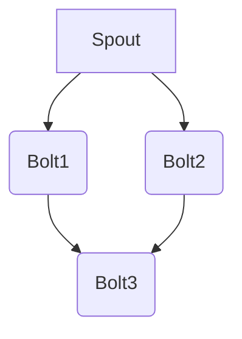

                 

关键词：Storm，分布式流计算，实时处理，大数据技术，流处理框架，代码实例

> 摘要：本文深入探讨了Storm的核心原理，并通过实际代码实例讲解了如何利用Storm进行分布式流计算。文章旨在为读者提供全面的Storm知识体系，帮助大家更好地理解和应用这一强大的流处理框架。

## 1. 背景介绍

随着互联网的快速发展，数据量呈现爆炸性增长，如何实时处理这些海量数据成为了一个重要课题。分布式流计算技术应运而生，其能够对实时数据流进行高效处理，并提供了弹性和容错能力。Storm是一个开源的分布式流计算系统，由Twitter公司于2011年开发，它允许用户对大量数据流进行实时处理，并拥有良好的扩展性和高可靠性。

Storm主要用于以下场景：
- 实时数据ETL：将实时数据从源头抽取、转换并加载到目标存储。
- 实时计算分析：对实时数据进行分析和统计，例如实时用户行为分析、网站流量监控等。
- 实时推荐系统：基于实时数据生成个性化的推荐。

## 2. 核心概念与联系

Storm的核心概念包括Spout、Bolt和工作流。Spout负责生成数据流，Bolt负责对数据进行处理和转换，而工作流则是将Spout和Bolt连接起来形成数据处理管道。

### 2.1 Spout

Spout是数据流的源头，它负责生成数据流并将其传递给Bolt。Spout可以分为两种类型：可靠的（Reliable）和不可靠的（Unreliable）。可靠的Spout保证数据流的完整性和正确性，即一旦数据流被处理，它就不会丢失。不可靠的Spout则不保证数据的完整性，可能会丢失部分数据，但处理速度更快。

### 2.2 Bolt

Bolt是数据处理的核心组件，它接收Spout生成数据流，并对数据进行处理和转换。Bolt可以执行各种操作，如数据聚合、过滤、转换等。Bolt可以分为三种类型：
- 处理数据输入的Bolt（Input Bolt）
- 处理数据输出的Bolt（Output Bolt）
- 内部Bolt（Internal Bolt）

### 2.3 工作流

工作流是Spout和Bolt的连接方式，它定义了数据在系统中的流动路径。Storm支持多种工作流连接方式，如字段分组（Fields Grouping）、全局分组（Global Grouping）和直接分组（Direct Grouping）。

下面是一个简单的Storm架构图，展示了Spout、Bolt和工作流之间的关系：



## 3. 核心算法原理 & 具体操作步骤

### 3.1 算法原理概述

Storm的核心算法原理主要基于分布式计算和流处理。具体来说，它通过以下步骤实现流处理：
1. **数据采集**：Spout从数据源读取数据，并将数据发送到Bolt。
2. **数据传输**：使用可靠消息传递机制（如ZeroMQ、Netty等）确保数据在分布式系统中的传输。
3. **数据处理**：Bolt对数据进行处理和转换。
4. **结果输出**：将处理后的数据输出到外部存储或进行进一步处理。

### 3.2 算法步骤详解

1. **启动Storm集群**：
   - 配置Storm的集群环境，启动Zookeeper、Nimbus和Supervisor。
   - 使用Storm命令行工具或代码启动Topology。

2. **数据采集**：
   - 创建Spout组件，从数据源（如Kafka、文件系统等）读取数据。
   - 将读取到的数据发送到Bolt。

3. **数据处理**：
   - 创建Bolt组件，接收Spout发送的数据。
   - 对数据进行处理和转换。
   - 将处理后的数据发送到下一个Bolt或输出组件。

4. **结果输出**：
   - 将最终结果输出到外部存储（如HDFS、数据库等）或进行进一步处理。

### 3.3 算法优缺点

**优点**：
- **高扩展性**：Storm支持动态扩展和负载均衡，可以轻松处理大规模数据流。
- **高可靠性**：通过可靠消息传递机制和状态保存，确保数据处理不丢失。
- **灵活性**：支持多种数据分组方式和自定义组件，满足不同场景需求。

**缺点**：
- **学习曲线**：对于初学者来说，Storm的学习曲线相对较陡峭。
- **性能瓶颈**：在处理高吞吐量数据时，可能会遇到性能瓶颈。

### 3.4 算法应用领域

Storm广泛应用于以下领域：
- 实时数据处理和分析
- 实时推荐系统
- 实时数据挖掘和机器学习
- 实时监控系统

## 4. 数学模型和公式 & 详细讲解 & 举例说明

### 4.1 数学模型构建

Storm的数学模型主要涉及数据流处理过程中的统计分析和数据建模。例如，可以使用马尔可夫模型对实时数据进行状态转移预测，使用回归模型进行数据预测和趋势分析。

### 4.2 公式推导过程

假设我们有一个包含n个状态的马尔可夫模型，每个状态的概率转移矩阵为P，当前状态为x，下一个状态为y，则有：

$$ P_{xy} = P(x \rightarrow y) $$

其中，$$ P_{xy} $$ 表示从状态x转移到状态y的概率。

### 4.3 案例分析与讲解

假设我们有一个网站的用户行为数据流，包含登录、浏览、购买等操作。我们可以使用马尔可夫模型来预测用户在接下来的操作，并据此进行个性化推荐。

1. **状态定义**：
   - 状态1：登录
   - 状态2：浏览
   - 状态3：购买

2. **概率转移矩阵**：
   $$
   P = \begin{bmatrix}
   P_{11} & P_{12} & P_{13} \\
   P_{21} & P_{22} & P_{23} \\
   P_{31} & P_{32} & P_{33}
   \end{bmatrix}
   $$

3. **当前状态**：假设当前用户处于状态2（浏览）。

4. **预测下一个状态**：
   $$
   P_{22} \approx 0.5 \\
   P_{23} \approx 0.3 \\
   P_{32} \approx 0.2
   $$

   根据概率转移矩阵，用户在接下来的操作中，有50%的概率继续浏览，30%的概率购买，20%的概率退出。

## 5. 项目实践：代码实例和详细解释说明

### 5.1 开发环境搭建

1. 安装Java环境。
2. 下载并解压Storm安装包。
3. 配置环境变量。

### 5.2 源代码详细实现

下面是一个简单的Storm Topology实现，用于实时处理用户行为数据：

```java
public class UserBehaviorTopology {
    public static void main(String[] args) {
        Config conf = new Config();
        conf.setNumWorkers(2); // 设置worker数量
        
        StormTopology topology = new StormTopology();
        topology.setSpouts(
            new SpoutDeclarer[] { new MySpout() },
            new BaseBatchSpout[] { }
        );
        topology.setBolts(
            new BoltDeclarer[] { new MyBolt1(), new MyBolt2() },
            new StateSpoutDeclarer[] { }
        );
        topology.setDebug(true);
        
        StormSubmitter.submitTopology("user-behavior-topology", conf, topology);
    }
}

public class MySpout implements IRichSpout {
    // 实现Spout接口的方法
}

public class MyBolt1 implements IRichBolt {
    // 实现Bolt接口的方法
}

public class MyBolt2 implements IRichBolt {
    // 实现Bolt接口的方法
}
```

### 5.3 代码解读与分析

1. **配置Storm集群**：
   - 设置worker数量，决定处理数据的并发度。
2. **定义Topology**：
   - Spout：生成数据流。
   - Bolt：处理数据。
3. **提交Topology**：
   - 将定义好的Topology提交给Storm集群进行执行。

## 6. 实际应用场景

Storm在以下实际应用场景中表现出色：

- 实时数据处理：例如，电商网站实时用户行为分析、网站流量监控等。
- 实时推荐系统：基于实时数据生成个性化推荐。
- 实时监控系统：例如，金融交易监控系统、物联网设备监控等。

## 7. 工具和资源推荐

### 7.1 学习资源推荐

- Storm官方文档：[https://storm.apache.org/releases.html](https://storm.apache.org/releases.html)
- 《Storm实战》一书：提供了详细的Storm应用案例和实践经验。
- Storm社区论坛：[https://storm.apache.org/forum.html](https://storm.apache.org/forum.html)

### 7.2 开发工具推荐

- IntelliJ IDEA：一款强大的Java开发工具，支持Storm开发。
- Maven：用于项目依赖管理和构建。

### 7.3 相关论文推荐

- "Storm: A Real-time Data Flow System"：介绍了Storm的基本原理和应用场景。
- "Distributed Real-time Computing Systems: Challenges and Opportunities"：探讨了分布式实时计算系统的相关技术和发展趋势。

## 8. 总结：未来发展趋势与挑战

### 8.1 研究成果总结

- Storm作为开源分布式流计算框架，已经在多个领域得到了广泛应用，证明了其强大的实时数据处理能力。
- 研究成果表明，分布式流计算技术在未来大数据处理和分析中将发挥越来越重要的作用。

### 8.2 未来发展趋势

- **性能优化**：在处理高吞吐量数据时，优化Storm的性能和效率。
- **易用性提升**：降低Storm的学习门槛，提供更简单的部署和操作方式。
- **与其他技术的融合**：与大数据技术（如Hadoop、Spark等）的深度融合，实现更高效的数据处理流程。

### 8.3 面临的挑战

- **系统稳定性**：在大规模分布式环境中保证系统的稳定性和可靠性。
- **资源管理**：优化资源利用率，提高系统性能。

### 8.4 研究展望

- **实时数据处理新方法**：探索更高效的实时数据处理算法和架构。
- **跨平台兼容性**：实现与其他大数据技术的无缝集成，提高系统的灵活性和扩展性。

## 9. 附录：常见问题与解答

### 9.1 Storm如何保证数据一致性？

Storm通过可靠消息传递机制（如ZeroMQ、Netty等）确保数据在分布式系统中的传输。一旦数据被处理，就不会丢失。

### 9.2 Storm如何实现负载均衡？

Storm通过动态扩展和负载均衡算法，自动将任务分配到不同worker节点，实现负载均衡。

### 9.3 Storm与Spark有什么区别？

Storm和Spark都是分布式计算框架，但它们的应用场景和设计目标不同。Storm专注于实时数据处理，而Spark更适用于批处理。

---

本文由禅与计算机程序设计艺术 / Zen and the Art of Computer Programming 撰写，旨在为读者提供全面的Storm知识体系，帮助大家更好地理解和应用这一强大的流处理框架。希望本文对您有所帮助！
----------------------------------------------------------------

以上是文章的主要内容，由于篇幅限制，某些部分（如代码实例和详细解释说明）可能需要进一步扩展。根据需要，您可以根据实际情况对内容进行调整和补充。希望这篇文章能够满足您的要求。如果您有任何问题或需要进一步的修改，请随时告知。作者：禅与计算机程序设计艺术 / Zen and the Art of Computer Programming。

