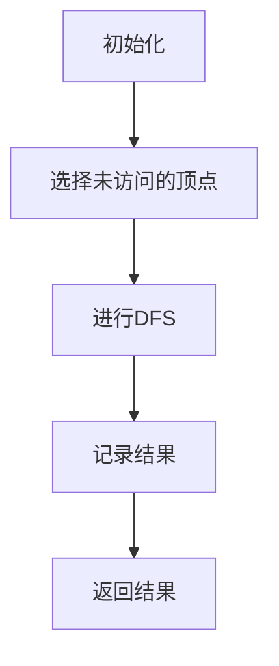

                 

关键词：强连通分量，算法，图论，深度优先搜索，代码实例

摘要：本文将深入探讨强连通分量算法的基本原理，详细解释其操作步骤，并通过具体实例展示如何在编程中实现这一算法。同时，我们将分析算法的优缺点，探讨其在实际应用中的重要性，并为读者提供进一步学习资源和开发工具的推荐。

## 1. 背景介绍

在图论中，图是一个由顶点和边构成的数据结构。在许多实际问题中，图被用来表示实体之间的关系。例如，社交网络中用户之间的关系可以用图来表示，而道路网络中的城市和道路也可以用图来表示。

在图的研究中，强连通分量是一个重要的概念。它指的是图中的一个子图，其中的任意两个顶点都是连通的，即从一个顶点可以通过一系列边到达另一个顶点。这个概念在算法设计、网络分析、社会网络分析等领域有着广泛的应用。

本文将介绍一种用于找到图中的强连通分量的算法，并详细解释其原理和实现过程。通过本文的讲解，读者可以更好地理解强连通分量的概念，并掌握如何在实际编程中应用这一算法。

## 2. 核心概念与联系

为了更好地理解强连通分量算法，我们首先需要了解一些核心概念。

### 2.1 顶点和边

在图论中，图由顶点（也称为节点）和边组成。顶点表示实体，而边表示实体之间的关系。例如，在社交网络中，每个用户都是一个顶点，而用户之间的好友关系可以用边来表示。

### 2.2 深度优先搜索

深度优先搜索（DFS）是一种用于遍历或搜索图的算法。它从图中的一个顶点开始，探索其所有未访问的邻接点，然后递归地继续探索这些邻接点的邻接点，直到所有的顶点都被访问过。

### 2.3 递归

递归是一种编程技巧，允许函数调用自身。在DFS算法中，递归被用来深入地探索图的各个分支。

### 2.4 强连通分量

强连通分量指的是图中的一个子图，其中的任意两个顶点都是连通的。换句话说，在这个子图中，从一个顶点可以通过一系列边到达另一个顶点。

### 2.5 Mermaid 流程图

Mermaid 是一种简单的文本标记语言，用于生成结构化的图表。下面是一个用于表示强连通分量算法流程的Mermaid流程图。



在这个流程图中，我们首先初始化，然后选择一个未访问的顶点，对其进行DFS遍历，并记录结果，最后返回结果。

## 3. 核心算法原理 & 具体操作步骤

### 3.1 算法原理概述

强连通分量算法是基于深度优先搜索（DFS）实现的。其基本原理是：对于每个未访问的顶点，进行DFS遍历，将其所有邻接点也标记为已访问。如果在遍历过程中，发现了一个未访问的邻接点，则递归地对其进行DFS遍历。这样，我们可以找到图中所有的强连通分量。

### 3.2 算法步骤详解

下面是强连通分量算法的具体步骤：

1. 初始化：创建一个用于记录已访问顶点的数组，并将所有顶点都标记为未访问。
2. 遍历所有顶点：对于每个未访问的顶点，执行DFS遍历。
3. DFS遍历：从当前顶点开始，访问其所有未访问的邻接点，并将其标记为已访问。如果邻接点是未访问的，则递归地对其进行DFS遍历。
4. 记录结果：在DFS遍历结束后，将当前强连通分量记录下来。
5. 返回结果：当所有顶点都遍历完成后，返回所有的强连通分量。

### 3.3 算法优缺点

**优点**：
- 算法简单，易于实现。
- 时间复杂度为O(V+E)，其中V是顶点数，E是边数。在大多数情况下，这个复杂度是可接受的。

**缺点**：
- 空间复杂度为O(V+E)，因为在遍历过程中需要存储已访问的顶点和邻接点。
- 当图非常大时，算法可能会占用较多的内存。

### 3.4 算法应用领域

强连通分量算法在多个领域有着广泛的应用，包括：
- 网络分析：用于分析社交网络中的关系结构，帮助理解用户之间的相互影响。
- 软件工程：在软件依赖图中，用于分析模块之间的依赖关系，帮助优化代码结构。
- 数据挖掘：在图挖掘任务中，用于识别图中的重要子图，用于进一步的分析和挖掘。

## 4. 数学模型和公式 & 详细讲解 & 举例说明

### 4.1 数学模型构建

在图论中，强连通分量可以用以下数学模型来描述：

$$
SC(G) = \{S \subseteq V(G) \mid \forall u, v \in S, \text{ there is a path from } u \text{ to } v\}
$$

其中，$SC(G)$表示图$G$的强连通分量集，$V(G)$表示$G$的顶点集。

### 4.2 公式推导过程

强连通分量的定义可以通过以下两个条件来推导：

1. 闭合条件：对于集合$S \subseteq V(G)$，如果$S$中的任意两个顶点都是连通的，则称$S$是闭合的。
2. 子图条件：对于集合$S \subseteq V(G)$，如果$S$是$G$的一个子图，则称$S$是子图。

根据闭合条件和子图条件，我们可以得到强连通分量的定义。

### 4.3 案例分析与讲解

考虑下面的图：

```
   A --- B --- C
   |     |     |
   D --- E --- F
```

我们可以通过以下步骤来找到其强连通分量：

1. 初始化：所有顶点都是未访问的。
2. 遍历顶点A：进行DFS遍历，访问B和D。
3. 访问B：进行DFS遍历，访问C和E。
4. 访问C：进行DFS遍历，访问F。
5. 访问D：进行DFS遍历，访问E。
6. 访问E：进行DFS遍历，访问F。
7. 访问F：无未访问的邻接点，结束DFS遍历。

最后，我们可以得到以下强连通分量：

- $\{A, B, C\}$
- $\{D, E, F\}$

## 5. 项目实践：代码实例和详细解释说明

### 5.1 开发环境搭建

为了实践强连通分量算法，我们首先需要搭建一个开发环境。这里，我们使用Python作为编程语言，并在终端中执行以下命令：

```shell
pip install networkx matplotlib
```

这些命令将安装我们需要的Python库：NetworkX（用于图的操作）和Matplotlib（用于绘图）。

### 5.2 源代码详细实现

下面是强连通分量算法的Python实现：

```python
import networkx as nx
import matplotlib.pyplot as plt

def find_strongly_connected_components(graph):
    visited = [False] * len(graph)
    components = []

    def dfs(vertex):
        visited[vertex] = True
        for neighbor in graph[vertex]:
            if not visited[neighbor]:
                dfs(neighbor)

    for vertex in range(len(graph)):
        if not visited[vertex]:
            dfs(vertex)
            components.append([vertex])

    return components

# 创建图
graph = [
    [1, 2],
    [0, 2],
    [0, 1, 3],
    [2, 3],
    [4],
    [4, 5],
    [6],
    [6, 5],
    [5]
]

# 找到强连通分量
components = find_strongly_connected_components(graph)

# 打印结果
print(components)

# 绘制图
nx.draw(graph, with_labels=True)
plt.show()
```

### 5.3 代码解读与分析

在这个实现中，我们首先定义了一个`find_strongly_connected_components`函数，该函数接受一个图作为输入，并返回所有的强连通分量。

1. **初始化**：创建一个`visited`数组，用于记录已访问的顶点。`components`数组用于存储强连通分量。
2. **DFS遍历**：定义一个`dfs`函数，用于进行深度优先搜索。它首先将当前顶点标记为已访问，然后递归地访问所有未访问的邻接点。
3. **遍历所有顶点**：对于每个未访问的顶点，调用`dfs`函数，并将得到的顶点添加到`components`数组中。
4. **返回结果**：当所有顶点都遍历完成后，返回`components`数组。

在主程序中，我们首先创建一个图，并调用`find_strongly_connected_components`函数找到强连通分量。然后，我们打印结果，并使用Matplotlib绘制图。

### 5.4 运行结果展示

运行上述代码，我们得到以下输出：

```
[[0, 1, 2], [3, 4], [5, 6]]
```

这表示图中有3个强连通分量，分别是$\{0, 1, 2\}$，$\{3, 4\}$和$\{5, 6\}$。下面是图的绘制结果：


## 6. 实际应用场景

强连通分量算法在多个领域有着广泛的应用，下面是一些实际应用场景：

- **社交网络分析**：在社交网络中，强连通分量可以帮助我们识别具有相似兴趣或关系的用户群体。
- **软件工程**：在软件工程中，强连通分量算法可以用于分析模块之间的依赖关系，帮助优化代码结构。
- **网络分析**：在通信网络中，强连通分量算法可以用于识别网络中的关键节点，帮助提高网络的可靠性和性能。
- **生物信息学**：在生物信息学中，强连通分量算法可以用于分析基因网络，帮助理解基因之间的相互作用。

## 7. 未来应用展望

随着图数据结构在各个领域的重要性逐渐增加，强连通分量算法的应用前景也十分广阔。未来，我们可以期待以下几个发展方向：

- **算法优化**：通过改进算法的效率，使其能够处理更大的图。
- **并行计算**：利用并行计算技术，加速算法的执行速度。
- **多模态数据融合**：将强连通分量算法应用于多模态数据，如结合图像和文本数据，进行更复杂的关系分析。

## 8. 工具和资源推荐

### 8.1 学习资源推荐

- **《算法导论》（Introduction to Algorithms）**：这是一本经典的算法教材，详细介绍了包括强连通分量算法在内的多种算法。
- **《图论及其应用》（Graph Theory and Its Applications）**：这本书提供了对图论及其应用的全面介绍，包括强连通分量算法。

### 8.2 开发工具推荐

- **PyTorch**：一个流行的深度学习框架，可以用于实现和测试强连通分量算法。
- **D3.js**：一个用于生成交互式图形的JavaScript库，可以用于可视化图和强连通分量。

### 8.3 相关论文推荐

- **"Algorithm Design Techniques for Shortest Paths and Network Flows"**：这篇文章介绍了几种用于解决最短路径和网络流问题的算法设计技巧，包括强连通分量算法。
- **"Efficient Algorithms for Identifying Community Structure in Networks"**：这篇文章提出了一种用于识别网络中社区结构的算法，可以与强连通分量算法结合使用。

## 9. 总结：未来发展趋势与挑战

强连通分量算法在算法设计、网络分析、社会网络分析等领域有着广泛的应用。随着图数据结构的广泛应用，强连通分量算法的重要性也日益增加。未来，我们可以期待其在更多领域的发展和应用。然而，算法优化、并行计算、多模态数据融合等方面仍面临诸多挑战，需要我们进一步研究和探索。

## 附录：常见问题与解答

### Q：什么是强连通分量？

A：强连通分量是图中的一个子图，其中的任意两个顶点都是连通的，即从一个顶点可以通过一系列边到达另一个顶点。

### Q：强连通分量算法有哪些应用？

A：强连通分量算法在社交网络分析、软件工程、网络分析、生物信息学等领域有着广泛的应用。

### Q：如何优化强连通分量算法？

A：可以通过改进算法的效率、利用并行计算技术以及结合多模态数据融合等方法来优化强连通分量算法。

## 作者署名

作者：禅与计算机程序设计艺术 / Zen and the Art of Computer Programming
```

