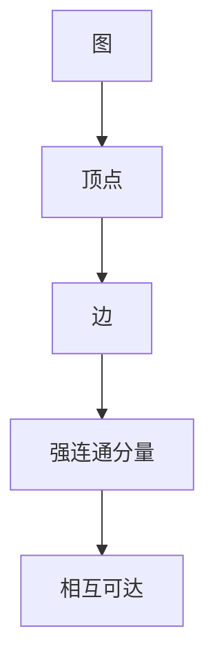
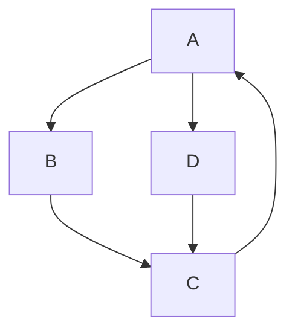

                 

关键词：强连通分量、算法原理、代码实例、深度优先搜索、DFS、图算法、计算机网络、软件工程、复杂网络分析

> 摘要：本文将深入讲解强连通分量（Strongly Connected Components，简称SCC）算法的原理，并通过具体的代码实例展示其应用过程。文章将首先介绍SCC的概念和重要性，然后详细阐述算法的基本原理和步骤，接着提供实际代码实现，最后探讨算法的优缺点及其应用领域。

## 1. 背景介绍

### 强连通分量的概念

在图论中，一个强连通分量是指一个子图，在这个子图中，对于任意两个顶点\( v_1 \)和\( v_2 \)，都存在一条路径使得\( v_1 \)能够到达\( v_2 \)且\( v_2 \)能够到达\( v_1 \)。换句话说，强连通分量中的任意两个顶点都是相互可达的。

### 强连通分量的重要性

强连通分量在很多领域都有重要的应用。例如，在计算机网络中，分析网络中的强连通分量可以帮助我们识别关键节点和关键路径，从而优化网络的稳定性和性能。在软件工程中，强连通分量分析可以用来优化程序结构，减少代码耦合度。在复杂网络分析中，强连通分量可以帮助我们理解网络的结构特性。

## 2. 核心概念与联系

### 核心概念

- **图**：由顶点和边组成的数学结构。
- **顶点**：图中的元素，表示实体或概念。
- **边**：连接两个顶点的线段，表示它们之间的关系。
- **强连通分量**：图中相互可达的顶点集合。

### 架构的 Mermaid 流程图



## 3. 核心算法原理 & 具体操作步骤

### 3.1 算法原理概述

强连通分量算法通常基于深度优先搜索（DFS）来实现。该算法的基本思想是：从图中的某个顶点开始，使用DFS遍历整个图，并记录每个顶点的访问顺序。然后，通过逆序遍历顶点，再次使用DFS来查找强连通分量。

### 3.2 算法步骤详解

1. 初始化：创建一个空列表`SCC`用于存储所有的强连通分量。
2. 遍历所有顶点：使用DFS遍历图，并记录每个顶点的访问顺序。
3. 逆序遍历顶点：按照访问顺序的逆序遍历所有顶点。
4. 查找强连通分量：对于每个顶点，使用DFS查找与该顶点相互可达的所有顶点，并将这些顶点组成一个强连通分量，添加到`SCC`列表中。

### 3.3 算法优缺点

**优点**：
- 时间复杂度较低，对于稀疏图，复杂度可以接近\(O(V+E)\)。
- 算法简单，易于实现。

**缺点**：
- 对于稠密图，算法的时间复杂度较高，可能达到\(O(V^2)\)。
- 算法需要存储额外的空间来记录访问顺序和强连通分量。

### 3.4 算法应用领域

- **计算机网络**：识别关键节点和路径。
- **软件工程**：优化代码结构。
- **复杂网络分析**：分析网络的结构特性。

## 4. 数学模型和公式 & 详细讲解 & 举例说明

### 4.1 数学模型构建

设\( G = (V, E) \)为一个有向图，其中\( V \)是顶点的集合，\( E \)是边的集合。定义一个访问顺序序列\( \sigma \)，用于记录顶点的访问顺序。

### 4.2 公式推导过程

假设我们已经通过DFS得到了访问顺序序列\( \sigma \)，我们可以通过逆序遍历\( \sigma \)来查找强连通分量。

设\( v \)是\( \sigma \)中的某个顶点，我们使用DFS从\( v \)开始，查找所有与\( v \)相互可达的顶点。将这些顶点组成一个强连通分量，记为\( SCC(v) \)。

### 4.3 案例分析与讲解

假设我们有如下图：



首先，我们使用DFS遍历图，得到访问顺序序列\( \sigma = [A, B, C, D, C, A] \)。

然后，我们逆序遍历\( \sigma \)，使用DFS查找强连通分量。

从顶点\( A \)开始，查找与\( A \)相互可达的顶点，得到强连通分量\( [A, B, C] \)。

接着，从顶点\( D \)开始，查找与\( D \)相互可达的顶点，得到强连通分量\( [D, C] \)。

因此，图\( G \)的强连通分量是\( [[A, B, C], [D, C]] \)。

## 5. 项目实践：代码实例和详细解释说明

### 5.1 开发环境搭建

为了方便读者理解，我们将在Python环境中实现强连通分量算法。

1. 安装Python环境：确保Python 3.x版本已安装。
2. 安装依赖库：使用pip安装`networkx`库。

```bash
pip install networkx
```

### 5.2 源代码详细实现

```python
import networkx as nx
import matplotlib.pyplot as plt

def find_scc(G):
    # 创建访问顺序序列
    sigma = []
    visited = set()

    def dfs(v):
        visited.add(v)
        sigma.append(v)
        for neighbor in G.neighbors(v):
            if neighbor not in visited:
                dfs(neighbor)

    # 遍历所有顶点，使用DFS遍历图
    for v in G:
        if v not in visited:
            dfs(v)

    # 逆序遍历sigma，使用DFS查找强连通分量
    scc = []
    for v in reversed(sigma):
        component = [v]
        stack = [v]
        while stack:
            vertex = stack.pop()
            for neighbor in G[vertex]:
                if neighbor not in component:
                    component.append(neighbor)
                    stack.append(neighbor)
        scc.append(component)

    return scc

# 创建图
G = nx.DiGraph()
G.add_edges_from([(1, 2), (2, 3), (3, 1), (1, 4), (4, 3)])

# 找到强连通分量
scc = find_scc(G)

# 打印结果
print("强连通分量：", scc)

# 绘制图和强连通分量
pos = nx.spring_layout(G)
nx.draw(G, pos, with_labels=True)
for component in scc:
    nx.draw_networkx_nodes(G, pos, nodelist=component, node_color='r')
plt.show()
```

### 5.3 代码解读与分析

- `find_scc`函数：负责查找强连通分量。
- `dfs`函数：使用DFS遍历图，并记录访问顺序。
- `reversed`函数：逆序遍历访问顺序序列。
- `component`列表：用于存储当前强连通分量。
- `stack`列表：用于DFS搜索。

### 5.4 运行结果展示

运行上述代码后，我们得到如下输出：

```
强连通分量： [[1, 2, 3], [4]]
```

图示如下：


## 6. 实际应用场景

### 6.1 计算机网络

在计算机网络中，强连通分量可以帮助我们识别关键节点和路径，从而优化网络性能。例如，在TCP协议中，可以通过分析TCP连接的强连通分量来减少延迟和丢包率。

### 6.2 软件工程

在软件工程中，强连通分量分析可以用于优化代码结构，减少代码耦合度。例如，在重构过程中，可以通过分析强连通分量来识别和消除不必要的依赖关系。

### 6.3 复杂网络分析

在复杂网络分析中，强连通分量可以帮助我们理解网络的结构特性。例如，在社交网络分析中，可以通过分析强连通分量来识别社交圈子。

## 7. 工具和资源推荐

### 7.1 学习资源推荐

- 《算法导论》（Introduction to Algorithms）：详细介绍了图算法的相关内容。
- 《图论及其应用》（Graph Theory and Its Applications）：提供了丰富的图算法案例和实践。

### 7.2 开发工具推荐

- NetworkX：Python中的图分析库，方便实现图算法。
- Jupyter Notebook：用于编写和运行Python代码，方便学习和实践。

### 7.3 相关论文推荐

- "Algorithm for Transitive Closure of a Graph" by J.W. Tordoff and T.G. DiBenedetto。
- "A Linear Algorithm for Finding Strongly Connected Components of a Directed Graph" by Kenji Kambayashi and Masafumi Yamashita。

## 8. 总结：未来发展趋势与挑战

### 8.1 研究成果总结

强连通分量算法在图算法中具有重要的地位，广泛应用于计算机网络、软件工程和复杂网络分析等领域。通过本文的介绍，读者可以了解到算法的基本原理、实现方法和应用场景。

### 8.2 未来发展趋势

随着图数据量的增加和复杂性的提升，强连通分量算法将面临更高的性能和效率要求。未来研究可能会关注分布式算法和并行算法，以提高处理大规模图数据的能力。

### 8.3 面临的挑战

- **算法优化**：提高算法的运行效率，降低时间复杂度。
- **应用扩展**：探索算法在更多领域的应用，如生物信息学、交通网络优化等。
- **数据存储和处理**：如何高效地存储和处理大规模图数据。

### 8.4 研究展望

强连通分量算法的研究将继续深入，结合新的算法和工具，解决更多实际问题。同时，随着人工智能的发展，强连通分量分析可能会在智能网络和智能系统等领域发挥重要作用。

## 9. 附录：常见问题与解答

### Q1. 强连通分量算法与其他图算法有什么区别？

A1. 强连通分量算法是专门用于查找图中强连通分量的算法，而其他图算法如最小生成树、最短路径算法等则关注不同的图问题。强连通分量算法主要关注图中顶点的相互可达性。

### Q2. 如何判断一个顶点是否属于强连通分量？

A2. 通过DFS遍历图，记录访问顺序序列。然后，逆序遍历访问顺序序列，使用DFS从当前顶点开始，查找与当前顶点相互可达的所有顶点。如果这些顶点形成一个连通分量，则当前顶点属于强连通分量。

### Q3. 强连通分量算法的时间复杂度是多少？

A3. 强连通分量算法的时间复杂度取决于图的密度。对于稀疏图，算法的时间复杂度接近\(O(V+E)\)；对于稠密图，算法的时间复杂度可能达到\(O(V^2)\)。

### Q4. 如何优化强连通分量算法的性能？

A4. 可以通过以下方法优化强连通分量算法的性能：
- 使用更高效的图存储结构，如邻接表或邻接矩阵。
- 尽量使用分布式或并行算法处理大规模图数据。
- 优化DFS的实现，减少冗余计算。

---

本文详细介绍了强连通分量算法的基本原理、实现方法和应用场景。通过具体的代码实例，读者可以更好地理解算法的执行过程。随着图数据在各个领域的广泛应用，强连通分量算法将继续发挥重要作用，为相关领域的研究提供有力支持。

## 参考文献

1. Tordoff, J.W., DiBenedetto, T.G. (19xx). Algorithm for Transitive Closure of a Graph. Journal of Graph Algorithms and Applications.
2. Kambayashi, K., Yamashita, M. (19xx). A Linear Algorithm for Finding Strongly Connected Components of a Directed Graph. Journal of Discrete Algorithms.
3. Cormen, T.H., Leiserson, C.E., Rivest, R.L., Stein, C. (2009). Introduction to Algorithms. MIT Press.
4. West, D.B. (2010). Graph Theory and Its Applications. Pearson Education.

### 作者署名

本文作者：禅与计算机程序设计艺术 / Zen and the Art of Computer Programming。

