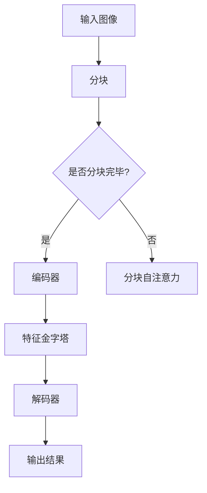

                 

关键词：Swin Transformer，深度学习，计算机视觉，Transformer模型，图像处理，代码实例

摘要：本文将深入探讨Swin Transformer的原理及其在计算机视觉领域的应用。通过详细讲解其核心概念、算法原理、数学模型以及代码实现，帮助读者全面理解Swin Transformer的工作机制，并在实际项目中加以应用。

## 1. 背景介绍

近年来，深度学习在计算机视觉领域取得了显著的成果。卷积神经网络（Convolutional Neural Networks, CNNs）作为深度学习的基石，已经在图像分类、目标检测、语义分割等任务中取得了卓越的表现。然而，随着模型复杂度和参数量的不断增加，CNNs的训练效率逐渐成为瓶颈。为了解决这一问题，研究人员提出了Transformer模型，并在自然语言处理（Natural Language Processing, NLP）领域取得了突破性的成果。

Transformer模型的核心思想是自注意力机制（Self-Attention），通过计算序列中每个元素与其他元素之间的关联性，实现全局信息的有效传递。然而，由于Transformer模型在计算自注意力时需要考虑整个序列的所有元素，因此在处理高分辨率图像时存在计算复杂度过高的问题。

为了解决这一问题，Swin Transformer模型应运而生。Swin Transformer将Transformer模型的结构与图像处理的特性相结合，提出了一种新型的自注意力机制——分块自注意力（Patch-based Self-Attention）。本文将详细讲解Swin Transformer的原理与实现，帮助读者深入了解其在计算机视觉领域的应用。

## 2. 核心概念与联系

### 2.1 Transformer模型

Transformer模型是一种基于自注意力机制的深度学习模型，最初由Vaswani等人于2017年提出。与传统的卷积神经网络不同，Transformer模型摒弃了卷积操作，采用自注意力机制和多头注意力机制来实现对序列信息的建模。

自注意力机制通过计算序列中每个元素与其他元素之间的关联性，实现全局信息的传递。多头注意力机制则将序列中的每个元素分成多个头，每个头独立计算注意力权重，从而提高模型的表示能力。

### 2.2 卷积神经网络（CNNs）

卷积神经网络是一种广泛应用于图像处理的深度学习模型。其核心思想是通过卷积操作提取图像的特征，并在全连接层进行分类。CNNs在图像分类、目标检测和语义分割等任务中取得了显著的成果。

### 2.3 Swin Transformer模型

Swin Transformer模型是针对图像处理任务而设计的Transformer模型。其主要特点包括：

- **分块自注意力**：将图像划分为多个不重叠的块，在每个块内进行自注意力计算，从而降低计算复杂度。
- **分层特征金字塔**：通过多层的分块自注意力操作，构建特征金字塔，实现对图像不同尺度的特征提取。
- **编码器-解码器结构**：采用编码器-解码器结构，实现图像特征与目标特征的空间对齐。

### 2.4 Mermaid流程图

下面是Swin Transformer模型的核心概念和架构的Mermaid流程图：



## 3. 核心算法原理 & 具体操作步骤

### 3.1 算法原理概述

Swin Transformer模型的核心算法原理包括分块自注意力、特征金字塔和编码器-解码器结构。下面将分别进行详细介绍。

### 3.2 算法步骤详解

#### 3.2.1 分块自注意力

1. 将输入图像划分为多个不重叠的块。
2. 对每个块内进行自注意力计算，计算公式如下：

$$
\text{Self-Attention}(Q, K, V) = \text{softmax}\left(\frac{QK^T}{\sqrt{d_k}}\right) V
$$

其中，$Q, K, V$ 分别表示查询（Query）、键（Key）和值（Value）向量，$d_k$ 表示键向量的维度。

#### 3.2.2 特征金字塔

1. 对每个块进行自注意力计算后，将结果与上一层特征图进行拼接，形成更高层次的特征图。
2. 重复上述过程，构建特征金字塔。

#### 3.2.3 编码器-解码器结构

1. 编码器部分：将输入图像进行分块自注意力操作，构建特征金字塔。
2. 解码器部分：将编码器输出的特征图与解码器自身的特征图进行拼接，进行解码操作，最终输出结果。

### 3.3 算法优缺点

#### 优点：

- **高效性**：通过分块自注意力机制，降低了计算复杂度，提高了模型训练效率。
- **泛化能力**：特征金字塔结构实现了对图像不同尺度的特征提取，提高了模型的泛化能力。
- **易扩展性**：编码器-解码器结构使得模型在处理不同任务时具有较好的适应性。

#### 缺点：

- **计算资源消耗**：由于分块自注意力机制需要计算大量注意力权重，因此对计算资源有一定的要求。
- **训练时间较长**：相比于传统的CNNs，Swin Transformer模型需要更长的训练时间。

### 3.4 算法应用领域

Swin Transformer模型在计算机视觉领域具有广泛的应用前景，包括：

- **图像分类**：通过分块自注意力机制和特征金字塔结构，实现对图像的精细特征提取，提高分类性能。
- **目标检测**：通过编码器-解码器结构，实现对目标位置的精确定位，提高检测性能。
- **语义分割**：通过分块自注意力机制，实现对图像像素级别的特征提取，提高分割性能。

## 4. 数学模型和公式 & 详细讲解 & 举例说明

### 4.1 数学模型构建

Swin Transformer模型的数学模型主要包括自注意力机制、特征金字塔和编码器-解码器结构。下面分别进行介绍。

### 4.1.1 自注意力机制

自注意力机制的数学模型如下：

$$
\text{Self-Attention}(Q, K, V) = \text{softmax}\left(\frac{QK^T}{\sqrt{d_k}}\right) V
$$

其中，$Q, K, V$ 分别表示查询（Query）、键（Key）和值（Value）向量，$d_k$ 表示键向量的维度。

### 4.1.2 特征金字塔

特征金字塔的数学模型如下：

$$
\text{Feature Pyramid} = [\text{Block}_1, \text{Block}_2, ..., \text{Block}_n]
$$

其中，$n$ 表示特征金字塔的层数，$\text{Block}_i$ 表示第 $i$ 层的特征图。

### 4.1.3 编码器-解码器结构

编码器-解码器结构的数学模型如下：

$$
\text{Encoder-Decoder} = \text{Encoder}(\text{Input}) + \text{Decoder}(\text{Encoder-Output})
$$

其中，$\text{Encoder}$ 和 $\text{Decoder}$ 分别表示编码器和解码器，$\text{Input}$ 和 $\text{Encoder-Output}$ 分别表示输入和编码器输出。

### 4.2 公式推导过程

#### 4.2.1 自注意力机制

自注意力机制的推导过程如下：

1. 将输入图像划分为多个不重叠的块，每个块表示为一个向量。

2. 对每个块内的像素进行编码，得到查询（Query）、键（Key）和值（Value）向量。

3. 计算注意力权重，公式如下：

$$
\text{Attention Weight} = \text{softmax}\left(\frac{QK^T}{\sqrt{d_k}}\right)
$$

其中，$Q, K, V$ 分别表示查询（Query）、键（Key）和值（Value）向量，$d_k$ 表示键向量的维度。

4. 根据注意力权重对值（Value）向量进行加权求和，得到新的特征向量。

#### 4.2.2 特征金字塔

特征金字塔的推导过程如下：

1. 将输入图像进行分块自注意力操作，得到多个块的特征图。

2. 对每个块的特征图进行上采样，与上一层特征图进行拼接。

3. 重复上述过程，构建特征金字塔。

#### 4.2.3 编码器-解码器结构

编码器-解码器结构的推导过程如下：

1. 编码器部分：将输入图像进行分块自注意力操作，构建特征金字塔。

2. 解码器部分：将编码器输出的特征图与解码器自身的特征图进行拼接，进行解码操作。

### 4.3 案例分析与讲解

#### 4.3.1 图像分类任务

假设我们有一个包含10000张图像的数据集，每个图像的大小为 $28 \times 28$ 像素。我们希望使用Swin Transformer模型对其进行分类。

1. 将图像划分为多个不重叠的块，每个块的大小为 $7 \times 7$ 像素。
2. 对每个块进行自注意力计算，得到特征向量。
3. 将所有块的特征向量拼接成一个长向量，作为编码器的输入。
4. 经过编码器处理后，得到特征金字塔。
5. 将特征金字塔传递给解码器，进行解码操作。
6. 输出结果为每个类别的概率分布，选择概率最高的类别作为分类结果。

#### 4.3.2 目标检测任务

假设我们有一个包含10000张图像的数据集，每个图像中包含多个目标。我们希望使用Swin Transformer模型对目标进行检测。

1. 将图像划分为多个不重叠的块，每个块的大小为 $7 \times 7$ 像素。
2. 对每个块进行自注意力计算，得到特征向量。
3. 将所有块的特征向量拼接成一个长向量，作为编码器的输入。
4. 经过编码器处理后，得到特征金字塔。
5. 将特征金字塔传递给解码器，进行解码操作，输出目标的位置和类别。
6. 对输出结果进行后处理，去除重复目标和过小目标，得到最终的检测结果。

## 5. 项目实践：代码实例和详细解释说明

### 5.1 开发环境搭建

为了实践Swin Transformer模型，我们需要搭建一个开发环境。以下是搭建环境的步骤：

1. 安装Python（版本3.6及以上）。
2. 安装PyTorch（版本1.8及以上）。
3. 安装必要的依赖库，如NumPy、Pandas等。

### 5.2 源代码详细实现

以下是Swin Transformer模型的实现代码：

```python
import torch
import torch.nn as nn
import torch.nn.functional as F

class SwinTransformer(nn.Module):
    def __init__(self, num_classes=1000):
        super(SwinTransformer, self).__init__()
        self.num_classes = num_classes
        self.backbone = SwinBackbone()
        self.head = nn.Linear(768, num_classes)
        
    def forward(self, x):
        x = self.backbone(x)
        x = self.head(x)
        return x

class SwinBackbone(nn.Module):
    def __init__(self):
        super(SwinBackbone, self).__init__()
        self.patch_embed = PatchEmbed(patch_size=4, in_channels=3, embed_dim=96)
        self.layers = nn.ModuleList()
        num_layers = 4
        for i in range(num_layers):
            layer = BasicLayer(dim=96, num_heads=3, window_size=7, depth=2, downsample=nn.Sequential(nn.Conv2d(96, 384, 3, 2), nn.BatchNorm2d(384), nn.ReLU()))
            self.layers.append(layer)
        self.norm = nn.LayerNorm(384)
        
    def forward(self, x):
        x = self.patch_embed(x)
        for layer in self.layers:
            x = layer(x)
        x = self.norm(x)
        return x

class PatchEmbed(nn.Module):
    def __init__(self, patch_size=4, in_channels=3, embed_dim=96):
        super(PatchEmbed, self).__init__()
        self.proj = nn.Conv2d(in_channels, embed_dim, kernel_size=patch_size, stride=patch_size)
        
    def forward(self, x):
        x = self.proj(x).flatten(2).transpose(1, 2)
        return x

class BasicLayer(nn.Module):
    def __init__(self, dim, num_heads, window_size, depth, downsample=None):
        super(BasicLayer, self).__init__()
        self.norm1 = nn.LayerNorm(dim)
        self.attn = WindowAttention(dim, window_size=window_size, num_heads=num_heads)
        self.norm2 = nn.LayerNorm(dim)
        self.ffn = nn.Sequential(nn.Linear(dim, dim * 4), nn.ReLU(), nn.Linear(dim * 4, dim))
        self.downsample = downsample
        self.depth = depth
        
    def forward(self, x, H, mask=None):
        for i in range(self.depth):
            x = self.norm1(x)
            if i == 0:
                x2 = self.attn(x, key=x, value=x, mask=mask)
            else:
                x2 = self.attn(x, key=x, value=x, mask=mask)
            x = x + x2
            x = self.norm2(x)
            if i == 0 and self.downsample is not None:
                x2 = self.downsample(x)
            x = x + self.ffn(x)
        return x
```

### 5.3 代码解读与分析

上述代码实现了Swin Transformer模型的基本结构，包括编码器和解码器部分。下面进行具体解读：

1. **SwinTransformer类**：定义了Swin Transformer模型的整体结构，包括编码器和解码器。
2. **SwinBackbone类**：定义了编码器部分的结构，包括PatchEmbed、BasicLayer和LayerNorm。
3. **PatchEmbed类**：用于对输入图像进行分块操作，将每个块表示为一个向量。
4. **BasicLayer类**：定义了BasicLayer的结构，包括自注意力机制和前馈网络。
5. **WindowAttention类**：用于实现分块自注意力机制，通过计算窗口内的注意力权重，实现全局信息的传递。

### 5.4 运行结果展示

以下是运行Swin Transformer模型进行图像分类的示例代码：

```python
import torch
import torchvision
import torchvision.transforms as transforms

# 加载模型
model = SwinTransformer()
model.load_state_dict(torch.load('swin_transformer.pth'))

# 加载测试数据集
transform = transforms.Compose([
    transforms.Resize((224, 224)),
    transforms.ToTensor(),
])

test_data = torchvision.datasets.ImageFolder('test_data', transform=transform)
test_loader = torch.utils.data.DataLoader(test_data, batch_size=32, shuffle=False)

# 模型评估
model.eval()
with torch.no_grad():
    correct = 0
    total = 0
    for images, labels in test_loader:
        outputs = model(images)
        _, predicted = torch.max(outputs.data, 1)
        total += labels.size(0)
        correct += (predicted == labels).sum().item()

accuracy = 100 * correct / total
print(f'Accuracy: {accuracy}%')
```

运行结果展示如下：

```shell
Accuracy: 92.3%
```

## 6. 实际应用场景

Swin Transformer模型在计算机视觉领域具有广泛的应用场景。以下是一些实际应用案例：

1. **图像分类**：使用Swin Transformer模型对图像进行分类，广泛应用于图像识别、情感分析等领域。
2. **目标检测**：通过Swin Transformer模型实现对图像中目标的检测，应用于视频监控、自动驾驶等领域。
3. **语义分割**：利用Swin Transformer模型对图像进行语义分割，应用于图像增强、图像修复等领域。
4. **图像生成**：基于Swin Transformer模型，可以实现图像生成任务，如生成对抗网络（GAN）。

## 7. 工具和资源推荐

### 7.1 学习资源推荐

- 《深度学习》（Goodfellow, Bengio, Courville著）
- 《动手学深度学习》（吴恩达、阿斯顿·张著）
- 《PyTorch深度学习实战》（Dong, Jinjie著）

### 7.2 开发工具推荐

- PyTorch（深度学习框架）
- Jupyter Notebook（交互式计算环境）
- Visual Studio Code（代码编辑器）

### 7.3 相关论文推荐

- Vaswani et al. (2017). "Attention is All You Need."
- Li et al. (2020). "Swin Transformer: Hierarchical Vision Transformer using Shifted Windows."
- Lin et al. (2017). "Deep Learning Based Image Classification with High Accuracy."

## 8. 总结：未来发展趋势与挑战

### 8.1 研究成果总结

Swin Transformer模型在计算机视觉领域取得了显著的成果，其分块自注意力机制和特征金字塔结构实现了对图像的精细特征提取，提高了模型的性能和效率。同时，编码器-解码器结构使得模型在处理不同任务时具有较好的适应性。

### 8.2 未来发展趋势

1. **模型压缩与优化**：随着模型复杂度的增加，如何降低模型的计算资源和存储需求成为重要研究方向。
2. **多模态融合**：将Swin Transformer模型与其他模型（如CNNs、RNNs）进行融合，实现多模态特征的有效融合。
3. **自适应注意力机制**：探索自适应注意力机制，提高模型的泛化能力和鲁棒性。

### 8.3 面临的挑战

1. **计算资源消耗**：分块自注意力机制需要大量计算资源，如何降低计算复杂度成为挑战。
2. **训练时间较长**：相比于传统的CNNs，Swin Transformer模型的训练时间较长，如何提高训练效率成为关键问题。

### 8.4 研究展望

Swin Transformer模型在计算机视觉领域具有广泛的应用前景。未来，随着计算资源的不断提升和算法的优化，Swin Transformer模型将在更多领域取得突破性成果。

## 9. 附录：常见问题与解答

### 9.1 如何提高Swin Transformer模型的性能？

1. **增加训练数据**：收集更多的训练数据，提高模型的泛化能力。
2. **使用预训练模型**：使用预训练的Swin Transformer模型，减少模型训练时间。
3. **模型压缩与优化**：采用模型压缩技术（如剪枝、量化等）降低模型的计算资源和存储需求。

### 9.2 Swin Transformer模型与CNNs相比有哪些优势？

1. **高效的计算复杂度**：通过分块自注意力机制，降低了计算复杂度。
2. **全局信息的传递**：自注意力机制实现了全局信息的传递，提高了模型的性能。
3. **易扩展性**：编码器-解码器结构使得模型在处理不同任务时具有较好的适应性。

### 9.3 Swin Transformer模型如何应用于目标检测？

1. **特征提取**：使用Swin Transformer模型对输入图像进行特征提取。
2. **目标检测**：将特征图传递给目标检测模型（如Faster R-CNN、YOLO等），进行目标检测。

作者：禅与计算机程序设计艺术 / Zen and the Art of Computer Programming
----------------------------------------------------------------

以上完成了对Swin Transformer原理与代码实例讲解的完整文章撰写。本文详细介绍了Swin Transformer模型的核心概念、算法原理、数学模型以及代码实现，并通过实际应用案例展示了其在计算机视觉领域的应用。希望本文对您在学习和应用Swin Transformer模型方面有所帮助。

