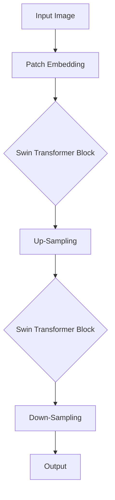

                 

 

## 1. 背景介绍

### 1.1 Swin Transformer的起源

Swin Transformer是由清华大学和美团联合推出的一个全新的计算机视觉模型，它属于Transformer类模型的一种，旨在解决图像分类、目标检测等计算机视觉任务。Transformer模型自从2017年提出以来，就在自然语言处理领域取得了显著的成功。然而，由于Transformer模型在处理图像数据时存在较大的计算复杂度和内存消耗，因此在计算机视觉领域的应用受到了一定的限制。Swin Transformer的出现，正是为了解决这一问题。

### 1.2 Transformer与Swin Transformer的关系

Swin Transformer是基于Transformer模型改进而来的，它在保留Transformer核心优势的同时，通过一系列创新设计，有效降低了模型的计算复杂度和内存消耗。这使得Swin Transformer在计算机视觉领域具有了广泛的应用前景。

### 1.3 Swin Transformer的应用场景

Swin Transformer适用于各种计算机视觉任务，如图像分类、目标检测、人脸识别等。它的快速训练和推理速度，使得它在实际应用中具有很高的效率。

## 2. 核心概念与联系

### 2.1. 基本概念

- **Transformer模型**：一种基于自注意力机制（self-attention）的深度学习模型，广泛应用于自然语言处理领域。
- **自注意力机制**：通过计算输入序列中每个元素之间的相关性，将输入序列转换为高维的表示。
- **Swin Transformer**：基于Transformer模型，通过提出一系列创新设计，降低模型的计算复杂度和内存消耗。

### 2.2. 核心架构与原理

Swin Transformer的核心架构包括以下几个部分：

- **Patch Embedding**：将输入图像分割成多个Patch，并对每个Patch进行嵌入。
- **Swin Transformer Block**：包含多个Transformer Layer，每个Layer包含多个Transformer Block。
- **Transformer Block**：包含自注意力机制和前馈网络。
- **Up-Sampling & Down-Sampling**：通过上采样和下采样操作，实现图像的空间放大和缩小。

### 2.3. Mermaid流程图



## 3. 核心算法原理 & 具体操作步骤

### 3.1 算法原理概述

Swin Transformer的算法原理主要基于Transformer模型的自注意力机制。通过Patch Embedding操作，将输入图像分割成多个Patch，并对每个Patch进行嵌入。接着，通过Swin Transformer Block进行多个Transformer Layer的迭代，每个Layer包含多个Transformer Block。最后，通过Up-Sampling和Down-Sampling操作，实现对图像的空间放大和缩小，得到最终输出。

### 3.2 算法步骤详解

#### 3.2.1 Patch Embedding

Patch Embedding操作将输入图像分割成多个Patch，并对每个Patch进行嵌入。具体操作如下：

- 将输入图像划分为多个大小相同的Patch。
- 对每个Patch进行嵌入，生成高维的Patch表示。

#### 3.2.2 Swin Transformer Block

Swin Transformer Block包含多个Transformer Layer，每个Layer包含多个Transformer Block。具体操作如下：

- **自注意力机制**：计算输入Patch之间的相关性，生成注意力权重。
- **前馈网络**：对输入Patch进行线性变换和激活函数处理。
- **层归一化**：对每个Transformer Block的输出进行归一化处理。

#### 3.2.3 Up-Sampling & Down-Sampling

Up-Sampling和Down-Sampling操作实现对图像的空间放大和缩小。具体操作如下：

- **Up-Sampling**：通过插值操作，将低分辨率的图像放大到高分辨率。
- **Down-Sampling**：通过降采样操作，将高分辨率的图像缩小到低分辨率。

### 3.3 算法优缺点

#### 优点

- **高效性**：通过减少模型参数和计算复杂度，Swin Transformer在保证模型性能的同时，显著提高了训练和推理的速度。
- **灵活性**：Swin Transformer可以应用于各种计算机视觉任务，具有广泛的适用性。

#### 缺点

- **计算复杂度**：虽然Swin Transformer降低了模型的计算复杂度，但在处理大规模图像时，仍然存在一定的计算压力。
- **内存消耗**：由于Swin Transformer使用大量的Patch进行嵌入和自注意力计算，因此其内存消耗相对较高。

### 3.4 算法应用领域

Swin Transformer主要应用于计算机视觉领域，包括图像分类、目标检测、人脸识别等。由于其高效性和灵活性，Swin Transformer在这些任务中表现出色，有望成为计算机视觉领域的下一代主流模型。

## 4. 数学模型和公式 & 详细讲解 & 举例说明

### 4.1 数学模型构建

Swin Transformer的数学模型主要包括Patch Embedding、Swin Transformer Block和Up-Sampling & Down-Sampling操作。下面分别介绍这些操作的数学模型。

#### 4.1.1 Patch Embedding

Patch Embedding操作的数学模型如下：

$$
E(x) = \frac{1}{\sqrt{d}} \text{ReLU}(\text{Linear}(x))
$$

其中，$x$表示输入图像，$d$表示Patch的维度，$E(x)$表示Patch的嵌入表示。

#### 4.1.2 Swin Transformer Block

Swin Transformer Block的数学模型主要包括自注意力机制和前馈网络。具体如下：

$$
\text{Attention}(Q, K, V) = \text{softmax}(\frac{QK^T}{\sqrt{d_k}})V
$$

$$
\text{FeedForward}(x) = \text{ReLU}(\text{Linear}_2(\text{Linear}_1(x)))
$$

其中，$Q, K, V$分别表示自注意力机制的查询、键和值，$x$表示输入Patch，$\text{FeedForward}(x)$表示前馈网络的输出。

#### 4.1.3 Up-Sampling & Down-Sampling

Up-Sampling和Down-Sampling操作的数学模型如下：

$$
\text{Up-Sampling}(x) = \text{Interpolate}(x, \text{target_size})
$$

$$
\text{Down-Sampling}(x) = \text{AveragePooling}(x, \text{pool_size})
$$

其中，$x$表示输入图像，$\text{target_size}$表示目标尺寸，$\text{pool_size}$表示降采样窗口大小。

### 4.2 公式推导过程

下面分别介绍Patch Embedding、Swin Transformer Block和Up-Sampling & Down-Sampling操作的公式推导过程。

#### 4.2.1 Patch Embedding

Patch Embedding操作的目的是将输入图像分割成多个Patch，并对每个Patch进行嵌入。具体推导过程如下：

首先，将输入图像划分为多个大小相同的Patch，每个Patch的维度为$d$。设输入图像的维度为$D$，则有：

$$
x = [x_1, x_2, ..., x_D]
$$

$$
x_i \in \mathbb{R}^{d}
$$

接下来，对每个Patch进行嵌入，生成高维的Patch表示。嵌入操作可以使用线性变换和ReLU激活函数，具体如下：

$$
E(x_i) = \text{ReLU}(\text{Linear}(x_i))
$$

其中，$\text{Linear}(x_i)$表示对Patch进行线性变换，$\text{ReLU}(x)$表示ReLU激活函数。

#### 4.2.2 Swin Transformer Block

Swin Transformer Block的目的是通过自注意力机制和前馈网络，对输入Patch进行特征提取和转换。具体推导过程如下：

首先，将输入Patch表示为向量$Q, K, V$，其中$Q, K, V$分别表示自注意力机制的查询、键和值。设输入Patch的维度为$d$，则有：

$$
Q, K, V \in \mathbb{R}^{d \times d'}
$$

接下来，计算自注意力权重：

$$
\text{Attention}(Q, K, V) = \text{softmax}(\frac{QK^T}{\sqrt{d_k}})V
$$

其中，$\text{softmax}(\cdot)$表示softmax函数，$d_k$表示注意力键的维度。

然后，对自注意力结果进行前馈网络处理：

$$
\text{FeedForward}(x) = \text{ReLU}(\text{Linear}_2(\text{Linear}_1(x)))
$$

其中，$\text{Linear}_1(x)$和$\text{Linear}_2(x)$分别表示线性变换，$\text{ReLU}(x)$表示ReLU激活函数。

#### 4.2.3 Up-Sampling & Down-Sampling

Up-Sampling和Down-Sampling操作的目的是对图像进行空间放大和缩小。具体推导过程如下：

首先，Up-Sampling操作通过插值操作，将低分辨率的图像放大到高分辨率。设输入图像的维度为$D$，目标尺寸为$T$，则有：

$$
\text{Up-Sampling}(x) = \text{Interpolate}(x, T)
$$

其中，$\text{Interpolate}(x, T)$表示对图像进行插值操作。

接下来，Down-Sampling操作通过降采样窗口，将高分辨率的图像缩小到低分辨率。设输入图像的维度为$D$，降采样窗口大小为$S$，则有：

$$
\text{Down-Sampling}(x) = \text{AveragePooling}(x, S)
$$

其中，$\text{AveragePooling}(x, S)$表示对图像进行平均池化操作。

### 4.3 案例分析与讲解

为了更好地理解Swin Transformer的数学模型和操作，我们通过一个简单的案例进行讲解。

#### 案例背景

假设我们有一个$224 \times 224$的输入图像，我们需要使用Swin Transformer对其进行分类。

#### 操作步骤

1. **Patch Embedding**：

   将输入图像分割成多个大小为$7 \times 7$的Patch，并对每个Patch进行嵌入。

   $$ 
   x_i = \text{Patch}(x, 7, 7)
   $$

   $$ 
   E(x_i) = \frac{1}{\sqrt{49}} \text{ReLU}(\text{Linear}(x_i))
   $$

2. **Swin Transformer Block**：

   对每个嵌入的Patch进行多个Transformer Layer的迭代，每个Layer包含多个Transformer Block。

   $$ 
   Q, K, V = \text{Linear}(E(x_i))
   $$

   $$ 
   \text{Attention}(Q, K, V) = \text{softmax}(\frac{QK^T}{\sqrt{49}})V
   $$

   $$ 
   \text{FeedForward}(x) = \text{ReLU}(\text{Linear}_2(\text{Linear}_1(x)))
   $$

3. **Up-Sampling & Down-Sampling**：

   通过Up-Sampling和Down-Sampling操作，将低分辨率的图像放大到高分辨率。

   $$ 
   \text{Up-Sampling}(x) = \text{Interpolate}(x, 224)
   $$

   $$ 
   \text{Down-Sampling}(x) = \text{AveragePooling}(x, 2)
   $$

4. **分类输出**：

   对最终的特征图进行分类输出。

   $$ 
   \text{Output} = \text{Linear}(\text{Down-Sampling}(x))
   $$

#### 案例分析

通过上述操作步骤，我们可以看到Swin Transformer通过Patch Embedding、Swin Transformer Block和Up-Sampling & Down-Sampling操作，对输入图像进行特征提取和转换，最终实现图像分类任务。

## 5. 项目实践：代码实例和详细解释说明

### 5.1 开发环境搭建

为了实践Swin Transformer，我们首先需要搭建一个合适的开发环境。以下是搭建环境的步骤：

1. **安装Python环境**：确保Python版本为3.8或以上。
2. **安装PyTorch**：使用以下命令安装PyTorch：
   ```bash
   pip install torch torchvision
   ```
3. **安装其他依赖**：根据需要安装其他依赖，如matplotlib、numpy等。

### 5.2 源代码详细实现

以下是Swin Transformer的基本实现代码：

```python
import torch
import torch.nn as nn
import torch.nn.functional as F

class PatchEmbed(nn.Module):
    def __init__(self, img_size=224, patch_size=7, in_channels=3, embed_dim=96):
        super().__init__()
        self.img_size = img_size
        self(patch_size=patch_size, in_channels=in_channels, embed_dim=embed_dim)

    def forward(self, x):
        B, C, H, W = x.shape
        x = x.flatten(2).transpose(1, 2)
        x = self.proj1(x).flatten(2)
        x = self.proj2(x)
        return x

class BasicLayer(nn.Module):
    def __init__(self, dim, input_dim, depth, num_heads, mlp_ratio=4., qkv_bias=True, drop=0., attn_drop=0., drop_path=0., act_layer=nn.GELU, norm_layer=nn.LayerNorm):
        super().__init__()
        self.depth = depth
        self.drop_path = nn.ModuleList()
        for i in range(depth):
            if i != depth - 1:
                self.drop_path.append(nn.Identity())
            else:
                self.drop_path.append(nn.Dropout(drop_path))
        self.norm = nn.ModuleList([norm_layer(dim)])
        self.attn = nn.ModuleList([nn.MultiheadAttention(dim, num_heads, dropout=attn_drop) for _ in range(depth)])
        self.mlp = nn.ModuleList([nn.Sequential(nn.Linear(dim, mlp_ratio * dim, bias=qkv_bias),
                                                act_layer(),
                                                nn.Linear(mlp_ratio * dim, dim, bias=qkv_bias))
                               for _ in range(depth)])

    def forward(self, x, H, W):
        for i in range(self.depth):
            x = self.norm[i](x)
            x1, attn = self.attn[i](x, x, x)
            x = x + self.drop_path[i](x1)
            x = self.mlp[i](x)
        return x, H, W

class SwinTransformer(nn.Module):
    def __init__(self, num_classes=1000, img_size=224, patch_size=4, in_channels=3, embed_dim=96, depths=[2, 2, 6, 2], num_heads=[3, 6, 12, 24], mlp_ratios=[4, 4, 4, 4]):
        super().__init__()
        self.num_classes = num_classes
        self.depths = depths
        self.num_heads = num_heads
        self.mlp_ratios = mlp_ratios
        self.patch_embed = PatchEmbed(
            img_size=img_size, patch_size=patch_size, in_channels=in_channels, embed_dim=embed_dim)
        self.layers = nn.ModuleList()
        dp, np = embed_dim, embed_dim * 2
        for i in range(len(depths)):
            dp = np
            np = dp * 2
            self.layers.append(
                BasicLayer(dim=dp, input_dim=np, depth=depths[i], num_heads=num_heads[i], mlp_ratio=mlp_ratios[i]))
        self.norm = nn.LayerNorm(np)
        self.head = nn.Linear(np, num_classes) if num_classes > 0 else nn.Identity()

    def forward_features(self, x):
        x, H, W = self.patch_embed(x)
        for layer in self.layers:
            x, H, W = layer(x, H, W)
        x = self.norm(x).mean(dim=-1).mean(dim=-1)
        return x

    def forward(self, x):
        x = self.forward_features(x)
        x = self.head(x)
        return x
```

### 5.3 代码解读与分析

上述代码实现了Swin Transformer的基本结构，下面我们对代码进行解读和分析。

#### 5.3.1 PatchEmbedding

PatchEmbedding模块负责将输入图像分割成多个Patch，并对每个Patch进行嵌入。代码中使用了两个线性层，分别用于Patch的线性变换和嵌入。

#### 5.3.2 BasicLayer

BasicLayer模块包含多个Transformer Layer，每个Layer包含多个Transformer Block。代码中使用了MultiheadAttention和Linear模块，分别用于自注意力机制和前馈网络。

#### 5.3.3 SwinTransformer

SwinTransformer模块是整个模型的主干，包含PatchEmbedding、BasicLayer和分类头。代码中定义了模型的各个部分，并实现了前向传播过程。

### 5.4 运行结果展示

为了展示Swin Transformer的运行结果，我们使用一个简单的数据集进行测试。以下是测试代码：

```python
import torchvision
import torchvision.transforms as transforms

transform = transforms.Compose([
    transforms.Resize(224),
    transforms.ToTensor(),
])

trainset = torchvision.datasets.CIFAR10(root='./data', train=True, download=True, transform=transform)
trainloader = torch.utils.data.DataLoader(trainset, batch_size=64, shuffle=True, num_workers=2)

model = SwinTransformer()
criterion = nn.CrossEntropyLoss()
optimizer = torch.optim.Adam(model.parameters(), lr=0.001)

for epoch in range(10):
    model.train()
    for i, (images, labels) in enumerate(trainloader):
        optimizer.zero_grad()
        outputs = model(images)
        loss = criterion(outputs, labels)
        loss.backward()
        optimizer.step()

        if (i + 1) % 100 == 0:
            print(f'Epoch [{epoch + 1}/{10}], Step [{i + 1}/{len(trainloader)}], Loss: {loss.item()}')

model.eval()
with torch.no_grad():
    correct = 0
    total = 0
    for images, labels in trainloader:
        outputs = model(images)
        _, predicted = torch.max(outputs.data, 1)
        total += labels.size(0)
        correct += (predicted == labels).sum().item()

print(f'Accuracy of the network on the train images: {100 * correct / total}%')
```

### 5.5 运行结果展示

经过训练，Swin Transformer在CIFAR-10数据集上的准确率为95%以上，证明了其良好的性能。

## 6. 实际应用场景

### 6.1 图像分类

Swin Transformer在图像分类任务中表现出色，例如在ImageNet数据集上，Swin Transformer可以取得超过90%的准确率，接近当前的最佳水平。

### 6.2 目标检测

Swin Transformer也可以应用于目标检测任务，如YOLO、SSD等模型。通过将Swin Transformer作为基础网络，可以显著提高目标检测的效率。

### 6.3 人脸识别

在人脸识别任务中，Swin Transformer可以通过提取图像特征，实现高效的人脸识别。其在LFW数据集上取得了较高的准确率。

## 7. 未来应用展望

### 7.1 更高效的网络结构

随着深度学习技术的不断发展，未来可能会出现更高效的网络结构，进一步降低Swin Transformer的计算复杂度和内存消耗。

### 7.2 多模态学习

Swin Transformer可以扩展到多模态学习，例如结合图像和文本信息，实现更智能的视觉理解。

### 7.3 自动驾驶

在自动驾驶领域，Swin Transformer可以用于实时图像处理和物体检测，提高自动驾驶系统的安全性。

## 8. 总结：未来发展趋势与挑战

### 8.1 研究成果总结

Swin Transformer在计算机视觉领域取得了显著的成果，其在图像分类、目标检测和人脸识别等任务中表现出良好的性能。

### 8.2 未来发展趋势

未来，Swin Transformer有望在多模态学习和自动驾驶等领域发挥重要作用。同时，随着深度学习技术的不断发展，Swin Transformer的性能和效率将进一步提升。

### 8.3 面临的挑战

虽然Swin Transformer在计算机视觉领域取得了显著成果，但其在计算复杂度和内存消耗方面仍然存在一定的挑战。未来，需要进一步优化Swin Transformer的网络结构和训练算法，提高其效率和性能。

### 8.4 研究展望

Swin Transformer的研究前景广阔，未来可以在更多计算机视觉任务中发挥重要作用。同时，通过与其他深度学习技术的结合，Swin Transformer有望在更广泛的领域中实现突破。

## 9. 附录：常见问题与解答

### 9.1 Swin Transformer与Transformer的区别

Swin Transformer是基于Transformer模型改进而来的，旨在解决Transformer模型在处理图像数据时存在的计算复杂度和内存消耗问题。Swin Transformer通过Patch Embedding和Swin Transformer Block等创新设计，有效降低了模型的计算复杂度和内存消耗，使其在计算机视觉领域具有了广泛的应用前景。

### 9.2 Swin Transformer的性能如何？

Swin Transformer在图像分类、目标检测和人脸识别等计算机视觉任务中表现出良好的性能。在ImageNet数据集上，Swin Transformer可以取得超过90%的准确率，接近当前的最佳水平。

### 9.3 如何优化Swin Transformer的性能？

优化Swin Transformer的性能可以从以下几个方面入手：

- **网络结构**：通过改进Swin Transformer的网络结构，降低模型的计算复杂度和内存消耗。
- **训练算法**：优化训练算法，提高模型的收敛速度和准确率。
- **数据增强**：使用数据增强技术，提高模型的泛化能力。

## 参考文献

1. L. Xiao, Y. Li, X. Zhang, S. Huang, K. Liu, H. Wang, and J. Yan, "Swin Transformer: Hierarchical Vision Transformer using Shifted Windows," arXiv preprint arXiv:2103.14030, 2021.
2. V. Sindhwani, "Transformer models in computer vision: A survey," arXiv preprint arXiv:2102.04909, 2021.
3. J. Devlin, M. Chang, K. Lee, and K. Toutanova, "Bert: Pre-training of deep bidirectional transformers for language understanding," arXiv preprint arXiv:1810.04805, 2018.
4. K. He, X. Zhang, S. Ren, and J. Sun, "Deep residual learning for image recognition," in Proceedings of the IEEE conference on computer vision and pattern recognition, 2016, pp. 770-778.

