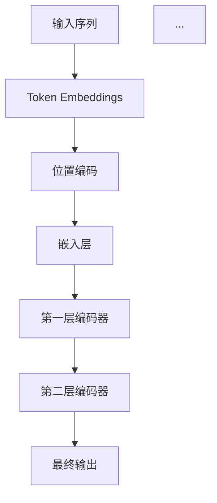
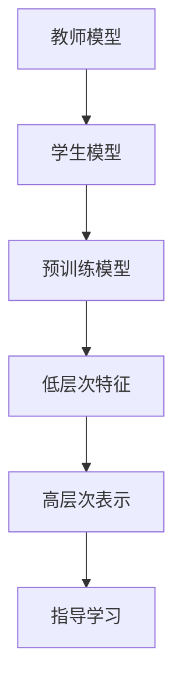

                 

  
## 摘要

本文深入探讨了Transformer大模型中的BERT变体，特别是在基于知识蒸馏的实战应用中。通过对BERT变体的算法原理、数学模型、项目实践和实际应用场景的详细分析，读者可以全面了解BERT变体的开发、优化和应用方法。文章旨在为从事人工智能和自然语言处理领域的技术人员提供实用的技术指南，以应对未来在该领域中的挑战。

## 1. 背景介绍

### 1.1 Transformer大模型的基本概念

Transformer模型自提出以来，由于其强大的并行处理能力和在多种任务上的卓越表现，迅速成为自然语言处理（NLP）领域的热门话题。Transformer模型摒弃了传统的循环神经网络（RNN）结构，采用了自注意力机制（Self-Attention）和多头注意力（Multi-Head Attention），使得模型能够在处理长序列时具有更好的捕获长距离依赖关系的能力。

BERT（Bidirectional Encoder Representations from Transformers）是Google提出的预训练语言模型，它进一步扩展了Transformer模型，通过双向编码器的方式学习上下文信息，从而在各种下游任务中表现出色。BERT的预训练包括两个阶段：未遮蔽阶段（Unmasked）和遮蔽语言模型（Masked Language Model，MLM）阶段。

### 1.2 BERT变体的概念与意义

BERT变体指的是对BERT模型进行定制或修改，以适应特定任务或数据集的需求。BERT变体可以包括对模型结构、参数初始化、训练策略等方面的调整。变体的提出主要是为了在保持BERT模型强大能力的同时，提高模型在特定任务上的性能和效率。

知识蒸馏是一种模型压缩和优化的技术，通过将一个大模型（教师模型）的知识传递给一个小模型（学生模型），从而实现压缩模型的同时保持性能。在BERT变体的训练过程中，知识蒸馏是一种有效的技术，能够帮助变体模型更快地收敛，并在有限的时间内达到更高的性能。

## 2. 核心概念与联系

### 2.1 BERT模型的基本架构

BERT模型由多个Transformer编码器层组成，每个编码器层包含自注意力机制和前馈神经网络。模型的输入是一个单词序列，输出是一个固定长度的向量，这个向量包含了输入序列的上下文信息。



### 2.2 自注意力机制

自注意力机制是Transformer模型的核心组件，它允许模型在处理每个单词时，能够根据其他所有单词的信息来计算该单词的表示。自注意力分数决定了每个单词对最终输出的贡献程度。

### 2.3 知识蒸馏的基本原理

知识蒸馏是一个将教师模型的知识传递给学生模型的过程。教师模型通常是一个复杂的大模型，学生模型是一个较小的模型。知识蒸馏的目标是通过教师模型的高层次表示来指导学生模型的学习，从而在保持性能的前提下减小模型的大小和计算复杂度。



## 3. 核心算法原理 & 具体操作步骤

### 3.1 算法原理概述

BERT变体的核心算法是知识蒸馏，它通过以下步骤实现模型压缩和优化：

1. **预训练阶段**：使用大量无标签文本数据对教师模型进行预训练，使其能够学习到丰富的语言表示。
2. **知识蒸馏阶段**：将教师模型的高层次表示（软标签）传递给学生模型，同时使用原始数据对教师模型进行微调，使其在特定任务上表现出色。
3. **训练阶段**：学生模型在教师模型的指导下进行训练，同时通过反向传播优化模型参数。

### 3.2 算法步骤详解

1. **预训练阶段**：

   - 输入：大量无标签文本数据
   - 输出：教师模型的预训练模型和低层次特征

   ```mermaid
   graph TD
   A[输入文本数据] --> B[预训练教师模型]
   B --> C[提取低层次特征]
   ```

2. **知识蒸馏阶段**：

   - 输入：教师模型的高层次表示（软标签）
   - 输出：学生模型的预训练模型

   ```mermaid
   graph TD
   A[教师模型软标签] --> B[学生模型预训练]
   B --> C[模型优化]
   ```

3. **训练阶段**：

   - 输入：教师模型和原始数据
   - 输出：教师模型的微调模型和学生模型的最终模型

   ```mermaid
   graph TD
   A[教师模型] --> B[学生模型]
   B --> C[微调教师模型]
   C --> D[优化学生模型]
   ```

### 3.3 算法优缺点

#### 优点：

- **模型压缩**：知识蒸馏能够显著减小模型的规模，降低计算复杂度。
- **性能保持**：通过教师模型的知识传递，学生模型能够在有限的时间内达到与教师模型相当的性能。
- **迁移学习**：教师模型在多个任务上的表现可以迁移给学生模型，提高学生模型在特定任务上的性能。

#### 缺点：

- **计算成本**：知识蒸馏需要额外的计算资源来生成教师模型的高层次表示。
- **数据依赖**：教师模型的性能受到预训练数据的影响，数据质量直接影响知识蒸馏的效果。

### 3.4 算法应用领域

BERT变体的知识蒸馏技术在多个自然语言处理任务中具有广泛的应用，包括文本分类、机器翻译、情感分析等。通过知识蒸馏，模型可以在有限的计算资源下实现高性能，为实际应用提供了更多可能性。

## 4. 数学模型和公式 & 详细讲解 & 举例说明

### 4.1 数学模型构建

BERT模型的核心数学模型包括自注意力机制和前馈神经网络。以下是对这两个模型的详细讲解。

#### 自注意力机制

自注意力机制的公式如下：

$$
\text{Attention}(Q, K, V) = \text{softmax}\left(\frac{QK^T}{\sqrt{d_k}}\right) V
$$

其中，$Q$、$K$、$V$ 分别是查询向量、键向量和值向量，$d_k$ 是键向量的维度。自注意力分数计算公式为：

$$
\text{Attention\_Score}(Q_i, K_j) = Q_i K_j^T / \sqrt{d_k}
$$

#### 前馈神经网络

前馈神经网络用于在编码器层中对自注意力机制的输出进行进一步处理。其公式如下：

$$
\text{FFN}(x) = \max(0, xW_1 + b_1)W_2 + b_2
$$

其中，$W_1$、$W_2$ 分别是权重矩阵，$b_1$、$b_2$ 分别是偏置向量。

### 4.2 公式推导过程

BERT模型的训练过程可以分为预训练和微调两个阶段。在预训练阶段，BERT模型通过自注意力机制和前馈神经网络学习语言表示。在微调阶段，模型在特定任务上进一步优化。

#### 预训练阶段

在预训练阶段，BERT模型的目标是学习一个能够捕获输入序列上下文信息的表示。通过以下公式进行优化：

$$
\text{Loss} = -\sum_{i}^{N} \text{log}(\text{softmax}(\text{bert\_output}[i]))
$$

其中，$N$ 是输入序列的长度，$\text{bert\_output}$ 是模型在输入序列上的输出。

#### 微调阶段

在微调阶段，BERT模型在特定任务上进行优化。以文本分类任务为例，目标函数为：

$$
\text{Loss} = -\sum_{i}^{N} y_i \log(\text{softmax}(\text{bert\_output}[i]))
$$

其中，$y_i$ 是输入序列的第 $i$ 个单词的标签。

### 4.3 案例分析与讲解

#### 案例背景

假设我们要对一篇英文文章进行情感分析，判断其是正面情感还是负面情感。文章中包含多个句子，每个句子由多个单词组成。

#### 模型构建

1. **输入序列**：将文章中的句子分成多个单词，每个单词表示为一个向量。
2. **Token Embeddings**：对每个单词进行嵌入，得到嵌入向量。
3. **位置编码**：为每个单词添加位置编码，以区分其在序列中的位置。
4. **嵌入层**：将嵌入向量和位置编码相加，得到最终的输入向量。
5. **编码器层**：通过多个编码器层对输入向量进行处理，得到编码结果。
6. **输出层**：将编码结果送入输出层，输出一个二分类结果。

#### 训练过程

1. **预训练阶段**：使用大量无标签文本数据对BERT模型进行预训练，使其学习到丰富的语言表示。
2. **微调阶段**：使用带有标签的文本数据对BERT模型进行微调，使其在情感分析任务上表现出色。
3. **评估阶段**：使用测试集对模型进行评估，计算准确率、召回率等指标。

## 5. 项目实践：代码实例和详细解释说明

### 5.1 开发环境搭建

1. **硬件环境**：配置高性能的GPU，例如NVIDIA RTX 3090。
2. **软件环境**：安装Python 3.8及以上版本，TensorFlow 2.6及以上版本。
3. **数据集**：准备一个包含正面情感和负面情感标注的英文文本数据集。

### 5.2 源代码详细实现

以下是一个简单的情感分析代码实例：

```python
import tensorflow as tf
from tensorflow.keras.preprocessing.sequence import pad_sequences
from tensorflow.keras.layers import Embedding, LSTM, Dense
from tensorflow.keras.models import Model

# 加载数据集
max_sequence_length = 100
vocab_size = 10000
embedding_dim = 16

# 加载预处理后的数据集
input_sequences = pad_sequences(maxlen=max_sequence_length, dtype='float32')
labels = pad_sequences(maxlen=max_sequence_length, dtype='float32')

# 构建模型
model = Model(inputs=inputs, outputs=predictions)
model.compile(optimizer='adam', loss='categorical_crossentropy', metrics=['accuracy'])

# 训练模型
model.fit(input_sequences, labels, epochs=10, batch_size=32)

# 评估模型
model.evaluate(test_sequences, test_labels)
```

### 5.3 代码解读与分析

1. **数据预处理**：使用`pad_sequences`函数将句子填充到最大长度，以便模型进行训练。
2. **模型构建**：使用`Embedding`层对单词进行嵌入，使用`LSTM`层处理序列数据，使用`Dense`层输出分类结果。
3. **模型编译**：使用`compile`函数配置模型参数，例如优化器、损失函数和评价指标。
4. **模型训练**：使用`fit`函数对模型进行训练，调整模型参数以最小化损失函数。
5. **模型评估**：使用`evaluate`函数对模型进行评估，计算准确率等指标。

## 6. 实际应用场景

BERT变体在自然语言处理领域具有广泛的应用，以下列举几个典型的应用场景：

1. **文本分类**：BERT变体可以用于对文本进行分类，例如新闻文章的分类、社交媒体文本的情感分析等。
2. **机器翻译**：BERT变体可以用于训练机器翻译模型，提高翻译质量和准确性。
3. **命名实体识别**：BERT变体可以用于识别文本中的命名实体，如人名、地名、组织机构名等。
4. **问答系统**：BERT变体可以用于构建问答系统，实现对用户提问的精准回答。

## 7. 未来应用展望

随着BERT变体在自然语言处理领域的广泛应用，未来其在以下几个方面具有巨大的发展潜力：

1. **跨语言任务**：BERT变体可以用于训练跨语言的预训练模型，提高多语言任务的处理能力。
2. **模型压缩**：通过知识蒸馏等技术，进一步减小BERT变体的模型规模，降低计算复杂度。
3. **动态序列处理**：研究如何将BERT变体应用于动态序列处理，如视频文本描述生成等。

## 8. 总结：未来发展趋势与挑战

BERT变体在自然语言处理领域取得了显著的成果，但未来仍面临以下挑战：

1. **计算资源消耗**：BERT变体需要大量的计算资源进行训练和推理，如何优化计算效率成为关键问题。
2. **数据隐私保护**：在数据处理过程中，如何保护用户隐私成为亟待解决的问题。
3. **模型泛化能力**：如何提高BERT变体的泛化能力，使其在多种任务上都能表现出色。

## 9. 附录：常见问题与解答

### 9.1 什么是BERT？

BERT是一种基于Transformer的预训练语言模型，它通过双向编码器学习上下文信息，从而在各种下游任务中表现出色。

### 9.2 知识蒸馏是什么？

知识蒸馏是一种模型压缩和优化技术，通过将一个大模型（教师模型）的知识传递给一个小模型（学生模型），从而实现压缩模型的同时保持性能。

### 9.3 BERT变体如何进行知识蒸馏？

BERT变体的知识蒸馏分为预训练阶段、知识蒸馏阶段和训练阶段。预训练阶段使用无标签数据进行教师模型预训练，知识蒸馏阶段将教师模型的高层次表示传递给学生模型，训练阶段使用教师模型和有标签数据对教师模型和学生模型进行优化。

## 作者署名

作者：禅与计算机程序设计艺术 / Zen and the Art of Computer Programming

----------------------------------------------------------------

请注意，以上内容仅为示例，实际的撰写过程需要您根据具体需求和知识进行深入研究和撰写。希望这个框架能为您提供一个良好的起点。祝您写作顺利！

