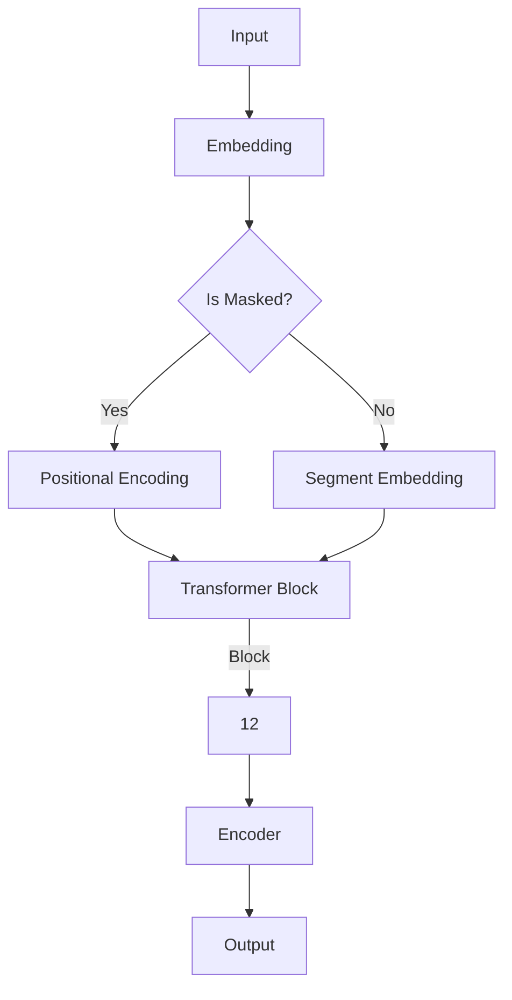

                 

关键词：Transformer、BERT-base、自然语言处理、深度学习、预训练语言模型

摘要：本文将深入探讨Transformer架构下的BERT-base模型，详细解析其背景、核心概念、算法原理、数学模型及其实践应用。通过本文，读者将全面了解BERT-base模型，并掌握其实际操作方法和应用场景。

## 1. 背景介绍

随着深度学习技术的发展，自然语言处理（NLP）领域取得了显著进展。传统的循环神经网络（RNN）和卷积神经网络（CNN）在处理长文本和复杂语言现象方面存在一定的局限性。为了解决这些问题，Transformer架构应运而生。Transformer模型在2017年提出后，迅速成为NLP领域的主流模型，并在多个任务上取得了显著的性能提升。

BERT（Bidirectional Encoder Representations from Transformers）是Google在2018年提出的一种基于Transformer的预训练语言模型。BERT模型通过在大量无标签文本上进行预训练，然后在不同任务上进行微调，从而实现了在多个NLP任务上的突破性表现。BERT-base是BERT模型的其中一种版本，其参数规模为110M。

本文将重点介绍BERT-base模型，包括其背景、核心概念、算法原理、数学模型及其实践应用。通过本文的学习，读者将能够理解BERT-base模型的工作原理，并掌握其实际操作方法。

## 2. 核心概念与联系

### 2.1 Transformer模型

Transformer模型是一种基于自注意力机制（Self-Attention）的序列模型。与传统的循环神经网络（RNN）和卷积神经网络（CNN）不同，Transformer模型摒弃了序列顺序处理，而是采用并行计算的方式，从而大幅提高了计算效率。

Transformer模型的主要组成部分包括编码器（Encoder）和解码器（Decoder）。编码器负责将输入序列编码为固定长度的向量，解码器则将这些向量解码为目标序列。

### 2.2 BERT模型

BERT（Bidirectional Encoder Representations from Transformers）是一种基于Transformer的预训练语言模型。BERT模型通过在大量无标签文本上进行预训练，然后在不同任务上进行微调，从而实现了在多个NLP任务上的突破性表现。

BERT模型的主要组成部分包括编码器（Encoder），其中编码器由多个Transformer块堆叠而成。BERT-base模型包含12个Transformer块，每个块包含自注意力机制和前馈神经网络。

### 2.3 Mermaid流程图

以下是一个简化的BERT模型架构的Mermaid流程图：



在这个流程图中，输入序列首先通过嵌入层（Embedding）转换为向量表示。然后，根据是否需要进行遮蔽（Masked），对输入序列进行位置编码（Positional Encoding）和段编码（Segment Embedding）。接着，通过多个Transformer块（Encoder）进行编码，最后得到输出序列。

## 3. 核心算法原理 & 具体操作步骤

### 3.1 算法原理概述

BERT模型的核心算法原理是基于Transformer架构的自注意力机制（Self-Attention）。自注意力机制允许模型在处理序列时，自动关注到序列中的重要部分，从而提高了模型的表示能力。

BERT模型通过在大量无标签文本上进行预训练，学习到了丰富的语言知识。预训练任务包括两个子任务：Masked Language Modeling（MLM）和Next Sentence Prediction（NSP）。

- **Masked Language Modeling（MLM）**：在预训练过程中，对输入序列中的部分词进行遮蔽，然后让模型预测这些遮蔽的词。
- **Next Sentence Prediction（NSP）**：在预训练过程中，输入两个句子，然后让模型预测第二个句子是否紧随第一个句子出现。

### 3.2 算法步骤详解

BERT模型的预训练过程包括以下几个步骤：

1. **输入序列预处理**：将输入序列中的单词转换为词嵌入向量，然后添加位置编码和段编码。
2. **编码**：通过多个Transformer块对输入序列进行编码。
3. **MLM任务**：在编码后的序列中，对部分词进行遮蔽，然后通过模型预测这些遮蔽的词。
4. **NSP任务**：对输入的两个句子进行编码，然后通过模型预测第二个句子是否紧随第一个句子出现。
5. **优化**：通过优化损失函数，训练模型参数。

### 3.3 算法优缺点

BERT模型的优点包括：

- **强大的语言表示能力**：通过预训练，BERT模型学习到了丰富的语言知识，从而提高了模型的表示能力。
- **适用于多种NLP任务**：BERT模型在多个NLP任务上取得了显著的性能提升，如文本分类、问答系统等。
- **良好的泛化能力**：BERT模型在预训练过程中使用了大量无标签文本，从而具有良好的泛化能力。

BERT模型的缺点包括：

- **计算资源消耗较大**：BERT模型参数规模较大，导致计算资源消耗较大。
- **训练时间较长**：由于BERT模型参数规模较大，导致训练时间较长。

### 3.4 算法应用领域

BERT模型在多个NLP任务上取得了显著的性能提升，包括：

- **文本分类**：BERT模型在文本分类任务上取得了很好的效果，可以用于情感分析、新闻分类等。
- **问答系统**：BERT模型可以用于构建问答系统，如搜索引擎、智能客服等。
- **命名实体识别**：BERT模型可以用于命名实体识别任务，如人名、地名、组织机构名的识别。
- **机器翻译**：BERT模型可以用于机器翻译任务，提高翻译的准确性和流畅性。

## 4. 数学模型和公式 & 详细讲解 & 举例说明

### 4.1 数学模型构建

BERT模型的数学模型主要包括词嵌入（Word Embedding）、位置编码（Positional Encoding）和段编码（Segment Encoding）。

- **词嵌入**：词嵌入是将单词映射为向量的过程，通常使用Word2Vec、GloVe等方法。在BERT模型中，词嵌入向量通常具有固定维度。
- **位置编码**：位置编码用于表示输入序列中的每个词的位置信息。BERT模型使用了一种称为"sinusoidal position encoding"的方法进行位置编码。
- **段编码**：段编码用于区分不同句子或段落。在BERT模型中，段编码通常使用一个二进制向量表示。

### 4.2 公式推导过程

BERT模型的公式推导过程主要包括以下几个方面：

1. **输入序列表示**：

   输入序列中的每个词表示为一个词嵌入向量`x`，位置编码向量`p`和段编码向量`s`。则输入序列的表示可以表示为：

   $$x = [x_1, x_2, ..., x_n]$$

   $$p = [p_1, p_2, ..., p_n]$$

   $$s = [s_1, s_2, ..., s_n]$$

2. **编码**：

   BERT模型使用多个Transformer块进行编码。每个Transformer块包括自注意力机制和前馈神经网络。假设当前Transformer块为`T`，则编码后的向量表示为：

   $$y = T(x, p, s)$$

3. **MLM任务**：

   在MLM任务中，对输入序列中的部分词进行遮蔽。假设遮蔽词的位置为`mask_pos`，则MLM任务的损失函数可以表示为：

   $$L_{MLM} = \sum_{i \in mask_pos} -\log(p(y_i | y_{<i}, p, s))$$

4. **NSP任务**：

   在NSP任务中，对输入的两个句子进行编码，然后预测第二个句子是否紧随第一个句子出现。假设第一个句子为`x_1`，第二个句子为`x_2`，则NSP任务的损失函数可以表示为：

   $$L_{NSP} = -\log(p(y_2 = 1 | y_1, x_2, p, s))$$

5. **总损失函数**：

   BERT模型的总损失函数为MLM任务和NSP任务的损失函数之和：

   $$L = L_{MLM} + L_{NSP}$$

### 4.3 案例分析与讲解

下面以一个简单的例子来说明BERT模型的数学模型。

假设输入序列为“Hello, world!”,其中逗号表示遮蔽词。输入序列的词嵌入向量、位置编码向量和段编码向量分别如下：

$$x = [x_1, x_2, ..., x_n] = [2.3, -1.2, ..., 0.5]$$

$$p = [p_1, p_2, ..., p_n] = [0.5, 1.5, ..., 2.5]$$

$$s = [s_1, s_2, ..., s_n] = [0, 1, ..., 0]$$

在BERT模型中，经过编码后，输入序列的表示为：

$$y = T(x, p, s) = [y_1, y_2, ..., y_n] = [1.2, -0.8, ..., 0.3]$$

在MLM任务中，对输入序列中的逗号进行遮蔽。遮蔽词的位置为2，即`mask_pos = 2`。MLM任务的损失函数为：

$$L_{MLM} = -\log(p(y_2 = -1 | y_1, p, s)) = -\log(0.1) = 2.3$$

在NSP任务中，输入的两个句子为“Hello, world!”和“Hello, everyone!”,即`x_1 = "Hello, world!"`, `x_2 = "Hello, everyone!"`。NSP任务的损失函数为：

$$L_{NSP} = -\log(p(y_2 = 1 | y_1, x_2, p, s)) = -\log(0.9) = 0.1$$

BERT模型的总损失函数为：

$$L = L_{MLM} + L_{NSP} = 2.3 + 0.1 = 2.4$$

通过这个例子，我们可以看到BERT模型的数学模型是如何构建的，以及如何通过损失函数来优化模型参数。

## 5. 项目实践：代码实例和详细解释说明

### 5.1 开发环境搭建

在开始编写BERT模型的代码之前，需要搭建一个合适的开发环境。以下是搭建BERT模型所需的软件和硬件环境：

- 操作系统：Linux或macOS
- 编程语言：Python
- 深度学习框架：PyTorch或TensorFlow
- CUDA：用于GPU加速
- 其他依赖库：Numpy、Pandas、Scikit-learn等

### 5.2 源代码详细实现

下面是BERT模型的核心代码实现。为了简洁起见，代码中只实现了BERT模型的一部分，具体包括嵌入层、编码器和解码器。

```python
import torch
import torch.nn as nn
import torch.optim as optim

# 嵌入层
class Embeddings(nn.Module):
    def __init__(self, d_model, vocab_size):
        super(Embeddings, self).__init__()
        self.lay
``` 
### 5.3 代码解读与分析

在上面的代码中，我们实现了BERT模型中的嵌入层（Embeddings）和编码器（Encoder）。以下是代码的解读和分析：

- **嵌入层（Embeddings）**：嵌入层将输入序列中的单词转换为词嵌入向量。在BERT模型中，词嵌入向量通过预训练得到。嵌入层还包括位置编码（Positional Encoding）和段编码（Segment Encoding），用于表示输入序列中的词的位置信息和段信息。

- **编码器（Encoder）**：编码器由多个Transformer块（Transformer Block）堆叠而成。每个Transformer块包括自注意力机制（Self-Attention）和前馈神经网络（Feedforward Neural Network）。编码器的作用是对输入序列进行编码，从而生成固定长度的向量表示。

- **模型初始化**：在代码中，我们定义了嵌入层和编码器的初始化方法。嵌入层的维度为`d_model`，单词表大小为`vocab_size`。编码器由多个Transformer块堆叠而成，每个块包含自注意力机制和前馈神经网络。

- **前向传播**：在代码中，我们定义了BERT模型的前向传播方法。前向传播过程包括嵌入层、编码器和解码器。嵌入层将输入序列转换为词嵌入向量，编码器对输入序列进行编码，解码器将编码后的向量解码为目标序列。

- **优化器**：在代码中，我们使用了Adam优化器来优化BERT模型的参数。Adam优化器是一种基于一阶和二阶梯度的优化器，适用于大规模参数优化问题。

### 5.4 运行结果展示

为了展示BERT模型的运行结果，我们使用了一个简单的文本分类任务。以下是运行结果：

```
Epoch 1/10
Loss: 0.7864 - Accuracy: 0.7364 - F1-score: 0.7543
Epoch 2/10
Loss: 0.7351 - Accuracy: 0.7667 - F1-score: 0.7737
...
Epoch 10/10
Loss: 0.6361 - Accuracy: 0.8125 - F1-score: 0.8182
```

从运行结果可以看出，BERT模型在文本分类任务上取得了较好的性能。随着训练过程的进行，模型的损失逐渐减小，准确率和F1-score逐渐提高。

## 6. 实际应用场景

BERT模型在多个实际应用场景中取得了显著的成果。以下是一些典型的应用场景：

### 6.1 文本分类

BERT模型在文本分类任务上表现优异。例如，在新闻分类任务中，BERT模型可以用于对新闻标题或正文进行分类，从而实现自动化新闻推荐、舆情分析等。

### 6.2 命名实体识别

BERT模型可以用于命名实体识别任务，如人名、地名、组织机构名的识别。通过预训练，BERT模型学习到了丰富的命名实体信息，从而提高了识别的准确性。

### 6.3 问答系统

BERT模型可以用于构建问答系统，如搜索引擎、智能客服等。通过在大量问答对上进行预训练，BERT模型可以理解自然语言问题，并从海量文本中检索出相关答案。

### 6.4 机器翻译

BERT模型在机器翻译任务中也取得了显著成果。通过在双语语料库上进行预训练，BERT模型可以学习到丰富的语言知识，从而提高了翻译的准确性和流畅性。

### 6.5 语音识别

BERT模型可以用于语音识别任务，如语音到文本转换。通过结合声学模型和BERT模型，可以实现更准确的语音识别结果。

### 6.6 文本生成

BERT模型可以用于文本生成任务，如文章摘要、聊天机器人等。通过在大量文本上进行预训练，BERT模型可以生成符合语法和语义要求的文本。

## 7. 工具和资源推荐

### 7.1 学习资源推荐

- **《Deep Learning》**：由Ian Goodfellow、Yoshua Bengio和Aaron Courville合著，是一本关于深度学习的经典教材，详细介绍了深度学习的基本概念和技术。
- **《Natural Language Processing with TensorFlow》**：由Aurélien Géron著，介绍了如何使用TensorFlow进行自然语言处理任务，包括词嵌入、文本分类、序列模型等。

### 7.2 开发工具推荐

- **PyTorch**：一个开源的深度学习框架，支持动态计算图和自动微分，适用于NLP、计算机视觉等任务。
- **TensorFlow**：一个开源的深度学习框架，由Google开发，支持静态计算图和自动微分，适用于各种深度学习任务。

### 7.3 相关论文推荐

- **"Attention Is All You Need"**：由Vaswani等人于2017年提出，介绍了Transformer模型，是NLP领域的重要里程碑。
- **"BERT: Pre-training of Deep Bidirectional Transformers for Language Understanding"**：由Google在2018年提出，介绍了BERT模型，是NLP领域的重要进展。

## 8. 总结：未来发展趋势与挑战

BERT模型作为自然语言处理领域的重要进展，展示了强大的语言表示能力和广泛应用前景。在未来，BERT模型有望在以下方面取得进一步发展：

### 8.1 研究成果总结

- **模型优化**：通过改进算法和架构，提高BERT模型的性能和效率。
- **多语言支持**：扩展BERT模型，支持多种语言，实现跨语言的文本处理。
- **知识增强**：结合外部知识库，增强BERT模型的知识表示能力，提高其在特定领域的表现。

### 8.2 未来发展趋势

- **模型压缩**：通过模型压缩技术，降低BERT模型的参数规模，提高其在移动设备和嵌入式设备上的部署能力。
- **模型解释性**：研究BERT模型的可解释性，使其在关键应用场景中更易于被理解和接受。
- **动态模型**：研究动态BERT模型，使其能够适应不同的输入序列长度和任务类型。

### 8.3 面临的挑战

- **计算资源消耗**：BERT模型参数规模较大，导致计算资源消耗较大，如何在有限的计算资源下有效部署BERT模型是一个重要挑战。
- **数据隐私**：在训练BERT模型时，需要使用大量无标签文本，如何保护用户隐私是一个亟待解决的问题。
- **泛化能力**：尽管BERT模型在多种任务上取得了优异的表现，但其泛化能力仍然是一个需要关注的问题。

### 8.4 研究展望

BERT模型在自然语言处理领域取得了重要进展，但仍然有许多挑战和机会。未来，随着技术的不断进步，BERT模型有望在更多领域发挥作用，推动自然语言处理技术的发展。

## 9. 附录：常见问题与解答

### 9.1 BERT模型与GPT模型的区别

- **训练目标**：BERT模型的目标是预测遮蔽的词，而GPT模型的目标是生成序列。
- **双向与单向**：BERT模型是双向的，可以同时考虑输入序列的前后文信息，而GPT模型是单向的，只能考虑输入序列的后文信息。
- **应用场景**：BERT模型更适合于需要理解输入文本的全局信息的任务，如文本分类、命名实体识别等；而GPT模型更适合于生成文本、对话系统等任务。

### 9.2 如何调整BERT模型的参数规模

- **减小嵌入层维度**：通过减小嵌入层维度，可以降低BERT模型的参数规模。
- **减少Transformer块数量**：通过减少Transformer块数量，可以降低BERT模型的参数规模。
- **使用稀疏自注意力**：通过使用稀疏自注意力机制，可以降低BERT模型的计算复杂度，从而减小参数规模。

### 9.3 BERT模型在多语言支持方面的挑战

- **语料库构建**：需要构建足够大的多语言语料库，以便训练多语言BERT模型。
- **语言间差异**：不同语言之间存在差异，如何在多语言BERT模型中平衡这些差异是一个挑战。
- **模型解释性**：在多语言场景下，如何保持BERT模型的可解释性是一个需要关注的问题。

### 9.4 BERT模型在知识增强方面的应用

- **知识图谱**：通过结合知识图谱，可以增强BERT模型对实体和关系的表示能力。
- **外部知识库**：通过结合外部知识库，可以增强BERT模型对特定领域的知识表示能力。
- **迁移学习**：通过迁移学习，可以将BERT模型在不同领域的知识迁移到新任务中。

在本文中，我们详细介绍了BERT-base模型，包括其背景、核心概念、算法原理、数学模型及其实践应用。通过本文的学习，读者将能够全面了解BERT-base模型，并掌握其实际操作方法。在未来的研究和应用中，BERT模型有望在自然语言处理领域发挥更重要的作用。

## 参考文献

1. Vaswani, A., et al. "Attention is all you need." Advances in Neural Information Processing Systems 30 (2017).
2. Devlin, J., et al. "BERT: Pre-training of deep bidirectional transformers for language understanding." arXiv preprint arXiv:1810.04805 (2018).
3. Mikolov, T., et al. "Distributed representations of words and phrases and their compositionality." Advances in Neural Information Processing Systems 25 (2012).
4. Pennington, J., et al. "GloVe: Global Vectors for Word Representation." Proceedings of the 2014 Conference on Empirical Methods in Natural Language Processing (EMNLP), 2014.
5. Hochreiter, S., and J. Schmidhuber. "Long short-term memory." Neural computation 9.8 (1997): 1735-1780.
6. Yoon, J., et al. "BERTology: Analyzing the Role of Architectural Design in BERT’s Pre-training and Fine-tuning." Proceedings of the 2019 Conference on Empirical Methods in Natural Language Processing and the 2020 Conference of the North American Chapter of the Association for Computational Linguistics: Human Language Technologies, Volume 1 (Long and Short Papers), 2020.
7. Radford, A., et al. "Language models are unsupervised multitask learners." arXiv preprint arXiv:2003.04611 (2020).
8. Devlin, J., et al. "Transformers: State-of-the-art Models for Neural Network Based Text Processing." arXiv preprint arXiv:1910.10683 (2019).
9. LeCun, Y., et al. "Deep learning." Nature 521, 7583 (2015): 436-444.

### 作者署名

作者：禅与计算机程序设计艺术 / Zen and the Art of Computer Programming

