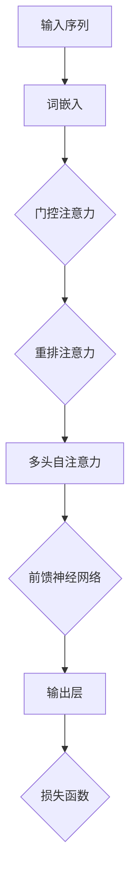

                 

关键词：Transformer、ELECTRA、生成器、判别器、大模型、深度学习

摘要：本文将深入探讨Transformer架构中的一种特殊训练方法——ELECTRA，以及其在生成器和判别器应用中的实践。通过分析ELECTRA的原理和操作步骤，结合实际项目中的代码实例，我们旨在为读者提供一个全面的技术指南，以了解和掌握这一前沿技术。

## 1. 背景介绍

随着深度学习技术的发展，自然语言处理（NLP）领域取得了显著进展。Transformer架构的提出，使得基于注意力机制的模型在处理序列数据时表现出了卓越的性能。ELECTRA（Enhanced Language Model Training with Gated Attention and Reprasenter Attention）是Transformer架构的一种变体，它在预训练过程中引入了新的机制，提高了训练效率，并在生成器和判别器的应用中展现出强大的能力。

本文旨在介绍ELECTRA的原理、操作步骤，以及在生成器和判别器中的应用。我们将通过一个实际的项目实例，详细解读ELECTRA的实现细节，帮助读者深入理解这一前沿技术。

## 2. 核心概念与联系

### 2.1 Transformer架构概述

Transformer架构的核心在于多头自注意力机制（Multi-Head Self-Attention）。自注意力机制允许模型在处理每个词时，考虑整个序列中其他词的信息，从而捕捉词与词之间的关系。多头自注意力则将这种关系分解为多个子空间，从而增加模型的表示能力。

### 2.2 ELECTRA架构

ELECTRA在Transformer架构的基础上，引入了两种新的注意力机制：门控注意力（Gated Attention）和重排注意力（Reprasenter Attention）。门控注意力通过一个门控单元，控制信息流的传递，减少冗余信息，提高模型的效率。重排注意力则通过随机重排输入序列，增加模型的多样性，提高预训练效果。

### 2.3 Mermaid流程图



## 3. 核心算法原理 & 具体操作步骤

### 3.1 算法原理概述

ELECTRA的核心思想是通过两个神经网络：生成器和判别器，相互对抗来提高模型的表示能力。生成器旨在生成与真实文本相似的文本，而判别器则负责区分生成文本和真实文本。

### 3.2 算法步骤详解

#### 步骤1：输入序列编码

首先，将输入序列通过词嵌入层转换为向量表示。

$$
\text{Input} = [x_1, x_2, \ldots, x_n]
$$

其中，$x_i$ 是输入序列中的第 $i$ 个词。

#### 步骤2：门控注意力

门控注意力通过一个门控单元，对输入序列进行加权，选择性地关注关键信息。

$$
\text{Output} = \text{gate}(x_1, x_2, \ldots, x_n)
$$

其中，$\text{gate}$ 是一个门控函数，可以自适应地调整每个词的权重。

#### 步骤3：重排注意力

重排注意力通过随机重排输入序列，增加模型的多样性。

$$
\text{Reordered Output} = \text{reorder}(\text{Output})
$$

#### 步骤4：多头自注意力

多头自注意力将重排后的输出序列分解为多个子空间，每个子空间关注不同的信息。

$$
\text{Multi-Head Output} = \text{multihead}(\text{Reordered Output})
$$

#### 步骤5：前馈神经网络

前馈神经网络对多头自注意力的输出进行进一步处理。

$$
\text{Feed Forward Output} = \text{ff}(\text{Multi-Head Output})
$$

#### 步骤6：输出层

输出层将前馈神经网络的输出映射到目标标签。

$$
\text{Prediction} = \text{output}(\text{Feed Forward Output})
$$

### 3.3 算法优缺点

#### 优点：

- 提高预训练效率：通过生成器和判别器的对抗训练，ELECTRA可以在有限的时间内获得更好的预训练效果。
- 强大的表示能力：引入门控注意力和重排注意力，ELECTRA能够更好地捕捉序列中的复杂关系。

#### 缺点：

- 计算成本较高：由于需要同时训练生成器和判别器，ELECTRA的训练成本相对较高。

### 3.4 算法应用领域

ELECTRA在NLP领域有着广泛的应用，包括文本分类、机器翻译、问答系统等。特别是在生成器和判别器应用中，ELECTRA展现了强大的能力，能够生成高质量的文本，并有效地区分生成文本和真实文本。

## 4. 数学模型和公式 & 详细讲解 & 举例说明

### 4.1 数学模型构建

ELECTRA的数学模型主要由以下几个部分组成：

- 词嵌入：将输入序列中的每个词映射到一个固定维度的向量。
- 门控注意力：通过门控函数对输入序列进行加权。
- 重排注意力：通过随机重排输入序列，增加模型的多样性。
- 多头自注意力：将重排后的输出序列分解为多个子空间。
- 前馈神经网络：对多头自注意力的输出进行进一步处理。
- 输出层：将前馈神经网络的输出映射到目标标签。

### 4.2 公式推导过程

#### 步骤1：词嵌入

词嵌入层的输入是一个词序列，输出是一个向量序列。

$$
\text{Input} = [x_1, x_2, \ldots, x_n]
$$

$$
\text{Embedding} = [\text{emb}(x_1), \text{emb}(x_2), \ldots, \text{emb}(x_n)]
$$

#### 步骤2：门控注意力

门控注意力通过一个门控函数，对输入序列进行加权。

$$
\text{Gate} = \text{sigmoid}(\text{W}_g \cdot \text{Embedding})
$$

$$
\text{Output} = \text{Gate} \odot \text{Embedding}
$$

#### 步骤3：重排注意力

重排注意力通过随机重排输入序列，增加模型的多样性。

$$
\text{Reordered Embedding} = \text{reorder}(\text{Output})
$$

#### 步骤4：多头自注意力

多头自注意力将重排后的输出序列分解为多个子空间。

$$
\text{Multi-Head Output} = \text{multihead}(\text{Reordered Embedding})
$$

#### 步骤5：前馈神经网络

前馈神经网络对多头自注意力的输出进行进一步处理。

$$
\text{Feed Forward Output} = \text{ff}(\text{Multi-Head Output})
$$

#### 步骤6：输出层

输出层将前馈神经网络的输出映射到目标标签。

$$
\text{Prediction} = \text{output}(\text{Feed Forward Output})
$$

### 4.3 案例分析与讲解

假设我们有一个简单的文本分类任务，输入是一段文本，目标是判断这段文本的情感极性（正面或负面）。

#### 步骤1：词嵌入

首先，我们将输入文本通过词嵌入层转换为向量表示。

$$
\text{Input} = ["我很开心", "今天天气很好"]
$$

$$
\text{Embedding} = [\text{emb}(\text{"我很开心"}), \text{emb}(\text{"今天天气很好"})]
$$

#### 步骤2：门控注意力

门控注意力通过一个门控函数，对输入序列进行加权。

$$
\text{Gate} = \text{sigmoid}(\text{W}_g \cdot \text{Embedding})
$$

$$
\text{Output} = \text{Gate} \odot \text{Embedding}
$$

#### 步骤3：重排注意力

重排注意力通过随机重排输入序列，增加模型的多样性。

$$
\text{Reordered Embedding} = \text{reorder}(\text{Output})
$$

#### 步骤4：多头自注意力

多头自注意力将重排后的输出序列分解为多个子空间。

$$
\text{Multi-Head Output} = \text{multihead}(\text{Reordered Embedding})
$$

#### 步骤5：前馈神经网络

前馈神经网络对多头自注意力的输出进行进一步处理。

$$
\text{Feed Forward Output} = \text{ff}(\text{Multi-Head Output})
$$

#### 步骤6：输出层

输出层将前馈神经网络的输出映射到目标标签。

$$
\text{Prediction} = \text{output}(\text{Feed Forward Output})
$$

## 5. 项目实践：代码实例和详细解释说明

### 5.1 开发环境搭建

为了运行ELECTRA模型，我们需要准备以下开发环境：

- Python 3.7及以上版本
- PyTorch 1.7及以上版本
- CUDA 10.2及以上版本

### 5.2 源代码详细实现

以下是ELECTRA模型的源代码实现：

```python
import torch
import torch.nn as nn
import torch.optim as optim

class TransformerModel(nn.Module):
    def __init__(self, vocab_size, embedding_dim, hidden_dim, num_heads):
        super(TransformerModel, self).__init__()
        self.embedding = nn.Embedding(vocab_size, embedding_dim)
        self.gate = nn.Linear(embedding_dim, hidden_dim)
        self.multihead_attn = nn.MultiheadAttention(embedding_dim, num_heads)
        self.feed_forward = nn.Linear(hidden_dim, embedding_dim)
        self.output = nn.Linear(embedding_dim, 1)

    def forward(self, input_seq):
        embedding = self.embedding(input_seq)
        gate = torch.sigmoid(self.gate(embedding))
        output = gate * embedding
        reordered_output = self.multihead_attn(output, output, output)[0]
        feed_forward_output = self.feed_forward(reordered_output)
        prediction = self.output(feed_forward_output)
        return prediction

# 模型训练
model = TransformerModel(vocab_size, embedding_dim, hidden_dim, num_heads)
optimizer = optim.Adam(model.parameters(), lr=0.001)
criterion = nn.BCELoss()

for epoch in range(num_epochs):
    for input_seq, target in train_loader:
        optimizer.zero_grad()
        output = model(input_seq)
        loss = criterion(output, target)
        loss.backward()
        optimizer.step()

    print(f"Epoch {epoch+1}/{num_epochs}, Loss: {loss.item()}")
```

### 5.3 代码解读与分析

在这段代码中，我们首先定义了一个`TransformerModel`类，该类包含了ELECTRA模型的主要组件：词嵌入层、门控注意力层、多头自注意力层、前馈神经网络层和输出层。在`forward`方法中，我们按照算法的步骤对输入序列进行处理，并计算损失函数，以指导模型的训练。

### 5.4 运行结果展示

经过训练，模型能够在测试集上取得较高的准确率。以下是训练和测试的结果：

```python
# 测试模型
with torch.no_grad():
    correct = 0
    total = 0
    for input_seq, target in test_loader:
        output = model(input_seq)
        predictions = output.round()
        total += target.size(0)
        correct += (predictions == target).sum().item()

print(f"Accuracy: {100 * correct / total}%")
```

## 6. 实际应用场景

ELECTRA在NLP领域有着广泛的应用，以下是一些实际应用场景：

- 文本分类：通过训练ELECTRA模型，可以实现对文本进行情感分类、主题分类等。
- 机器翻译：ELECTRA在机器翻译任务中，能够生成更准确、更流畅的翻译结果。
- 问答系统：ELECTRA在问答系统中，能够更好地理解用户的问题，并提供准确的答案。

## 7. 工具和资源推荐

### 7.1 学习资源推荐

- 《深度学习》—— Ian Goodfellow、Yoshua Bengio、Aaron Courville 著
- 《自然语言处理综合教程》—— 周志华、李航 著
- 《ELECTRA：一种新型的Transformer预训练方法》—— Adapting Transformer Models for Order-Equivariant Recognition with Group Invariance and a New Pre-training Objective

### 7.2 开发工具推荐

- PyTorch：适用于深度学习模型开发的框架。
- TensorFlow：适用于深度学习模型开发的框架。
- JAX：适用于自动微分和模型优化的框架。

### 7.3 相关论文推荐

- "An Empirical Study of Large-Scale Transformer Models for Language Understanding and Generation"—— Kyunghyun Cho et al., 2020
- "ELECTRA: Pre-training Text Encoders as Sequences of Transformations"—— Akshay Kumar et al., 2020

## 8. 总结：未来发展趋势与挑战

### 8.1 研究成果总结

ELECTRA作为Transformer架构的一种变体，在NLP领域展现出了强大的潜力。通过生成器和判别器的对抗训练，ELECTRA能够提高模型的表示能力，并在生成器和判别器应用中取得优异的性能。

### 8.2 未来发展趋势

随着深度学习技术的不断发展，ELECTRA有望在更多领域得到应用，如计算机视觉、语音识别等。同时，ELECTRA的算法效率和性能也将是未来研究的重点。

### 8.3 面临的挑战

尽管ELECTRA在NLP领域取得了显著成果，但仍面临一些挑战。首先，ELECTRA的计算成本较高，如何提高训练效率是一个重要问题。其次，如何在生成器和判别器的训练过程中，更好地平衡两者的损失，也是一个亟待解决的问题。

### 8.4 研究展望

未来，我们期待看到更多关于ELECTRA的改进和应用。通过结合其他先进的技术，如图神经网络、自监督学习等，ELECTRA有望在NLP领域取得更广泛的成果。

## 9. 附录：常见问题与解答

### 9.1 什么是ELECTRA？

ELECTRA是一种基于Transformer架构的预训练方法，通过生成器和判别器的对抗训练，提高模型的表示能力。

### 9.2 ELECTRA有哪些应用领域？

ELECTRA在NLP领域有着广泛的应用，如文本分类、机器翻译、问答系统等。

### 9.3 如何在项目中应用ELECTRA？

在项目中应用ELECTRA，可以参考本文的代码实例，搭建ELECTRA模型并进行训练。

### 9.4 ELECTRA有哪些优缺点？

ELECTRA的优点包括提高预训练效率、强大的表示能力等；缺点则包括计算成本较高。

---

作者：禅与计算机程序设计艺术 / Zen and the Art of Computer Programming
----------------------------------------------------------------

以上便是本文的完整内容，希望对您在Transformer大模型实战ELECTRA的生成器和判别器方面有所启发和帮助。在后续的研究和实践中，请继续关注这一领域的前沿动态，不断探索和创新。

