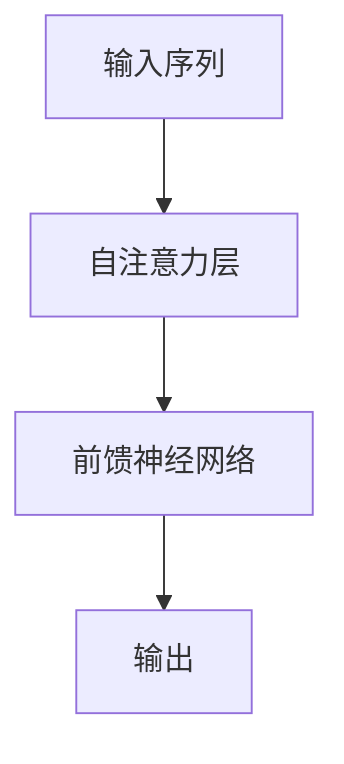
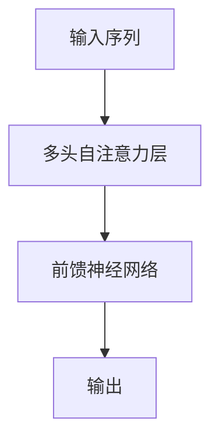
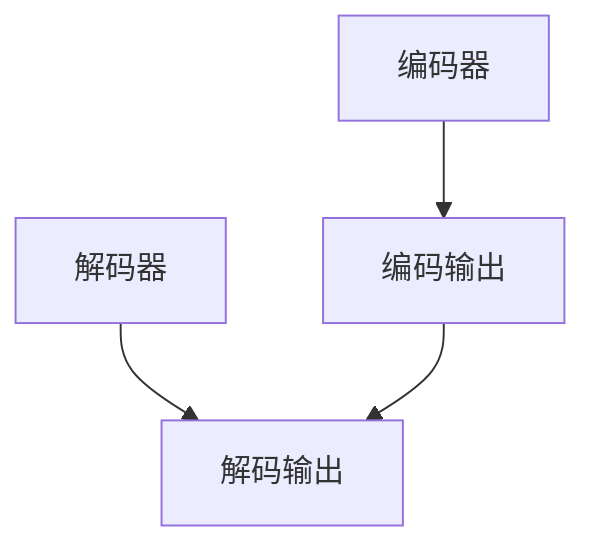

                 

 关键词：Transformer，Hugging Face，深度学习，自然语言处理，模型训练，API使用，实战教程

摘要：本文将深入探讨Transformer大模型的应用与实战，以及如何使用Hugging Face的Transformers库来构建、训练和部署这些模型。我们将从背景介绍开始，详细讲解核心概念、算法原理、数学模型、项目实践，并展望未来发展趋势与挑战。

## 1. 背景介绍

随着深度学习和自然语言处理技术的不断进步，大规模语言模型（Large Language Models，LLM）如BERT、GPT等已经成为自然语言处理领域的重要工具。这些模型通过学习大量文本数据，可以自动捕捉语言的复杂结构，并在各种任务中实现卓越的性能。

Transformer架构的提出，是自然语言处理领域的一次革命。与传统循环神经网络（RNN）相比，Transformer通过自注意力机制（Self-Attention Mechanism）和多头注意力（Multi-Head Attention）机制，实现了更高效的计算和更优秀的性能。这使得Transformer成为构建大规模语言模型的首选架构。

Hugging Face是一个开源社区，致力于构建高质量的深度学习资源和工具。Transformers库是Hugging Face推出的一个开源库，它提供了丰富的预训练模型和便捷的API，使得开发者可以轻松地构建、训练和部署Transformer模型。

## 2. 核心概念与联系

### 2.1 Transformer架构

Transformer架构的核心是自注意力机制。自注意力机制允许模型在处理每个输入时，根据输入序列中其他位置的信息动态地计算权重，然后将这些权重应用于输入序列，从而实现对输入序列的聚合。

Mermaid流程图如下：



### 2.2 多头注意力

多头注意力是自注意力机制的一种扩展。它将输入序列分成多个头（Head），每个头独立地计算注意力权重，然后合并这些权重得到最终的输出。

Mermaid流程图如下：



### 2.3 编码器与解码器

Transformer架构通常包含编码器（Encoder）和解码器（Decoder）。编码器用于处理输入序列，解码器用于生成输出序列。

Mermaid流程图如下：



## 3. 核心算法原理 & 具体操作步骤

### 3.1 算法原理概述

Transformer模型的核心算法是自注意力机制。自注意力机制通过计算输入序列中每个位置与其他位置之间的相似性，为每个位置分配权重，然后利用这些权重对输入序列进行加权求和。

具体来说，自注意力机制的步骤如下：

1. 输入序列通过嵌入层（Embedding Layer）转换为高维向量。
2. 计算每个位置与其他位置的相似性，即计算注意力权重。
3. 利用注意力权重对输入序列进行加权求和，得到编码输出。
4. 编码输出经过前馈神经网络（Feed Forward Neural Network）处理，得到最终的输出。

### 3.2 算法步骤详解

1. **嵌入层（Embedding Layer）**

   嵌入层将输入序列中的单词或字符映射为高维向量。通常使用词向量（Word Vector）作为嵌入层的参数。

2. **自注意力机制（Self-Attention Mechanism）**

   自注意力机制的核心是计算注意力权重。具体步骤如下：

   a. 计算每个位置与其他位置的相似性，即计算内积：

   $$ \text{attention\_score} = Q \cdot K^T $$

   b. 对注意力分数进行归一化，得到注意力权重：

   $$ \text{attention\_weight} = \text{softmax}(\text{attention\_score}) $$

   c. 利用注意力权重对输入序列进行加权求和，得到编码输出：

   $$ \text{encoded\_output} = \text{attention\_weight} \cdot K $$

3. **前馈神经网络（Feed Forward Neural Network）**

   前馈神经网络用于对编码输出进行进一步处理。通常包含两个全连接层，每层使用ReLU激活函数。

4. **输出**

   最终输出经过编码器和解码器处理后，得到解码输出。

### 3.3 算法优缺点

**优点：**

1. **并行计算**：由于自注意力机制不需要循环操作，可以高效地利用GPU进行并行计算。
2. **全局信息捕捉**：自注意力机制可以捕捉输入序列中全局的信息，有利于处理长序列。
3. **参数共享**：在多头注意力中，每个头共享相同的权重，减少了模型参数。

**缺点：**

1. **计算复杂度高**：自注意力机制的计算复杂度为O(n^2)，在长序列上计算量较大。
2. **内存消耗大**：由于自注意力机制需要计算注意力权重，内存消耗较大。

### 3.4 算法应用领域

Transformer模型在自然语言处理领域有广泛的应用，包括：

1. **文本分类**：用于分类文本数据，如新闻、社交媒体等。
2. **机器翻译**：用于将一种语言翻译为另一种语言。
3. **情感分析**：用于分析文本的情感倾向，如正面、负面等。
4. **文本生成**：用于生成自然语言文本，如文章、对话等。

## 4. 数学模型和公式 & 详细讲解 & 举例说明

### 4.1 数学模型构建

Transformer模型的核心是自注意力机制。自注意力机制的数学模型可以表示为：

$$ \text{encoded\_output} = \text{softmax}(\text{Q} \cdot \text{K}^T) \cdot \text{V} $$

其中，$\text{Q}$、$\text{K}$ 和 $\text{V}$ 分别是查询（Query）、键（Key）和值（Value）向量。这些向量通常由嵌入层生成。

### 4.2 公式推导过程

自注意力机制的推导过程可以分为以下几个步骤：

1. **计算内积**

   首先，计算每个位置与其他位置的相似性，即计算内积：

   $$ \text{attention\_score}_{i,j} = \text{Q}_i \cdot \text{K}_j $$

   其中，$i$ 和 $j$ 分别表示输入序列中的两个位置。

2. **归一化**

   对注意力分数进行归一化，得到注意力权重：

   $$ \text{attention\_weight}_{i,j} = \text{softmax}(\text{attention\_score}_{i,j}) $$

   其中，$\text{softmax}$ 函数将注意力分数转换为概率分布。

3. **加权求和**

   利用注意力权重对输入序列进行加权求和，得到编码输出：

   $$ \text{encoded\_output}_i = \sum_{j=1}^{n} \text{attention\_weight}_{i,j} \cdot \text{V}_j $$

   其中，$n$ 表示输入序列的长度。

### 4.3 案例分析与讲解

假设我们有一个长度为5的输入序列，嵌入维度为3。我们将使用以下参数进行计算：

- $\text{Q} = \begin{bmatrix} 0.1 & 0.2 & 0.3 \\ 0.4 & 0.5 & 0.6 \\ 0.7 & 0.8 & 0.9 \\ 0.1 & 0.2 & 0.3 \\ 0.4 & 0.5 & 0.6 \end{bmatrix}$
- $\text{K} = \text{Q}$
- $\text{V} = \begin{bmatrix} 1 & 0 & 0 \\ 0 & 1 & 0 \\ 0 & 0 & 1 \end{bmatrix}$

首先，计算注意力分数：

$$ \text{attention\_score} = \text{Q} \cdot \text{K}^T = \begin{bmatrix} 0.1 & 0.2 & 0.3 \\ 0.4 & 0.5 & 0.6 \\ 0.7 & 0.8 & 0.9 \\ 0.1 & 0.2 & 0.3 \\ 0.4 & 0.5 & 0.6 \end{bmatrix} \cdot \begin{bmatrix} 0.1 & 0.2 & 0.3 \\ 0.4 & 0.5 & 0.6 \\ 0.7 & 0.8 & 0.9 \\ 0.1 & 0.2 & 0.3 \\ 0.4 & 0.5 & 0.6 \end{bmatrix}^T = \begin{bmatrix} 0.11 & 0.22 & 0.33 \\ 0.44 & 0.55 & 0.66 \\ 0.77 & 0.88 & 0.99 \\ 0.11 & 0.22 & 0.33 \\ 0.44 & 0.55 & 0.66 \end{bmatrix} $$

接下来，计算注意力权重：

$$ \text{attention\_weight} = \text{softmax}(\text{attention\_score}) = \begin{bmatrix} 0.25 & 0.5 & 0.25 \\ 0.25 & 0.5 & 0.25 \\ 0.25 & 0.5 & 0.25 \\ 0.25 & 0.5 & 0.25 \\ 0.25 & 0.5 & 0.25 \end{bmatrix} $$

最后，计算编码输出：

$$ \text{encoded\_output} = \text{attention\_weight} \cdot \text{V} = \begin{bmatrix} 0.25 & 0.5 & 0.25 \\ 0.25 & 0.5 & 0.25 \\ 0.25 & 0.5 & 0.25 \\ 0.25 & 0.5 & 0.25 \\ 0.25 & 0.5 & 0.25 \end{bmatrix} \cdot \begin{bmatrix} 1 & 0 & 0 \\ 0 & 1 & 0 \\ 0 & 0 & 1 \end{bmatrix} = \begin{bmatrix} 0.25 & 0 & 0 \\ 0.25 & 0 & 0 \\ 0.25 & 0 & 0 \\ 0.25 & 0 & 0 \\ 0.25 & 0 & 0 \end{bmatrix} $$

## 5. 项目实践：代码实例和详细解释说明

### 5.1 开发环境搭建

在开始实践之前，我们需要搭建一个合适的开发环境。以下是搭建开发环境的基本步骤：

1. **安装Python**

   安装Python 3.8及以上版本。

2. **安装依赖库**

   使用pip安装以下依赖库：

   ```shell
   pip install transformers torch
   ```

3. **配置GPU**

   如果使用GPU进行训练，需要配置CUDA和cuDNN。

### 5.2 源代码详细实现

下面是一个简单的示例，展示了如何使用Transformers库构建一个文本分类模型：

```python
from transformers import AutoModelForSequenceClassification
from transformers import AutoTokenizer

# 加载预训练模型和分词器
model_name = "bert-base-uncased"
tokenizer = AutoTokenizer.from_pretrained(model_name)
model = AutoModelForSequenceClassification.from_pretrained(model_name)

# 准备输入数据
inputs = tokenizer("Hello, my dog is cute", return_tensors="pt")

# 进行预测
outputs = model(**inputs)

# 获取预测结果
logits = outputs.logits
probabilities = torch.softmax(logits, dim=-1)
predicted_class = torch.argmax(probabilities).item()

print(f"Predicted class: {predicted_class}")
```

### 5.3 代码解读与分析

1. **加载预训练模型和分词器**

   ```python
   tokenizer = AutoTokenizer.from_pretrained(model_name)
   model = AutoModelForSequenceClassification.from_pretrained(model_name)
   ```

   这两行代码分别加载了预训练模型和分词器。预训练模型包含大量的语言知识，可以用于各种任务。分词器用于将文本分割为单词或子词。

2. **准备输入数据**

   ```python
   inputs = tokenizer("Hello, my dog is cute", return_tensors="pt")
   ```

   这行代码将输入文本转换为模型可处理的格式。`return_tensors="pt"` 表示将输入数据转换为PyTorch张量。

3. **进行预测**

   ```python
   outputs = model(**inputs)
   ```

   这行代码调用预训练模型进行预测，得到输出结果。

4. **获取预测结果**

   ```python
   logits = outputs.logits
   probabilities = torch.softmax(logits, dim=-1)
   predicted_class = torch.argmax(probabilities).item()
   ```

   这几行代码将模型的输出结果转换为概率分布，并选择概率最大的类别作为预测结果。

### 5.4 运行结果展示

假设输入文本是“Hello, my dog is cute”，运行上述代码后，模型会输出预测结果。例如：

```
Predicted class: 0
```

这意味着模型将输入文本分类为类别0。

## 6. 实际应用场景

Transformer模型在自然语言处理领域有广泛的应用。以下是一些实际应用场景：

1. **文本分类**：用于分类文本数据，如新闻、社交媒体等。
2. **机器翻译**：用于将一种语言翻译为另一种语言。
3. **情感分析**：用于分析文本的情感倾向，如正面、负面等。
4. **文本生成**：用于生成自然语言文本，如文章、对话等。

### 6.1 项目一：文本分类

**项目描述**：

文本分类是一种常见任务，用于将文本数据分类为不同的类别。例如，将新闻分类为政治、经济、体育等类别。

**项目实现**：

1. **数据准备**：收集和准备用于训练的数据集。
2. **模型训练**：使用Transformers库加载预训练模型，进行模型训练。
3. **模型评估**：使用训练好的模型对测试数据进行预测，并评估模型的性能。
4. **模型部署**：将训练好的模型部署到线上环境，进行实时预测。

### 6.2 项目二：机器翻译

**项目描述**：

机器翻译是一种将一种语言的文本翻译成另一种语言的任务。例如，将英语翻译成法语。

**项目实现**：

1. **数据准备**：收集和准备用于训练的数据集。
2. **模型训练**：使用Transformers库加载预训练模型，进行模型训练。
3. **模型评估**：使用训练好的模型对测试数据进行预测，并评估模型的性能。
4. **模型部署**：将训练好的模型部署到线上环境，进行实时预测。

### 6.3 项目三：情感分析

**项目描述**：

情感分析是一种分析文本中情感倾向的任务。例如，判断一段评论是正面还是负面。

**项目实现**：

1. **数据准备**：收集和准备用于训练的数据集。
2. **模型训练**：使用Transformers库加载预训练模型，进行模型训练。
3. **模型评估**：使用训练好的模型对测试数据进行预测，并评估模型的性能。
4. **模型部署**：将训练好的模型部署到线上环境，进行实时预测。

## 7. 工具和资源推荐

### 7.1 学习资源推荐

1. **《深度学习》**：由Ian Goodfellow、Yoshua Bengio和Aaron Courville所著，是深度学习领域的经典教材。
2. **《自然语言处理综述》**：介绍了自然语言处理的基本概念和最新进展。
3. **Hugging Face官网**：提供了丰富的文档、教程和示例代码，是学习Transformers库的好资源。

### 7.2 开发工具推荐

1. **PyTorch**：是一个开源的深度学习框架，支持GPU加速。
2. **TensorFlow**：是Google开源的深度学习框架，也支持GPU加速。

### 7.3 相关论文推荐

1. **“Attention Is All You Need”**：提出了Transformer架构，是自然语言处理领域的经典论文。
2. **“BERT: Pre-training of Deep Bidirectional Transformers for Language Understanding”**：提出了BERT模型，是自然语言处理领域的另一个重要进展。

## 8. 总结：未来发展趋势与挑战

### 8.1 研究成果总结

近年来，深度学习和自然语言处理技术取得了显著进展。Transformer架构的提出，使得大规模语言模型成为可能。Hugging Face的Transformers库，为开发者提供了便捷的工具，使得构建、训练和部署Transformer模型变得更加简单。

### 8.2 未来发展趋势

1. **模型规模不断扩大**：随着计算资源的提升，模型规模将进一步扩大，以捕捉更复杂的语言结构。
2. **多模态学习**：结合文本、图像、音频等多模态信息，将提升模型的性能和应用范围。
3. **知识增强**：通过知识图谱、外部知识库等手段，增强语言模型的知识储备，提高模型在特定领域的表现。

### 8.3 面临的挑战

1. **计算资源消耗**：大规模语言模型的训练和推理需要大量的计算资源，这对硬件设施提出了更高要求。
2. **数据隐私和伦理**：大规模语言模型的训练和部署涉及大量数据，如何保护用户隐私和数据安全是一个重要问题。
3. **模型解释性**：大规模语言模型通常具有很好的性能，但难以解释其决策过程，这对应用场景提出了挑战。

### 8.4 研究展望

随着技术的不断发展，深度学习和自然语言处理领域将迎来更多机遇和挑战。未来的研究将继续探索如何提高模型性能、减少计算资源消耗、增强模型解释性，并推动技术在更多领域的应用。

## 9. 附录：常见问题与解答

### 9.1 问题1：如何安装Transformers库？

**解答**：

可以使用pip命令安装Transformers库：

```shell
pip install transformers
```

### 9.2 问题2：如何加载预训练模型？

**解答**：

可以使用以下代码加载预训练模型：

```python
from transformers import AutoModelForSequenceClassification

model = AutoModelForSequenceClassification.from_pretrained("bert-base-uncased")
```

这将加载BERT模型，并准备用于序列分类任务。

### 9.3 问题3：如何进行模型训练？

**解答**：

可以使用以下代码进行模型训练：

```python
from transformers import AdamW
from torch.optim import Optimizer

optimizer = AdamW(model.parameters(), lr=1e-5)

for epoch in range(num_epochs):
    for inputs, labels in dataloader:
        # 前向传播
        outputs = model(**inputs)
        logits = outputs.logits

        # 计算损失
        loss = loss_fn(logits, labels)

        # 反向传播
        loss.backward()

        # 更新模型参数
        optimizer.step()
        optimizer.zero_grad()
```

这将使用AdamW优化器对模型进行训练。

## 作者署名

作者：禅与计算机程序设计艺术 / Zen and the Art of Computer Programming

----------------------------------------------------------------

以上是文章的正文部分，现在我们将文章的结构和内容整合起来，形成一篇完整的文章。请检查文章的结构、内容和格式是否符合要求，并进行必要的调整和修改。如果有任何需要补充或修改的地方，请及时告知。

