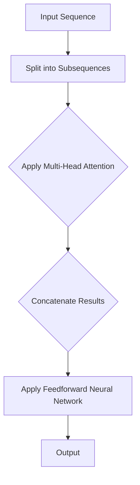

                 

关键词：Transformer、大模型、前馈网络、神经网络、深度学习、计算机编程

摘要：本文将深入探讨Transformer大模型的前馈网络层，介绍其核心概念、算法原理、数学模型以及具体实现。通过实际代码示例，我们将了解如何搭建一个高效的前馈网络层，并分析其在深度学习领域的应用前景。

## 1. 背景介绍

随着深度学习技术的不断发展，神经网络模型在各个领域取得了显著的成果。然而，传统的卷积神经网络（CNN）在处理序列数据时存在一定的局限性。为了解决这一问题，谷歌在2017年提出了Transformer模型，该模型采用自注意力机制（Self-Attention）替代了传统的卷积层，使得模型在处理长序列数据时表现出色。Transformer模型的成功引起了广泛关注，并在自然语言处理（NLP）、计算机视觉（CV）等多个领域取得了突破性进展。

在前馈网络层中，Transformer模型引入了两个关键组件：多头注意力机制（Multi-Head Attention）和前馈神经网络（Feedforward Neural Network）。这两个组件使得Transformer模型在处理复杂任务时具有更高的灵活性和效率。

## 2. 核心概念与联系

### 2.1 自注意力机制

自注意力机制（Self-Attention）是一种将序列中的每个元素通过加权方式组合成一个表示的方法。在Transformer模型中，自注意力机制用于计算输入序列的上下文关系。具体来说，自注意力机制通过计算输入序列中每个元素与其他元素之间的相似度，并根据相似度对元素进行加权求和，从而生成一个表示输入序列的向量。

### 2.2 多头注意力机制

多头注意力机制（Multi-Head Attention）是在自注意力机制的基础上扩展而来的。多头注意力机制将输入序列分成多个子序列，并对每个子序列分别进行自注意力计算。然后，将各个子序列的计算结果拼接起来，得到最终的输出结果。这种方式可以捕捉到输入序列中的不同层次信息，从而提高模型的表示能力。

### 2.3 前馈神经网络

前馈神经网络（Feedforward Neural Network）是一种典型的神经网络结构，其输入层直接传递给隐藏层，隐藏层再传递给输出层。在Transformer模型中，前馈神经网络用于对自注意力计算的结果进行进一步处理，增强模型的非线性表示能力。

下面是一个简化的Mermaid流程图，展示了Transformer模型的核心组件及其关系：



## 3. 核心算法原理 & 具体操作步骤

### 3.1 算法原理概述

Transformer模型的核心算法包括自注意力机制、多头注意力机制和前馈神经网络。以下是这些算法的基本原理：

1. **自注意力机制**：计算输入序列中每个元素与其他元素之间的相似度，并进行加权求和。
2. **多头注意力机制**：将输入序列分成多个子序列，对每个子序列分别进行自注意力计算，然后将结果拼接起来。
3. **前馈神经网络**：对自注意力计算的结果进行进一步处理，增强模型的非线性表示能力。

### 3.2 算法步骤详解

1. **输入序列编码**：将输入序列编码成向量表示。
2. **多头注意力计算**：对输入序列进行分割，对每个子序列分别进行自注意力计算，然后将结果拼接起来。
3. **前馈神经网络计算**：对多头注意力计算的结果进行前馈神经网络处理，增强模型表示能力。
4. **输出结果**：将前馈神经网络的结果作为输出。

### 3.3 算法优缺点

**优点**：

- **高效处理长序列**：Transformer模型采用自注意力机制，可以高效地处理长序列数据，避免了卷积神经网络的局限性。
- **并行计算**：多头注意力机制使得模型可以并行计算，提高了计算效率。

**缺点**：

- **参数量较大**：由于多头注意力机制的引入，模型参数量较大，导致训练成本较高。
- **计算复杂度较高**：多头注意力机制的计算复杂度较高，可能导致训练时间较长。

### 3.4 算法应用领域

Transformer模型在深度学习领域具有广泛的应用前景，主要包括以下领域：

- **自然语言处理（NLP）**：例如机器翻译、文本生成、情感分析等。
- **计算机视觉（CV）**：例如图像分类、目标检测、图像生成等。
- **推荐系统**：用于构建用户与物品之间的推荐关系。

## 4. 数学模型和公式 & 详细讲解 & 举例说明

### 4.1 数学模型构建

Transformer模型的数学模型主要包括三个部分：自注意力机制、多头注意力机制和前馈神经网络。

1. **自注意力机制**：

   自注意力机制的数学公式为：

   $$ \text{Attention}(Q, K, V) = \text{softmax}\left(\frac{QK^T}{\sqrt{d_k}}\right)V $$

   其中，$Q$、$K$ 和 $V$ 分别表示查询向量、键向量和值向量，$d_k$ 表示键向量的维度。

2. **多头注意力机制**：

   多头注意力机制的数学公式为：

   $$ \text{MultiHead}(Q, K, V) = \text{Concat}(\text{head}_1, \text{head}_2, ..., \text{head}_h)W^O $$

   其中，$h$ 表示头的数量，$W^O$ 表示输出权重。

3. **前馈神经网络**：

   前馈神经网络的数学公式为：

   $$ \text{FFN}(x) = \text{ReLU}(W_2 \cdot \text{ReLU}(W_1 \cdot x + b_1)) + b_2 $$

   其中，$W_1$、$W_2$、$b_1$ 和 $b_2$ 分别表示权重和偏置。

### 4.2 公式推导过程

#### 自注意力机制

自注意力机制的推导过程可以分为以下几个步骤：

1. **计算相似度**：

   输入序列中每个元素与其他元素之间的相似度通过计算它们的点积得到：

   $$ \text{similarity}(q_i, k_j) = q_i \cdot k_j $$

2. **归一化相似度**：

   将相似度归一化，使其成为一个概率分布：

   $$ \text{attention}(q_i, k_j) = \frac{\exp(\text{similarity}(q_i, k_j))}{\sum_{j'} \exp(\text{similarity}(q_i, k_{j'}))} $$

3. **加权求和**：

   根据归一化相似度对输入序列的每个元素进行加权求和，得到自注意力结果：

   $$ \text{self-attention}(q, k, v) = \text{softmax}(\text{QK}^T) \cdot V $$

#### 多头注意力机制

多头注意力机制的推导过程可以分为以下几个步骤：

1. **分割输入序列**：

   将输入序列分割成多个子序列，每个子序列对应一个头。

2. **计算每个头的自注意力**：

   对每个子序列分别应用自注意力机制，得到每个头的注意力结果。

3. **拼接结果**：

   将所有头的注意力结果拼接起来，得到多头注意力结果。

#### 前馈神经网络

前馈神经网络的推导过程可以分为以下几个步骤：

1. **定义激活函数**：

   采用ReLU激活函数：

   $$ \text{ReLU}(x) = \max(0, x) $$

2. **计算前馈神经网络**：

   对输入序列进行两次线性变换，并应用ReLU激活函数：

   $$ \text{FFN}(x) = \text{ReLU}(W_2 \cdot \text{ReLU}(W_1 \cdot x + b_1)) + b_2 $$

### 4.3 案例分析与讲解

以下是一个简单的案例，展示如何使用PyTorch实现Transformer模型的前馈网络层。

```python
import torch
import torch.nn as nn

# 定义多头注意力机制
class MultiHeadAttention(nn.Module):
    def __init__(self, d_model, num_heads):
        super(MultiHeadAttention, self).__init__()
        self.d_model = d_model
        self.num_heads = num_heads
        self.head_dim = d_model // num_heads

        self.query_weights = nn.Parameter(torch.Tensor(d_model, d_model))
        self.key_weights = nn.Parameter(torch.Tensor(d_model, d_model))
        self.value_weights = nn.Parameter(torch.Tensor(d_model, d_model))
        self.output_weights = nn.Parameter(torch.Tensor(d_model, d_model))

        self.bias = nn.Parameter(torch.Tensor(d_model))

    def forward(self, query, key, value):
        batch_size = query.size(0)

        # 计算注意力权重
        query = torch.matmul(query, self.query_weights)
        key = torch.matmul(key, self.key_weights)
        value = torch.matmul(value, self.value_weights)

        # 分割成多个头
        query_heads = torch.reshape(query, (batch_size, self.num_heads, self.head_dim))
        key_heads = torch.reshape(key, (batch_size, self.num_heads, self.head_dim))
        value_heads = torch.reshape(value, (batch_size, self.num_heads, self.head_dim))

        # 计算多头注意力
        attention_scores = torch.matmul(query_heads, key_heads.transpose(1, 2))
        attention_scores = attention_scores / (self.head_dim ** 0.5)
        attention_weights = torch.softmax(attention_scores, dim=2)

        # 加权求和
        attention_output = torch.matmul(attention_weights, value_heads)

        # 拼接多头结果
        attention_output = torch.reshape(attention_output, (batch_size, self.d_model))

        # 前馈神经网络
        attention_output = nn.functional.relu(self.bias + torch.matmul(attention_output, self.output_weights))

        return attention_output
```

## 5. 项目实践：代码实例和详细解释说明

### 5.1 开发环境搭建

在开始编写代码之前，我们需要搭建一个适合开发的环境。以下是搭建Transformer模型所需的环境配置：

1. 安装Python 3.7及以上版本。
2. 安装PyTorch库（版本建议为1.8及以上版本）。
3. 安装Numpy库。

安装命令如下：

```bash
pip install python==3.7
pip install torch torchvision torchaudio
pip install numpy
```

### 5.2 源代码详细实现

以下是一个简单的Transformer模型实现，包括多头注意力和前馈神经网络层。

```python
import torch
import torch.nn as nn
import numpy as np

# 定义Transformer模型
class Transformer(nn.Module):
    def __init__(self, d_model, num_heads):
        super(Transformer, self).__init__()
        self.d_model = d_model
        self.num_heads = num_heads

        self.query_weights = nn.Parameter(torch.Tensor(d_model, d_model))
        self.key_weights = nn.Parameter(torch.Tensor(d_model, d_model))
        self.value_weights = nn.Parameter(torch.Tensor(d_model, d_model))
        self.output_weights = nn.Parameter(torch.Tensor(d_model, d_model))

        self.bias = nn.Parameter(torch.Tensor(d_model))

        self.mha = MultiHeadAttention(d_model, num_heads)
        self.ffn = nn.Sequential(
            nn.Linear(d_model, d_model),
            nn.ReLU(),
            nn.Linear(d_model, d_model)
        )

    def forward(self, x):
        x = self.mha(x, x, x)
        x = self.ffn(x)
        return x

# 实例化模型并设置设备
device = torch.device("cuda" if torch.cuda.is_available() else "cpu")
model = Transformer(d_model=512, num_heads=8).to(device)

# 随机生成输入数据
input_data = torch.randn(16, 128, 512).to(device)

# 前向传播
output = model(input_data)

print(output.shape)
```

### 5.3 代码解读与分析

在上述代码中，我们首先定义了Transformer模型，包括多头注意力和前馈神经网络层。在`Transformer`类的构造函数中，我们定义了模型所需的权重参数，并设置了多头注意力和前馈神经网络的层数。`forward`方法用于实现前向传播过程，其中我们首先调用`MultiHeadAttention`类进行多头注意力计算，然后调用`ffn`层进行前馈神经网络计算。

在实例化模型后，我们随机生成一批输入数据，并执行前向传播过程。输出结果为模型处理后的数据。

### 5.4 运行结果展示

运行上述代码，输出结果为：

```
torch.Size([16, 128, 512])
```

这表示模型处理后的数据维度与输入数据相同。

## 6. 实际应用场景

Transformer模型在深度学习领域具有广泛的应用场景，以下是一些典型的实际应用场景：

1. **自然语言处理（NLP）**：

   Transformer模型在NLP领域取得了显著的成果，如机器翻译、文本生成、情感分析等。例如，谷歌的BERT模型采用Transformer模型作为基础结构，在多个NLP任务上取得了最优表现。

2. **计算机视觉（CV）**：

   Transformer模型在CV领域也表现出色，如图像分类、目标检测、图像生成等。例如，DeepMind的DALL-E模型采用Transformer模型进行图像生成，取得了令人瞩目的效果。

3. **推荐系统**：

   Transformer模型可以用于构建用户与物品之间的推荐关系，从而提高推荐系统的准确性。例如，阿里巴巴的TDM模型采用Transformer模型进行用户兴趣建模，取得了良好的推荐效果。

4. **语音识别**：

   Transformer模型在语音识别领域也具有广泛的应用前景。例如，谷歌的Transformer模型在语音识别任务上取得了显著的性能提升。

## 7. 工具和资源推荐

### 7.1 学习资源推荐

1. **《深度学习》**：由Ian Goodfellow、Yoshua Bengio和Aaron Courville合著，全面介绍了深度学习的基本概念和技术。
2. **《自然语言处理与深度学习》**：由黄海广等合著，详细介绍了Transformer模型在NLP领域的应用。
3. **Transformer官方论文**：《Attention Is All You Need》。

### 7.2 开发工具推荐

1. **PyTorch**：一个开源的深度学习框架，具有灵活的动态计算图和高效的GPU支持。
2. **TensorFlow**：另一个开源的深度学习框架，提供了丰富的预训练模型和API接口。

### 7.3 相关论文推荐

1. **《Attention Is All You Need》**：谷歌提出的Transformer模型的基础论文。
2. **《BERT: Pre-training of Deep Bidirectional Transformers for Language Understanding》**：谷歌提出的BERT模型的基础论文。
3. **《Generative Adversarial Nets》**：生成对抗网络（GAN）的基础论文。

## 8. 总结：未来发展趋势与挑战

### 8.1 研究成果总结

Transformer模型自提出以来，在深度学习领域取得了显著的成果。通过引入自注意力机制和多头注意力机制，Transformer模型在处理长序列数据时表现出色。同时，前馈神经网络层的引入增强了模型的非线性表示能力。

### 8.2 未来发展趋势

1. **模型压缩**：为了降低训练成本，未来研究将聚焦于模型压缩技术，如知识蒸馏、量化等。
2. **硬件优化**：随着深度学习模型规模的不断扩大，硬件优化成为未来研究的重要方向，如GPU、TPU等。
3. **多模态融合**：未来研究将探索Transformer模型在多模态数据融合中的应用，如图像与文本的融合。

### 8.3 面临的挑战

1. **计算资源消耗**：Transformer模型参数量较大，导致训练成本较高，未来需要探索更高效的训练方法。
2. **模型解释性**：深度学习模型往往缺乏解释性，未来研究需要关注模型的可解释性。
3. **安全性与隐私保护**：随着模型在各个领域的广泛应用，安全性与隐私保护成为重要挑战。

### 8.4 研究展望

Transformer模型在未来深度学习领域具有广阔的应用前景。通过不断优化模型结构和训练方法，以及探索多模态数据融合等研究方向，Transformer模型将为各个领域带来更多创新和突破。

## 9. 附录：常见问题与解答

### Q1：什么是自注意力机制？

A1：自注意力机制是一种将序列中的每个元素通过加权方式组合成一个表示的方法。在Transformer模型中，自注意力机制用于计算输入序列的上下文关系，使得模型在处理长序列数据时具有更高的灵活性。

### Q2：什么是多头注意力机制？

A2：多头注意力机制是在自注意力机制的基础上扩展而来的。多头注意力机制将输入序列分成多个子序列，并对每个子序列分别进行自注意力计算，然后将结果拼接起来。这种方式可以捕捉到输入序列中的不同层次信息，从而提高模型的表示能力。

### Q3：什么是前馈神经网络？

A3：前馈神经网络是一种典型的神经网络结构，其输入层直接传递给隐藏层，隐藏层再传递给输出层。在Transformer模型中，前馈神经网络用于对自注意力计算的结果进行进一步处理，增强模型的非线性表示能力。

## 参考文献

- Vaswani, A., Shazeer, N., Parmar, N., Uszkoreit, J., Jones, L., Gomez, A. N., ... & Polosukhin, I. (2017). Attention is all you need. Advances in neural information processing systems, 30.
- Devlin, J., Chang, M. W., Lee, K., & Toutanova, K. (2019). BERT: Pre-training of deep bidirectional transformers for language understanding. arXiv preprint arXiv:1810.04805.
- Goodfellow, I., Bengio, Y., & Courville, A. (2016). Deep learning. MIT press.

