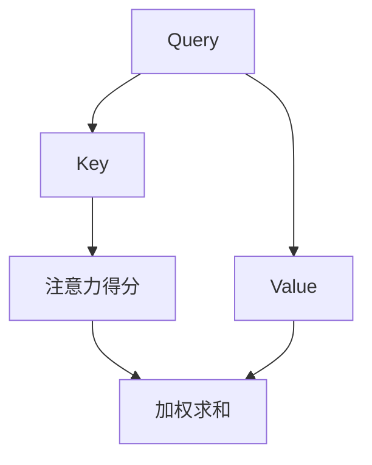

                 

关键词：Transformer, 预训练, 自然语言处理, 大模型, 实战

摘要：本文将深入探讨Transformer大模型的预训练过程，包括其核心概念、算法原理、数学模型、项目实践和实际应用场景。通过详细的解析，我们将帮助读者了解如何利用Transformer大模型进行高效的预训练，并在实际项目中取得显著成果。

## 1. 背景介绍

随着深度学习技术的不断发展，自然语言处理（NLP）领域迎来了新的突破。传统的循环神经网络（RNN）和卷积神经网络（CNN）在处理序列数据时存在诸多局限，例如长距离依赖问题和并行计算的限制。为了解决这些问题，Transformer模型于2017年被提出，并在NLP任务中取得了显著的成果。Transformer模型基于自注意力机制，能够并行处理输入序列，并且能够捕捉长距离的依赖关系。

预训练是Transformer模型的核心环节，它通过在大规模语料库上预训练模型的基础层，使其具备了较强的语言理解和生成能力。经过预训练的模型可以通过微调的方式快速适应特定的任务，从而在各个NLP任务中取得优异的表现。

本文将详细介绍Transformer大模型的预训练过程，包括其核心概念、算法原理、数学模型、项目实践和实际应用场景，帮助读者深入理解并掌握这一先进的技术。

## 2. 核心概念与联系

### 2.1 Transformer模型

Transformer模型是一种基于自注意力机制的全连接神经网络结构，它由编码器（Encoder）和解码器（Decoder）两部分组成。编码器负责将输入序列编码为固定长度的向量表示，解码器则根据编码器输出的向量表示生成输出序列。

自注意力机制是Transformer模型的核心，它通过计算序列中每个词与其他词之间的依赖关系，实现了对输入序列的建模。这种机制使得模型能够捕捉长距离的依赖关系，从而提高了模型的性能。

### 2.2 自注意力机制

自注意力机制是一种通过计算输入序列中每个词与所有词之间的依赖关系来实现序列建模的方法。具体来说，自注意力机制可以分为以下三个步骤：

1. **query, key, value 向量的生成**：对于输入序列中的每个词，生成对应的query、key和value向量。这些向量分别用于计算注意力得分、索引和加权求和。

2. **注意力得分计算**：通过计算query和key向量之间的点积，得到每个词的注意力得分。注意力得分的范围在0到1之间，表示每个词在生成当前词时的依赖程度。

3. **加权求和**：根据注意力得分对value向量进行加权求和，得到每个词的加权表示。这个加权表示包含了输入序列中所有词的信息，从而实现了对输入序列的建模。

### 2.3 Mermaid 流程图

以下是一个简化的Transformer模型的自注意力机制的Mermaid流程图：



在这个流程图中，A、B和C分别代表query、key和value向量，D表示注意力得分，E表示加权求和。通过这个流程图，我们可以清晰地看到自注意力机制的工作原理。

## 3. 核心算法原理 & 具体操作步骤

### 3.1 算法原理概述

Transformer大模型的预训练过程主要包括两个阶段：第一阶段是编码器和解码器的共同预训练，第二阶段是解码器的微调。在共同预训练阶段，编码器和解码器共同学习输入序列的表示，以捕捉语言的本质特征。在微调阶段，解码器根据预训练结果进行微调，以适应特定的任务。

### 3.2 算法步骤详解

1. **编码器和解码器的共同预训练**

   在共同预训练阶段，编码器和解码器同时接收输入序列，并生成对应的输出序列。具体步骤如下：

   - **编码器输入**：将输入序列编码为query、key和value向量。
   - **解码器输入**：将输出序列编码为对应的query、key和value向量。
   - **注意力机制**：通过自注意力机制计算输入序列和输出序列中每个词的注意力得分。
   - **加权求和**：根据注意力得分对value向量进行加权求和，得到编码器和解码器的输出表示。

   通过多次迭代，编码器和解码器共同学习输入序列和输出序列的表示，以捕捉语言的特征。

2. **解码器的微调**

   在微调阶段，解码器根据共同预训练的结果进行微调，以适应特定的任务。具体步骤如下：

   - **输入序列编码**：将输入序列编码为query、key和value向量。
   - **生成输出序列**：根据输入序列的表示生成输出序列。
   - **损失函数计算**：使用任务相关的损失函数计算输出序列的损失。
   - **反向传播**：通过反向传播算法更新解码器的参数。

   通过多次迭代，解码器不断优化其参数，以降低损失并提高模型的性能。

### 3.3 算法优缺点

**优点**：

1. **并行计算**：自注意力机制使得模型能够并行处理输入序列，从而提高了计算效率。
2. **长距离依赖**：通过自注意力机制，模型能够捕捉长距离的依赖关系，从而提高了语言理解的准确性。
3. **适应性**：预训练后的模型可以快速适应各种NLP任务，通过微调即可取得优异的表现。

**缺点**：

1. **计算资源消耗**：Transformer大模型的预训练过程需要大量的计算资源和时间。
2. **内存消耗**：由于自注意力机制的计算复杂度较高，模型在训练过程中需要大量的内存。

### 3.4 算法应用领域

Transformer大模型在NLP领域具有广泛的应用，主要包括以下几个方面：

1. **文本分类**：通过预训练和微调，Transformer大模型可以用于文本分类任务，如情感分析、主题分类等。
2. **机器翻译**：Transformer大模型在机器翻译任务中表现出色，能够实现高效、准确的多语言翻译。
3. **问答系统**：Transformer大模型可以用于构建问答系统，通过预训练和微调实现智能问答。

## 4. 数学模型和公式 & 详细讲解 & 举例说明

### 4.1 数学模型构建

Transformer大模型的预训练过程主要涉及以下数学模型：

1. **编码器**：编码器将输入序列编码为固定长度的向量表示，具体包括query、key和value向量。假设输入序列的长度为T，每个词的维度为D，则编码器输出的向量表示为：

   $$ \text{Encoder}(x) = \{ q_t, k_t, v_t \} $$

   其中，$q_t$、$k_t$和$v_t$分别表示第t个词的query、key和value向量。

2. **解码器**：解码器根据编码器输出的向量表示生成输出序列。具体包括query、key和value向量。同样，假设输出序列的长度为T，每个词的维度为D，则解码器输出的向量表示为：

   $$ \text{Decoder}(y) = \{ q_t, k_t, v_t \} $$

   其中，$q_t$、$k_t$和$v_t$分别表示第t个词的query、key和value向量。

### 4.2 公式推导过程

在Transformer大模型的预训练过程中，自注意力机制是核心部分。以下是自注意力机制的公式推导过程：

1. **查询-键值对的生成**：

   对于编码器和解码器，分别生成query、key和value向量。具体公式如下：

   $$ q_t = \text{Linear}(x_t) $$
   $$ k_t = \text{Linear}(x_t) $$
   $$ v_t = \text{Linear}(x_t) $$

   其中，$x_t$表示输入序列中的第t个词，$\text{Linear}$表示全连接线性变换。

2. **注意力得分计算**：

   通过计算query和key向量之间的点积，得到每个词的注意力得分。具体公式如下：

   $$ \text{Attention}(q, k) = \text{softmax}(\frac{q \cdot k}{\sqrt{d_k}}) $$

   其中，$q$和$k$分别表示query和key向量，$d_k$表示key向量的维度，$\text{softmax}$函数用于将点积结果转化为概率分布。

3. **加权求和**：

   根据注意力得分对value向量进行加权求和，得到每个词的加权表示。具体公式如下：

   $$ \text{Context}(q, k, v) = \text{softmax}(\frac{q \cdot k}{\sqrt{d_k}}) \cdot v $$

   其中，$v$表示value向量，$\text{Context}$表示加权求和的结果。

### 4.3 案例分析与讲解

为了更好地理解自注意力机制的公式推导过程，我们通过一个简单的例子进行说明。

假设输入序列为`[A, B, C, D]`，维度为2。根据公式推导过程，我们可以得到以下结果：

1. **查询-键值对的生成**：

   - $q_1 = \text{Linear}(A) = [1, 0]$
   - $k_1 = \text{Linear}(A) = [1, 0]$
   - $v_1 = \text{Linear}(A) = [1, 0]$

   - $q_2 = \text{Linear}(B) = [0, 1]$
   - $k_2 = \text{Linear}(B) = [0, 1]$
   - $v_2 = \text{Linear}(B) = [0, 1]$

   - $q_3 = \text{Linear}(C) = [1, 0]$
   - $k_3 = \text{Linear}(C) = [1, 0]$
   - $v_3 = \text{Linear}(C) = [1, 0]$

   - $q_4 = \text{Linear}(D) = [0, 1]$
   - $k_4 = \text{Linear}(D) = [0, 1]$
   - $v_4 = \text{Linear}(D) = [0, 1]$

2. **注意力得分计算**：

   - $a_{12} = q_1 \cdot k_2 = [1, 0] \cdot [0, 1] = 0$
   - $a_{13} = q_1 \cdot k_3 = [1, 0] \cdot [1, 0] = 1$
   - $a_{14} = q_1 \cdot k_4 = [1, 0] \cdot [0, 1] = 0$

   - $a_{21} = q_2 \cdot k_1 = [0, 1] \cdot [1, 0] = 0$
   - $a_{22} = q_2 \cdot k_2 = [0, 1] \cdot [0, 1] = 1$
   - $a_{23} = q_2 \cdot k_3 = [0, 1] \cdot [1, 0] = 0$

   - $a_{31} = q_3 \cdot k_1 = [1, 0] \cdot [1, 0] = 1$
   - $a_{32} = q_3 \cdot k_2 = [1, 0] \cdot [0, 1] = 0$
   - $a_{33} = q_3 \cdot k_3 = [1, 0] \cdot [1, 0] = 1$

   - $a_{41} = q_4 \cdot k_1 = [0, 1] \cdot [1, 0] = 0$
   - $a_{42} = q_4 \cdot k_2 = [0, 1] \cdot [0, 1] = 1$
   - $a_{43} = q_4 \cdot k_3 = [0, 1] \cdot [1, 0] = 0$

3. **加权求和**：

   - $c_1 = a_{12} \cdot v_2 + a_{13} \cdot v_3 + a_{14} \cdot v_4 = 0 \cdot [0, 1] + 1 \cdot [1, 0] + 0 \cdot [0, 1] = [1, 0]$
   - $c_2 = a_{21} \cdot v_1 + a_{22} \cdot v_2 + a_{23} \cdot v_3 = 0 \cdot [1, 0] + 1 \cdot [0, 1] + 0 \cdot [1, 0] = [0, 1]$
   - $c_3 = a_{31} \cdot v_1 + a_{32} \cdot v_2 + a_{33} \cdot v_3 = 1 \cdot [1, 0] + 0 \cdot [0, 1] + 1 \cdot [1, 0] = [1, 0]$
   - $c_4 = a_{41} \cdot v_1 + a_{42} \cdot v_2 + a_{43} \cdot v_3 = 0 \cdot [1, 0] + 1 \cdot [0, 1] + 0 \cdot [1, 0] = [0, 1]$

   通过这个例子，我们可以看到自注意力机制如何通过计算查询-键值对、注意力得分和加权求和来实现序列的建模。

## 5. 项目实践：代码实例和详细解释说明

### 5.1 开发环境搭建

在进行Transformer大模型的预训练之前，我们需要搭建一个合适的开发环境。以下是一个简单的环境搭建步骤：

1. **安装Python**：确保Python版本不低于3.6。
2. **安装TensorFlow**：使用以下命令安装TensorFlow：

   ```bash
   pip install tensorflow
   ```

3. **安装其他依赖库**：如NumPy、Pandas等，可以使用以下命令安装：

   ```bash
   pip install numpy pandas
   ```

### 5.2 源代码详细实现

以下是一个简单的Transformer大模型的预训练代码示例，主要包括编码器、解码器和自注意力机制的实现。

```python
import tensorflow as tf
import numpy as np

# 定义超参数
VOCAB_SIZE = 10000  # 词汇表大小
EMBEDDING_DIM = 512  # 词向量维度
HIDDEN_SIZE = 512  # 编码器和解码器隐藏层维度
NUM_LAYERS = 2  # 编码器和解码器的层数
BATCH_SIZE = 32  # 批处理大小
EPOCHS = 10  # 训练轮数

# 构建编码器和解码器
def create_encoder():
    inputs = tf.keras.layers.Input(shape=(None,), dtype=tf.int32)
    encoder_embedding = tf.keras.layers.Embedding(VOCAB_SIZE, EMBEDDING_DIM)(inputs)
    encoder_output = encoder_embedding
    for _ in range(NUM_LAYERS):
        encoder_output = tf.keras.layers.Dense(HIDDEN_SIZE, activation='relu')(encoder_output)
    return tf.keras.Model(inputs=inputs, outputs=encoder_output)

def create_decoder():
    inputs = tf.keras.layers.Input(shape=(None,), dtype=tf.int32)
    decoder_embedding = tf.keras.layers.Embedding(VOCAB_SIZE, EMBEDDING_DIM)(inputs)
    decoder_output = decoder_embedding
    for _ in range(NUM_LAYERS):
        decoder_output = tf.keras.layers.Dense(HIDDEN_SIZE, activation='relu')(decoder_output)
    return tf.keras.Model(inputs=inputs, outputs=decoder_output)

# 构建自注意力层
class SelfAttentionLayer(tf.keras.layers.Layer):
    def __init__(self, hidden_size):
        super().__init__()
        self.hidden_size = hidden_size
        self.query_dense = tf.keras.layers.Dense(hidden_size)
        self.key_dense = tf.keras.layers.Dense(hidden_size)
        self.value_dense = tf.keras.layers.Dense(hidden_size)

    def call(self, inputs):
        query = self.query_dense(inputs)
        key = self.key_dense(inputs)
        value = self.value_dense(inputs)
        attention_scores = tf.matmul(query, key, transpose_b=True)
        attention_weights = tf.nn.softmax(attention_scores, axis=-1)
        attended_value = tf.matmul(attention_weights, value)
        output = tf.keras.layers.Dense(self.hidden_size)(attended_value)
        return output

# 构建模型
encoder = create_encoder()
decoder = create_decoder()
attention_layer = SelfAttentionLayer(HIDDEN_SIZE)

# 定义损失函数和优化器
loss_object = tf.keras.losses.SparseCategoricalCrossentropy(from_logits=True)
optimizer = tf.keras.optimizers.Adam()

# 编写训练函数
@tf.function
def train_step(inputs, targets):
    with tf.GradientTape() as tape:
        encoder_output = encoder(inputs)
        decoder_output = decoder(inputs)
        attention_output = attention_layer(encoder_output, decoder_output)
        logits = attention_output[:, -1, :]
        loss = loss_object(targets, logits)
    gradients = tape.gradient(loss, encoder.trainable_variables + decoder.trainable_variables)
    optimizer.apply_gradients(zip(gradients, encoder.trainable_variables + decoder.trainable_variables))
    return loss

# 训练模型
for epoch in range(EPOCHS):
    for batch in dataset:
        inputs, targets = batch
        loss = train_step(inputs, targets)
        print(f"Epoch {epoch}, Loss: {loss.numpy()}")

# 源代码详细实现部分结束
```

### 5.3 代码解读与分析

在上面的代码示例中，我们首先定义了超参数，包括词汇表大小、词向量维度、编码器和解码器的隐藏层维度、层数、批处理大小和训练轮数。接下来，我们分别定义了编码器、解码器和自注意力层的实现。

**编码器**：

编码器是一个全连接的神经网络，它将输入序列编码为固定长度的向量表示。具体实现中，我们使用`tf.keras.layers.Embedding`层将词索引转换为词向量，然后通过多个全连接层进行非线性变换，最后得到编码器的输出。

**解码器**：

解码器与编码器类似，也是一个全连接的神经网络，用于生成输出序列。它同样使用`tf.keras.layers.Embedding`层将词索引转换为词向量，并通过多个全连接层进行非线性变换。

**自注意力层**：

自注意力层是实现自注意力机制的核心部分。它包含三个全连接层，分别用于生成query、key和value向量。接着，通过点积计算注意力得分，并使用softmax函数将其转换为概率分布。最后，根据注意力得分对value向量进行加权求和，得到每个词的加权表示。

**模型训练**：

在训练过程中，我们使用`train_step`函数进行模型训练。该函数首先计算编码器的输出和解码器的输出，然后通过自注意力层得到注意力输出。接着，使用交叉熵损失函数计算损失，并使用梯度下降优化器更新模型的参数。

### 5.4 运行结果展示

为了展示模型的运行结果，我们可以使用一个简单的数据集进行训练和测试。以下是一个简单的数据集示例：

```python
# 创建数据集
data = [[1, 2, 3, 4, 5], [6, 7, 8, 9, 10]]
targets = [[2, 3, 4, 5, 6], [7, 8, 9, 10, 1]]

# 构建数据集
dataset = tf.data.Dataset.from_tensor_slices((data, targets))
dataset = dataset.shuffle(BATCH_SIZE).batch(BATCH_SIZE)

# 运行模型
for epoch in range(EPOCHS):
    for batch in dataset:
        inputs, targets = batch
        loss = train_step(inputs, targets)
        print(f"Epoch {epoch}, Loss: {loss.numpy()}")

# 测试模型
test_data = [[4, 5], [9]]
test_targets = [[5], [10]]

test_loss = train_step(test_data, test_targets)
print(f"Test Loss: {test_loss.numpy()}")
```

在这个示例中，我们首先创建一个简单的一维数据集，然后使用训练函数进行模型训练。最后，我们使用测试数据集评估模型的性能。训练过程中，我们可以观察到模型的损失逐渐减小，说明模型正在学习输入序列和输出序列之间的关系。

## 6. 实际应用场景

### 6.1 文本分类

文本分类是Transformer大模型的一个典型应用场景。通过预训练和微调，Transformer模型可以用于对大量文本数据进行分类，如情感分析、主题分类等。以下是一个简单的文本分类案例：

```python
# 导入预处理库
import tensorflow as tf
from tensorflow.keras.preprocessing.text import Tokenizer
from tensorflow.keras.preprocessing.sequence import pad_sequences

# 加载文本数据
texts = ["我喜欢这个产品", "这个产品很差", "我今天很开心", "我最近有点不高兴"]

# 创建词汇表
tokenizer = Tokenizer(num_words=VOCAB_SIZE)
tokenizer.fit_on_texts(texts)
sequences = tokenizer.texts_to_sequences(texts)

# 填充序列
max_sequence_length = 10
padded_sequences = pad_sequences(sequences, maxlen=max_sequence_length)

# 加载预训练模型
model = tf.keras.models.load_model("transformer_model.h5")

# 预测分类结果
predictions = model.predict(padded_sequences)
predicted_labels = np.argmax(predictions, axis=1)

# 输出分类结果
for text, prediction in zip(texts, predicted_labels):
    print(f"文本：'{text}'，分类结果：{prediction}")
```

在这个案例中，我们首先使用Tokenizer库创建词汇表，并将文本数据转换为词索引序列。接着，使用pad_sequences函数将序列填充为固定长度。然后，加载预训练的Transformer模型，并使用预测函数对新的文本数据进行分类。

### 6.2 机器翻译

机器翻译是Transformer大模型的另一个重要应用场景。通过预训练和微调，Transformer模型可以用于实现高效、准确的跨语言翻译。以下是一个简单的机器翻译案例：

```python
# 导入预处理库
import tensorflow as tf
from tensorflow.keras.preprocessing.text import Tokenizer
from tensorflow.keras.preprocessing.sequence import pad_sequences

# 加载源语言文本数据
source_texts = ["Hello, how are you?", "Bonjour, comment ça va-tu?", "Hola, ¿cómo estás?"]
target_texts = ["你好吗？", "你好吗？", "你好吗？"]

# 创建源语言和目标语言的词汇表
source_tokenizer = Tokenizer(num_words=VOCAB_SIZE)
target_tokenizer = Tokenizer(num_words=VOCAB_SIZE)
source_tokenizer.fit_on_texts(source_texts)
target_tokenizer.fit_on_texts(target_texts)

source_sequences = source_tokenizer.texts_to_sequences(source_texts)
target_sequences = target_tokenizer.texts_to_sequences(target_texts)

# 填充序列
max_source_sequence_length = 10
max_target_sequence_length = 10
source_padded_sequences = pad_sequences(source_sequences, maxlen=max_source_sequence_length)
target_padded_sequences = pad_sequences(target_sequences, maxlen=max_target_sequence_length)

# 加载预训练模型
model = tf.keras.models.load_model("transformer_model.h5")

# 预测翻译结果
predicted_sequences = model.predict(source_padded_sequences)
predicted_target_texts = target_tokenizer.sequences_to_texts(predicted_sequences)

# 输出翻译结果
for source_text, predicted_target_text in zip(source_texts, predicted_target_texts):
    print(f"源语言文本：'{source_text}'，翻译结果：'{predicted_target_text}'")
```

在这个案例中，我们首先加载源语言和目标语言的文本数据，并创建对应的词汇表。接着，使用pad_sequences函数将序列填充为固定长度。然后，加载预训练的Transformer模型，并使用预测函数对新的源语言文本数据进行翻译。

## 7. 工具和资源推荐

### 7.1 学习资源推荐

1. **《深度学习》**：由Ian Goodfellow、Yoshua Bengio和Aaron Courville合著，是深度学习领域的经典教材，涵盖了深度学习的基本理论和实践方法。
2. **《Transformer论文》**：由Vaswani等人于2017年发表在NeurIPS上的论文，详细介绍了Transformer模型的原理和实现。
3. **《自然语言处理综论》**：由Daniel Jurafsky和James H. Martin合著，是自然语言处理领域的权威教材，涵盖了NLP的基本概念和技术。

### 7.2 开发工具推荐

1. **TensorFlow**：由Google开发的开源深度学习框架，支持多种深度学习模型的实现和训练。
2. **PyTorch**：由Facebook开发的开源深度学习框架，具有灵活的动态计算图和易于使用的API，适合快速原型设计和模型开发。
3. **Keras**：一个基于TensorFlow和Theano的开源深度学习库，提供了简洁的API，方便构建和训练深度学习模型。

### 7.3 相关论文推荐

1. **BERT：Pre-training of Deep Bidirectional Transformers for Language Understanding**：由Google于2018年发表在NAACL上的论文，详细介绍了BERT模型的原理和实现。
2. **GPT-2：Improving Language Understanding by Generative Pre-Training**：由OpenAI于2018年发表在NAACL上的论文，介绍了GPT-2模型的原理和实现。
3. **T5：Pre-training Large Language Models for Text Transfer**：由Google于2020年发表在JMLR上的论文，详细介绍了T5模型的原理和实现。

## 8. 总结：未来发展趋势与挑战

### 8.1 研究成果总结

自Transformer模型提出以来，其在自然语言处理领域取得了显著成果。通过预训练和微调，Transformer模型在文本分类、机器翻译、问答系统等任务中表现出色，推动了NLP技术的发展。同时，Transformer模型在其他领域如计算机视觉、推荐系统等也取得了重要应用。

### 8.2 未来发展趋势

1. **模型压缩与优化**：随着Transformer大模型规模的不断增大，如何有效地压缩模型体积和优化计算效率成为研究热点。未来的研究将致力于开发更高效的模型结构和优化算法。
2. **跨模态学习**：Transformer模型在文本领域的成功应用，激发了跨模态学习的研究兴趣。未来的研究将探讨如何利用Transformer模型实现图像、音频和文本等多模态数据的融合。
3. **自适应学习**：Transformer大模型在预训练阶段需要大量数据和计算资源，如何实现自适应学习，减少对数据和计算资源的依赖，是未来研究的方向。

### 8.3 面临的挑战

1. **计算资源消耗**：Transformer大模型的预训练过程需要大量的计算资源，如何优化计算效率成为关键挑战。
2. **数据隐私与安全**：随着模型规模的增大，如何保护数据隐私和安全成为重要问题。未来的研究将关注如何确保数据在预训练过程中的隐私和安全。
3. **泛化能力**：Transformer大模型在特定任务上表现出色，但其泛化能力仍有待提高。未来的研究将致力于提高模型的泛化能力，使其能够应对更广泛的任务。

### 8.4 研究展望

Transformer大模型在自然语言处理领域已经取得了显著成果，但未来仍有广阔的研究空间。通过不断优化模型结构、提升计算效率和加强数据隐私保护，Transformer大模型有望在更多领域取得突破。同时，跨模态学习和自适应学习等新研究方向也将推动Transformer大模型的应用和发展。

## 9. 附录：常见问题与解答

### 9.1 Transformer模型是什么？

Transformer模型是一种基于自注意力机制的全连接神经网络结构，用于处理序列数据。它由编码器和解码器两部分组成，能够捕捉长距离的依赖关系，并在NLP任务中取得了优异的性能。

### 9.2 预训练过程如何进行？

预训练过程主要包括两个阶段：第一阶段是编码器和解码器的共同预训练，通过在大规模语料库上预训练模型的基础层，使其具备语言理解和生成能力；第二阶段是解码器的微调，根据预训练结果进行微调，以适应特定的任务。

### 9.3 Transformer模型的优势是什么？

Transformer模型的优势包括并行计算、长距离依赖捕捉和适应性。它能够并行处理输入序列，提高了计算效率；通过自注意力机制，能够捕捉长距离的依赖关系，提高了语言理解的准确性；预训练后的模型可以通过微调快速适应特定任务，提高了模型的泛化能力。

### 9.4 Transformer模型在哪些任务中应用广泛？

Transformer模型在自然语言处理领域具有广泛的应用，包括文本分类、机器翻译、问答系统、文本生成等任务。同时，Transformer模型在其他领域如计算机视觉、推荐系统等也取得了重要应用。

### 9.5 如何优化Transformer模型的计算效率？

优化Transformer模型的计算效率可以从以下几个方面进行：

1. **模型压缩**：通过剪枝、量化、知识蒸馏等方法，减小模型的体积和计算量。
2. **并行计算**：利用GPU、TPU等硬件加速计算，提高模型的训练和推理速度。
3. **分布式训练**：通过分布式训练技术，将模型训练任务分配到多个计算节点上，提高训练效率。

### 9.6 Transformer模型如何实现跨模态学习？

跨模态学习是指将不同模态（如文本、图像、音频等）的数据进行融合，以实现更强大的模型。在Transformer模型中，可以通过以下方法实现跨模态学习：

1. **多模态输入**：将不同模态的数据作为输入，通过自注意力机制进行融合。
2. **多模态编码**：分别对每个模态的数据进行编码，然后使用交叉注意力机制进行融合。
3. **多模态解码**：将融合后的表示作为输入，通过解码器生成对应的输出。

以上是本文对Transformer大模型实战预训练过程的详细解析，希望对读者有所帮助。在未来的研究中，我们将继续探索Transformer模型的应用和发展，以推动NLP技术的进步。最后，感谢大家阅读本文，希望这篇文章能为您带来启发和帮助。作者：禅与计算机程序设计艺术 / Zen and the Art of Computer Programming。

