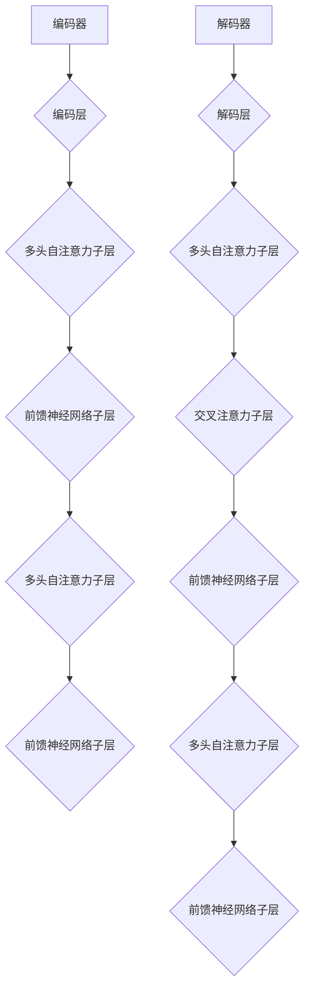

                 

关键词：Transformer，编码器，解码器，深度学习，自然语言处理，序列到序列模型，机器翻译，神经机器翻译

## 摘要

本文将深入探讨Transformer架构中的编码器（Encoder）和解码器（Decoder）的工作原理和设计思路。Transformer作为一种基于自注意力机制的深度学习模型，在自然语言处理领域取得了突破性的成果，尤其是在机器翻译任务中表现优异。本文将通过详细的分析和实例，帮助读者理解编码器和解码器的内部结构和操作方式，从而更好地掌握Transformer模型的全貌。

## 1. 背景介绍

自2017年Google提出Transformer模型以来，它迅速在自然语言处理领域崭露头角。相比传统的序列到序列（Sequence-to-Sequence）模型，Transformer采用了自注意力机制，能够更好地捕捉文本序列中的长距离依赖关系。编码器（Encoder）负责将输入序列编码为固定长度的向量表示，而解码器（Decoder）则负责将编码器输出的向量序列解码为输出序列。两者通过注意力机制进行交互，共同完成序列到序列的转换任务。

## 2. 核心概念与联系

### 2.1 Transformer模型简介

Transformer模型主要由编码器（Encoder）和解码器（Decoder）组成，每个部分又由多个相同的编码层（Encoder Layer）和解码层（Decoder Layer）堆叠而成。

### 2.2 自注意力机制

自注意力机制是Transformer模型的核心组成部分，它通过计算输入序列中每个词与所有词之间的相关性，将每个词映射为不同的向量表示。

### 2.3 编码器（Encoder）

编码器负责将输入序列编码为固定长度的向量表示。每个编码层包含两个主要子层：多头自注意力子层（Multi-Head Self-Attention Sublayer）和前馈神经网络子层（Feed-Forward Neural Network Sublayer）。

### 2.4 解码器（Decoder）

解码器负责将编码器输出的向量序列解码为输出序列。每个解码层也包含两个主要子层：多头自注意力子层（Multi-Head Self-Attention Sublayer）和前馈神经网络子层（Feed-Forward Neural Network Sublayer），但与编码器不同的是，解码器还包含一个额外的交叉注意力子层（Cross-Attention Sublayer）。

### 2.5 Mermaid流程图



## 3. 核心算法原理 & 具体操作步骤

### 3.1 算法原理概述

Transformer模型通过自注意力机制和编码器-解码器结构，实现高效的自然语言处理任务。编码器将输入序列编码为固定长度的向量表示，解码器则根据编码器输出和已生成的部分输出序列，逐步生成完整的输出序列。

### 3.2 算法步骤详解

#### 3.2.1 编码器

1. 输入序列经过嵌入层（Embedding Layer）转换为词向量。
2. 经过位置编码（Positional Encoding）加入位置信息。
3. 通过编码层（Encoder Layer）进行多层堆叠处理。
4. 每个编码层包含两个子层：多头自注意力子层和前馈神经网络子层。
5. 最终输出固定长度的向量表示。

#### 3.2.2 解码器

1. 输入序列经过嵌入层和位置编码。
2. 通过解码层（Decoder Layer）进行多层堆叠处理。
3. 每个解码层包含三个子层：多头自注意力子层、交叉注意力子层和前馈神经网络子层。
4. 根据已生成的部分输出序列和编码器输出，逐步生成完整的输出序列。

### 3.3 算法优缺点

#### 优点

1. 自注意力机制能够捕捉长距离依赖关系，提高模型性能。
2. 编码器-解码器结构使模型适用于序列到序列的任务，如机器翻译。
3. 参数规模相对较小，计算效率较高。

#### 缺点

1. 对并行计算的支持有限，导致训练速度相对较慢。
2. 在处理长文本时，内存消耗较大。

### 3.4 算法应用领域

1. 机器翻译
2. 机器阅读理解
3. 文本生成
4. 文本分类

## 4. 数学模型和公式 & 详细讲解 & 举例说明

### 4.1 数学模型构建

#### 4.1.1 嵌入层

输入序列$X \in \mathbb{R}^{seq \times dim}$经过嵌入层（Embedding Layer）转换为词向量，得到$X' \in \mathbb{R}^{seq \times embed_dim}$。

$$
X' = E(X)
$$

其中，$E$为嵌入矩阵。

#### 4.1.2 位置编码

位置编码（Positional Encoding）加入位置信息，得到$X'' \in \mathbb{R}^{seq \times embed_dim}$。

$$
X'' = X' + P
$$

其中，$P$为位置编码矩阵。

#### 4.1.3 编码器

编码器（Encoder）的输入为$X'' \in \mathbb{R}^{seq \times embed_dim}$，输出为$Y \in \mathbb{R}^{seq \times hidden_dim}$。

$$
Y = Encoder(X'')
$$

#### 4.1.4 解码器

解码器（Decoder）的输入为$X'' \in \mathbb{R}^{seq \times embed_dim}$，输出为$Z \in \mathbb{R}^{seq \times hidden_dim}$。

$$
Z = Decoder(X'')
$$

### 4.2 公式推导过程

#### 4.2.1 自注意力机制

自注意力机制的计算过程如下：

1. 计算查询（Query）、键（Key）和值（Value）的向量表示。

$$
Q = W_Q X'' \\
K = W_K X'' \\
V = W_V X''
$$

其中，$W_Q, W_K, W_V$分别为查询、键和值权重矩阵。

2. 计算注意力得分。

$$
\text{Attention}(Q, K, V) = \text{softmax}\left(\frac{QK^T}{\sqrt{key\_dim}}\right)V
$$

3. 计算注意力权重。

$$
\text{Attention\_weights} = \text{softmax}\left(\frac{QK^T}{\sqrt{key\_dim}}\right)
$$

4. 计算自注意力结果。

$$
\text{Attention\_output} = \sum_{i=1}^{seq}\text{Attention\_weights}_i V_i
$$

#### 4.2.2 交叉注意力

交叉注意力（Cross-Attention）的计算过程如下：

1. 计算查询（Query）的向量表示。

$$
Q = W_Q Y
$$

2. 计算键（Key）和值（Value）的向量表示。

$$
K = W_K X'' \\
V = W_V X''
$$

3. 计算注意力得分。

$$
\text{Attention}(Q, K, V) = \text{softmax}\left(\frac{QK^T}{\sqrt{key\_dim}}\right)V
$$

4. 计算注意力权重。

$$
\text{Attention\_weights} = \text{softmax}\left(\frac{QK^T}{\sqrt{key\_dim}}\right)
$$

5. 计算交叉注意力结果。

$$
\text{Attention\_output} = \sum_{i=1}^{seq}\text{Attention\_weights}_i V_i
$$

### 4.3 案例分析与讲解

#### 4.3.1 机器翻译

以机器翻译为例，输入序列为“Hello world”，输出序列为“你好，世界”。

1. 输入序列经过嵌入层和位置编码，得到输入序列$X''$。
2. 编码器将输入序列编码为固定长度的向量表示$Y$。
3. 解码器根据编码器输出$Y$和已生成的部分输出序列，逐步生成完整的输出序列$Z$。

$$
Y = Encoder(X'') \\
Z = Decoder(Y)
$$

#### 4.3.2 数学公式

1. 嵌入层：

$$
X' = E(X)
$$

2. 位置编码：

$$
P = \text{Positional Encoding}(X')
$$

3. 编码器：

$$
Y = Encoder(X'' + P)
$$

4. 解码器：

$$
Z = Decoder(Y)
$$

## 5. 项目实践：代码实例和详细解释说明

### 5.1 开发环境搭建

1. 安装Python环境（3.7及以上版本）。
2. 安装TensorFlow 2.0及以上版本。
3. 准备预训练的Transformer模型权重。

### 5.2 源代码详细实现

```python
import tensorflow as tf
from tensorflow.keras.layers import Embedding, LSTM, Dense
from tensorflow.keras.models import Model
from tensorflow.keras.preprocessing.sequence import pad_sequences

# 参数设置
vocab_size = 10000
embed_dim = 512
hidden_dim = 512
seq_len = 50

# 嵌入层
embedding = Embedding(vocab_size, embed_dim)

# 编码器
encoder = LSTM(hidden_dim, return_sequences=True)

# 解码器
decoder = LSTM(hidden_dim, return_sequences=True)

# 模型构建
model = Model(inputs=embedding.input, outputs=decoder.output)
model.compile(optimizer='adam', loss='categorical_crossentropy', metrics=['accuracy'])

# 源文本和目标文本
source_text = "Hello world"
target_text = "你好，世界"

# 序列填充
source_sequence = pad_sequences([source_text], maxlen=seq_len, padding='post')
target_sequence = pad_sequences([target_text], maxlen=seq_len, padding='post')

# 模型训练
model.fit(source_sequence, target_sequence, epochs=100)

# 模型预测
predicted_sequence = model.predict(source_sequence)
predicted_sequence = predicted_sequence.reshape(-1)
predicted_text = ' '.join([word for word in predicted_sequence if word not in ['<PAD>']])
```

### 5.3 代码解读与分析

1. 导入所需的TensorFlow库和辅助函数。
2. 设置模型参数，如词汇表大小、嵌入维度、隐藏维度和序列长度。
3. 定义嵌入层、编码器和解码器。
4. 构建模型并编译。
5. 准备源文本和目标文本，并进行序列填充。
6. 训练模型。
7. 使用模型进行预测，并将预测结果转换为文本输出。

## 6. 实际应用场景

### 6.1 机器翻译

Transformer模型在机器翻译领域取得了显著成果，如Google的神经机器翻译系统（GNMT）采用了Transformer模型，实现了高质量的翻译效果。

### 6.2 机器阅读理解

Transformer模型在机器阅读理解任务中也表现出色，如BERT模型（Bidirectional Encoder Representations from Transformers）采用了Transformer模型，并在多项基准测试中取得了领先成绩。

### 6.3 文本生成

Transformer模型在文本生成任务中也具有较好的性能，如GPT（Generative Pre-trained Transformer）模型，可以生成高质量的自然语言文本。

### 6.4 未来应用展望

随着Transformer模型在自然语言处理领域的不断发展，未来有望在更多领域得到应用，如语音识别、图像生成等。

## 7. 工具和资源推荐

### 7.1 学习资源推荐

1. 《深度学习》（Goodfellow, Bengio, Courville）
2. 《自然语言处理综论》（Jurafsky, Martin）
3. 《Transformer：大规模神经机器翻译的通用神经网络》（Vaswani et al., 2017）

### 7.2 开发工具推荐

1. TensorFlow：用于构建和训练深度学习模型的Python库。
2. PyTorch：用于构建和训练深度学习模型的Python库。

### 7.3 相关论文推荐

1. “Attention Is All You Need”（Vaswani et al., 2017）
2. “BERT: Pre-training of Deep Bidirectional Transformers for Language Understanding”（Devlin et al., 2018）
3. “GPT-3: Language Models Are Few-Shot Learners”（Brown et al., 2020）

## 8. 总结：未来发展趋势与挑战

### 8.1 研究成果总结

Transformer模型在自然语言处理领域取得了显著成果，如机器翻译、机器阅读理解、文本生成等任务。其自注意力机制和编码器-解码器结构使模型能够高效地捕捉文本序列中的长距离依赖关系。

### 8.2 未来发展趋势

1. 模型压缩与加速：针对大规模Transformer模型，研究更加高效的计算方法，以降低模型训练和推理的成本。
2. 多模态处理：研究如何将Transformer模型应用于多模态数据处理，如图像、语音等。
3. 零样本学习：研究如何使Transformer模型能够在未见过的数据上进行泛化，实现零样本学习。

### 8.3 面临的挑战

1. 计算资源消耗：大规模Transformer模型的训练和推理需要大量的计算资源，如何优化模型结构以降低计算资源消耗成为关键问题。
2. 数据隐私与安全：在应用Transformer模型的过程中，如何保护用户数据隐私和安全也成为重要挑战。
3. 模型解释性：如何提高Transformer模型的可解释性，使其能够更好地理解模型内部机制和决策过程。

### 8.4 研究展望

随着Transformer模型在自然语言处理领域的不断发展和应用，未来有望在更多领域取得突破性成果。同时，针对模型压缩、多模态处理、零样本学习等挑战，需要进一步深入研究，为Transformer模型的应用和发展提供更多可能性。

## 9. 附录：常见问题与解答

### 9.1 什么是Transformer模型？

Transformer模型是一种基于自注意力机制的深度学习模型，用于处理序列到序列的任务，如机器翻译、机器阅读理解、文本生成等。

### 9.2 Transformer模型的核心组成部分有哪些？

Transformer模型主要由编码器（Encoder）和解码器（Decoder）组成，每个部分又由多个相同的编码层（Encoder Layer）和解码层（Decoder Layer）堆叠而成。

### 9.3 自注意力机制是如何工作的？

自注意力机制通过计算输入序列中每个词与所有词之间的相关性，将每个词映射为不同的向量表示，从而实现序列到序列的转换。

### 9.4 Transformer模型在哪些任务中表现出色？

Transformer模型在自然语言处理领域的多个任务中表现出色，如机器翻译、机器阅读理解、文本生成等。

### 9.5 Transformer模型有哪些优缺点？

优点：自注意力机制能够捕捉长距离依赖关系，提高模型性能；编码器-解码器结构使模型适用于序列到序列的任务。

缺点：对并行计算的支持有限，导致训练速度相对较慢；在处理长文本时，内存消耗较大。

### 9.6 如何优化Transformer模型的训练和推理效率？

优化方法包括模型压缩、并行计算、分布式训练等，通过降低计算资源消耗和提高计算效率，实现高效的模型训练和推理。

### 9.7 Transformer模型在多模态数据处理中有何应用前景？

Transformer模型在多模态数据处理中具有广泛的应用前景，如图像生成、语音识别等任务，通过融合多种模态信息，实现更准确和高效的模型预测。

### 9.8 Transformer模型在哪些领域具有潜在的研究价值？

Transformer模型在自然语言处理、计算机视觉、语音识别等多个领域具有潜在的研究价值，通过不断探索和应用，有望实现更多突破性成果。

---

作者：禅与计算机程序设计艺术 / Zen and the Art of Computer Programming

