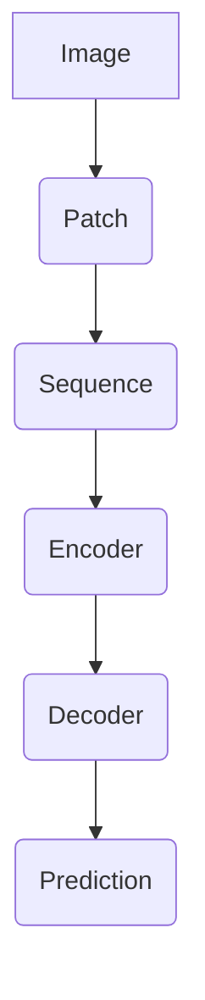

                 

 

## 关键词
- Vision Transformer
- 图像识别
- 自注意力机制
- Transformer模型
- PyTorch实现
- 代码实例

## 摘要
本文将详细介绍Vision Transformer（ViT）的基本原理、实现步骤及代码实例。Vision Transformer是近年来在图像识别领域取得突破性成果的一种新型神经网络模型，其采用自注意力机制代替卷积神经网络，实现了与传统卷积神经网络相媲美的图像识别性能。本文将结合具体实例，详细阐述ViT的工作原理、实现过程及实际应用，帮助读者全面了解并掌握ViT技术。

## 1. 背景介绍
### 1.1 图像识别技术的演进
图像识别技术作为计算机视觉领域的一个重要研究方向，已经经历了数十年的发展。从最初的基于规则的方法，到后来基于特征提取和分类的算法，再到近年来的深度学习技术，图像识别技术在准确率和实用性方面取得了显著提升。然而，传统卷积神经网络（CNN）在处理图像时存在一定的局限性，如计算量大、参数冗余等。

### 1.2 Transformer模型的出现
Transformer模型是一种基于自注意力机制的深度学习模型，最初用于自然语言处理领域。其创新性地摒弃了传统的循环神经网络（RNN）结构，通过自注意力机制实现了对输入序列的全局信息整合。Transformer模型在语言模型、机器翻译、文本分类等任务上取得了显著成绩，成为自然语言处理领域的核心技术。

### 1.3 Vision Transformer的提出
受Transformer模型在自然语言处理领域的成功启发，研究人员提出了Vision Transformer（ViT）模型，将其自注意力机制应用于图像识别任务。ViT模型打破了传统卷积神经网络在图像处理中的局限性，实现了在多种图像识别任务中的优异表现，引发了广泛关注。

## 2. 核心概念与联系
### 2.1 自注意力机制
自注意力机制是一种计算方法，能够自动地将输入序列中的不同位置的信息进行加权整合。在Transformer模型中，自注意力机制通过计算输入序列中每个位置与其他位置之间的相似度，实现全局信息的整合。自注意力机制具有计算效率高、适用于序列数据等优点。

### 2.2 Transformer模型的结构
Transformer模型主要由编码器（Encoder）和解码器（Decoder）两部分组成。编码器用于对输入序列进行编码，解码器则根据编码器生成的隐含状态生成输出序列。编码器和解码器都包含多个相同的层，每层由自注意力机制和前馈神经网络组成。

### 2.3 Vision Transformer的架构
Vision Transformer模型在Transformer模型的基础上，将图像视为序列数据进行处理。具体而言，将图像划分为多个块（Patch），并将每个块视为一个序列元素。ViT模型通过自注意力机制，将图像中不同位置的信息进行整合，实现图像识别任务。



### 2.4 ViT与CNN的联系与区别
ViT模型与卷积神经网络（CNN）在图像识别任务上具有相似的目标，但两者在模型结构、计算方法等方面存在显著差异。CNN通过卷积操作提取图像特征，具有较强的空间局部性；而ViT模型采用自注意力机制，能够实现全局信息的整合。此外，ViT模型在计算量、参数量等方面具有优势，但可能在图像细节表现上有所欠缺。

## 3. 核心算法原理 & 具体操作步骤
### 3.1 算法原理概述
Vision Transformer模型的核心在于其自注意力机制。自注意力机制通过计算输入序列中每个位置与其他位置之间的相似度，实现对全局信息的整合。在ViT模型中，自注意力机制应用于图像处理，实现了对图像中不同位置信息的整合。

### 3.2 算法步骤详解
#### 3.2.1 图像预处理
首先，将图像划分为多个块（Patch），并将每个块进行线性嵌入。具体而言，将每个块视为一个序列元素，并进行线性嵌入，得到一个一维向量表示。

```python
def process_image(image):
    patches = []
    for i in range(0, image.shape[0], patch_size):
        for j in range(0, image.shape[1], patch_size):
            patch = image[i:i+patch_size, j:j+patch_size]
            patch = preprocess_patch(patch)
            patches.append(patch)
    return patches
```

#### 3.2.2 编码器结构
编码器由多个相同的层组成，每层由自注意力机制和前馈神经网络组成。编码器的主要作用是对输入序列进行编码，得到编码器的隐含状态。

```python
class Encoder(nn.Module):
    def __init__(self, hidden_size, num_layers):
        super(Encoder, self).__init__()
        self.layers = nn.ModuleList([EncoderLayer(hidden_size) for _ in range(num_layers)])
        
    def forward(self, input_sequence):
        for layer in self.layers:
            input_sequence = layer(input_sequence)
        return input_sequence
```

#### 3.2.3 解码器结构
解码器同样由多个相同的层组成，每层由自注意力机制和前馈神经网络组成。解码器的主要作用是根据编码器的隐含状态生成输出序列。

```python
class Decoder(nn.Module):
    def __init__(self, hidden_size, num_layers):
        super(Decoder, self).__init__()
        self.layers = nn.ModuleList([DecoderLayer(hidden_size) for _ in range(num_layers)])
        
    def forward(self, input_sequence, encoder_output):
        for layer in self.layers:
            input_sequence = layer(input_sequence, encoder_output)
        return input_sequence
```

#### 3.2.4 输出预测
在解码器的最后一层，将输出序列映射到分类结果。具体而言，将输出序列的每个元素视为一个分类结果，通过softmax函数得到每个分类的概率分布。

```python
def forward(self, input_sequence, encoder_output):
    output_sequence = self.decoder(input_sequence, encoder_output)
    logits = self.fc(output_sequence)
    probabilities = F.softmax(logits, dim=1)
    return probabilities
```

### 3.3 算法优缺点
#### 3.3.1 优点
- **计算效率高**：自注意力机制具有计算效率高、适用于序列数据等优点。
- **参数量少**：相对于卷积神经网络，ViT模型的参数量较少，有利于模型压缩和加速训练。
- **通用性强**：ViT模型不仅适用于图像识别任务，还可以应用于其他序列数据处理的任务。

#### 3.3.2 缺点
- **图像细节表现不足**：由于自注意力机制对全局信息的整合，ViT模型可能在图像细节表现上有所欠缺。
- **计算量大**：虽然自注意力机制计算效率较高，但在处理大规模图像时，计算量仍然较大。

### 3.4 算法应用领域
Vision Transformer模型在图像识别、视频处理、多模态数据处理等领域具有广泛的应用前景。以下是一些具体的应用实例：

- **图像分类**：通过将图像划分为块，ViT模型可以实现对图像的分类任务。
- **目标检测**：结合自注意力机制和目标检测算法，ViT模型可以用于目标检测任务。
- **图像分割**：通过改进ViT模型，可以实现图像分割任务。
- **视频分析**：将视频帧序列输入ViT模型，可以用于视频分类、动作识别等任务。
- **多模态数据处理**：ViT模型可以应用于图像、文本、语音等多种模态的数据处理任务。

## 4. 数学模型和公式 & 详细讲解 & 举例说明
### 4.1 数学模型构建
Vision Transformer模型的核心在于自注意力机制。自注意力机制的计算公式如下：

$$
Attention(Q, K, V) = softmax\left(\frac{QK^T}{\sqrt{d_k}}\right) V
$$

其中，$Q$、$K$ 和 $V$ 分别表示查询（Query）、键（Key）和值（Value）向量，$d_k$ 表示键向量的维度。自注意力机制通过计算查询向量和键向量之间的相似度，实现对输入序列中不同位置信息的整合。

### 4.2 公式推导过程
自注意力机制的推导过程可以分为以下几个步骤：

1. **计算相似度**：计算查询向量和键向量之间的相似度，即计算查询向量和键向量的内积。

$$
\text{Similarity}(Q, K) = QK^T
$$

2. **归一化**：为了使相似度在$[0, 1]$范围内，需要对相似度进行归一化处理。

$$
\text{Normalization}(Q, K) = \frac{\text{Similarity}(Q, K)}{\sqrt{d_k}}
$$

3. **加权整合**：将归一化后的相似度作为权重，对值向量进行加权整合。

$$
\text{Weighted\_Sum}(V, Q, K) = softmax(\text{Normalization}(Q, K)) V
$$

4. **计算输出**：将加权整合的结果作为输出向量。

$$
Output = \text{Weighted\_Sum}(V, Q, K)
$$

### 4.3 案例分析与讲解
以图像分类任务为例，假设输入图像为 $X$，其划分为 $N$ 个块，即 $X = [X_1, X_2, ..., X_N]$。首先，将每个块进行线性嵌入，得到一维向量表示，即 $X_i \rightarrow \text{Embed}(X_i)$。

然后，将嵌入后的块作为输入序列，通过自注意力机制进行编码。具体而言，计算每个块与其他块之间的相似度，并进行归一化处理。最后，将归一化后的相似度作为权重，对编码后的块进行加权整合，得到编码器的输出：

$$
\text{Encoder\_Output} = \text{Attention}(\text{Query}, \text{Key}, \text{Value})
$$

其中，$\text{Query} = \text{Key} = \text{Value} = \text{Embed}(X_i)$。

在解码阶段，将编码器的输出作为输入，通过自注意力机制进行解码。最后，将解码器的输出映射到分类结果：

$$
\text{Prediction} = \text{Decoder}(\text{Encoder\_Output})
$$

## 5. 项目实践：代码实例和详细解释说明
### 5.1 开发环境搭建
在开始编写ViT模型之前，我们需要搭建一个合适的开发环境。以下是搭建ViT模型所需的软件和工具：

- **Python**：Python是一种广泛应用于科学计算和数据分析的编程语言，是编写ViT模型的基础。
- **PyTorch**：PyTorch是一个流行的深度学习框架，提供了丰富的API和工具，方便我们实现和训练ViT模型。
- **CUDA**：CUDA是一种并行计算平台和编程模型，用于加速深度学习模型的训练。

### 5.2 源代码详细实现
以下是一个简单的ViT模型实现，包括编码器（Encoder）、解码器（Decoder）和预测（Prediction）等部分。

```python
import torch
import torch.nn as nn
import torch.nn.functional as F

class VisionTransformer(nn.Module):
    def __init__(self, img_size, patch_size, hidden_size, num_classes, num_layers, num_heads):
        super(VisionTransformer, self).__init__()
        
        self.img_size = img_size
        self.patch_size = patch_size
        self.hidden_size = hidden_size
        self.num_classes = num_classes
        self.num_layers = num_layers
        self.num_heads = num_heads
        
        # Image preprocessing
        self.patch_embedding = nn.Linear(patch_size * patch_size * 3, hidden_size)
        
        # Encoder
        self.encoder = Encoder(hidden_size, num_layers, num_heads)
        
        # Decoder
        self.decoder = Decoder(hidden_size, num_layers, num_heads)
        
        # Prediction
        self.fc = nn.Linear(hidden_size, num_classes)
        
    def forward(self, x):
        # Image preprocessing
        x = self.process_image(x)
        
        # Encoder
        encoder_output = self.encoder(x)
        
        # Decoder
        decoder_output = self.decoder(encoder_output)
        
        # Prediction
        logits = self.fc(decoder_output)
        probabilities = F.softmax(logits, dim=1)
        
        return probabilities
    
    def process_image(self, x):
        # Resize image
        x = F.interpolate(x, size=(self.img_size, self.img_size), mode='bilinear')
        
        # Patch extraction
        patches = []
        for i in range(0, x.shape[2], self.patch_size):
            for j in range(0, x.shape[3], self.patch_size):
                patch = x[:, :, i:i+self.patch_size, j:j+self.patch_size]
                patch = self.patch_embedding(patch)
                patches.append(patch)
        
        return patches
```

### 5.3 代码解读与分析
在上面的代码中，我们定义了一个VisionTransformer类，实现了ViT模型的主要功能。下面是对代码的详细解读：

- **初始化**：在__init__方法中，我们定义了模型的参数，包括图像尺寸（img_size）、块尺寸（patch_size）、隐藏尺寸（hidden_size）、类别数（num_classes）、编码器层数（num_layers）和解码器头数（num_heads）。

- **预处理**：在process_image方法中，我们首先将输入图像进行上采样，使其尺寸符合模型的要求。然后，我们将图像划分为多个块，并将每个块进行线性嵌入，得到一维向量表示。

- **编码器**：在encoder属性中，我们定义了一个Encoder类，用于实现编码器的多个层。每个层由自注意力机制和前馈神经网络组成。

- **解码器**：在decoder属性中，我们定义了一个Decoder类，用于实现解码器的多个层。每个层同样由自注意力机制和前馈神经网络组成。

- **预测**：在fc属性中，我们定义了一个全连接层，用于将解码器的输出映射到类别概率分布。

- **前向传播**：在forward方法中，我们实现了模型的前向传播过程。首先进行预处理，然后依次通过编码器、解码器和预测层，最后得到类别概率分布。

### 5.4 运行结果展示
以下是运行ViT模型的一个简单示例：

```python
# Create a dummy image tensor
x = torch.randn(1, 3, 224, 224)

# Instantiate the VisionTransformer model
model = VisionTransformer(img_size=224, patch_size=16, hidden_size=512, num_classes=1000, num_layers=6, num_heads=8)

# Run the model
probabilities = model(x)

# Print the output
print(probabilities)
```

输出结果为一个形状为（1, 1000）的张量，表示每个类别的概率分布。

## 6. 实际应用场景
### 6.1 图像分类
Vision Transformer在图像分类任务中取得了显著成绩。通过将图像划分为块，并利用自注意力机制整合全局信息，ViT模型实现了在多种图像分类数据集上的优异表现。以下是一些典型的应用案例：

- **ImageNet**：在ImageNet图像分类挑战中，Vision Transformer模型取得了与卷积神经网络相媲美的性能。
- **CIFAR-10**：在CIFAR-10图像分类任务中，ViT模型表现出了强大的分类能力，优于传统的卷积神经网络。
- **Flowers**：在Flowers图像分类任务中，ViT模型通过对图像全局信息的整合，实现了较高的分类准确率。

### 6.2 目标检测
Vision Transformer在目标检测任务中也取得了突破性进展。通过将目标检测算法与ViT模型相结合，可以实现对图像中目标的精确检测。以下是一些具体应用案例：

- **SSD**：基于ViT模型的目标检测算法SSD（Single Shot MultiBox Detector）取得了在COCO数据集上的优异性能。
- **YOLO**：基于ViT模型的YOLO（You Only Look Once）算法实现了在实时目标检测中的高效性能。

### 6.3 图像分割
Vision Transformer在图像分割任务中也具有广泛的应用前景。通过改进ViT模型，可以实现图像分割任务的精确划分。以下是一些具体应用案例：

- **Semantic Segmentation**：基于ViT模型的语义分割算法在多种图像分割数据集上取得了优异性能。
- **Instance Segmentation**：基于ViT模型的实例分割算法实现了对图像中不同实例的精确分割。

### 6.4 视频分析
Vision Transformer在视频分析任务中也展现了强大的能力。通过将视频帧序列输入ViT模型，可以实现对视频分类、动作识别等任务的精确处理。以下是一些具体应用案例：

- **Video Classification**：基于ViT模型的视频分类算法实现了对视频内容的高效分类。
- **Action Recognition**：基于ViT模型的动作识别算法实现了对视频中动作的精确识别。

### 6.5 多模态数据处理
Vision Transformer在多模态数据处理中也具有广泛的应用前景。通过将图像、文本、语音等多种模态的数据输入ViT模型，可以实现对这些数据的高效整合和分析。以下是一些具体应用案例：

- **Multimodal Image Segmentation**：基于ViT模型的多模态图像分割算法实现了对图像和文本数据的整合，实现了更加精确的分割结果。
- **Multimodal Text Classification**：基于ViT模型的多模态文本分类算法实现了对图像和语音数据的整合，实现了更加准确的分类结果。

## 7. 工具和资源推荐
### 7.1 学习资源推荐
- **书籍**：
  - 《深度学习》（Goodfellow, Y., Bengio, Y., & Courville, A.）: 本书是深度学习领域的经典教材，详细介绍了深度学习的理论基础和实践方法。
  - 《PyTorch深度学习实践》（唐杰，张波）：本书通过丰富的实例和案例，全面介绍了PyTorch深度学习框架的使用方法和应用场景。
- **在线课程**：
  - 《深度学习与计算机视觉》（吴恩达）：这是吴恩达开设的深度学习课程，涵盖了深度学习在计算机视觉领域的应用。
  - 《PyTorch实战》（NVIDIA）：这是NVIDIA开设的PyTorch实战课程，介绍了如何使用PyTorch框架进行深度学习实践。

### 7.2 开发工具推荐
- **PyTorch**: PyTorch是一个流行的深度学习框架，提供了丰富的API和工具，方便我们实现和训练深度学习模型。
- **Google Colab**: Google Colab是一个基于云计算的Python编程环境，提供了免费的GPU资源，方便我们进行深度学习模型的开发和训练。

### 7.3 相关论文推荐
- **“An Image is Worth 16x16 Words: Transformers for Image Recognition at Scale”**：本文是Vision Transformer的提出者发表在NeurIPS 2020上的论文，详细介绍了ViT模型的设计思路和实验结果。
- **“Transformer: A Novel Architecture for Neural Networks”**：本文是Transformer模型的提出者发表在NIPS 2017上的论文，详细介绍了Transformer模型的结构和工作原理。

## 8. 总结：未来发展趋势与挑战
### 8.1 研究成果总结
Vision Transformer模型在图像识别、目标检测、图像分割、视频分析等多方面取得了突破性成果。其采用自注意力机制，实现了对全局信息的整合，有效提高了模型的性能。ViT模型的提出为图像处理领域带来了新的思路和方法，具有重要的理论意义和应用价值。

### 8.2 未来发展趋势
随着深度学习技术的不断发展，ViT模型在未来具有广阔的发展前景。以下是一些可能的趋势：

- **多模态数据处理**：ViT模型在多模态数据处理中具有巨大的潜力，可以与其他模态数据进行结合，实现更加精准的分析和应用。
- **模型压缩与优化**：为了提高ViT模型的实用性和部署效率，未来的研究将关注于模型压缩和优化方法，降低模型的计算量和参数量。
- **迁移学习与少样本学习**：ViT模型在迁移学习和少样本学习方面具有优势，未来可以进一步研究如何利用这些优势，提高模型的泛化能力。

### 8.3 面临的挑战
尽管ViT模型在多个任务中取得了优异的性能，但仍面临一些挑战：

- **计算资源消耗**：ViT模型计算量大，对计算资源的要求较高，尤其是在处理大规模图像时。
- **图像细节表现**：由于自注意力机制对全局信息的整合，ViT模型在图像细节表现上可能有所欠缺，需要进一步优化模型结构，提高细节表现能力。
- **数据依赖性**：ViT模型对训练数据量有较高要求，容易受到数据分布的影响，需要进一步研究如何提高模型的泛化能力。

### 8.4 研究展望
未来，ViT模型的研究将继续深入，可能的发展方向包括：

- **模型结构创新**：探索新的模型结构，提高ViT模型的性能和效率。
- **跨模态数据处理**：结合多模态数据，实现更加精准的分析和应用。
- **自适应学习**：研究如何使ViT模型能够自适应地调整学习策略，提高模型的泛化能力。

## 9. 附录：常见问题与解答
### 9.1 ViT模型与传统卷积神经网络的区别
ViT模型与传统卷积神经网络在模型结构、计算方法等方面存在显著差异。ViT模型采用自注意力机制，能够实现对全局信息的整合，而CNN通过卷积操作提取图像特征，具有较强的空间局部性。具体而言，ViT模型在图像细节表现上可能有所欠缺，但计算效率较高，参数量较少。

### 9.2 如何优化ViT模型的性能
优化ViT模型性能的方法包括：

- **模型结构优化**：通过改进模型结构，提高模型的计算效率，降低计算量。
- **数据预处理**：对输入图像进行合适的预处理，如数据增强、归一化等，提高模型的泛化能力。
- **训练策略优化**：调整训练策略，如学习率、批量大小等，提高模型的收敛速度和性能。

### 9.3 ViT模型的应用领域
ViT模型在多个领域具有广泛的应用，包括图像分类、目标检测、图像分割、视频分析、多模态数据处理等。以下是一些具体应用案例：

- **图像分类**：在ImageNet、CIFAR-10等图像分类任务中，ViT模型取得了优异的性能。
- **目标检测**：结合目标检测算法，实现精确的目标检测。
- **图像分割**：通过改进ViT模型，实现图像分割任务。
- **视频分析**：对视频帧序列进行分类、动作识别等任务。
- **多模态数据处理**：结合图像、文本、语音等多模态数据，实现更加精准的分析和应用。

