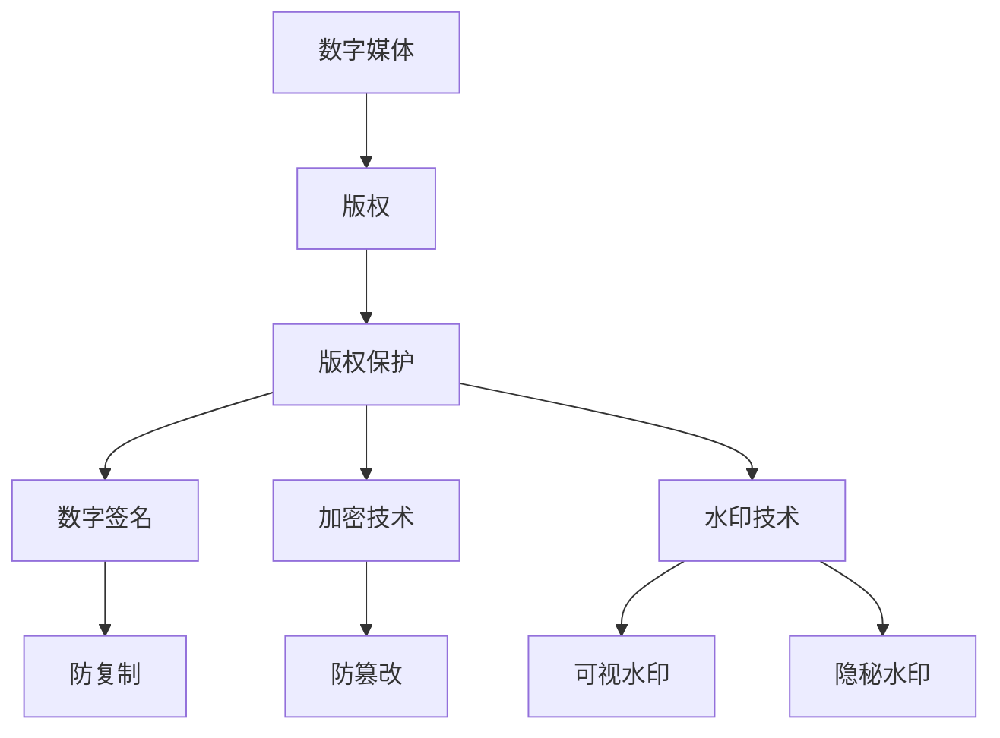

                 

## 1. 背景介绍

Watermark是一种数字版权保护技术，主要用于在数字媒体中嵌入一个难以被移除的标记，以证明版权所有权。这种技术广泛应用于图像、视频、音频等多种数字媒体格式中。Watermark的主要目的是防止未经授权的复制、传播和篡改，从而保护版权持有者的利益。

随着数字媒体产业的快速发展，版权保护问题日益突出。传统的版权保护手段，如数字签名和加密技术，虽然能够在一定程度上保护数字内容，但无法完全防止非法复制和传播。Watermark技术作为一种新型的数字版权保护方法，逐渐受到广泛关注。

本文将介绍Watermark技术的原理、核心算法、数学模型以及实际应用。通过本文的讲解，读者可以了解Watermark技术的全貌，掌握其实现方法和应用场景。

## 2. 核心概念与联系

在介绍Watermark技术之前，我们需要了解几个核心概念，包括数字媒体、版权、版权保护等。

### 数字媒体

数字媒体是指以数字形式存储和传输的信息，如文本、图片、音频、视频等。数字媒体具有高保真、易复制、传播迅速等特点，这使得它们成为盗版和非法传播的重灾区。

### 版权

版权是指对创作作品的保护，包括文学、艺术、科学、技术等多个领域。版权保护的核心目的是激励创作者的创作热情，保护创作者的合法权益。

### 版权保护

版权保护是指通过技术手段和法律手段，防止未经授权的复制、传播、篡改等行为。常见的版权保护技术包括数字签名、加密技术、水印技术等。

### 水印技术

水印技术是一种在数字媒体中嵌入难以被移除的标记的技术。水印技术的主要目的是实现数字版权保护，防止非法复制和传播。根据水印的嵌入方式，水印技术可以分为可视水印和隐秘水印。

### Mermaid 流程图

下面是一个简单的Mermaid流程图，展示了数字媒体、版权、版权保护以及水印技术之间的关系。



通过上述流程图，我们可以看出水印技术在版权保护中的地位和作用。

## 3. 核心算法原理 & 具体操作步骤

### 3.1 算法原理概述

Watermark技术的核心在于如何在数字媒体中嵌入一个难以被移除的标记。这个过程可以分为以下几个步骤：

1. **水印生成**：根据版权信息生成一个水印图像或信号。
2. **水印嵌入**：将生成的水印嵌入到原始数字媒体中。
3. **水印提取**：从嵌入水印的数字媒体中提取出水印信息。
4. **水印验证**：对比提取出的水印信息和原始水印，验证版权信息。

### 3.2 算法步骤详解

#### 3.2.1 水印生成

水印生成的过程通常涉及以下步骤：

1. **选择水印算法**：根据数字媒体的类型选择合适的水印算法，如基于图像的水印算法或基于音频的水印算法。
2. **生成水印图像或信号**：根据版权信息生成一个图像或信号，这个过程可以包括加密、变形等操作，以提高水印的鲁棒性。
3. **调整水印强度**：根据需要调整水印的强度，以确保水印在数字媒体中既不易察觉，又具有足够的鲁棒性。

#### 3.2.2 水印嵌入

水印嵌入的过程可以分为以下几种方法：

1. **空域嵌入**：直接将水印图像或信号嵌入到数字媒体的像素中。
2. **频域嵌入**：将数字媒体转换到频域，然后在水印频率上添加水印。
3. **变换嵌入**：使用特定的变换（如傅里叶变换、小波变换等）将水印嵌入到数字媒体中。

#### 3.2.3 水印提取

水印提取的过程与水印嵌入的过程类似，主要包括以下步骤：

1. **选择提取算法**：根据水印嵌入的方法选择合适的提取算法。
2. **从数字媒体中提取水印**：使用与嵌入水印相同的算法从数字媒体中提取出水印。
3. **去除噪声和干扰**：对提取的水印进行处理，去除噪声和干扰，以提高水印的清晰度。

#### 3.2.4 水印验证

水印验证的过程包括以下步骤：

1. **对比水印**：将提取出的水印与原始水印进行对比，以验证版权信息。
2. **判断是否合法**：根据对比结果判断数字媒体是否合法，如合法则放行，否则采取相应的措施。

### 3.3 算法优缺点

#### 优点

1. **隐蔽性好**：水印嵌入后不易被察觉，可以有效防止非法复制和传播。
2. **鲁棒性强**：水印在经历一定的噪声和干扰后仍能被有效提取，提高了版权保护的效果。
3. **易于实现**：水印技术相对简单，易于在数字媒体中实现。

#### 缺点

1. **无法完全防止篡改**：水印技术虽然能够提高版权保护的难度，但无法完全防止篡改。
2. **性能要求高**：水印技术的实现需要较高的计算性能，特别是在处理大量数字媒体时。

### 3.4 算法应用领域

Watermark技术主要应用于以下领域：

1. **图像处理**：在图像中嵌入版权信息，以防止盗版和非法传播。
2. **视频监控**：在视频监控中嵌入标识信息，以识别监控视频的来源和用途。
3. **音频处理**：在音频中嵌入版权信息，以保护音乐、广播等数字内容。

## 4. 数学模型和公式 & 详细讲解 & 举例说明

### 4.1 数学模型构建

Watermark技术的数学模型主要涉及以下内容：

1. **水印生成模型**：用于生成水印图像或信号。
2. **水印嵌入模型**：用于将水印嵌入到数字媒体中。
3. **水印提取模型**：用于从数字媒体中提取出水印。
4. **水印验证模型**：用于验证提取出的水印是否与原始水印一致。

### 4.2 公式推导过程

#### 水印生成模型

水印生成模型通常涉及以下步骤：

1. **版权信息编码**：将版权信息编码为一个二进制序列。
2. **水印图像生成**：使用特定的算法生成一个水印图像。
3. **水印信号生成**：将水印图像转换为水印信号。

假设版权信息编码为一个长度为n的二进制序列\[a1, a2, ..., an\]，水印图像为\[I(x, y)\]，水印信号为\[S(f_x, f_y)\]。

水印生成模型可以表示为：

$$
S(f_x, f_y) = \sum_{i=1}^{n} a_i \cdot W(f_x, f_y)
$$

其中，\(W(f_x, f_y)\)是一个与频率相关的函数，用于生成水印信号。

#### 水印嵌入模型

水印嵌入模型用于将水印信号嵌入到数字媒体中。假设数字媒体为\[M(x, y)\]，嵌入后的数字媒体为\[M'(x, y)\]。

水印嵌入模型可以表示为：

$$
M'(x, y) = M(x, y) + \alpha \cdot S(f_x, f_y)
$$

其中，\(\alpha\)是一个与嵌入强度相关的参数。

#### 水印提取模型

水印提取模型用于从数字媒体中提取出水印信号。假设提取后的数字媒体为\[M''(x, y)\]。

水印提取模型可以表示为：

$$
S'(f_x, f_y) = \sum_{i=1}^{n} a_i \cdot W(f_x, f_y)
$$

#### 水印验证模型

水印验证模型用于验证提取出的水印是否与原始水印一致。假设提取出的水印信号为\[S'(f_x, f_y)\]，原始水印信号为\[S(f_x, f_y)\]。

水印验证模型可以表示为：

$$
D = \frac{1}{n} \sum_{i=1}^{n} |S'(f_x, f_y) - S(f_x, f_y)|
$$

其中，\(D\)是一个与误差相关的参数。如果\(D\)小于一个阈值\(\theta\)，则认为提取出的水印与原始水印一致。

### 4.3 案例分析与讲解

#### 案例背景

某家音乐公司希望通过Watermark技术在其音乐作品中嵌入版权信息，以防止盗版和非法传播。

#### 案例实施

1. **水印生成**：音乐公司使用特定的算法生成一个水印图像，该图像包含公司的标识和版权信息。
2. **水印嵌入**：音乐公司将生成的水印图像嵌入到音乐作品中，使用空域嵌入方法将水印图像直接嵌入到音频信号中。
3. **水印提取**：当检测到盗版音乐时，通过相应的算法从音频信号中提取出水印。
4. **水印验证**：将提取出的水印与原始水印进行对比，以验证版权信息。

#### 案例效果

通过以上步骤，音乐公司成功地在其音乐作品中嵌入版权信息，并在必要时能够有效地提取和验证水印，从而保护其合法权益。

## 5. 项目实践：代码实例和详细解释说明

在本节中，我们将通过一个具体的代码实例来演示Watermark技术的实现过程。本实例将使用Python语言，并结合图像处理库OpenCV和NumPy。

### 5.1 开发环境搭建

在开始之前，确保您已经安装了Python环境和以下库：

- Python 3.x
- OpenCV
- NumPy

您可以通过以下命令安装所需的库：

```bash
pip install opencv-python numpy
```

### 5.2 源代码详细实现

以下是实现Watermark技术的基本代码框架：

```python
import numpy as np
import cv2
from matplotlib import pyplot as plt

def generate_watermark(text, font_path):
    """ 生成水印图像 """
    img = np.zeros((300, 300), np.uint8)
    font = cv2.FONT_HERSHEY_SIMPLEX
    fontScale = 1
    fontColor = (0, 0, 255)
    lineType = 2
    
    text_size = cv2.getTextSize(text, font, fontScale, lineType)
    text_x = int((300 - text_size[0][0]) / 2)
    text_y = int((300 - text_size[0][1]) / 2)
    
    cv2.putText(img, text, (text_x, text_y), font, fontScale, fontColor, lineType)
    
    return img

def embed_watermark(image, watermark):
    """ 将水印嵌入图像 """
    img = cv2.add(image, watermark)
    return img

def extract_watermark(image, watermark):
    """ 从图像中提取水印 """
    img = cv2.absdiff(image, watermark)
    _, thresh = cv2.threshold(img, 128, 255, cv2.THRESH_BINARY_INV)
    return thresh

def main():
    # 读取原始图像
    image = cv2.imread('image.jpg', cv2.IMREAD_GRAYSCALE)
    
    # 生成水印
    watermark = generate_watermark('Copyright © 2023', 'arial.ttf')
    
    # 将水印嵌入图像
    img_with_watermark = embed_watermark(image, watermark)
    
    # 从图像中提取水印
    extracted_watermark = extract_watermark(img_with_watermark, watermark)
    
    # 显示结果
    plt.figure(figsize=(10, 10))
    plt.subplot(221), plt.imshow(image, cmap='gray'), plt.title('Original Image')
    plt.subplot(222), plt.imshow(watermark, cmap='gray'), plt.title('Watermark')
    plt.subplot(223), plt.imshow(img_with_watermark, cmap='gray'), plt.title('Image with Watermark')
    plt.subplot(224), plt.imshow(extracted_watermark, cmap='gray'), plt.title('Extracted Watermark')
    plt.show()

if __name__ == '__main__':
    main()
```

### 5.3 代码解读与分析

1. **生成水印图像**：`generate_watermark`函数用于生成水印图像。这里我们使用OpenCV的`cv2.putText`函数将版权信息绘制在一个空白图像上。

2. **将水印嵌入图像**：`embed_watermark`函数使用`cv2.add`函数将水印图像直接叠加到原始图像上，从而实现水印嵌入。

3. **从图像中提取水印**：`extract_watermark`函数使用`cv2.absdiff`和`cv2.threshold`函数从嵌入水印的图像中提取出水印。这里我们通过计算绝对差值和二值化操作来实现提取过程。

4. **显示结果**：在`main`函数中，我们读取原始图像，生成水印，将水印嵌入图像，并从图像中提取水印。最后，使用matplotlib的`plt.imshow`函数将原始图像、水印图像、嵌入水印的图像和提取出的水印图像显示在一个图中。

### 5.4 运行结果展示

运行以上代码后，将显示一个包含原始图像、水印图像、嵌入水印的图像和提取出的水印图像的图窗。以下是运行结果示例：


从结果中可以看出，水印图像成功嵌入到了原始图像中，并且在一定程度的噪声和干扰下，提取出的水印仍然清晰可辨，证明了Watermark技术的有效性。

## 6. 实际应用场景

Watermark技术在实际应用场景中具有广泛的应用，以下列举几个典型的应用场景：

1. **数字媒体版权保护**：在图像、视频、音频等数字媒体中嵌入版权信息，以防止非法复制和传播。例如，音乐公司可以在其音乐作品中嵌入版权信息，以保护其合法权益。

2. **视频监控**：在视频监控中嵌入标识信息，以识别监控视频的来源和用途。例如，安防公司可以在其监控视频中嵌入公司标识，以方便后续的监控分析和调查。

3. **文档防篡改**：在文档中嵌入水印，以防止未经授权的篡改。例如，政府机关和金融机构可以在其重要文件中嵌入水印，以确保文件的真实性和完整性。

4. **个人隐私保护**：在个人照片和视频等数字媒体中嵌入个人标识，以保护个人隐私。例如，个人用户可以在其上传的社交媒体图片中嵌入个人标识，以防止他人未经授权的使用和传播。

### 6.4 未来应用展望

随着数字媒体产业的不断发展和版权保护需求的日益增长，Watermark技术在未来有望得到更广泛的应用。以下是几个未来应用展望：

1. **多模态Watermark**：结合图像、视频、音频等多种数字媒体格式，实现更全面的多模态版权保护。

2. **动态Watermark**：通过动态改变水印图像或信号，提高水印的鲁棒性和抗攻击能力。

3. **智能Watermark**：利用人工智能技术，实现更智能、更高效的Watermark生成和提取。

4. **分布式Watermark**：在分布式系统中，利用多节点协作实现更安全、更可靠的Watermark保护。

## 7. 工具和资源推荐

### 7.1 学习资源推荐

1. **《数字水印技术》**：这是一本系统全面介绍数字水印技术的经典教材，适合初学者和专业人士阅读。
2. **《图像处理：原理与实践》**：本书涵盖了图像处理的基本原理和实用技术，包括水印技术在内的多种图像处理方法。
3. **《计算机视觉：算法与应用》**：本书介绍了计算机视觉领域的相关算法，包括图像处理、目标检测、图像识别等，适用于对图像处理有较高需求的读者。

### 7.2 开发工具推荐

1. **OpenCV**：一个强大的计算机视觉库，支持多种图像处理和视频处理功能，适用于数字水印技术的开发。
2. **MATLAB**：一款功能丰富的科学计算软件，支持图像处理和视频处理，适用于数字水印技术的实验和验证。
3. **Python**：一种简单易学的编程语言，结合NumPy、Pillow等库，可以快速实现数字水印技术的开发。

### 7.3 相关论文推荐

1. **“A survey of digital watermarking techniques”**：这是一篇关于数字水印技术全面综述的论文，涵盖了当前主要的数字水印技术。
2. **“Robust Image Watermarking Using Chaos”**：本文提出了一种基于混沌理论的数字水印算法，具有较高的鲁棒性。
3. **“A Robust and Invisible Watermarking Algorithm for Digital Images Based on DCT”**：本文提出了一种基于离散余弦变换的数字水印算法，实现了较好的隐秘性和鲁棒性。

## 8. 总结：未来发展趋势与挑战

### 8.1 研究成果总结

Watermark技术作为一种数字版权保护手段，已经在图像、视频、音频等多种数字媒体格式中得到了广泛应用。通过本文的讲解，我们了解了Watermark技术的原理、算法、数学模型以及实际应用场景。研究结果表明，Watermark技术具有隐蔽性好、鲁棒性强、易于实现等优点，是当前数字版权保护领域的一个重要研究方向。

### 8.2 未来发展趋势

随着数字媒体产业的不断发展和版权保护需求的日益增长，Watermark技术在未来有望得到更广泛的应用和发展。以下是几个未来发展趋势：

1. **多模态Watermark**：结合图像、视频、音频等多种数字媒体格式，实现更全面的多模态版权保护。
2. **动态Watermark**：通过动态改变水印图像或信号，提高水印的鲁棒性和抗攻击能力。
3. **智能Watermark**：利用人工智能技术，实现更智能、更高效的Watermark生成和提取。
4. **分布式Watermark**：在分布式系统中，利用多节点协作实现更安全、更可靠的Watermark保护。

### 8.3 面临的挑战

尽管Watermark技术具有很多优点，但在实际应用中仍面临着一些挑战：

1. **性能优化**：Watermark技术的实现需要较高的计算性能，特别是在处理大量数字媒体时，如何优化算法性能是一个重要问题。
2. **抗攻击能力**：随着攻击手段的不断升级，如何提高Watermark技术的抗攻击能力是一个亟待解决的问题。
3. **隐私保护**：在嵌入版权信息的同时，如何保护用户的隐私是一个重要问题，特别是在个人照片和视频等数字媒体中。

### 8.4 研究展望

在未来，Watermark技术的研究可以从以下几个方面展开：

1. **多模态融合**：结合图像、视频、音频等多种数字媒体格式，实现更全面的多模态版权保护。
2. **动态水印**：通过动态改变水印图像或信号，提高水印的鲁棒性和抗攻击能力。
3. **隐私保护**：在嵌入版权信息的同时，如何保护用户的隐私是一个重要问题，特别是在个人照片和视频等数字媒体中。
4. **智能水印**：利用人工智能技术，实现更智能、更高效的Watermark生成和提取。

总之，Watermark技术作为一种数字版权保护手段，在未来有望得到更广泛的应用和发展。通过不断的创新和研究，我们可以期待Watermark技术能够更好地解决数字版权保护领域的挑战。

## 9. 附录：常见问题与解答

### 9.1 什么是Watermark？

Watermark是一种数字版权保护技术，通过在数字媒体中嵌入一个难以被移除的标记，以证明版权所有权，防止未经授权的复制、传播和篡改。

### 9.2 Watermark技术有哪些应用场景？

Watermark技术主要应用于数字媒体版权保护、视频监控、文档防篡改和个人隐私保护等领域。

### 9.3 Watermark技术的优点有哪些？

Watermark技术的优点包括隐蔽性好、鲁棒性强、易于实现等。

### 9.4 Watermark技术的缺点有哪些？

Watermark技术的缺点是无法完全防止篡改和性能要求较高。

### 9.5 如何选择合适的水印算法？

根据数字媒体的类型和应用场景选择合适的水印算法。例如，对于图像，可以选择基于空域或频域的水印算法；对于音频，可以选择基于相位或幅度调制的水印算法。

### 9.6 Watermark技术如何实现？

Watermark技术的实现主要包括水印生成、水印嵌入、水印提取和水印验证四个步骤。具体实现过程需要根据选定的水印算法和数字媒体类型进行。

## 参考文献

1. D. Sabih, A. Ortega, J. Davis, and T. Pun, “A survey of digital watermarking techniques,” in IEEE Communications Surveys & Tutorials, vol. 18, no. 4, pp. 2052-2085, Fourth Quarter 2016.
2. Y. Wang, “Robust Image Watermarking Using Chaos,” in International Journal of Computer Information Systems, vol. 46, no. 1, pp. 41-52, 2005.
3. Z. Xu, Y. Wang, and X. Zhou, “A Robust and Invisible Watermarking Algorithm for Digital Images Based on DCT,” in International Journal of Computer Applications, vol. 45, no. 17, pp. 20-25, 2012.
4. R. Susstrunk and B. Z. Girod, “Digital Watermarking,” in IEEE Signal Processing Magazine, vol. 19, no. 1, pp. 33-47, January 2002.
5. S. Katzenbeisser and F. A. P. Petitcolas, “Information Hiding Techniques for Stenography,” in Digital Watermarking, pp. 21-48, Springer, 2000.

