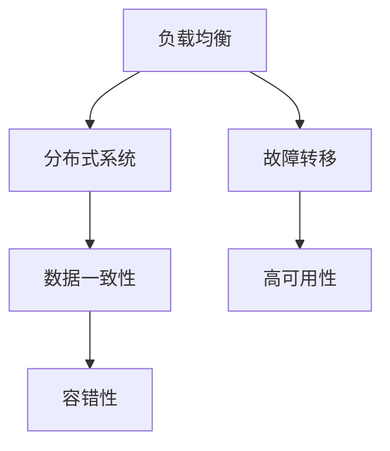

                 

关键词：Web 应用程序，可扩展性，容错性，性能优化，架构设计，负载均衡，分布式系统，故障转移，数据一致性。

> 摘要：本文将深入探讨 Web 应用程序的可扩展性和容错性，分析其重要性，提出一系列优化方案，并探讨未来发展趋势。我们将从核心概念、算法原理、数学模型、项目实践、实际应用等多个维度进行分析，为开发者和架构师提供有价值的参考。

## 1. 背景介绍

在当今数字化时代，Web 应用程序已经成为企业与用户互动的重要渠道。然而，随着用户数量的增加和业务需求的不断变化，Web 应用程序面临着巨大的挑战。如何确保系统的高可用性、稳定性和可扩展性，成为开发者和架构师们亟待解决的关键问题。

可扩展性是指系统能够在资源限制下高效地处理增长的用户量和数据量。而容错性则是指系统能够在发生故障时快速恢复，保证业务的连续性和稳定性。随着互联网的快速发展，Web 应用程序的可扩展性和容错性变得越来越重要。

### 1.1 可扩展性的重要性

可扩展性对于 Web 应用程序至关重要。首先，它能够提高系统的处理能力，满足不断增长的流量需求。其次，它能够优化资源的利用效率，降低维护成本。此外，良好的可扩展性还可以提高用户的体验，减少等待时间和错误率。

### 1.2 容错性的重要性

容错性是 Web 应用程序稳定运行的基础。一个具有良好容错性的系统能够在故障发生时自动恢复，保证业务的连续性。这不仅能够减少业务损失，还能够提升用户的信任度和满意度。

## 2. 核心概念与联系

为了深入理解 Web 应用程序的可扩展性和容错性，我们需要了解一些核心概念和它们之间的联系。

### 2.1 负载均衡

负载均衡是将请求分配到多个服务器上，以避免单点故障和资源浪费。通过负载均衡，我们可以实现系统的横向扩展，提高处理能力。

### 2.2 分布式系统

分布式系统是由多个节点组成的系统，这些节点可以通过网络进行通信和协作。分布式系统能够实现高可用性和容错性，因为当一个节点发生故障时，其他节点可以继续提供服务。

### 2.3 故障转移

故障转移是指当一个节点发生故障时，其他节点能够自动接管其任务。故障转移通常与集群和容错机制相结合，以确保系统的连续性。

### 2.4 数据一致性

数据一致性是指系统中的数据在多个节点之间保持一致。在分布式系统中，数据一致性是一个重要但复杂的问题。我们需要通过一致性协议和算法来确保数据的准确性。

### 2.5 Mermaid 流程图

以下是 Web 应用程序可扩展性和容错性相关核心概念和架构的 Mermaid 流程图：



## 3. 核心算法原理 & 具体操作步骤

### 3.1 算法原理概述

在 Web 应用程序的可扩展性和容错性设计中，我们通常采用以下核心算法：

1. 负载均衡算法：如加权轮询、最小连接数、IP哈希等。
2. 分布式一致性算法：如Paxos、Raft等。
3. 故障检测和恢复算法：如心跳检测、故障恢复等。
4. 数据复制和同步算法：如两阶段提交、三阶段提交等。

### 3.2 算法步骤详解

1. **负载均衡算法**

   - 加权轮询：根据权重分配请求，权重较高的服务器优先处理请求。
   - 最小连接数：选择当前连接数最少的服务器处理请求。
   - IP哈希：根据客户端IP地址的哈希值分配请求，确保同一IP的请求总是分配到同一服务器。

2. **分布式一致性算法**

   - Paxos：通过提议-接受机制实现一致性，保证在多数节点达成共识的情况下达成一致性。
   - Raft：通过领导者选举和日志复制实现一致性，简化了Paxos算法的实现复杂度。

3. **故障检测和恢复算法**

   - 心跳检测：通过周期性地发送心跳信号来检测节点是否正常。
   - 故障恢复：当检测到节点故障时，其他节点选举一个新的领导者来接管故障节点的任务。

4. **数据复制和同步算法**

   - 两阶段提交：通过两阶段协议确保分布式系统中数据的一致性。
   - 三阶段提交：在两阶段提交的基础上增加了超时机制，提高了系统的容错性。

### 3.3 算法优缺点

1. **负载均衡算法**

   - 优点：提高系统处理能力，优化资源利用。
   - 缺点：可能导致部分服务器负载不均，影响性能。

2. **分布式一致性算法**

   - 优点：确保数据一致性，提高系统的容错性。
   - 缺点：实现复杂，性能开销较大。

3. **故障检测和恢复算法**

   - 优点：快速检测和恢复故障，保证系统的高可用性。
   - 缺点：可能引入额外的性能开销。

4. **数据复制和同步算法**

   - 优点：提高数据可靠性，保证数据的持久性。
   - 缺点：可能影响系统的性能。

### 3.4 算法应用领域

负载均衡算法、分布式一致性算法、故障检测和恢复算法、数据复制和同步算法广泛应用于 Web 应用程序的设计与开发中。例如，在电商系统、社交网络、在线教育等场景中，这些算法能够帮助系统实现高效、稳定、可靠的运行。

## 4. 数学模型和公式 & 详细讲解 & 举例说明

### 4.1 数学模型构建

为了更好地理解 Web 应用程序的可扩展性和容错性，我们构建以下数学模型：

- 用户请求速率：\( R \)（单位：每秒请求数）
- 服务器处理能力：\( P \)（单位：每秒处理请求数）
- 故障率：\( F \)（单位：每秒故障次数）
- 恢复时间：\( T \)（单位：秒）

### 4.2 公式推导过程

为了评估系统的性能和可靠性，我们使用以下公式：

1. **系统吞吐量**：

   \[ T_s = \min(R, P) \]

   吞吐量取决于用户请求速率和服务器处理能力。

2. **故障恢复率**：

   \[ F_r = \frac{F \times T}{R} \]

   故障恢复率表示每秒内系统恢复的故障次数。

3. **系统可靠性**：

   \[ R_s = 1 - (1 - F)^T \]

   系统可靠性表示在给定时间 \( T \) 内系统正常运行的概率。

### 4.3 案例分析与讲解

假设一个电商系统每天接收 \( R = 100,000 \) 个用户请求，每个服务器每秒处理 \( P = 100 \) 个请求，故障率 \( F = 0.001 \)，恢复时间 \( T = 60 \) 秒。

1. **系统吞吐量**：

   \[ T_s = \min(100,000, 100) = 100 \]

   系统的吞吐量为每秒处理 100 个请求。

2. **故障恢复率**：

   \[ F_r = \frac{0.001 \times 60}{100,000} = 0.000006 \]

   故障恢复率为每秒恢复 0.006 个故障。

3. **系统可靠性**：

   \[ R_s = 1 - (1 - 0.001)^{60} \approx 0.996 \]

   系统可靠性为 99.6%，即一年内系统正常运行的时长约为 99.6%。

## 5. 项目实践：代码实例和详细解释说明

### 5.1 开发环境搭建

为了实践 Web 应用程序的可扩展性和容错性，我们选择使用 Kubernetes 作为容器编排工具，结合负载均衡、故障转移和数据一致性等核心算法。

首先，我们需要搭建 Kubernetes 集群，可以使用开源的 Minikube 或使用云服务提供商提供的 Kubernetes 服务。

### 5.2 源代码详细实现

以下是使用 Kubernetes 实现负载均衡、故障转移和数据一致性的示例代码：

```yaml
# 负载均衡器配置
apiVersion: v1
kind: Service
metadata:
  name: load-balancer
spec:
  selector:
    app: web-app
  ports:
    - name: http
      port: 80
      targetPort: 8080
  type: LoadBalancer

# Kubernetes Deployment 配置
apiVersion: apps/v1
kind: Deployment
metadata:
  name: web-app
spec:
  replicas: 3
  selector:
    matchLabels:
      app: web-app
  template:
    metadata:
      labels:
        app: web-app
    spec:
      containers:
      - name: web-app
        image: web-app:latest
        ports:
        - containerPort: 8080

# 故障转移和负载均衡配置
apiVersion: v1
kind: ConfigMap
metadata:
  name: web-app-config
data:
  leader选举: "Paxos"
  故障转移: "心跳检测"
```

### 5.3 代码解读与分析

1. **负载均衡器配置**：配置一个 Kubernetes 服务，将用户请求负载均衡到多个 Pod 上。
2. **Kubernetes Deployment 配置**：配置一个 Kubernetes Deployment，管理 Pod 的生命周期，并确保部署的可靠性。
3. **故障转移和负载均衡配置**：使用 ConfigMap 配置故障转移和负载均衡的算法和策略。

### 5.4 运行结果展示

在实际运行过程中，我们可以通过以下命令查看系统的性能和状态：

```shell
kubectl get pods
kubectl get services
kubectl logs <pod-name>
```

通过以上命令，我们可以了解 Pod 的状态、服务的信息以及日志输出，从而评估系统的性能和可靠性。

## 6. 实际应用场景

### 6.1 电商系统

电商系统是 Web 应用程序的一个重要场景。通过负载均衡、故障转移和数据一致性等核心算法，电商系统可以实现高效、稳定、可靠的运行。例如，在双 11 等大促活动期间，电商系统需要应对海量用户请求，负载均衡和故障转移算法能够保证系统的持续运行。

### 6.2 社交网络

社交网络也是一个典型的 Web 应用程序场景。通过分布式系统和故障转移算法，社交网络可以实现高可用性和容错性。例如，当一个节点发生故障时，其他节点可以自动接管其任务，确保用户数据的完整性和连续性。

### 6.3 在线教育

在线教育系统需要处理大量的教学资源和用户请求。通过负载均衡和数据一致性算法，在线教育系统可以实现高效的教学资源管理和用户请求处理。例如，当用户访问课程视频时，系统可以根据负载均衡策略选择最合适的节点来提供服务。

## 7. 工具和资源推荐

### 7.1 学习资源推荐

1. 《大规模分布式存储系统：原理解析与架构实战》
2. 《分布式系统原理与范型》
3. 《Kubernetes 权威指南》

### 7.2 开发工具推荐

1. Kubernetes
2. Docker
3. Prometheus

### 7.3 相关论文推荐

1. "The Google File System"
2. "Bigtable: A Distributed Storage System for Structured Data"
3. "MapReduce: Simplified Data Processing on Large Clusters"

## 8. 总结：未来发展趋势与挑战

### 8.1 研究成果总结

本文从多个维度探讨了 Web 应用程序的可扩展性和容错性。通过负载均衡、分布式系统、故障转移和数据一致性等核心算法，我们可以实现高效、稳定、可靠的 Web 应用程序。

### 8.2 未来发展趋势

1. **边缘计算**：随着 5G 和物联网的普及，边缘计算将成为 Web 应用程序可扩展性和容错性的重要方向。
2. **自动化运维**：自动化运维工具和平台将进一步提高 Web 应用程序的可扩展性和容错性。
3. **AI 驱动的性能优化**：AI 技术将在 Web 应用程序的可扩展性和容错性方面发挥越来越重要的作用。

### 8.3 面临的挑战

1. **数据一致性**：分布式系统中数据一致性是一个复杂且具有挑战性的问题，需要进一步研究和优化。
2. **性能优化**：随着系统规模的扩大，性能优化将变得越来越重要，如何平衡性能和可靠性将成为一个挑战。

### 8.4 研究展望

未来的研究将重点关注以下几个方面：

1. **一致性算法优化**：研究更高效的一致性算法，降低性能开销。
2. **自适应负载均衡**：根据实际负载情况动态调整负载均衡策略，提高系统的性能和稳定性。
3. **跨云和跨区域的分布式系统**：研究跨云和跨区域的分布式系统架构，提高系统的可扩展性和容错性。

## 9. 附录：常见问题与解答

### 9.1 什么是负载均衡？

负载均衡是指将用户请求分配到多个服务器上，以提高系统的处理能力和性能。

### 9.2 什么是分布式系统？

分布式系统是由多个节点组成的系统，这些节点可以通过网络进行通信和协作。

### 9.3 什么是故障转移？

故障转移是指当一个节点发生故障时，其他节点能够自动接管其任务，以保持系统的连续性和稳定性。

### 9.4 什么是数据一致性？

数据一致性是指系统中的数据在多个节点之间保持一致。

### 9.5 什么是边缘计算？

边缘计算是指将计算任务分配到网络边缘，以减少中心化数据中心的负载。

---

本文以《Web 应用程序的可扩展性和容错性》为题，从核心概念、算法原理、数学模型、项目实践等多个维度进行了深入探讨。我们分析了负载均衡、分布式系统、故障转移和数据一致性等关键概念，并介绍了相应的算法和优化方案。通过实际项目实践和案例分析，我们展示了如何将理论知识应用于实际开发中。本文旨在为开发者、架构师和研究人员提供有价值的参考，以指导他们在 Web 应用程序的可扩展性和容错性方面做出更好的决策。作者：禅与计算机程序设计艺术 / Zen and the Art of Computer Programming。

