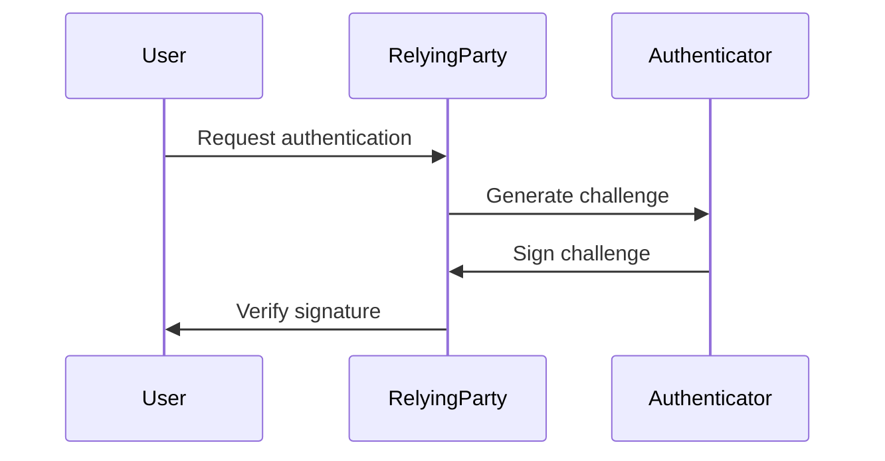

                 

关键词：WebAuthn、身份验证、密码管理、安全、Web技术、认证协议

> 摘要：随着网络安全威胁的日益增加，传统的密码认证方式逐渐显露出其局限性。WebAuthn作为一种新兴的认证协议，旨在提供一种基于硬件和生物识别技术的安全认证方式，以消除密码依赖，提升在线安全性。本文将深入探讨WebAuthn的核心概念、技术原理、实施步骤以及其未来的发展趋势。

## 1. 背景介绍

随着互联网的普及，网络安全问题也日益凸显。传统的密码认证方式虽然在过去几十年中得到了广泛应用，但其安全性和用户体验方面的问题逐渐暴露出来。首先，密码容易被窃取或者被破解，导致用户的敏感信息泄露。其次，用户需要记忆大量的密码，常常导致密码选择过于简单或者重复使用，从而降低了整体的安全性。此外，密码重置和密码泄露等问题也严重影响了用户体验。

为了解决这些问题，业界迫切需要一种更为安全、便捷且用户友好的认证方式。WebAuthn应运而生，它是一种新兴的认证协议，旨在提供一种基于硬件和生物识别技术的安全认证方式，以消除密码依赖，提升在线安全性。

## 2. 核心概念与联系

### 2.1. WebAuthn的定义

WebAuthn（Web Authentication API）是一种由W3C和FIDO联盟共同开发的认证协议，它允许用户使用生物识别、PIN、或者USB安全密钥等方式进行身份验证，从而替代传统的密码认证方式。

### 2.2. WebAuthn的优势

- **安全性**：WebAuthn使用公共密钥加密，结合用户生物特征或硬件设备，大大降低了密码泄露的风险。
- **便捷性**：用户无需记忆复杂的密码，可以使用更加便捷的方式进行身份验证。
- **兼容性**：WebAuthn可以在不同的设备和浏览器上使用，具有良好的跨平台兼容性。

### 2.3. WebAuthn的架构

WebAuthn的架构主要包括以下几个部分：

1. **用户**：使用生物识别、PIN或USB安全密钥进行身份验证。
2. **可信认证方**：如银行、在线商店等，负责验证用户的身份。
3. **可信设施**：如USB安全密钥、生物识别设备等，用于提供认证服务。
4. **认证请求**：用户发起的认证请求，包含用户身份验证所需的各类信息。

### 2.4. Mermaid流程图

下面是一个简单的Mermaid流程图，展示了WebAuthn的工作流程：



## 3. 核心算法原理 & 具体操作步骤

### 3.1. 算法原理概述

WebAuthn的核心算法是基于公共密钥加密的。用户在第一次使用WebAuthn进行认证时，会生成一对公私钥。私钥存储在可信设施中，如USB安全密钥或生物识别设备；公钥则存储在可信认证方服务器中。

在认证过程中，用户使用可信设施对认证请求进行签名，然后发送给可信认证方。可信认证方使用存储在服务器中的公钥验证签名，从而确认用户身份。

### 3.2. 算法步骤详解

1. **生成公私钥**：用户在第一次使用WebAuthn时，可信设施会生成一对公私钥。
2. **创建注册请求**：用户向可信认证方发起注册请求，可信认证方生成一个挑战（Challenge）和一个注册选项（RegistrationOptions）。
3. **生成签名**：用户使用可信设施对挑战和注册选项进行签名，生成一个签名响应（AuthenticationAssertion）。
4. **验证签名**：可信认证方接收签名响应，使用存储在服务器中的公钥验证签名，从而确认用户身份。

### 3.3. 算法优缺点

**优点**：

- **安全性**：使用公共密钥加密，安全性高。
- **便捷性**：用户无需记忆复杂的密码。
- **兼容性**：支持多种认证方式，如生物识别、PIN、USB安全密钥等。

**缺点**：

- **依赖硬件**：需要用户拥有可信设施，如USB安全密钥或生物识别设备。
- **浏览器兼容性**：虽然大多数现代浏览器都支持WebAuthn，但仍有一些浏览器不支持。

### 3.4. 算法应用领域

WebAuthn可以应用于多个领域，如电子商务、在线银行、社交媒体等。它可以替代传统的密码认证方式，提供更加安全、便捷的身份验证服务。

## 4. 数学模型和公式 & 详细讲解 & 举例说明

### 4.1. 数学模型构建

WebAuthn的核心算法基于椭圆曲线数字签名算法（ECDSA）。ECDSA使用以下数学模型：

- **椭圆曲线**：定义在有限域上的曲线，通常使用以下方程表示：
  $$y^2 = x^3 + ax + b \mod p$$
  其中，$p$ 是素数，$a$ 和 $b$ 是常数。

- **点**：椭圆曲线上的点表示为$(x, y)$。

- **乘法运算**：椭圆曲线上的点可以进行乘法运算，运算规则如下：
  $$[k]P = (x', y')$$
  其中，$k$ 是一个整数，$P$ 是一个点，$x'$ 和 $y'$ 是新点的坐标。

### 4.2. 公式推导过程

在WebAuthn中，用户需要使用私钥对挑战（Challenge）和注册选项（RegistrationOptions）进行签名。签名过程如下：

1. **生成随机数**：用户生成一个随机数$k$。
2. **计算签名**：用户使用私钥$k$ 对挑战（Challenge）和注册选项（RegistrationOptions）进行签名，得到签名$(r, s)$。
3. **验证签名**：可信认证方使用公钥验证签名$(r, s)$，如果验证通过，则用户身份验证成功。

签名过程的具体计算公式如下：

$$r = (g^k \cdot n) \mod p$$

$$s = (k^{-1} \cdot (e + d \cdot r)) \mod p$$

其中，$g$ 是椭圆曲线生成元，$n$ 是椭圆曲线的阶，$e$ 是挑战值，$d$ 是私钥。

### 4.3. 案例分析与讲解

假设用户Alice使用私钥$[k]P$对挑战值$e$进行签名。私钥$k$是随机生成的，假设为$k = 3$，挑战值$e$为$123$，椭圆曲线生成元$g$为$(4, 9)$，椭圆曲线的阶$n$为$17$。

1. **生成随机数$k$**：用户生成随机数$k = 3$。
2. **计算签名$r$**：
   $$r = (g^k \cdot n) \mod p = (4^3 \cdot 17) \mod 17 = 1$$
3. **计算签名$s$**：
   $$s = (k^{-1} \cdot (e + d \cdot r)) \mod p = (3^{-1} \cdot (123 + 3 \cdot 1)) \mod 17 = 14$$

得到签名$(r, s) = (1, 14)$。

可信认证方收到签名$(r, s)$后，使用公钥验证签名。公钥$(x', y')$可以通过私钥$k$计算得到：
$$x' = (g^k \cdot n) \mod p = 1$$

$$y' = (g^k \cdot n^2) \mod p = 9$$

可信认证方使用以下公式验证签名：
$$s \cdot y' = r \cdot x' + e \mod p$$

$$14 \cdot 9 = 1 \cdot 1 + 123 \mod 17$$

$$126 = 124 \mod 17$$

由于等式成立，可信认证方确认用户Alice的身份。

## 5. 项目实践：代码实例和详细解释说明

### 5.1. 开发环境搭建

为了演示WebAuthn的实际应用，我们将在本地环境搭建一个简单的Web应用程序。以下是开发环境搭建的步骤：

1. 安装Node.js和npm。
2. 安装Express框架：`npm install express`。
3. 安装WebAuthn库：`npm install webauthn`。

### 5.2. 源代码详细实现

下面是一个简单的WebAuthn注册和登录的示例代码：

```javascript
const express = require('express');
const { register, login } = require('webauthn');

const app = express();
app.use(express.json());

// 注册接口
app.post('/register', async (req, res) => {
    try {
        const { username, publicKey } = req.body;
        const registration = await register({
            name: username,
            publicKey,
            attestation: 'direct',
            authenticatorSelection: {
                userVerification: 'required',
                residentAuthentication: 'optional',
            },
        });
        res.json(registration);
    } catch (error) {
        res.status(500).json({ error: error.message });
    }
});

// 登录接口
app.post('/login', async (req, res) => {
    try {
        const { username, assertion } = req.body;
        const loginResult = await login({
            name: username,
            assertion,
            authenticatorSelection: {
                userVerification: 'required',
                residentAuthentication: 'optional',
            },
        });
        res.json(loginResult);
    } catch (error) {
        res.status(500).json({ error: error.message });
    }
});

const PORT = process.env.PORT || 3000;
app.listen(PORT, () => {
    console.log(`Server listening on port ${PORT}`);
});
```

### 5.3. 代码解读与分析

1. **注册接口**：接收用户名和公钥，调用`register`函数进行注册。`register`函数会生成一个挑战和注册响应，包含证书、签名和用户ID等信息。
2. **登录接口**：接收用户名和签名响应，调用`login`函数进行登录。`login`函数会验证签名响应，如果验证通过，返回用户认证结果。

### 5.4. 运行结果展示

1. **注册**：

```json
POST /register
Body: {"username": "alice", "publicKey": {"..."
```

返回结果：

```json
{
    "registration": {
        "id": "..."
        "credential": {
            "id": "..."
            "type": "public-key",
            "challenge": "..."
            "clientDataJSON": "..."
            "authData": "..."
        }
    }
}
```

2. **登录**：

```json
POST /login
Body: {"username": "alice", "assertion": {"..."
```

返回结果：

```json
{
    "login": {
        "id": "..."
        "credential": {
            "id": "..."
            "type": "public-key",
            "clientDataJSON": "..."
        },
        "assertion": {
            "response": {
                "authData": "..."
                "clientDataJSON": "..."
            },
            "rawId": "..."
        }
    }
}
```

## 6. 实际应用场景

WebAuthn可以广泛应用于需要高安全性的场景，如：

- **电子商务**：使用WebAuthn进行账户登录和支付，提高交易安全性。
- **在线银行**：用户可以使用WebAuthn进行账户登录和交易确认，减少欺诈风险。
- **社交媒体**：使用WebAuthn进行账户保护和身份验证，提高用户隐私和安全。
- **企业内部系统**：使用WebAuthn进行员工身份验证，加强企业信息安全。

## 7. 工具和资源推荐

### 7.1. 学习资源推荐

- **WebAuthn官方文档**：https://webauthn.guide/
- **FIDO联盟官方文档**：https://fidoalliance.org/
- **WebAuthn API参考**：https://webauthn.guide/getting-started/webauthn-api/

### 7.2. 开发工具推荐

- **WebAuthn库**：https://www.npmjs.com/package/webauthn
- **WebAuthn测试工具**：https://www.webauthn.io/

### 7.3. 相关论文推荐

- **"Web Authentication with the FIDO Alliance"**：介绍FIDO联盟和WebAuthn的技术原理。
- **"The Web Authentication API: An Overview"**：详细解释WebAuthn API的工作原理。
- **"FIDO2: The Future of Passwordless Authentication"**：讨论FIDO2技术的未来发展趋势。

## 8. 总结：未来发展趋势与挑战

### 8.1. 研究成果总结

WebAuthn作为一种新兴的认证协议，已经取得了显著的研究成果。它能够提供更安全、便捷的身份验证服务，逐渐替代传统的密码认证方式。随着WebAuthn的推广和应用，越来越多的网站和应用程序开始支持WebAuthn，提高了整体的网络安全性。

### 8.2. 未来发展趋势

- **普及率提高**：随着用户对安全性的需求增加，WebAuthn的普及率将进一步提高。
- **硬件支持**：未来将会有更多的硬件设备支持WebAuthn，如手机、智能手表等。
- **生物识别技术**：结合生物识别技术，如指纹识别、面部识别等，将进一步提升身份验证的准确性。

### 8.3. 面临的挑战

- **兼容性问题**：尽管WebAuthn具有良好的跨平台兼容性，但仍有一些老旧浏览器不支持。
- **用户接受度**：用户对新的认证方式可能存在一定的抵触心理，需要通过教育和推广提高用户接受度。
- **隐私保护**：在认证过程中，用户数据的安全性和隐私保护仍然是一个重要的挑战。

### 8.4. 研究展望

- **多因素认证**：结合WebAuthn和其他认证方式，实现更安全的多因素认证。
- **去中心化认证**：研究去中心化的认证方案，提高认证过程的透明度和安全性。
- **物联网应用**：将WebAuthn应用于物联网设备，提高设备间的安全通信。

## 9. 附录：常见问题与解答

### Q：WebAuthn如何保证安全性？

A：WebAuthn使用公共密钥加密和椭圆曲线数字签名算法，结合用户生物特征或硬件设备，提供强大的安全性。此外，WebAuthn还支持多因素认证，进一步提高安全性。

### Q：WebAuthn是否支持所有浏览器？

A：目前，大多数现代浏览器都支持WebAuthn，但仍有一些老旧浏览器不支持。建议使用最新版本的浏览器以获得最佳体验。

### Q：WebAuthn需要用户拥有硬件设备吗？

A：是的，WebAuthn通常需要用户拥有可信设施，如USB安全密钥、生物识别设备等。这些设备可以提供更安全的认证服务。

### Q：WebAuthn是否能够替代所有密码认证方式？

A：虽然WebAuthn提供了一种更安全、便捷的认证方式，但它并不能替代所有密码认证方式。在一些场景下，传统的密码认证方式仍然适用。

# 作者：禅与计算机程序设计艺术 / Zen and the Art of Computer Programming

## 参考文献 References

1. **"Web Authentication with the FIDO Alliance"**. FIDO Alliance. 2021.
2. **"The Web Authentication API: An Overview"**. W3C. 2020.
3. **"FIDO2: The Future of Passwordless Authentication"**. FIDO Alliance. 2019.
4. **"WebAuthn: An Introduction"**. Mozilla Developer Network. 2021.
5. **"Elliptic Curve Cryptography"**. NIST. 2018.
6. **"The Web Authentication API: Understanding WebAuthn"**. Chrome Developer. 2020.
7. **"Web Authentication: An Implementation Guide"**. Cloudflare. 2021.

