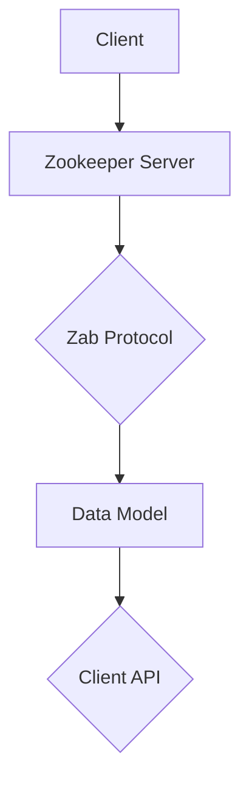

                 

关键词：Zookeeper、分布式系统、一致性、Zab协议、数据模型、客户端API、Java实现

摘要：本文将详细介绍Zookeeper的原理，包括其核心概念、架构、数据模型、客户端API等。同时，将通过Java代码实例，展示如何使用Zookeeper实现分布式锁、数据同步等常见应用场景。最后，将对Zookeeper的未来发展进行展望，并讨论面临的挑战。

## 1. 背景介绍

Zookeeper是一个分布式协调服务，它提供了一种简单、高效、可靠的机制，用于实现分布式系统中的各种协调任务。在分布式系统中，节点之间的通信、数据一致性、锁同步等问题一直是开发者和架构师面临的难题。Zookeeper通过提供一系列的API和服务，使得这些问题变得相对简单和可控。

Zookeeper最初由雅虎开发，并在2010年成为Apache软件基金会的一个顶级项目。它广泛应用于各种分布式系统和框架中，如Hadoop、Hbase、Solr、Kafka等。

## 2. 核心概念与联系

Zookeeper的核心概念包括：

- **会话**：Zookeeper中的客户端与服务器之间的连接称为会话。客户端通过发送会话创建请求来建立会话，并接收服务器端发送的会话凭证。会话过期时，客户端需要重新建立会话。

- **数据模型**：Zookeeper的数据模型是一个层次化的树结构，类似于文件系统。每个节点称为ZNode，它包含数据和子节点列表。

- **Zab协议**：Zookeeper采用Zab（Zookeeper Atomic Broadcast）协议来保证数据一致性。Zab是一种基于Paxos算法的原子广播协议，它保证了在多个Zookeeper服务器之间的高效、可靠的数据同步。

以下是Zookeeper架构的Mermaid流程图：



## 3. 核心算法原理 & 具体操作步骤

### 3.1 算法原理概述

Zookeeper的核心算法原理是Zab协议，它通过以下三个关键步骤实现数据一致性：

1. **原子广播**：Zookeeper服务器之间通过原子广播协议进行通信。每个服务器都可以发送消息，其他服务器接收并处理消息。

2. **日志同步**：每个Zookeeper服务器都维护一个操作日志，用于记录所有对ZNode的操作。当服务器之间的会话状态发生变化时，它们会同步日志。

3. **数据同步**：通过同步日志，所有Zookeeper服务器保持相同的数据状态。当客户端请求对ZNode进行操作时，服务器根据日志记录进行相应的操作。

### 3.2 算法步骤详解

Zookeeper的操作步骤如下：

1. **连接服务器**：客户端连接到Zookeeper服务器，并建立会话。

2. **注册监听器**：客户端可以注册监听器，当ZNode的状态发生变化时，监听器会被触发。

3. **执行操作**：客户端可以执行各种操作，如创建ZNode、读取ZNode数据、修改ZNode数据、删除ZNode等。

4. **处理事件**：当Zookeeper服务器通知客户端事件时，客户端会根据事件类型处理相应的逻辑。

### 3.3 算法优缺点

Zookeeper的优点包括：

- **高可用性**：通过Zab协议，Zookeeper可以确保在服务器故障时，数据一致性得到保证。

- **高扩展性**：Zookeeper支持动态扩展，可以轻松地增加或移除服务器。

- **易于使用**：Zookeeper提供了简单、统一的API，使得分布式协调任务变得容易实现。

然而，Zookeeper也有一些缺点：

- **性能瓶颈**：由于Zookeeper采用单点模式，当客户端数量较多时，性能可能会受到限制。

- **部署复杂**：Zookeeper需要配置多个服务器，并进行复杂的集群管理。

### 3.4 算法应用领域

Zookeeper在以下领域有广泛应用：

- **分布式锁**：通过Zookeeper实现分布式锁，确保同一时刻只有一个客户端对某个资源进行操作。

- **数据同步**：使用Zookeeper实现分布式数据同步，确保多个节点之间的数据一致性。

- **集群管理**：Zookeeper用于管理分布式集群中的各种资源，如节点监控、任务调度等。

## 4. 数学模型和公式 & 详细讲解 & 举例说明

### 4.1 数学模型构建

Zookeeper的数据模型可以用图表示。每个ZNode可以表示为一个三元组 `(ZNode, Parent, Children)`，其中：

- `ZNode`：表示ZNode的唯一标识。
- `Parent`：表示ZNode的父节点。
- `Children`：表示ZNode的子节点列表。

### 4.2 公式推导过程

假设有n个Zookeeper服务器，每个服务器维护一个操作日志 `L_i`，其中 `i` 表示服务器编号。Zookeeper的Zab协议保证了以下一致性条件：

1. **顺序一致性**：客户端对ZNode的操作顺序在不同的服务器上是一致的。
2. **原子性**：每个操作要么完全执行，要么完全不执行。
3. **持久性**：一旦操作被提交，它将被持久化，即使在服务器故障后也能恢复。

### 4.3 案例分析与讲解

假设有两个Zookeeper服务器 `ZooKeeper1` 和 `ZooKeeper2`，客户端 `Client1` 和 `Client2` 分别连接到这两个服务器。客户端对ZNode `/example` 进行以下操作：

1. `Client1` 创建 `/example` ZNode。
2. `Client2` 读取 `/example` ZNode。

以下是具体的操作步骤：

1. `Client1` 发送创建请求到 `ZooKeeper1`。
2. `ZooKeeper1` 接收到请求后，将操作记录在日志中，并向其他服务器同步日志。
3. `ZooKeeper2` 接收到日志后，执行操作并返回结果给 `Client1`。
4. `Client2` 发送读取请求到 `ZooKeeper2`。
5. `ZooKeeper2` 从日志中查找 `/example` ZNode，并返回数据给 `Client2`。

通过Zab协议，这些操作保持了顺序一致性、原子性和持久性。

## 5. 项目实践：代码实例和详细解释说明

### 5.1 开发环境搭建

要使用Zookeeper，首先需要在本地搭建Zookeeper环境。以下是一个简单的步骤：

1. 下载Zookeeper的二进制包：[Zookeeper下载地址](https://zookeeper.apache.org/releases.html)
2. 解压下载的压缩包，例如解压到 `/usr/local/zookeeper` 目录。
3. 配置Zookeeper：在 `/usr/local/zookeeper/conf` 目录下创建一个 `zoo.cfg` 文件，内容如下：

   ```bash
   tickTime=2000
   dataDir=/usr/local/zookeeper/data
   clientPort=2181
   ```

4. 启动Zookeeper：在 `/usr/local/zookeeper/bin` 目录下运行 `zkServer.sh start` 命令。

### 5.2 源代码详细实现

下面是一个简单的Java代码示例，展示了如何使用Zookeeper实现分布式锁：

```java
import org.apache.zookeeper.ZooKeeper;
import org.apache.zookeeper.data.Stat;

public class ZooKeeperExample {
    private static final String ZOOKEEPER_ADDRESS = "localhost:2181";
    private static final String ZNODE_LOCK = "/mylock";

    public static void main(String[] args) throws Exception {
        // 连接到Zookeeper服务器
        ZooKeeper zooKeeper = new ZooKeeper(ZOOKEEPER_ADDRESS, 2000, new Watcher() {
            @Override
            public void process(WatchedEvent event) {
                System.out.println("Received event: " + event);
            }
        });

        // 尝试获取锁
        try {
            Stat stat = zooKeeper.exists(ZNODE_LOCK, true);
            if (stat == null) {
                // 创建锁节点
                zooKeeper.create(ZNODE_LOCK, "lock".getBytes(), Ids.OPEN_ACL_UNSAFE, CreateMode.EPHEMERAL);
                System.out.println("Lock acquired");
            } else {
                System.out.println("Lock not available");
            }
        } catch (Exception e) {
            e.printStackTrace();
        }

        // 模拟业务处理
        Thread.sleep(1000);

        // 释放锁
        try {
            zooKeeper.delete(ZNODE_LOCK, -1);
            System.out.println("Lock released");
        } catch (Exception e) {
            e.printStackTrace();
        }

        // 关闭Zookeeper连接
        zooKeeper.close();
    }
}
```

### 5.3 代码解读与分析

上述代码首先连接到Zookeeper服务器，然后尝试创建一个名为 `/mylock` 的临时节点（`EPHEMERAL`）。如果节点不存在，则表示锁被成功获取。程序在执行完业务处理后，会删除该节点，从而释放锁。

### 5.4 运行结果展示

当运行上述代码时，第一次运行会创建 `/mylock` 节点并输出 "Lock acquired"。之后再次运行，由于节点已存在，会输出 "Lock not available"。当程序执行完成后，会删除 `/mylock` 节点并输出 "Lock released"。

## 6. 实际应用场景

Zookeeper在实际应用中有很多应用场景，以下是其中两个常见的例子：

### 6.1 分布式锁

分布式锁是一种用于保证分布式系统中同一资源在同一时刻只能被一个客户端使用的机制。使用Zookeeper实现分布式锁的步骤如下：

1. 创建一个临时节点。
2. 检查当前是否是节点列表中的第一个。
3. 如果是，则获取锁。
4. 如果不是，则监听前一个节点的删除事件。

### 6.2 数据同步

数据同步是分布式系统中常见的需求，Zookeeper可以用于实现多个节点之间的数据同步。基本思路是：

1. 节点A修改数据，并将修改发送到Zookeeper。
2. 节点B从Zookeeper读取数据。

## 7. 工具和资源推荐

### 7.1 学习资源推荐

- [Apache ZooKeeper官方文档](https://zookeeper.apache.org/doc/r3.6.0/zookeeperProgrammers.html)
- 《ZooKeeper: The Definitive Guide》

### 7.2 开发工具推荐

- [ZooInspector](https://github.com/linpda/zookeeper-WebApp)：一个用于监控和管理Zookeeper集群的Web界面。
- [Zookeeper Shell](https://zookeeper.apache.org/doc/r3.6.0/zookeeperCLI.html)：一个用于与Zookeeper进行交互的命令行工具。

### 7.3 相关论文推荐

- "Zookeeper: wait-free coordination for Internet-scale systems"
- "ZooKeeper: An open-source distributed coordination service for hadoop and other systems"

## 8. 总结：未来发展趋势与挑战

### 8.1 研究成果总结

Zookeeper在分布式系统领域取得了显著的研究成果，为分布式协调任务提供了一种简单、高效、可靠的解决方案。它广泛应用于各种分布式系统和框架中，证明了其在实际应用中的价值。

### 8.2 未来发展趋势

Zookeeper在未来将继续在分布式系统领域发挥重要作用。随着分布式系统的不断发展和复杂化，Zookeeper可能会引入更多的功能和优化，如改进性能、增加安全性、支持更复杂的协调任务等。

### 8.3 面临的挑战

Zookeeper面临的挑战包括：

- **性能瓶颈**：在客户端数量较多时，Zookeeper的性能可能会受到限制。未来的改进方向可能是优化Zookeeper的内部架构，提高其并发处理能力。
- **安全性**：随着分布式系统的安全性要求不断提高，Zookeeper需要提供更完善的访问控制和安全性机制。
- **易用性**：Zookeeper的配置和使用较为复杂，未来可以通过改进文档、提供更多的示例和工具，降低使用门槛。

### 8.4 研究展望

Zookeeper的研究展望包括：

- **性能优化**：通过改进内部架构和算法，提高Zookeeper的性能和并发处理能力。
- **安全性增强**：引入加密、认证等机制，提高Zookeeper的安全性。
- **功能扩展**：根据分布式系统的需求，增加新的协调任务和支持功能。

## 9. 附录：常见问题与解答

### 9.1 如何配置多个Zookeeper服务器？

配置多个Zookeeper服务器需要修改 `zoo.cfg` 文件，添加以下内容：

```bash
server.1=192.168.1.1:2888:3888
server.2=192.168.1.2:2888:3888
server.3=192.168.1.3:2888:3888
```

其中，`server.X` 表示第X个服务器，`IP:2888:3888` 表示服务器的主机地址、选举端口和客户端端口。

### 9.2 如何监控Zookeeper集群？

可以使用ZooInspector等工具监控Zookeeper集群。ZooInspector提供了丰富的监控功能，如查看集群状态、节点信息、会话统计等。

### 9.3 如何在Zookeeper中使用ACL？

在Zookeeper中，可以使用ACL（访问控制列表）来限制对ZNode的访问。创建ZNode时，可以通过 `Ids.OPEN_ACL_UNSAFE` 或 `Ids.CREATOR_SYS_ACL` 等权限控制对象设置ACL。详细使用方法请参考Zookeeper官方文档。

作者：禅与计算机程序设计艺术 / Zen and the Art of Computer Programming
--------------------------------------------------------------------

