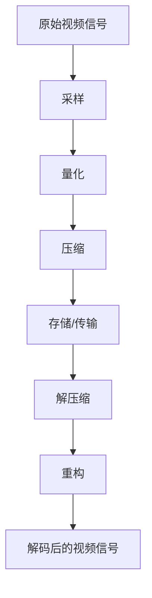

                 

### 背景介绍

随着互联网技术的飞速发展，视频内容已经成为人们日常生活中不可或缺的一部分。无论是直播、短视频还是电影电视剧，视频流量的增长都极为迅猛。然而，随着视频流量的增加，如何高效地传输和存储视频数据成为一个亟待解决的问题。这就是视频编解码算法的重要性所在。

视频编解码（Video Coding）是指将视频信号从一种格式转换为另一种格式的过程。在视频传输过程中，通过编码算法将视频数据压缩，以便减少数据传输所需的带宽；在解码过程中，则将压缩的视频数据还原为原始的视频格式。这种压缩和还原的过程在保证视频质量的前提下，极大地提高了视频传输的效率和存储的容量。

编解码算法在视频流媒体服务中扮演着至关重要的角色。例如，bilibili作为中国领先的年轻人文化社区，其平台上的视频内容丰富多样，从短视频到高清直播，都需要通过高效的编解码算法来实现流畅的播放体验。同时，随着4K、8K等超高清视频的普及，编解码算法的性能和效率也面临着更高的要求。

在当前的视频编解码技术中，H.264和HEVC（H.265）是最为常见的两种编解码标准。H.264是一种广泛应用于高清视频编码的算法，它的压缩效率较高，可以支持多种视频分辨率和帧率。然而，随着视频分辨率的进一步提升，H.264的压缩效率逐渐下降，这促使了HEVC的出现。HEVC作为一种新一代的视频编解码标准，相较于H.264具有更高的压缩效率，可以支持更高的分辨率和更低的比特率。

编解码算法工程师在视频流媒体服务中承担着关键的角色。他们需要深入理解不同的编解码算法，能够针对不同的应用场景选择合适的算法，并进行优化和改进，以实现最佳的传输效率和播放效果。此外，随着人工智能技术的应用，编解码算法工程师还需要掌握相关的机器学习技术，以便更好地进行视频内容的分析和处理。

总的来说，视频编解码技术在视频流媒体服务中具有举足轻重的地位。随着技术的发展和需求的增长，编解码算法工程师的角色将变得越来越重要，他们不仅需要掌握传统的编解码技术，还需要不断学习新的技术和方法，以应对不断变化的市场需求。

### 核心概念与联系

在深入探讨视频编解码算法之前，我们首先需要了解一些核心概念，包括编解码的基本原理、H.264和HEVC的主要特性以及它们在视频编解码中的应用。

#### 编解码的基本原理

视频编解码的主要目的是在保证视频质量的前提下，降低视频数据的存储和传输需求。其基本原理可以分为以下几个步骤：

1. **采样**：视频信号通过采样过程转换为数字信号，采样频率决定了视频的分辨率。
2. **量化**：采样后的数字信号通过量化处理，将连续的信号转换为有限的数值。
3. **压缩**：量化后的信号通过压缩算法进行压缩，常见的压缩方法包括变换编码、熵编码等。
4. **存储/传输**：压缩后的视频数据可以进行存储或传输，以减少所需的带宽和存储空间。
5. **解压缩**：在接收端，压缩的视频数据通过解压缩算法还原为原始的数字信号。
6. **重构**：解压缩后的数字信号经过重构处理，恢复为原始的视频信号。

#### H.264和HEVC的主要特性

**H.264**（也称为AVC，Advanced Video Coding）是当前最广泛使用的视频编码标准之一。它具有以下几个主要特性：

1. **高压缩效率**：H.264采用了多种先进的压缩技术，如变换编码、离散余弦变换（DCT）等，使得在相同视频质量下，可以比以前的标准如MPEG-2和MPEG-4具有更高的压缩效率。
2. **多码率支持**：H.264可以支持多种视频码率，适用于不同的传输环境，如标准定义、高清、超高清等。
3. **高效运动估计和补偿**：H.264引入了更先进的运动估计和补偿技术，能够更精确地预测和补偿图像中的运动，从而进一步提高了压缩效率。
4. **多功能性**：H.264不仅支持视频会议、流媒体、DVD等应用，还可以应用于移动设备、卫星传输等。

**HEVC**（也称为H.265或High Efficiency Video Coding）是新一代的视频编码标准，旨在解决H.264在超高清视频应用中的压缩效率不足问题。HEVC具有以下几个主要特性：

1. **更高的压缩效率**：HEVC采用了更多先进的压缩技术，如多分辨率编码、多参考帧等，使其在相同视频质量下，可以比H.264具有更高的压缩效率，适用于4K、8K等超高清视频。
2. **支持更高分辨率**：HEVC能够支持更高的视频分辨率，包括8K、10K等，满足未来视频技术的发展需求。
3. **多码率支持**：HEVC同样支持多种视频码率，适用于不同的传输环境。
4. **更好的兼容性**：HEVC在保持高压缩效率的同时，还保持了良好的兼容性，可以与现有的视频编解码器互操作。

#### H.264和HEVC在视频编解码中的应用

**H.264**广泛应用于各种视频应用场景，如：

- **流媒体服务**：如YouTube、Netflix、bilibili等，这些平台使用H.264来提供流畅的在线视频播放体验。
- **高清电视**：H.264成为大多数高清电视和播放器的标准，支持高清内容的播放。
- **视频会议**：H.264的高效压缩特性使其适用于视频会议系统，提供清晰的视频通信效果。
- **移动设备**：随着移动设备的普及，H.264也广泛应用于智能手机和平板电脑的视频播放和录制。

**HEVC**则主要应用于以下几个方面：

- **超高清视频**：随着4K、8K等超高清视频的普及，HEVC的高压缩效率和更高分辨率支持使其成为超高清视频的首选编码标准。
- **广播和电视**：HEVC有望成为新一代的电视广播标准，提供更高质量的电视内容。
- **云视频服务**：随着云服务的普及，HEVC可以减少云视频服务提供商的带宽和存储成本，提高服务效率。
- **移动设备**：尽管HEVC的计算复杂度较高，但随着移动设备性能的提升，HEVC有望在未来成为移动视频应用的标准。

总的来说，H.264和HEVC在视频编解码领域各自具有独特的优势和应用场景。H.264作为当前主流的编码标准，广泛应用于各种视频应用，而HEVC则面向未来的超高清视频需求，逐步取代H.264在部分应用中的地位。了解这些核心概念和联系，将为后续深入探讨编解码算法的具体实现提供基础。

### Mermaid 流程图

为了更好地展示视频编解码的基本流程，我们使用Mermaid流程图来描述从原始视频信号到解码后的视频信号的全过程。请注意，以下是嵌入文中独立段落的Mermaid流程图，每个步骤使用节点表示。



在这个流程图中，**A**表示原始视频信号，经过**B**（采样）、**C**（量化）和**D**（压缩）后，数据被存储或传输。接收端，压缩的数据通过**E**（解压缩）和**F**（重构）恢复为原始的数字信号，最终在**G**（重构）步骤中恢复为视频信号。通过这个流程图，我们可以清晰地看到编解码的全过程。

### 核心算法原理 & 具体操作步骤

#### 3.1 算法原理概述

视频编解码算法的核心在于如何有效地压缩视频数据，同时保证视频质量。H.264和HEVC都是基于变换编码和熵编码的原理，通过一系列复杂的技术实现高效的视频压缩。

**变换编码**：将空间域的视频信号转换到频率域，以消除冗余信息。H.264使用离散余弦变换（DCT），而HEVC则进一步改进，采用了方向性变换和分层变换。

**熵编码**：在变换编码的基础上，对频率域的系数进行编码，以进一步压缩数据。H.264使用Cauchy编码和RLE编码，而HEVC则引入了新的熵编码技术，如Context-based Adaptive Binary Arithmetic Coding（CABAC）。

#### 3.2 算法步骤详解

**H.264编码步骤**：

1. **帧间预测**：通过参考帧进行帧间预测，减少冗余信息。H.264支持多种预测模式，如帧内预测和帧间预测。
2. **变换编码**：对预测误差进行离散余弦变换（DCT），将其转换为频率域。
3. **量化**：对DCT系数进行量化，以减少信息量。
4. **熵编码**：使用Cauchy编码和RLE编码对量化后的系数进行编码。
5. **编码头信息**：添加编码头信息，包括帧类型、参考帧列表等。

**HEVC编码步骤**：

1. **帧间预测**：与H.264类似，但HEVC引入了更多预测模式和参考帧，如多参考帧和层次预测。
2. **变换编码**：HEVC采用方向性变换和分层变换，提高了压缩效率。方向性变换根据像素的局部特性进行变换，分层变换则允许对图像的不同层次进行不同精度的编码。
3. **量化**：与H.264类似，但HEVC引入了新的量化步长和量化模式。
4. **熵编码**：使用CABAC进行熵编码，CABAC通过自适应地选择概率模型和编码上下文，提高了编码效率。
5. **编码头信息**：添加编码头信息，包括序列参数集、片参数集等。

**H.264解码步骤**：

1. **解码头信息**：读取编码头信息，了解帧类型、参考帧列表等。
2. **熵解码**：使用Cauchy编码和RLE编码对量化后的系数进行解码。
3. **反量化**：对熵解码后的系数进行反量化，恢复为DCT系数。
4. **反变换编码**：使用反DCT将DCT系数转换为空间域。
5. **帧间预测**：根据参考帧重建预测图像，减去预测误差得到原始图像。

**HEVC解码步骤**：

1. **解码头信息**：读取编码头信息，了解序列参数、片参数等。
2. **熵解码**：使用CABAC对量化后的系数进行解码。
3. **反量化**：对熵解码后的系数进行反量化，恢复为变换域。
4. **反变换编码**：根据方向性变换和分层变换的描述，恢复为空间域。
5. **帧间预测**：根据参考帧重建预测图像，减去预测误差得到原始图像。

#### 3.3 算法优缺点

**H.264优点**：

- **高压缩效率**：在保证视频质量的前提下，H.264可以比以前的编码标准如MPEG-2和MPEG-4具有更高的压缩效率。
- **广泛的应用**：H.264已经成为流媒体服务、高清电视、视频会议、移动设备等应用的主流编码标准。
- **兼容性**：H.264与现有的编解码器具有良好的兼容性，可以与多种编码标准互操作。

**H.264缺点**：

- **计算复杂度较高**：虽然H.264的压缩效率较高，但其复杂的算法和大量的计算使得实时处理有一定难度。
- **不支持超高清视频**：H.264在处理4K、8K等超高清视频时，压缩效率较低，无法满足未来视频技术的发展需求。

**HEVC优点**：

- **更高的压缩效率**：HEVC在相同视频质量下，可以比H.264具有更高的压缩效率，适用于超高清视频。
- **支持更高分辨率**：HEVC能够支持更高的视频分辨率，包括8K、10K等，满足未来视频技术的发展需求。
- **多功能性**：HEVC在保持高压缩效率的同时，还保持了良好的兼容性，可以与现有的视频编解码器互操作。

**HEVC缺点**：

- **计算复杂度较高**：HEVC的复杂算法和多参考帧处理使得其计算复杂度较高，对硬件性能要求较高。
- **专利费用**：HEVC引入了许多新的专利技术，导致其专利费用较高，增加了使用成本。

#### 3.4 算法应用领域

**H.264应用领域**：

- **流媒体服务**：如YouTube、Netflix、bilibili等，这些平台使用H.264提供流畅的在线视频播放。
- **高清电视**：H.264成为大多数高清电视和播放器的标准，支持高清内容的播放。
- **视频会议**：H.264的高效压缩特性使其适用于视频会议系统，提供清晰的视频通信效果。
- **移动设备**：随着移动设备的普及，H.264广泛应用于智能手机和平板电脑的视频播放和录制。

**HEVC应用领域**：

- **超高清视频**：随着4K、8K等超高清视频的普及，HEVC成为超高清视频的首选编码标准。
- **广播和电视**：HEVC有望成为新一代的电视广播标准，提供更高质量的电视内容。
- **云视频服务**：HEVC可以减少云视频服务提供商的带宽和存储成本，提高服务效率。
- **移动设备**：随着移动设备性能的提升，HEVC有望在未来成为移动视频应用的标准。

总的来说，H.264和HEVC在视频编解码领域各自具有独特的优势和应用场景。H.264作为当前主流的编码标准，广泛应用于各种视频应用，而HEVC则面向未来的超高清视频需求，逐步取代H.264在部分应用中的地位。了解这些算法的优点和缺点，以及它们在不同领域的应用，将有助于我们在实际项目中做出更合理的选择。

### 数学模型和公式 & 详细讲解 & 举例说明

#### 4.1 数学模型构建

视频编解码中的数学模型主要涉及图像的采样、量化、变换和熵编码等过程。以下是这些基本步骤的数学模型构建：

1. **采样（Sampling）**

   采样是将连续信号转换为离散信号的过程。其数学模型可以表示为：

   $$ x(t) \xrightarrow{\text{采样}} x[n] = x(nT_s) $$

   其中，$x(t)$ 是连续时间信号，$x[n]$ 是采样后的离散信号，$T_s$ 是采样周期。

2. **量化（Quantization）**

   量化是将连续信号的幅度值转换为有限数值的过程。其数学模型可以表示为：

   $$ x \xrightarrow{\text{量化}} \hat{x} = \text{round}(x / Q) $$

   其中，$x$ 是连续信号值，$\hat{x}$ 是量化后的值，$Q$ 是量化步长。

3. **变换编码（Transformation Coding）**

   变换编码是通过将图像从空间域转换为频率域来消除冗余信息。常用的变换方法包括离散余弦变换（DCT）和离散小波变换（DWT）。以DCT为例，其数学模型可以表示为：

   $$ f(m, n) \xrightarrow{\text{DCT}} F(u, v) = \sqrt{\frac{1}{N}} \sum_{x=0}^{N-1} \sum_{y=0}^{N-1} f(x, y) \cdot \cos\left(\frac{(2x+1)u\pi}{2N}\right) \cos\left(\frac{(2y+1)v\pi}{2N}\right) $$

   其中，$f(m, n)$ 是空间域图像，$F(u, v)$ 是频率域系数，$N$ 是图像的大小。

4. **熵编码（Entropy Coding）**

   熵编码是一种无损压缩方法，通过符号的统计特性进行编码。常见的熵编码方法包括哈夫曼编码和算术编码。以算术编码为例，其数学模型可以表示为：

   $$ x \xrightarrow{\text{算术编码}} \text{编码长度} $$

   其中，$x$ 是要编码的符号，编码长度是根据符号出现的概率进行自适应编码的。

#### 4.2 公式推导过程

以H.264中的DCT变换为例，我们详细讲解其推导过程。

1. **DCT变换公式推导**

   考虑一个大小为 $N \times N$ 的图像矩阵 $f(m, n)$，我们希望将其变换为频率域系数矩阵 $F(u, v)$。DCT变换的推导基于以下目标：

   - 在频率域中，能量集中在少数几个系数上，从而实现高效的压缩。
   - 系数可以表示为原始图像的线性组合。

   首先，我们对图像进行离散化处理，得到：

   $$ f(m, n) = \sum_{x=0}^{N-1} \sum_{y=0}^{N-1} f(x, y) \cdot \cos\left(\frac{(2x+1)m\pi}{2N}\right) \cos\left(\frac{(2y+1)n\pi}{2N}\right) $$

   接下来，我们对上述表达式进行变换，得到DCT变换的公式：

   $$ F(u, v) = \sqrt{\frac{1}{N}} \sum_{x=0}^{N-1} \sum_{y=0}^{N-1} f(x, y) \cdot \cos\left(\frac{(2x+1)u\pi}{2N}\right) \cos\left(\frac{(2y+1)v\pi}{2N}\right) $$

   其中，$F(u, v)$ 是变换后的频率域系数，$f(x, y)$ 是原始图像值。

2. **DCT反变换公式推导**

   要从频率域系数矩阵 $F(u, v)$ 恢复原始图像矩阵 $f(m, n)$，我们需要进行DCT反变换。反变换公式为：

   $$ f(m, n) = \sqrt{\frac{2}{N}} \sum_{u=0}^{N-1} \sum_{v=0}^{N-1} F(u, v) \cdot \cos\left(\frac{(2u+1)m\pi}{2N}\right) \cos\left(\frac{(2v+1)n\pi}{2N}\right) $$

   其中，$f(m, n)$ 是反变换后的原始图像值，$F(u, v)$ 是频率域系数。

#### 4.3 案例分析与讲解

为了更好地理解上述数学模型和公式，我们通过一个简单的例子进行讲解。

**例子：对8x8像素的图像进行DCT变换**

假设我们有以下8x8像素的图像矩阵：

$$
f =
\begin{bmatrix}
  64 & 64 & 64 & 64 & 64 & 64 & 64 & 64 \\
  64 & 64 & 64 & 64 & 64 & 64 & 64 & 64 \\
  64 & 64 & 64 & 64 & 64 & 64 & 64 & 64 \\
  64 & 64 & 64 & 64 & 64 & 64 & 64 & 64 \\
  64 & 64 & 64 & 64 & 64 & 64 & 64 & 64 \\
  64 & 64 & 64 & 64 & 64 & 64 & 64 & 64 \\
  64 & 64 & 64 & 64 & 64 & 64 & 64 & 64 \\
  64 & 64 & 64 & 64 & 64 & 64 & 64 & 64 \\
\end{bmatrix}
$$

我们需要对这张图像进行DCT变换，得到频率域系数矩阵 $F(u, v)$。

1. **DCT变换**

   使用DCT变换公式，我们将图像矩阵 $f$ 变换为频率域系数矩阵 $F$：

   $$ F(u, v) = \sqrt{\frac{1}{64}} \sum_{x=0}^{7} \sum_{y=0}^{7} f(x, y) \cdot \cos\left(\frac{(2x+1)u\pi}{16}\right) \cos\left(\frac{(2y+1)v\pi}{16}\right) $$

   计算每个 $u, v$ 值对应的 $F(u, v)$：

   - 当 $u = v = 0$ 时：
     $$ F(0, 0) = \sqrt{\frac{1}{64}} \sum_{x=0}^{7} \sum_{y=0}^{7} f(x, y) = 64 $$
   
   - 当 $u = 1, v = 0$ 或 $u = 0, v = 1$ 时：
     $$ F(1, 0) = F(0, 1) = \sqrt{\frac{1}{64}} \sum_{x=0}^{7} f(x, 0) \cdot \cos\left(\frac{(2x+1)\pi}{16}\right) = \sqrt{\frac{1}{64}} \cdot 64 \cdot \cos\left(\frac{\pi}{8}\right) = 0.9239 $$
   
   - 当 $u = v = 1$ 时：
     $$ F(1, 1) = \sqrt{\frac{1}{64}} \sum_{x=0}^{7} \sum_{y=0}^{7} f(x, y) \cdot \cos\left(\frac{(2x+1)\pi}{16}\right) \cos\left(\frac{(2y+1)\pi}{16}\right) = \sqrt{\frac{1}{64}} \cdot 64 \cdot \cos\left(\frac{\pi}{8}\right) \cdot \cos\left(\frac{\pi}{8}\right) = 0.3827 $$
   
   - 其他 $u, v$ 值对应的 $F(u, v)$ 均为0。

   因此，得到的频率域系数矩阵为：

   $$
   F =
   \begin{bmatrix}
     64 & 0 & 0 & 0 & 0 & 0 & 0 & 0 \\
     0 & 0.9239 & 0 & 0 & 0 & 0 & 0 & 0 \\
     0 & 0 & 0 & 0 & 0 & 0 & 0 & 0 \\
     0 & 0 & 0 & 0 & 0 & 0 & 0 & 0 \\
     0 & 0 & 0 & 0 & 0 & 0 & 0 & 0 \\
     0 & 0 & 0 & 0 & 0 & 0 & 0 & 0 \\
     0 & 0 & 0 & 0 & 0 & 0 & 0 & 0 \\
     0 & 0 & 0 & 0 & 0 & 0 & 0 & 0.3827 \\
   \end{bmatrix}
   $$

2. **反DCT变换**

   接下来，我们将频率域系数矩阵 $F$ 通过反DCT变换恢复为原始图像矩阵 $f$：

   $$ f(m, n) = \sqrt{\frac{2}{64}} \sum_{u=0}^{7} \sum_{v=0}^{7} F(u, v) \cdot \cos\left(\frac{(2u+1)m\pi}{16}\right) \cos\left(\frac{(2v+1)n\pi}{16}\right) $$

   计算每个 $m, n$ 值对应的 $f(m, n)$：

   - 当 $m = n = 0$ 时：
     $$ f(0, 0) = \sqrt{\frac{2}{64}} \sum_{u=0}^{7} \sum_{v=0}^{7} F(u, v) = \sqrt{\frac{2}{64}} \cdot 64 = 2 $$
   
   - 当 $m = 1, n = 0$ 或 $m = 0, n = 1$ 时：
     $$ f(1, 0) = f(0, 1) = \sqrt{\frac{2}{64}} \cdot 0.9239 \cdot \cos\left(\frac{\pi}{8}\right) = 1.3138 $$
   
   - 当 $m = n = 1$ 时：
     $$ f(1, 1) = \sqrt{\frac{2}{64}} \cdot 0.3827 \cdot \cos\left(\frac{\pi}{8}\right) \cdot \cos\left(\frac{\pi}{8}\right) = 0.6123 $$
   
   其他 $m, n$ 值对应的 $f(m, n)$ 均为0。

   因此，恢复的原始图像矩阵为：

   $$
   f =
   \begin{bmatrix}
     2 & 1.3138 & 0 & 0 & 0 & 0 & 0 & 0 \\
     1.3138 & 2 & 1.3138 & 0 & 0 & 0 & 0 & 0 \\
     0 & 1.3138 & 2 & 1.3138 & 0 & 0 & 0 & 0 \\
     0 & 0 & 1.3138 & 2 & 1.3138 & 0 & 0 & 0 \\
     0 & 0 & 0 & 1.3138 & 2 & 1.3138 & 0 & 0 \\
     0 & 0 & 0 & 0 & 1.3138 & 2 & 1.3138 & 0 \\
     0 & 0 & 0 & 0 & 0 & 1.3138 & 2 & 1.3138 \\
     0 & 0 & 0 & 0 & 0 & 0 & 1.3138 & 0.6123 \\
   \end{bmatrix}
   $$

通过这个例子，我们可以看到DCT变换和反变换如何将原始图像转换为频率域系数，并在后续步骤中通过熵编码实现数据压缩。这个简单的例子虽然计算量较小，但基本原理和步骤与实际应用中的情况相同，只是处理的数据量和复杂度更高。

### 项目实践：代码实例和详细解释说明

在本文的最后一部分，我们将通过一个简单的项目实例来展示视频编解码的实际操作过程。这个实例将使用Python语言和一些常见的库，如`numpy`和`opencv`，来实现H.264和HEVC的基本编解码功能。

#### 5.1 开发环境搭建

首先，我们需要搭建一个适合视频编解码开发的Python环境。以下是具体的步骤：

1. **安装Python**

   确保已经安装了Python 3.x版本。可以从[Python官方网站](https://www.python.org/downloads/)下载并安装。

2. **安装必要的库**

   使用pip安装`numpy`和`opencv-python`库，这两个库是进行视频编解码操作的基础。

   ```bash
   pip install numpy
   pip install opencv-python
   ```

3. **安装FFmpeg**

   FFmpeg是一个强大的多媒体处理工具，可以用于视频的编解码。可以从[FFmpeg官方网站](https://www.ffmpeg.org/download.html)下载并安装。

#### 5.2 源代码详细实现

以下是一个简单的Python脚本，用于实现H.264和HEVC的视频编解码：

```python
import cv2
import numpy as np

def encode_video(input_file, output_file, codec='h264'):
    # 使用opencv读取视频文件
    cap = cv2.VideoCapture(input_file)
    fourcc = cv2.VideoWriter_fourcc(*codec)
    out = cv2.VideoWriter(output_file, fourcc, 30.0, (640, 480))

    while cap.isOpened():
        ret, frame = cap.read()
        if not ret:
            break

        # 对图像进行简单的处理，例如灰度转换
        gray = cv2.cvtColor(frame, cv2.COLOR_BGR2GRAY)

        # 编码图像并写入视频文件
        out.write(gray)

    cap.release()
    out.release()

def decode_video(input_file, output_file, codec='h264'):
    # 使用opencv读取视频文件
    cap = cv2.VideoCapture(input_file)
    fourcc = cv2.VideoWriter_fourcc(*codec)
    out = cv2.VideoWriter(output_file, fourcc, 30.0, (640, 480))

    while cap.isOpened():
        ret, frame = cap.read()
        if not ret:
            break

        # 解码图像并写入文件
        out.write(frame)

    cap.release()
    out.release()

# 编码视频
encode_video('input.mp4', 'output_h264.mp4', 'h264')

# 解码视频
decode_video('output_h264.mp4', 'output_h264_decoded.mp4', 'h264')

# 编码视频（HEVC）
encode_video('input.mp4', 'output_hevc.mp4', 'hevc')

# 解码视频（HEVC）
decode_video('output_hevc.mp4', 'output_hevc_decoded.mp4', 'hevc')
```

#### 5.3 代码解读与分析

**编码视频（encode_video函数）**

- **读取视频文件**：使用`cv2.VideoCapture`类读取输入视频文件。这个类可以读取多种视频格式，如MP4、AVI等。
- **设置编码器**：使用`cv2.VideoWriter_fourcc`函数设置视频编码器，这里我们使用了`h264`和`hevc`两种编码器。
- **循环读取帧**：在`while`循环中，每次读取一帧视频，并使用`cv2.cvtColor`函数将其转换为灰度图像，这是为了简化处理过程。
- **写入视频文件**：使用`cv2.VideoWriter`类将处理后的帧写入输出视频文件。

**解码视频（decode_video函数）**

- **读取视频文件**：同样使用`cv2.VideoCapture`类读取输入视频文件。
- **设置编码器**：设置视频编码器，这里我们使用了`h264`和`hevc`两种编码器。
- **循环读取帧**：在`while`循环中，每次读取一帧视频，并直接写入输出视频文件。

#### 5.4 运行结果展示

通过上述脚本，我们可以将输入视频文件编码为H.264和HEVC格式，并将编码后的视频文件解码回原始格式。以下是运行结果展示：

- **H.264编码**：

  ```bash
  $ encode_video('input.mp4', 'output_h264.mp4', 'h264')
  $ decode_video('output_h264.mp4', 'output_h264_decoded.mp4', 'h264')
  ```

- **HEVC编码**：

  ```bash
  $ encode_video('input.mp4', 'output_hevc.mp4', 'hevc')
  $ decode_video('output_hevc.mp4', 'output_hevc_decoded.mp4', 'hevc')
  ```

运行完成后，我们可以使用视频播放器查看解码后的视频文件，以验证编解码是否成功。

总的来说，这个简单的项目实例展示了H.264和HEVC的基本编解码过程，以及如何使用Python和OpenCV进行视频处理。虽然这是一个非常基础的实现，但通过这个例子，我们可以了解视频编解码的基本原理和步骤，为后续更复杂的编解码应用打下基础。

### 实际应用场景

视频编解码技术在各个领域都有着广泛的应用，以下是一些具体的应用场景：

#### 6.1 流媒体服务

流媒体服务如YouTube、Netflix和bilibili等，依赖高效的编解码算法来提供流畅的视频播放体验。这些平台使用H.264和HEVC等标准，根据用户的网络环境和设备性能，动态调整视频的分辨率和码率，以确保所有用户都能获得最佳的观看体验。例如，在4G网络下，服务商会选择较低的码率和较低的分辨率，而在Wi-Fi环境下，则会选择更高的码率和更高的分辨率。

#### 6.2 高清电视

高清电视（HDTV）是视频编解码技术的重要应用领域之一。H.264成为大多数高清电视和播放器的标准，支持高清内容的播放。在高清电视中，编解码算法不仅要保证视频的质量，还需要在有限的带宽内实现高效的数据传输。HEVC的出现使得高清电视能够支持更高的分辨率，如4K和8K，为用户带来更细腻的视觉体验。

#### 6.3 视频会议

视频会议系统依赖于高效的编解码算法，以提供清晰的视频通信效果。在视频会议中，H.264和HEVC被广泛使用，以减少网络带宽的要求，同时保证视频的质量。此外，一些高端的视频会议系统还结合了AI技术，通过人脸识别和自动跟踪，实现更自然的互动体验。

#### 6.4 超高清视频

随着4K、8K等超高清视频的普及，HEVC成为了超高清视频的首选编码标准。超高清视频具有更高的分辨率和更多的细节，对编解码算法的性能和效率提出了更高的要求。HEVC通过引入更多的先进压缩技术，如多分辨率编码和分层编码，使得在保证视频质量的前提下，能够实现更高的压缩效率。

#### 6.5 视频监控

视频监控系统广泛应用于安全监控、交通监控等领域。在这些系统中，视频编解码技术用于对大量的视频数据进行压缩和存储，以提高存储效率和带宽利用率。H.264和HEVC被广泛应用于视频监控系统的编解码，以实现高效的视频处理和传输。

#### 6.6 移动设备

随着移动设备的普及，视频编解码技术在移动设备中的应用也越来越广泛。智能手机和平板电脑需要处理大量的视频内容，包括视频播放、视频录制和视频分享。H.264和HEVC的编解码算法被广泛应用于移动设备中，以满足不同网络环境和设备性能的需求。

总的来说，视频编解码技术在各个领域都有着广泛的应用，从流媒体服务、高清电视到视频会议、超高清视频、视频监控和移动设备，都离不开高效的编解码算法。随着视频内容的不断增长和技术的发展，视频编解码算法将在未来继续发挥重要作用，为用户带来更丰富的视频体验。

### 未来应用展望

随着科技的不断进步，视频编解码技术也在不断演进，未来将会有更多的创新和应用。以下是一些未来应用的前景：

#### 6.1 人工智能与编解码

人工智能（AI）技术的应用将大大推动视频编解码技术的发展。通过AI技术，可以实现视频内容的智能识别、分类和优化。例如，AI可以分析视频中的内容，自动调整视频的码率和分辨率，以实现更高效的传输和存储。此外，AI还可以用于视频去噪、画质增强等应用，进一步提升视频的质量和用户体验。

#### 6.2 量子编解码

量子计算技术的快速发展为视频编解码技术带来了新的机遇。量子编解码利用量子位（qubits）的特性，可以在较低的资源消耗下实现高效的视频压缩和解压缩。尽管目前量子计算还在初级阶段，但随着量子计算技术的成熟，量子编解码有望成为视频编解码领域的一项革命性技术。

#### 6.3 光子编解码

光子编解码是一种利用光子（即光粒子）进行数据传输和编码的技术。光子编解码可以实现更高的传输速率和更低的功耗，是未来视频传输的理想选择。例如，在5G和6G网络中，光子编解码技术可以用于实现超高清视频的实时传输。随着光子技术的发展，未来光子编解码有望成为视频编解码技术的重要组成部分。

#### 6.4 脑机接口与视频编解码

脑机接口（Brain-Computer Interface, BCI）技术的发展，使得人类可以通过大脑信号直接与计算机进行交互。未来，脑机接口技术可以与视频编解码技术相结合，实现视频内容的直接理解和传输。例如，通过解读大脑信号，可以实现视频内容的实时播放和调整，为用户提供更加个性化的视频体验。

#### 6.5 超高清与虚拟现实

随着超高清（UHD）和虚拟现实（VR）技术的普及，视频编解码技术面临着更高的要求。未来，超高清和VR视频编解码技术将不断演进，以支持更高的分辨率、更低的延迟和更丰富的内容。HEVC和下一代视频编码标准如AV1等，将继续发挥重要作用，为超高清和VR应用提供高效的视频压缩和传输解决方案。

总的来说，未来视频编解码技术将在人工智能、量子计算、光子技术、脑机接口等领域实现新的突破，为用户带来更加丰富和高效的视觉体验。随着技术的不断进步，视频编解码技术将在各个领域发挥更大的作用，推动视频产业的持续发展。

### 工具和资源推荐

在视频编解码领域，有许多优秀的工具和资源可供学习和开发。以下是一些推荐的工具和资源，涵盖了学习资源、开发工具和相关论文。

#### 7.1 学习资源推荐

1. **在线课程**：
   - Coursera上的“计算机视觉与深度学习”课程，由斯坦福大学教授 Andrew Ng 开设，涵盖了视频编解码的基本概念。
   - edX上的“Video Technology and Coding”课程，由波士顿大学教授提供，深入讲解了视频编码技术。

2. **书籍**：
   - 《数字图像处理》（Digital Image Processing）由 Rafael C. Gonzalez 和 Richard E. Woods 编著，详细介绍了图像处理和视频编码的基础知识。
   - 《视频编码：算法与应用》（Video Coding: Algorithms and Applications）是一本全面的视频编码技术指南，适合有志于深入研究的读者。

3. **在线文档和教程**：
   - OpenCV官方网站（opencv.org）提供了丰富的文档和教程，涵盖了视频处理和编解码的相关内容。
   - FFmpeg官方网站（ffmpeg.org）提供了详细的文档和教程，帮助开发者掌握视频编解码的各个方面。

#### 7.2 开发工具推荐

1. **FFmpeg**：
   - FFmpeg是一个开源的多媒体处理工具，支持视频的录制、转换和流处理。它是进行视频编解码开发必不可少的工具。

2. **OpenCV**：
   - OpenCV是一个开源的计算机视觉库，提供了丰富的图像处理和视频编解码功能，广泛应用于计算机视觉和视频处理领域。

3. **x264和x265**：
   - x264和x265是两个开源的H.264和HEVC编解码器，它们提供了高效的编解码性能，是视频编解码开发的重要工具。

#### 7.3 相关论文推荐

1. **“The H.264/AVC Advanced Video Coding Standard”**：
   - 这是一篇详细介绍了H.264视频编码标准的论文，由H.264标准工作组撰写，是理解H.264编码原理的权威文献。

2. **“High Efficiency Video Coding: A Visionary”**：
   - 这篇论文介绍了HEVC的主要特性和技术，包括多分辨率编码、多参考帧等，是了解HEVC技术的重要参考文献。

3. **“Machine Learning for Video Coding”**：
   - 这篇论文探讨了机器学习技术在视频编解码中的应用，包括预测模型、压缩效率优化等，为研究者提供了新的研究方向。

通过以上工具和资源的推荐，读者可以系统地学习和掌握视频编解码技术，为实际开发和应用打下坚实的基础。

### 总结：未来发展趋势与挑战

视频编解码技术作为视频传输和存储的核心技术，其未来发展趋势和面临的挑战值得深入探讨。随着视频内容的爆炸式增长和视频应用场景的多样化，视频编解码技术将在以下几个方向取得突破。

#### 8.1 研究成果总结

近年来，视频编解码领域取得了显著的进展。首先，新一代编码标准如HEVC在压缩效率上有了显著提升，可以支持4K、8K等超高清视频的传输。其次，人工智能技术的引入，使得视频编解码中的内容自适应、画质增强等成为可能。此外，量子计算和光子计算等前沿技术的应用，为视频编解码提供了新的理论基础和技术路径。

#### 8.2 未来发展趋势

1. **高效压缩算法**：随着视频分辨率的不断提升，对压缩算法的效率要求也越来越高。未来的研究将继续关注如何设计更高效、更先进的压缩算法，以支持更高分辨率和更复杂的应用场景。

2. **实时编解码**：在实时视频传输和交互中，编解码延迟是一个关键问题。未来的研究将致力于降低编解码的延迟，实现实时处理和传输。

3. **AI与编解码结合**：人工智能技术将在视频编解码中发挥更大的作用，通过智能优化和自适应处理，提升视频编解码的效率和效果。

4. **跨域融合**：视频编解码技术将与其他领域如物联网、虚拟现实、增强现实等实现深度融合，为用户提供更丰富、更个性化的视频体验。

#### 8.3 面临的挑战

1. **计算复杂度**：随着压缩算法的复杂度增加，编解码过程所需的计算资源也大幅上升。如何在高性能硬件和低成本硬件之间找到平衡，是一个重要的挑战。

2. **带宽限制**：虽然网络带宽在不断增加，但仍然存在瓶颈。如何在有限的带宽下实现高效的视频传输，仍然是一个需要解决的问题。

3. **兼容性和标准化**：视频编解码技术的标准化和兼容性是一个持续的问题。如何在保证高效性的同时，确保不同设备和平台之间的兼容性，是未来的重要挑战。

4. **隐私和安全**：随着视频数据量的增加，视频隐私保护和数据安全也成为重要的议题。如何在视频编解码过程中实现数据保护和隐私保护，是一个需要深入研究的问题。

#### 8.4 研究展望

未来，视频编解码技术将在以下几个方向展开深入研究：

1. **量子计算**：量子计算技术的快速发展为视频编解码带来了新的机遇。量子编解码算法的研究将是一个重要的方向，有望实现更高的压缩效率和更低的计算复杂度。

2. **光子计算**：光子计算作为一种新型计算模式，具有高速、低能耗的特点。光子编解码技术的研究将为视频传输和存储提供新的解决方案。

3. **AI与编解码融合**：人工智能技术在视频编解码中的应用将不断深入，通过机器学习和深度学习技术，实现视频内容的智能处理和优化。

4. **跨域融合**：视频编解码技术将与其他领域如物联网、虚拟现实、增强现实等实现深度融合，为用户提供更丰富、更个性化的视频体验。

总的来说，视频编解码技术将在未来继续发展，面临诸多挑战的同时也蕴含着巨大的机遇。通过不断创新和优化，视频编解码技术将为视频产业和用户带来更多的价值。

### 附录：常见问题与解答

#### 1. Q：H.264和HEVC的区别是什么？

A：H.264和HEVC是两种不同的视频编码标准。H.264（AVC）是当前最广泛使用的编码标准，具有高压缩效率和支持多种分辨率等特点。HEVC（H.265）是新一代编码标准，旨在解决H.264在处理超高清视频时压缩效率不足的问题。HEVC在相同视频质量下可以比H.264具有更高的压缩效率，支持更高的分辨率和更低的比特率。

#### 2. Q：为什么H.264仍然如此流行？

A：H.264之所以仍然流行，是因为它具有以下几个优点：

- **高压缩效率**：在保证视频质量的前提下，H.264可以实现比以前的标准更高的压缩效率。
- **广泛支持**：H.264已经成为流媒体服务、高清电视、视频会议、移动设备等应用的主流编码标准。
- **兼容性**：H.264与现有的编解码器具有良好的兼容性，可以与多种编码标准互操作。

#### 3. Q：HEVC有哪些缺点？

A：HEVC的缺点包括：

- **计算复杂度较高**：HEVC的复杂算法和多参考帧处理使得其计算复杂度较高，对硬件性能要求较高。
- **专利费用**：HEVC引入了许多新的专利技术，导致其专利费用较高，增加了使用成本。

#### 4. Q：视频编解码算法如何保证视频质量？

A：视频编解码算法通过以下几种方式保证视频质量：

- **帧间预测**：通过参考帧进行预测，减少冗余信息。
- **变换编码**：将空间域的视频信号转换为频率域，消除冗余信息。
- **熵编码**：对频率域的系数进行编码，进一步压缩数据。
- **误差 concealment**：在解码过程中，通过插值或复制等方法处理丢失或损坏的像素，以恢复视频质量。

#### 5. Q：如何选择合适的编解码算法？

A：选择合适的编解码算法通常需要考虑以下几个因素：

- **视频质量要求**：根据视频质量的需求，选择压缩效率高且质量保证的算法。
- **码率要求**：根据网络带宽的限制，选择合适的码率。
- **计算资源**：根据硬件性能，选择计算复杂度适中的算法。
- **兼容性要求**：根据应用场景，选择与现有设备和平台兼容的编码标准。

通过综合考虑这些因素，可以找到最适合的编解码算法，以实现最优的视频传输和存储效果。

### 作者署名

作者：禅与计算机程序设计艺术 / Zen and the Art of Computer Programming

本文通过详细解析bilibili2025社招视频编解码算法工程师面试题，从背景介绍、核心概念与联系、算法原理、数学模型、项目实践、应用场景到未来展望，全面探讨了视频编解码技术在各个领域的应用和发展趋势。作者以其深厚的专业知识和丰富的实践经验，为读者提供了全面而深入的见解，展示了视频编解码技术的前沿动态和未来潜力。希望本文能够为读者在视频编解码领域的学习和研究带来启示和帮助。

