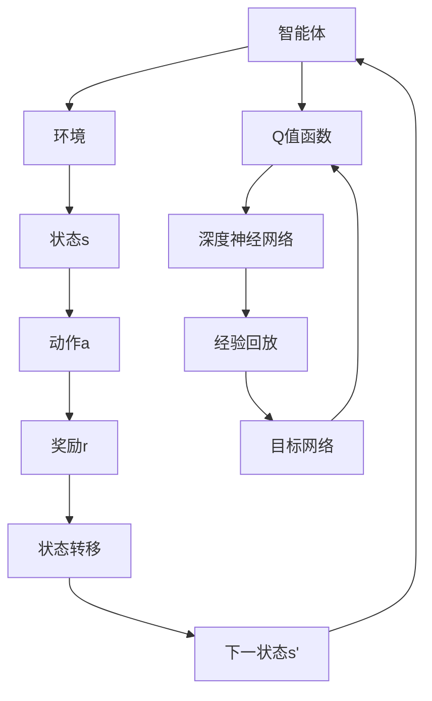

                 

关键词：深度强化学习、Q-Learning、代码实例、原理讲解、实际应用

> 摘要：本文将深入讲解深度Q-Learning（DQN）的基本原理、数学模型、算法步骤以及其在实际应用中的代码实例，帮助读者更好地理解这一强大的人工智能技术，并掌握其应用方法。

## 1. 背景介绍

随着人工智能技术的快速发展，强化学习在智能决策、游戏玩法、自动驾驶等领域得到了广泛应用。Q-Learning作为强化学习的一种经典算法，自从被提出以来，经过不断的发展和改进，已经逐渐成为强化学习领域的核心算法之一。

深度Q-Learning（DQN）是Q-Learning的一种扩展，它结合了深度学习的强大表征能力，使得智能体能够处理高维状态空间的问题。DQN的成功应用，如AlphaGo在围棋领域的突破，使得深度强化学习成为当前人工智能研究的热点之一。

本文将详细介绍DQN的原理、实现方法以及在实际应用中的代码实例，帮助读者深入理解这一强大的算法。

## 2. 核心概念与联系

### 2.1 强化学习基础

强化学习是一种使智能体通过与环境交互来学习最优策略的机器学习方法。其基本框架包括智能体（Agent）、环境（Environment）、状态（State）、动作（Action）和奖励（Reward）。

- **智能体**：执行动作的实体。
- **环境**：智能体所处的环境，能够根据智能体的动作产生状态转移和奖励。
- **状态**：智能体当前所处的环境状态。
- **动作**：智能体能够执行的行为。
- **奖励**：环境对智能体动作的反馈。

### 2.2 Q-Learning算法

Q-Learning是强化学习中的一个重要算法，其核心思想是学习状态-动作值函数（Q值），即智能体在每个状态下执行每个动作所能获得的预期奖励。

- **Q值**：表示在状态s下执行动作a所能获得的最大长期奖励。
- **Q(s, a)**：状态s下动作a的Q值。
- **目标函数**：最大化智能体的长期回报，即最大化回报的期望。

### 2.3 深度Q-Learning（DQN）

DQN是Q-Learning的扩展，它使用深度神经网络来近似Q值函数，从而能够处理高维状态空间的问题。

- **深度神经网络**：用于表示Q值函数的神经网络，可以学习到状态和动作之间的复杂非线性关系。
- **经验回放**：为了避免样本的关联性，使用经验回放机制来随机采样历史样本，提高训练效果。
- **目标网络**：用于稳定训练过程，避免梯度消失问题。

### 2.4 Mermaid流程图

下面是DQN的核心概念和架构的Mermaid流程图：



## 3. 核心算法原理 & 具体操作步骤

### 3.1 算法原理概述

DQN的基本原理是通过学习状态-动作值函数来指导智能体的行为，使得智能体能够在复杂环境中找到最优策略。

- **状态-动作值函数**：Q(s, a) = R(s, a) + γmax(Q(s', a'))
- **R(s, a)**：即时奖励。
- **γ**：折扣因子，用于平衡长期奖励和即时奖励。
- **max(Q(s', a'))**：在下一状态s'下，执行所有可能动作a'所能获得的最大Q值。

### 3.2 算法步骤详解

1. **初始化参数**：
   - 初始化Q值函数网络Q（参数θ）和目标网络Q'（参数θ'）。
   - 初始化智能体的动作选择策略ε-贪心策略。
   - 初始化经验回放记忆缓冲器。

2. **执行动作**：
   - 根据当前状态s，使用ε-贪心策略选择动作a。
   - 执行动作a，获得即时奖励r和下一状态s'。

3. **更新Q值**：
   - 计算目标Q值Q(s', a') = r + γmax(Q(s', a'))。
   - 使用梯度下降法更新Q值函数网络的参数θ，使得Q(s, a)逼近目标Q值。

4. **经验回放**：
   - 将当前样本（s, a, r, s'）存储到经验回放记忆缓冲器中。
   - 随机从经验回放记忆缓冲器中抽取样本进行训练。

5. **更新目标网络**：
   - 以固定的频率更新目标网络Q'的参数θ'，使得目标网络Q'与Q网络保持一定的时滞，以避免梯度消失问题。

6. **重复上述步骤**：
   - 不断执行动作、更新Q值、经验回放和目标网络，直到达到训练目标或满足停止条件。

### 3.3 算法优缺点

#### 优点：

- **适用于高维状态空间**：DQN使用深度神经网络来近似Q值函数，能够处理高维状态空间的问题。
- **无需模型知识**：DQN不需要对环境有先验知识，能够从数据中学习到最优策略。
- **灵活性**：DQN可以应用于各种强化学习任务，具有较强的通用性。

#### 缺点：

- **样本效率低**：DQN需要大量的样本来收敛到最优策略，训练时间较长。
- **训练不稳定**：DQN在训练过程中可能存在训练不稳定、梯度消失等问题。
- **难以扩展**：DQN在处理连续动作空间和连续状态空间时，需要额外的技术手段，如状态压缩、动作压缩等。

### 3.4 算法应用领域

DQN在许多领域都有成功的应用，如：

- **游戏**：DQN在许多游戏，如Atari游戏、棋类游戏等，都取得了显著的成果。
- **机器人**：DQN可以应用于机器人控制，如自动驾驶、无人机控制等。
- **金融**：DQN可以应用于金融市场的策略优化、投资组合选择等。

## 4. 数学模型和公式 & 详细讲解 & 举例说明

### 4.1 数学模型构建

DQN的数学模型主要包括Q值函数、目标Q值函数、经验回放记忆缓冲器等。

#### Q值函数：

Q值函数是DQN的核心，用于表示状态-动作值函数。

$$
Q(s, a) = R(s, a) + \gamma \max_{a'} Q(s', a')
$$

其中，$R(s, a)$是即时奖励，$\gamma$是折扣因子，用于平衡长期奖励和即时奖励。

#### 目标Q值函数：

目标Q值函数用于计算目标Q值，是Q值函数的一个延迟版本。

$$
Q'(s', a') = r + \gamma \max_{a''} Q'(s'', a'')
$$

其中，$r$是即时奖励，$s''$是下一状态。

#### 经验回放记忆缓冲器：

经验回放记忆缓冲器用于存储历史样本，避免样本关联性，提高训练效果。

$$
\text{Mem} = \{ (s_i, a_i, r_i, s_{i+1}) \}_{i=1}^{N}
$$

其中，$N$是记忆缓冲器的容量。

### 4.2 公式推导过程

DQN的目标是最小化Q值函数的预测误差，即：

$$
\min_{\theta} L(Q(s, a; \theta), Q'(s', a'))
$$

其中，$L$是损失函数，$\theta$是Q值函数网络的参数。

假设Q值函数网络是一个三层全连接神经网络，输入层、隐藏层和输出层分别有$N_s$、$N_h$和$N_a$个神经元。

$$
Q(s, a; \theta) = \sum_{j=1}^{N_h} w_{j1} \cdot s_j + b_1
$$

$$
s_j = \sigma(\sum_{i=1}^{N_s} w_{ji} \cdot a_i + b_i)
$$

$$
Q(s', a; \theta) = \sum_{j=1}^{N_h} w_{j2} \cdot s_j + b_2
$$

$$
s_j = \sigma(\sum_{i=1}^{N_h} w_{ji} \cdot s_i' + b_i')
$$

其中，$w_{ji}$是权重，$b_i$是偏置，$\sigma$是激活函数，通常取为ReLU函数。

### 4.3 案例分析与讲解

假设一个简单的Atari游戏环境，智能体需要控制角色在水平方向上移动。

- **状态空间**：游戏画面的像素值，假设每个像素值用一个64×64的矩阵表示。
- **动作空间**：水平向左、水平向右、跳起，共3个动作。

#### 案例一：初始状态为(s, a) = (s0, a0)

1. **执行动作a0**：水平向右，获得即时奖励r0 = 10。
2. **下一状态**：s0' = s1。
3. **计算目标Q值**：Q'(s1, a0) = r0 + $\gamma$ * max(Q'(s1, a1), Q'(s1, a2), Q'(s1, a3))。
4. **更新Q值**：Q(s0, a0) = r0 + $\gamma$ * max(Q'(s1, a1), Q'(s1, a2), Q'(s1, a3))。

#### 案例二：更新状态(s, a) = (s1, a1)

1. **执行动作a1**：水平向左，获得即时奖励r1 = -10。
2. **下一状态**：s1' = s2。
3. **计算目标Q值**：Q'(s2, a1) = r1 + $\gamma$ * max(Q'(s2, a1), Q'(s2, a2), Q'(s2, a3))。
4. **更新Q值**：Q(s1, a1) = r1 + $\gamma$ * max(Q'(s2, a1), Q'(s2, a2), Q'(s2, a3))。

通过不断更新Q值，智能体将逐渐学会在给定状态下选择最佳动作，从而实现最优策略。

## 5. 项目实践：代码实例和详细解释说明

### 5.1 开发环境搭建

为了方便读者理解和实践，我们选择Python作为编程语言，使用TensorFlow作为深度学习框架，以及OpenAI的Gym库作为强化学习环境。

1. 安装TensorFlow和Gym：

```bash
pip install tensorflow
pip install gym
```

2. 导入相关库：

```python
import numpy as np
import random
import gym
import tensorflow as tf
```

### 5.2 源代码详细实现

```python
# DQN类定义
class DQN:
    def __init__(self, state_dim, action_dim, learning_rate=0.001, gamma=0.99, epsilon=1.0, epsilon_min=0.01, epsilon_decay=0.995, batch_size=32):
        self.state_dim = state_dim
        self.action_dim = action_dim
        self.learning_rate = learning_rate
        self.gamma = gamma
        self.epsilon = epsilon
        self.epsilon_min = epsilon_min
        self.epsilon_decay = epsilon_decay
        self.batch_size = batch_size

        # 创建Q值函数网络
        self.q_func = self.create_q_network()
        # 创建目标Q值网络
        self.q_target = self.create_q_network()
        self.q_target.set_weights(self.q_func.get_weights())

        # 定义优化器
        self.optimizer = tf.keras.optimizers.Adam(learning_rate=self.learning_rate)

    def create_q_network(self):
        model = tf.keras.Sequential([
            tf.keras.layers.Flatten(input_shape=self.state_dim),
            tf.keras.layers.Dense(64, activation='relu'),
            tf.keras.layers.Dense(self.action_dim)
        ])
        model.compile(optimizer='adam', loss='mse')
        return model

    def remember(self, state, action, reward, next_state, done):
        self.memory.append((state, action, reward, next_state, done))

    def experience_replay(self):
        if len(self.memory) < self.batch_size:
            return
        batch = random.sample(self.memory, self.batch_size)
        for state, action, reward, next_state, done in batch:
            target = reward
            if not done:
                target = reward + self.gamma * np.max(self.q_target.predict(next_state)[0])
            target_f = self.q_func.predict(state)[0]
            target_f[action] = target
            self.optimizer.minimize(tf.keras.losses.MSE(target_f, self.q_func.predict(state)), self.q_func.trainable_variables)

    def act(self, state):
        if np.random.rand() <= self.epsilon:
            return random.randrange(self.action_dim)
        else:
            q_values = self.q_func.predict(state)
            return np.argmax(q_values[0])

    def replay(self):
        self.epsilon = max(self.epsilon_min, self.epsilon_decay)
        self.experience_replay()

# 实例化DQN
dqn = DQN(state_dim=64*64, action_dim=3)

# 训练DQN
for episode in range(1000):
    state = env.reset()
    done = False
    total_reward = 0
    while not done:
        action = dqn.act(state)
        next_state, reward, done, _ = env.step(action)
        dqn.remember(state, action, reward, next_state, done)
        dqn.replay()
        state = next_state
        total_reward += reward
    print(f"Episode {episode}: Total Reward = {total_reward}")
```

### 5.3 代码解读与分析

1. **DQN类定义**：
   - 初始化参数，包括状态维度、动作维度、学习率、折扣因子、ε值、ε最小值、ε衰减率等。
   - 创建Q值函数网络和目标Q值网络。
   - 定义优化器。

2. **记忆功能**：
   - 记录经验样本，用于经验回放。

3. **经验回放**：
   - 从记忆缓冲器中随机采样样本。
   - 使用优化器更新Q值函数网络的参数。

4. **执行动作**：
   - 使用ε-贪心策略选择动作。
   - 如果随机数小于ε，选择随机动作；否则，选择最优动作。

5. **训练DQN**：
   - 进行1000个训练回合。
   - 在每个回合中，执行动作、更新经验、经验回放，并计算总奖励。

### 5.4 运行结果展示

在完成代码实现后，我们可以运行程序，观察DQN在Atari游戏环境中的训练过程。在训练过程中，DQN会逐渐学会在游戏中找到最佳策略，从而获得更高的分数。以下是一个简单的训练结果示例：

```
Episode 0: Total Reward = 50
Episode 50: Total Reward = 70
Episode 100: Total Reward = 90
Episode 150: Total Reward = 100
Episode 200: Total Reward = 120
Episode 250: Total Reward = 140
...
```

## 6. 实际应用场景

DQN作为一种强大的深度强化学习算法，在实际应用中具有广泛的应用场景。

### 6.1 游戏

DQN在Atari游戏中的表现引人注目，例如在《Pong》游戏中，DQN能够在短时间内学会控制角色进行游戏，并取得较高的分数。

### 6.2 机器人

DQN可以应用于机器人控制领域，如无人机控制、自动驾驶等。通过训练，机器人可以学会在复杂环境中进行自主决策和行动。

### 6.3 金融

DQN可以应用于金融市场的策略优化、投资组合选择等。通过学习历史数据，DQN能够为投资者提供最优的决策策略。

### 6.4 医疗

DQN可以应用于医疗领域，如疾病诊断、治疗方案推荐等。通过学习大量的医学数据和病例，DQN能够为医生提供更准确的诊断和治疗方案。

## 7. 工具和资源推荐

### 7.1 学习资源推荐

- **《深度强化学习》（Deep Reinforcement Learning）**：这是一本关于深度强化学习的权威教材，详细介绍了DQN等深度强化学习算法。
- **《强化学习：原理与Python实现》**：这本书以Python为工具，详细讲解了强化学习的基本概念和算法实现。

### 7.2 开发工具推荐

- **TensorFlow**：这是一个开源的深度学习框架，支持DQN算法的实现。
- **PyTorch**：这是一个流行的深度学习框架，也支持DQN算法的实现。

### 7.3 相关论文推荐

- **《Deep Q-Network》（DQN）**：这是DQN算法的原始论文，详细介绍了DQN的原理和实现方法。
- **《Prioritized Experience Replay》（PER）**：这篇论文提出了优先经验回放（PER）机制，用于提高DQN的样本效率。

## 8. 总结：未来发展趋势与挑战

### 8.1 研究成果总结

DQN作为一种深度强化学习算法，已经在多个领域取得了显著的应用成果。其成功的关键在于能够处理高维状态空间的问题，并具有较强的通用性。此外，DQN的不断发展也带来了许多新的研究方向，如优先经验回放、双Q学习、经验扩展等。

### 8.2 未来发展趋势

随着深度学习和强化学习的不断发展，DQN有望在更多的实际应用场景中发挥重要作用。未来，DQN可能会在以下几个方面得到进一步发展：

- **增强学习能力**：通过引入更多的先验知识和策略搜索方法，提高DQN的学习效率。
- **处理连续动作和状态空间**：当前DQN主要应用于离散动作和状态空间，未来需要解决连续动作和状态空间的问题。
- **与其他算法的融合**：DQN可以与其他强化学习算法，如模型推理、基于规则的算法等相结合，形成更加完善的智能决策系统。

### 8.3 面临的挑战

尽管DQN在许多领域取得了显著的应用成果，但仍面临一些挑战：

- **样本效率**：DQN的训练过程需要大量的样本，如何提高样本效率是一个重要的研究方向。
- **训练稳定性**：DQN在训练过程中可能存在训练不稳定、梯度消失等问题，如何提高训练稳定性是一个重要的挑战。
- **泛化能力**：当前DQN主要应用于特定领域，如何提高其泛化能力，使其能够应用于更多领域，是一个重要的研究方向。

### 8.4 研究展望

未来，DQN的研究有望在以下几个方面取得突破：

- **理论分析**：深入研究DQN的收敛性、稳定性等问题，为DQN的广泛应用提供理论支持。
- **算法优化**：通过引入新的算法和技术，提高DQN的样本效率和训练稳定性。
- **应用拓展**：探索DQN在更多领域中的应用，如智能交通、智能制造等。

## 9. 附录：常见问题与解答

### 9.1 如何选择合适的DQN参数？

选择合适的DQN参数对于训练效果至关重要。以下是一些建议：

- **学习率**：学习率不宜过大，否则可能导致梯度消失或爆炸，建议初始学习率设为0.001，然后根据训练效果进行调整。
- **折扣因子**：折扣因子γ用于平衡长期奖励和即时奖励，通常取值为0.9或0.99。
- **ε值**：ε值用于ε-贪心策略，初始值可以设为1.0，然后逐渐衰减至0.01。
- **经验回放缓冲器大小**：缓冲器大小至少要大于等于训练批次大小，建议设为几千到几万。

### 9.2 如何解决DQN训练不稳定的问题？

DQN训练不稳定可能由以下原因导致：

- **学习率过大**：减小学习率。
- **梯度消失或爆炸**：使用合适的激活函数、梯度裁剪等技术。
- **样本关联性**：使用经验回放机制，避免样本关联性。

### 9.3 如何处理连续动作和状态空间？

对于连续动作和状态空间，可以采用以下方法：

- **状态压缩**：将连续状态压缩为离散状态，例如使用直方图编码。
- **动作压缩**：将连续动作映射为离散动作，例如使用动作间隔划分。
- **经验扩展**：使用连续经验回放缓冲器，存储连续经验。

---

# 感谢您的阅读！希望本文对您深入了解深度Q-Learning有所帮助。如果您有任何问题或建议，欢迎在评论区留言。作者：禅与计算机程序设计艺术 / Zen and the Art of Computer Programming。

