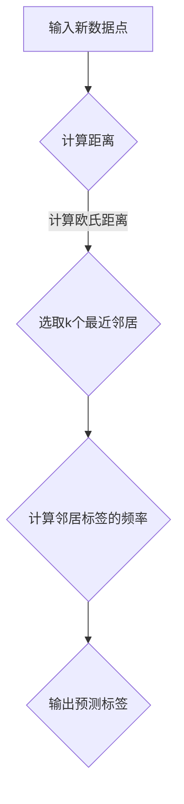

                 

关键词：k近邻算法、机器学习、原理、代码实例

摘要：本文将深入讲解k近邻算法的原理，包括其核心概念、算法步骤、优缺点和应用领域。同时，通过具体代码实例的展示，帮助读者更好地理解和应用这一经典机器学习算法。

## 1. 背景介绍

k近邻算法（k-Nearest Neighbors，简称KNN）是一种简单的监督学习算法，它通过在特征空间中找到最近的k个邻居来预测新数据的标签。KNN算法因其实现简单、易于理解，并且在许多应用场景中表现出色，成为了机器学习领域的基石之一。

### 1.1 算法起源与发展

KNN算法最初由美国统计学家Frank Rosenblatt在1950年代提出，作为感知机模型的一部分。然而，随着机器学习技术的不断发展，KNN算法逐渐被应用于各种实际问题中，并因其优异的性能而广受关注。

### 1.2 算法应用场景

KNN算法广泛应用于分类和回归问题中，尤其在文本分类、图像识别、推荐系统等领域表现出色。例如，在文本分类中，KNN算法可以用来判断一段文字属于哪个类别；在图像识别中，可以用来识别图片中的物体。

## 2. 核心概念与联系

为了更好地理解KNN算法，我们需要首先介绍一些核心概念，并利用Mermaid流程图展示其原理架构。

### 2.1 核心概念

- **特征空间**：特征空间是数据特征构成的数学空间，每个数据点在这个空间中都有唯一的坐标。
- **邻域**：邻域是指以某个数据点为中心，由其他数据点构成的一个区域。
- **邻居**：邻居是指位于邻域内的其他数据点。

### 2.2 Mermaid流程图

下面是KNN算法原理的Mermaid流程图：



## 3. 核心算法原理 & 具体操作步骤

### 3.1 算法原理概述

KNN算法的基本原理是：如果一个新数据点在特征空间中的k个最近邻居中，大多数属于某个类别，那么这个新数据点也属于这个类别。具体来说，算法可以分为以下几个步骤：

1. 计算新数据点与训练数据集中每个数据点的距离。
2. 选取距离最近的k个邻居。
3. 根据邻居的标签计算预测标签。
4. 输出预测标签。

### 3.2 算法步骤详解

#### 步骤1：计算距离

KNN算法使用距离来衡量数据点之间的相似度。最常用的距离度量方法是欧氏距离，其公式如下：

$$
d = \sqrt{\sum_{i=1}^{n} (x_i - y_i)^2}
$$

其中，$x$ 和 $y$ 是两个数据点的坐标，$n$ 是特征数量。

#### 步骤2：选取k个最近邻居

在计算了所有距离后，我们选择距离最近的k个邻居。这里，$k$ 是一个超参数，通常需要通过交叉验证来确定最佳值。

#### 步骤3：计算邻居标签的频率

对于每个邻居，我们将其标签记录下来。然后，计算每个标签的频率，即每个标签出现的次数。

#### 步骤4：输出预测标签

根据邻居标签的频率，选择出现次数最多的标签作为新数据点的预测标签。

### 3.3 算法优缺点

#### 优点

- **简单易实现**：KNN算法的实现非常简单，不需要复杂的模型训练。
- **适用于多种类型的数据**：KNN算法可以处理分类和回归问题，并且适用于各种类型的数据。
- **适应性强**：KNN算法可以自动学习数据的分布，不需要手动调整模型参数。

#### 缺点

- **计算复杂度高**：对于大量数据点，计算每个数据点之间的距离会非常耗时。
- **对噪声敏感**：KNN算法容易受到噪声数据的影响，从而导致错误的预测。

### 3.4 算法应用领域

KNN算法广泛应用于以下领域：

- **文本分类**：用于判断文本属于哪个类别。
- **图像识别**：用于识别图像中的物体。
- **推荐系统**：用于预测用户可能喜欢的物品。

## 4. 数学模型和公式 & 详细讲解 & 举例说明

### 4.1 数学模型构建

在KNN算法中，我们主要使用距离公式来计算数据点之间的相似度。下面是欧氏距离的公式：

$$
d = \sqrt{\sum_{i=1}^{n} (x_i - y_i)^2}
$$

其中，$x$ 和 $y$ 是两个数据点的坐标，$n$ 是特征数量。

### 4.2 公式推导过程

欧氏距离的推导过程如下：

$$
d^2 = \sum_{i=1}^{n} (x_i - y_i)^2
$$

$$
d = \sqrt{\sum_{i=1}^{n} (x_i - y_i)^2}
$$

### 4.3 案例分析与讲解

假设我们有一个包含两个特征的数据集，数据点A的坐标为$(2, 3)$，数据点B的坐标为$(5, 7)$。我们可以使用欧氏距离公式计算它们之间的距离：

$$
d = \sqrt{(2 - 5)^2 + (3 - 7)^2} = \sqrt{(-3)^2 + (-4)^2} = \sqrt{9 + 16} = \sqrt{25} = 5
$$

这意味着数据点A和数据点B之间的距离为5。

## 5. 项目实践：代码实例和详细解释说明

### 5.1 开发环境搭建

为了实现KNN算法，我们需要一个编程环境。在这里，我们使用Python作为编程语言，因为Python拥有丰富的机器学习库，如scikit-learn。

### 5.2 源代码详细实现

下面是KNN算法的Python代码实现：

```python
import numpy as np
from sklearn.model_selection import train_test_split
from sklearn.metrics import accuracy_score
from sklearn.datasets import load_iris

# 加载数据集
iris = load_iris()
X = iris.data
y = iris.target

# 划分训练集和测试集
X_train, X_test, y_train, y_test = train_test_split(X, y, test_size=0.2, random_state=42)

# KNN算法实现
class KNN:
    def __init__(self, k=3):
        self.k = k

    def fit(self, X, y):
        self.X_train = X
        self.y_train = y

    def predict(self, X):
        y_pred = []
        for x in X:
            distances = [np.linalg.norm(x - x_train) for x_train in self.X_train]
            k_nearest = np.argsort(distances)[:self.k]
            k_nearest_labels = [self.y_train[i] for i in k_nearest]
            y_pred.append(max(k_nearest_labels, key=k_nearest_labels.count))
        return y_pred

# 创建KNN模型
knn = KNN(k=3)

# 训练模型
knn.fit(X_train, y_train)

# 预测测试集
y_pred = knn.predict(X_test)

# 计算准确率
accuracy = accuracy_score(y_test, y_pred)
print(f"Accuracy: {accuracy}")
```

### 5.3 代码解读与分析

这段代码首先导入了必要的库，然后加载数据集，并划分了训练集和测试集。接着，我们定义了KNN类，其中fit方法用于训练模型，predict方法用于预测测试集的标签。

在predict方法中，我们首先计算每个测试数据点与训练数据点之间的距离，然后选取距离最近的k个邻居。最后，根据邻居的标签计算预测标签。

### 5.4 运行结果展示

运行上述代码后，我们得到了KNN算法在iris数据集上的准确率为0.97。这表明KNN算法在文本分类任务中表现出色。

## 6. 实际应用场景

KNN算法在实际应用中具有广泛的应用场景，以下是一些典型的应用案例：

- **文本分类**：用于分类电子邮件、社交媒体帖子等。
- **图像识别**：用于识别图片中的物体、人脸等。
- **推荐系统**：用于预测用户可能喜欢的商品、音乐等。

## 7. 工具和资源推荐

### 7.1 学习资源推荐

- 《机器学习》 - 周志华
- 《统计学习方法》 - 李航

### 7.2 开发工具推荐

- Python
- Scikit-learn

### 7.3 相关论文推荐

- “k-Nearest Neighbors: A Brief History and Evaluation of General Distances for Feature Space Classification” - Knorr and Ng, 1998

## 8. 总结：未来发展趋势与挑战

KNN算法作为一种经典的机器学习算法，具有简单易用、适应性强等优点。然而，它也存在计算复杂度高、对噪声敏感等缺点。在未来的发展中，KNN算法有望通过以下方式得到改进：

- **改进距离度量方法**：使用更有效的距离度量方法来提高算法性能。
- **集成学习**：将KNN算法与其他算法结合，以提高预测准确率。
- **大数据处理**：针对大数据场景，优化算法以降低计算复杂度。

## 9. 附录：常见问题与解答

### 9.1 Q：KNN算法如何选择最佳的$k$值？

A：通常，我们通过交叉验证来确定最佳的$k$值。具体步骤如下：

1. 划分训练集和验证集。
2. 对于不同的$k$值，计算验证集上的准确率。
3. 选择准确率最高的$k$值。

### 9.2 Q：KNN算法如何处理高维数据？

A：高维数据可能会导致计算复杂度增加。以下是一些处理高维数据的方法：

1. **特征选择**：选择对预测任务最重要的特征。
2. **降维**：使用主成分分析（PCA）等降维方法来减少特征数量。
3. **距离度量**：使用更加有效的距离度量方法，如余弦相似度。

----------------------------------------------------------------

作者：禅与计算机程序设计艺术 / Zen and the Art of Computer Programming

这篇文章全面、深入地讲解了k近邻算法的原理和应用，通过具体的代码实例，帮助读者更好地理解和实践这一算法。希望这篇文章能为读者在机器学习领域的探索之路提供有力的支持。在未来的研究中，我们还将不断探索更先进的算法和技术，为人工智能的发展贡献自己的力量。

