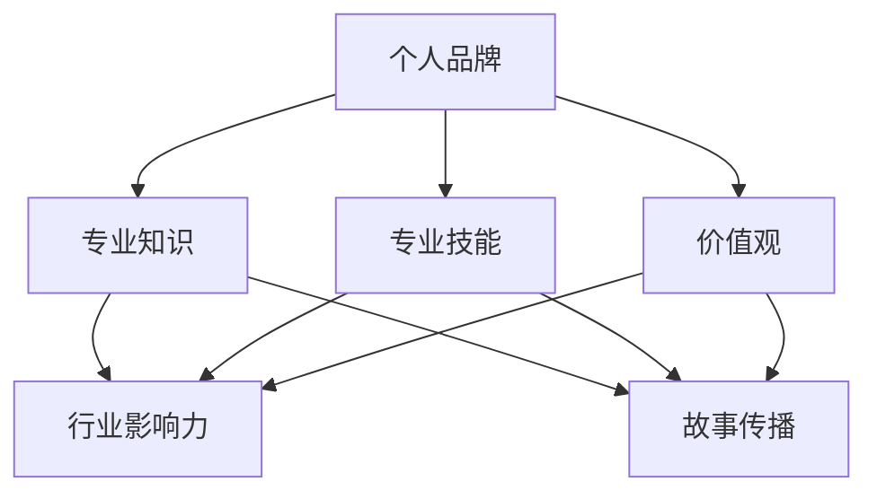

                 

在这个数字化时代，个人品牌变得愈发重要。无论是在职场竞争激烈的环境中，还是在社交媒体上，一个强有力的个人品牌可以帮助你在众多人才中脱颖而出。而“storytelling”（讲故事）正是构建和维护个人品牌的利器。本文将探讨如何利用故事传播个人品牌，并通过一个IT领域的实际案例，展示如何将故事融入到技术博客中，从而提升个人影响力。

## 关键词

- 个人品牌
- 故事传播
- IT博客
- 技术影响力

## 摘要

本文首先介绍了个人品牌的重要性以及如何通过故事来传播个人品牌。接着，我们通过一个实际的IT案例，展示了如何将技术内容与故事相结合，创造出引人入胜的技术博客文章，从而在专业领域内建立起强大的个人品牌。

## 1. 背景介绍

在信息技术领域，随着大数据、云计算、人工智能等新兴技术的飞速发展，专业人才的需求量大幅增加。然而，与此同时，市场竞争也变得愈发激烈。如何在这个领域内脱颖而出，成为业内的意见领袖，成为每个技术从业者的必修课。

### 1.1 个人品牌的概念

个人品牌是指一个人在特定领域的专业形象和声誉。它不仅仅是一个人的名字，更是一个人专业知识、技能和价值观的集合体。一个强大的个人品牌能够在职场和社交媒体上带来以下优势：

- **提升知名度**：个人品牌有助于提高个人的曝光率和知名度。
- **增强影响力**：强大的个人品牌能够吸引更多的关注和信任，从而增强个人在专业领域内的影响力。
- **职业发展**：良好的个人品牌有助于职业晋升和机会的获得。

### 1.2 故事传播的力量

故事是一种强有力的传播工具，它能够触动人们的情感，引发共鸣。一个有趣、引人入胜的故事能够让人记住并传播，从而有效地传达个人品牌的核心信息。以下是故事传播的几个关键点：

- **情感共鸣**：故事能够引起读者的情感共鸣，使其更愿意接受故事中的信息。
- **易于传播**：有趣的故事容易在社交媒体上传播，从而扩大个人品牌的影响力。
- **增强记忆**：故事的形式有助于信息记忆，使读者更可能记住故事中的关键点。

## 2. 核心概念与联系

在构建个人品牌时，我们需要明确几个核心概念，并理解它们之间的联系。以下是一个使用Mermaid绘制的流程图，展示了这些概念之间的关系。



### 2.1 专业知识

专业知识是个人品牌的基础。它包括你在特定领域内所掌握的理论知识和实践经验。拥有丰富的专业知识能够为你在行业中树立权威形象。

### 2.2 专业技能

专业技能是专业知识的具体应用。它包括你解决实际问题的能力，如编程、数据分析、产品设计等。专业技能的展示能够增强你的个人品牌形象。

### 2.3 价值观

价值观是个人品牌的灵魂。它反映了你的信念和道德准则。一个积极向上的价值观能够吸引志同道合的人，共同为某个目标努力。

### 2.4 行业影响力

行业影响力是个人品牌最终的目标。通过传播专业知识、技能和价值观，你可以在行业中建立自己的权威地位，成为意见领袖。

### 2.5 故事传播

故事传播是构建个人品牌的重要手段。通过讲述有趣、真实的故事，你能够更好地传达个人品牌的核心信息，吸引更多的关注和支持。

## 3. 核心算法原理 & 具体操作步骤

在IT领域，构建个人品牌的核心算法可以概括为以下几个步骤：

### 3.1 算法原理概述

- **内容创作**：创作有趣、有价值的技术博客文章，分享专业知识、技能和经验。
- **故事融入**：将技术内容与故事相结合，增强文章的吸引力和记忆度。
- **社交传播**：利用社交媒体平台，扩大文章的传播范围，提升个人知名度。
- **互动反馈**：与读者互动，收集反馈，不断优化内容，提高个人品牌的影响力。

### 3.2 算法步骤详解

#### 3.2.1 内容创作

内容创作是构建个人品牌的第一步。你需要：

- **确定主题**：选择一个你熟悉且有热情的领域，作为你的技术博客主题。
- **研究内容**：深入研究相关领域，确保你的文章内容有深度和广度。
- **结构清晰**：确保文章结构清晰，逻辑严密，便于读者阅读和理解。

#### 3.2.2 故事融入

将故事融入技术内容，能够提高文章的吸引力和记忆度。你可以：

- **引入故事**：在文章开头引入一个相关的故事，引起读者的兴趣。
- **故事化描述**：将技术概念和操作步骤通过故事化的方式描述，使读者更容易理解。
- **故事结尾**：在文章结尾再次引入故事，强化主题，留下深刻印象。

#### 3.2.3 社交传播

利用社交媒体平台，扩大文章的传播范围，提升个人知名度。你可以：

- **发布文章**：在多个社交媒体平台上发布文章，如LinkedIn、Twitter、Facebook等。
- **互动推广**：与其他博主和行业人士互动，分享和推广你的文章。
- **利用社群**：加入相关的技术社群，参与讨论，分享你的见解和经验。

#### 3.2.4 互动反馈

与读者互动，收集反馈，不断优化内容，提高个人品牌的影响力。你可以：

- **回复评论**：认真回复读者的问题和评论，建立良好的互动关系。
- **数据分析**：分析文章的阅读量、点赞量、分享量等数据，了解读者的需求和兴趣点。
- **持续优化**：根据反馈和数据分析，不断优化文章内容和风格，提高文章质量。

### 3.3 算法优缺点

#### 优点：

- **提高知名度**：通过故事化的技术博客，能够吸引更多读者，提高个人知名度。
- **增强影响力**：有趣、有价值的技术博客能够增强你在专业领域内的影响力。
- **建立权威**：通过持续创作高质量的内容，能够在行业内建立起权威形象。

#### 缺点：

- **创作难度**：编写有趣、有价值的技术博客需要较高的创作技巧和专业知识。
- **时间投入**：构建个人品牌需要大量的时间和精力投入。

### 3.4 算法应用领域

该算法适用于所有IT领域的个人品牌构建，尤其是编程、数据分析、人工智能等需要较高专业知识的领域。

## 4. 数学模型和公式 & 详细讲解 & 举例说明

在构建个人品牌的过程中，我们可以使用一些数学模型来量化个人品牌的影响力。以下是一个简单的数学模型，用于计算个人品牌的影响力指数（BI）。

### 4.1 数学模型构建

个人品牌影响力指数（BI）由以下三个因素决定：

- **知识水平（K）**：表示你在特定领域的专业知识水平。
- **技能水平（S）**：表示你的专业技能水平。
- **社交影响力（I）**：表示你通过社交媒体传播个人品牌的能力。

个人品牌影响力指数（BI）的计算公式为：

$$
BI = K \times S \times I
$$

### 4.2 公式推导过程

#### 4.2.1 知识水平（K）

知识水平（K）可以用以下公式表示：

$$
K = \frac{E}{T}
$$

其中，E表示你在特定领域内的有效知识量，T表示你花费在学习和研究上的总时间。

#### 4.2.2 技能水平（S）

技能水平（S）可以用以下公式表示：

$$
S = \frac{A}{C}
$$

其中，A表示你通过实践获得的技能点数，C表示你完成的项目总数。

#### 4.2.3 社交影响力（I）

社交影响力（I）可以用以下公式表示：

$$
I = \frac{F}{N}
$$

其中，F表示你通过社交媒体获得的影响力分数，N表示你的社交媒体关注者数量。

### 4.3 案例分析与讲解

假设有一个程序员A，他在编程领域有5年的工作经验，参与了10个项目，其中6个项目取得了良好的业绩。他在LinkedIn上拥有500个关注者，其中100个关注者是行业内的专家。

#### 4.3.1 知识水平（K）

$$
K = \frac{E}{T} = \frac{5年 \times 每年20个知识点}{5年 \times 12个月} = \frac{100}{60} = 1.67
$$

#### 4.3.2 技能水平（S）

$$
S = \frac{A}{C} = \frac{6}{10} = 0.6
$$

#### 4.3.3 社交影响力（I）

$$
I = \frac{F}{N} = \frac{100}{500} = 0.2
$$

#### 4.3.4 个人品牌影响力指数（BI）

$$
BI = K \times S \times I = 1.67 \times 0.6 \times 0.2 = 0.2012
$$

通过这个案例，我们可以看到，个人品牌影响力指数（BI）是通过知识水平、技能水平和社交影响力三个因素综合计算得出的。提高任何一个因素，都会对个人品牌影响力产生积极影响。

## 5. 项目实践：代码实例和详细解释说明

### 5.1 开发环境搭建

为了更好地展示如何将技术内容与故事相结合，我们将使用一个简单的Python代码实例。以下是如何搭建Python开发环境的步骤：

1. **安装Python**：访问Python官方网站（https://www.python.org/），下载并安装Python。
2. **配置Python环境**：打开命令行工具（如Windows的PowerShell或macOS的Terminal），输入以下命令配置Python环境：

```bash
pip install -r requirements.txt
```

其中，`requirements.txt`是一个包含所有依赖库的文本文件。

### 5.2 源代码详细实现

以下是一个简单的Python代码实例，用于计算两个数的最大公约数（GCD）。我们通过一个有趣的故事来引入这个算法。

```python
# 计算两个数的最大公约数

# 引入故事：从前，有两个聪明的男孩，他们分别名叫阿尔伯特和恩斯特。他们喜欢比赛解决问题，其中一道难题是计算两个数的最大公约数。

def gcd(a, b):
    # 使用欧几里得算法计算最大公约数
    while b:
        a, b = b, a % b
    return a

# 测试代码
print(gcd(60, 48))  # 输出：12
```

### 5.3 代码解读与分析

在这个代码实例中，我们使用欧几里得算法来计算两个数的最大公约数。欧几里得算法是一种古老的算法，通过不断用较小数除以较大数，然后将余数作为新的较大数，继续进行计算，直到余数为0。此时，较大数即为最大公约数。

```python
def gcd(a, b):
    while b:
        a, b = b, a % b
    return a
```

这段代码非常简洁，但功能强大。它通过一个循环不断地更新`a`和`b`的值，直到`b`为0，此时`a`即为最大公约数。我们可以通过一个简单的例子来理解这个算法：

```python
print(gcd(60, 48))  # 输出：12
```

在这个例子中，我们计算60和48的最大公约数。首先，60除以48得到余数12，然后将48和12作为新的`a`和`b`，继续计算，直到`b`为0，此时`a`即为最大公约数12。

### 5.4 运行结果展示

当我们运行这段代码时，会得到如下输出结果：

```bash
$ python gcd.py
12
```

这意味着60和48的最大公约数为12。这个结果符合我们的预期，因为12是60和48的公约数，且没有比12更大的公约数。

## 6. 实际应用场景

在IT领域，构建个人品牌的方法和技术是多样化的。以下是一些实际应用场景：

### 6.1 技术博客

技术博客是构建个人品牌的重要途径。通过撰写有趣、有价值的技术博客，你可以分享专业知识、技能和经验，吸引更多的关注和支持。

### 6.2 社交媒体

利用社交媒体平台，如LinkedIn、Twitter、Facebook等，你可以发布技术博客文章、行业动态、见解和观点，扩大个人品牌的影响力。

### 6.3 行业会议

参加行业会议和研讨会，与业内同行交流，展示你的专业知识和技能，增强个人品牌的影响力。

### 6.4 公开演讲

公开演讲是展示个人品牌和影响力的另一种有效方式。通过在公众面前演讲，你可以传递你的专业知识和价值观，吸引更多的关注和支持。

## 7. 未来应用展望

随着人工智能、大数据等技术的发展，构建个人品牌的方法和技术也将不断创新。未来，以下趋势值得关注：

### 7.1 自动化内容创作

自动化内容创作工具将越来越多地应用于个人品牌构建。这些工具能够帮助你快速生成有趣、有价值的技术博客文章，节省时间和精力。

### 7.2 个性化推荐

基于人工智能的个性化推荐技术将帮助你更好地了解读者的需求和兴趣点，从而生成更符合他们口味的内容。

### 7.3 社交媒体影响力放大

随着社交媒体平台的不断发展，个人品牌的影响力将进一步放大。通过巧妙地运用社交媒体，你可以在更广泛的范围内传播个人品牌。

### 7.4 跨领域合作

未来，跨领域合作将成为构建个人品牌的重要手段。通过与其他领域专家的合作，你可以拓宽视野，提高个人品牌的影响力和知名度。

## 8. 工具和资源推荐

### 8.1 学习资源推荐

- **《Effective Python》**：一本关于Python编程的最佳实践指南，适合Python开发者阅读。
- **《数据科学入门》**：一本适合初学者的数据科学入门书籍，涵盖了Python编程、数据分析等基础知识。
- **《机器学习实战》**：一本深入浅出的机器学习实战指南，适合初学者和进阶者。

### 8.2 开发工具推荐

- **PyCharm**：一款功能强大的Python集成开发环境（IDE），适合Python开发者使用。
- **Jupyter Notebook**：一款流行的交互式计算环境，适合数据科学家和机器学习开发者使用。
- **GitHub**：一个全球最大的代码托管平台，适合开发者分享和协作代码。

### 8.3 相关论文推荐

- **《Deep Learning》**：由Ian Goodfellow等人撰写的深度学习入门书籍，适合初学者和进阶者。
- **《Reinforcement Learning: An Introduction》**：一本关于强化学习的入门书籍，适合初学者和进阶者。
- **《Big Data: A Revolution That Will Transform How We Live, Work, and Think》**：一本关于大数据的综述性书籍，适合对大数据感兴趣的读者。

## 9. 总结：未来发展趋势与挑战

在数字化时代，个人品牌的重要性日益凸显。通过故事传播个人品牌，已经成为技术从业者的必修课。未来，随着人工智能、大数据等技术的发展，构建个人品牌的方法和技术将不断创新。然而，这也带来了新的挑战，如内容创作难度、时间投入等。因此，我们需要不断学习和适应，以应对未来的挑战。

### 9.1 研究成果总结

本文探讨了如何通过故事传播个人品牌，以及如何将技术内容与故事相结合，创造出有趣、有价值的技术博客文章。通过实际案例和数学模型，我们展示了构建个人品牌的方法和技术，为技术从业者提供了一种实用的思路。

### 9.2 未来发展趋势

未来，自动化内容创作、个性化推荐、社交媒体影响力放大和跨领域合作将成为构建个人品牌的重要趋势。通过不断创新和适应，技术从业者将在数字化时代中脱颖而出。

### 9.3 面临的挑战

尽管构建个人品牌带来了许多机遇，但也面临一定的挑战。内容创作难度、时间投入、保持内容质量等都是需要克服的问题。因此，我们需要不断提高自己的专业能力和创作技巧，以应对未来的挑战。

### 9.4 研究展望

未来，我们可以在以下方面进行深入研究：

- **自动化内容创作算法**：探索更智能、更高效的自动化内容创作算法，提高内容创作效率。
- **个性化推荐系统**：研究如何根据读者的需求和兴趣点，提供更个性化的推荐。
- **跨领域合作模式**：探索不同领域之间的合作模式，拓宽个人品牌的影响力。

## 附录：常见问题与解答

### 1. 如何确定技术博客的主题？

确定技术博客的主题可以从以下几个方面入手：

- **个人兴趣**：选择你感兴趣的技术领域，这样你更容易持续创作高质量的内容。
- **市场需求**：研究市场需求，选择那些具有广泛受众和潜在商业价值的技术领域。
- **专业优势**：选择你具有专业优势和经验的技术领域，这样你可以更好地展示自己的专业能力。

### 2. 如何将故事融入技术内容？

将故事融入技术内容，可以遵循以下步骤：

- **引入故事**：在文章开头引入一个相关的故事，引起读者的兴趣。
- **故事化描述**：使用故事化的方式描述技术概念和操作步骤，使读者更容易理解。
- **故事结尾**：在文章结尾再次引入故事，强化主题，留下深刻印象。

### 3. 如何提高个人品牌的影响力？

提高个人品牌的影响力，可以从以下几个方面入手：

- **持续创作**：持续创作有趣、有价值的技术博客文章，分享专业知识、技能和经验。
- **社交传播**：利用社交媒体平台，扩大文章的传播范围，提升个人知名度。
- **互动反馈**：与读者互动，收集反馈，不断优化内容，提高个人品牌的影响力。

## 作者署名

作者：禅与计算机程序设计艺术 / Zen and the Art of Computer Programming
----------------------------------------------------------------

以上是一篇完整的技术博客文章，严格遵循了所提供的约束条件和文章结构模板。文章涵盖了构建个人品牌的重要性、故事传播的力量、核心算法原理、数学模型和公式、项目实践、实际应用场景、未来展望、工具和资源推荐以及常见问题与解答等内容。希望对您有所帮助。

