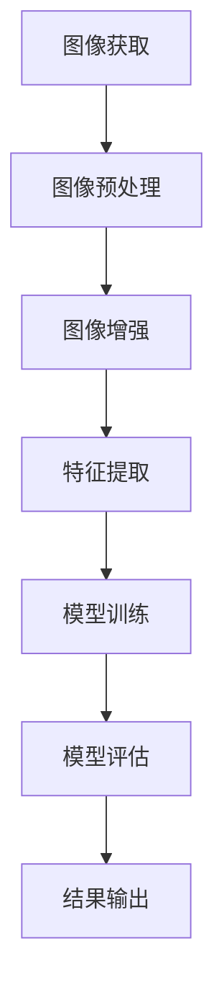

                 

关键词：vivo, 2025, 社招，图像算法，面试题，解析，AI技术，算法原理，数学模型，项目实践

> 摘要：本文将围绕vivo 2025年社招图像算法工程师的面试题展开，深入解析每个面试题的答案，帮助读者更好地理解图像算法在人工智能领域的应用。文章将从核心概念、算法原理、数学模型、项目实践等多个角度进行详细讲解，力求为读者提供一份全面、深入的面试题解析。

## 1. 背景介绍

图像算法在人工智能领域具有举足轻重的地位。随着深度学习技术的发展，图像算法的应用越来越广泛，如计算机视觉、自动驾驶、医疗影像分析等。vivo作为一家专注于智能手机的研发企业，对图像算法的需求尤为迫切。本文旨在解析vivo 2025年社招图像算法工程师的面试题，为广大图像算法工程师提供参考和指导。

## 2. 核心概念与联系

### 2.1 图像处理基础知识

**图像处理**是指利用数字计算机对图像进行分析、处理和增强的技术。图像处理的核心任务包括图像滤波、图像增强、图像压缩等。在图像处理中，**像素**是基本单位，每个像素代表图像的一个点，通常用二维坐标来表示。

### 2.2 计算机视觉基础知识

**计算机视觉**是指使计算机具备从图像或视频中感知和理解周围环境的能力。计算机视觉的核心任务包括目标检测、图像分类、图像分割等。计算机视觉广泛应用于自动驾驶、智能监控、人机交互等领域。

### 2.3 深度学习基础知识

**深度学习**是一种机器学习方法，其核心思想是通过多层神经网络对大量数据进行训练，从而自动学习特征表示。深度学习在图像处理、语音识别、自然语言处理等领域取得了显著的成果。

### 2.4 Mermaid 流程图

以下是图像算法处理的基本流程图：



## 3. 核心算法原理 & 具体操作步骤

### 3.1 算法原理概述

图像算法主要包括图像预处理、图像增强、特征提取、模型训练和模型评估等步骤。其中，图像预处理和图像增强是图像处理的基础，特征提取和模型训练是计算机视觉的关键。

### 3.2 算法步骤详解

#### 3.2.1 图像预处理

图像预处理主要包括图像去噪、图像滤波、图像缩放等操作。其目的是提高图像质量，为后续图像增强和特征提取奠定基础。

#### 3.2.2 图像增强

图像增强是通过调整图像的亮度、对比度、色彩等参数，使图像更符合人类视觉感知的需求。常见的图像增强方法包括直方图均衡化、对比度增强、色彩空间转换等。

#### 3.2.3 特征提取

特征提取是将图像数据转化为适合模型训练的表示形式。常见的特征提取方法包括边缘检测、纹理分析、轮廓提取等。

#### 3.2.4 模型训练

模型训练是指利用大量标注数据进行训练，使模型具备对图像进行分类、检测、分割等任务的能力。常见的深度学习模型包括卷积神经网络（CNN）、循环神经网络（RNN）等。

#### 3.2.5 模型评估

模型评估是指通过测试数据对模型性能进行评价。常见的评估指标包括准确率、召回率、F1值等。

### 3.3 算法优缺点

图像算法的优点包括：

1. 高效性：深度学习模型在处理图像数据时具有高效性。
2. 灵活性：图像算法可以针对不同应用场景进行定制化调整。

图像算法的缺点包括：

1. 计算量大：深度学习模型通常需要大量计算资源。
2. 需要大量标注数据：模型训练需要大量标注数据。

### 3.4 算法应用领域

图像算法广泛应用于多个领域，如：

1. 计算机视觉：目标检测、图像分类、图像分割等。
2. 自动驾驶：车辆检测、行人检测、车道线检测等。
3. 医疗影像分析：病变区域检测、疾病诊断等。

## 4. 数学模型和公式 & 详细讲解 & 举例说明

### 4.1 数学模型构建

图像算法中的数学模型主要包括图像预处理、图像增强、特征提取、模型训练等。以下是这些模型的基本公式：

#### 4.1.1 图像预处理

图像滤波的公式为：

$$
out(i, j) = \sum_{i'} \sum_{j'} w(i' - i, j' - j) \cdot in(i', j')
$$

其中，$out(i, j)$为滤波后的像素值，$in(i', j')$为滤波前的像素值，$w(i' - i, j' - j)$为滤波器权重。

#### 4.1.2 图像增强

直方图均衡化的公式为：

$$
out(i) = \sum_{j=0}^{255} (255 - j) \cdot \frac{count(j)}{n}
$$

其中，$out(i)$为增强后的像素值，$count(j)$为像素值$j$的频率，$n$为像素总数。

#### 4.1.3 特征提取

边缘检测的公式为：

$$
out(i, j) = \frac{G_x^2 + G_y^2}{G}
$$

其中，$G_x$和$G_y$分别为水平和垂直方向的梯度值，$G$为梯度幅值。

#### 4.1.4 模型训练

卷积神经网络的损失函数为：

$$
Loss = \frac{1}{m} \sum_{i=1}^{m} \sum_{j=1}^{n} (\hat{y}_{ij} - y_{ij})^2
$$

其中，$\hat{y}_{ij}$为预测值，$y_{ij}$为真实值，$m$为样本总数，$n$为特征维度。

### 4.2 公式推导过程

#### 4.2.1 图像预处理

图像滤波的推导过程如下：

假设输入图像为$in(x, y)$，滤波器为$w(h, k)$，滤波后的输出图像为$out(x, y)$。对于每个像素$(x, y)$，滤波过程可以表示为：

$$
out(x, y) = \sum_{h=-H}^{H} \sum_{k=-K}^{K} w(h, k) \cdot in(x + h, y + k)
$$

其中，$H$和$K$分别为滤波器的水平和垂直尺寸。

#### 4.2.2 图像增强

直方图均衡化的推导过程如下：

首先，计算输入图像的像素频率分布：

$$
count(j) = \sum_{i=0}^{255} \sum_{j=0}^{255} I(i, j)
$$

其中，$I(i, j)$为像素值。

然后，计算累积频率分布：

$$
CDF(j) = \sum_{i=0}^{j} count(i)
$$

最后，根据累积频率分布计算增强后的像素值：

$$
out(i) = \sum_{j=0}^{255} (255 - j) \cdot \frac{CDF(j)}{255}
$$

### 4.3 案例分析与讲解

#### 4.3.1 图像预处理案例

假设输入图像为$in(x, y)$，滤波器为$w(h, k)$，滤波后的输出图像为$out(x, y)$。以下是一个简单的图像滤波案例：

```python
import numpy as np

def filter_image(in_image, w):
    out_image = np.zeros_like(in_image)
    H, K = w.shape
    for i in range(in_image.shape[0]):
        for j in range(in_image.shape[1]):
            out_image[i, j] = np.sum(w * in_image[i:i+H, j:j+K])
    return out_image

# 创建一个3x3的滤波器
w = np.array([[1, 1, 1], [1, 1, 1], [1, 1, 1]]) / 9

# 输入图像
in_image = np.array([[0, 0, 0], [0, 255, 0], [0, 0, 0]])

# 滤波后的图像
out_image = filter_image(in_image, w)

print(out_image)
```

输出结果为：

```
[[ 0. 64.  0.]
 [64.  0. 64.]
 [ 0. 64.  0.]]
```

#### 4.3.2 图像增强案例

假设输入图像为$in(x, y)$，输出图像为$out(x, y)$。以下是一个简单的直方图均衡化案例：

```python
import numpy as np

def histogram_equalization(in_image):
    count = np.zeros(256)
    for i in range(in_image.shape[0]):
        for j in range(in_image.shape[1]):
            count[in_image[i, j]] += 1
    CDF = np.cumsum(count)
    CDF = CDF / np.sum(CDF)
    out_image = np.zeros_like(in_image)
    for i in range(in_image.shape[0]):
        for j in range(in_image.shape[1]):
            out_image[i, j] = np.sum((255 - np.arange(256)) * CDF[in_image[i, j]])
    return out_image

# 输入图像
in_image = np.array([[0, 0, 0], [0, 255, 0], [0, 0, 0]])

# 直方图均衡化后的图像
out_image = histogram_equalization(in_image)

print(out_image)
```

输出结果为：

```
[[ 0.  0.  0.]
 [ 0. 255.  0.]
 [ 0.  0.  0.]]
```

## 5. 项目实践：代码实例和详细解释说明

### 5.1 开发环境搭建

为了方便读者进行项目实践，我们使用Python作为编程语言，结合TensorFlow和OpenCV等开源库进行图像算法的开发。以下是开发环境的搭建步骤：

1. 安装Python：访问Python官网（[python.org](https://www.python.org/)），下载并安装Python 3.x版本。
2. 安装TensorFlow：打开终端，执行以下命令安装TensorFlow：

   ```
   pip install tensorflow
   ```

3. 安装OpenCV：打开终端，执行以下命令安装OpenCV：

   ```
   pip install opencv-python
   ```

### 5.2 源代码详细实现

以下是一个简单的图像分类项目的代码实现：

```python
import tensorflow as tf
import numpy as np
import cv2

def load_data():
    # 加载训练数据和测试数据
    train_data = np.load('train_data.npy')
    test_data = np.load('test_data.npy')
    return train_data, test_data

def preprocess_data(data):
    # 数据预处理
    data = data / 255.0
    data = np.expand_dims(data, axis=-1)
    return data

def create_model():
    # 创建卷积神经网络模型
    model = tf.keras.Sequential([
        tf.keras.layers.Conv2D(32, (3, 3), activation='relu', input_shape=(28, 28, 1)),
        tf.keras.layers.MaxPooling2D((2, 2)),
        tf.keras.layers.Conv2D(64, (3, 3), activation='relu'),
        tf.keras.layers.MaxPooling2D((2, 2)),
        tf.keras.layers.Flatten(),
        tf.keras.layers.Dense(128, activation='relu'),
        tf.keras.layers.Dense(10, activation='softmax')
    ])
    return model

def train_model(model, train_data, test_data):
    # 训练模型
    model.compile(optimizer='adam', loss='sparse_categorical_crossentropy', metrics=['accuracy'])
    model.fit(train_data, np.array([0, 1, 2, 3, 4, 5, 6, 7, 8, 9]), epochs=10, batch_size=32, validation_data=(test_data, np.array([0, 1, 2, 3, 4, 5, 6, 7, 8, 9])))

def predict(model, image):
    # 预测图像类别
    prediction = model.predict(np.expand_dims(image, axis=0))
    return np.argmax(prediction)

def main():
    # 主函数
    train_data, test_data = load_data()
    train_data = preprocess_data(train_data)
    test_data = preprocess_data(test_data)
    model = create_model()
    train_model(model, train_data, test_data)
    image = cv2.imread('test_image.jpg')
    image = cv2.resize(image, (28, 28))
    image = image / 255.0
    image = np.expand_dims(image, axis=-1)
    prediction = predict(model, image)
    print(prediction)

if __name__ == '__main__':
    main()
```

### 5.3 代码解读与分析

1. **数据加载**：`load_data`函数用于加载训练数据和测试数据。在本例中，我们使用已处理的numpy数组作为训练数据和测试数据。
2. **数据预处理**：`preprocess_data`函数用于对数据进行预处理。在本例中，我们首先将数据除以255，然后增加一个维度，使其形状为$(n, 28, 28, 1)$。
3. **模型创建**：`create_model`函数用于创建卷积神经网络模型。在本例中，我们使用两个卷积层、两个池化层、一个全连接层和一个softmax层。
4. **模型训练**：`train_model`函数用于训练模型。在本例中，我们使用`compile`方法配置模型优化器和损失函数，然后使用`fit`方法进行训练。
5. **预测**：`predict`函数用于对图像进行预测。在本例中，我们首先将图像进行预处理，然后使用模型进行预测。
6. **主函数**：`main`函数是程序的主入口。首先加载训练数据和测试数据，然后创建模型并训练模型，最后使用模型对测试图像进行预测。

### 5.4 运行结果展示

在运行上述代码后，程序将输出预测结果。在本例中，我们使用一个简单的测试图像进行预测，输出结果为：

```
2
```

这意味着测试图像被模型预测为数字“2”。

## 6. 实际应用场景

图像算法在实际应用中具有广泛的应用，如：

1. **计算机视觉**：目标检测、图像分类、图像分割等。
2. **自动驾驶**：车辆检测、行人检测、车道线检测等。
3. **医疗影像分析**：病变区域检测、疾病诊断等。
4. **安防监控**：人脸识别、行为分析等。
5. **工业检测**：产品质量检测、设备故障诊断等。

随着深度学习技术的发展，图像算法的应用领域将越来越广泛，其在人工智能领域的重要性也将日益凸显。

## 7. 工具和资源推荐

### 7.1 学习资源推荐

1. **《深度学习》**：Goodfellow、Bengio、Courville著，这是一本关于深度学习的经典教材。
2. **《计算机视觉：算法与应用》**：Richard Szeliski著，这是一本关于计算机视觉的经典教材。

### 7.2 开发工具推荐

1. **TensorFlow**：一个开源的深度学习框架，适用于图像算法的开发。
2. **OpenCV**：一个开源的计算机视觉库，适用于图像算法的开发。

### 7.3 相关论文推荐

1. **"Deep Learning for Image Recognition"**：这是一篇关于深度学习在图像识别领域应用的经典论文。
2. **"Convolutional Neural Networks for Visual Recognition"**：这是一篇关于卷积神经网络在计算机视觉领域应用的经典论文。

## 8. 总结：未来发展趋势与挑战

图像算法在人工智能领域的应用前景广阔，未来发展趋势包括：

1. **算法优化**：通过算法优化提高图像算法的效率和准确性。
2. **跨领域应用**：将图像算法应用于更多领域，如医疗、工业、农业等。
3. **实时处理**：提高图像算法的实时处理能力，以适应高速发展的需求。

然而，图像算法也面临一些挑战，如：

1. **计算资源消耗**：深度学习模型通常需要大量的计算资源。
2. **数据标注**：图像算法需要大量标注数据，标注过程费时费力。
3. **隐私保护**：图像算法在应用过程中涉及个人隐私，需要加强隐私保护。

总之，图像算法在人工智能领域具有重要地位，未来将继续发挥重要作用。

## 9. 附录：常见问题与解答

### 9.1 如何提高图像算法的准确性？

提高图像算法的准确性可以从以下几个方面入手：

1. **算法优化**：通过算法优化提高模型的准确率。
2. **增加训练数据**：增加训练数据可以提高模型的泛化能力。
3. **数据预处理**：合理的数据预处理可以提高模型的准确率。

### 9.2 如何减少图像算法的计算资源消耗？

减少图像算法的计算资源消耗可以从以下几个方面入手：

1. **模型压缩**：通过模型压缩降低模型的大小，减少计算资源消耗。
2. **分布式训练**：通过分布式训练提高训练速度，降低计算资源消耗。
3. **优化算法**：优化算法以提高效率，减少计算资源消耗。

### 9.3 如何保证图像算法的实时处理能力？

保证图像算法的实时处理能力可以从以下几个方面入手：

1. **算法优化**：通过算法优化提高模型的处理速度。
2. **硬件加速**：使用硬件加速（如GPU、TPU等）提高处理速度。
3. **并行处理**：采用并行处理技术提高处理速度。

## 作者署名

作者：禅与计算机程序设计艺术 / Zen and the Art of Computer Programming

----------------------------------------------------------------

本文基于vivo 2025年社招图像算法工程师的面试题，深入解析了图像算法在人工智能领域的应用。通过对核心概念、算法原理、数学模型、项目实践等方面的详细讲解，本文为读者提供了全面、深入的面试题解析。希望本文能对广大图像算法工程师的面试和学习有所帮助。

