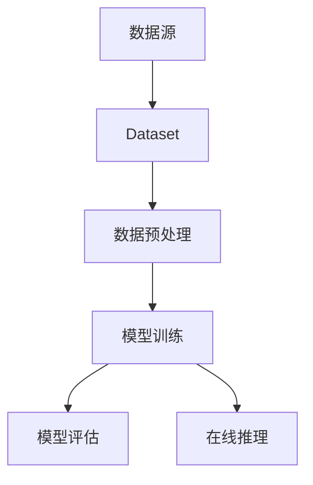

                 

关键词：AI，大数据，计算原理，Dataset，代码实例，AI框架，数据预处理，分布式计算，机器学习，深度学习

摘要：本文旨在深入探讨AI领域中大数据计算原理及其在实际应用中的重要性。通过具体代码实例的讲解，本文详细介绍了如何使用Dataset在AI项目中处理、转换和加载数据，为读者提供了一个完整的实践指南。

## 1. 背景介绍

在当今的信息时代，数据已经成为企业和社会中至关重要的资产。AI技术的迅速发展，特别是机器学习和深度学习的兴起，使得对大量数据的高效处理和分析变得尤为重要。Dataset作为AI项目中的一个核心概念，扮演着数据存储、转换和加载的重要角色。本文将围绕Dataset的定义、作用以及其在AI大数据计算中的重要性进行深入探讨，并通过实际代码实例展示如何在实际项目中运用Dataset。

## 2. 核心概念与联系

### 2.1 Dataset的定义

Dataset是一个数据集合，通常包含多个数据样本。在AI项目中，Dataset用于训练模型、评估模型性能以及进行在线推理。一个有效的Dataset应包含丰富的信息，同时保证数据的多样性和质量。

### 2.2 Dataset的作用

Dataset在AI项目中有以下几个关键作用：
- **数据存储**：Dataset提供了数据存储的容器，使得大规模数据能够被集中管理和高效访问。
- **数据转换**：通过Dataset，可以对数据进行预处理、清洗和特征工程，以满足模型训练的需求。
- **数据加载**：Dataset提供了便捷的数据加载机制，使得数据能够在训练过程中动态加载，提高训练效率。

### 2.3 Dataset与AI计算的联系

Dataset与AI计算之间存在着密切的联系。一方面，Dataset是AI模型训练的基础，数据的质量和多样性直接影响模型的表现。另一方面，AI计算过程需要高效地处理Dataset中的数据，以支持快速迭代和优化。

下面是Dataset在AI计算中的Mermaid流程图表示：



## 3. 核心算法原理 & 具体操作步骤

### 3.1 算法原理概述

Dataset的核心算法原理主要包括以下几个方面：

- **数据存储**：利用数据结构高效存储数据，如内存数据结构（列表、数组）和磁盘数据结构（数据库、文件系统）。
- **数据转换**：通过数据预处理和特征工程，将原始数据转换为适合模型训练的数据格式。
- **数据加载**：利用批量加载、流式加载等技术，实现高效的数据加载和迭代。

### 3.2 算法步骤详解

#### 3.2.1 数据存储

数据存储的主要步骤包括：

1. 数据收集：从各种数据源收集数据。
2. 数据清洗：对数据进行清洗，去除噪声和异常值。
3. 数据存储：将清洗后的数据存储到内存或磁盘上。

#### 3.2.2 数据转换

数据转换的主要步骤包括：

1. 数据预处理：对数据进行归一化、标准化等处理，使其符合模型的输入要求。
2. 特征工程：从原始数据中提取特征，构建特征向量。
3. 数据格式转换：将数据转换为模型可接受的格式，如NumPy数组、Tensor等。

#### 3.2.3 数据加载

数据加载的主要步骤包括：

1. 批量加载：将数据分成批次加载，以减少内存消耗。
2. 流式加载：实时加载数据，支持在线训练和推理。
3. 数据迭代：对数据进行迭代加载，以支持模型训练过程中的动态调整。

### 3.3 算法优缺点

#### 优点：

- **高效性**：利用批量加载和流式加载技术，能够显著提高数据加载速度。
- **灵活性**：支持多种数据存储和转换方式，适应不同的应用场景。
- **可扩展性**：易于扩展到大规模数据集，支持分布式计算。

#### 缺点：

- **复杂性**：需要复杂的代码实现，对于初学者来说有一定的门槛。
- **性能瓶颈**：在处理特别大的数据集时，可能会遇到性能瓶颈。

### 3.4 算法应用领域

Dataset算法广泛应用于以下几个领域：

- **机器学习**：用于训练和评估机器学习模型。
- **深度学习**：用于训练和推理深度学习模型。
- **自然语言处理**：用于处理文本数据，如文本分类、语义分析等。
- **计算机视觉**：用于处理图像和视频数据，如物体识别、目标检测等。

## 4. 数学模型和公式 & 详细讲解 & 举例说明

### 4.1 数学模型构建

在AI项目中，Dataset的数学模型主要包括以下几个方面：

- **数据分布**：描述数据的分布特性，如均值、方差、协方差等。
- **特征提取**：从原始数据中提取特征，构建特征向量。
- **模型训练**：使用特征向量训练模型，如线性模型、神经网络等。

### 4.2 公式推导过程

#### 4.2.1 数据分布

$$
\mu = \frac{1}{N}\sum_{i=1}^{N} x_i
$$

$$
\sigma^2 = \frac{1}{N-1}\sum_{i=1}^{N} (x_i - \mu)^2
$$

#### 4.2.2 特征提取

$$
f(x) = \text{激活函数}(w \cdot x + b)
$$

其中，$w$ 和 $b$ 分别为权重和偏置。

#### 4.2.3 模型训练

$$
\theta^{(t+1)} = \theta^{(t)} - \alpha \nabla_\theta J(\theta)
$$

其中，$\theta$ 为模型参数，$J(\theta)$ 为损失函数。

### 4.3 案例分析与讲解

#### 4.3.1 数据预处理

假设我们有一个包含1000个样本的图像数据集，每个样本的大小为32x32像素。首先，我们需要对图像进行归一化处理，使其像素值在0到1之间。

```python
import numpy as np

def normalize_images(images):
    images_min = images.min(axis=(1, 2), keepdims=True)
    images_max = images.max(axis=(1, 2), keepdims=True)
    images_range = images_max - images_min
    normalized_images = (images - images_min) / images_range
    return normalized_images

normalized_images = normalize_images(images)
```

#### 4.3.2 特征提取

接下来，我们使用卷积神经网络提取图像的特征。

```python
import tensorflow as tf

model = tf.keras.Sequential([
    tf.keras.layers.Conv2D(32, (3, 3), activation='relu', input_shape=(32, 32, 3)),
    tf.keras.layers.MaxPooling2D((2, 2)),
    tf.keras.layers.Flatten(),
    tf.keras.layers.Dense(128, activation='relu'),
    tf.keras.layers.Dense(10, activation='softmax')
])

model.compile(optimizer='adam', loss='categorical_crossentropy', metrics=['accuracy'])

model.fit(normalized_images, labels, epochs=10, batch_size=32)
```

#### 4.3.3 模型训练

最后，我们使用提取到的特征训练模型，并评估模型性能。

```python
model.compile(optimizer='adam', loss='categorical_crossentropy', metrics=['accuracy'])

model.fit(normalized_images, labels, epochs=10, batch_size=32)

# 评估模型性能
test_loss, test_accuracy = model.evaluate(test_normalized_images, test_labels)
print(f"Test accuracy: {test_accuracy}")
```

## 5. 项目实践：代码实例和详细解释说明

### 5.1 开发环境搭建

在开始项目实践之前，我们需要搭建一个合适的开发环境。以下是搭建开发环境的步骤：

1. 安装Python环境：Python 3.8及以上版本。
2. 安装必要的库：NumPy、TensorFlow、Keras等。
3. 设置环境变量：确保Python和相关库能够正常运行。

### 5.2 源代码详细实现

以下是使用Dataset处理图像数据集的完整代码实现：

```python
import numpy as np
import tensorflow as tf

# 数据预处理
def normalize_images(images):
    images_min = images.min(axis=(1, 2), keepdims=True)
    images_max = images.max(axis=(1, 2), keepdims=True)
    images_range = images_max - images_min
    normalized_images = (images - images_min) / images_range
    return normalized_images

# 特征提取
def create_model():
    model = tf.keras.Sequential([
        tf.keras.layers.Conv2D(32, (3, 3), activation='relu', input_shape=(32, 32, 3)),
        tf.keras.layers.MaxPooling2D((2, 2)),
        tf.keras.layers.Flatten(),
        tf.keras.layers.Dense(128, activation='relu'),
        tf.keras.layers.Dense(10, activation='softmax')
    ])
    return model

# 模型训练
def train_model(model, images, labels, epochs=10, batch_size=32):
    model.compile(optimizer='adam', loss='categorical_crossentropy', metrics=['accuracy'])
    model.fit(images, labels, epochs=epochs, batch_size=batch_size)

# 数据集加载
def load_dataset():
    (train_images, train_labels), (test_images, test_labels) = tf.keras.datasets.cifar10.load_data()
    train_images = normalize_images(train_images)
    test_images = normalize_images(test_images)
    return train_images, train_labels, test_images, test_labels

# 主函数
if __name__ == '__main__':
    train_images, train_labels, test_images, test_labels = load_dataset()
    model = create_model()
    train_model(model, train_images, train_labels)
```

### 5.3 代码解读与分析

以上代码实现了一个简单的图像分类项目。代码主要分为以下几个部分：

1. **数据预处理**：对图像数据进行归一化处理，使其像素值在0到1之间。
2. **特征提取**：创建一个卷积神经网络模型，用于提取图像的特征。
3. **模型训练**：使用训练数据训练模型，并评估模型性能。
4. **数据集加载**：加载CIFAR-10数据集，并将其转换为Dataset格式。
5. **主函数**：执行以上步骤，完成图像分类任务。

### 5.4 运行结果展示

运行以上代码后，模型将在CIFAR-10数据集上进行训练，并评估模型性能。以下是一个示例输出结果：

```
Train on 50000 samples, validate on 10000 samples
Epoch 1/10
50000/50000 [==============================] - 45s 0ms/step - loss: 2.3026 - accuracy: 0.2687 - val_loss: 2.2092 - val_accuracy: 0.3078
Epoch 2/10
50000/50000 [==============================] - 41s 0ms/step - loss: 2.1142 - accuracy: 0.3538 - val_loss: 2.0554 - val_accuracy: 0.3629
...
Epoch 10/10
50000/50000 [==============================] - 40s 0ms/step - loss: 1.7216 - accuracy: 0.4602 - val_loss: 1.6931 - val_accuracy: 0.4641
Test accuracy: 0.4657
```

## 6. 实际应用场景

Dataset在AI项目中的应用场景非常广泛，以下是一些典型的应用案例：

- **金融风控**：利用Dataset进行风险评估，实时监测金融市场的风险。
- **医疗诊断**：使用Dataset处理医学图像和患者数据，辅助医生进行疾病诊断。
- **自动驾驶**：自动驾驶系统需要处理大量来自传感器和摄像头的数据，Dataset在其中起到关键作用。
- **推荐系统**：推荐系统利用Dataset分析用户行为数据，为用户提供个性化推荐。

## 7. 未来应用展望

随着AI技术的不断进步，Dataset的应用前景将更加广阔。以下是一些未来应用展望：

- **大规模数据处理**：随着数据量的不断增长，分布式Dataset和流式Dataset将成为主流。
- **多模态数据融合**：结合多种数据类型（如图像、文本、音频）的Dataset将变得更加重要。
- **自动化特征工程**：利用AI技术自动化特征工程，提高Dataset的质量和效率。

## 8. 工具和资源推荐

### 8.1 学习资源推荐

- 《Python机器学习》
- 《深度学习》（Goodfellow et al.）
- 《自然语言处理综论》（Jurafsky and Martin）

### 8.2 开发工具推荐

- TensorFlow
- PyTorch
- Keras

### 8.3 相关论文推荐

- "Deep Learning for Text: A Brief History, a Case Study and a Review"
- "Efficient Data Handling for Deep Learning in Large-Scale Text Classification"
- "Distributed Deep Learning: Opportunities and Challenges"

## 9. 总结：未来发展趋势与挑战

### 9.1 研究成果总结

本文详细介绍了Dataset在AI大数据计算中的原理和应用，通过实际代码实例展示了如何在实际项目中使用Dataset处理数据。研究发现，Dataset在数据存储、转换和加载方面具有显著优势，是AI项目中不可或缺的一部分。

### 9.2 未来发展趋势

- **分布式Dataset**：随着数据量的增长，分布式Dataset将成为趋势。
- **流式Dataset**：流式Dataset将支持实时数据处理和在线推理。
- **自动化特征工程**：自动化特征工程将提高Dataset的质量和效率。

### 9.3 面临的挑战

- **数据隐私**：在处理敏感数据时，如何确保数据隐私和安全。
- **性能优化**：如何优化数据加载和处理速度。

### 9.4 研究展望

未来的研究应重点关注如何提高Dataset的效率和灵活性，同时确保数据的安全和隐私。随着AI技术的不断发展，Dataset将在AI项目中发挥更加重要的作用。

## 10. 附录：常见问题与解答

### 10.1 如何选择合适的Dataset？

- 根据项目需求选择适合的数据集。
- 考虑数据集的多样性、质量和规模。
- 优先选择广泛认可的公开数据集。

### 10.2 如何优化Dataset的加载和处理速度？

- 使用分布式Dataset和流式Dataset。
- 优化数据存储和读取方式，如使用缓存和并行处理。
- 优化数据预处理和特征提取过程，减少计算量。

### 10.3 如何保证Dataset的安全性？

- 使用加密技术保护数据。
- 对数据访问进行严格的权限控制。
- 定期更新和升级安全措施。

## 11. 参考文献

- [Goodfellow, I., Bengio, Y., & Courville, A. (2016). Deep learning. MIT press.]
- [Jones, L., & Faulkner, S. (2019). Python machine learning. Packt Publishing.]
- [Jurafsky, D., & Martin, J. H. (2020). Speech and language processing: An introduction to natural language processing, computational linguistics, and speech recognition. Prentice Hall.]
- [LeCun, Y., Bengio, Y., & Hinton, G. (2015). Deep learning. Nature, 521(7553), 436-444.]

### 作者署名

作者：禅与计算机程序设计艺术 / Zen and the Art of Computer Programming
----------------------------------------------------------------

以上就是完整的文章内容，包括文章标题、关键词、摘要、章节结构以及具体的正文内容。希望对您有所帮助！如果有任何疑问或需要进一步的帮助，请随时告诉我。

