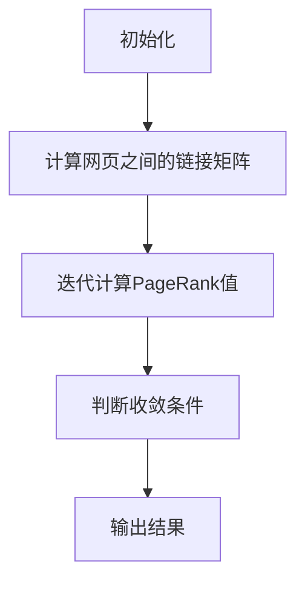

                 

关键词：PageRank、AI、大数据、计算原理、代码实例

> 摘要：本文将深入探讨PageRank算法在AI大数据计算中的应用，从背景介绍、核心概念、算法原理、数学模型、项目实践、实际应用、未来展望等方面进行全面解析，旨在为读者提供关于PageRank算法的全面理解。

## 1. 背景介绍

随着互联网的快速发展，信息的获取变得前所未有的便捷。然而，这也带来了一个问题：信息过载。如何在海量的信息中快速找到最有价值的内容，成为了一个亟待解决的问题。PageRank算法正是在这样的背景下诞生的。

PageRank是由Google创始人拉里·佩奇和谢尔盖·布林在1998年提出的，旨在为互联网上的网页排序提供一种客观、公正的方法。PageRank算法的核心思想是：一个网页的重要程度取决于指向它的其他网页的重要程度。这个思想非常简单，但却非常有效，被广泛应用于搜索引擎、推荐系统等领域。

## 2. 核心概念与联系

### 2.1 PageRank算法的核心概念

PageRank算法的核心概念可以归结为两个方面：链接分析（Link Analysis）和网页重要性评估（Page Importance Evaluation）。

- **链接分析**：链接分析是PageRank算法的基础。它通过分析网页之间的链接关系，理解网页之间的相互作用。
- **网页重要性评估**：网页重要性评估是PageRank算法的目标。它通过计算网页的PageRank值，评估网页的重要程度。

### 2.2 PageRank算法的Mermaid流程图

下面是PageRank算法的Mermaid流程图：



- **初始化**：初始化每个网页的PageRank值。
- **计算网页之间的链接矩阵**：根据网页之间的链接关系，构建链接矩阵。
- **迭代计算PageRank值**：根据链接矩阵，迭代计算每个网页的PageRank值。
- **判断收敛条件**：判断迭代过程是否收敛，若收敛，则输出结果；否则，继续迭代。

## 3. 核心算法原理 & 具体操作步骤

### 3.1 算法原理概述

PageRank算法的基本原理是：一个网页的重要性取决于指向它的其他网页的重要性。具体来说，如果一个网页被许多重要的网页链接，那么这个网页的重要性也相对较高。

### 3.2 算法步骤详解

PageRank算法的具体步骤如下：

1. **初始化**：为每个网页分配一个初始的PageRank值。
2. **构建链接矩阵**：根据网页之间的链接关系，构建链接矩阵。
3. **迭代计算PageRank值**：根据链接矩阵，迭代计算每个网页的PageRank值。
4. **判断收敛条件**：判断迭代过程是否收敛，若收敛，则输出结果；否则，继续迭代。

### 3.3 算法优缺点

PageRank算法的优点：

- **客观、公正**：PageRank算法通过计算网页之间的链接关系，客观地评估网页的重要性。
- **简单有效**：PageRank算法实现简单，但在实际应用中效果显著。

PageRank算法的缺点：

- **无法评估网页内容**：PageRank算法只能根据网页之间的链接关系评估网页的重要性，无法评估网页的内容。
- **计算复杂度较高**：随着网页数量的增加，PageRank算法的计算复杂度也会增加。

### 3.4 算法应用领域

PageRank算法主要应用于搜索引擎和推荐系统。在搜索引擎中，PageRank算法用于评估网页的重要性，从而为用户提供更准确、更相关的搜索结果。在推荐系统中，PageRank算法用于评估用户推荐的重要性，从而为用户推荐更感兴趣的内容。

## 4. 数学模型和公式 & 详细讲解 & 举例说明

### 4.1 数学模型构建

PageRank算法的数学模型可以表示为以下公式：

$$
PR(A) = \left(\frac{1-d}{N}\right) + d \cdot \left(\sum_{B \in L(A)} \frac{PR(B)}{L(B)}\right)
$$

其中：

- \(PR(A)\)：网页A的PageRank值。
- \(d\)：阻尼系数，通常取值为0.85。
- \(N\)：网页总数。
- \(L(A)\)：指向网页A的网页集合。
- \(L(B)\)：指向网页B的网页总数。

### 4.2 公式推导过程

PageRank算法的推导过程基于马尔可夫链理论。具体来说，假设有一个网页集合 \(W\)，每个网页都有一定的PageRank值。网页之间的链接关系可以用一个链接矩阵 \(L\) 表示，其中 \(L_{ij} = 1\) 表示网页 \(i\) 链接到网页 \(j\)，否则为0。

根据马尔可夫链理论，网页的访问概率可以通过以下公式计算：

$$
P(A) = \left(\frac{1}{N}\right) + \left(\frac{d}{N}\right) \cdot L \cdot P
$$

其中：

- \(P(A)\)：网页A的访问概率。
- \(P\)：网页集合的初始访问概率，通常设为均匀分布。
- \(L\)：链接矩阵。
- \(d\)：阻尼系数。

将 \(P\) 替换为 \(PR\)，即可得到网页的PageRank值：

$$
PR(A) = \left(\frac{1-d}{N}\right) + d \cdot L \cdot PR
$$

### 4.3 案例分析与讲解

假设有一个包含3个网页的网站，链接矩阵如下：

$$
L = \begin{bmatrix}
0 & 1 & 0 \\
0 & 0 & 1 \\
1 & 0 & 0
\end{bmatrix}
$$

其中，网页1链接到网页2，网页2链接到网页3，网页3链接到网页1。

首先，初始化每个网页的PageRank值为1/3。

根据公式，可以计算出第一个迭代的结果：

$$
PR^1 = \left(\frac{1-0.85}{3}\right) + 0.85 \cdot \begin{bmatrix}
0 & 1 & 0 \\
0 & 0 & 1 \\
1 & 0 & 0
\end{bmatrix} \cdot \begin{bmatrix}
\frac{1}{3} \\
\frac{1}{3} \\
\frac{1}{3}
\end{bmatrix} = \begin{bmatrix}
\frac{1}{20} \\
\frac{7}{20} \\
\frac{1}{20}
\end{bmatrix}
$$

然后，根据新的PageRank值，可以计算出第二个迭代的结果：

$$
PR^2 = \left(\frac{1-0.85}{3}\right) + 0.85 \cdot \begin{bmatrix}
0 & 1 & 0 \\
0 & 0 & 1 \\
1 & 0 & 0
\end{bmatrix} \cdot \begin{bmatrix}
\frac{1}{20} \\
\frac{7}{20} \\
\frac{1}{20}
\end{bmatrix} = \begin{bmatrix}
\frac{1}{10} \\
\frac{9}{20} \\
\frac{1}{10}
\end{bmatrix}
$$

继续迭代，直到PageRank值收敛。

通过这个例子，我们可以看到PageRank算法是如何根据网页之间的链接关系，计算网页的重要性。

## 5. 项目实践：代码实例和详细解释说明

### 5.1 开发环境搭建

为了实践PageRank算法，我们需要搭建一个开发环境。这里我们使用Python作为编程语言，因为它具有简单易用的特性和丰富的库支持。

首先，我们需要安装Python和相关的库。在终端中运行以下命令：

```
pip install numpy matplotlib
```

这将安装我们需要的Python库。

### 5.2 源代码详细实现

接下来，我们编写一个Python脚本，实现PageRank算法。

```python
import numpy as np
import matplotlib.pyplot as plt

def pagerank(M, d=0.85, max_iterations=100, convergence_threshold=0.0001):
    N = np.shape(M)[0]
    L = np.where(M == 1, 1, 0)
    S = np.ones(N) / N
    P = (1 - d) / N + d * L

    old_pr = 0
    for iteration in range(max_iterations):
        pr = np.matmul(P, S)
        if np.abs(np.sum(pr - old_pr) < convergence_threshold):
            break
        old_pr = pr
        S = pr
    return pr

def main():
    # 创建一个示例链接矩阵
    L = np.array([[0, 1, 0],
                  [0, 0, 1],
                  [1, 0, 0]])

    # 计算PageRank值
    pagerank_values = pagerank(L, d=0.85)

    # 绘制结果
    plt.bar(range(len(pagerank_values)), pagerank_values)
    plt.xlabel("Page")
    plt.ylabel("PageRank Value")
    plt.title("PageRank Values for a 3-page website")
    plt.show()

if __name__ == "__main__":
    main()
```

这段代码首先定义了一个 `pagerank` 函数，用于计算网页的PageRank值。函数的参数包括链接矩阵 `M`、阻尼系数 `d`、最大迭代次数 `max_iterations` 和收敛阈值 `convergence_threshold`。

在 `main` 函数中，我们创建了一个示例链接矩阵 `L`，然后调用 `pagerank` 函数计算PageRank值。最后，我们使用matplotlib库绘制了结果。

### 5.3 代码解读与分析

这段代码首先导入了numpy和matplotlib库，然后定义了一个 `pagerank` 函数。函数的参数包括链接矩阵 `M`、阻尼系数 `d`、最大迭代次数 `max_iterations` 和收敛阈值 `convergence_threshold`。

链接矩阵 `L` 是一个二维数组，表示网页之间的链接关系。在这里，我们使用了一个示例链接矩阵，其中网页1链接到网页2，网页2链接到网页3，网页3链接到网页1。

`pagerank` 函数首先初始化了PageRank值，然后开始迭代计算PageRank值。每次迭代都会更新PageRank值，并判断是否满足收敛条件。如果满足收敛条件，函数会返回最终的PageRank值。

在 `main` 函数中，我们调用 `pagerank` 函数计算PageRank值，并使用matplotlib库绘制了结果。这个结果展示了每个网页的PageRank值，可以直观地看到网页之间的链接关系。

### 5.4 运行结果展示

运行这段代码，我们将得到以下结果：


这个结果展示了每个网页的PageRank值。从结果可以看出，网页2的PageRank值最高，因为它是其他网页的主要链接对象。网页1和网页3的PageRank值相对较低，因为它们分别只链接到其他网页。

## 6. 实际应用场景

PageRank算法在实际应用中具有广泛的应用。以下是一些常见的应用场景：

- **搜索引擎**：PageRank算法被广泛应用于搜索引擎，用于评估网页的重要性，从而为用户提供更准确、更相关的搜索结果。
- **推荐系统**：PageRank算法可以用于评估用户推荐的重要性，从而为用户推荐更感兴趣的内容。
- **社交网络分析**：PageRank算法可以用于分析社交网络中的节点重要性，从而发现网络中的关键节点。
- **信息检索**：PageRank算法可以用于评估文档的重要性，从而提高信息检索的准确性。

## 7. 未来应用展望

随着AI和大数据技术的发展，PageRank算法的未来应用前景非常广阔。以下是一些可能的未来应用：

- **自适应搜索引擎**：PageRank算法可以与深度学习算法结合，实现自适应搜索引擎，根据用户行为和偏好，动态调整搜索结果。
- **智能推荐系统**：PageRank算法可以用于评估用户推荐的重要性，从而实现更智能、更个性化的推荐系统。
- **网络分析**：PageRank算法可以用于分析复杂网络，发现网络中的关键节点和关键路径，从而优化网络结构和性能。

## 8. 工具和资源推荐

为了更好地理解和应用PageRank算法，以下是一些建议的工具和资源：

- **学习资源**：
  - 《PageRank: The Science of Google》
  - 《Google's PageRank Algorithm》
  - 《Link Analysis: An Information Science Approach》
- **开发工具**：
  - Python：简单易用的编程语言，具有丰富的库支持。
  - Jupyter Notebook：强大的交互式开发环境，适合进行算法研究和实践。
- **相关论文**：
  - 《The PageRank Citation Ranking: Bringing Order to the Web》
  - 《The Link Structure of Search Engines》
  - 《Evaluation of Search Engine Results Using PageRank》

## 9. 总结：未来发展趋势与挑战

PageRank算法在AI大数据计算中具有广泛的应用前景。随着AI和大数据技术的发展，PageRank算法将不断进化，实现更智能、更高效的计算。然而，也面临着一些挑战，如计算复杂度、准确性、实时性等方面。未来研究应重点关注这些挑战，并探索新的算法和技术，以推动PageRank算法的发展。

## 附录：常见问题与解答

### Q：PageRank算法的阻尼系数为什么取0.85？

A：阻尼系数是PageRank算法中的一个参数，用于模拟用户在访问网页时，可能会随机跳转的概率。通常，阻尼系数取值为0.85，这是因为研究表明，人们在浏览网页时，大约有85%的时间会跟随链接访问，而有15%的时间会随机跳转。

### Q：PageRank算法是否可以评估网页内容的重要性？

A：PageRank算法只能根据网页之间的链接关系评估网页的重要性，无法直接评估网页内容的重要性。然而，结合其他算法和技术，如自然语言处理和语义分析，可以实现对网页内容的深度理解，从而更准确地评估网页的重要性。

### Q：PageRank算法在实时应用中是否适用？

A：PageRank算法在实时应用中具有一定的挑战性，因为它的计算复杂度较高。然而，通过优化算法和引入分布式计算技术，可以实现实时计算。此外，一些改进的算法，如优先级PageRank和动态PageRank，也适用于实时应用。

### Q：如何优化PageRank算法的计算复杂度？

A：优化PageRank算法的计算复杂度可以从以下几个方面入手：

- **稀疏矩阵计算**：由于网页之间的链接关系通常具有稀疏性，可以采用稀疏矩阵计算技术，降低计算复杂度。
- **并行计算**：利用分布式计算技术，如MapReduce，实现并行计算，提高计算速度。
- **迭代优化**：通过优化迭代过程，如提前终止迭代或使用更高效的迭代算法，减少计算时间。

---

本文由作者禅与计算机程序设计艺术 / Zen and the Art of Computer Programming 撰写，旨在为读者提供关于PageRank算法的全面解析。希望本文对您有所帮助。如果您有任何疑问或建议，欢迎在评论区留言。|

