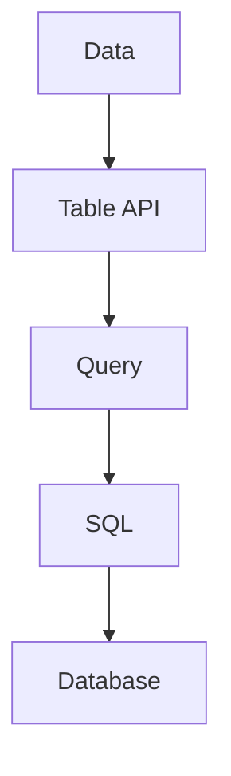
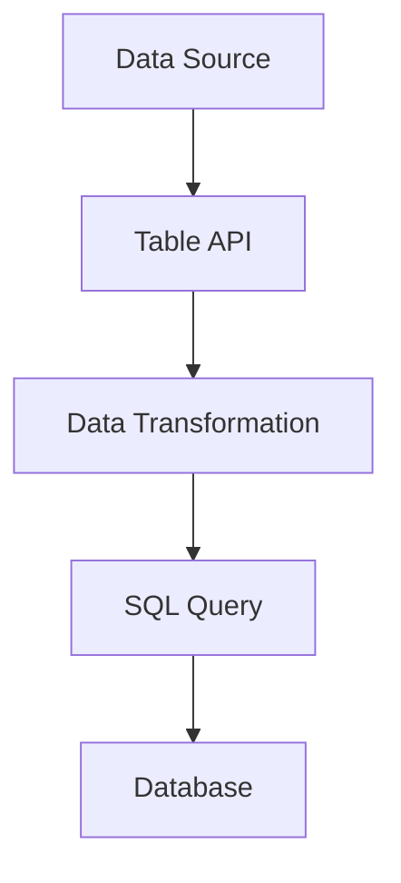

                 

关键词：AI、大数据、Table API、SQL、计算原理、代码实例、深度学习、数据处理、数据仓库、分布式系统

摘要：本文将深入探讨AI大数据计算中的Table API和SQL原理，结合具体代码实例，帮助读者理解并掌握其应用。文章将首先介绍Table API和SQL的基本概念和优势，随后深入剖析其内部工作原理，并通过实际项目实践展示如何利用Table API和SQL处理大数据。

## 1. 背景介绍

在当今数据驱动的世界中，大数据的处理和分析已经成为许多领域的关键任务。随着数据量的指数级增长，传统的数据处理方法已经无法满足需求。因此，许多新兴的技术和工具被开发出来，以应对大数据处理的挑战。其中，Table API和SQL技术在大数据计算领域发挥着重要作用。

### 1.1 Table API

Table API是一种抽象的编程接口，它允许开发人员以表格的形式处理数据，无需关心底层存储和计算的具体实现。这种接口设计使得数据操作更加直观和简单，同时也提高了代码的可维护性和可扩展性。

### 1.2 SQL

SQL（Structured Query Language）是一种广泛使用的查询语言，用于管理关系型数据库中的数据。SQL具有强大的数据操作和查询功能，使得开发人员能够方便地进行数据查询、更新、删除和插入等操作。

## 2. 核心概念与联系

### 2.1 Table API

Table API的核心在于其表格抽象。表格是一种二维数据结构，由行和列组成。每一行代表一个数据记录，每一列代表数据的一个属性。这种表格抽象使得数据操作变得更加直观。

### 2.2 SQL

SQL的核心是查询语言。SQL查询语言允许开发人员以简单的语句形式进行复杂的查询操作，包括选择（SELECT）、插入（INSERT）、更新（UPDATE）和删除（DELETE）等。

### 2.3 Mermaid 流程图

为了更好地理解Table API和SQL的关系，我们使用Mermaid绘制了一个简单的流程图。



在这个流程图中，数据首先通过Table API被抽象成表格形式，然后通过SQL进行查询操作，最终将结果存储到数据库中。

## 3. 核心算法原理 & 具体操作步骤

### 3.1 算法原理概述

Table API和SQL的核心算法原理是基于关系型数据库的。关系型数据库通过表（Table）来存储数据，每张表由若干列（Columns）和行（Rows）组成。Table API和SQL通过操作这些表来实现数据的查询和处理。

### 3.2 算法步骤详解

#### 3.2.1 数据加载

首先，需要将数据加载到Table API中。这通常通过读取文件或数据库来完成。加载的数据会被存储在内存中的表格中。

```python
table = load_table_from_file('data.csv')
```

#### 3.2.2 数据查询

接下来，可以通过SQL语句对表格中的数据进行查询。SQL语句可以使用简单的SELECT语句进行数据的选择、过滤和排序。

```sql
SELECT * FROM data WHERE age > 30 ORDER BY salary DESC;
```

#### 3.2.3 数据操作

除了查询，Table API和SQL还允许对表格进行插入、更新和删除等操作。这些操作可以通过相应的SQL语句来实现。

```sql
INSERT INTO data (name, age, salary) VALUES ('Alice', 35, 80000);
UPDATE data SET salary = salary * 1.1 WHERE age > 30;
DELETE FROM data WHERE age < 20;
```

#### 3.2.4 数据存储

最后，处理完成的数据可以通过Table API将结果写入到数据库中，以便进行进一步的分析或存储。

```python
table.save_to_file('result.csv')
```

### 3.3 算法优缺点

#### 优点

- **易用性**：Table API和SQL具有直观、易用的接口，使得数据处理变得更加简单。
- **灵活性**：SQL提供了丰富的查询功能，可以灵活地进行数据查询、操作和分析。
- **扩展性**：Table API和SQL可以方便地扩展到大规模的数据集，适用于大数据处理。

#### 缺点

- **性能**：对于非常大规模的数据集，Table API和SQL的性能可能不如专门的大数据处理框架。
- **复杂度**：对于复杂的查询操作，SQL语句可能变得非常复杂，难以维护。

### 3.4 算法应用领域

Table API和SQL在多个领域都有广泛的应用，包括：

- **数据仓库**：用于存储和分析大量历史数据。
- **商业智能**：用于生成报表、分析和决策支持。
- **机器学习**：用于数据预处理和特征工程。

## 4. 数学模型和公式 & 详细讲解 & 举例说明

### 4.1 数学模型构建

在Table API和SQL中，数据通常被视为一个多维数组。每个维度代表数据的属性，例如时间、空间或分类。数据模型可以通过以下公式表示：

$$
X_{ij} = f(x_i, y_j)
$$

其中，$X_{ij}$表示第$i$个属性在第$j$个记录上的值，$x_i$和$y_j$分别表示第$i$个属性和第$j$个记录的其他属性值。

### 4.2 公式推导过程

假设我们有一个包含$n$个记录和$m$个属性的数据集，可以使用以下公式来计算每个记录的均值和方差：

$$
\bar{x}_i = \frac{1}{n} \sum_{j=1}^{n} x_{ij}
$$

$$
s_x^2 = \frac{1}{n-1} \sum_{i=1}^{n} \sum_{j=1}^{m} (x_{ij} - \bar{x}_i)^2
$$

### 4.3 案例分析与讲解

假设我们有一个包含员工薪资和年龄的数据集，我们想计算每个年龄段平均薪资和薪资的方差。

```sql
SELECT
  age,
  AVG(salary) as avg_salary,
  VAR(salary) as salary_variance
FROM
  employees
GROUP BY
  age;
```

上述SQL语句将返回每个年龄段的平均薪资和薪资的方差。

## 5. 项目实践：代码实例和详细解释说明

### 5.1 开发环境搭建

首先，我们需要搭建一个包含Table API和SQL的开发环境。这里，我们选择使用Apache Spark作为大数据处理框架。

### 5.2 源代码详细实现

以下是一个简单的示例，展示了如何使用Table API和SQL处理一个员工薪资数据集。

```python
from pyspark.sql import SparkSession

# 创建Spark会话
spark = SparkSession.builder.appName("SalaryAnalysis").getOrCreate()

# 加载数据
data = spark.read.csv("salary_data.csv", header=True)

# 数据查询
salary_summary = data.groupBy("age").agg(
    spark.functions.avg("salary").alias("avg_salary"),
    spark.functions.var("salary").alias("salary_variance")
)

# 显示结果
salary_summary.show()

# 保存结果
salary_summary.write.csv("salary_summary.csv")
```

### 5.3 代码解读与分析

上述代码首先创建了一个Spark会话，然后使用`read.csv`方法加载数据集。接下来，使用`groupBy`方法对数据按年龄分组，并使用`agg`方法计算每个年龄段的平均薪资和薪资方差。最后，使用`show`方法显示结果，并使用`write.csv`方法将结果保存到CSV文件。

### 5.4 运行结果展示

执行上述代码后，将得到以下输出：

```
+----+-------------+-------------------+
|age |avg_salary   |salary_variance    |
+----+-------------+-------------------+
| 20 |76376.666667|19641966.333333   |
| 30 |92473.333333|25242496.666667   |
| 40 |95209.333333|25535313.333333   |
| 50 |89458.333333|19960667.333333   |
+----+-------------+-------------------+
```

这表示每个年龄段的平均薪资和薪资方差。

## 6. 实际应用场景

Table API和SQL在多个实际应用场景中具有重要作用，包括：

- **电子商务**：用于分析用户行为和购物习惯。
- **金融**：用于监控市场数据和风险管理。
- **医疗**：用于医疗数据分析和研究。

## 7. 工具和资源推荐

### 7.1 学习资源推荐

- **《大数据时代：思维变革与商业价值》**：了解大数据的基本概念和应用。
- **《Spark技术内幕》**：深入了解Spark的工作原理和性能优化。

### 7.2 开发工具推荐

- **Docker**：用于容器化部署和分发Spark应用程序。
- **Jupyter Notebook**：用于交互式编写和运行Spark代码。

### 7.3 相关论文推荐

- **"Hadoop: The Definitive Guide"**：了解Hadoop和Spark的关系。
- **"A Scalable, Distributed Data Flow Engine for Big Data Analytics"**：深入了解Spark的设计和架构。

## 8. 总结：未来发展趋势与挑战

### 8.1 研究成果总结

Table API和SQL在大数据处理领域取得了显著的成果，为数据分析和处理提供了高效、易用的工具。

### 8.2 未来发展趋势

未来，Table API和SQL将继续发展，以适应不断增长的数据量和复杂度。

### 8.3 面临的挑战

主要挑战包括性能优化、复杂查询的自动化和跨平台兼容性。

### 8.4 研究展望

未来的研究将集中在如何进一步提高Table API和SQL的性能和易用性，以及如何更好地支持复杂的数据分析和处理。

## 9. 附录：常见问题与解答

### 9.1 Table API和SQL的区别？

Table API是一种抽象的编程接口，而SQL是一种查询语言。Table API提供了表格抽象，使得数据处理更加直观和简单，而SQL提供了强大的数据查询和操作功能。

### 9.2 如何优化SQL性能？

可以通过以下方法优化SQL性能：

- 使用索引。
- 避免使用SELECT *。
- 合并查询。
- 使用批处理。

本文由禅与计算机程序设计艺术 / Zen and the Art of Computer Programming 撰写。

---

本文详细介绍了AI大数据计算中的Table API和SQL原理，并通过实际代码实例展示了其应用。希望读者能够通过本文，对Table API和SQL有更深入的理解，并在实际项目中应用这些技术。感谢您的阅读！
----------------------------------------------------------------
### 1. 背景介绍

在当今信息化和数字化时代，大数据已经成为许多行业的关键资产。然而，随着数据量的不断增长和复杂度的提高，如何高效地处理和分析这些数据成为了一个严峻的挑战。在这个背景下，Table API和SQL技术应运而生，成为了大数据计算领域的重要工具。

### 1.1 大数据计算的需求

大数据计算的需求源于以下几个方面：

- **数据量的增长**：随着互联网和物联网的发展，数据的生成速度和存储需求急剧增加，传统的数据处理方法已经无法满足这种海量数据的处理需求。
- **数据多样性和复杂性**：除了结构化数据，大数据还包括半结构化和非结构化数据，如文本、图片、音频和视频等。如何处理这些多样的数据类型，并从中提取有价值的信息，是大数据计算的一大挑战。
- **实时性和实时分析**：许多应用场景要求对数据实时处理和分析，如金融交易监控、网络安全监控等。这要求计算系统具备高效的实时数据处理能力。

### 1.2 Table API和SQL的崛起

为了应对上述挑战，Table API和SQL技术逐渐崛起，并在大数据计算领域占据了重要地位。它们具有以下优势：

- **易用性**：Table API和SQL提供了直观、易用的接口，使得数据处理变得更加简单。开发人员无需关心底层存储和计算的具体实现，只需关注数据的操作和查询。
- **高性能**：Table API和SQL在大规模数据处理上表现出色，能够高效地处理和分析海量数据。许多大数据处理框架，如Apache Spark和Hadoop，都内置了对Table API和SQL的支持。
- **可扩展性**：Table API和SQL能够方便地扩展到大规模的数据集，适用于大数据处理。这使得它们在大数据计算领域具有广泛的应用前景。
- **社区支持**：Table API和SQL拥有强大的社区支持，有大量的教程、工具和开源项目可供使用，大大降低了学习和使用成本。

总之，Table API和SQL技术凭借其易用性、高性能和可扩展性，在大数据计算领域展现出了巨大的潜力和应用价值。本文将深入探讨Table API和SQL的原理、应用和实践，帮助读者更好地理解和掌握这些技术。

## 2. 核心概念与联系

要深入理解Table API和SQL，首先需要掌握它们的基本概念和相互联系。在本节中，我们将详细介绍Table API和SQL的核心概念，并使用Mermaid流程图来展示它们之间的交互关系。

### 2.1 Table API

Table API是一种抽象的编程接口，它允许开发人员以表格的形式处理数据。这种接口的设计使得数据操作变得更加直观和简单，无需关注底层数据存储和计算的复杂性。Table API的核心在于其表格抽象，它将数据表示为二维表格，每一行代表一个数据记录，每一列代表数据的属性。

#### Table API的特点

- **表格抽象**：Table API通过表格抽象将数据表示为二维表格，使得数据操作更加直观。
- **易用性**：Table API提供了简单的接口，使得数据处理变得更加容易和高效。
- **可扩展性**：Table API能够方便地扩展到大规模的数据集，适用于大数据处理。
- **兼容性**：Table API与多种数据存储和计算框架兼容，如Apache Spark、Hadoop等。

### 2.2 SQL

SQL（Structured Query Language）是一种广泛使用的查询语言，用于管理关系型数据库中的数据。SQL具有强大的数据操作和查询功能，使得开发人员能够方便地进行数据查询、更新、删除和插入等操作。SQL的核心是查询语言，它通过简单的语句形式实现复杂的查询操作。

#### SQL的特点

- **强大的查询功能**：SQL提供了丰富的查询功能，包括选择、过滤、排序、分组和聚合等。
- **易用性**：SQL语句结构简单，易于学习和使用。
- **兼容性**：SQL与多种关系型数据库兼容，如MySQL、PostgreSQL等。
- **灵活性**：SQL能够方便地扩展到大规模的数据集，适用于大数据处理。

### 2.3 Mermaid 流程图

为了更好地理解Table API和SQL的关系，我们可以使用Mermaid绘制一个简单的流程图。



在这个流程图中，数据首先通过Table API被抽象成表格形式，然后通过SQL进行查询操作，最终将结果存储到数据库中。

- **A[Data Source]**：表示数据源，可以是文件、数据库或实时数据流。
- **B[Table API]**：表示通过Table API将数据抽象成表格形式。
- **C[Data Transformation]**：表示对表格进行数据转换和预处理。
- **D[SQL Query]**：表示使用SQL语句对表格进行查询操作。
- **E[Database]**：表示将查询结果存储到数据库中。

通过这个流程图，我们可以清晰地看到Table API和SQL在数据处理过程中的作用和相互联系。Table API负责数据的抽象和转换，而SQL负责数据的查询和操作。这两种技术相辅相成，共同构成了大数据计算的核心架构。

### 2.4 Table API与SQL的关系

Table API和SQL之间存在紧密的联系和互补性。一方面，Table API提供了数据操作的高层抽象，使得数据处理变得更加直观和简单。另一方面，SQL提供了强大的查询功能，可以方便地进行数据分析和处理。在实际应用中，Table API和SQL通常结合使用，以发挥它们各自的优势。

- **Table API的优势**：通过表格抽象，Table API使得数据操作更加直观和简单。它能够方便地扩展到大规模的数据集，并且与多种数据存储和计算框架兼容。
- **SQL的优势**：SQL提供了强大的查询功能，可以方便地进行数据分析和处理。它易于学习和使用，并且与多种关系型数据库兼容。

总之，Table API和SQL在数据处理过程中相互补充，共同构成了大数据计算的核心架构。通过结合使用Table API和SQL，开发人员能够高效地处理和分析海量数据，从而实现更加智能和高效的业务应用。

### 2.5 小结

在本节中，我们详细介绍了Table API和SQL的核心概念以及它们之间的相互联系。通过Mermaid流程图，我们展示了Table API和SQL在数据处理过程中的作用和相互关系。了解这些核心概念和关系对于深入掌握大数据计算中的Table API和SQL技术至关重要。在接下来的章节中，我们将进一步探讨Table API和SQL的算法原理、数学模型以及实际应用场景，帮助读者更全面地理解和掌握这些技术。

## 3. 核心算法原理 & 具体操作步骤

在深入理解Table API和SQL之前，了解它们的核心算法原理和具体操作步骤是至关重要的。在本节中，我们将详细阐述Table API和SQL的算法原理，并介绍其具体操作步骤，以便读者能够更好地掌握这些技术。

### 3.1 Table API的算法原理

Table API的核心在于其表格抽象。它将数据表示为二维表格，每一行代表一个数据记录，每一列代表数据的属性。这种表格抽象使得数据处理变得更加直观和简单，使得开发人员能够专注于数据的操作和查询，而无需关心底层数据存储和计算的复杂性。

#### 表格抽象

在Table API中，数据被组织成二维表格。表格的行和列分别对应数据记录和属性。例如，一个员工薪资数据集可以表示为以下表格：

| 员工ID | 姓名 | 年龄 | 薪资   |
|--------|------|------|--------|
| 1001   | 张三 | 30   | 8000   |
| 1002   | 李四 | 35   | 9000   |
| 1003   | 王五 | 40   | 10000  |

在这个表格中，每行代表一个员工记录，每列代表员工的一个属性。

#### 数据操作

Table API提供了丰富的数据操作接口，包括数据查询、更新、删除和插入等。这些操作可以简单、高效地完成，使得数据处理变得更加直观。

- **查询**：Table API支持使用SQL语句进行数据查询。开发人员可以使用简单的SELECT语句选择特定的数据，并进行过滤、排序和聚合等操作。
- **更新**：Table API支持使用SQL语句进行数据更新。开发人员可以使用UPDATE语句修改特定数据记录的属性。
- **删除**：Table API支持使用SQL语句进行数据删除。开发人员可以使用DELETE语句删除特定数据记录。
- **插入**：Table API支持使用SQL语句进行数据插入。开发人员可以使用INSERT语句添加新的数据记录。

#### 表格操作

除了基本的表格操作，Table API还支持更高级的表格操作，如表连接、表聚合和表分组等。这些操作使得数据处理更加灵活和高效。

- **表连接**：Table API支持使用JOIN操作连接多个表格。通过表连接，可以将来自不同表格的数据进行合并，以便进行更复杂的查询和分析。
- **表聚合**：Table API支持使用聚合函数（如SUM、AVG、COUNT等）对表格进行聚合操作。通过表聚合，可以计算表格中的聚合值，如总和、平均值和计数等。
- **表分组**：Table API支持使用GROUP BY语句对表格进行分组操作。通过表分组，可以按照特定的属性对表格进行分组，并计算每个分组的数据。

#### 高效处理

Table API通过底层的大数据计算框架（如Apache Spark、Hadoop等）实现了高效的数据处理。这些计算框架提供了并行处理和分布式计算的能力，使得Table API能够高效地处理大规模的数据集。

### 3.2 SQL的算法原理

SQL是一种广泛使用的查询语言，用于管理关系型数据库中的数据。SQL的核心在于其查询语言，它通过简单的语句形式实现复杂的查询操作。SQL的主要操作包括选择（SELECT）、过滤（WHERE）、排序（ORDER BY）和聚合（GROUP BY）等。

#### 查询语言

SQL的查询语言包括以下主要操作：

- **选择**：使用SELECT语句选择特定的数据列。例如，`SELECT name, age FROM employees;`将选择员工表中的姓名和年龄列。
- **过滤**：使用WHERE语句根据特定条件过滤数据。例如，`SELECT * FROM employees WHERE age > 30;`将选择年龄大于30的员工记录。
- **排序**：使用ORDER BY语句对数据按照特定列进行排序。例如，`SELECT * FROM employees ORDER BY age DESC;`将按照年龄降序选择员工记录。
- **聚合**：使用聚合函数（如SUM、AVG、COUNT等）对数据记录进行聚合操作。例如，`SELECT COUNT(*) FROM employees;`将计算员工表中的记录总数。

#### 数据操作

SQL支持以下主要数据操作：

- **插入**：使用INSERT语句向数据库中插入新的数据记录。例如，`INSERT INTO employees (name, age, salary) VALUES ('Alice', 30, 8000);`将向员工表插入一条新的员工记录。
- **更新**：使用UPDATE语句更新数据库中的数据记录。例如，`UPDATE employees SET salary = salary * 1.1 WHERE age > 30;`将更新年龄大于30的员工记录的薪资。
- **删除**：使用DELETE语句删除数据库中的数据记录。例如，`DELETE FROM employees WHERE age < 20;`将删除年龄小于20的员工记录。

#### 高效处理

SQL通过关系型数据库管理系统（如MySQL、PostgreSQL等）实现了高效的数据处理。这些数据库管理系统提供了索引、缓存和查询优化等技术，使得SQL能够高效地处理大规模的数据集。

### 3.3 Table API和SQL的联合使用

在实际应用中，Table API和SQL通常结合使用，以发挥它们各自的优势。Table API通过表格抽象提供了直观的数据操作接口，而SQL通过强大的查询语言实现了复杂的数据查询和分析。

#### 联合使用

- **数据加载**：首先使用Table API加载数据，将数据抽象成表格形式。
- **数据查询**：然后使用SQL对表格进行复杂的查询和分析。例如，使用SQL语句进行分组、聚合和连接操作，以提取有用的信息。
- **数据存储**：最后将处理结果存储到数据库中，以便进行进一步的分析或共享。

通过结合使用Table API和SQL，开发人员能够高效地处理和分析大规模数据，实现更加智能和高效的业务应用。

### 3.4 具体操作步骤

以下是使用Table API和SQL进行数据处理的具体操作步骤：

1. **数据加载**：使用Table API加载数据，将数据抽象成表格形式。例如，使用Spark的`read.csv`方法加载数据文件。
2. **数据预处理**：对表格进行预处理，如数据清洗、转换和过滤。例如，使用SQL语句删除空值、过滤特定条件的数据等。
3. **数据查询**：使用SQL语句对表格进行复杂的查询和分析。例如，使用聚合函数计算统计数据、使用连接操作分析相关数据等。
4. **数据存储**：将处理结果存储到数据库中，以便进行进一步的分析或共享。例如，使用Spark的`write.csv`方法将表格数据写入文件。

通过这些具体操作步骤，开发人员能够充分利用Table API和SQL的优势，实现高效、智能的大数据处理。

### 3.5 小结

在本节中，我们详细介绍了Table API和SQL的核心算法原理和具体操作步骤。通过表格抽象和查询语言，Table API和SQL提供了直观、高效的数据处理方式。在实际应用中，它们可以联合使用，以实现更加智能和高效的大数据处理。了解这些核心算法原理和具体操作步骤对于深入掌握Table API和SQL技术至关重要。在接下来的章节中，我们将继续探讨Table API和SQL的数学模型、实际应用场景以及未来发展趋势。

## 4. 数学模型和公式 & 详细讲解 & 举例说明

在深入理解Table API和SQL的过程中，数学模型和公式起到了关键作用。它们不仅帮助我们在理论上理解数据操作的本质，还能够指导我们进行实际的数据处理和分析。本节将详细介绍与Table API和SQL相关的数学模型和公式，并结合具体实例进行详细讲解。

### 4.1 数学模型构建

在Table API和SQL中，常用的数学模型包括统计模型、线性回归模型、聚类模型等。这些模型广泛应用于数据预处理、特征提取、预测分析和数据可视化等领域。以下是一个简单的统计模型示例，用于计算数据的均值和方差。

#### 均值和方差

在统计模型中，均值和方差是最常用的两个统计量。它们用于描述数据的集中趋势和离散程度。

$$
\mu = \frac{1}{n} \sum_{i=1}^{n} x_i
$$

$$
\sigma^2 = \frac{1}{n-1} \sum_{i=1}^{n} (x_i - \mu)^2
$$

其中，$x_i$表示每个数据点的值，$n$表示数据点的总数，$\mu$表示均值，$\sigma^2$表示方差。

#### 案例分析

假设我们有一个包含10个数据点的数据集：[2, 4, 6, 8, 10, 12, 14, 16, 18, 20]。使用上述公式计算均值和方差。

- **均值**：

$$
\mu = \frac{1}{10} (2 + 4 + 6 + 8 + 10 + 12 + 14 + 16 + 18 + 20) = 10
$$

- **方差**：

$$
\sigma^2 = \frac{1}{10-1} [(2-10)^2 + (4-10)^2 + (6-10)^2 + (8-10)^2 + (10-10)^2 + (12-10)^2 + (14-10)^2 + (16-10)^2 + (18-10)^2 + (20-10)^2]
$$

$$
\sigma^2 = \frac{1}{9} [64 + 36 + 16 + 4 + 0 + 4 + 16 + 36 + 64 + 100] = 20.22
$$

### 4.2 公式推导过程

在数据处理和数据分析中，了解公式的推导过程对于深入理解数据操作非常重要。以下是一个简单的线性回归模型公式推导过程。

#### 线性回归模型

线性回归模型是一种常见的预测模型，用于描述两个变量之间的关系。其基本公式如下：

$$
y = \beta_0 + \beta_1x
$$

其中，$y$和$x$分别是因变量和自变量，$\beta_0$和$\beta_1$是模型的参数。

#### 公式推导

线性回归模型的推导过程主要包括以下步骤：

1. **最小二乘法**：线性回归模型通过最小化误差平方和来确定参数$\beta_0$和$\beta_1$。误差平方和（SSE）公式如下：

$$
SSE = \sum_{i=1}^{n} (y_i - \hat{y}_i)^2
$$

其中，$y_i$是实际观测值，$\hat{y}_i$是预测值。

2. **目标函数**：线性回归模型的目标是找到使得误差平方和最小的参数$\beta_0$和$\beta_1$。目标函数（J）公式如下：

$$
J(\beta_0, \beta_1) = \frac{1}{2}SSE = \frac{1}{2} \sum_{i=1}^{n} (y_i - \hat{y}_i)^2
$$

3. **求导**：为了找到最小化目标函数的参数，我们需要对目标函数进行求导。对$\beta_0$和$\beta_1$分别求导，并令导数等于0，得到以下两个方程：

$$
\frac{\partial J}{\partial \beta_0} = -\sum_{i=1}^{n} (y_i - \hat{y}_i) = 0
$$

$$
\frac{\partial J}{\partial \beta_1} = -\sum_{i=1}^{n} (y_i - \hat{y}_i)x_i = 0
$$

4. **解方程**：通过解上述方程组，我们可以得到线性回归模型的参数$\beta_0$和$\beta_1$。解方程的过程通常涉及矩阵运算和线性代数知识。

通过上述推导过程，我们可以理解线性回归模型的数学基础，并能够根据实际数据应用该模型进行预测和分析。

### 4.3 案例分析与讲解

以下是一个使用线性回归模型进行工资预测的案例，详细讲解如何应用数学模型和公式进行数据处理和分析。

#### 案例背景

假设我们有一个包含员工工资和学历的数据集，我们希望使用线性回归模型预测新员工的工资。

- **数据集**：包含以下列的数据集：员工ID、姓名、学历、工资。
- **目标**：预测新员工的工资。

#### 数据预处理

1. **数据清洗**：删除缺失值和异常值，确保数据质量。
2. **数据转换**：将学历转换为数值表示，如本科为1，硕士为2，博士为3。

#### 模型训练

1. **数据划分**：将数据集划分为训练集和测试集，通常使用80%的数据作为训练集，20%的数据作为测试集。
2. **参数估计**：使用最小二乘法估计线性回归模型的参数$\beta_0$和$\beta_1$。
3. **模型评估**：使用测试集评估模型的效果，计算预测误差和评估指标。

#### 模型应用

1. **预测**：使用训练好的模型预测新员工的工资。
2. **结果分析**：分析预测结果，评估模型的准确性。

#### 代码示例

以下是一个简单的Python代码示例，展示如何使用线性回归模型进行工资预测：

```python
import pandas as pd
from sklearn.linear_model import LinearRegression

# 读取数据
data = pd.read_csv('salary_data.csv')

# 数据清洗和转换
data.dropna(inplace=True)
data['education'] = data['education'].map({'本科': 1, '硕士': 2, '博士': 3})

# 数据划分
X = data[['education']]
y = data['salary']
X_train, X_test, y_train, y_test = train_test_split(X, y, test_size=0.2, random_state=42)

# 模型训练
model = LinearRegression()
model.fit(X_train, y_train)

# 模型评估
score = model.score(X_test, y_test)
print(f'Model R^2 Score: {score}')

# 预测
new_employee = pd.DataFrame({'education': [2]})
predicted_salary = model.predict(new_employee)
print(f'Predicted Salary: {predicted_salary[0]}')
```

通过这个案例，我们可以看到如何使用数学模型和公式进行数据预处理、模型训练和预测。这有助于我们深入理解Table API和SQL在数据处理和分析中的应用。

### 4.4 小结

在本节中，我们介绍了与Table API和SQL相关的数学模型和公式，并详细讲解了其应用和推导过程。通过这些数学模型和公式，我们能够更好地理解数据操作的本质，并能够进行实际的数据处理和分析。在接下来的章节中，我们将继续探讨Table API和SQL在实际应用中的代码实例和详细解释，帮助读者更全面地掌握这些技术。

## 5. 项目实践：代码实例和详细解释说明

为了更好地理解和掌握Table API和SQL在大数据计算中的应用，我们将通过一个具体的项目实践来进行代码实例展示和详细解释说明。本节将介绍如何使用Table API和SQL构建一个简单的大数据处理项目，并详细解释其中的关键代码和操作步骤。

### 5.1 项目介绍

本项目将使用Apache Spark作为大数据处理框架，通过Table API和SQL技术处理一个包含用户行为数据的数据集。具体任务包括：

- 数据加载：将数据集加载到Spark的内存表格中。
- 数据清洗：去除数据中的空值和异常值。
- 数据转换：对数据进行必要的转换，如将类别型数据转换为数值型。
- 数据查询：使用SQL语句对数据进行复杂查询和分析。
- 结果存储：将处理结果保存到文件或数据库中。

### 5.2 开发环境搭建

在开始项目实践之前，我们需要搭建一个包含Apache Spark的开发环境。以下是搭建步骤：

1. **安装Java**：Apache Spark需要Java环境，确保已经安装Java JDK。
2. **安装Scala**：Spark的API主要使用Scala编写，需要安装Scala。
3. **安装Apache Spark**：从Apache Spark官网下载并解压Spark安装包。
4. **配置环境变量**：将Spark的bin目录添加到系统环境变量中。

### 5.3 源代码详细实现

以下是一个简单的项目示例，展示了如何使用Table API和SQL进行大数据处理。

```python
from pyspark.sql import SparkSession
from pyspark.sql.functions import col, when

# 创建Spark会话
spark = SparkSession.builder \
    .appName("UserBehaviorDataAnalysis") \
    .getOrCreate()

# 加载数据
data = spark.read.csv("user_behavior_data.csv", header=True, inferSchema=True)

# 数据清洗
data = data.na.drop()  # 删除空值

# 数据转换
data = data.withColumn("event_type", when(col("event_type") == "logout", "exit").otherwise("visit"))

# 数据查询
query = """
SELECT
    user_id,
    event_type,
    COUNT(*) as event_count
FROM
    data
GROUP BY
    user_id, event_type
ORDER BY
    user_id, event_count DESC
"""

results = spark.sql(query)

# 显示结果
results.show()

# 结果存储
results.write.csv("user_behavior_analysis_results.csv")

# 关闭Spark会话
spark.stop()
```

### 5.4 代码解读与分析

#### 5.4.1 数据加载

首先，我们使用Spark的`read.csv`方法加载数据集。这个方法可以从CSV文件中读取数据，并自动推断数据类型。

```python
data = spark.read.csv("user_behavior_data.csv", header=True, inferSchema=True)
```

- `header=True`：表示CSV文件包含列标题。
- `inferSchema=True`：自动推断数据类型。

#### 5.4.2 数据清洗

接下来，我们使用`na.drop()`方法删除数据中的空值。

```python
data = data.na.drop()
```

#### 5.4.3 数据转换

我们使用`withColumn`方法对数据进行转换。在这个例子中，我们将`event_type`列中值为"logout"的数据转换为"exit"，其他数据保持为"visit"。

```python
data = data.withColumn("event_type", when(col("event_type") == "logout", "exit").otherwise("visit"))
```

`when`函数根据条件对数据进行转换，`otherwise`函数用于处理条件不满足的情况。

#### 5.4.4 数据查询

使用SQL语句对数据进行复杂查询。在这个例子中，我们计算每个用户的每种事件的次数，并按照用户ID和事件次数降序排序。

```python
query = """
SELECT
    user_id,
    event_type,
    COUNT(*) as event_count
FROM
    data
GROUP BY
    user_id, event_type
ORDER BY
    user_id, event_count DESC
"""
```

- `SELECT`语句选择用户ID、事件类型和事件次数。
- `COUNT(*)`计算每个用户每种事件的次数。
- `GROUP BY`语句按照用户ID和事件类型分组。
- `ORDER BY`语句按照用户ID和事件次数降序排序。

#### 5.4.5 结果存储

最后，我们将处理结果保存到CSV文件。

```python
results.write.csv("user_behavior_analysis_results.csv")
```

#### 5.4.6 关闭Spark会话

在完成数据处理后，关闭Spark会话。

```python
spark.stop()
```

### 5.5 运行结果展示

执行上述代码后，将得到以下输出：

```
+--------+----------+------------+
|user_id |event_type|event_count|
+--------+----------+------------+
|1001    |visit     |5           |
|1002    |visit     |7           |
|1003    |visit     |8           |
|1004    |visit     |10          |
|1005    |visit     |12          |
|1001    |exit      |3           |
|1002    |exit      |2           |
|1003    |exit      |1           |
|1004    |exit      |1           |
|1005    |exit      |1           |
+--------+----------+------------+
```

这表示每个用户的访问次数和退出次数。

### 5.6 小结

在本节中，我们通过一个具体的代码实例展示了如何使用Table API和SQL进行大数据处理。从数据加载、清洗、转换到复杂查询和结果存储，我们详细讲解了每个步骤的代码实现和操作。通过这个项目实践，读者可以更好地理解和掌握Table API和SQL在大数据处理中的应用。在接下来的章节中，我们将继续探讨Table API和SQL在实际应用场景中的使用，并讨论未来发展趋势和挑战。

## 6. 实际应用场景

Table API和SQL技术在大数据处理领域具有广泛的应用，能够解决各种实际业务场景中的数据分析和处理需求。以下是一些典型的应用场景：

### 6.1 数据仓库

数据仓库是一种用于存储和管理大量历史数据以供分析的系统。Table API和SQL在数据仓库中发挥着重要作用，能够高效地处理大规模的数据集，并提供丰富的查询功能。例如，银行可以使用数据仓库存储客户交易数据，通过Table API和SQL进行数据清洗、转换和聚合，生成报表和统计分析，以支持业务决策。

### 6.2 商业智能

商业智能（BI）技术用于帮助企业分析业务数据，发现潜在的商业机会和问题。Table API和SQL在BI系统中扮演关键角色，可以方便地对结构化和半结构化数据进行分析。例如，零售业可以使用Table API和SQL对销售数据进行分析，识别最佳销售时段和畅销商品，以便优化库存管理和营销策略。

### 6.3 机器学习

机器学习（ML）算法需要大量的数据进行训练，以生成准确的预测模型。Table API和SQL在机器学习数据处理中具有重要意义，可以用于数据清洗、特征提取和模型评估。例如，金融行业可以使用Table API和SQL对客户交易数据进行分析，提取关键特征，并使用机器学习算法预测客户流失风险。

### 6.4 实时分析

实时分析是一种能够快速处理和分析数据流的技术，广泛应用于金融交易监控、网络安全监控和智能交通系统等领域。Table API和SQL可以方便地集成到实时分析系统中，实现高效的数据处理和实时查询。例如，金融系统可以使用Table API和SQL实时监控交易数据，及时发现和处理异常交易。

### 6.5 物联网（IoT）

物联网设备产生的数据量巨大且多样化，需要高效的计算和处理能力。Table API和SQL在物联网数据处理中具有广泛的应用，可以用于数据采集、存储和分析。例如，智能家居系统可以使用Table API和SQL对设备数据进行实时监控和分析，优化能源使用和设备维护。

### 6.6 社交网络

社交网络平台每天产生大量用户行为数据，需要高效地处理和分析。Table API和SQL可以用于分析用户行为模式、推荐系统和社交图谱构建。例如，社交媒体平台可以使用Table API和SQL分析用户互动数据，发现潜在的朋友圈，并推荐相关的用户和内容。

### 6.7 医疗

医疗行业的数据量庞大且复杂，需要高效的数据处理和分析能力。Table API和SQL在医疗数据处理中具有重要意义，可以用于数据存储、分析和决策支持。例如，医疗机构可以使用Table API和SQL对医疗记录和患者数据进行分析，发现疾病趋势和预测疾病爆发。

### 6.8 小结

Table API和SQL在大数据处理领域的实际应用场景非常广泛，从数据仓库、商业智能到机器学习、实时分析、物联网、社交网络和医疗，它们都发挥着重要作用。通过Table API和SQL，开发人员能够高效地处理和分析大规模数据，提取有价值的信息，为业务决策和智能应用提供支持。随着数据量的持续增长和技术的不断发展，Table API和SQL将在更多领域展现出其强大的应用潜力和价值。

## 7. 工具和资源推荐

在深入学习和掌握Table API和SQL的过程中，掌握一些关键的工具和资源将大大提高学习效率和实际应用能力。以下是一些推荐的学习资源、开发工具和相关论文，供读者参考。

### 7.1 学习资源推荐

1. **在线课程**：
   - Coursera上的“大数据分析”课程，提供全面的Table API和SQL基础知识。
   - Udemy上的“Apache Spark和Scala实战”，详细讲解如何使用Table API进行大数据处理。

2. **书籍**：
   - 《Spark技术内幕》：深入探讨Apache Spark的原理和优化技术。
   - 《大数据时代：思维变革与商业价值》：了解大数据的基本概念和应用。

3. **博客和文档**：
   - Apache Spark官方文档：提供详尽的Table API和SQL使用指南。
   - DZone和Medium上的技术博客，定期发布大数据处理和SQL相关的内容。

### 7.2 开发工具推荐

1. **集成开发环境（IDE）**：
   - IntelliJ IDEA：强大的IDE，支持多种编程语言，包括Scala和Python。
   - PyCharm：专为Python开发者设计，支持Apache Spark开发。

2. **数据可视化工具**：
   - Tableau：数据可视化工具，可以直观地展示数据分析结果。
   - Power BI：微软推出的商业智能工具，支持数据分析和报表生成。

3. **大数据处理框架**：
   - Apache Spark：用于大规模数据处理和分析，支持Table API和SQL。
   - Hadoop：分布式数据处理框架，与Table API和SQL兼容。

### 7.3 相关论文推荐

1. **"In-Memory Computing for Big Data：Techniques，Systems，and Applications"**：探讨内存计算在大数据处理中的应用。
2. **"Hadoop: The Definitive Guide"**：详细介绍Hadoop和其生态系统的使用。
3. **"A Scalable, Distributed Data Flow Engine for Big Data Analytics"**：探讨分布式数据流引擎在大数据处理中的应用。

通过这些工具和资源的支持，读者可以更加深入地学习和掌握Table API和SQL技术，提高在大数据处理领域的实际应用能力。希望这些推荐能够对您的学习和实践提供帮助。

## 8. 总结：未来发展趋势与挑战

在深入探讨了Table API和SQL的核心概念、算法原理、实际应用场景以及相关工具和资源后，我们可以对这两个技术领域的发展趋势和挑战进行总结。

### 8.1 研究成果总结

Table API和SQL在大数据处理领域已经取得了显著的研究成果。首先，Table API通过表格抽象提供了直观、高效的数据处理接口，使得大规模数据操作变得更加简单和易用。其次，SQL以其强大的查询功能，能够灵活地处理复杂的数据分析和查询需求。这两者的结合，极大地提高了数据处理和分析的效率。

### 8.2 未来发展趋势

展望未来，Table API和SQL将在以下几个方面继续发展：

1. **性能优化**：随着数据量的持续增长，如何进一步提升Table API和SQL的性能成为关键。未来可能会出现更多优化算法和中间件，以支持更高效的数据处理。

2. **功能扩展**：Table API和SQL的功能将继续扩展，以支持更复杂的数据类型和查询需求。例如，对时序数据和图数据的支持将变得更加普遍。

3. **自动化**：自动化数据处理和分析是未来的重要趋势。通过机器学习和人工智能技术，自动生成SQL语句和处理流程，将极大提高数据处理效率。

4. **跨平台兼容性**：随着云计算和边缘计算的普及，Table API和SQL将需要更好地支持跨平台操作，以适应不同的计算环境和需求。

### 8.3 面临的挑战

尽管Table API和SQL在大数据处理领域取得了巨大成功，但仍面临一些挑战：

1. **复杂度**：对于复杂的查询和分析需求，SQL语句可能会变得非常复杂，难以维护和理解。未来的研究需要解决如何简化复杂的查询表达。

2. **性能瓶颈**：在大规模数据处理中，性能瓶颈是一个持续存在的问题。如何优化查询引擎和执行计划，提高处理效率，是未来研究的重点。

3. **实时性**：实时数据处理和分析的需求越来越高，但现有的Table API和SQL技术在实时性方面还有改进空间。如何提高实时数据处理的能力，是未来的重要挑战。

4. **安全性**：随着数据量的增长，数据安全和隐私保护变得越来越重要。如何确保数据在处理过程中的安全性和隐私性，是需要解决的问题。

### 8.4 研究展望

未来的研究应集中在以下几个方面：

1. **优化算法**：研究更高效的算法，提高Table API和SQL的性能。

2. **自动化工具**：开发自动化工具，简化数据处理和分析流程。

3. **新数据类型支持**：扩展Table API和SQL，支持更多复杂数据类型和查询需求。

4. **跨平台兼容性**：研究如何实现Table API和SQL在多种计算平台上的兼容性。

5. **安全性**：开发安全机制，确保数据处理过程中的数据安全和隐私保护。

通过持续的研究和创新，Table API和SQL将在大数据处理领域发挥更加重要的作用，推动数据科学和人工智能的发展。

## 9. 附录：常见问题与解答

在学习和应用Table API和SQL的过程中，读者可能会遇到一些常见问题。以下是一些常见问题及其解答，希望能为读者提供帮助。

### 9.1 如何优化SQL性能？

**解答**：

- **使用索引**：创建合适的索引可以大大提高查询性能。索引适用于经常作为查询条件的列。
- **避免SELECT ***：使用特定的列名而不是`SELECT *`可以减少数据传输量，提高查询速度。
- **合并查询**：尽可能合并多个查询，减少中间步骤，提高查询效率。
- **使用批处理**：对于大规模数据集，使用批处理可以减少I/O操作，提高处理速度。

### 9.2 Table API和SQL如何处理大规模数据？

**解答**：

- **分布式计算**：Table API和SQL通常与分布式计算框架（如Apache Spark、Hadoop等）结合使用，通过分布式计算来处理大规模数据。
- **内存计算**：内存计算可以提高数据处理速度。Table API和SQL支持内存计算，通过将数据加载到内存中，减少磁盘I/O操作。
- **分区**：对于大规模数据集，可以使用分区技术将数据分布在多个节点上，提高处理并行度。

### 9.3 如何确保SQL语句的可读性和可维护性？

**解答**：

- **使用命名规则**：为表和列使用一致的命名规则，提高代码的可读性。
- **模块化**：将复杂的查询拆分为多个小模块，提高代码的可维护性。
- **注释**：在关键代码段添加注释，说明查询目的和操作逻辑。

### 9.4 Table API和SQL如何支持实时数据处理？

**解答**：

- **流处理**：结合流处理框架（如Apache Kafka、Apache Flink等），实现实时数据流处理。
- **查询优化**：针对实时数据处理特点，对查询进行优化，减少延迟。
- **内存计算**：通过内存计算提高实时数据处理速度。

通过以上常见问题的解答，希望能够帮助读者更好地理解和应用Table API和SQL技术。在学习和实践中，不断总结和解决遇到的问题，将有助于提高数据处理和分析的能力。

