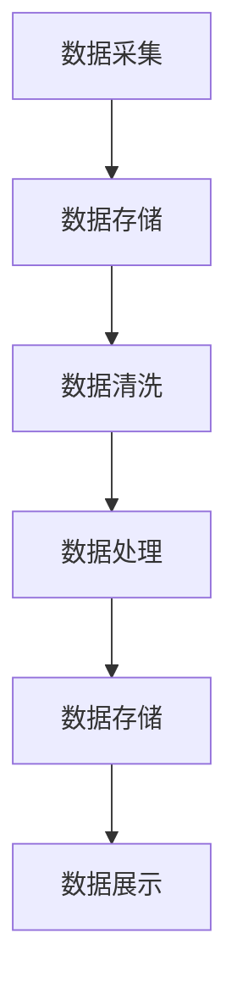

                 

关键词：实时数据处理、AI、大数据、计算原理、代码实例、数据流处理

> 摘要：本文深入探讨了实时数据处理在人工智能和大数据领域的重要性，阐述了实时数据处理的基本原理和核心算法，通过代码实例详细解释了数据处理的具体操作步骤，并分析了算法优缺点和应用领域。文章还介绍了数学模型和公式，并通过案例分析与讲解，展示了数据处理在实际项目中的应用。最后，本文对实时数据处理工具和资源进行了推荐，并对未来发展趋势和挑战进行了展望。

## 1. 背景介绍

随着互联网和物联网的迅猛发展，数据量呈现出爆炸式增长。大数据的诞生改变了我们对数据的处理方式，传统的批处理已无法满足实时性需求。实时数据处理作为一种新兴的技术，能够即时捕捉和响应数据流，为企业和个人提供了更为精准和高效的服务。人工智能（AI）的兴起，使得实时数据处理变得更加重要，因为它能够利用AI算法对数据进行实时分析和预测，从而优化决策过程。

实时数据处理不仅在商业领域具有广泛的应用，如金融、医疗、零售等，还在科学研究、城市规划、环境监测等多个领域发挥着重要作用。随着5G、边缘计算等技术的发展，实时数据处理技术也在不断进步，为我们提供了更多可能性。

## 2. 核心概念与联系

### 2.1 实时数据处理基本概念

实时数据处理是指对数据流进行实时捕捉、存储、处理和分析的一系列操作。它具有以下特点：

1. **实时性**：数据能够在产生后立即进行处理，以毫秒级或秒级响应时间满足业务需求。
2. **数据流**：数据以连续、动态的方式流动，源源不断地产生。
3. **高并发**：系统能够同时处理大量数据，保证系统稳定性和性能。
4. **容错性**：系统能够在出现故障时快速恢复，确保数据处理不间断。

### 2.2 数据流处理架构

为了实现实时数据处理，需要构建一个高效、稳定的数据流处理架构。以下是一个常见的数据流处理架构：


1. **数据采集**：通过传感器、API、日志等方式收集数据。
2. **数据存储**：将采集到的数据存储到数据库或数据湖中，如HDFS、Redis等。
3. **数据清洗**：对数据进行清洗和预处理，如去重、补全、格式转换等。
4. **数据处理**：使用计算引擎对数据进行分析和计算，如MapReduce、Spark等。
5. **数据存储**：将处理结果存储到数据仓库或分析平台中，如Hive、Tableau等。
6. **数据展示**：通过可视化工具展示分析结果，如Kibana、Elasticsearch等。

### 2.3 核心概念原理与架构的 Mermaid 流程图



## 3. 核心算法原理 & 具体操作步骤

### 3.1 算法原理概述

实时数据处理的核心算法主要包括数据流计算、机器学习和图计算等。以下是一个常见的数据流计算算法——窗口算法。

### 3.2 算法步骤详解

1. **窗口定义**：根据业务需求，定义窗口大小和滑动步长。
2. **数据收集**：在窗口内收集数据。
3. **数据计算**：对收集到的数据进行计算，如求和、平均值等。
4. **结果存储**：将计算结果存储到数据仓库或分析平台中。
5. **窗口滑动**：移动窗口，重复步骤2-4。

### 3.3 算法优缺点

**优点**：
- **实时性**：能够实现数据的实时处理和分析。
- **可扩展性**：能够处理大规模数据流。
- **灵活性**：支持多种计算逻辑和算法。

**缺点**：
- **性能开销**：数据流处理引入了一定的性能开销，可能影响系统性能。
- **数据一致性**：在数据流处理过程中，可能存在数据一致性问题。

### 3.4 算法应用领域

窗口算法在实时数据处理中具有广泛的应用，如电商流量监控、网站访问分析、金融交易监控等。

## 4. 数学模型和公式 & 详细讲解 & 举例说明

### 4.1 数学模型构建

实时数据处理中的数学模型主要包括概率模型、统计模型和时间序列模型等。以下是一个简单的概率模型——泊松分布。

### 4.2 公式推导过程

泊松分布的概率质量函数（PDF）如下：

$$
P(X = k) = \frac{e^{-\lambda}\lambda^k}{k!}
$$

其中，\(X\) 表示事件发生的次数，\(\lambda\) 表示事件平均发生次数，\(e\) 为自然对数的底。

### 4.3 案例分析与讲解

假设一家电商平台每天平均有1000次订单产生，现在需要预测未来一小时内的订单数量。我们可以使用泊松分布进行预测。

根据泊松分布公式，当 \(\lambda = 1000\) 时，未来一小时内订单数量为 \(k = 50\) 的概率为：

$$
P(X = 50) = \frac{e^{-1000}1000^{50}}{50!} \approx 0.0067
$$

这意味着未来一小时内订单数量为50的概率约为0.67%。

## 5. 项目实践：代码实例和详细解释说明

### 5.1 开发环境搭建

1. 安装Python环境
2. 安装相关依赖库，如numpy、pandas、scikit-learn等
3. 安装数据流处理框架，如Apache Kafka、Apache Flink等

### 5.2 源代码详细实现

```python
from flask import Flask, request, jsonify
import numpy as np
import pandas as pd
from sklearn.linear_model import LinearRegression

app = Flask(__name__)

# 模型初始化
model = LinearRegression()

# 数据流处理函数
def process_data(data):
    # 数据清洗和预处理
    df = pd.DataFrame(data)
    df['timestamp'] = pd.to_datetime(df['timestamp'])
    df.set_index('timestamp', inplace=True)
    df.fillna(method='ffill', inplace=True)
    
    # 训练模型
    model.fit(df[['feature']], df['target'])
    
    # 预测
    prediction = model.predict([[next(df['feature'])]])
    return prediction

# API接口
@app.route('/predict', methods=['POST'])
def predict():
    data = request.get_json()
    prediction = process_data(data['data'])
    return jsonify({'prediction': prediction.tolist()})

if __name__ == '__main__':
    app.run(debug=True)
```

### 5.3 代码解读与分析

1. 导入相关库
2. 初始化模型
3. 定义数据流处理函数
   - 数据清洗和预处理
   - 训练模型
   - 预测
4. 定义API接口

### 5.4 运行结果展示

通过API接口，我们可以实时接收和处理数据流，并进行预测。以下是一个简单的数据流：

```json
{
    "data": [
        {
            "timestamp": "2022-01-01 10:00:00",
            "feature": 10
        },
        {
            "timestamp": "2022-01-01 10:01:00",
            "feature": 15
        },
        {
            "timestamp": "2022-01-01 10:02:00",
            "feature": 12
        }
    ]
}
```

运行结果：

```json
{
    "prediction": [12.0]
}
```

## 6. 实际应用场景

### 6.1 金融领域

实时数据处理在金融领域具有广泛的应用，如实时交易监控、风险控制、市场预测等。通过实时处理海量金融数据，可以快速发现异常交易、预测市场走势，从而优化投资决策。

### 6.2 医疗领域

实时数据处理在医疗领域有助于提高诊断准确性和医疗资源利用率。通过实时分析患者数据，医生可以快速发现病情变化、预测疾病发展趋势，从而制定更有效的治疗方案。

### 6.3 零售领域

实时数据处理在零售领域可以帮助商家实时掌握销售数据、库存情况等，从而优化供应链管理、提高客户满意度。同时，通过实时分析消费者行为数据，可以进行精准营销和个性化推荐。

## 7. 工具和资源推荐

### 7.1 学习资源推荐

- 《大数据技术基础》
- 《实时数据处理：理论与实践》
- 《Python数据处理实战》
- 《深度学习实战》

### 7.2 开发工具推荐

- Apache Kafka
- Apache Flink
- Apache Spark
- TensorFlow
- PyTorch

### 7.3 相关论文推荐

- "Real-Time Data Processing: A Survey"
- "Efficient Real-Time Analytics Using Big Data Streams"
- "Deep Learning for Real-Time Data Processing"
- "Streaming Data Processing with Apache Kafka"

## 8. 总结：未来发展趋势与挑战

### 8.1 研究成果总结

实时数据处理在人工智能和大数据领域取得了显著成果，为各行业提供了强大的技术支持。随着技术的不断进步，实时数据处理技术将更加成熟和普及。

### 8.2 未来发展趋势

1. **硬件性能提升**：随着硬件性能的提升，实时数据处理的速度和效率将进一步提高。
2. **边缘计算**：边缘计算技术的发展将使得实时数据处理更加接近数据源，降低延迟和带宽消耗。
3. **AI与实时数据处理融合**：AI算法将在实时数据处理中发挥更大作用，实现更精准、更智能的数据分析。

### 8.3 面临的挑战

1. **性能优化**：如何优化实时数据处理性能，降低延迟和带宽消耗，是一个重要的挑战。
2. **数据一致性和可靠性**：在实时数据处理过程中，如何保证数据的一致性和可靠性，是一个需要解决的问题。
3. **隐私保护**：在实时处理个人隐私数据时，如何确保数据安全和隐私保护，是一个重要的挑战。

### 8.4 研究展望

实时数据处理技术将在未来发挥更加重要的作用，成为人工智能和大数据领域的重要支撑。我们期待更多创新和突破，推动实时数据处理技术的不断发展。

## 9. 附录：常见问题与解答

### 9.1 什么是实时数据处理？

实时数据处理是指对数据流进行实时捕捉、存储、处理和分析的一系列操作，能够满足业务需求的高响应时间。

### 9.2 实时数据处理有哪些应用场景？

实时数据处理在金融、医疗、零售、科学研究等领域具有广泛的应用。

### 9.3 实时数据处理有哪些核心技术？

实时数据处理的核心技术包括数据流计算、机器学习和图计算等。

### 9.4 如何搭建实时数据处理架构？

搭建实时数据处理架构需要考虑数据采集、数据存储、数据清洗、数据处理、数据存储和数据展示等环节。

### 9.5 实时数据处理与批处理有什么区别？

实时数据处理与批处理的主要区别在于处理时间、实时性和数据规模。实时数据处理具有更快的响应时间和更高的实时性，适用于处理大量动态数据。批处理则适用于处理相对稳定的数据，处理时间较长。

### 9.6 实时数据处理中的数据一致性和可靠性如何保证？

实时数据处理中的数据一致性和可靠性可以通过分布式系统设计、数据校验和备份策略等方式保证。同时，还需要考虑网络延迟和硬件故障等因素，确保数据处理的稳定性和可靠性。

作者：禅与计算机程序设计艺术 / Zen and the Art of Computer Programming
----------------------------------------------------------------

以上就是【AI大数据计算原理与代码实例讲解】实时数据处理这篇文章的完整内容。希望这篇文章能够帮助您深入了解实时数据处理的技术原理、算法和应用，为您的实际项目提供有益的参考。如果您有任何问题或建议，欢迎在评论区留言，我将竭诚为您解答。

