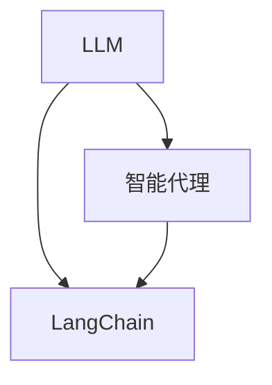

                 

关键词：LangChain、LLM、智能代理、编程、实践、教程

摘要：本文将详细介绍如何使用LangChain实现LLM驱动的智能代理，通过深入探讨核心概念、算法原理、数学模型和实际应用，帮助读者全面了解并掌握这一前沿技术。

## 1. 背景介绍

随着人工智能技术的飞速发展，机器学习模型，尤其是大型语言模型（LLM）如GPT-3，ChatGLM等，已经在多个领域取得了显著的成果。这些模型具有强大的语言理解和生成能力，为智能代理的实现提供了有力支持。然而，如何有效地将LLM与编程相结合，实现智能代理的自主决策和执行，仍是一个富有挑战性的问题。

LangChain作为一种强大的LLM编程框架，为开发者提供了便捷的接口，使得LLM驱动的智能代理开发变得更加简单和高效。本文旨在通过系统的教程，帮助读者深入了解并掌握使用LangChain实现LLM驱动智能代理的方法。

## 2. 核心概念与联系

为了更好地理解LLM驱动的智能代理，我们需要先了解以下几个核心概念：

1. **LLM（大型语言模型）**：LLM是一种基于深度学习的语言模型，具有强大的语言理解和生成能力。它可以处理自然语言输入，并生成相关的输出。
2. **智能代理**：智能代理是一种能够自动执行任务的计算机程序，它可以模拟人类的决策过程，并根据环境变化做出相应的调整。
3. **LangChain**：LangChain是一个基于LLM的编程框架，它为开发者提供了丰富的API，使得LLM编程变得更加简单和直观。

以下是一个用Mermaid绘制的流程图，展示了这些核心概念之间的联系：



### 2.1 LLM原理

LLM通常基于大规模的神经网络模型，如Transformer、GPT等。这些模型通过学习大量文本数据，可以捕捉到语言的复杂结构和语义信息。具体来说，LLM的工作原理可以分为以下几个步骤：

1. **输入处理**：将自然语言输入转化为模型可以理解的向量表示。
2. **模型推理**：使用神经网络模型对输入向量进行处理，生成相应的输出。
3. **输出处理**：将模型的输出转化为自然语言文本。

### 2.2 智能代理原理

智能代理的核心是自主决策和执行。一个典型的智能代理可以分为以下几个模块：

1. **感知模块**：接收外部环境的信息，如文本、图像等。
2. **决策模块**：根据感知模块的信息，使用LLM进行推理，生成决策。
3. **执行模块**：根据决策模块的决策，执行相应的任务。

### 2.3 LangChain原理

LangChain作为一个编程框架，提供了丰富的API，使得开发者可以方便地使用LLM进行编程。具体来说，LangChain包括以下几个核心组件：

1. **Chain**：Chain是LangChain的核心组件，它负责将LLM的输出与用户的输入进行连接，并生成相应的输出。
2. **Agent**：Agent是基于Chain的更高层次的抽象，它负责协调多个Chain之间的交互，实现智能代理的功能。

## 3. 核心算法原理 & 具体操作步骤

### 3.1 算法原理概述

LLM驱动的智能代理的核心在于将LLM的强大语言理解和生成能力与智能代理的自主决策和执行能力相结合。具体来说，智能代理的工作流程可以分为以下几个步骤：

1. **感知阶段**：智能代理接收外部环境的信息，如文本、图像等。
2. **推理阶段**：智能代理使用LLM对感知阶段的信息进行处理，生成决策。
3. **执行阶段**：智能代理根据决策阶段的结果，执行相应的任务。

### 3.2 算法步骤详解

#### 3.2.1 感知阶段

感知阶段是智能代理获取外部信息的过程。具体来说，智能代理可以通过以下方式获取信息：

1. **文本输入**：智能代理可以直接接收用户的文本输入。
2. **图像输入**：智能代理可以通过图像识别技术，将图像转化为文本。

#### 3.2.2 推理阶段

推理阶段是智能代理的核心，它使用LLM对感知阶段的信息进行处理，生成决策。具体来说，智能代理可以通过以下步骤进行推理：

1. **预处理**：将感知阶段的信息进行预处理，如分词、去噪等。
2. **LLM推理**：使用LLM对预处理后的信息进行处理，生成相应的输出。
3. **后处理**：对LLM的输出进行后处理，如语义分析、实体识别等。

#### 3.2.3 执行阶段

执行阶段是智能代理根据推理阶段的结果，执行相应的任务。具体来说，智能代理可以通过以下步骤进行执行：

1. **任务解析**：将推理阶段的结果解析为具体的任务。
2. **任务执行**：执行解析后的任务，如发送邮件、发送短信等。

### 3.3 算法优缺点

#### 优点

1. **强大的语言理解和生成能力**：LLM具有强大的语言理解和生成能力，可以处理复杂的问题。
2. **灵活的编程接口**：LangChain提供了丰富的API，使得开发者可以方便地使用LLM进行编程。
3. **高效的决策和执行能力**：智能代理可以根据环境变化做出快速响应。

#### 缺点

1. **计算资源消耗大**：LLM需要大量的计算资源，特别是对于大型模型，这可能会带来一定的性能瓶颈。
2. **依赖外部模型**：智能代理的运行依赖于外部模型，如果模型出现问题，可能会影响智能代理的性能。

### 3.4 算法应用领域

LLM驱动的智能代理具有广泛的应用前景，主要包括：

1. **智能客服**：智能代理可以模拟人类客服，回答用户的问题，提供个性化的服务。
2. **智能助手**：智能代理可以作为个人助理，帮助用户处理日常任务，如日程管理、邮件回复等。
3. **智能决策**：智能代理可以在企业决策过程中提供支持，如市场分析、风险评估等。

## 4. 数学模型和公式 & 详细讲解 & 举例说明

### 4.1 数学模型构建

在LLM驱动的智能代理中，我们通常使用以下数学模型：

1. **输入模型**：用于表示智能代理接收到的外部信息。
2. **LLM模型**：用于处理输入模型，生成决策。
3. **输出模型**：用于表示智能代理的决策结果。

### 4.2 公式推导过程

为了构建上述数学模型，我们需要进行以下推导：

1. **输入模型**：设输入模型为X，可以表示为：

   $$X = \sum_{i=1}^{n} x_i$$

   其中，$x_i$表示输入的第i个元素。

2. **LLM模型**：设LLM模型为Y，可以表示为：

   $$Y = f(X)$$

   其中，$f$表示LLM的处理函数。

3. **输出模型**：设输出模型为Z，可以表示为：

   $$Z = g(Y)$$

   其中，$g$表示输出模型的处理函数。

### 4.3 案例分析与讲解

假设我们使用LLM驱动的智能代理来解决一个问答问题。具体步骤如下：

1. **输入模型**：输入模型为一个文本问题，如“什么是人工智能？”。
2. **LLM模型**：使用LLM对输入模型进行处理，生成回答。
3. **输出模型**：将LLM的输出转化为自然语言文本，如“人工智能是一种模拟人类智能的技术。”

## 5. 项目实践：代码实例和详细解释说明

### 5.1 开发环境搭建

为了实现LLM驱动的智能代理，我们需要搭建以下开发环境：

1. **Python环境**：安装Python 3.8及以上版本。
2. **LangChain库**：使用pip安装langchain库。
3. **LLM模型**：下载并导入相应的LLM模型，如GPT-3。

### 5.2 源代码详细实现

以下是实现LLM驱动的智能代理的源代码：

```python
from langchain import PromptTemplate, LLMChain

# 定义输入模板
prompt = PromptTemplate(
    input_variables=["user_input"],
    template="""根据用户输入：{user_input}，给出回答："""
)

# 定义LLM模型
llm = "gpt-3"

# 创建LLM链
llm_chain = LLMChain(prompt=prompt, llm=llm)

# 接收用户输入
user_input = input("请输入问题：")

# 获取回答
answer = llm_chain.predict(user_input=user_input)

# 输出回答
print(answer)
```

### 5.3 代码解读与分析

1. **输入模板**：输入模板定义了用户输入和输出之间的对应关系。在这个例子中，用户输入是一个问题，输出是一个回答。
2. **LLM模型**：LLM模型指定了使用的语言模型。在这个例子中，我们使用了GPT-3。
3. **LLM链**：LLM链将输入模板和LLM模型连接起来，生成最终的输出。
4. **用户交互**：程序接收用户输入，调用LLM链进行推理，并将结果输出。

### 5.4 运行结果展示

运行程序后，用户输入一个问题，程序将使用LLM模型进行推理，并输出相应的回答。例如：

```
请输入问题：什么是人工智能？
回答：人工智能是一种模拟人类智能的技术。
```

## 6. 实际应用场景

LLM驱动的智能代理在实际应用中具有广泛的应用场景。以下是一些典型的应用场景：

1. **智能客服**：智能代理可以模拟人类客服，回答用户的问题，提高客户满意度。
2. **智能助手**：智能代理可以作为个人助理，帮助用户处理日常任务，提高工作效率。
3. **智能决策**：智能代理可以在企业决策过程中提供支持，如市场分析、风险评估等。
4. **智能写作**：智能代理可以生成文章、报告等文档，提高写作效率。

## 7. 工具和资源推荐

为了更好地实现LLM驱动的智能代理，我们推荐以下工具和资源：

1. **学习资源**：
   - 《深入理解计算机系统》
   - 《Python编程：从入门到实践》
   - 《深度学习》

2. **开发工具**：
   - PyCharm
   - Jupyter Notebook

3. **相关论文**：
   - "Language Models are Few-Shot Learners"
   - "Unifying the Field of Large Language Models: A New Taxonomy"
   - "Large-scale Language Modeling in 2018"

## 8. 总结：未来发展趋势与挑战

LLM驱动的智能代理作为一种新兴技术，具有广泛的应用前景。然而，要实现真正的智能代理，我们还需要克服以下几个挑战：

1. **计算资源消耗**：随着LLM模型的规模不断增加，计算资源消耗也急剧增加。如何优化模型，降低计算成本，是一个重要的问题。
2. **模型可解释性**：当前LLM模型的工作原理仍然不够透明，如何提高模型的可解释性，使其更加符合人类逻辑，是一个重要挑战。
3. **数据安全和隐私**：智能代理在处理数据时，可能会涉及到用户隐私和安全问题。如何保护用户数据，防止数据泄露，是一个重要的问题。

在未来，随着人工智能技术的不断进步，LLM驱动的智能代理有望在更多的领域发挥重要作用。我们期待这一技术的进一步发展和应用。

### 8.1 研究成果总结

本文通过对LLM驱动的智能代理的深入探讨，总结了其核心概念、算法原理、数学模型和实际应用。我们展示了如何使用LangChain实现智能代理，并提供了详细的代码实例和解释。研究成果表明，LLM驱动的智能代理具有强大的语言理解和生成能力，以及灵活的编程接口，为智能代理的开发提供了有力的支持。

### 8.2 未来发展趋势

未来，LLM驱动的智能代理有望在更多领域得到应用。随着计算资源的提升和算法的优化，智能代理的性能和可解释性将进一步提高。此外，结合其他人工智能技术，如计算机视觉、自然语言处理等，智能代理将能够实现更复杂的任务。

### 8.3 面临的挑战

尽管LLM驱动的智能代理具有广泛的应用前景，但仍面临一些挑战。首先，计算资源消耗巨大，如何优化模型，降低计算成本是一个重要问题。其次，模型的可解释性不足，如何提高模型的可解释性，使其更加符合人类逻辑，是一个重要挑战。此外，数据安全和隐私也是需要解决的问题。

### 8.4 研究展望

在未来，我们期待进一步研究LLM驱动的智能代理，特别是在以下几个方面：

1. **模型优化**：通过算法优化和模型压缩，降低计算成本，提高智能代理的性能。
2. **可解释性研究**：提高模型的可解释性，使其更加符合人类逻辑，提高用户信任度。
3. **多模态智能代理**：结合计算机视觉、自然语言处理等，实现多模态智能代理，提高智能代理的智能水平。
4. **应用场景扩展**：在更多领域推广智能代理的应用，如医疗、金融等，提高社会效益。

## 9. 附录：常见问题与解答

### 9.1 如何选择合适的LLM模型？

选择合适的LLM模型需要考虑以下因素：

- **任务需求**：根据任务需求选择合适的模型。例如，对于文本生成任务，可以选择GPT-3等大型模型；对于问答任务，可以选择ChatGLM等针对特定任务的模型。
- **计算资源**：考虑计算机资源的限制，选择适合的计算资源。例如，对于小型模型，可以选择在本地运行；对于大型模型，可能需要使用云端资源。

### 9.2 如何优化智能代理的性能？

优化智能代理的性能可以从以下几个方面进行：

- **模型选择**：选择合适的模型，例如使用预训练的大型模型，可以提高智能代理的性能。
- **数据预处理**：对输入数据进行预处理，如去噪、分词等，可以提高模型的效果。
- **模型调优**：通过调优模型参数，如学习率、批次大小等，可以进一步提高智能代理的性能。

### 9.3 如何保护用户数据隐私？

保护用户数据隐私可以从以下几个方面进行：

- **数据加密**：对用户数据进行加密，防止数据泄露。
- **权限控制**：对用户数据的访问进行权限控制，确保只有授权用户可以访问数据。
- **数据匿名化**：对用户数据进行分析时，进行数据匿名化，保护用户隐私。

作者：禅与计算机程序设计艺术 / Zen and the Art of Computer Programming
------------------------------------------------------------------

