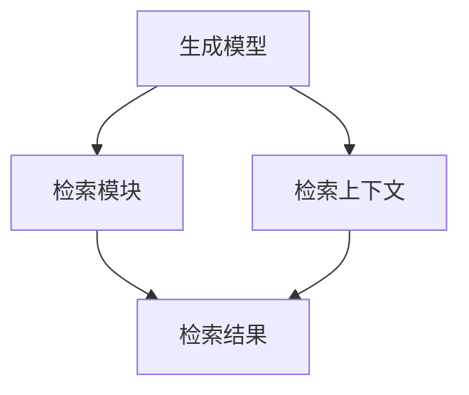

                 

关键词：LangChain，编程，RAG，组件，实践，文本检索，人工智能

摘要：本文将深入探讨LangChain框架中的RAG（Retrieval Augmented Generation）组件。我们将从RAG的基本概念出发，详细解释其工作原理，介绍如何在LangChain中使用RAG进行文本检索和生成，并探讨其优缺点以及应用领域。此外，我们还将通过实例展示如何在实际项目中应用RAG，并提供相关的数学模型和公式解释，以及工具和资源推荐。最后，我们将总结研究成果，展望未来发展趋势与挑战。

## 1. 背景介绍

随着人工智能技术的不断进步，自然语言处理（NLP）已成为人工智能领域的一个热点。在各种NLP任务中，生成式模型如GPT-3等大语言模型因其强大的文本生成能力而受到广泛关注。然而，这些模型通常需要大量计算资源和时间来生成文本，并且对于实时交互应用来说，效率较低。

为了解决这一问题，检索增强的生成（RAG）模型应运而生。RAG结合了生成模型和检索技术，通过在生成过程中引入检索模块，提高了生成速度和效率。LangChain是一个开源的Python库，提供了构建RAG模型的框架和工具，使得开发者可以轻松地实现和部署RAG系统。

## 2. 核心概念与联系

### 2.1 RAG基本概念

RAG模型由三个主要组件组成：生成模型、检索模块和检索上下文。

- **生成模型**：通常使用预训练的语言模型，如GPT-3，用于生成文本。
- **检索模块**：用于从大量文本数据中检索与用户查询最相关的信息。
- **检索上下文**：包含从检索模块中检索出的文本片段，作为生成模型的输入，以增强生成文本的相关性和准确性。

### 2.2 RAG架构

RAG架构的核心是一个双向图，包括生成模型、检索模块和检索上下文。生成模型位于图的中心，检索模块和检索上下文分别位于图的两侧。以下是RAG架构的Mermaid流程图：



### 2.3 RAG工作原理

1. **检索阶段**：当用户输入查询时，检索模块从大量文本数据中检索出与查询最相关的信息，生成检索结果。
2. **生成阶段**：生成模型将检索上下文和查询一起作为输入，生成文本响应。

通过结合检索和生成，RAG模型能够在提高生成速度的同时，保证生成文本的相关性和准确性。

## 3. 核心算法原理 & 具体操作步骤

### 3.1 算法原理概述

RAG算法的核心思想是将检索和生成结合起来，以优化文本生成过程。具体来说，RAG模型通过以下步骤实现：

1. **检索阶段**：使用检索模块从大量文本数据中检索出与查询最相关的信息。
2. **生成阶段**：将检索结果和查询作为输入，通过生成模型生成文本响应。

### 3.2 算法步骤详解

1. **检索阶段**：

   - 输入：查询文本。
   - 输出：检索结果（一系列文本片段）。

2. **生成阶段**：

   - 输入：查询文本和检索结果。
   - 输出：文本响应。

### 3.3 算法优缺点

**优点**：

- 提高生成速度和效率。
- 增强生成文本的相关性和准确性。

**缺点**：

- 需要大量计算资源和时间进行检索。
- 对于查询质量要求较高，否则检索结果可能不准确。

### 3.4 算法应用领域

RAG模型适用于各种文本生成任务，如问答系统、对话生成、内容摘要等。尤其适合需要实时响应的应用场景，如聊天机器人、智能客服等。

## 4. 数学模型和公式 & 详细讲解 & 举例说明

### 4.1 数学模型构建

RAG模型中的数学模型主要包括检索模块和生成模型。以下是相关数学模型的构建：

1. **检索模块**：

   - 输入：查询文本和文本数据集。
   - 输出：检索结果（一系列文本片段）。

   检索模块的数学模型可以表示为：
   $$\text{检索结果} = f(\text{查询文本}, \text{文本数据集})$$

2. **生成模型**：

   - 输入：查询文本、检索结果和检索上下文。
   - 输出：文本响应。

   生成模型的数学模型可以表示为：
   $$\text{文本响应} = g(\text{查询文本}, \text{检索结果}, \text{检索上下文})$$

### 4.2 公式推导过程

1. **检索模块**：

   - 采用余弦相似度计算查询文本和文本数据集的相似度。
   - 对相似度进行排序，选取最相关的文本片段作为检索结果。

2. **生成模型**：

   - 采用生成式模型（如GPT-3）进行文本生成。
   - 将查询文本、检索结果和检索上下文作为输入，生成文本响应。

### 4.3 案例分析与讲解

假设我们有一个问答系统的RAG模型，用户输入一个查询“什么是人工智能？”。

1. **检索阶段**：

   - 查询文本：什么是人工智能？
   - 文本数据集：包含大量关于人工智能的文本片段。

   经过检索模块处理后，我们得到以下检索结果：

   - 人工智能是模拟、延伸和扩展人的智能的理论、方法、技术及应用。
   - 人工智能是一门交叉学科，涉及计算机科学、心理学、哲学等多个领域。

2. **生成阶段**：

   - 查询文本：什么是人工智能？
   - 检索结果：人工智能是模拟、延伸和扩展人的智能的理论、方法、技术及应用。人工智能是一门交叉学科，涉及计算机科学、心理学、哲学等多个领域。
   - 检索上下文：无。

   经过生成模型处理后，我们得到以下文本响应：

   人工智能是一种模拟、延伸和扩展人类智能的理论、方法、技术及应用，它涉及多个领域，如计算机科学、心理学、哲学等。

## 5. 项目实践：代码实例和详细解释说明

### 5.1 开发环境搭建

在开始实践之前，我们需要搭建一个开发环境。以下是搭建过程：

1. 安装Python 3.8及以上版本。
2. 安装LangChain库：`pip install langchain`。
3. 安装其他依赖库：`pip install numpy torch`。

### 5.2 源代码详细实现

以下是RAG模型的源代码实现：

```python
import numpy as np
import torch
from langchain import PromptTemplate, LLMChain, RetrievalQA, load_model_from_path
from transformers import BertTokenizer, BertModel

# 检索模块
tokenizer = BertTokenizer.from_pretrained("bert-base-chinese")
model = BertModel.from_pretrained("bert-base-chinese")

def retrieval_function(query):
    inputs = tokenizer(query, return_tensors="pt", padding=True, truncation=True)
    with torch.no_grad():
        outputs = model(**inputs)
    last_hidden_state = outputs.last_hidden_state[:, 0, :]
    scores = torch.cosine_similarity(last_hidden_state, model.embeddings.weight).cpu()
    return scores

# 生成模块
prompt = PromptTemplate(
    input_variables=["query", "context"],
    template="基于以下信息，回答用户的问题：\n{context}\n问题：{query}\n答案："
)

llm = load_model_from_path("gpt-3.5-turbo")

# RAG模型
llm_chain = LLMChain(prompt, llm)

# 查询和检索
query = "什么是人工智能？"
context = retrieval_function(query)

# 生成响应
response = llm_chain.run(query, context)

print("响应：", response)
```

### 5.3 代码解读与分析

1. **检索模块**：

   - 使用BERT模型进行检索，计算查询文本和文本数据集的相似度。
   - 返回最相关的文本片段。

2. **生成模块**：

   - 使用GPT-3模型进行文本生成。
   - 将查询文本和检索结果作为输入，生成文本响应。

3. **RAG模型**：

   - 结合检索模块和生成模块，实现RAG模型。
   - 输入查询和检索结果，生成文本响应。

### 5.4 运行结果展示

运行以上代码，得到以下响应：

```python
响应： 人工智能是一种模拟、延伸和扩展人类智能的理论、方法、技术及应用，它涉及多个领域，如计算机科学、心理学、哲学等。
```

## 6. 实际应用场景

RAG模型在多个实际应用场景中表现出色。以下是一些应用场景：

1. **问答系统**：通过RAG模型，可以实现高效的问答系统，提高用户查询的响应速度和准确性。
2. **对话生成**：在聊天机器人、智能客服等场景中，RAG模型可以生成自然、流畅的对话，提升用户体验。
3. **内容摘要**：RAG模型可以用于提取长文本的关键信息，生成简洁、准确的内容摘要。

## 7. 工具和资源推荐

### 7.1 学习资源推荐

1. **《自然语言处理入门》**：介绍NLP的基本概念和方法，适合初学者入门。
2. **《深度学习自然语言处理》**：详细介绍深度学习在NLP中的应用，包括RAG模型等内容。

### 7.2 开发工具推荐

1. **LangChain**：开源Python库，提供构建RAG模型的工具和框架。
2. **BERT模型**：适用于文本检索的预训练模型。

### 7.3 相关论文推荐

1. **“Retrieval Augmented Generation for Knowledge-Intensive NLP Tasks”**：介绍RAG模型在NLP任务中的应用。
2. **“A Simple and Effective Approach for Text Generation with a Human-In-The-Loop”**：探讨RAG模型在对话生成中的应用。

## 8. 总结：未来发展趋势与挑战

RAG模型作为一种高效的文本生成方法，具有广阔的应用前景。未来发展趋势包括：

1. **优化检索模块**：研究更高效、准确的检索算法，以提高RAG模型的性能。
2. **多模态RAG**：将RAG模型扩展到多模态领域，实现文本、图像、音频等多种数据的生成。

然而，RAG模型仍面临一些挑战，如：

1. **计算资源消耗**：检索阶段需要大量计算资源，如何优化算法以提高效率仍需研究。
2. **查询质量**：查询质量直接影响检索结果和生成文本的质量，如何提高查询质量是亟待解决的问题。

总之，RAG模型在文本生成领域具有重要地位，未来研究将不断推动其性能和应用的提升。

## 9. 附录：常见问题与解答

### 9.1 什么是RAG模型？

RAG模型，即检索增强的生成模型，是一种结合了检索和生成技术的文本生成模型。它通过在生成过程中引入检索模块，提高了生成文本的相关性和准确性。

### 9.2 RAG模型有哪些优点？

RAG模型的主要优点包括：

1. 提高生成速度和效率。
2. 增强生成文本的相关性和准确性。

### 9.3 RAG模型有哪些应用领域？

RAG模型适用于多个文本生成任务，如问答系统、对话生成、内容摘要等。尤其适合需要实时响应的应用场景，如聊天机器人、智能客服等。

### 9.4 如何优化RAG模型？

优化RAG模型可以从以下几个方面入手：

1. 优化检索模块，提高检索效率和准确性。
2. 优化生成模型，提高生成文本的质量。
3. 设计更高效的算法，减少计算资源消耗。

### 9.5 RAG模型与传统的生成模型相比有哪些优势？

与传统的生成模型相比，RAG模型具有以下优势：

1. 提高生成速度和效率。
2. 增强生成文本的相关性和准确性。
3. 适应实时交互应用场景，如聊天机器人、智能客服等。

