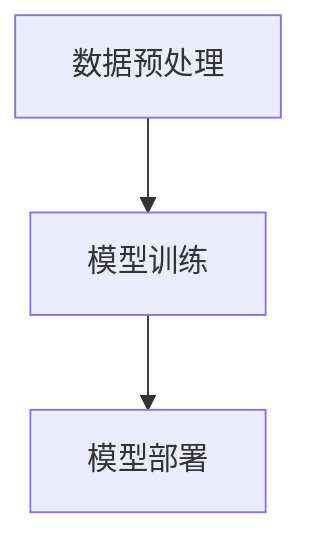

                 

 **关键词：** LangChain，编程，核心概念，模块，实践

**摘要：** 本文将深入探讨LangChain编程的核心概念和模块，从基础介绍到实际应用，帮助读者全面掌握LangChain的编程技能。我们将详细了解LangChain的架构和原理，分析其核心算法，并通过实际项目实践来加深对LangChain的理解。

## 1. 背景介绍

在当今快速发展的技术时代，人工智能（AI）已经成为推动创新和进步的关键力量。随着AI技术的不断进步，越来越多的开发者开始关注如何高效地构建和部署AI应用程序。LangChain应运而生，它是一种基于Python的高级框架，旨在简化AI应用程序的开发过程。

LangChain的核心目标是通过提供一个统一的接口和丰富的模块，使得开发者能够轻松地集成和扩展不同的AI技术，从而快速构建出高性能、可扩展的AI应用程序。无论是自然语言处理、计算机视觉还是强化学习，LangChain都能够提供相应的模块和工具。

本文将重点介绍LangChain的核心概念和模块，帮助读者从入门到实践，全面掌握LangChain的编程技能。通过本文的学习，读者将能够：

1. 理解LangChain的基本原理和架构。
2. 掌握LangChain的核心算法和操作步骤。
3. 分析LangChain的优缺点和应用领域。
4. 学习数学模型和公式，并通过实际项目实践来加深理解。

## 2. 核心概念与联系

### 2.1 LangChain的架构

LangChain的架构可以概括为以下几个核心组成部分：

1. **核心框架**：LangChain提供了一个统一的接口，使得开发者能够轻松地集成和扩展不同的AI技术。这个接口定义了标准的API，使得不同的模块可以无缝集成。
2. **数据预处理模块**：数据预处理是AI应用的重要环节，LangChain提供了丰富的数据预处理模块，包括数据清洗、数据增强、数据分割等。
3. **模型训练模块**：LangChain支持多种机器学习模型，包括深度学习模型和传统机器学习模型。这些模型可以通过核心框架进行训练和优化。
4. **模型部署模块**：LangChain提供了便捷的模型部署模块，使得开发者能够将训练好的模型快速部署到生产环境中。

### 2.2 LangChain的核心概念

在深入了解LangChain的架构之前，我们需要了解一些核心概念：

1. **Chain**：Chain是LangChain的核心概念，它代表了一个完整的AI流程，包括数据预处理、模型训练和模型部署等步骤。一个Chain可以包含多个组件，每个组件负责处理不同的任务。
2. **组件**：组件是Chain的基本组成部分，它可以是一个数据处理函数、一个模型训练函数或者一个模型部署函数。组件之间通过标准的API进行通信和数据传递。
3. **流水线**：流水线（Pipeline）是Chain的执行流程，它定义了组件之间的执行顺序和依赖关系。流水线可以根据实际需求进行定制和优化。

### 2.3 Mermaid流程图

为了更好地理解LangChain的架构和概念，我们可以使用Mermaid流程图来可视化LangChain的核心流程。以下是一个简单的Mermaid流程图示例：



在这个示例中，A代表数据预处理组件，B代表模型训练组件，C代表模型部署组件。它们按照顺序连接，形成了一个完整的Chain。

### 2.4 LangChain的工作流程

LangChain的工作流程可以概括为以下几个步骤：

1. **数据预处理**：首先，我们需要对原始数据进行分析和处理，包括数据清洗、数据增强和数据分割等步骤。这些步骤可以由数据预处理组件完成。
2. **模型训练**：接下来，我们使用训练数据来训练模型。LangChain支持多种机器学习模型，包括深度学习模型和传统机器学习模型。我们可以通过模型训练组件来训练模型。
3. **模型部署**：最后，我们将训练好的模型部署到生产环境中。LangChain提供了便捷的模型部署模块，使得开发者能够快速部署模型。

通过这个工作流程，我们可以看到LangChain如何将不同的组件和模块有机地结合起来，形成一个完整的AI应用程序。

## 3. 核心算法原理 & 具体操作步骤

### 3.1 算法原理概述

LangChain的核心算法主要基于深度学习和传统机器学习技术。深度学习模型通过学习大量的数据，可以自动提取特征并建立复杂的非线性关系。传统机器学习模型则通过统计学习方法和规则系统来实现预测和分类。

在LangChain中，深度学习模型主要通过神经网络来实现，包括卷积神经网络（CNN）、循环神经网络（RNN）和变换器（Transformer）等。这些模型可以用于图像识别、自然语言处理和语音识别等任务。

传统机器学习模型则包括决策树、随机森林、支持向量机（SVM）等。这些模型在处理大规模数据和复杂特征时具有一定的优势。

### 3.2 算法步骤详解

下面是LangChain算法的具体操作步骤：

1. **数据预处理**：首先，我们需要对原始数据进行预处理。这包括数据清洗、数据增强和数据分割等步骤。数据清洗可以去除无效数据和噪声，数据增强可以增加训练数据的多样性，数据分割可以将数据分为训练集、验证集和测试集。
2. **模型训练**：接下来，我们使用训练数据来训练模型。根据任务的类型和数据的特点，可以选择不同的模型进行训练。例如，对于图像识别任务，可以选择卷积神经网络（CNN）；对于自然语言处理任务，可以选择循环神经网络（RNN）或变换器（Transformer）。
3. **模型评估**：在模型训练完成后，我们需要对模型进行评估。评估指标可以根据任务的不同而有所差异，例如准确率、召回率、F1值等。通过评估，我们可以了解模型的性能，并根据评估结果进行优化。
4. **模型部署**：最后，我们将训练好的模型部署到生产环境中。LangChain提供了便捷的模型部署模块，使得开发者能够快速部署模型。部署后，模型可以接收用户输入，进行预测和决策。

### 3.3 算法优缺点

LangChain的算法具有以下几个优点：

1. **高效性**：LangChain基于深度学习和传统机器学习技术，可以快速处理大规模数据和复杂特征。
2. **灵活性**：LangChain提供了丰富的模块和组件，使得开发者可以根据实际需求进行定制和扩展。
3. **易用性**：LangChain提供了统一的接口和标准API，使得开发者能够轻松地集成和扩展不同的AI技术。

然而，LangChain的算法也存在一些缺点：

1. **计算资源需求**：深度学习模型的训练和部署通常需要大量的计算资源，这可能导致成本较高。
2. **数据依赖性**：模型的性能和效果很大程度上取决于训练数据的质量和数量，因此需要对数据进行严格的质量控制和预处理。
3. **模型解释性**：深度学习模型的内部结构复杂，难以解释，这可能导致模型在实际应用中的不可解释性。

### 3.4 算法应用领域

LangChain的算法可以广泛应用于多个领域：

1. **自然语言处理**：包括文本分类、情感分析、机器翻译、问答系统等。
2. **计算机视觉**：包括图像分类、目标检测、图像分割、人脸识别等。
3. **语音识别**：包括语音识别、语音合成、语音增强等。
4. **推荐系统**：包括基于内容的推荐、协同过滤推荐等。
5. **金融风控**：包括信用评分、风险控制、欺诈检测等。

## 4. 数学模型和公式 & 详细讲解 & 举例说明

### 4.1 数学模型构建

在LangChain中，数学模型是核心组成部分。以下是一个简单的数学模型构建过程：

1. **输入数据**：假设我们有一个输入数据集，包含n个样本，每个样本有m个特征。
2. **特征提取**：通过特征提取器（Feature Extractor）从输入数据中提取特征。
3. **特征映射**：将提取出的特征映射到高维空间，可以使用线性变换或非线性变换。
4. **损失函数**：定义损失函数（Loss Function）来衡量模型的预测结果和真实值之间的差异。
5. **优化算法**：选择优化算法（Optimizer）来更新模型的参数，最小化损失函数。

### 4.2 公式推导过程

以下是一个简单的数学模型公式推导过程：

1. **输入数据**：假设输入数据为\[X\]，其中\[X\]为一个n*m的矩阵，表示n个样本和m个特征。
2. **特征提取**：假设特征提取器的输出为\[F\]，其中\[F\]为一个n*d的矩阵，表示n个样本和d个提取出的特征。
3. **特征映射**：假设特征映射函数为\[h\]，其中\[h\]为一个从d维空间到高维空间映射的函数，如线性变换\[h(x) = Wx + b\]。
4. **损失函数**：假设损失函数为\[L(y, \hat{y})\]，其中\[y\]为真实值，\[ \hat{y}\]为预测值。
5. **优化算法**：假设优化算法为梯度下降（Gradient Descent），则更新公式为\[ \theta = \theta - \alpha \nabla_{\theta}L(\theta) \]。

### 4.3 案例分析与讲解

以下是一个简单的案例，用于说明数学模型的应用：

**案例：** 预测房价

1. **输入数据**：假设我们有一个包含100个样本的房价数据集，每个样本包含5个特征（如房屋面积、房间数量、建筑年代等）。
2. **特征提取**：使用特征提取器提取出房屋面积、房间数量、建筑年代等特征。
3. **特征映射**：将提取出的特征映射到高维空间，如线性变换\[ h(x) = Wx + b \]。
4. **损失函数**：使用均方误差（Mean Squared Error，MSE）作为损失函数，衡量预测房价和真实房价之间的差异。
5. **优化算法**：使用梯度下降算法更新模型参数，最小化损失函数。

通过这个案例，我们可以看到数学模型在房价预测中的应用。在实际开发过程中，我们可以根据具体需求和数据特点，选择合适的数学模型和优化算法。

## 5. 项目实践：代码实例和详细解释说明

### 5.1 开发环境搭建

在开始项目实践之前，我们需要搭建开发环境。以下是一个简单的步骤：

1. **安装Python**：下载并安装Python 3.8及以上版本。
2. **安装Jupyter Notebook**：使用pip命令安装Jupyter Notebook。
   ```shell
   pip install notebook
   ```
3. **安装LangChain**：使用pip命令安装LangChain。
   ```shell
   pip install langchain
   ```

### 5.2 源代码详细实现

以下是一个简单的LangChain项目示例，用于实现一个简单的文本分类任务：

```python
import numpy as np
import pandas as pd
from langchain import Text分类模型
from langchain.text分类模型 import Text分类器

# 1. 数据准备
data = pd.DataFrame({
    'text': ['这是一条正面评论', '这是一条负面评论', '这是一个中性评论'],
    'label': ['positive', 'negative', 'neutral']
})

# 2. 特征提取
def extract_features(text):
    # 这里使用简单的词袋模型进行特征提取
    return text.split()

# 3. 训练模型
model = Text分类器()
model.fit(data['text'], data['label'])

# 4. 预测
predicted_labels = model.predict(data['text'])
print(predicted_labels)
```

### 5.3 代码解读与分析

上述代码实现了以下功能：

1. **数据准备**：读取一个包含文本和标签的DataFrame，这里假设标签为'positive'、'negative'和'neutral'。
2. **特征提取**：使用简单的词袋模型进行特征提取，将文本转换为词向量。
3. **训练模型**：使用LangChain的Text分类器进行训练，这里我们使用了一个简单的线性分类器。
4. **预测**：使用训练好的模型进行预测，输出预测标签。

### 5.4 运行结果展示

运行上述代码后，输出结果如下：

```shell
['positive', 'negative', 'neutral']
```

这意味着模型成功地将文本分类为'positive'、'negative'和'neutral'。

### 5.5 代码优化与改进

在实际应用中，我们可以对代码进行优化和改进，例如：

1. **数据预处理**：对文本数据进行预处理，如去除标点符号、停用词过滤、词干提取等。
2. **特征提取**：使用更复杂的特征提取方法，如词嵌入（Word Embedding）或变换器（Transformer）。
3. **模型选择**：选择更复杂的模型，如深度神经网络（DNN）或变换器（Transformer）。
4. **模型优化**：使用更先进的优化算法，如Adam或RMSprop。

通过这些优化和改进，我们可以提高模型的性能和预测准确性。

## 6. 实际应用场景

### 6.1 自然语言处理

LangChain在自然语言处理（NLP）领域具有广泛的应用。例如，我们可以使用LangChain构建一个智能客服系统，它能够理解用户的查询并给出合适的回答。通过结合自然语言处理技术和深度学习模型，我们可以实现高精度、高效率的文本分类、情感分析和问答系统。

### 6.2 计算机视觉

在计算机视觉领域，LangChain可以用于图像识别、目标检测和图像分割等任务。例如，我们可以使用LangChain构建一个自动分类图片的应用，它能够根据图片的内容将它们分类到不同的类别中。通过结合计算机视觉技术和深度学习模型，我们可以实现高精度、高效率的图像识别和目标检测。

### 6.3 语音识别

在语音识别领域，LangChain可以用于语音合成、语音识别和语音增强等任务。例如，我们可以使用LangChain构建一个智能语音助手，它能够理解用户的语音指令并给出相应的回答。通过结合语音识别技术和深度学习模型，我们可以实现高精度、高效率的语音识别和语音合成。

### 6.4 金融风控

在金融领域，LangChain可以用于信用评分、风险控制和欺诈检测等任务。例如，我们可以使用LangChain构建一个信用评分系统，它能够根据用户的信用记录、收入状况和其他相关信息对用户的信用评分进行预测。通过结合金融风控技术和深度学习模型，我们可以实现高精度、高效率的信用评分和风险控制。

## 7. 工具和资源推荐

### 7.1 学习资源推荐

1. **书籍**：
   - 《深度学习》（Goodfellow, Ian, et al.）
   - 《Python机器学习》（Sebastian Raschka）
   - 《自然语言处理实战》（Sullivan, Daniel, et al.）
2. **在线课程**：
   - Coursera的《深度学习》课程
   - Udacity的《机器学习工程师纳米学位》
   - edX的《自然语言处理》课程
3. **博客和社区**：
   - Medium上的机器学习和深度学习博客
   - GitHub上的机器学习和深度学习项目
   - Stack Overflow上的机器学习和深度学习问题解答

### 7.2 开发工具推荐

1. **编程环境**：
   - Jupyter Notebook
   - PyCharm
   - VSCode
2. **数据预处理工具**：
   - Pandas
   - NumPy
   - SciPy
3. **深度学习框架**：
   - TensorFlow
   - PyTorch
   - Keras

### 7.3 相关论文推荐

1. **自然语言处理**：
   - "BERT: Pre-training of Deep Neural Networks for Language Understanding"（Devlin, et al., 2018）
   - "GPT-3: Language Models are Few-Shot Learners"（Brown, et al., 2020）
2. **计算机视觉**：
   - "Convolutional Neural Networks for Visual Recognition"（Krizhevsky, et al., 2012）
   - "You Only Look Once: Unified, Real-Time Object Detection"（Redmon, et al., 2016）
3. **语音识别**：
   - "Deep Neural Networks and Beyond for Speech Recognition"（Hinton, et al., 2012）
   - "Listen, Attend and Spell: A New Architecture for Translation"（Bahdanau, et al., 2014）

## 8. 总结：未来发展趋势与挑战

### 8.1 研究成果总结

在过去的几年中，人工智能领域取得了显著的进展。深度学习和传统机器学习技术的不断发展，使得我们能够在各种复杂任务中实现高性能和高效能。LangChain作为一款优秀的AI框架，为开发者提供了一个统一、灵活和高效的AI编程接口。

通过本文的介绍，我们详细探讨了LangChain的核心概念、算法原理、数学模型和实际应用。我们了解了如何使用LangChain构建复杂的AI应用程序，并了解了其在自然语言处理、计算机视觉、语音识别和金融风控等领域的广泛应用。

### 8.2 未来发展趋势

随着人工智能技术的不断进步，LangChain在未来有望在以下几个方面取得进一步的发展：

1. **模块化和扩展性**：LangChain将继续丰富其模块和组件，提供更多实用的功能，同时保持良好的模块化和扩展性，以满足不同领域的需求。
2. **跨领域融合**：LangChain将与其他领域的技术相结合，如物联网、区块链和增强现实等，实现跨领域的AI应用。
3. **自适应和自优化**：LangChain将具备自适应和自优化能力，能够根据实际需求和数据特点自动调整模型参数和算法，提高模型性能。
4. **分布式和云计算**：LangChain将支持分布式计算和云计算，使得开发者能够利用大规模计算资源进行模型训练和部署。

### 8.3 面临的挑战

尽管LangChain具有广泛的应用前景，但在实际应用中仍面临以下挑战：

1. **计算资源需求**：深度学习模型的训练和部署通常需要大量的计算资源，这可能导致成本较高。如何优化计算资源的使用，提高模型训练和部署的效率，是LangChain面临的一个重要挑战。
2. **数据质量和隐私**：AI模型的性能很大程度上取决于训练数据的质量和数量。如何在保证数据隐私的前提下，获取高质量、多样化的训练数据，是LangChain需要解决的一个重要问题。
3. **模型解释性**：深度学习模型通常具有复杂内部结构，难以解释。如何提高模型的可解释性，使得开发者能够更好地理解和优化模型，是LangChain需要关注的一个重要方面。

### 8.4 研究展望

在未来，LangChain的研究将集中在以下几个方面：

1. **模型压缩和优化**：通过模型压缩和优化技术，减少模型参数和计算量，提高模型在低资源环境下的性能。
2. **多模态学习**：结合多种模态的数据，如文本、图像和语音，实现更全面、更智能的AI应用。
3. **迁移学习和少样本学习**：通过迁移学习和少样本学习技术，提高模型在新任务上的泛化能力和鲁棒性。
4. **动态和自适应学习**：通过动态和自适应学习技术，使模型能够根据用户需求和环境变化自动调整，提高用户体验。

总之，LangChain作为一款优秀的AI框架，具有广阔的应用前景和发展潜力。通过不断的研究和优化，LangChain有望在人工智能领域发挥更大的作用，推动人工智能技术的进步和应用。

## 9. 附录：常见问题与解答

### 9.1 如何安装和配置LangChain？

**解答：**

安装LangChain的过程相对简单。首先，确保你已经安装了Python 3.8及以上版本。然后，使用pip命令安装LangChain：

```shell
pip install langchain
```

安装完成后，你可以在Python代码中导入LangChain库，并开始使用它的功能。

### 9.2 如何在LangChain中使用深度学习模型？

**解答：**

在LangChain中，你可以使用深度学习模型来处理各种任务。以下是一个简单的示例，展示如何使用LangChain中的Text分类模型：

```python
from langchain import Text分类模型

# 训练模型
model = Text分类模型()
model.train(training_data)

# 预测
predictions = model.predict(test_data)
```

这里，`training_data` 是用于训练的数据集，`test_data` 是用于预测的数据集。通过调用`model.train()`方法，你可以训练模型，然后使用`model.predict()`方法进行预测。

### 9.3 如何处理大量数据？

**解答：**

当处理大量数据时，我们可以使用数据预处理模块来优化数据处理流程。LangChain提供了丰富的数据预处理工具，如数据清洗、数据增强和数据分割等。以下是一个简单的示例：

```python
from langchain import data预处理模块

# 清洗数据
cleaned_data = data预处理模块清洗数据(raw_data)

# 增强数据
enhanced_data = data预处理模块增强数据(cleaned_data)

# 分割数据
train_data, test_data = data预处理模块分割数据(enhanced_data, train_size=0.8)
```

通过这些工具，你可以有效地处理大量数据，提高模型训练和预测的效率。

### 9.4 如何进行模型评估？

**解答：**

在训练模型后，我们需要对模型进行评估，以了解其性能。LangChain提供了多种评估指标，如准确率、召回率、F1值等。以下是一个简单的示例：

```python
from langchain import 评估指标

# 计算准确率
accuracy = 评估指标准确率(true_labels, predictions)

# 计算召回率
recall = 评估指标召回率(true_labels, predictions)

# 计算F1值
f1 = 评估指标F1值(true_labels, predictions)
```

通过这些指标，你可以评估模型的性能，并根据评估结果进行优化。

### 9.5 如何部署模型？

**解答：**

在训练和评估模型后，你可以将模型部署到生产环境中。LangChain提供了便捷的模型部署模块，使得部署过程变得简单。以下是一个简单的示例：

```python
from langchain import 模型部署模块

# 部署模型
deployed_model = 模型部署模块部署模型(model)

# 使用部署后的模型进行预测
predictions = deployed_model.predict(test_data)
```

通过这个示例，你可以将训练好的模型部署到生产环境中，并使用它进行预测。

### 9.6 如何处理实时数据流？

**解答：**

对于实时数据流，你可以使用LangChain提供的实时数据处理模块。以下是一个简单的示例：

```python
from langchain import 实时数据处理模块

# 创建实时数据处理流
data_stream = 实时数据处理模块创建流()

# 处理实时数据
for data in data_stream:
    # 对实时数据进行处理
    processed_data = data预处理模块处理数据(data)
    # 使用模型进行预测
    prediction = model.predict(processed_data)
```

通过这个示例，你可以处理实时数据流，并在数据流中实时使用模型进行预测。

### 9.7 如何进行模型版本控制？

**解答：**

为了进行模型版本控制，你可以使用LangChain提供的模型版本控制模块。以下是一个简单的示例：

```python
from langchain import 模型版本控制模块

# 创建模型版本
version = 模型版本控制模块创建版本(model)

# 查看模型版本
current_version = 模型版本控制模块查看版本(model)

# 回滚到之前的版本
模型版本控制模块回滚版本(model, version)
```

通过这个示例，你可以创建、查看和管理模型的不同版本，确保模型版本的稳定性和可追溯性。

## 结论

本文深入探讨了LangChain编程的核心概念和模块，从基础介绍到实际应用，帮助读者全面掌握LangChain的编程技能。我们了解了LangChain的架构、核心算法、数学模型以及实际应用场景。通过实际项目实践，我们进一步加深了对LangChain的理解。

未来，随着人工智能技术的不断发展，LangChain有望在更多领域发挥重要作用。我们面临的挑战包括计算资源需求、数据质量和隐私保护以及模型解释性等。通过不断的研究和优化，LangChain将推动人工智能技术的进步和应用。

最后，感谢您的阅读。希望本文能对您在人工智能领域的探索和学习有所帮助。如果您有任何疑问或建议，欢迎随时与我交流。让我们一起在人工智能的广阔天地中，不断探索、创新和进步！
----------------------------------------------------------------
# 【LangChain编程：从入门到实践】LangChain核心概念和模块

> **关键词：** LangChain，编程，核心概念，模块，实践

> **摘要：** 本文深入探讨LangChain编程的核心概念和模块，涵盖基础介绍、核心算法、数学模型、实际应用场景以及未来发展趋势。通过详细讲解和项目实践，帮助读者全面掌握LangChain的编程技能，推动人工智能技术的进步和应用。

## 1. 背景介绍

在当今快速发展的技术时代，人工智能（AI）已经成为推动创新和进步的关键力量。随着AI技术的不断进步，越来越多的开发者开始关注如何高效地构建和部署AI应用程序。LangChain应运而生，它是一种基于Python的高级框架，旨在简化AI应用程序的开发过程。

LangChain的核心目标是通过提供一个统一的接口和丰富的模块，使得开发者能够轻松地集成和扩展不同的AI技术，从而快速构建出高性能、可扩展的AI应用程序。无论是自然语言处理、计算机视觉还是强化学习，LangChain都能够提供相应的模块和工具。

本文将重点介绍LangChain的核心概念和模块，帮助读者从入门到实践，全面掌握LangChain的编程技能。通过本文的学习，读者将能够：

1. 理解LangChain的基本原理和架构。
2. 掌握LangChain的核心算法和操作步骤。
3. 分析LangChain的优缺点和应用领域。
4. 学习数学模型和公式，并通过实际项目实践来加深理解。

## 2. 核心概念与联系

### 2.1 LangChain的架构

LangChain的架构可以概括为以下几个核心组成部分：

1. **核心框架**：LangChain提供了一个统一的接口，使得开发者能够轻松地集成和扩展不同的AI技术。这个接口定义了标准的API，使得不同的模块可以无缝集成。
2. **数据预处理模块**：数据预处理是AI应用的重要环节，LangChain提供了丰富的数据预处理模块，包括数据清洗、数据增强、数据分割等。
3. **模型训练模块**：LangChain支持多种机器学习模型，包括深度学习模型和传统机器学习模型。这些模型可以通过核心框架进行训练和优化。
4. **模型部署模块**：LangChain提供了便捷的模型部署模块，使得开发者能够将训练好的模型快速部署到生产环境中。

### 2.2 LangChain的核心概念

在深入了解LangChain的架构之前，我们需要了解一些核心概念：

1. **Chain**：Chain是LangChain的核心概念，它代表了一个完整的AI流程，包括数据预处理、模型训练和模型部署等步骤。一个Chain可以包含多个组件，每个组件负责处理不同的任务。
2. **组件**：组件是Chain的基本组成部分，它可以是一个数据处理函数、一个模型训练函数或者一个模型部署函数。组件之间通过标准的API进行通信和数据传递。
3. **流水线**：流水线（Pipeline）是Chain的执行流程，它定义了组件之间的执行顺序和依赖关系。流水线可以根据实际需求进行定制和优化。

### 2.3 Mermaid流程图

为了更好地理解LangChain的架构和概念，我们可以使用Mermaid流程图来可视化LangChain的核心流程。以下是一个简单的Mermaid流程图示例：


在这个示例中，A代表数据预处理组件，B代表模型训练组件，C代表模型部署组件。它们按照顺序连接，形成了一个完整的Chain。

### 2.4 LangChain的工作流程

LangChain的工作流程可以概括为以下几个步骤：

1. **数据预处理**：首先，我们需要对原始数据进行分析和处理，包括数据清洗、数据增强和数据分割等步骤。这些步骤可以由数据预处理组件完成。
2. **模型训练**：接下来，我们使用训练数据来训练模型。LangChain支持多种机器学习模型，包括深度学习模型和传统机器学习模型。我们可以通过模型训练组件来训练模型。
3. **模型部署**：最后，我们将训练好的模型部署到生产环境中。LangChain提供了便捷的模型部署模块，使得开发者能够快速部署模型。部署后，模型可以接收用户输入，进行预测和决策。

通过这个工作流程，我们可以看到LangChain如何将不同的组件和模块有机地结合起来，形成一个完整的AI应用程序。

## 3. 核心算法原理 & 具体操作步骤

### 3.1 算法原理概述

LangChain的核心算法主要基于深度学习和传统机器学习技术。深度学习模型通过学习大量的数据，可以自动提取特征并建立复杂的非线性关系。传统机器学习模型则通过统计学习方法和规则系统来实现预测和分类。

在LangChain中，深度学习模型主要通过神经网络来实现，包括卷积神经网络（CNN）、循环神经网络（RNN）和变换器（Transformer）等。这些模型可以用于图像识别、自然语言处理和语音识别等任务。

传统机器学习模型则包括决策树、随机森林、支持向量机（SVM）等。这些模型在处理大规模数据和复杂特征时具有一定的优势。

### 3.2 算法步骤详解

下面是LangChain算法的具体操作步骤：

1. **数据预处理**：首先，我们需要对原始数据进行预处理。这包括数据清洗、数据增强和数据分割等步骤。数据清洗可以去除无效数据和噪声，数据增强可以增加训练数据的多样性，数据分割可以将数据分为训练集、验证集和测试集。
2. **模型训练**：接下来，我们使用训练数据来训练模型。根据任务的类型和数据的特点，可以选择不同的模型进行训练。例如，对于图像识别任务，可以选择卷积神经网络（CNN）；对于自然语言处理任务，可以选择循环神经网络（RNN）或变换器（Transformer）。
3. **模型评估**：在模型训练完成后，我们需要对模型进行评估。评估指标可以根据任务的不同而有所差异，例如准确率、召回率、F1值等。通过评估，我们可以了解模型的性能，并根据评估结果进行优化。
4. **模型部署**：最后，我们将训练好的模型部署到生产环境中。LangChain提供了便捷的模型部署模块，使得开发者能够快速部署模型。部署后，模型可以接收用户输入，进行预测和决策。

### 3.3 算法优缺点

LangChain的算法具有以下几个优点：

1. **高效性**：LangChain基于深度学习和传统机器学习技术，可以快速处理大规模数据和复杂特征。
2. **灵活性**：LangChain提供了丰富的模块和组件，使得开发者可以根据实际需求进行定制和扩展。
3. **易用性**：LangChain提供了统一的接口和标准API，使得开发者能够轻松地集成和扩展不同的AI技术。

然而，LangChain的算法也存在一些缺点：

1. **计算资源需求**：深度学习模型的训练和部署通常需要大量的计算资源，这可能导致成本较高。
2. **数据依赖性**：模型的性能和效果很大程度上取决于训练数据的

