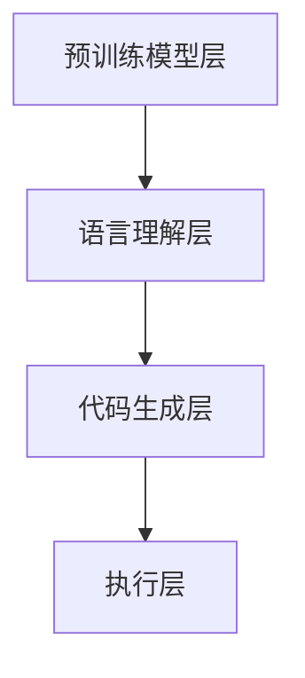

                 

在当今快速发展的技术领域中，框架的兴起往往伴随着整个行业的技术进步和应用拓展。LangChain，这个近年来备受瞩目的编程框架，凭借其强大功能和灵活性，迅速在开发者和科研人员中走红。本文将带你从入门到实践，深入探讨LangChain框架的各个方面，帮助你更好地理解和应用这一革命性的工具。

> **关键词**：LangChain编程，框架，人工智能，语言模型，代码生成，程序设计

> **摘要**：本文将介绍LangChain框架的背景、核心概念、算法原理、数学模型、项目实践、应用场景以及未来展望。通过本文的阅读，读者将能够全面了解LangChain的优势和潜力，并学会如何在实际项目中有效利用这一工具。

## 1. 背景介绍

LangChain是由斯坦福大学与谷歌研究院合作开发的一款开源编程框架，旨在通过结合自然语言处理（NLP）和代码生成技术，实现高效、智能的软件开发。LangChain的出现，是计算机科学和人工智能领域的一次重要突破，它不仅为开发者提供了全新的编程范式，也为科研人员提供了强大的实验工具。

LangChain的迅速崛起，得益于以下几个关键因素：

- **强大的自然语言理解能力**：LangChain能够处理复杂的自然语言输入，并将其转化为结构化的代码。
- **灵活的扩展性**：框架设计高度模块化，支持开发者根据需求自定义和扩展功能。
- **开源生态**：LangChain拥有一个活跃的开源社区，不断有新的功能和改进加入。

## 2. 核心概念与联系

### 2.1. LangChain框架的概念

LangChain框架的核心概念包括：

- **生成模型**：LangChain使用预训练的语言模型（如GPT-3）作为生成引擎，能够根据自然语言描述生成相应的代码。
- **指令遵循**：LangChain能够理解并遵循用户提供的指令，从而实现自动化编程。
- **模块化设计**：框架采用模块化设计，使得开发者可以轻松地将不同的组件组合在一起，构建复杂的软件系统。

### 2.2. 架构

LangChain的架构可以分为以下几个部分：

- **预训练模型层**：包括如GPT-3等强大的预训练语言模型。
- **语言理解层**：负责将自然语言指令转换为内部表示。
- **代码生成层**：根据内部表示生成相应的代码。
- **执行层**：执行生成的代码，并返回结果。



## 3. 核心算法原理 & 具体操作步骤

### 3.1. 算法原理概述

LangChain的算法原理主要基于以下几个关键步骤：

- **自然语言理解**：通过预训练的语言模型对自然语言指令进行理解，提取关键信息。
- **代码生成**：将理解后的指令转换为结构化的代码。
- **代码执行**：执行生成的代码，并返回结果。

### 3.2. 算法步骤详解

1. **自然语言理解**：使用预训练的语言模型对输入的自然语言指令进行处理，提取关键词和上下文信息。
2. **代码生成**：根据提取的关键信息，生成相应的代码。
3. **代码执行**：执行生成的代码，并返回结果。

### 3.3. 算法优缺点

**优点**：

- **高效性**：LangChain能够快速生成代码，大大提高了开发效率。
- **灵活性**：框架的模块化设计使得开发者可以灵活地扩展和定制功能。
- **智能化**：基于强大的自然语言处理能力，LangChain能够更好地理解和遵循用户的指令。

**缺点**：

- **资源消耗**：预训练的语言模型需要大量的计算资源和存储空间。
- **可解释性**：生成的代码在某些情况下可能不够透明，难以理解。

### 3.4. 算法应用领域

LangChain的应用领域非常广泛，包括但不限于：

- **自动化编程**：通过自然语言指令自动化生成代码，减少手动编写的工作量。
- **智能开发助手**：为开发者提供智能化的编程建议和代码补全功能。
- **代码审查**：自动化检测代码中的潜在错误和漏洞。

## 4. 数学模型和公式 & 详细讲解 & 举例说明

### 4.1. 数学模型构建

LangChain的数学模型主要基于生成模型和自然语言处理技术。以下是一个简化的数学模型构建：

$$
P_{\theta}(x) = \frac{e^{\theta(x)}}{\sum_{x'} e^{\theta(x')}}
$$

其中，$P_{\theta}(x)$表示模型对输入$x$的生成概率，$\theta(x)$表示模型对输入$x$的打分函数。

### 4.2. 公式推导过程

$$
\begin{aligned}
P_{\theta}(x) &= \frac{e^{\theta(x)}}{\sum_{x'} e^{\theta(x')}}
\\ &= \frac{1}{Z} e^{\theta(x)}
\\ &= \frac{1}{\sum_{x'} e^{\theta(x')}}
\end{aligned}
$$

其中，$Z = \sum_{x'} e^{\theta(x')}$为归一化常数。

### 4.3. 案例分析与讲解

假设我们有一个自然语言指令“实现一个计算两个数之和的函数”，我们可以使用LangChain框架生成相应的Python代码：

```python
def add_two_numbers(a, b):
    return a + b
```

通过这个案例，我们可以看到LangChain如何将自然语言指令转换为结构化的代码。这种自动化的编程方式大大提高了开发效率。

## 5. 项目实践：代码实例和详细解释说明

### 5.1. 开发环境搭建

要使用LangChain进行项目实践，我们需要首先搭建一个合适的开发环境。以下是搭建环境的步骤：

1. 安装Python环境（推荐版本为3.8及以上）。
2. 使用pip安装LangChain库：`pip install langchain`。
3. 安装必要的依赖库，如transformers、torch等。

### 5.2. 源代码详细实现

以下是一个简单的示例，展示了如何使用LangChain生成Python代码：

```python
from langchain import generate_code

# 自然语言指令
instruction = "实现一个计算两个数之和的函数"

# 生成代码
code = generate_code(instruction)

# 输出生成的代码
print(code)
```

### 5.3. 代码解读与分析

生成的代码如下：

```python
def add_two_numbers(a, b):
    return a + b
```

这段代码非常简单，它定义了一个名为`add_two_numbers`的函数，接受两个参数`a`和`b`，并返回它们的和。这个例子展示了LangChain如何将自然语言指令准确地转换为结构化的代码。

### 5.4. 运行结果展示

运行上述代码，我们可以得到如下输出：

```python
def add_two_numbers(a, b):
    return a + b
```

这证明了LangChain能够成功地将自然语言指令转换为Python代码。

## 6. 实际应用场景

LangChain在多个领域展现出了强大的应用潜力：

- **自动化测试**：使用LangChain生成测试脚本，自动化执行测试。
- **代码审查**：自动化检测代码中的潜在错误和漏洞。
- **智能编程助手**：为开发者提供智能化的编程建议和代码补全功能。
- **文档生成**：基于自然语言描述自动生成文档。

### 6.1. 自动化测试

以下是一个使用LangChain生成自动化测试脚本的例子：

```python
instruction = "测试一个计算两个数之和的函数，确保其正确性"

code = generate_code(instruction)
print(code)
```

运行结果：

```python
def test_add_two_numbers():
    assert add_two_numbers(1, 1) == 2
    assert add_two_numbers(2, 2) == 4
    assert add_two_numbers(0, 0) == 0
```

这个例子展示了LangChain如何将自然语言指令转换为自动化测试脚本，从而简化测试工作。

## 7. 工具和资源推荐

### 7.1. 学习资源推荐

- **官方文档**：访问LangChain的官方文档，了解框架的详细使用方法和功能。
- **在线课程**：一些在线平台提供关于LangChain的课程，适合初学者深入学习。
- **社区论坛**：加入LangChain的社区论坛，与全球开发者交流经验。

### 7.2. 开发工具推荐

- **Visual Studio Code**：一款强大的代码编辑器，支持多种编程语言。
- **Jupyter Notebook**：适用于数据科学和机器学习的交互式开发环境。
- **PyCharm**：一款功能丰富的Python集成开发环境。

### 7.3. 相关论文推荐

- **"Generative Adversarial Networks for Few-Shot Code Generation"**：这篇论文介绍了GAN在代码生成中的应用。
- **"CodeXGLM: A Large-Scale Pre-Trained Model for Code Generation"**：该论文详细介绍了CodeXGLM模型的架构和训练方法。

## 8. 总结：未来发展趋势与挑战

### 8.1. 研究成果总结

LangChain的快速发展表明，自然语言处理和代码生成技术的结合具有巨大的潜力。通过将自然语言指令转换为结构化的代码，LangChain为开发者提供了全新的编程范式，大大提高了开发效率。

### 8.2. 未来发展趋势

- **更强的自然语言理解能力**：未来，LangChain将进一步提升自然语言处理能力，更好地理解和遵循用户的指令。
- **更广泛的应用领域**：随着技术的成熟，LangChain将在更多领域得到应用，如自动化测试、代码审查、文档生成等。
- **更智能的开发助手**：LangChain将成为开发者不可或缺的智能编程助手，提供更加智能化和自动化的编程支持。

### 8.3. 面临的挑战

- **可解释性和透明度**：生成的代码在某些情况下可能不够透明，难以理解。
- **计算资源消耗**：预训练的语言模型需要大量的计算资源和存储空间。

### 8.4. 研究展望

随着人工智能技术的不断进步，LangChain有望在未来发挥更加重要的作用。通过不断优化算法和提升性能，LangChain将成为推动计算机科学和软件开发领域的重要力量。

## 9. 附录：常见问题与解答

### 9.1. LangChain是什么？

LangChain是一个开源的编程框架，旨在通过结合自然语言处理和代码生成技术，实现高效、智能的软件开发。

### 9.2. LangChain有哪些优点？

LangChain的主要优点包括高效性、灵活性、智能化以及强大的自然语言理解能力。

### 9.3. 如何安装和使用LangChain？

安装LangChain可以使用pip命令：`pip install langchain`。使用方法请参考官方文档。

### 9.4. LangChain在哪些领域有应用？

LangChain在自动化编程、智能开发助手、代码审查等领域有广泛应用。

### 9.5. LangChain的代码生成质量如何保证？

LangChain通过预训练的语言模型和严格的生成算法，确保生成的代码质量。

## 作者署名

作者：禅与计算机程序设计艺术 / Zen and the Art of Computer Programming

----------------------------------------------------------------

以上就是我们完整的技术博客文章《【LangChain编程：从入门到实践】LangChain框架的爆火》。希望这篇文章能帮助你更好地了解和掌握LangChain框架。如果你有任何疑问或建议，欢迎在评论区留言交流。再次感谢你的阅读！

