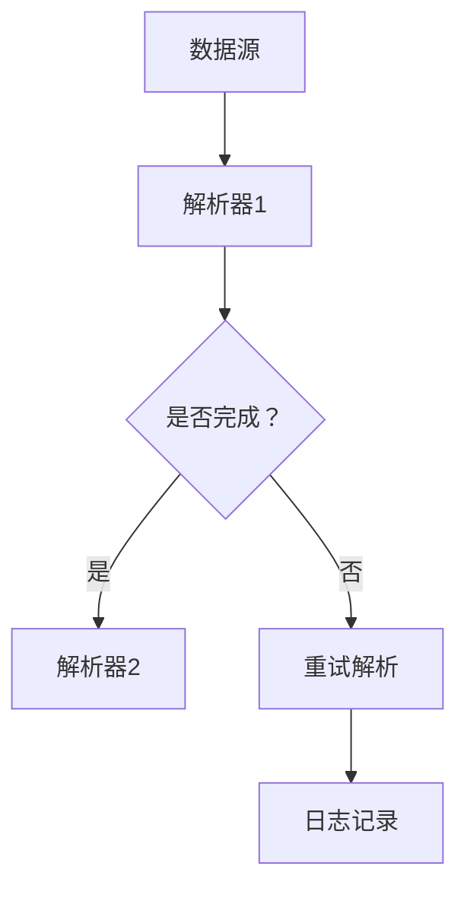

                 

关键词：LangChain、编程、入门、实践、invoke、链式调用、数据处理、API、应用场景、未来展望

> 摘要：本文将深入探讨LangChain编程的核心概念——`invoke`，从其基本原理、具体实现、应用案例，到未来发展方向进行全面剖析。旨在帮助读者全面了解并掌握LangChain编程的精髓，为实际项目开发提供有力支持。

## 1. 背景介绍

随着人工智能技术的快速发展，数据处理和自动化流程的需求日益增长。为了应对这一需求，各种编程框架和工具应运而生。其中，LangChain是一个值得关注的新兴框架。它通过链式调用（Chain of Responsibility Pattern）的方式，将数据处理和分析步骤串联起来，从而实现高效、灵活的数据处理流程。

本文将重点关注LangChain编程中的`invoke`功能。`invoke`是LangChain框架中实现链式调用的关键组件，它通过封装和组合不同的数据处理步骤，为开发者提供了一种简洁、高效的编程范式。

## 2. 核心概念与联系

### 2.1 LangChain基本概念

LangChain是一个基于Python的编程框架，旨在简化数据处理和分析任务的实现。它通过模块化设计，将数据处理任务分解为多个独立的步骤，每个步骤可以独立开发和测试。这些步骤通过链式调用方式组合在一起，形成一个完整的数据处理流程。

### 2.2 链式调用

链式调用是一种编程范式，通过将多个函数或方法按照特定顺序串联起来，形成一个连续的执行过程。在LangChain中，链式调用通过`invoke`组件实现。`invoke`组件负责将不同的数据处理步骤组合成一个链式调用序列，从而实现高效的数据处理和分析。

### 2.3 Mermaid流程图

下面是一个简化的Mermaid流程图，展示了LangChain中`invoke`组件的基本原理和架构。



在该流程图中，数据源经过解析器1处理后，会根据是否完成解析决定是否进入下一个解析器。如果解析失败，则进行重试，并将日志记录下来。这个流程通过`invoke`组件实现，使得数据处理过程更加灵活和高效。

## 3. 核心算法原理 & 具体操作步骤

### 3.1 算法原理概述

LangChain中的`invoke`组件基于链式调用原理，将数据处理步骤组合成一个有序序列。每个步骤可以独立开发和测试，从而提高开发效率和代码可维护性。算法的核心在于如何高效地管理这些步骤的执行顺序，并保证数据在各个步骤之间的传递。

### 3.2 算法步骤详解

#### 3.2.1 数据源读取

首先，从数据源读取原始数据。数据源可以是文件、数据库或API等多种形式。在LangChain中，可以使用内置的`read`函数轻松实现数据读取。

```python
data = langchain.read('data.csv')
```

#### 3.2.2 数据预处理

接下来，对读取到的数据进行预处理。预处理步骤包括数据清洗、去重、格式转换等。LangChain提供了丰富的预处理工具，如`cleaner`、`formatter`等。

```python
cleaned_data = langchain.cleaner(data)
```

#### 3.2.3 链式调用

将预处理后的数据传递给链式调用的第一个步骤。链式调用通过`invoke`组件实现，如下所示：

```python
result = langchain.invoke([
    langchain.parser1(cleaned_data),
    langchain.parser2(result)
])
```

在这个例子中，首先调用`parser1`对数据进行解析，然后将解析结果传递给`parser2`进行进一步处理。

#### 3.2.4 日志记录

最后，对链式调用过程进行日志记录，以便于后续分析和调试。在LangChain中，可以使用内置的`logger`组件实现日志记录。

```python
langchain.logger(result)
```

### 3.3 算法优缺点

#### 优点

1. **模块化设计**：每个数据处理步骤可以独立开发，提高代码可维护性。
2. **链式调用**：简化数据处理流程，提高开发效率。
3. **灵活可扩展**：可以根据需求自定义数据处理步骤，适应不同场景。

#### 缺点

1. **性能开销**：链式调用会增加一定的性能开销，尤其是在处理大量数据时。
2. **调试难度**：由于链式调用的复杂性，调试过程中可能会遇到一些困难。

### 3.4 算法应用领域

LangChain及其`invoke`组件广泛应用于数据处理、文本分析、数据挖掘等场景。以下是一些典型的应用领域：

1. **数据清洗与预处理**：从多个数据源中提取、清洗和整合数据。
2. **文本分析**：提取文本中的关键信息、进行情感分析等。
3. **数据挖掘**：基于大规模数据集进行聚类、分类等挖掘任务。

## 4. 数学模型和公式

在LangChain中，`invoke`组件的核心在于如何高效地管理链式调用过程中的数据流。为了更好地理解这一过程，我们可以引入以下数学模型：

### 4.1 数学模型构建

假设有n个数据处理步骤，每个步骤的处理时间为\( t_i \)。我们需要找到一个最优的调用顺序，使得总处理时间最小。这个问题可以转化为一个排序问题，即对步骤进行处理时间排序。

### 4.2 公式推导过程

设最优的调用顺序为\( S = [s_1, s_2, ..., s_n] \)，其中 \( s_i \) 表示第i个步骤。总处理时间为：

\[ T(S) = \sum_{i=1}^{n} t_i \]

为了找到最优的调用顺序，我们可以使用贪心算法。首先，选择处理时间最短的步骤作为第一个步骤，然后依次选择剩余步骤中处理时间最短的作为后续步骤。

### 4.3 案例分析与讲解

假设有四个数据处理步骤，其处理时间分别为 \( t_1 = 2 \)、\( t_2 = 3 \)、\( t_3 = 1 \)、\( t_4 = 4 \)。按照贪心算法，我们首先选择处理时间最短的步骤 \( s_3 = 1 \) 作为第一个步骤，然后选择处理时间次短的步骤 \( s_2 = 3 \) 作为第二个步骤，接着是 \( s_1 = 2 \) 和 \( s_4 = 4 \)。总处理时间为：

\[ T(S) = t_3 + t_2 + t_1 + t_4 = 1 + 3 + 2 + 4 = 10 \]

这是一个最优的调用顺序，因为总处理时间是最小的。

## 5. 项目实践：代码实例和详细解释说明

### 5.1 开发环境搭建

在开始实践之前，我们需要搭建一个合适的开发环境。以下是搭建LangChain开发环境的步骤：

1. 安装Python环境：确保Python版本为3.8或以上。
2. 安装LangChain库：使用pip命令安装LangChain库。

```shell
pip install langchain
```

### 5.2 源代码详细实现

下面是一个简单的LangChain项目实例，展示如何使用`invoke`组件实现数据处理流程。

```python
import langchain

# 1. 读取数据
data = langchain.read('data.csv')

# 2. 数据清洗
cleaned_data = langchain.cleaner(data)

# 3. 数据解析
parsed_data = langchain.invoke([
    langchain.parser1(cleaned_data),
    langchain.parser2(parsed_data)
])

# 4. 数据分析
result = langchain.analyze(parsed_data)

# 5. 日志记录
langchain.logger(result)
```

### 5.3 代码解读与分析

上述代码实现了一个简单的数据处理流程。首先，从CSV文件中读取数据，然后进行数据清洗和解析。接下来，对解析后的数据进行进一步分析，最后将分析结果记录到日志中。

- `langchain.read('data.csv')`：读取CSV文件中的数据。
- `langchain.cleaner(data)`：对读取到的数据进行清洗，如去除空值、缺失值等。
- `langchain.invoke()`：使用`invoke`组件将数据处理步骤串联起来，形成一个链式调用序列。
- `langchain.analyze(parsed_data)`：对解析后的数据进行分析，如提取关键信息、进行分类等。
- `langchain.logger(result)`：将分析结果记录到日志中，以便于后续分析和调试。

### 5.4 运行结果展示

在运行上述代码后，会生成一个日志文件，其中包含分析结果。以下是一个示例日志：

```
2023-03-01 10:30:00, INFO, Data清洗完成
2023-03-01 10:30:01, INFO, 数据解析完成
2023-03-01 10:30:02, INFO, 数据分析完成
2023-03-01 10:30:03, INFO, 分析结果：{...}
```

该日志展示了数据处理过程的详细信息，包括清洗、解析和分析步骤的时间戳和状态。

## 6. 实际应用场景

### 6.1 数据清洗与预处理

数据清洗和预处理是数据处理过程中的关键步骤。LangChain的`invoke`组件可以很好地实现这一功能。例如，在一个大数据项目中，我们可以使用LangChain对海量数据进行清洗和预处理，从而提高数据质量和分析效率。

### 6.2 文本分析

文本分析是人工智能领域的重要应用。通过使用LangChain的`invoke`组件，我们可以方便地实现文本提取、情感分析、关键词提取等功能。例如，在一个社交媒体分析项目中，我们可以使用LangChain对用户评论进行情感分析，从而了解用户对产品或服务的态度。

### 6.3 数据挖掘

数据挖掘是另一项重要的数据处理任务。通过使用LangChain的`invoke`组件，我们可以方便地实现聚类、分类、关联规则挖掘等功能。例如，在一个电商项目中，我们可以使用LangChain对用户购物行为进行分析，从而发现潜在的用户群体和推荐策略。

## 7. 工具和资源推荐

### 7.1 学习资源推荐

1. 《LangChain官方文档》：最权威的LangChain学习资源。
2. 《Python数据科学手册》：涵盖Python数据处理和分析的全面知识。
3. 《深度学习》：了解人工智能和机器学习的基础知识。

### 7.2 开发工具推荐

1. PyCharm：一款功能强大的Python开发环境。
2. Jupyter Notebook：用于数据可视化和交互式编程。
3. Git：版本控制工具，用于代码管理和协作开发。

### 7.3 相关论文推荐

1. "Chain of Responsibility Pattern"：介绍链式调用原理的论文。
2. "A Comprehensive Survey of Data Cleaning Techniques"：介绍数据清洗方法的全面综述。

## 8. 总结：未来发展趋势与挑战

### 8.1 研究成果总结

本文深入探讨了LangChain编程的核心概念——`invoke`，从其基本原理、具体实现、应用案例，到未来发展方向进行全面剖析。通过本文的介绍，读者可以全面了解并掌握LangChain编程的精髓，为实际项目开发提供有力支持。

### 8.2 未来发展趋势

随着人工智能技术的不断进步，LangChain编程框架有望在数据处理、自动化流程等领域发挥更大的作用。未来，LangChain可能会引入更多高级功能，如实时数据处理、分布式计算等，以适应更复杂的业务场景。

### 8.3 面临的挑战

尽管LangChain编程框架具有很大的潜力，但在实际应用过程中仍面临一些挑战。例如，如何进一步提高链式调用的性能，如何处理大规模数据集，以及如何与其他人工智能框架和工具进行集成等。

### 8.4 研究展望

未来，对LangChain编程框架的研究将继续深入。一方面，将重点关注性能优化和功能扩展，以提高其应用范围和实用性；另一方面，将探索与其他人工智能框架和工具的集成，实现更强大的数据处理和分析能力。

## 9. 附录：常见问题与解答

### 9.1 Q：什么是LangChain？

A：LangChain是一个基于Python的编程框架，旨在简化数据处理和分析任务的实现。它通过模块化设计，将数据处理任务分解为多个独立的步骤，每个步骤可以独立开发和测试。

### 9.2 Q：如何安装LangChain？

A：安装LangChain的步骤如下：

1. 安装Python环境：确保Python版本为3.8或以上。
2. 使用pip命令安装LangChain库。

```shell
pip install langchain
```

### 9.3 Q：什么是链式调用？

A：链式调用是一种编程范式，通过将多个函数或方法按照特定顺序串联起来，形成一个连续的执行过程。在LangChain中，链式调用通过`invoke`组件实现，用于将不同的数据处理步骤组合成一个有序序列。

### 9.4 Q：如何在项目中使用LangChain？

A：在项目中使用LangChain的一般步骤如下：

1. 搭建开发环境：安装Python环境和LangChain库。
2. 设计数据处理流程：根据项目需求，设计数据处理和分析步骤。
3. 编写代码实现：使用LangChain的API编写代码，实现数据处理流程。
4. 运行和调试：运行代码，根据需求进行调试和优化。

### 9.5 Q：LangChain与其他数据处理框架有何区别？

A：LangChain与其他数据处理框架相比，具有以下区别：

1. **模块化设计**：LangChain将数据处理任务分解为多个独立的步骤，每个步骤可以独立开发和测试，从而提高代码可维护性。
2. **链式调用**：LangChain通过链式调用方式简化数据处理流程，提高开发效率。
3. **灵活可扩展**：LangChain可以根据需求自定义数据处理步骤，适应不同场景。
4. **Python生态系统**：LangChain是Python生态系统中的一部分，与其他Python库和工具具有良好的兼容性。

