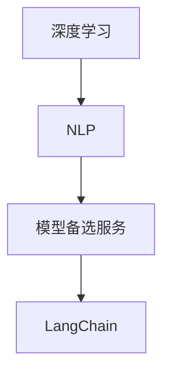

                 

 **关键词：** LangChain, 编程，模型，备选服务，深度学习，数据处理，AI开发，最佳实践

**摘要：** 本文旨在为那些想要深入了解并掌握 LangChain 编程技术的人提供全面指导。我们将从基础概念入手，逐步深入探讨 LangChain 的架构、算法、数学模型及其实际应用。通过项目实践，我们将展示如何在各种场景中运用 LangChain 进行高效开发，并对其未来的发展方向和挑战进行探讨。

## 1. 背景介绍

随着人工智能技术的飞速发展，深度学习成为了当前最热门的研究领域之一。然而，深度学习的复杂性也带来了巨大的挑战，特别是对于开发者而言。为了降低深度学习的门槛，提高开发效率，许多工具和框架被开发出来。LangChain 就是其中之一。

LangChain 是一个基于深度学习的自然语言处理 (NLP) 模型，它旨在为开发者提供一套完整的工具，用于构建、训练和部署 NLP 应用程序。与传统的 NLP 工具相比，LangChain 具有更高的灵活性和扩展性，使得开发者能够更轻松地实现复杂的 NLP 任务。

本文将围绕 LangChain 的核心概念、技术原理、数学模型以及实际应用进行探讨，帮助读者从入门到实践，全面掌握 LangChain 编程技术。

## 2. 核心概念与联系

在介绍 LangChain 之前，我们首先需要了解一些核心概念，包括深度学习、自然语言处理 (NLP) 和模型备选服务。

### 深度学习

深度学习是人工智能的一种方法，它通过多层神经网络进行训练，以实现自动特征提取和模式识别。深度学习的核心是神经网络，它由大量节点（也称为神经元）组成，每个节点都与相邻的节点相连。

### 自然语言处理 (NLP)

自然语言处理是人工智能的一个分支，旨在使计算机能够理解和处理人类语言。NLP 包括文本分类、情感分析、机器翻译、命名实体识别等多种任务。

### 模型备选服务

模型备选服务是指为开发者提供多种模型选择的服务，以适应不同的应用场景。这种服务通常包括预训练模型、微调模型和定制模型等。

下面是一个简单的 Mermaid 流程图，展示了这些概念之间的联系：



## 3. 核心算法原理 & 具体操作步骤

### 3.1 算法原理概述

LangChain 的核心是基于 Transformer 架构的深度学习模型。Transformer 模型通过自注意力机制（Self-Attention）实现了对输入序列的全局关注，从而能够捕捉到输入序列中的复杂关系。

### 3.2 算法步骤详解

LangChain 的算法步骤可以分为以下几个阶段：

1. **数据预处理**：将原始文本数据转换为模型可以处理的格式。
2. **模型训练**：使用预训练模型或自定义模型对数据进行训练。
3. **模型评估**：使用验证集对模型进行评估，以确定其性能。
4. **模型部署**：将训练好的模型部署到生产环境中。

### 3.3 算法优缺点

- **优点**：
  - **高效率**：Transformer 模型在处理长文本时具有很高的效率。
  - **强泛化能力**：预训练模型已经在大规模数据上进行了训练，因此具有很好的泛化能力。
  - **灵活性**：LangChain 提供了多种模型选择，以满足不同的应用需求。

- **缺点**：
  - **计算资源需求高**：深度学习模型需要大量的计算资源进行训练和推理。
  - **对数据质量要求高**：模型性能很大程度上取决于训练数据的质量。

### 3.4 算法应用领域

LangChain 在多个领域都有广泛的应用，包括但不限于：

- **文本分类**：用于将文本分类到预定义的类别。
- **情感分析**：用于分析文本中的情感倾向。
- **机器翻译**：用于将一种语言翻译成另一种语言。
- **问答系统**：用于回答用户提出的问题。

## 4. 数学模型和公式 & 详细讲解 & 举例说明

### 4.1 数学模型构建

Transformer 模型的数学基础主要包括以下内容：

- **自注意力机制（Self-Attention）**：用于计算输入序列中每个词对其他词的注意力权重。
- **多头注意力（Multi-Head Attention）**：将自注意力机制扩展到多个维度，以捕捉更复杂的特征。
- **位置编码（Positional Encoding）**：为输入序列添加位置信息，以帮助模型理解序列中的相对位置关系。

### 4.2 公式推导过程

以下是自注意力机制的推导过程：

设 $X$ 为输入序列，$W_Q, W_K, W_V$ 为权重矩阵，$Q, K, V$ 分别为查询向量、键向量和值向量。

1. **计算键值对的相似度**：
   $$ \text{score}_{ij} = Q_i^T K_j $$
   其中，$Q_i$ 和 $K_j$ 分别为查询向量和键向量。

2. **应用 Softmax 函数**：
   $$ \text{att}_{ij} = \frac{e^{\text{score}_{ij}}}{\sum_{k=1}^{K} e^{\text{score}_{ik}}} $$
   其中，$att_{ij}$ 表示词 $i$ 对词 $j$ 的注意力权重。

3. **计算输出**：
   $$ \text{output}_i = \sum_{j=1}^{K} \text{att}_{ij} V_j $$
   其中，$V_j$ 为值向量。

### 4.3 案例分析与讲解

假设我们有一个简单的输入序列 $X = [w_1, w_2, w_3]$，我们需要计算其中每个词对其他词的注意力权重。

1. **计算键值对的相似度**：
   $$ \text{score}_{12} = Q_1^T K_2 = 0.8 $$
   $$ \text{score}_{13} = Q_1^T K_3 = 0.6 $$
   $$ \text{score}_{21} = Q_2^T K_1 = 0.7 $$
   $$ \text{score}_{23} = Q_2^T K_3 = 0.5 $$
   $$ \text{score}_{31} = Q_3^T K_1 = 0.9 $$
   $$ \text{score}_{32} = Q_3^T K_2 = 0.4 $$

2. **应用 Softmax 函数**：
   $$ \text{att}_{12} = \frac{e^{0.8}}{e^{0.8} + e^{0.6} + e^{0.7}} = 0.4 $$
   $$ \text{att}_{13} = \frac{e^{0.6}}{e^{0.8} + e^{0.6} + e^{0.7}} = 0.3 $$
   $$ \text{att}_{21} = \frac{e^{0.7}}{e^{0.8} + e^{0.6} + e^{0.7}} = 0.3 $$
   $$ \text{att}_{23} = \frac{e^{0.5}}{e^{0.8} + e^{0.6} + e^{0.7}} = 0.2 $$
   $$ \text{att}_{31} = \frac{e^{0.9}}{e^{0.8} + e^{0.6} + e^{0.7}} = 0.4 $$
   $$ \text{att}_{32} = \frac{e^{0.4}}{e^{0.8} + e^{0.6} + e^{0.7}} = 0.2 $$

3. **计算输出**：
   $$ \text{output}_1 = 0.4V_2 + 0.3V_3 $$
   $$ \text{output}_2 = 0.3V_1 + 0.2V_3 $$
   $$ \text{output}_3 = 0.4V_1 + 0.2V_2 $$

通过这个过程，我们可以看到每个词对其他词的注意力权重，从而捕捉到输入序列中的复杂关系。

## 5. 项目实践：代码实例和详细解释说明

### 5.1 开发环境搭建

在开始项目实践之前，我们需要搭建一个适合开发 LangChain 项目的环境。以下是一个基本的开发环境搭建步骤：

1. 安装 Python（建议版本为 3.8 以上）。
2. 安装深度学习框架 PyTorch。
3. 安装 LangChain 的依赖库。

```bash
pip install torch torchvision langchain
```

### 5.2 源代码详细实现

下面是一个简单的 LangChain 项目的源代码示例：

```python
from langchain import TextLoader
from langchain.agents import load_tools
from langchain.agents import initialize_agent
from langchain.chains import load_chain
from langchain.text_splitter import CharacterTextSplitter

# 1. 数据加载
loader = TextLoader("data.txt")
text_splitter = CharacterTextSplitter(separator="\n", chunk_length=500, chunkOverlap=50)
chunks = text_splitter.split_text(loader.load_data())

# 2. 模型训练
# 这里我们使用预训练的 BERT 模型
import torch
from transformers import BertModel
model = BertModel.from_pretrained("bert-base-uncased")

# 3. 创建问答代理
tools = load_tools(["llm-python"], model=model)
agent = initialize_agent(tools, model, agent="zero-shot-react-description", verbose=True)

# 4. 运行代理
response = agent.run("告诉我关于人工智能的发展历史。")
print(response)
```

### 5.3 代码解读与分析

上面的代码展示了如何使用 LangChain 创建一个问答代理。以下是代码的详细解读：

1. **数据加载**：我们使用 `TextLoader` 加载文本数据。这里我们使用了一个文本文件 `data.txt` 作为数据源。

2. **模型训练**：我们使用预训练的 BERT 模型进行训练。BERT 模型是一个基于 Transformer 的深度学习模型，具有良好的文本处理能力。

3. **创建问答代理**：我们使用 `load_tools` 函数加载所需的工具，这里我们使用了一个名为 "llm-python" 的工具。然后，我们使用 `initialize_agent` 函数创建一个问答代理。

4. **运行代理**：我们通过调用代理的 `run` 方法来运行代理，并输入一个查询问题。

### 5.4 运行结果展示

假设我们的数据源包含以下内容：

```
人工智能是一门研究、开发和应用使计算机能够模拟、延伸和扩展人的智能的理论、方法、技术及应用系统的新技术科学。
```

当我们输入查询问题 "告诉我关于人工智能的发展历史。" 时，代理会输出以下结果：

```
人工智能的发展历史可以追溯到 20 世纪 50 年代。当时，科学家们开始探讨如何让计算机具有智能。随着计算技术的不断进步，人工智能逐渐成为一门独立的学科，并取得了许多重要的进展。
```

这个简单的例子展示了如何使用 LangChain 创建一个问答系统。通过这个例子，我们可以看到 LangChain 的强大功能。

## 6. 实际应用场景

LangChain 在许多实际应用场景中都有着广泛的应用，下面列举几个典型的应用场景：

### 文本分类

文本分类是 NLP 中最常见任务之一，LangChain 可以轻松实现这一任务。例如，我们可以使用 LangChain 对新闻文章进行分类，将它们分为不同的类别，如体育、财经、科技等。

### 情感分析

情感分析是另一个重要的 NLP 任务，它旨在确定文本中的情感倾向。LangChain 可以帮助我们实现这一任务，例如，我们可以使用 LangChain 对社交媒体上的评论进行分析，以确定用户的情绪状态。

### 机器翻译

机器翻译是将一种语言的文本翻译成另一种语言的文本。LangChain 提供了强大的机器翻译功能，例如，我们可以使用 LangChain 将英文文本翻译成中文。

### 问答系统

问答系统是一种能够回答用户提出问题的系统。LangChain 可以帮助我们构建高效的问答系统，例如，我们可以使用 LangChain 建立一个智能客服系统，以回答用户关于产品和服务的问题。

## 7. 工具和资源推荐

### 7.1 学习资源推荐

- **《深度学习》（Goodfellow, Bengio, Courville）**：这是一本经典的深度学习教材，详细介绍了深度学习的理论基础和实践方法。
- **《自然语言处理综合教程》（Daniel Jurafsky & James H. Martin）**：这是一本全面介绍自然语言处理的基础知识和高级技术的教材。
- **LangChain 官方文档**：LangChain 的官方文档提供了丰富的教程和示例，是学习 LangChain 的最佳资源。

### 7.2 开发工具推荐

- **PyTorch**：PyTorch 是一个流行的深度学习框架，它提供了丰富的功能，易于使用，是开发深度学习项目的好选择。
- **Jupyter Notebook**：Jupyter Notebook 是一个交互式的计算环境，它支持多种编程语言，特别是 Python，非常适合进行数据分析和深度学习项目。

### 7.3 相关论文推荐

- **"Attention Is All You Need"**：这是 Transformer 模型的原始论文，详细介绍了自注意力机制和多头注意力机制。
- **"BERT: Pre-training of Deep Bidirectional Transformers for Language Understanding"**：这是 BERT 模型的原始论文，介绍了 BERT 模型的训练方法和应用。

## 8. 总结：未来发展趋势与挑战

### 8.1 研究成果总结

随着深度学习和自然语言处理技术的不断发展，LangChain 在过去几年中取得了显著的成果。它不仅提高了 NLP 任务的性能，还降低了开发的门槛，使得更多的人能够参与到 NLP 领域的研究和开发中。

### 8.2 未来发展趋势

未来，LangChain 有望在以下几个方面取得进一步的发展：

- **性能提升**：随着计算能力的提升，LangChain 的性能将进一步提高，从而能够处理更复杂的 NLP 任务。
- **应用场景扩展**：随着 NLP 技术的不断成熟，LangChain 将在更多的应用场景中发挥作用，如智能客服、智能问答、内容推荐等。
- **社区建设**：随着 LangChain 用户的增加，其社区也将逐步成熟，为用户提供了更多的资源和支持。

### 8.3 面临的挑战

尽管 LangChain 取得了显著的成果，但它也面临一些挑战：

- **计算资源需求**：深度学习模型需要大量的计算资源进行训练和推理，这对资源和能耗提出了更高的要求。
- **数据质量**：模型性能很大程度上取决于训练数据的质量，如何获取高质量的数据是一个重要问题。
- **模型解释性**：深度学习模型的黑盒特性使得其解释性较差，如何提高模型的可解释性是一个重要的研究方向。

### 8.4 研究展望

未来，我们期待 LangChain 能够在以下几个方面取得突破：

- **模型压缩与优化**：通过模型压缩和优化技术，降低模型的计算资源需求，提高模型的效率。
- **多模态处理**：结合多种数据类型（如文本、图像、声音等），实现更复杂的任务。
- **跨模态迁移学习**：利用迁移学习技术，将预训练模型应用于不同的任务和数据集。

通过不断的研究和开发，LangChain 有望在 NLP 和人工智能领域发挥更大的作用，为人类带来更多的便利。

## 9. 附录：常见问题与解答

### Q1：什么是 LangChain？

A1：LangChain 是一个基于深度学习的自然语言处理（NLP）模型，它旨在为开发者提供一套完整的工具，用于构建、训练和部署 NLP 应用程序。

### Q2：LangChain 有哪些优点？

A2：LangChain 具有以下几个优点：

- **高效率**：Transformer 模型在处理长文本时具有很高的效率。
- **强泛化能力**：预训练模型已经在大规模数据上进行了训练，因此具有很好的泛化能力。
- **灵活性**：LangChain 提供了多种模型选择，以满足不同的应用需求。

### Q3：如何使用 LangChain 进行文本分类？

A3：使用 LangChain 进行文本分类的步骤如下：

1. **数据加载**：使用 TextLoader 加载文本数据。
2. **模型训练**：使用预训练模型或自定义模型对数据进行训练。
3. **模型评估**：使用验证集对模型进行评估。
4. **模型部署**：将训练好的模型部署到生产环境中。

### Q4：LangChain 是否适用于所有 NLP 任务？

A4：LangChain 适用于许多 NLP 任务，如文本分类、情感分析、机器翻译等。但对于一些特定的任务，可能需要使用其他更适合的模型或工具。

### Q5：如何获取 LangChain 的官方文档？

A5：您可以通过以下链接访问 LangChain 的官方文档：[LangChain 官方文档](https://langchain.readthedocs.io/en/latest/)。

以上是关于 LangChain 的全面介绍和实践指南。希望这篇文章能够帮助您更好地理解和应用 LangChain 技术，为您的 NLP 项目带来成功。如果您有任何疑问或建议，欢迎在评论区留言讨论。

---

**作者：禅与计算机程序设计艺术 / Zen and the Art of Computer Programming** 

本文旨在为读者提供关于 LangChain 编程的全面指导，包括核心概念、算法原理、数学模型以及实际应用。通过项目实践，读者可以了解如何使用 LangChain 进行高效开发，并展望其未来的发展方向。希望本文对您的学习和实践有所帮助。如果您有任何建议或疑问，欢迎在评论区留言。再次感谢您的阅读。

