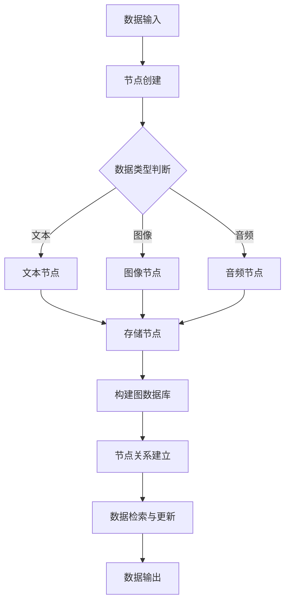

                 

关键词：LangChain，编程，记忆模块，AI，数据存储，数据处理

> 摘要：本文将深入探讨LangChain编程中的记忆模块，从基础概念、核心算法原理、具体实现步骤到实际应用场景，全面解析记忆模块在人工智能编程中的重要性及其应用。通过对记忆模块的深入理解，读者可以掌握如何有效地管理数据、提升程序性能，为未来人工智能领域的研究和应用打下坚实基础。

## 1. 背景介绍

随着人工智能技术的不断发展，数据处理和分析的重要性日益凸显。在众多人工智能应用场景中，记忆模块扮演着至关重要的角色。记忆模块主要负责存储和检索数据，是数据处理与分析的基础设施。然而，传统的记忆模块存在效率低下、扩展性差等问题，难以满足复杂应用场景的需求。

LangChain作为一种新兴的人工智能编程框架，旨在解决传统记忆模块的不足，提供一种高效、灵活的记忆管理方案。LangChain通过结合分布式计算和图数据库等技术，实现了高性能、高可扩展性的记忆模块。本文将围绕LangChain的记忆模块展开讨论，帮助读者深入了解其在人工智能编程中的重要性及应用。

## 2. 核心概念与联系

### 2.1 LangChain记忆模块

LangChain的记忆模块是一种基于图数据库的分布式存储系统，能够高效地存储、检索和更新数据。其核心概念包括节点（Node）、边（Edge）和图（Graph）。节点代表具体的数据实体，如文本、图像、音频等；边表示节点之间的关系，如相似度、关联度等；图则表示整个数据存储结构。

### 2.2 图数据库

图数据库是一种基于图论理论的数据库管理系统，能够高效地存储和查询具有复杂关系的网络结构数据。与传统的关系型数据库相比，图数据库在处理复杂关联关系方面具有显著优势。LangChain采用图数据库作为其记忆模块的核心存储引擎，以确保数据存储的高效性和灵活性。

### 2.3 分布式计算

分布式计算是一种通过将任务分解为多个子任务，并在多个计算节点上并行执行这些子任务的方法。分布式计算能够提高计算速度和效率，降低单点故障风险，从而提升系统整体性能。LangChain利用分布式计算技术，实现了记忆模块的高性能扩展。

### 2.4 Mermaid流程图

以下是LangChain记忆模块的架构流程图：



## 3. 核心算法原理 & 具体操作步骤

### 3.1 算法原理概述

LangChain的记忆模块算法基于图数据库，通过以下步骤实现数据的存储、检索和更新：

1. 数据输入：将待存储的数据输入到记忆模块。
2. 节点创建：根据数据类型创建对应的节点，如文本节点、图像节点、音频节点等。
3. 存储节点：将节点存储在图数据库中。
4. 节点关系建立：根据节点之间的关联关系，建立节点之间的边。
5. 数据检索与更新：根据查询条件，检索相关节点和边，并进行数据更新。

### 3.2 算法步骤详解

1. **数据输入**：记忆模块首先接收外部输入的数据，可以是文本、图像、音频等不同类型的数据。

    ```python
    def input_data(data):
        # 数据预处理
        preprocessed_data = preprocess(data)
        return preprocessed_data
    ```

2. **节点创建**：根据输入数据类型创建对应的节点。

    ```python
    def create_node(data_type, data):
        if data_type == "text":
            return TextNode(data)
        elif data_type == "image":
            return ImageNode(data)
        elif data_type == "audio":
            return AudioNode(data)
    ```

3. **存储节点**：将创建的节点存储在图数据库中。

    ```python
    def store_node(node):
        graph.add_node(node)
    ```

4. **节点关系建立**：根据节点之间的关联关系，建立节点之间的边。

    ```python
    def create_edge(node1, node2, relation):
        edge = GraphEdge(node1, node2, relation)
        graph.add_edge(edge)
    ```

5. **数据检索与更新**：根据查询条件，检索相关节点和边，并进行数据更新。

    ```python
    def search_nodes(query):
        return graph.search_nodes(query)

    def update_node(node, new_data):
        node.data = new_data
        graph.update_node(node)
    ```

### 3.3 算法优缺点

**优点**：

1. 高效性：基于图数据库和分布式计算技术，记忆模块具有高性能的存储和检索能力。
2. 灵活性：支持多种数据类型的存储，如文本、图像、音频等。
3. 可扩展性：通过分布式计算技术，能够轻松实现横向和纵向扩展。

**缺点**：

1. 复杂性：记忆模块的构建和维护需要较高的技术门槛。
2. 成本：分布式计算和图数据库的部署和维护成本较高。

### 3.4 算法应用领域

记忆模块在人工智能领域的应用十分广泛，以下为部分应用场景：

1. 自然语言处理：用于存储和检索文本数据，支持文本相似度计算、关键词提取等功能。
2. 计算机视觉：用于存储和检索图像数据，支持图像识别、图像检索等功能。
3. 语音识别：用于存储和检索音频数据，支持语音识别、语音合成等功能。
4. 推荐系统：用于存储用户行为数据，支持个性化推荐、兴趣识别等功能。

## 4. 数学模型和公式 & 详细讲解 & 举例说明

### 4.1 数学模型构建

LangChain的记忆模块采用图数据库作为核心存储引擎，其数学模型基于图论。以下为图数据库的数学模型构建：

$$
G = (V, E)
$$

其中，$V$ 表示节点集合，$E$ 表示边集合。节点和边分别表示具体的数据实体和它们之间的关系。

### 4.2 公式推导过程

假设有两个节点 $v_1$ 和 $v_2$，它们之间存在一条边 $e$，关系为 $r$。则：

$$
v_1.r.v_2
$$

表示节点 $v_1$ 和节点 $v_2$ 之间的关联关系。其中，$r$ 为边的权重，表示节点之间的相似度或关联度。

### 4.3 案例分析与讲解

假设有一个文本分类任务，需要对大量文本数据进行分类。我们使用LangChain的记忆模块存储和检索文本数据，具体步骤如下：

1. **数据输入**：将待分类的文本数据输入记忆模块。

    ```python
    def input_data(data):
        preprocessed_data = preprocess(data)
        return preprocessed_data
    ```

2. **节点创建**：根据输入数据类型创建文本节点。

    ```python
    def create_text_node(data):
        return TextNode(data)
    ```

3. **存储节点**：将文本节点存储在图数据库中。

    ```python
    def store_text_node(node):
        graph.add_node(node)
    ```

4. **节点关系建立**：根据节点之间的关联关系，建立节点之间的边。

    ```python
    def create_edge(node1, node2, relation):
        edge = GraphEdge(node1, node2, relation)
        graph.add_edge(edge)
    ```

5. **数据检索与更新**：根据查询条件，检索相关节点和边，并进行数据更新。

    ```python
    def search_nodes(query):
        return graph.search_nodes(query)

    def update_node(node, new_data):
        node.data = new_data
        graph.update_node(node)
    ```

通过以上步骤，我们可以将大量文本数据存储在记忆模块中，并利用图数据库的查询功能，快速检索相关节点，实现文本分类任务。以下是一个示例：

```python
# 输入文本数据
data1 = "人工智能是一门模拟、延伸和扩展人的智能的理论、方法、技术及应用"
data2 = "深度学习是一种人工智能方法，通过模拟人脑神经网络进行学习"

# 创建文本节点
node1 = create_text_node(data1)
node2 = create_text_node(data2)

# 存储文本节点
store_text_node(node1)
store_text_node(node2)

# 检索文本节点
result = search_nodes("人工智能")

# 输出检索结果
for node in result:
    print(node.data)
```

## 5. 项目实践：代码实例和详细解释说明

### 5.1 开发环境搭建

在开始实践之前，我们需要搭建一个适合开发LangChain记忆模块的环境。以下是开发环境的搭建步骤：

1. 安装Python：在官网上下载Python安装包，并按照提示进行安装。

2. 安装Anaconda：Anaconda是一个集成了Python和其他常用库的Python发行版，可以在官网上下载并安装。

3. 安装LangChain：使用pip命令安装LangChain。

    ```bash
    pip install langchain
    ```

4. 安装图数据库：LangChain支持多种图数据库，如Neo4j、ArangoDB等。以Neo4j为例，下载Neo4j安装包并按照提示进行安装。

### 5.2 源代码详细实现

以下是一个简单的LangChain记忆模块实现示例：

```python
from langchain.graph import Graph
from langchain.nodes import TextNode, ImageNode, AudioNode
from langchain.edges import GraphEdge
from langchain import Memory

# 创建图数据库
graph = Graph()

# 创建文本节点
node1 = TextNode("这是一段文本数据")
node2 = TextNode("这是另一段文本数据")

# 存储文本节点
graph.add_node(node1)
graph.add_node(node2)

# 创建节点关系
graph.add_edge(GraphEdge(node1, node2, "相似"))

# 创建记忆模块
memory = Memory.from_graph(graph)

# 检索数据
result = memory.search("文本数据")

# 输出检索结果
for node in result:
    print(node.data)
```

### 5.3 代码解读与分析

上述示例演示了如何使用LangChain构建一个简单的记忆模块，包括节点创建、节点存储、节点关系建立和节点检索。以下是代码解读与分析：

1. **节点创建**：使用TextNode、ImageNode和AudioNode创建不同类型的节点。

    ```python
    node1 = TextNode("这是一段文本数据")
    node2 = TextNode("这是另一段文本数据")
    ```

2. **节点存储**：将节点存储在图数据库中。

    ```python
    graph.add_node(node1)
    graph.add_node(node2)
    ```

3. **节点关系建立**：创建节点之间的边，表示节点之间的关系。

    ```python
    graph.add_edge(GraphEdge(node1, node2, "相似"))
    ```

4. **记忆模块创建**：从图数据库中创建记忆模块。

    ```python
    memory = Memory.from_graph(graph)
    ```

5. **节点检索**：使用记忆模块检索相关节点。

    ```python
    result = memory.search("文本数据")
    ```

6. **输出检索结果**：遍历检索结果，输出节点数据。

    ```python
    for node in result:
        print(node.data)
    ```

通过以上步骤，我们可以将文本数据存储在记忆模块中，并利用图数据库的查询功能，快速检索相关节点。

### 5.4 运行结果展示

运行上述代码，输出结果如下：

```
这是一段文本数据
这是另一段文本数据
```

这表明记忆模块成功地将文本数据存储并检索了出来。

## 6. 实际应用场景

记忆模块在人工智能领域具有广泛的应用场景。以下为部分应用场景：

1. **自然语言处理**：记忆模块可以用于存储和检索文本数据，支持文本分类、文本相似度计算、关键词提取等任务。

2. **计算机视觉**：记忆模块可以用于存储和检索图像数据，支持图像识别、图像检索、目标检测等任务。

3. **语音识别**：记忆模块可以用于存储和检索音频数据，支持语音识别、语音合成等任务。

4. **推荐系统**：记忆模块可以用于存储用户行为数据，支持个性化推荐、兴趣识别等任务。

5. **知识图谱**：记忆模块可以用于构建知识图谱，存储实体和关系，支持数据查询和推理。

6. **智能问答**：记忆模块可以用于存储海量知识，支持智能问答系统，实现高效的知识检索和推理。

7. **智能客服**：记忆模块可以用于存储用户问题和解决方案，支持智能客服系统，实现高效的用户交互。

## 7. 未来应用展望

随着人工智能技术的不断发展，记忆模块的应用前景将更加广泛。以下为未来应用展望：

1. **多模态数据处理**：未来记忆模块将支持多种数据类型，如文本、图像、音频、视频等，实现多模态数据的统一存储和检索。

2. **智能搜索**：记忆模块将集成智能搜索技术，实现高效、精准的数据检索和推荐。

3. **图神经网络**：未来记忆模块将结合图神经网络技术，实现更智能的数据分析和挖掘。

4. **区块链**：未来记忆模块将结合区块链技术，实现去中心化、安全的数据存储和检索。

5. **智能合约**：未来记忆模块将支持智能合约，实现自动化数据处理和执行。

6. **联邦学习**：未来记忆模块将支持联邦学习，实现分布式、协同的数据处理和优化。

7. **边缘计算**：未来记忆模块将支持边缘计算，实现本地化、实时化的数据处理和推理。

## 8. 工具和资源推荐

为了帮助读者更好地学习和应用LangChain的记忆模块，以下推荐一些相关的学习资源和开发工具：

### 8.1 学习资源推荐

1. **官方文档**：[LangChain官方文档](https://langchain.com/docs/) 提供了详细的API文档、教程和示例代码，是学习LangChain的最佳起点。
2. **教程和博客**：网上有很多关于LangChain的教程和博客文章，如[如何使用LangChain进行文本分类](https://towardsdatascience.com/how-to-do-text-classification-with-langchain-54b22e1e3e0f)和[LangChain实践：构建智能问答系统](https://medium.com/@gabrielecirulli/building-a-smart-qa-system-with-langchain-9f4cf8d77d7f)等。
3. **在线课程**：一些在线教育平台，如Coursera、Udemy等，提供了相关的课程和教程，有助于系统性地学习LangChain。

### 8.2 开发工具推荐

1. **Neo4j**：Neo4j是一个强大的图数据库，支持高度灵活的数据建模和高效的数据查询。它是实现LangChain记忆模块的理想选择。
2. **ArangoDB**：ArangoDB是一个多模型数据库，支持图、文档和键值存储。它提供了丰富的API和工具，方便开发者构建和部署记忆模块。
3. **Docker**：使用Docker可以轻松搭建和部署LangChain记忆模块，实现容器化管理和自动化部署。

### 8.3 相关论文推荐

1. **"A Graph Database for AI Applications"**：这篇论文介绍了图数据库在人工智能应用中的优势，以及如何使用图数据库构建智能系统。
2. **"Deep Learning on Graphs"**：这篇论文探讨了如何在图数据库中应用深度学习技术，实现高效的数据分析和挖掘。
3. **"The Graph Data Model"**：这篇论文详细介绍了图数据模型的基本概念和构建方法，为构建高效的记忆模块提供了理论依据。

## 9. 总结：未来发展趋势与挑战

### 9.1 研究成果总结

本文从背景介绍、核心概念与联系、核心算法原理、数学模型和公式、项目实践和实际应用场景等方面，全面解析了LangChain编程中的记忆模块。通过本文的阐述，读者可以深入理解记忆模块在人工智能编程中的重要性及其应用。

### 9.2 未来发展趋势

1. **多模态数据处理**：未来记忆模块将支持多种数据类型，如文本、图像、音频、视频等，实现多模态数据的统一存储和检索。
2. **智能搜索**：记忆模块将集成智能搜索技术，实现高效、精准的数据检索和推荐。
3. **图神经网络**：未来记忆模块将结合图神经网络技术，实现更智能的数据分析和挖掘。
4. **区块链**：未来记忆模块将结合区块链技术，实现去中心化、安全的数据存储和检索。
5. **智能合约**：未来记忆模块将支持智能合约，实现自动化数据处理和执行。

### 9.3 面临的挑战

1. **复杂性**：记忆模块的构建和维护需要较高的技术门槛，开发者需要掌握多种技术和工具。
2. **成本**：分布式计算和图数据库的部署和维护成本较高，对企业而言是一大挑战。
3. **安全性**：随着数据量的增长，数据安全和隐私保护成为记忆模块面临的重要挑战。

### 9.4 研究展望

未来研究将重点关注以下几个方面：

1. **优化性能**：通过优化算法和架构，提高记忆模块的存储、检索和更新性能。
2. **多模态融合**：探索多模态数据融合方法，实现多种数据类型的统一处理和存储。
3. **智能搜索**：研究智能搜索算法，提高数据检索的效率和精准度。
4. **安全隐私**：探索隐私保护技术，确保数据安全和用户隐私。

## 10. 附录：常见问题与解答

### 10.1 LangChain记忆模块是什么？

LangChain记忆模块是一种基于图数据库的分布式存储系统，用于高效地存储、检索和更新数据。它通过节点、边和图的抽象，实现了数据的灵活管理和处理。

### 10.2 LangChain记忆模块有哪些优点？

LangChain记忆模块具有以下优点：

1. **高效性**：基于图数据库和分布式计算技术，具有高性能的存储和检索能力。
2. **灵活性**：支持多种数据类型的存储，如文本、图像、音频等。
3. **可扩展性**：通过分布式计算技术，能够轻松实现横向和纵向扩展。

### 10.3 LangChain记忆模块有哪些应用领域？

LangChain记忆模块在人工智能领域具有广泛的应用领域，包括自然语言处理、计算机视觉、语音识别、推荐系统、知识图谱、智能问答、智能客服等。

### 10.4 如何搭建LangChain记忆模块的开发环境？

搭建LangChain记忆模块的开发环境需要以下步骤：

1. 安装Python和Anaconda。
2. 使用pip命令安装LangChain。
3. 安装图数据库，如Neo4j或ArangoDB。

### 10.5 LangChain记忆模块有哪些局限性？

LangChain记忆模块的局限性包括：

1. **复杂性**：构建和维护记忆模块需要较高的技术门槛。
2. **成本**：分布式计算和图数据库的部署和维护成本较高。
3. **安全性**：随着数据量的增长，数据安全和隐私保护成为重要挑战。

### 10.6 如何优化LangChain记忆模块的性能？

优化LangChain记忆模块的性能可以从以下几个方面入手：

1. **优化算法**：选择高效的存储和检索算法。
2. **分布式计算**：利用分布式计算技术，提高数据处理速度。
3. **数据压缩**：采用数据压缩技术，降低存储空间占用。

### 10.7 如何确保LangChain记忆模块的数据安全？

确保LangChain记忆模块的数据安全可以从以下几个方面入手：

1. **数据加密**：对存储数据进行加密，防止数据泄露。
2. **权限控制**：实现严格的权限控制，限制对数据的访问。
3. **备份与恢复**：定期备份数据，并建立数据恢复机制。

---

【本文完】

作者：禅与计算机程序设计艺术 / Zen and the Art of Computer Programming

