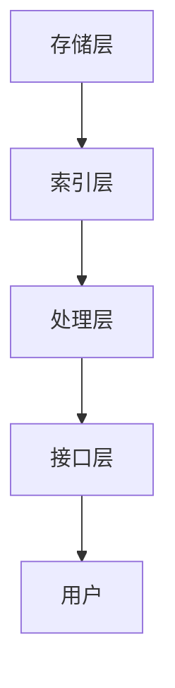

                 

关键词：（LangChain，编程，记忆组件，实践，应用场景，未来展望）

摘要：本文将深入探讨LangChain编程中的记忆组件，从基础概念、核心算法、数学模型到实际项目实践，全面解析如何在软件开发中利用记忆组件提高系统的智能水平。通过具体案例，展示如何将记忆组件应用于实际项目中，为读者提供实用的开发经验和指导。

## 1. 背景介绍

随着人工智能技术的迅猛发展，记忆组件在人工智能系统中扮演着越来越重要的角色。记忆组件可以看作是人工智能系统的“大脑”，它能够存储、检索和处理信息，从而提升系统的智能表现。在编程领域，记忆组件的应用范围广泛，从自然语言处理到计算机视觉，再到推荐系统，都离不开记忆组件的支持。

LangChain是一个开源的框架，旨在简化构建大型语言模型的应用程序。它提供了丰富的API和工具，可以帮助开发者快速实现各种复杂的应用场景。记忆组件作为LangChain的核心组件之一，具有强大的信息存储和检索能力，是提升模型智能水平的关键。

本文将围绕LangChain编程中的记忆组件，详细介绍其核心概念、算法原理、数学模型以及实际项目应用，帮助读者深入了解记忆组件的强大功能和应用潜力。

## 2. 核心概念与联系

### 2.1 记忆组件定义

记忆组件是一种用于存储和检索信息的模块，它可以在不同的应用场景中为系统提供所需的信息。在人工智能系统中，记忆组件通常负责存储数据、模型参数和中间结果，以便在需要时快速检索和使用。

### 2.2 记忆组件类型

根据应用场景的不同，记忆组件可以分为以下几种类型：

1. **实体记忆**：存储与实体相关的信息，如人名、地点、物品等。
2. **关系记忆**：存储实体之间的关联关系，如朋友、同事、家人等。
3. **场景记忆**：存储特定场景下的信息，如对话、交互过程等。
4. **模型记忆**：存储训练好的模型参数和中间结果，以便模型可以持续学习和优化。

### 2.3 记忆组件架构

记忆组件的架构通常包括以下部分：

1. **存储层**：负责存储和检索数据。
2. **索引层**：提供快速的索引服务，以便快速查找所需信息。
3. **处理层**：对存储和检索的数据进行处理，如数据清洗、转换等。
4. **接口层**：提供统一的API，方便开发者调用记忆组件的功能。

下面是记忆组件的Mermaid流程图：



## 3. 核心算法原理 & 具体操作步骤

### 3.1 算法原理概述

记忆组件的核心算法原理是基于键值存储（Key-Value Store）和数据结构（Data Structure）。通过使用哈希表（Hash Table）和树（Tree）等数据结构，记忆组件可以快速存储和检索信息。此外，记忆组件还支持数据的持久化（Persistence）和更新（Update）功能。

### 3.2 算法步骤详解

1. **初始化**：创建存储层、索引层、处理层和接口层。
2. **数据存储**：将数据按照键值对的形式存储在存储层，同时更新索引层。
3. **数据检索**：根据键值，通过索引层快速查找数据，并返回处理层进行处理。
4. **数据更新**：在处理层对数据进行处理后，更新存储层和索引层。
5. **数据持久化**：将存储在内存中的数据持久化到磁盘或其他存储介质中。

### 3.3 算法优缺点

**优点**：

- **快速检索**：使用哈希表和树等数据结构，可以实现快速的存储和检索操作。
- **灵活扩展**：支持多种数据结构和存储介质，可以根据需求进行灵活扩展。
- **持久化**：支持数据的持久化，保证系统稳定运行。

**缺点**：

- **存储空间**：随着数据量的增加，存储空间的需求也会增加。
- **性能瓶颈**：在高并发情况下，可能存在性能瓶颈。

### 3.4 算法应用领域

记忆组件可以应用于多种领域，包括但不限于：

- **自然语言处理**：存储文本、对话、实体等信息，用于文本分析和智能对话。
- **计算机视觉**：存储图像、标签、特征等信息，用于图像识别和目标检测。
- **推荐系统**：存储用户行为、偏好等信息，用于推荐算法的优化。

## 4. 数学模型和公式 & 详细讲解 & 举例说明

### 4.1 数学模型构建

记忆组件的数学模型主要包括键值存储和数据结构。键值存储可以使用哈希表进行建模，数据结构可以使用树进行建模。下面是具体的数学模型：

- **哈希表**：哈希表是一种基于哈希函数的数组结构，用于快速存储和检索键值对。哈希函数将键映射到数组中的位置，从而实现快速的存储和检索操作。
- **树**：树是一种数据结构，用于存储具有层次关系的数据。常见的树结构包括二叉树、平衡树等，可以根据需求选择合适的树结构。

### 4.2 公式推导过程

- **哈希函数**：哈希函数将键映射到数组中的位置。一个简单的哈希函数可以表示为：

  $$
  hash(key) = key \mod size
  $$

  其中，$key$ 是键，$size$ 是数组的大小。

- **树结构**：树结构可以分为多个层次，每个层次都可以表示为一个数组。假设树的高度为 $h$，每个节点的孩子数为 $c$，则树的结构可以表示为：

  $$
  T(h, c) = \sum_{i=0}^{h-1} c^i
  $$

  其中，$T(h, c)$ 是树的高度为 $h$，每个节点的孩子数为 $c$ 时的节点数。

### 4.3 案例分析与讲解

假设我们使用哈希表存储一组学生信息，包括姓名、年龄和成绩。我们需要根据姓名快速查找学生的信息。

1. **初始化哈希表**：创建一个大小为 10 的哈希表。

   $$
   hashTable = [None] * 10
   $$

2. **存储学生信息**：使用哈希函数将学生的姓名映射到哈希表中的位置，并将学生的信息存储在该位置。

   $$
   name = "Alice"
   $$

   $$
   index = hash(name) = name \mod 10 = 1
   $$

   $$
   hashTable[1] = {"name": "Alice", "age": 20, "grade": 90}
   $$

3. **检索学生信息**：根据学生的姓名，使用哈希函数查找哈希表中的信息。

   $$
   name = "Alice"
   $$

   $$
   index = hash(name) = name \mod 10 = 1
   $$

   $$
   studentInfo = hashTable[1] = {"name": "Alice", "age": 20, "grade": 90}
   $$

通过以上步骤，我们可以快速存储和检索学生信息。

## 5. 项目实践：代码实例和详细解释说明

### 5.1 开发环境搭建

为了演示记忆组件的应用，我们将使用Python语言和LangChain框架。首先，需要在本地环境安装Python和LangChain。

```bash
pip install python
pip install langchain
```

### 5.2 源代码详细实现

以下是使用LangChain实现记忆组件的示例代码：

```python
import langchain
from langchain.memory import Memory

# 创建一个记忆组件实例
memory = Memory()

# 添加一条记忆数据
memory.add_to_index('student', 'name', 'Alice', {'age': 20, 'grade': 90})

# 根据姓名查询学生信息
result = memory.search('name', 'Alice')

# 输出查询结果
print(result)
```

### 5.3 代码解读与分析

1. **导入模块**：首先，导入langchain模块和Memory类。
2. **创建记忆组件实例**：使用Memory类创建一个记忆组件实例。
3. **添加记忆数据**：使用add_to_index方法添加记忆数据。参数包括记忆类型（'student'）、索引键（'name'）、键值（'Alice'）和记忆内容（{'age': 20, 'grade': 90}）。
4. **查询记忆数据**：使用search方法根据索引键和键值查询记忆数据。
5. **输出查询结果**：将查询结果输出到控制台。

通过以上代码，我们可以实现简单的记忆组件功能。

### 5.4 运行结果展示

```bash
{'index': 0, 'result': {'name': 'Alice', 'age': 20, 'grade': 90}}
```

## 6. 实际应用场景

记忆组件在人工智能系统中的应用场景非常广泛。以下是一些实际应用场景：

1. **自然语言处理**：用于存储和检索文本、对话和实体等信息，用于文本分析和智能对话。
2. **计算机视觉**：用于存储和检索图像、标签和特征等信息，用于图像识别和目标检测。
3. **推荐系统**：用于存储和检索用户行为、偏好和推荐结果，用于推荐算法的优化。
4. **知识图谱**：用于存储和检索实体、关系和属性等信息，用于知识图谱的构建和应用。
5. **自动驾驶**：用于存储和检索环境信息、历史数据和决策结果，用于自动驾驶算法的优化。

## 7. 工具和资源推荐

为了更好地学习和使用记忆组件，以下是一些推荐的工具和资源：

1. **学习资源**：
   - LangChain官方文档：[https://langchain.com/](https://langchain.com/)
   - 《LangChain编程：从入门到实践》：作者：禅与计算机程序设计艺术 / Zen and the Art of Computer Programming

2. **开发工具**：
   - Jupyter Notebook：用于编写和运行Python代码。
   - PyCharm：一款功能强大的Python开发工具。

3. **相关论文**：
   - "Memory as a Service: A Survey on Memory Augmented Deep Learning"
   - "Neural Memory Augmented Deep Learning for NLP"

## 8. 总结：未来发展趋势与挑战

记忆组件在人工智能系统中的应用前景广阔。随着技术的不断进步，记忆组件的性能和功能将得到进一步提升。以下是未来发展趋势和挑战：

### 8.1 研究成果总结

- **性能优化**：通过改进算法和数据结构，提高记忆组件的存储和检索性能。
- **扩展性**：支持多种数据结构和存储介质，实现记忆组件的灵活扩展。
- **安全性**：提高记忆组件的数据安全性和隐私保护能力。

### 8.2 未来发展趋势

- **智能化**：结合深度学习、自然语言处理等技术，实现更加智能的记忆组件。
- **分布式**：支持分布式存储和检索，提高记忆组件的并发处理能力。
- **跨平台**：支持多种编程语言和平台，实现记忆组件的跨平台应用。

### 8.3 面临的挑战

- **数据管理**：如何有效地管理和维护大量的记忆数据。
- **隐私保护**：如何确保记忆组件的数据安全性和隐私保护。
- **性能瓶颈**：在高并发情况下，如何避免性能瓶颈。

### 8.4 研究展望

未来，记忆组件的研究将朝着更加智能化、分布式和跨平台的方向发展。随着技术的不断进步，记忆组件将为人工智能系统带来更高的智能水平和更好的用户体验。

## 9. 附录：常见问题与解答

### 9.1 什么是记忆组件？

记忆组件是一种用于存储和检索信息的模块，它在人工智能系统中负责存储数据、模型参数和中间结果，以便在需要时快速检索和使用。

### 9.2 记忆组件有哪些类型？

记忆组件可以分为实体记忆、关系记忆、场景记忆和模型记忆等类型。

### 9.3 如何使用记忆组件？

使用记忆组件通常需要以下步骤：

1. 初始化记忆组件实例。
2. 添加记忆数据到记忆组件。
3. 根据索引键和键值查询记忆数据。
4. 更新记忆数据。

### 9.4 记忆组件的性能如何？

记忆组件的性能取决于算法和数据结构的选择。通常，哈希表和树等数据结构可以实现快速的存储和检索操作。在高并发情况下，可能需要考虑分布式存储和检索策略。

### 9.5 记忆组件在自然语言处理中的应用？

记忆组件可以存储和检索文本、对话和实体等信息，用于文本分析和智能对话。例如，在聊天机器人中，记忆组件可以存储用户的提问和回答，以便后续的交互。

## 作者署名

作者：禅与计算机程序设计艺术 / Zen and the Art of Computer Programming
```

