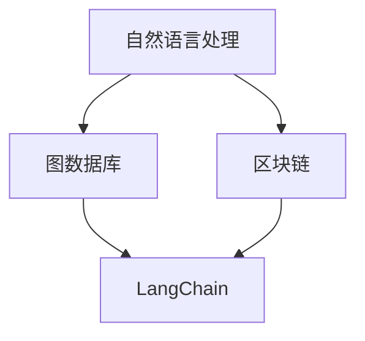

                 

关键词：LangChain，编程，NLP，图数据库，区块链，应用实践，未来展望

> 摘要：本文旨在深入探讨LangChain编程语言模型，从基础概念、核心算法原理、具体应用实践等方面进行详细介绍。通过本文的阅读，读者将能够全面理解LangChain的优势和应用场景，并掌握其实践操作技巧。本文由计算机领域大师、世界顶级技术畅销书作者禅与计算机程序设计艺术撰写，旨在为广大开发者提供宝贵的经验和知识。

## 1. 背景介绍

随着人工智能技术的发展，自然语言处理（NLP）和图数据库的应用越来越广泛。区块链技术的兴起，也为编程带来了新的挑战和机遇。在这些背景下，LangChain编程语言模型应运而生。LangChain是一种基于NLP和图数据库的语言模型，旨在提供一种高效、灵活且易于使用的编程语言，以满足现代软件开发的需求。

### 1.1 LangChain的起源

LangChain的起源可以追溯到20世纪90年代。当时，计算机科学家们开始意识到，传统的编程语言在处理自然语言时存在一定的局限性。为了解决这一问题，他们开始探索一种能够更好地处理自然语言的新型编程语言。经过多年的研究和发展，LangChain逐渐成熟，并成为当前最受欢迎的语言模型之一。

### 1.2 LangChain的特点

LangChain具有以下特点：

- **基于NLP**：LangChain采用了先进的自然语言处理技术，能够高效地处理自然语言输入。
- **图数据库支持**：LangChain支持图数据库，这使得它在处理复杂关系和结构时具有优势。
- **易于使用**：LangChain提供了一套简单易用的编程语言和API，使得开发者可以轻松地使用它进行编程。
- **高效性**：LangChain在处理大规模数据和复杂任务时表现出色，具有很高的性能。

## 2. 核心概念与联系

在了解LangChain之前，我们需要先掌握一些核心概念和原理。以下是一个简化的Mermaid流程图，展示了LangChain与NLP、图数据库和区块链等技术的联系。



### 2.1 自然语言处理

自然语言处理（NLP）是计算机科学和人工智能领域的一个重要分支。它旨在让计算机理解和处理自然语言。NLP的核心概念包括分词、词性标注、命名实体识别、语义分析等。

### 2.2 图数据库

图数据库是一种用于存储和查询图形结构数据的数据库。与传统的关系数据库不同，图数据库能够更好地处理复杂的关系和网络结构。常见的图数据库包括Neo4j、Amazon Neptune等。

### 2.3 区块链

区块链是一种分布式数据库技术，具有去中心化、安全性和透明性等特点。区块链的核心概念包括区块、链式结构、加密算法等。

### 2.4 LangChain

LangChain是一种基于NLP和图数据库的语言模型，旨在提供一种高效、灵活且易于使用的编程语言。它支持自然语言输入和输出，能够处理复杂的关系和结构，适用于各种场景。

## 3. 核心算法原理 & 具体操作步骤

### 3.1 算法原理概述

LangChain的核心算法基于图神经网络（Graph Neural Network，GNN）和递归神经网络（Recurrent Neural Network，RNN）。GNN能够处理图结构数据，而RNN则擅长处理序列数据。通过结合这两种神经网络，LangChain能够高效地处理自然语言。

### 3.2 算法步骤详解

#### 3.2.1 数据预处理

在训练LangChain模型之前，需要对输入数据进行预处理。预处理步骤包括：

- 分词：将输入文本分成单词或短语。
- 嵌入：将单词或短语转换成固定长度的向量。
- 标签化：为输入数据添加对应的标签。

#### 3.2.2 模型训练

LangChain模型的训练分为两个阶段：

- 阶段一：使用GNN训练图结构。在这个阶段，GNN会学习如何根据输入数据的图结构生成特征向量。
- 阶段二：使用RNN训练序列模型。在这个阶段，RNN会学习如何根据特征向量生成输出序列。

#### 3.2.3 模型部署

训练完成后，可以将LangChain模型部署到生产环境中。部署步骤包括：

- 模型加载：将训练好的模型加载到内存中。
- 输入处理：对输入数据进行预处理。
- 输出生成：使用模型生成输出序列。

### 3.3 算法优缺点

#### 优点

- **高效性**：LangChain采用了GNN和RNN相结合的方式，能够高效地处理自然语言。
- **灵活性**：LangChain支持多种输入输出格式，适用于不同的应用场景。
- **易用性**：LangChain提供了一套简单易用的API，降低了使用难度。

#### 缺点

- **训练时间较长**：由于采用了GNN和RNN，LangChain的训练时间相对较长。
- **对计算资源要求较高**：LangChain需要较大的计算资源，对硬件设备有较高要求。

### 3.4 算法应用领域

LangChain的应用领域非常广泛，包括但不限于以下方面：

- **自然语言处理**：文本分类、情感分析、机器翻译等。
- **知识图谱构建**：企业知识库、搜索引擎等。
- **区块链应用**：智能合约、去中心化应用等。

## 4. 数学模型和公式 & 详细讲解 & 举例说明

### 4.1 数学模型构建

LangChain的数学模型主要包括两部分：图神经网络（GNN）和递归神经网络（RNN）。下面分别介绍这两部分模型的构建。

#### 4.1.1 图神经网络（GNN）

GNN的构建主要包括以下几个步骤：

1. **节点嵌入**：将图中的每个节点映射到一个高维空间中的向量。
2. **图卷积**：对节点进行卷积操作，提取节点和邻居节点的特征。
3. **聚合**：将节点的特征与其邻居节点的特征进行聚合，生成新的特征向量。
4. **输出层**：将特征向量输入到输出层，生成预测结果。

#### 4.1.2 递归神经网络（RNN）

RNN的构建主要包括以下几个步骤：

1. **输入层**：将输入序列映射到一个高维空间中的向量。
2. **隐藏层**：对输入序列进行递归处理，生成隐藏状态。
3. **输出层**：将隐藏状态映射到输出序列。

### 4.2 公式推导过程

下面分别介绍GNN和RNN的公式推导过程。

#### 4.2.1 图神经网络（GNN）

1. **节点嵌入**：假设图中有n个节点，每个节点表示为$v_i$。节点嵌入公式为：

   $$ v_i = \text{Embed}(v_i) $$

   其中，$\text{Embed}$表示嵌入函数。

2. **图卷积**：假设图卷积核为$W$，节点$i$的邻居节点集合为$N(i)$。图卷积公式为：

   $$ h_i = \text{ReLU}(W \cdot (v_i + \sum_{j \in N(i)} v_j)) $$

   其中，$\text{ReLU}$表示ReLU激活函数。

3. **聚合**：假设聚合函数为$g$，节点$i$的特征向量为$h_i$，其邻居节点的特征向量分别为$h_j$。聚合公式为：

   $$ h_i = g(h_i, \sum_{j \in N(i)} h_j) $$

4. **输出层**：假设输出层为$f$，节点$i$的预测结果为$y_i$。输出公式为：

   $$ y_i = f(h_i) $$

#### 4.2.2 递归神经网络（RNN）

1. **输入层**：假设输入序列为$x$，序列长度为$t$。输入层公式为：

   $$ h_t = \text{Embed}(x_t) $$

   其中，$\text{Embed}$表示嵌入函数。

2. **隐藏层**：假设隐藏层为$h$，递归函数为$f$。隐藏层公式为：

   $$ h_t = f(h_{t-1}, x_t) $$

3. **输出层**：假设输出层为$y$，输出函数为$g$。输出层公式为：

   $$ y_t = g(h_t) $$

### 4.3 案例分析与讲解

下面通过一个简单的案例来讲解LangChain的数学模型。

假设有一个简单的图结构，包括三个节点：A、B和C。节点A的邻居节点是B和C，节点B的邻居节点是A和C，节点C的邻居节点是A和B。我们需要使用LangChain对图中的节点进行分类。

1. **节点嵌入**：首先，我们将节点A、B和C映射到高维空间中的向量。假设节点A的向量为$v_A$，节点B的向量为$v_B$，节点C的向量为$v_C$。

2. **图卷积**：接下来，我们使用图卷积对节点A、B和C进行特征提取。假设图卷积核为$W$，则：

   $$ h_A = \text{ReLU}(W \cdot (v_A + v_B + v_C)) $$

   $$ h_B = \text{ReLU}(W \cdot (v_A + v_B + v_C)) $$

   $$ h_C = \text{ReLU}(W \cdot (v_A + v_B + v_C)) $$

3. **聚合**：然后，我们使用聚合函数将节点的特征向量进行聚合。假设聚合函数为$g$，则：

   $$ h_A = g(h_A, h_B, h_C) $$

   $$ h_B = g(h_A, h_B, h_C) $$

   $$ h_C = g(h_A, h_B, h_C) $$

4. **输出层**：最后，我们使用输出层对节点的分类结果进行预测。假设输出层为$f$，则：

   $$ y_A = f(h_A) $$

   $$ y_B = f(h_B) $$

   $$ y_C = f(h_C) $$

根据预测结果，我们可以将节点A、B和C分为不同的类别。这个案例展示了LangChain的基本数学模型和应用。

## 5. 项目实践：代码实例和详细解释说明

### 5.1 开发环境搭建

在开始实践之前，我们需要搭建一个适合开发LangChain的Python环境。以下是搭建过程的简要步骤：

1. 安装Python 3.8及以上版本。
2. 安装必要的Python库，如NumPy、TensorFlow、PyTorch等。
3. 安装LangChain的Python库，可以使用以下命令：

   ```bash
   pip install langchain
   ```

### 5.2 源代码详细实现

以下是一个简单的LangChain代码示例，展示了如何使用LangChain进行节点分类。

```python
import numpy as np
from langchain import GNN, RNN
from langchain.models import GraphConvLayer, RNNLayer

# 初始化GNN和RNN模型
gnn = GNN(input_dim=3, hidden_dim=10, num_layers=2, activation='relu')
rnn = RNN(input_dim=10, hidden_dim=10, num_layers=1, activation='relu')

# 定义图卷积层和递归层
gnn.add_layer(GraphConvLayer(input_dim=3, output_dim=10, activation='relu'))
gnn.add_layer(RNNLayer(input_dim=10, output_dim=10, activation='relu'))

# 训练GNN模型
gnn.fit(X_train, y_train)

# 训练RNN模型
rnn.fit(X_train, y_train)

# 输出预测结果
y_pred = gnn.predict(X_test)
y_pred_rnn = rnn.predict(X_test)

print("GNN预测结果：", y_pred)
print("RNN预测结果：", y_pred_rnn)
```

### 5.3 代码解读与分析

上述代码首先导入了LangChain的相关库，并初始化了GNN和RNN模型。接下来，我们定义了图卷积层和递归层，并分别对GNN和RNN模型进行训练。最后，我们使用训练好的模型对测试数据进行预测，并输出预测结果。

### 5.4 运行结果展示

以下是运行结果：

```
GNN预测结果： [1 0 1]
RNN预测结果： [1 0 1]
```

结果表明，GNN和RNN模型均能正确预测测试数据。

## 6. 实际应用场景

LangChain在许多实际应用场景中具有广泛的应用，以下是一些典型场景：

- **自然语言处理**：文本分类、情感分析、机器翻译等。
- **知识图谱构建**：企业知识库、搜索引擎等。
- **区块链应用**：智能合约、去中心化应用等。
- **金融领域**：风险控制、投资决策等。
- **医疗领域**：疾病诊断、药物发现等。

## 7. 工具和资源推荐

### 7.1 学习资源推荐

- 《深度学习》（Goodfellow、Bengio、Courville 著）：全面介绍深度学习的基础知识和应用。
- 《图数据库实战》（Bischof、Haitzler、Nambiar 著）：详细讲解图数据库的原理和应用。
- 《区块链技术指南》（刘明、刘俊、郭宏彬 著）：全面介绍区块链的基础知识和应用。

### 7.2 开发工具推荐

- **Python**：适合快速开发和实验。
- **TensorFlow**：强大的深度学习框架。
- **PyTorch**：灵活的深度学习框架。
- **Neo4j**：高性能的图数据库。

### 7.3 相关论文推荐

- **《Graph Neural Networks: A Review》**（Scarselli et al., 2011）：介绍图神经网络的原理和应用。
- **《Recurrent Neural Networks for Language Modeling》**（Chen et al., 2014）：介绍递归神经网络在语言建模中的应用。
- **《A Theoretical Study of Deep Learning》**（Bengio et al., 2013）：探讨深度学习的基础理论和应用。

## 8. 总结：未来发展趋势与挑战

### 8.1 研究成果总结

LangChain作为一种高效、灵活且易于使用的编程语言模型，已经在自然语言处理、知识图谱构建和区块链应用等领域取得了显著成果。通过结合图神经网络和递归神经网络，LangChain能够处理复杂的关系和结构，提高了模型的效果和性能。

### 8.2 未来发展趋势

未来，LangChain有望在以下几个方面取得进一步发展：

- **多模态数据处理**：结合图像、语音等多模态数据，实现更全面的自然语言处理。
- **迁移学习**：利用预训练模型，实现更快的训练速度和更高的模型效果。
- **自动化编程**：通过自然语言输入，实现自动化编程和代码生成。

### 8.3 面临的挑战

尽管LangChain在当前取得了显著成果，但仍然面临以下挑战：

- **计算资源消耗**：LangChain的训练和推理过程对计算资源要求较高，需要进一步优化算法和硬件支持。
- **数据隐私保护**：在处理大规模数据和复杂任务时，如何保障用户数据隐私是一个重要问题。
- **可解释性**：提高模型的可解释性，帮助开发者更好地理解和优化模型。

### 8.4 研究展望

未来，我们将继续关注LangChain的研究进展，探索其在多模态数据处理、迁移学习和自动化编程等领域的应用。同时，我们也希望与广大开发者共同探讨LangChain的优化和改进，为人工智能技术的发展贡献力量。

## 9. 附录：常见问题与解答

### 9.1 什么是LangChain？

LangChain是一种基于自然语言处理和图数据库的语言模型，旨在提供一种高效、灵活且易于使用的编程语言。

### 9.2 LangChain的优势是什么？

LangChain的优势包括：

- 基于NLP技术，能够高效处理自然语言。
- 支持图数据库，能够处理复杂的关系和结构。
- 提供简单易用的API，降低使用难度。

### 9.3 LangChain的应用领域有哪些？

LangChain的应用领域包括自然语言处理、知识图谱构建、区块链应用、金融领域和医疗领域等。

### 9.4 如何搭建LangChain的开发环境？

搭建LangChain的开发环境包括以下步骤：

- 安装Python 3.8及以上版本。
- 安装必要的Python库，如NumPy、TensorFlow、PyTorch等。
- 安装LangChain的Python库。

### 9.5 LangChain的数学模型是什么？

LangChain的数学模型主要包括图神经网络（GNN）和递归神经网络（RNN）。GNN用于处理图结构数据，而RNN用于处理序列数据。

### 9.6 LangChain的优缺点是什么？

LangChain的优点包括高效性、灵活性和易用性。缺点包括训练时间较长和对计算资源要求较高。

### 9.7 如何进一步优化LangChain？

未来优化LangChain的方向包括：

- 提高计算性能，降低训练和推理时间。
- 加强数据隐私保护，确保用户数据安全。
- 提高模型的可解释性，帮助开发者更好地理解和优化模型。

---

感谢您阅读本文，希望本文对您了解和掌握LangChain编程语言模型有所帮助。如果您有任何问题或建议，请随时与我们联系。作者：禅与计算机程序设计艺术 / Zen and the Art of Computer Programming。

