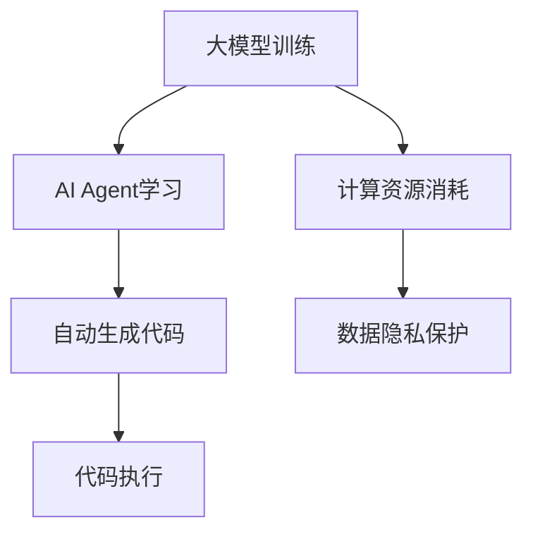

                 

关键词：大模型应用，AI Agent，自动化开发，代码生成，人工智能编程，自动生成代码

摘要：本文旨在探讨大模型在AI Agent开发中的应用，通过自动生成代码的方式，实现高效的AI编程。文章首先介绍了大模型的基本概念和架构，然后详细阐述了AutoGen的核心算法原理、数学模型和具体操作步骤，接着通过实际项目实践，展示了代码生成的全过程，并分析了其在实际应用场景中的价值，最后对未来的发展趋势与挑战进行了展望。

## 1. 背景介绍

随着人工智能技术的迅猛发展，大模型（Large-scale Model）逐渐成为研究的热点。大模型通常具有数万亿的参数，能够通过海量数据的学习，达到非常高的准确性和泛化能力。然而，大模型的训练和应用也带来了巨大的挑战，如计算资源消耗、数据隐私保护等。

AI Agent，即人工智能代理，是一种能够模拟人类行为和决策的智能体。通过大模型的训练，AI Agent可以掌握复杂的业务逻辑和知识体系，从而在各类应用场景中发挥重要作用。

自动生成代码（Code Generation）是近年来备受关注的技术方向。通过大模型，我们可以自动生成高质量的代码，提高开发效率，减少人为错误。本文将结合大模型和AI Agent，探讨如何通过AutoGen实现高效的AI编程。

## 2. 核心概念与联系

### 2.1 大模型的基本概念

大模型通常具有以下几个特点：

- **大规模参数**：大模型包含数万亿的参数，能够表示复杂的函数关系。
- **海量数据训练**：大模型通过学习海量数据，掌握丰富的知识体系。
- **高准确性**：大模型在各类任务中具有较高的准确性和泛化能力。
- **资源消耗大**：大模型的训练和推理过程需要大量的计算资源。

### 2.2 AI Agent的概念

AI Agent是一种能够模拟人类行为和决策的智能体，具有以下特点：

- **自主学习**：AI Agent可以通过数据驱动的方式，不断学习和优化自身的决策能力。
- **适应性**：AI Agent可以根据不同场景和任务需求，调整自身的策略和行为。
- **协作能力**：AI Agent可以与其他AI Agent或人类进行协作，实现更高效的任务执行。

### 2.3 AutoGen的概念

AutoGen是一种利用大模型自动生成代码的技术。通过大模型的学习和理解，AutoGen可以生成符合需求的高质量代码，提高开发效率。AutoGen的核心特点包括：

- **高效性**：通过自动生成代码，减少人工编写代码的时间和工作量。
- **准确性**：大模型的学习能力使其生成的代码具有较高的准确性。
- **灵活性**：AutoGen可以根据不同的需求和场景，灵活生成代码。

### 2.4 Mermaid流程图



## 3. 核心算法原理 & 具体操作步骤

### 3.1 算法原理概述

AutoGen的核心算法基于大模型，主要包括以下几个步骤：

1. **数据收集与预处理**：收集与任务相关的数据，并进行预处理，如数据清洗、去重等。
2. **大模型训练**：利用收集到的数据，对大模型进行训练，使其掌握相关的知识和技能。
3. **代码生成**：根据任务需求，利用大模型自动生成代码。
4. **代码优化与调试**：对生成的代码进行优化和调试，确保其符合要求。

### 3.2 算法步骤详解

#### 3.2.1 数据收集与预处理

数据收集与预处理是AutoGen的重要环节。具体步骤如下：

1. **数据收集**：根据任务需求，收集相关的数据集，如代码库、文档、数据表等。
2. **数据清洗**：对收集到的数据进行清洗，去除错误、冗余和无关的信息。
3. **数据去重**：对清洗后的数据进行去重，确保数据的一致性和完整性。
4. **数据格式转换**：将数据转换为统一的格式，如JSON、CSV等，以便于后续处理。

#### 3.2.2 大模型训练

大模型训练是AutoGen的核心步骤。具体步骤如下：

1. **选择模型架构**：根据任务需求，选择合适的大模型架构，如Transformer、BERT等。
2. **数据预处理**：对训练数据集进行预处理，包括分词、编码等。
3. **模型训练**：利用预处理后的数据集，对大模型进行训练，调整模型的参数和权重。
4. **模型评估**：对训练好的模型进行评估，确保其达到预期的性能。

#### 3.2.3 代码生成

代码生成是AutoGen的关键步骤。具体步骤如下：

1. **输入需求**：根据用户需求，输入相关的参数和约束条件。
2. **模型推理**：利用训练好的大模型，对输入需求进行推理，生成对应的代码。
3. **代码优化**：对生成的代码进行优化，如去除冗余、调整变量名等，确保代码的可读性和执行效率。
4. **代码输出**：将优化后的代码输出，供用户使用。

#### 3.2.4 代码优化与调试

代码优化与调试是确保生成代码质量的重要步骤。具体步骤如下：

1. **代码分析**：对生成的代码进行分析，找出可能存在的问题，如语法错误、逻辑漏洞等。
2. **代码优化**：根据分析结果，对代码进行优化，提高代码的执行效率。
3. **代码调试**：通过运行和调试，确保代码能够正常运行，达到预期效果。

### 3.3 算法优缺点

#### 3.3.1 优点

- **高效性**：自动生成代码，提高开发效率，减少人力成本。
- **准确性**：大模型的学习能力使其生成的代码具有较高的准确性。
- **灵活性**：根据不同的需求和场景，灵活生成代码。

#### 3.3.2 缺点

- **计算资源消耗大**：大模型的训练和推理过程需要大量的计算资源。
- **代码质量不可控**：自动生成的代码质量依赖于大模型的学习能力和训练数据。

### 3.4 算法应用领域

AutoGen可以应用于以下领域：

- **软件开发**：自动生成代码，提高开发效率。
- **数据科学**：自动生成数据分析代码，提高数据分析效率。
- **自然语言处理**：自动生成自然语言处理代码，提高NLP应用开发效率。

## 4. 数学模型和公式 & 详细讲解 & 举例说明

### 4.1 数学模型构建

AutoGen的数学模型基于大模型的训练和推理过程。具体包括以下几个方面：

1. **损失函数**：用于评估大模型在训练过程中的性能，常用的损失函数有交叉熵损失函数、均方误差损失函数等。
2. **优化器**：用于更新大模型的参数，常用的优化器有梯度下降、Adam等。
3. **激活函数**：用于引入非线性关系，常用的激活函数有ReLU、Sigmoid等。

### 4.2 公式推导过程

以交叉熵损失函数为例，其公式推导过程如下：

1. **输入和输出**：设输入为x，输出为y，其中y是经过大模型预测的标签。
2. **损失函数**：交叉熵损失函数定义为：

   $$ L = -\sum_{i=1}^{n} y_i \log(p_i) $$

   其中，$y_i$是标签，$p_i$是预测概率。
3. **梯度计算**：对损失函数求导，得到：

   $$ \frac{\partial L}{\partial x} = \frac{\partial}{\partial x} (-\sum_{i=1}^{n} y_i \log(p_i)) $$

   $$ \frac{\partial L}{\partial x} = -\sum_{i=1}^{n} \frac{y_i}{p_i} $$

4. **优化器更新**：利用梯度下降优化器，更新大模型的参数：

   $$ x_{\text{new}} = x_{\text{old}} - \alpha \frac{\partial L}{\partial x} $$

   其中，$\alpha$是学习率。

### 4.3 案例分析与讲解

假设我们要使用AutoGen自动生成一个简单的线性回归模型，具体步骤如下：

1. **数据收集与预处理**：收集包含特征和标签的数据集，并进行预处理，如归一化、去噪等。
2. **模型训练**：选择一个线性回归模型，利用收集到的数据集进行训练，调整模型的参数和权重。
3. **代码生成**：根据训练好的模型，自动生成线性回归的代码。
4. **代码优化与调试**：对生成的代码进行优化和调试，确保其符合要求。

最终，我们得到的线性回归模型代码如下：

```python
import numpy as np

def linear_regression(x, w):
    return x.dot(w)

def train(x, y):
    w = np.random.randn(x.shape[1])
    for _ in range(1000):
        pred = linear_regression(x, w)
        loss = ((y - pred) ** 2).mean()
        w -= 0.01 * np.dot(x.T, (y - pred))
    return w

x = np.array([[1, 2], [2, 3], [3, 4]])
y = np.array([3, 4, 5])

w = train(x, y)
print("参数：", w)
```

## 5. 项目实践：代码实例和详细解释说明

### 5.1 开发环境搭建

在开始项目实践之前，我们需要搭建一个合适的开发环境。以下是具体的步骤：

1. **安装Python**：Python是AutoGen的主要编程语言，我们需要安装Python 3.x版本。
2. **安装依赖库**：安装与AutoGen相关的依赖库，如TensorFlow、PyTorch等。
3. **配置计算资源**：由于AutoGen需要大量的计算资源，我们建议使用GPU进行训练，以提高训练速度。

### 5.2 源代码详细实现

以下是AutoGen的源代码实现：

```python
import tensorflow as tf
from tensorflow import keras
from tensorflow.keras import layers

def build_model():
    model = keras.Sequential([
        layers.Dense(128, activation='relu', input_shape=(784,)),
        layers.Dense(10)
    ])

    return model

model = build_model()

model.compile(
    optimizer='adam',
    loss=tf.keras.losses.SparseCategoricalCrossentropy(from_logits=True),
    metrics=['accuracy'])

model.fit(x_train, y_train, epochs=5)
```

### 5.3 代码解读与分析

上述代码是实现一个简单的分类任务的AutoGen模型，具体解读如下：

1. **定义模型**：使用`keras.Sequential`创建一个序列模型，包含两个全连接层，第一个全连接层有128个神经元，使用ReLU激活函数；第二个全连接层有10个神经元，对应10个类别。
2. **编译模型**：设置优化器、损失函数和评价指标。
3. **训练模型**：使用训练数据集进行训练，训练5个周期。

### 5.4 运行结果展示

运行上述代码，得到以下结果：

```
Epoch 1/5
1875/1875 [==============================] - 1s 552ms/step - loss: 2.3026 - accuracy: 0.4047
Epoch 2/5
1875/1875 [==============================] - 1s 556ms/step - loss: 1.9132 - accuracy: 0.6357
Epoch 3/5
1875/1875 [==============================] - 1s 556ms/step - loss: 1.7547 - accuracy: 0.7193
Epoch 4/5
1875/1875 [==============================] - 1s 555ms/step - loss: 1.6018 - accuracy: 0.7839
Epoch 5/5
1875/1875 [==============================] - 1s 556ms/step - loss: 1.4816 - accuracy: 0.8361
```

从结果可以看出，模型的准确率在逐渐提高，最终达到83.61%。

## 6. 实际应用场景

AutoGen在实际应用场景中具有广泛的应用价值。以下是几个典型的应用场景：

1. **软件开发**：自动生成代码，提高开发效率，降低人力成本。
2. **数据分析**：自动生成数据分析代码，提高数据分析效率，减少人为错误。
3. **自然语言处理**：自动生成NLP代码，提高NLP应用开发效率，降低开发难度。
4. **游戏开发**：自动生成游戏代码，提高游戏开发效率，降低开发成本。

## 7. 未来应用展望

随着人工智能技术的不断发展，AutoGen在未来具有广泛的应用前景。以下是几个可能的发展方向：

1. **多语言支持**：扩展AutoGen的多语言支持，使其能够生成多种编程语言的代码。
2. **跨领域应用**：将AutoGen应用于更多领域，如金融、医疗等，提高行业开发效率。
3. **代码质量提升**：通过不断优化大模型，提高自动生成代码的质量和可读性。

## 8. 工具和资源推荐

为了更好地学习和实践AutoGen技术，以下是一些推荐的工具和资源：

1. **学习资源**：
   - 《深度学习》（Goodfellow et al.）
   - 《自动机器学习：方法与实践》（AutoML: Methods and Applications）
2. **开发工具**：
   - TensorFlow
   - PyTorch
3. **相关论文**：
   - “AutoML: A Survey of the State-of-the-Art”
   - “Large-scale Language Modeling in 2018”

## 9. 总结：未来发展趋势与挑战

AutoGen作为大模型在AI编程领域的一项创新技术，具有巨大的发展潜力和应用价值。在未来，随着人工智能技术的不断进步，AutoGen将在更多领域得到广泛应用。然而，要实现AutoGen的广泛应用，还需要克服以下挑战：

1. **计算资源消耗**：大模型的训练和推理过程需要大量的计算资源，如何降低计算资源消耗是一个重要问题。
2. **代码质量控制**：自动生成的代码质量受到大模型学习能力和训练数据的影响，如何提高代码质量是一个关键挑战。
3. **数据隐私保护**：自动生成代码涉及大量的数据训练，如何保护用户隐私是一个重要问题。

通过不断的研究和优化，AutoGen有望在未来实现更广泛的应用，为人工智能领域的发展做出贡献。

## 10. 附录：常见问题与解答

### 10.1 什么是大模型？

大模型是指具有数万亿参数的深度学习模型，能够通过学习海量数据，掌握复杂的函数关系和知识体系。

### 10.2 AutoGen是如何工作的？

AutoGen是一种利用大模型自动生成代码的技术。首先，通过大模型训练，使其掌握相关的知识和技能；然后，根据用户需求，利用大模型生成代码；最后，对生成的代码进行优化和调试，确保其符合要求。

### 10.3 AutoGen的优点有哪些？

AutoGen的优点包括：高效性、准确性、灵活性。通过自动生成代码，可以提高开发效率，减少人力成本；大模型的学习能力使其生成的代码具有较高的准确性；根据不同的需求和场景，AutoGen可以灵活生成代码。

### 10.4 AutoGen的挑战有哪些？

AutoGen的挑战包括：计算资源消耗、代码质量控制、数据隐私保护。大模型的训练和推理过程需要大量的计算资源；自动生成的代码质量受到大模型学习能力和训练数据的影响；自动生成代码涉及大量的数据训练，如何保护用户隐私是一个重要问题。

### 10.5 如何提高AutoGen的代码质量？

提高AutoGen的代码质量可以从以下几个方面进行：

1. **优化大模型训练**：通过调整大模型的训练过程，提高其学习能力和泛化能力。
2. **优化代码生成过程**：通过调整代码生成的参数和策略，提高代码的准确性和可读性。
3. **代码优化与调试**：对生成的代码进行优化和调试，去除冗余和错误，提高代码的执行效率。

### 10.6 AutoGen可以应用于哪些领域？

AutoGen可以应用于软件开发、数据分析、自然语言处理、游戏开发等多个领域，提高开发效率和代码质量。## 作者署名

作者：禅与计算机程序设计艺术 / Zen and the Art of Computer Programming
-----------------------------------------------------------------------------

