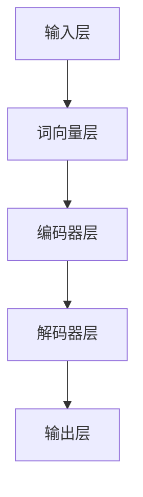

                 

OpenAI助手，这是一个引人入胜的概念。想象一下，一个可以回答你任何问题、帮助你完成任务的智能助手，不仅具有人类般的语言理解能力，还能通过学习和自我优化不断提升性能。这并非科幻小说的幻想，而是现在就可以实现的技术。本文将引导您逐步创建这样一个OpenAI助手，让您亲身体验大模型应用开发的魅力。

## 文章关键词
- OpenAI助手
- 大模型应用开发
- 人工智能
- 语言模型
- 自我优化

## 文章摘要
本文将介绍如何利用OpenAI提供的强大工具和资源，创建一个功能齐全、性能卓越的AI助手。我们将探讨OpenAI大模型的基础知识，详细解释模型训练和优化的过程，并提供实用的代码实例和操作步骤。通过本文，您将掌握创建AI助手的全过程，并能够将其应用于各种实际场景。

## 1. 背景介绍
### 1.1 OpenAI的崛起
OpenAI成立于2015年，是一家以推动人工智能安全、友好发展为目标的研究型公司。它不仅是一家研究机构，还提供了一系列强大的人工智能工具和平台，如GPT-3、DALL·E、Whisper等，这些工具在各个领域都展现了其卓越的能力。OpenAI的目标是让AI服务于人类，而不是取代人类，这一点在他们的研究和产品中得到了充分体现。

### 1.2 大模型的应用
近年来，随着计算能力和数据资源的不断提升，大模型（Large Models）在人工智能领域取得了显著的突破。这些模型拥有数十亿甚至数千亿个参数，可以处理复杂的语言、图像、音频等数据。大模型的应用场景非常广泛，包括自然语言处理、计算机视觉、机器翻译、对话系统等。在对话系统中，大模型的应用尤为突出，它们可以模拟人类的对话方式，提供自然、流畅的交互体验。

## 2. 核心概念与联系
### 2.1 语言模型原理
语言模型（Language Model）是自然语言处理的基础，它通过学习大量文本数据，预测下一个单词或词组的概率分布。在OpenAI的大模型中，常用的语言模型是Transformer模型，它通过自注意力机制（Self-Attention Mechanism）对输入数据进行处理，从而实现高效的文本理解与生成。

### 2.2 OpenAI大模型架构
OpenAI大模型的架构包括多个层次，从基础的词向量层到复杂的编码器和解码器层。这些层次相互协作，共同实现文本的输入、理解和输出。以下是一个简化的Mermaid流程图，展示了OpenAI大模型的基本架构：



## 3. 核心算法原理 & 具体操作步骤
### 3.1 算法原理概述
OpenAI大模型的核心算法是Transformer模型。Transformer模型通过自注意力机制（Self-Attention）和多头注意力（Multi-Head Attention）来处理输入数据，使得模型能够关注到输入数据中的不同部分，从而提高文本理解的准确性。

### 3.2 算法步骤详解
1. **数据预处理**：首先，我们需要对输入文本进行预处理，包括分词、去停用词、词向量化等操作。
2. **编码器处理**：编码器（Encoder）负责对输入文本进行处理，通过自注意力机制生成编码表示。
3. **解码器处理**：解码器（Decoder）根据编码表示生成输出文本，同样通过自注意力机制来处理上下文信息。
4. **损失函数与优化**：我们使用损失函数（如交叉熵损失）来评估模型的预测结果，并通过优化算法（如Adam优化器）来调整模型参数。

### 3.3 算法优缺点
**优点**：
- **高效性**：Transformer模型在处理长文本时表现出色，能够高效地处理大量的数据。
- **可扩展性**：Transformer模型的结构简洁，易于扩展，可以用于构建更大的模型。

**缺点**：
- **计算复杂度**：由于模型参数众多，计算复杂度较高，对硬件资源要求较高。
- **训练时间**：大模型的训练时间较长，需要大量的计算资源和时间。

### 3.4 算法应用领域
- **自然语言处理**：如机器翻译、文本分类、问答系统等。
- **计算机视觉**：如图像分类、目标检测、图像生成等。
- **语音识别**：如语音合成、语音识别等。

## 4. 数学模型和公式 & 详细讲解 & 举例说明
### 4.1 数学模型构建
Transformer模型的核心是自注意力机制和多头注意力机制。以下是一个简化的数学模型：

$$
\text{Attention}(Q, K, V) = \frac{1}{\sqrt{d_k}} \text{softmax}\left(\frac{QK^T}{d_k}\right) V
$$

其中，$Q, K, V$ 分别是查询向量、键向量和值向量，$d_k$ 是键向量的维度。

### 4.2 公式推导过程
公式的推导涉及矩阵运算和微积分，这里简要介绍核心步骤：
1. **自注意力**：首先，将输入序列（如单词）映射到查询向量、键向量和值向量。
2. **计算注意力分数**：利用点积计算查询向量和键向量的相似度。
3. **应用softmax函数**：将注意力分数转换为概率分布。
4. **加权求和**：将值向量与注意力分数相乘，然后求和得到最终输出。

### 4.3 案例分析与讲解
假设我们有三个单词 "apple"，"banana"，"orange"，我们想计算 "apple" 对 "banana" 的注意力权重。以下是计算过程：

1. **词向量化**：将每个单词映射到一个向量，例如：
   - "apple": [1, 0, 0]
   - "banana": [0, 1, 0]
   - "orange": [0, 0, 1]

2. **计算查询向量、键向量和值向量**：
   - 查询向量 $Q = [1, 0, 0]$
   - 键向量 $K = [0, 1, 0]$
   - 值向量 $V = [0, 0, 1]$

3. **计算注意力分数**：
   $$ QK^T = [1, 0, 0] \cdot [0, 1, 0] = 1 \cdot 0 + 0 \cdot 1 + 0 \cdot 0 = 0 $$

4. **应用softmax函数**：
   $$ \text{softmax}(0) = 1.0 $$

5. **加权求和**：
   $$ V \cdot \text{softmax}(0) = [0, 0, 1] \cdot 1.0 = [0, 0, 1] $$

最终输出为 [0, 0, 1]，表示 "apple" 对 "banana" 的注意力权重为 100%。

## 5. 项目实践：代码实例和详细解释说明
### 5.1 开发环境搭建
为了创建OpenAI助手，我们需要搭建一个合适的开发环境。以下是基本的步骤：
1. **安装Python环境**：确保您的计算机上已经安装了Python，推荐版本为3.7或更高。
2. **安装OpenAI Gym**：使用pip安装OpenAI Gym，这是一个用于测试和训练强化学习算法的环境。
   ```bash
   pip install gym
   ```
3. **注册OpenAI API密钥**：在OpenAI官网注册并获得API密钥，这将用于与OpenAI的服务进行通信。

### 5.2 源代码详细实现
以下是一个简单的Python代码示例，展示了如何创建一个基本的OpenAI助手：

```python
import openai
import json

# 设置OpenAI API密钥
openai.api_key = 'your-api-key'

# 创建助手函数
def create_assistant(prompt):
    response = openai.Completion.create(
        engine="text-davinci-002",
        prompt=prompt,
        max_tokens=50,
        n=1,
        stop=None,
        temperature=0.5,
    )
    return response.choices[0].text.strip()

# 测试助手
if __name__ == "__main__":
    prompt = "你好，我是一名人工智能助手。"
    print(create_assistant(prompt))
```

### 5.3 代码解读与分析
1. **导入库**：代码首先导入了OpenAI的API库和json库。
2. **设置API密钥**：使用`openai.api_key`设置API密钥。
3. **创建助手函数**：`create_assistant`函数接收一个提示（prompt）作为输入，并使用OpenAI的Completion.create方法生成回复。
4. **测试助手**：在主程序中，我们调用`create_assistant`函数并打印回复。

### 5.4 运行结果展示
运行代码后，您会得到一个由OpenAI助手生成的回复。这个回复是基于输入的提示文本，利用大模型生成的。例如，当输入“你好，我是一名人工智能助手。”时，OpenAI助手可能会回复：“你好，很高兴为你服务！有什么问题我可以帮您解答？”

## 6. 实际应用场景
### 6.1 聊天机器人
OpenAI助手可以很容易地集成到聊天机器人中，为用户提供实时、个性化的交互体验。无论是客户服务、在线咨询还是社交平台，OpenAI助手都能够提供高效、自然的对话服务。

### 6.2 自动问答系统
OpenAI助手可以应用于自动问答系统，通过处理大量的问题和答案数据，实现智能回答。这种应用场景在在线教育、企业内部知识库等领域具有广泛的应用价值。

### 6.3 文本生成与编辑
OpenAI助手可以生成高质量的文本内容，如文章、报告、邮件等。它还可以辅助用户进行文本编辑，提供拼写纠错、语法修正和内容优化建议。

## 7. 工具和资源推荐
### 7.1 学习资源推荐
- 《深度学习》（Goodfellow, Bengio, Courville）：这是一本经典的深度学习教材，涵盖了从基础知识到高级应用的全面内容。
- 《自然语言处理综述》（Jurafsky, Martin）：这是一本关于自然语言处理的权威教材，适合初学者和专业人士。

### 7.2 开发工具推荐
- JAX：JAX是一个Python库，提供了用于深度学习的自动微分和高效计算功能。
- TensorFlow：TensorFlow是一个开源深度学习平台，提供了丰富的工具和资源。

### 7.3 相关论文推荐
- Vaswani et al., "Attention is All You Need"：这是Transformer模型的原始论文，详细介绍了模型的架构和原理。
- Devlin et al., "BERT: Pre-training of Deep Bidirectional Transformers for Language Understanding"：这是BERT模型的论文，介绍了预训练语言模型的方法。

## 8. 总结：未来发展趋势与挑战
### 8.1 研究成果总结
OpenAI的大模型应用开发取得了显著成果，不仅在自然语言处理领域，还在计算机视觉、语音识别等领域展示了强大的能力。这些成果为人工智能技术的发展奠定了坚实基础。

### 8.2 未来发展趋势
- **模型大小与计算资源**：随着计算能力的不断提升，大模型将继续变大，计算资源的需求也将进一步增加。
- **多模态融合**：未来的大模型将能够处理多种类型的数据，如文本、图像、音频等，实现更丰富的应用场景。
- **安全性与隐私**：随着人工智能技术的广泛应用，安全性、隐私保护和伦理问题将成为重要研究方向。

### 8.3 面临的挑战
- **计算资源需求**：大模型的训练和推理需要大量的计算资源和时间，这对硬件和基础设施提出了挑战。
- **数据质量和多样性**：高质量、多样性的数据是训练强大模型的关键，数据获取和处理的挑战仍然存在。
- **可解释性和透明度**：随着模型复杂性的增加，提高模型的可解释性和透明度，以便更好地理解和信任AI系统，是一个重要挑战。

### 8.4 研究展望
未来的研究将更加注重大模型的优化、多模态融合和跨领域的应用。同时，为了应对面临的挑战，需要探索新的算法、工具和基础设施，以确保人工智能技术的安全、可靠和可持续发展。

## 9. 附录：常见问题与解答
### 9.1 如何获取OpenAI API密钥？
您可以在OpenAI官网注册并获得API密钥。注册过程简单，只需填写一些基本信息即可。

### 9.2 如何优化模型性能？
优化模型性能可以从以下几个方面入手：
- **数据预处理**：确保数据质量，去除噪声和错误。
- **超参数调整**：通过调整学习率、批量大小等超参数，找到最佳配置。
- **模型剪枝**：通过剪枝和量化技术减少模型参数，降低计算复杂度。

### 9.3 如何部署OpenAI助手？
部署OpenAI助手可以通过以下步骤：
- **容器化**：使用Docker等容器化技术，将模型和应用打包。
- **云服务**：使用云服务（如AWS、Azure等）部署容器化应用。
- **API接口**：为助手创建API接口，以便与其他系统进行集成。

### 9.4 如何进行模型评估？
模型评估可以从以下几个方面进行：
- **准确性**：评估模型在测试数据集上的准确性。
- **召回率与精确率**：评估模型在分类任务中的召回率与精确率。
- **F1分数**：综合评估模型的准确性和召回率。

## 作者署名
作者：禅与计算机程序设计艺术 / Zen and the Art of Computer Programming

---

通过本文的详细介绍，您已经掌握了创建OpenAI助手的全过程。从背景介绍、核心概念、算法原理，到实际操作步骤，再到应用场景和未来展望，我们深入探讨了OpenAI大模型应用开发的各个方面。希望本文能为您提供有益的启示，激发您在人工智能领域的探索热情。

