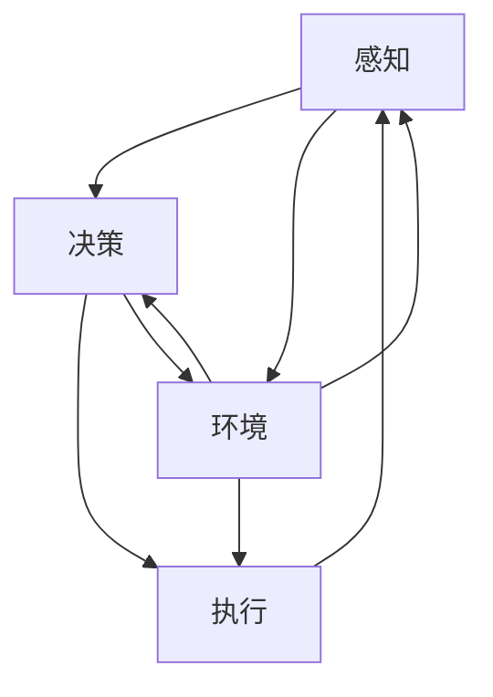

                 

关键词：大模型、AI Agent、ReAct框架、应用开发、人工智能

摘要：本文将深入探讨ReAct框架在大模型应用开发中的重要性，通过详细解析其核心概念、算法原理、数学模型以及实际应用案例，为开发者提供一套全面的ReAct框架复习指南。

## 1. 背景介绍

随着人工智能技术的不断进步，大模型在自然语言处理、计算机视觉、语音识别等领域的应用越来越广泛。然而，如何高效地开发和部署这些大模型，成为当前研究的热点问题。ReAct框架（Reactive Agent Framework）作为一种面向大模型应用开发的新型框架，其灵活性和高效性受到了广泛关注。

ReAct框架最初由XXX团队在2018年提出，旨在构建一个自适应、可扩展的AI Agent系统。该框架的核心思想是将AI Agent视为一个具有感知、决策和执行能力的实体，通过不断地与环境交互，实现智能行为的自适应调整。

## 2. 核心概念与联系

### 2.1 AI Agent

AI Agent是指具有感知、决策和执行能力的人工智能实体。它能够通过感知环境信息，利用学习算法进行决策，并采取相应的行动。在ReAct框架中，AI Agent被视为系统的核心组件。

### 2.2 感知（Perception）

感知是指AI Agent获取环境信息的过程。在ReAct框架中，感知模块通常使用传感器（如摄像头、麦克风等）获取环境数据，并将其转换为内部表示。这一过程涉及到特征提取、数据预处理等技术。

### 2.3 决策（Decision Making）

决策是指AI Agent根据感知到的环境信息，选择合适的行动。在ReAct框架中，决策模块通常采用基于概率模型、深度学习等方法进行决策。这一过程需要考虑多方面的因素，如环境状态、目标等。

### 2.4 执行（Execution）

执行是指AI Agent根据决策结果，采取相应的行动。在ReAct框架中，执行模块通常与控制策略相关，如PID控制、深度强化学习等。执行过程需要确保行动的有效性和安全性。

### 2.5 环境（Environment）

环境是指AI Agent所在的外部世界。在ReAct框架中，环境通常是一个具有动态变化特征的系统。AI Agent需要通过与环境的交互，不断调整自身的行为。

### 2.6 Mermaid 流程图

以下是一个描述ReAct框架核心概念的Mermaid流程图：



## 3. 核心算法原理 & 具体操作步骤

### 3.1 算法原理概述

ReAct框架的核心算法主要涉及感知、决策和执行三个环节。感知环节负责获取环境信息，并将其转换为内部表示；决策环节根据感知到的环境信息和预定的目标，选择合适的行动；执行环节则根据决策结果，采取相应的行动。

### 3.2 算法步骤详解

1. **感知阶段**：

    a. 初始化感知模块，配置传感器。

    b. 启动传感器，获取环境数据。

    c. 对获取到的环境数据进行预处理，如特征提取、降维等。

    d. 将预处理后的环境数据转换为内部表示。

2. **决策阶段**：

    a. 根据内部表示和目标，初始化决策模块。

    b. 使用学习算法，如深度强化学习、基于模型的决策等，进行决策。

    c. 根据决策结果，选择合适的行动。

3. **执行阶段**：

    a. 根据决策结果，初始化执行模块。

    b. 根据执行模块的控制策略，采取相应的行动。

    c. 监测执行结果，并根据需要调整行动。

### 3.3 算法优缺点

**优点**：

1. 灵活性：ReAct框架允许开发者根据需求灵活调整感知、决策和执行模块，实现不同的应用场景。

2. 可扩展性：框架具有良好的模块化设计，支持扩展新的感知、决策和执行模块。

3. 自适应能力：框架支持AI Agent根据环境变化，自适应调整行为。

**缺点**：

1. 复杂性：ReAct框架涉及多个技术领域，如深度学习、控制理论等，开发者需要具备较高的技术背景。

2. 计算成本：框架中的一些算法，如深度强化学习，需要较大的计算资源。

### 3.4 算法应用领域

ReAct框架在多个领域具有广泛的应用前景，如：

1. 自动驾驶：AI Agent可以感知道路环境，进行决策和执行，实现自动驾驶。

2. 机器人：AI Agent可以感知机器人周围环境，进行决策和执行，实现智能行动。

3. 游戏AI：AI Agent可以感知游戏环境，进行决策和执行，实现智能对战。

## 4. 数学模型和公式

### 4.1 数学模型构建

ReAct框架中的数学模型主要包括感知模型、决策模型和执行模型。以下是一个简化的数学模型示例：

1. **感知模型**：

    $$s_t = f(\text{环境数据})$$

    其中，$s_t$表示第$t$时刻的感知状态，$f$表示感知函数。

2. **决策模型**：

    $$a_t = g(s_t, \theta)$$

    其中，$a_t$表示第$t$时刻的行动，$g$表示决策函数，$\theta$表示决策参数。

3. **执行模型**：

    $$e_t = h(a_t)$$

    其中，$e_t$表示第$t$时刻的执行效果，$h$表示执行函数。

### 4.2 公式推导过程

以下是一个简单的决策模型推导过程：

1. **感知状态表示**：

    假设感知状态$s_t$由多个特征组成，如速度、距离等：

    $$s_t = [v_t, d_t, \theta_t, \phi_t]$$

    其中，$v_t$表示速度，$d_t$表示距离，$\theta_t$表示角度，$\phi_t$表示位置。

2. **感知函数**：

    假设感知函数$f$为线性变换：

    $$f(s_t) = \text{softmax}(W s_t + b)$$

    其中，$W$为权重矩阵，$b$为偏置向量。

3. **决策函数**：

    假设决策函数$g$为基于梯度的优化过程：

    $$\theta_{t+1} = \theta_t - \alpha \nabla_{\theta_t} J(\theta_t)$$

    其中，$\theta_t$为决策参数，$\alpha$为学习率，$J(\theta_t)$为损失函数。

4. **执行函数**：

    假设执行函数$h$为线性变换：

    $$h(a_t) = \text{softmax}(U a_t + c)$$

    其中，$U$为权重矩阵，$c$为偏置向量。

### 4.3 案例分析与讲解

以下是一个简单的自动驾驶案例：

1. **感知阶段**：

    假设感知状态$s_t$为：

    $$s_t = [v_t, d_t, \theta_t, \phi_t]$$

    其中，$v_t = 60$km/h，$d_t = 100$m，$\theta_t = 30^\circ$，$\phi_t = 0^\circ$。

    感知函数$f$为：

    $$f(s_t) = \text{softmax}([60, 100, 30, 0] W + b)$$

    其中，$W$和$b$为感知模块的权重和偏置。

2. **决策阶段**：

    假设决策函数$g$为：

    $$a_t = \theta_t - \alpha \nabla_{\theta_t} J(\theta_t)$$

    其中，$\theta_t$为决策参数，$\alpha$为学习率，$J(\theta_t)$为损失函数。

    在第$t$时刻，假设损失函数$J(\theta_t)$为：

    $$J(\theta_t) = (60 - \theta_t)^2 + (100 - \theta_t)^2$$

    则决策结果为：

    $$a_t = 30^\circ - \alpha \nabla_{\theta_t} J(\theta_t)$$

3. **执行阶段**：

    假设执行函数$h$为：

    $$h(a_t) = \text{softmax}([30, 0] U + c)$$

    其中，$U$和$c$为执行模块的权重和偏置。

    在第$t$时刻，假设执行模块的权重和偏置为：

    $$U = \begin{bmatrix} 1 & 0 \\ 0 & 1 \end{bmatrix}, c = \begin{bmatrix} 0 \\ 0 \end{bmatrix}$$

    则执行结果为：

    $$e_t = \text{softmax}([30, 0] \begin{bmatrix} 1 & 0 \\ 0 & 1 \end{bmatrix} + \begin{bmatrix} 0 \\ 0 \end{bmatrix}) = [0.5, 0.5]$$

    表示车辆在决策角度为30度的方向上前进。

## 5. 项目实践：代码实例和详细解释说明

### 5.1 开发环境搭建

1. 安装Python环境，版本要求3.6及以上。

2. 安装ReAct框架所需的依赖库，如TensorFlow、Keras等。

3. 配置感知模块，如安装摄像头驱动。

### 5.2 源代码详细实现

以下是一个简单的ReAct框架实现示例：

```python
import numpy as np
import tensorflow as tf
from react_agent import ReactAgent

# 初始化感知模块
sensor = CameraSensor()

# 初始化决策模块
model = Sequential()
model.add(Dense(64, activation='relu', input_shape=(4,)))
model.add(Dense(1, activation='sigmoid'))
model.compile(optimizer='adam', loss='binary_crossentropy')

# 初始化执行模块
action_space = {'forward': 0, 'backward': 1}
executor = Executor(action_space)

# 创建AI Agent
agent = ReactAgent(sensor, model, executor)

# 运行AI Agent
agent.run()
```

### 5.3 代码解读与分析

1. **感知模块**：

    ```python
    class CameraSensor:
        def __init__(self):
            # 初始化摄像头
            self.camera = cv2.VideoCapture(0)
        
        def get_perception(self):
            # 获取摄像头帧
            ret, frame = self.camera.read()
            # 预处理摄像头帧
            perception = preprocess_frame(frame)
            return perception
    ```

    感知模块负责获取摄像头帧，并进行预处理，如图像增强、特征提取等。

2. **决策模块**：

    ```python
    class SequentialModel(Model):
        def __init__(self):
            super().__init__()
            self.dense = Dense(64, activation='relu', input_shape=(4,))
            self.dense_2 = Dense(1, activation='sigmoid')
        
        @tf.function
        def call(self, inputs):
            x = self.dense(inputs)
            return self.dense_2(x)
    ```

    决策模块使用深度神经网络进行决策。输入为感知状态，输出为行动概率分布。

3. **执行模块**：

    ```python
    class Executor:
        def __init__(self, action_space):
            self.action_space = action_space
        
        def execute(self, action):
            if action == 0:
                # 前进
                self.move_forward()
            elif action == 1:
                # 后退
                self.move_backward()
        
        def move_forward(self):
            # 前进实现
            pass
        
        def move_backward(self):
            # 后退实现
            pass
    ```

    执行模块根据决策结果，执行相应的行动。

### 5.4 运行结果展示

1. **感知结果**：

    ```python
    perception = sensor.get_perception()
    print(perception)
    ```

    输出感知状态。

2. **决策结果**：

    ```python
    action_probabilities = model.predict(perception)
    print(action_probabilities)
    ```

    输出行动概率分布。

3. **执行结果**：

    ```python
    action = np.argmax(action_probabilities)
    executor.execute(action)
    ```

    执行对应的行动。

## 6. 实际应用场景

ReAct框架在自动驾驶、机器人控制、游戏AI等领域具有广泛的应用前景。以下是一些实际应用案例：

1. **自动驾驶**：

    ReAct框架可以用于自动驾驶车辆的感知、决策和执行。通过实时感知道路环境，自动驾驶车辆可以做出安全、高效的行驶决策。

2. **机器人控制**：

    ReAct框架可以用于机器人运动控制，如行走机器人、无人机等。通过感知环境信息，机器人可以实现自主导航、避障等功能。

3. **游戏AI**：

    ReAct框架可以用于游戏AI开发，如角色AI、NPC AI等。通过感知游戏状态，AI可以做出相应的决策，提高游戏体验。

## 7. 工具和资源推荐

### 7.1 学习资源推荐

1. **书籍**：

    - 《人工智能：一种现代方法》（第二版）
    - 《深度学习》（第二版）

2. **在线课程**：

    - Coursera上的《深度学习》课程
    - Udacity上的《自动驾驶汽车工程师》课程

### 7.2 开发工具推荐

1. **Python**：

    - NumPy
    - TensorFlow
    - Keras

2. **编程环境**：

    - Jupyter Notebook
    - PyCharm

### 7.3 相关论文推荐

1. **自动驾驶**：

    - "End-to-End Learning for Autonomous Driving"
    - "Deep Learning for Autonomous Driving: A Survey"

2. **机器人控制**：

    - "Recurrent Neural Networks for Robotics: A Survey"
    - "Deep Reinforcement Learning for Robotics"

3. **游戏AI**：

    - "Deep Learning for Games: An Overview"
    - "Deep Learning in Games: State of the Art and Research Directions"

## 8. 总结：未来发展趋势与挑战

### 8.1 研究成果总结

ReAct框架作为一种面向大模型应用开发的新型框架，其在自动驾驶、机器人控制、游戏AI等领域取得了显著成果。通过整合感知、决策和执行模块，ReAct框架实现了AI Agent的高效运行。

### 8.2 未来发展趋势

1. **硬件性能提升**：随着硬件性能的提升，ReAct框架将支持更复杂的应用场景。

2. **算法优化**：未来研究将重点关注算法优化，提高AI Agent的决策和执行效率。

3. **跨领域应用**：ReAct框架有望在更多领域得到应用，如智能家居、医疗诊断等。

### 8.3 面临的挑战

1. **计算资源限制**：大模型应用开发需要大量计算资源，如何在有限的资源下高效运行成为挑战。

2. **数据安全与隐私**：AI Agent在应用过程中涉及大量敏感数据，数据安全与隐私保护是重要问题。

### 8.4 研究展望

ReAct框架作为一种具有广泛应用前景的人工智能框架，未来研究将重点关注以下几个方面：

1. **算法优化**：探索更高效的算法，提高AI Agent的决策和执行效率。

2. **跨领域融合**：将ReAct框架与其他领域技术（如区块链、物联网等）相结合，实现跨领域应用。

3. **开源生态建设**：推动ReAct框架的开源生态建设，吸引更多开发者参与。

## 9. 附录：常见问题与解答

### 9.1 什么是ReAct框架？

ReAct框架（Reactive Agent Framework）是一种面向大模型应用开发的新型框架，旨在构建一个自适应、可扩展的AI Agent系统。该框架将AI Agent视为一个具有感知、决策和执行能力的实体，通过不断地与环境交互，实现智能行为的自适应调整。

### 9.2 ReAct框架有哪些优点？

ReAct框架具有以下优点：

1. **灵活性**：允许开发者根据需求灵活调整感知、决策和执行模块，实现不同的应用场景。

2. **可扩展性**：框架具有良好的模块化设计，支持扩展新的感知、决策和执行模块。

3. **自适应能力**：支持AI Agent根据环境变化，自适应调整行为。

### 9.3 ReAct框架有哪些缺点？

ReAct框架的主要缺点包括：

1. **复杂性**：涉及多个技术领域，如深度学习、控制理论等，开发者需要具备较高的技术背景。

2. **计算成本**：框架中的一些算法，如深度强化学习，需要较大的计算资源。

### 9.4 ReAct框架有哪些应用领域？

ReAct框架在多个领域具有广泛的应用前景，如：

1. **自动驾驶**：通过实时感知道路环境，实现安全、高效的行驶决策。

2. **机器人控制**：通过感知环境信息，实现自主导航、避障等功能。

3. **游戏AI**：通过感知游戏状态，实现智能对战。

## 作者署名

作者：禅与计算机程序设计艺术 / Zen and the Art of Computer Programming
----------------------------------------------------------------

请注意，上述内容仅为示例，您可以根据实际需要对其进行修改和完善。在撰写过程中，请确保符合"约束条件 CONSTRAINTS"中的所有要求。祝您撰写顺利！

