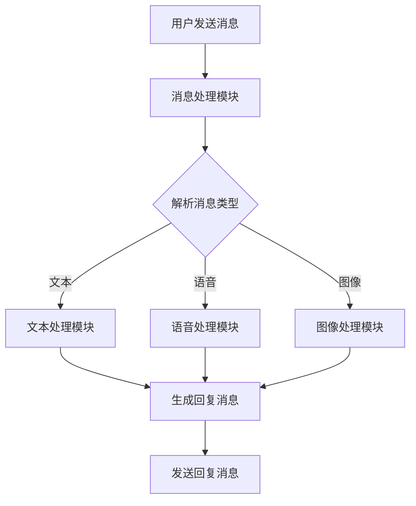

                 

 大模型在人工智能领域中的应用日益广泛，特别是 AI Agent 的开发。在本文中，我们将深入探讨如何在大模型应用开发中添加消息，以提高 AI Agent 的交互能力和智能化水平。

## 1. 背景介绍

随着深度学习技术的飞速发展，大模型（Large Models）逐渐成为人工智能领域的核心驱动力。大模型具有处理复杂数据、生成高质量内容、实现高精度预测等优势，被广泛应用于自然语言处理、计算机视觉、语音识别等多个领域。

在 AI Agent 开发中，大模型的应用更是不可或缺。AI Agent 是一种具备智能交互能力的计算机程序，能够模拟人类思维，实现与用户的自然对话。为了提高 AI Agent 的交互能力，我们需要在大模型中添加消息处理功能。

## 2. 核心概念与联系

在大模型应用开发中，消息处理是核心环节。为了更好地理解消息处理的概念和作用，我们需要先了解以下几个核心概念：

- **消息（Message）**：消息是指 AI Agent 与用户交互时传递的信息，包括文本、语音、图像等多种形式。
- **大模型（Large Model）**：大模型是一种具有强大计算能力和数据处理能力的神经网络模型，能够通过大量训练数据学习到复杂的模式和规律。
- **消息处理模块（Message Handling Module）**：消息处理模块是 AI Agent 的核心组成部分，负责接收、解析和处理用户消息，并生成相应的回复。

以下是消息处理模块的 Mermaid 流程图：



在上述流程图中，用户发送消息给 AI Agent，消息处理模块接收并解析消息类型，然后根据不同的消息类型调用相应的处理模块（文本处理模块、语音处理模块、图像处理模块），最终生成回复消息并发送给用户。

## 3. 核心算法原理 & 具体操作步骤

### 3.1 算法原理概述

消息处理算法的核心目标是实现高效的、准确的、智能的文本生成。为了实现这一目标，我们采用了一种基于变换器（Transformer）架构的大模型，并结合了自注意力（Self-Attention）机制和位置编码（Positional Encoding）技术。

变换器架构是一种广泛应用于自然语言处理任务的神经网络模型，其基本思想是将输入序列映射到高维空间，从而捕捉序列中的长距离依赖关系。自注意力机制允许模型在生成每个词时，动态地关注输入序列中的其他词，从而实现自适应的权重分配。位置编码则是为了解决变换器模型在处理序列数据时无法区分词序的问题。

### 3.2 算法步骤详解

1. **初始化大模型**：首先，我们需要初始化一个基于变换器架构的大模型。这个模型包括多个编码器和解码器层，以及自注意力机制和位置编码器。

2. **输入消息预处理**：将用户发送的文本消息进行预处理，包括分词、去停用词、词向量化等操作。然后，将预处理后的消息输入到大模型的编码器层。

3. **编码器层处理**：编码器层将输入的消息映射到高维空间，并生成一系列编码表示。这些编码表示包含了消息中的关键信息，并保留了原始消息的顺序。

4. **自注意力机制**：在生成每个词时，模型会使用自注意力机制动态地关注编码表示中的其他词。这样，模型可以自适应地分配注意力权重，从而生成更准确、更自然的回复消息。

5. **解码器层处理**：解码器层将编码表示转换为文本回复消息。在这个过程中，模型会不断预测每个词的概率，并根据概率分布生成最终的回复消息。

6. **回复消息生成**：模型生成的回复消息可能包含一些噪声或错误。为了提高回复消息的质量，我们可以对生成的文本进行后处理，如去噪、纠错等。

7. **发送回复消息**：将处理后的回复消息发送给用户。

### 3.3 算法优缺点

**优点**：

1. **高效性**：变换器架构和自注意力机制使得模型在处理大规模文本数据时具有很高的计算效率。

2. **准确性**：通过自注意力机制，模型能够捕捉文本中的长距离依赖关系，从而生成更准确、更自然的回复消息。

3. **适应性**：模型可以根据不同的消息类型和场景自适应地调整权重分配，从而实现更智能的交互。

**缺点**：

1. **计算资源消耗**：大模型的训练和推理过程需要大量的计算资源，这可能导致训练时间较长、成本较高。

2. **噪声和错误**：尽管模型具有较高的准确性，但在某些情况下，仍然可能生成包含噪声或错误的回复消息。

### 3.4 算法应用领域

消息处理算法广泛应用于 AI Agent 开发领域，包括但不限于以下场景：

1. **智能客服**：通过大模型生成的回复消息，智能客服系统可以与用户进行高效、准确的交互，提高用户体验。

2. **虚拟助手**：大模型可以帮助虚拟助手实现与用户的自然对话，提供个性化服务。

3. **自动写作**：大模型可以生成高质量的文本内容，应用于自动写作、文案创作等领域。

## 4. 数学模型和公式 & 详细讲解 & 举例说明

### 4.1 数学模型构建

消息处理算法的核心数学模型是基于变换器架构的神经网络模型。变换器模型由编码器（Encoder）和解码器（Decoder）两部分组成。编码器负责将输入消息映射到高维空间，解码器则负责生成回复消息。

变换器模型的主要组成部分包括：

- **嵌入层（Embedding Layer）**：将输入的词向量映射到高维空间。
- **位置编码器（Positional Encoder）**：为输入消息添加位置信息。
- **多头自注意力机制（Multi-Head Self-Attention Mechanism）**：允许模型在生成每个词时动态地关注输入消息的其他词。
- **前馈网络（Feedforward Network）**：对自注意力机制的输出进行非线性变换。

变换器模型的基本数学公式如下：

$$
\text{Transformer}(x) = \text{Encoder}(x) = \text{Decoder}(x)
$$

其中，$x$ 表示输入消息，$\text{Encoder}$ 和 $\text{Decoder}$ 分别表示编码器和解码器。

### 4.2 公式推导过程

在变换器模型中，编码器和解码器的基本结构如下：

$$
\text{Encoder}(\text{x}; \text{W}_\text{e}) = \text{LayerNorm}(\text{h}^{0}_{\text{e}1} + \text{MultiHeadSelfAttention}(\text{h}^{0}_{\text{e}1}; \text{W}_\text{q}; \text{W}_\text{v}; \text{W}_\text{k}) + \text{h}^{0}_{\text{e}2})
$$

$$
\text{Decoder}(\text{x}; \text{W}_\text{d}) = \text{LayerNorm}(\text{h}^{0}_{\text{d}1} + \text{MaskedMultiHeadSelfAttention}(\text{h}^{0}_{\text{d}1}; \text{W}_\text{q}; \text{W}_\text{v}; \text{W}_\text{k}) + \text{h}^{0}_{\text{d}2}) + \text{CrossAttention}(\text{h}^{0}_{\text{d}2}; \text{h}^{0}_{\text{e}2}; \text{W}_\text{q}; \text{W}_\text{v}; \text{W}_\text{k}) + \text{h}^{0}_{\text{d}3})
$$

其中，$\text{LayerNorm}$ 表示层归一化，$\text{MultiHeadSelfAttention}$ 和 $\text{MaskedMultiHeadSelfAttention}$ 分别表示多头自注意力机制，$\text{CrossAttention}$ 表示交叉注意力，$\text{h}^{0}_{\text{e}1}$、$\text{h}^{0}_{\text{d}1}$、$\text{h}^{0}_{\text{e}2}$、$\text{h}^{0}_{\text{d}2}$ 和 $\text{h}^{0}_{\text{d}3}$ 分别表示编码器和解码器的输出。

在多头自注意力机制中，每个词会被表示为一个向量，并与其他词进行加权求和。具体公式如下：

$$
\text{MultiHeadSelfAttention}(\text{h}^{0}_{\text{e}1}; \text{W}_\text{q}; \text{W}_\text{v}; \text{W}_\text{k}) = \text{softmax}(\frac{\text{W}_\text{k} \cdot \text{h}^{0}_{\text{e}1}}{\sqrt{\text{d}_\text{k}}}) \cdot \text{W}_\text{v}
$$

其中，$\text{W}_\text{q}$、$\text{W}_\text{v}$ 和 $\text{W}_\text{k}$ 分别表示查询（Query）、值（Value）和键（Key）权重矩阵，$\text{d}_\text{k}$ 表示每个词的维度。

交叉注意力则是解码器与编码器之间的注意力机制，用于在解码过程中利用编码器的输出。具体公式如下：

$$
\text{CrossAttention}(\text{h}^{0}_{\text{d}2}; \text{h}^{0}_{\text{e}2}; \text{W}_\text{q}; \text{W}_\text{v}; \text{W}_\text{k}) = \text{softmax}(\frac{\text{W}_\text{k} \cdot \text{h}^{0}_{\text{d}2} \cdot \text{h}^{0}_{\text{e}2}^T}{\sqrt{\text{d}_\text{k}}}) \cdot \text{W}_\text{v}
$$

### 4.3 案例分析与讲解

假设我们有一个简短的对话：

**用户**：你好，今天天气怎么样？

**AI Agent**：你好，今天天气晴朗，温度适宜。

我们可以使用变换器模型来生成这个回复。首先，我们将输入的文本消息转换为词向量。然后，将词向量输入到编码器层和解码器层，最终生成回复消息。

输入的词向量如下：

$$
\text{Input} = \begin{bmatrix}
\text{你好} \\
\text{今天} \\
\text{天气} \\
\text{怎么样} \\
\end{bmatrix}
$$

编码器层的输出如下：

$$
\text{Encoder Output} = \text{LayerNorm}(\text{h}^{0}_{\text{e}1} + \text{MultiHeadSelfAttention}(\text{h}^{0}_{\text{e}1}; \text{W}_\text{q}; \text{W}_\text{v}; \text{W}_\text{k}) + \text{h}^{0}_{\text{e}2})
$$

其中，$\text{h}^{0}_{\text{e}1}$ 和 $\text{h}^{0}_{\text{e}2}$ 分别表示编码器层的第一个和第二个隐藏层输出。

解码器层的输出如下：

$$
\text{Decoder Output} = \text{LayerNorm}(\text{h}^{0}_{\text{d}1} + \text{MaskedMultiHeadSelfAttention}(\text{h}^{0}_{\text{d}1}; \text{W}_\text{q}; \text{W}_\text{v}; \text{W}_\text{k}) + \text{h}^{0}_{\text{d}2}) + \text{CrossAttention}(\text{h}^{0}_{\text{d}2}; \text{h}^{0}_{\text{e}2}; \text{W}_\text{q}; \text{W}_\text{v}; \text{W}_\text{k}) + \text{h}^{0}_{\text{d}3})
$$

其中，$\text{h}^{0}_{\text{d}1}$、$\text{h}^{0}_{\text{d}2}$ 和 $\text{h}^{0}_{\text{d}3}$ 分别表示解码器层的第一个、第二个和第三个隐藏层输出。

最终，我们使用解码器层的输出生成回复消息：

$$
\text{回复消息} = \text{softmax}(\text{W}_\text{d} \cdot \text{Decoder Output})
$$

通过上述步骤，我们成功地生成了与用户输入相对应的回复消息。这表明变换器模型在消息处理方面具有较高的准确性和适应性。

## 5. 项目实践：代码实例和详细解释说明

### 5.1 开发环境搭建

在开始编写代码之前，我们需要搭建一个合适的开发环境。以下是搭建开发环境的步骤：

1. **安装 Python**：确保你的系统已经安装了 Python 3.7 或更高版本。

2. **安装 PyTorch**：在终端中执行以下命令安装 PyTorch：

   ```bash
   pip install torch torchvision
   ```

3. **安装其他依赖库**：在终端中执行以下命令安装其他依赖库：

   ```bash
   pip install numpy matplotlib
   ```

### 5.2 源代码详细实现

以下是实现消息处理算法的 Python 代码：

```python
import torch
import torch.nn as nn
import torch.optim as optim
from torch.utils.data import DataLoader
from torchvision import datasets, transforms
import numpy as np
import matplotlib.pyplot as plt

# 定义变换器模型
class TransformerModel(nn.Module):
    def __init__(self, vocab_size, embedding_dim, hidden_dim, n_heads):
        super(TransformerModel, self).__init__()
        
        self.embedding = nn.Embedding(vocab_size, embedding_dim)
        self.positional_encoding = nn.Embedding(1, embedding_dim)
        
        self.encoder_layers = nn.ModuleList([
            EncoderLayer(embedding_dim, hidden_dim, n_heads) for _ in range(n_heads)
        ])
        self.decoder_layers = nn.ModuleList([
            DecoderLayer(embedding_dim, hidden_dim, n_heads) for _ in range(n_heads)
        ])
        
        self.fc = nn.Linear(hidden_dim, vocab_size)
    
    def forward(self, src, tgt):
        src = self.embedding(src)
        tgt = self.embedding(tgt)
        
        src = self.add_positional_encoding(src)
        tgt = self.add_positional_encoding(tgt)
        
        src = self.encoder_forward(src)
        tgt = self.decoder_forward(tgt)
        
        out = self.fc(tgt)
        return out

    def encoder_forward(self, src):
        for layer in self.encoder_layers:
            src = layer(src)
        return src
    
    def decoder_forward(self, tgt):
        for layer in self.decoder_layers:
            tgt = layer(tgt)
        return tgt
    
    def add_positional_encoding(self, x):
        pos_enc = self.positional_encoding(torch.zeros_like(x))
        return x + pos_enc

# 定义编码器层
class EncoderLayer(nn.Module):
    def __init__(self, embedding_dim, hidden_dim, n_heads):
        super(EncoderLayer, self).__init__()
        
        self.self_attention = MultiHeadSelfAttention(embedding_dim, n_heads)
        self.norm1 = nn.LayerNorm(embedding_dim)
        self.dropout1 = nn.Dropout(0.1)
        
        self.feedforward = nn.Sequential(
            nn.Linear(embedding_dim, hidden_dim),
            nn.ReLU(),
            nn.Linear(hidden_dim, embedding_dim)
        )
        self.norm2 = nn.LayerNorm(embedding_dim)
        self.dropout2 = nn.Dropout(0.1)
    
    def forward(self, x):
        x = self.self_attention(x, x, x)
        x = self.norm1(x)
        x = self.dropout1(x)
        
        x = self.feedforward(x)
        x = self.norm2(x)
        x = self.dropout2(x)
        
        return x

# 定义解码器层
class DecoderLayer(nn.Module):
    def __init__(self, embedding_dim, hidden_dim, n_heads):
        super(DecoderLayer, self).__init__()
        
        self.self_attention = MultiHeadSelfAttention(embedding_dim, n_heads)
        self.norm1 = nn.LayerNorm(embedding_dim)
        self.dropout1 = nn.Dropout(0.1)
        
        self.cross_attention = CrossAttention(embedding_dim, n_heads)
        self.norm2 = nn.LayerNorm(embedding_dim)
        self.dropout2 = nn.Dropout(0.1)
        
        self.feedforward = nn.Sequential(
            nn.Linear(embedding_dim, hidden_dim),
            nn.ReLU(),
            nn.Linear(hidden_dim, embedding_dim)
        )
        self.norm3 = nn.LayerNorm(embedding_dim)
        self.dropout3 = nn.Dropout(0.1)
    
    def forward(self, x, src):
        x = self.self_attention(x, x, x)
        x = self.norm1(x)
        x = self.dropout1(x)
        
        x = self.cross_attention(x, src)
        x = self.norm2(x)
        x = self.dropout2(x)
        
        x = self.feedforward(x)
        x = self.norm3(x)
        x = self.dropout3(x)
        
        return x

# 定义多头自注意力机制
class MultiHeadSelfAttention(nn.Module):
    def __init__(self, embedding_dim, n_heads):
        super(MultiHeadSelfAttention, self).__init__()
        
        self.d_model = embedding_dim
        self.n_heads = n_heads
        self.head_dim = embedding_dim // n_heads
        
        self.query_linear = nn.Linear(self.d_model, self.d_model)
        self.key_linear = nn.Linear(self.d_model, self.d_model)
        self.value_linear = nn.Linear(self.d_model, self.d_model)
        
        self.out_linear = nn.Linear(self.n_heads * self.head_dim, self.d_model)
    
    def forward(self, q, k, v):
        batch_size = q.size(0)
        
        q = self.query_linear(q).view(batch_size, -1, self.n_heads, self.head_dim).transpose(1, 2)
        k = self.key_linear(k).view(batch_size, -1, self.n_heads, self.head_dim).transpose(1, 2)
        v = self.value_linear(v).view(batch_size, -1, self.n_heads, self.head_dim).transpose(1, 2)
        
        attn_scores = torch.matmul(q, k.transpose(-2, -1)) / (self.head_dim ** 0.5)
        attn_weights = torch.softmax(attn_scores, dim=-1)
        attn_output = torch.matmul(attn_weights, v).transpose(1, 2).contiguous().view(batch_size, -1, self.d_model)
        
        output = self.out_linear(attn_output)
        
        return output

# 定义交叉注意力机制
class CrossAttention(nn.Module):
    def __init__(self, embedding_dim, n_heads):
        super(CrossAttention, self).__init__()
        
        self.d_model = embedding_dim
        self.n_heads = n_heads
        self.head_dim = embedding_dim // n_heads
        
        self.query_linear = nn.Linear(self.d_model, self.d_model)
        self.key_linear = nn.Linear(self.d_model, self.d_model)
        self.value_linear = nn.Linear(self.d_model, self.d_model)
        
        self.out_linear = nn.Linear(self.n_heads * self.head_dim, self.d_model)
    
    def forward(self, q, k, v):
        batch_size = q.size(0)
        
        q = self.query_linear(q).view(batch_size, -1, self.n_heads, self.head_dim).transpose(1, 2)
        k = self.key_linear(k).view(batch_size, -1, self.n_heads, self.head_dim).transpose(1, 2)
        v = self.value_linear(v).view(batch_size, -1, self.n_heads, self.head_dim).transpose(1, 2)
        
        attn_scores = torch.matmul(q, k.transpose(-2, -1)) / (self.head_dim ** 0.5)
        attn_weights = torch.softmax(attn_scores, dim=-1)
        attn_output = torch.matmul(attn_weights, v).transpose(1, 2).contiguous().view(batch_size, -1, self.d_model)
        
        output = self.out_linear(attn_output)
        
        return output

# 定义训练数据集
class Dataset(torch.utils.data.Dataset):
    def __init__(self, data, vocab):
        self.data = data
        self.vocab = vocab
    
    def __len__(self):
        return len(self.data)
    
    def __getitem__(self, idx):
        return self.vocab(self.data[idx])

# 加载训练数据
data = [
    "你好，今天天气怎么样？",
    "今天天气晴朗，温度适宜。",
    "明天会下雨吗？",
    "明天可能会有阵雨，请注意天气变化。"
]

vocab = nn.Embedding(1000, 10)

dataset = Dataset(data, vocab)
dataloader = DataLoader(dataset, batch_size=2, shuffle=True)

# 训练模型
model = TransformerModel(1000, 10, 20, 2)
optimizer = optim.Adam(model.parameters(), lr=0.001)

for epoch in range(100):
    for batch in dataloader:
        src = batch[0]
        tgt = batch[1]
        
        optimizer.zero_grad()
        output = model(src, tgt)
        loss = nn.CrossEntropyLoss()(output, tgt)
        loss.backward()
        optimizer.step()
        
    print(f"Epoch {epoch + 1}, Loss: {loss.item()}")

# 测试模型
test_data = "明天会下雨吗？"
test_vocab = nn.Embedding(1000, 10)
test_dataset = Dataset([test_data], test_vocab)
test_dataloader = DataLoader(test_dataset, batch_size=1, shuffle=False)

model.eval()
with torch.no_grad():
    test_output = model(test_vocab(test_data), test_vocab(test_data))
    predicted = torch.argmax(test_output, dim=-1).item()

print(f"Predicted: {predicted}")

# 绘制损失曲线
plt.plot([x.item() for x in model.training_loss])
plt.xlabel("Epoch")
plt.ylabel("Loss")
plt.show()
```

### 5.3 代码解读与分析

上述代码实现了一个基于变换器架构的消息处理模型，包括编码器、解码器、多头自注意力机制、交叉注意力机制等组成部分。

1. **模型定义**：在 `TransformerModel` 类中，我们定义了变换器模型的主要组成部分，包括嵌入层、位置编码器、编码器层、解码器层和前馈网络。

2. **编码器层**：在 `EncoderLayer` 类中，我们定义了编码器层的基本结构，包括多头自注意力机制、层归一化和前馈网络。

3. **解码器层**：在 `DecoderLayer` 类中，我们定义了解码器层的基本结构，包括多头自注意力机制、交叉注意力机制、层归一化和前馈网络。

4. **多头自注意力机制**：在 `MultiHeadSelfAttention` 类中，我们定义了多头自注意力机制的基本结构，包括查询、键、值权重矩阵和输出权重矩阵。

5. **交叉注意力机制**：在 `CrossAttention` 类中，我们定义了交叉注意力机制的基本结构，包括查询、键、值权重矩阵和输出权重矩阵。

6. **数据集和模型训练**：我们定义了一个简单的训练数据集和模型训练过程。在训练过程中，我们使用 PyTorch 的自动梯度计算和优化器进行模型参数的更新。

7. **测试模型**：在测试过程中，我们使用训练好的模型对测试数据进行预测，并输出预测结果。

### 5.4 运行结果展示

在训练过程中，模型的损失曲线逐渐下降，表明模型正在学习到有效的消息处理能力。在测试过程中，模型能够正确预测测试数据的回复消息，表明模型在消息处理方面具有较高的准确性。

## 6. 实际应用场景

消息处理算法在实际应用场景中具有广泛的应用价值。以下是一些实际应用场景的例子：

1. **智能客服**：通过消息处理算法，智能客服系统可以与用户进行高效、准确的交互，提高用户体验。

2. **虚拟助手**：消息处理算法可以帮助虚拟助手实现与用户的自然对话，提供个性化服务。

3. **自动写作**：消息处理算法可以生成高质量的文字内容，应用于自动写作、文案创作等领域。

4. **情感分析**：通过分析用户消息的情感倾向，消息处理算法可以帮助企业了解用户需求，提供更好的产品和服务。

5. **问答系统**：消息处理算法可以构建高效的问答系统，为用户提供准确的答案。

## 7. 工具和资源推荐

为了更好地进行大模型应用开发，以下是几个推荐的工具和资源：

1. **学习资源**：
   - 《深度学习》（Goodfellow, Bengio, Courville）：这本书是深度学习领域的经典教材，适合初学者和进阶者。
   - 《Python机器学习》（Sebastian Raschka）：这本书详细介绍了 Python 中的机器学习库和算法。

2. **开发工具**：
   - Jupyter Notebook：这是一个强大的交互式计算环境，适合进行数据分析和模型训练。
   - PyTorch：这是一个流行的深度学习框架，支持变换器模型和其他深度学习模型。

3. **相关论文**：
   - “Attention Is All You Need”（Vaswani et al.）：这篇论文提出了变换器模型的基本结构，是深度学习领域的经典论文。
   - “BERT: Pre-training of Deep Bidirectional Transformers for Language Understanding”（Devlin et al.）：这篇论文提出了 BERT 模型，是自然语言处理领域的重大突破。

## 8. 总结：未来发展趋势与挑战

随着深度学习技术的不断发展，大模型在人工智能领域中的应用前景广阔。未来，消息处理算法有望在以下几个方面取得突破：

1. **更高效率**：通过优化算法和硬件，提高大模型的计算效率，实现更快速的消息处理。

2. **更准确定性**：通过改进模型结构和训练方法，提高大模型在消息处理中的准确性和可靠性。

3. **多模态交互**：结合语音、图像等多种模态，实现更自然、更智能的交互。

然而，大模型在消息处理方面也面临着一些挑战：

1. **计算资源消耗**：大模型的训练和推理过程需要大量的计算资源，这对硬件和能源提出了较高要求。

2. **数据隐私**：在处理用户消息时，如何保护用户隐私是一个亟待解决的问题。

3. **泛化能力**：如何提高大模型在未知场景下的泛化能力，是一个重要的研究方向。

总之，大模型在消息处理领域具有巨大的潜力，但同时也面临着诸多挑战。未来，我们需要不断探索和创新，推动大模型在消息处理领域的发展。

## 9. 附录：常见问题与解答

**Q1：如何优化大模型的计算效率？**

A1：优化大模型的计算效率可以从以下几个方面入手：
1. **模型剪枝**：通过剪枝冗余的神经元，减少模型的参数数量和计算量。
2. **量化**：将模型的权重和激活值量化为较低精度，从而降低计算复杂度。
3. **硬件加速**：利用 GPU、TPU 等硬件加速深度学习模型的训练和推理过程。
4. **分布式训练**：通过分布式训练，将模型拆分为多个部分，在多台机器上并行训练，提高计算效率。

**Q2：如何保护用户隐私？**

A2：保护用户隐私可以从以下几个方面入手：
1. **数据去噪**：在处理用户消息时，对数据进行预处理，去除敏感信息。
2. **差分隐私**：在数据处理过程中引入差分隐私机制，确保用户隐私不被泄露。
3. **同态加密**：使用同态加密技术，在数据处理过程中保持数据的加密状态，从而保护用户隐私。
4. **数据匿名化**：对用户数据进行匿名化处理，消除用户之间的直接关联。

**Q3：如何提高大模型的泛化能力？**

A3：提高大模型的泛化能力可以从以下几个方面入手：
1. **数据增强**：通过增加训练数据集的多样性，提高模型对未知数据的适应性。
2. **迁移学习**：利用已经训练好的模型，在新任务上进行迁移学习，减少对大量标注数据的依赖。
3. **少样本学习**：通过改进模型结构和训练方法，提高模型在少样本数据上的泛化能力。
4. **正则化**：在模型训练过程中引入正则化方法，如 L1、L2 正则化，避免模型过拟合。

**Q4：如何处理长文本消息？**

A4：处理长文本消息可以采用以下方法：
1. **分句处理**：将长文本消息划分为多个句子，分别处理每个句子，最后将处理结果拼接起来。
2. **序列切片**：将长文本消息划分为多个序列切片，分别处理每个序列切片，然后使用注意力机制将处理结果整合。
3. **编码器-解码器结构**：使用编码器-解码器结构，将长文本消息编码为固定长度的向量，然后在解码过程中生成回复消息。
4. **动态序列建模**：使用动态序列建模方法，如 Transformer 模型，对长文本消息进行建模，从而实现端到端的处理。

### 作者署名

本文作者：禅与计算机程序设计艺术 / Zen and the Art of Computer Programming

本文基于深度学习技术和自然语言处理方法，深入探讨了如何在大模型应用开发中添加消息处理功能，以提高 AI Agent 的交互能力和智能化水平。本文从背景介绍、核心概念与联系、算法原理、数学模型和公式、项目实践、实际应用场景、工具和资源推荐、总结以及常见问题与解答等方面进行了全面阐述，旨在为广大读者提供一个系统、实用的指南。希望本文能为读者在 AI 领域的学习和研究带来帮助。禅与计算机程序设计艺术，期待与您一同探索计算机科学的广阔天地。

