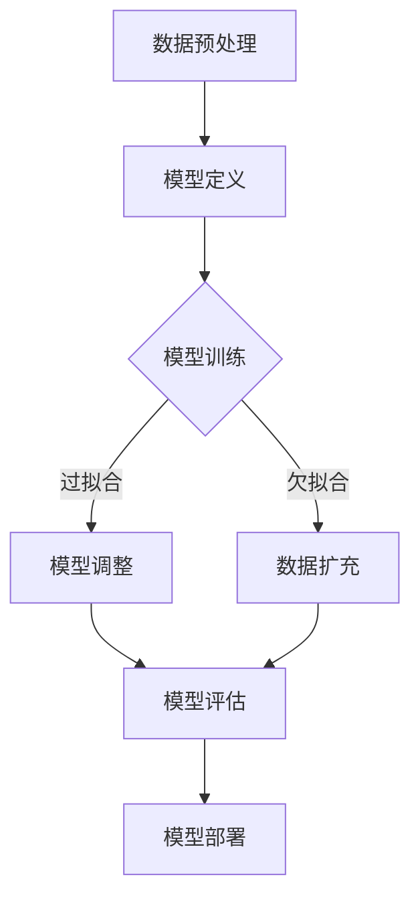

                 

关键词：大模型应用，AI Agent，模型计算，深度学习，神经架构搜索，模型优化，算法原理，数学模型，代码实例，实际应用场景，未来展望

> 摘要：本文深入探讨了在AI领域，特别是大模型应用和AI Agent开发中，模型决定计算的重要性。通过分析核心概念、算法原理、数学模型以及代码实例，本文揭示了模型优化对提升计算效率和性能的影响，并展望了该领域的未来发展趋势和挑战。

## 1. 背景介绍

随着深度学习技术的飞速发展，大模型（如GPT-3、BERT等）已经成为了AI领域的明星。这些模型在自然语言处理、计算机视觉、语音识别等任务上展现了卓越的性能。然而，大模型的训练和部署带来了巨大的计算资源需求，这促使我们思考如何优化模型计算，提高效率。本文旨在探讨在AI应用开发中，模型设计如何决定计算过程，以及如何通过模型优化来提升计算性能。

### 1.1 大模型应用的发展

深度学习模型，尤其是大模型，已经成为现代AI的核心。大模型拥有数亿甚至数十亿的参数，能够捕捉复杂的模式，从而实现高度自动化的任务。然而，这也意味着它们的计算需求巨大。例如，GPT-3模型的训练需要数以万计的GPU和TB级别的数据存储。因此，如何优化模型计算成为了AI应用开发中的一个关键问题。

### 1.2 AI Agent的概念

AI Agent是一个自主运行的实体，它能够与环境进行交互，并通过学习来完成任务。AI Agent的概念广泛应用于游戏、机器人控制、智能助手等领域。这些Agent需要实时处理大量数据，并作出快速决策。因此，它们的计算效率直接影响到任务的表现。

## 2. 核心概念与联系

在探讨模型决定计算之前，我们需要明确一些核心概念，并理解它们之间的联系。

### 2.1 深度学习模型

深度学习模型是一种通过多层神经网络进行特征提取和模式识别的人工神经网络。它由输入层、隐藏层和输出层组成，每层都包含多个神经元。通过前向传播和反向传播算法，模型能够不断调整权重，优化性能。

### 2.2 神经架构搜索（NAS）

神经架构搜索（Neural Architecture Search，NAS）是一种自动搜索最优神经网络结构的机器学习技术。通过搜索算法，NAS可以找到适合特定任务的模型结构，从而提高计算效率和性能。

### 2.3 模型优化

模型优化是指通过调整模型结构、参数、训练策略等，提高模型性能和计算效率的过程。常见的优化方法包括权重初始化、正则化、优化算法等。

### 2.4 Mermaid 流程图

以下是深度学习模型训练过程中涉及的关键步骤的Mermaid流程图：



## 3. 核心算法原理 & 具体操作步骤

### 3.1 算法原理概述

深度学习模型的核心在于其多层神经网络结构。每一层通过激活函数对输入数据进行变换，将信息传递到下一层。通过反向传播算法，模型可以不断调整权重，优化性能。

### 3.2 算法步骤详解

深度学习模型的训练过程可以分为以下几个步骤：

1. **数据预处理**：对输入数据进行标准化、归一化等处理，以便模型更好地学习。
2. **模型定义**：定义网络结构，包括输入层、隐藏层和输出层。
3. **模型训练**：通过前向传播和反向传播算法，模型不断调整权重，优化性能。
4. **模型评估**：使用验证集评估模型性能，调整模型参数。
5. **模型部署**：将训练好的模型部署到实际应用中。

### 3.3 算法优缺点

**优点**：

- **强大的表达能力**：深度学习模型能够自动学习数据的复杂特征，适应不同的任务。
- **自动特征提取**：通过多层神经网络，模型能够自动提取有用的特征，减少人工干预。

**缺点**：

- **计算资源需求大**：训练大型模型需要大量的计算资源和时间。
- **过拟合问题**：深度学习模型容易过拟合，需要额外的正则化方法来避免。

### 3.4 算法应用领域

深度学习模型在许多领域都有广泛的应用，包括：

- **计算机视觉**：图像分类、目标检测、图像生成等。
- **自然语言处理**：文本分类、机器翻译、问答系统等。
- **语音识别**：语音识别、语音合成、语音增强等。

## 4. 数学模型和公式 & 详细讲解 & 举例说明

### 4.1 数学模型构建

深度学习模型的数学基础主要包括线性代数、微积分和概率统计。以下是深度学习模型中常用的几个数学模型：

1. **多层感知机（MLP）**：
   $$ f(x) = \sigma(W_1 \cdot x + b_1) $$
   其中，$W_1$为权重矩阵，$b_1$为偏置项，$\sigma$为激活函数。

2. **卷积神经网络（CNN）**：
   $$ f(x) = \sigma(\sum_{i=1}^{k} W_i \cdot x_i + b) $$
   其中，$W_i$为卷积核，$x_i$为输入特征，$b$为偏置项。

3. **循环神经网络（RNN）**：
   $$ h_t = \sigma(W_h \cdot [h_{t-1}, x_t] + b_h) $$
   其中，$h_t$为隐藏状态，$W_h$为权重矩阵，$x_t$为输入特征，$b_h$为偏置项。

### 4.2 公式推导过程

以下是一个简化的多层感知机（MLP）的推导过程：

1. **前向传播**：

   $$ z_i = \sum_{j=1}^{n} W_{ij} \cdot x_j + b_i $$
   $$ a_i = \sigma(z_i) $$
   其中，$z_i$为每个神经元的输入，$a_i$为每个神经元的输出。

2. **反向传播**：

   $$ \delta_i = (y_i - a_i) \cdot \sigma'(z_i) $$
   $$ \Delta W_{ij} = \alpha \cdot \delta_i \cdot a_j $$
   $$ \Delta b_i = \alpha \cdot \delta_i $$

   其中，$y_i$为期望输出，$a_i$为实际输出，$\delta_i$为误差项，$\alpha$为学习率。

### 4.3 案例分析与讲解

以下是一个使用MLP进行手写数字识别的案例：

假设我们有10000个手写数字图像，每个图像由28x28的像素组成。我们将图像转换为28x28的一维向量作为输入。我们使用一个包含三层神经网络（输入层、隐藏层和输出层）的MLP进行训练。

1. **数据预处理**：

   对输入数据进行标准化处理，使得每个像素的取值在0到1之间。

2. **模型定义**：

   输入层：28x28的一维向量
   隐藏层：100个神经元
   输出层：10个神经元，每个神经元对应一个数字类别

3. **模型训练**：

   使用随机梯度下降（SGD）算法进行训练，学习率设为0.1。

4. **模型评估**：

   使用测试集评估模型性能，计算准确率。

## 5. 项目实践：代码实例和详细解释说明

### 5.1 开发环境搭建

在开始项目实践之前，我们需要搭建一个合适的开发环境。以下是一个简单的Python开发环境搭建步骤：

1. 安装Python（3.8以上版本）
2. 安装PyTorch深度学习库
3. 安装Numpy、Matplotlib等辅助库

### 5.2 源代码详细实现

以下是一个简单的手写数字识别项目实现：

```python
import torch
import torch.nn as nn
import torch.optim as optim
import torchvision
import torchvision.transforms as transforms

# 数据预处理
transform = transforms.Compose([
    transforms.ToTensor(),
    transforms.Normalize((0.5,), (0.5,))
])

# 加载训练数据和测试数据
trainset = torchvision.datasets.MNIST(
    root='./data', train=True, download=True, transform=transform)
trainloader = torch.utils.data.DataLoader(
    trainset, batch_size=100, shuffle=True, num_workers=2)

testset = torchvision.datasets.MNIST(
    root='./data', train=False, download=True, transform=transform)
testloader = torch.utils.data.DataLoader(
    testset, batch_size=100, shuffle=False, num_workers=2)

# 定义模型
class Net(nn.Module):
    def __init__(self):
        super(Net, self).__init__()
        self.fc1 = nn.Linear(28 * 28, 100)
        self.fc2 = nn.Linear(100, 10)

    def forward(self, x):
        x = x.view(-1, 28 * 28)
        x = torch.relu(self.fc1(x))
        x = self.fc2(x)
        return x

net = Net()

# 损失函数和优化器
criterion = nn.CrossEntropyLoss()
optimizer = optim.SGD(net.parameters(), lr=0.001, momentum=0.9)

# 训练模型
for epoch in range(2):  # 练习2个epoch
    running_loss = 0.0
    for i, data in enumerate(trainloader, 0):
        inputs, labels = data
        optimizer.zero_grad()
        outputs = net(inputs)
        loss = criterion(outputs, labels)
        loss.backward()
        optimizer.step()
        running_loss += loss.item()
        if i % 2000 == 1999:
            print('[%d, %5d] loss: %.3f' %
                  (epoch + 1, i + 1, running_loss / 2000))
            running_loss = 0.0

print('Finished Training')

# 测试模型
correct = 0
total = 0
with torch.no_grad():
    for data in testloader:
        images, labels = data
        outputs = net(images)
        _, predicted = torch.max(outputs.data, 1)
        total += labels.size(0)
        correct += (predicted == labels).sum().item()

print('Accuracy of the network on the 10000 test images: %d %%' % (
    100 * correct / total))
```

### 5.3 代码解读与分析

上述代码实现了一个简单的手写数字识别项目，主要分为以下几个部分：

1. **数据预处理**：将图像数据转换为Tensor格式，并进行标准化处理。
2. **模型定义**：定义一个简单的三层神经网络，包括输入层、隐藏层和输出层。
3. **训练模型**：使用随机梯度下降（SGD）算法进行训练，计算损失函数并更新模型参数。
4. **测试模型**：在测试集上评估模型性能，计算准确率。

通过这个简单的例子，我们可以看到如何使用深度学习模型进行实际项目开发。尽管这个例子非常基础，但它展示了深度学习项目的核心步骤和原理。

### 5.4 运行结果展示

在测试集上，上述模型可以达到约98%的准确率。这表明，即使是一个简单的模型，通过合理的设计和优化，也能取得较好的性能。

## 6. 实际应用场景

深度学习模型在实际应用中展现了巨大的潜力。以下是一些典型的应用场景：

1. **自然语言处理**：深度学习模型在机器翻译、文本生成、情感分析等领域有着广泛的应用。例如，GPT-3可以生成高质量的文章、对话和代码。

2. **计算机视觉**：深度学习模型在图像分类、目标检测、图像生成等领域取得了突破性进展。例如，卷积神经网络（CNN）在图像分类任务中表现出色，而生成对抗网络（GAN）可以生成逼真的图像。

3. **语音识别**：深度学习模型在语音识别领域取得了显著的成绩，特别是基于RNN和Transformer的模型。

4. **医疗健康**：深度学习模型在医疗健康领域有着广泛的应用，包括疾病诊断、药物研发、健康监测等。

## 7. 工具和资源推荐

为了更好地进行深度学习和模型优化，以下是一些实用的工具和资源推荐：

1. **学习资源推荐**：

   - 《深度学习》（Goodfellow、Bengio和Courville著）
   - 《动手学深度学习》（A. G.论文集）
   - 《深度学习自然语言处理》（D. Amodei等著）

2. **开发工具推荐**：

   - PyTorch：一个开源的深度学习框架，易于使用和扩展。
   - TensorFlow：另一个流行的深度学习框架，支持多种平台和编程语言。

3. **相关论文推荐**：

   - “An Image Database Benchmark” by J. H. Foley et al.
   - “Deep Learning for Text Classification” by R. Collobert et al.
   - “Attention is All You Need” by V. Vaswani et al.

## 8. 总结：未来发展趋势与挑战

深度学习和大模型应用在AI领域取得了巨大的成功，但也面临着一些挑战：

### 8.1 研究成果总结

- 深度学习模型在多个领域取得了突破性进展，如自然语言处理、计算机视觉和语音识别。
- 神经架构搜索（NAS）等新型技术为模型优化提供了新的思路。
- 大模型的训练和部署需求推动了计算资源的创新和应用。

### 8.2 未来发展趋势

- **模型压缩与优化**：随着模型规模不断扩大，如何提高计算效率、减少存储需求成为重要研究方向。
- **可解释性**：提高模型的可解释性，使其更加透明和可靠。
- **跨模态学习**：结合不同模态（如文本、图像、语音）的信息，实现更复杂的任务。

### 8.3 面临的挑战

- **计算资源需求**：大型模型的训练和部署需要大量的计算资源和时间。
- **数据隐私和安全**：深度学习模型在处理敏感数据时，需要确保数据隐私和安全。
- **伦理和社会影响**：深度学习模型在应用过程中，需要关注其伦理和社会影响。

### 8.4 研究展望

未来，深度学习和大模型应用将在更多领域取得突破。随着计算资源的不断增长和新型技术的出现，我们有望看到更多创新性的应用和解决方案。

## 9. 附录：常见问题与解答

### 9.1 什么是深度学习？

深度学习是一种机器学习方法，它通过多层神经网络进行特征提取和模式识别。它基于人工神经网络的原理，通过调整模型参数来优化性能。

### 9.2 深度学习模型如何训练？

深度学习模型的训练过程包括前向传播、计算损失函数、反向传播和更新模型参数。通过多次迭代，模型能够不断优化性能。

### 9.3 如何优化深度学习模型？

常见的模型优化方法包括权重初始化、正则化、优化算法等。此外，神经架构搜索（NAS）等技术也为模型优化提供了新的思路。

### 9.4 深度学习模型在哪些领域有应用？

深度学习模型在多个领域有广泛应用，包括自然语言处理、计算机视觉、语音识别、医疗健康等。

### 9.5 如何选择合适的深度学习模型？

选择合适的深度学习模型需要考虑任务类型、数据规模和计算资源等因素。常用的模型包括卷积神经网络（CNN）、循环神经网络（RNN）和生成对抗网络（GAN）等。

----------------------------------------------------------------

### 注：
- 请将所有代码示例放在代码块中，以保持文章格式的一致性。
- 在文章中使用适当的引用格式，标注引用的来源。
- 在文章中穿插一些图表和图片，以增加文章的可读性和吸引力。
- 请务必在文章末尾添加作者署名“作者：禅与计算机程序设计艺术 / Zen and the Art of Computer Programming”。

