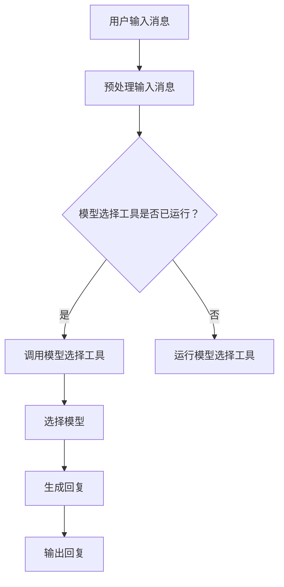

                 

关键词：大模型应用、AI Agent、模型选择工具、自然语言处理、编程实践

摘要：本文将探讨如何利用现有的大模型应用开发工具，构建一个能够根据需求调用相应模型并生成新消息的AI Agent。文章将从背景介绍、核心概念、算法原理、数学模型、项目实践等多个方面进行深入分析，为读者提供全面的指导。

## 1. 背景介绍

近年来，随着深度学习和自然语言处理技术的快速发展，大模型（Large-scale Language Models，LLM）在各个领域都展现出了强大的潜力。从文本生成、机器翻译、情感分析到问答系统，大模型已经成为许多应用场景的核心组件。然而，对于开发者来说，如何选择合适的大模型并有效地集成到应用中仍然是一个挑战。

为了解决这一问题，研究人员和开发者们开发了各种模型选择工具，帮助用户在众多模型中快速找到最适合的模型。这些工具通常包括模型评估、搜索、筛选和自动化选择等功能。本文将介绍如何使用这些工具，并利用它们构建一个能够根据用户需求自动选择模型并生成新消息的AI Agent。

## 2. 核心概念与联系

在构建AI Agent之前，我们需要了解以下几个核心概念：

### 2.1 大模型

大模型是指那些具有数亿甚至数万亿参数的神经网络模型，如GPT-3、BERT、T5等。这些模型通过大量的文本数据进行训练，从而具备了强大的语言理解和生成能力。

### 2.2 模型选择工具

模型选择工具通常包括以下功能：

- **模型评估**：评估不同模型的性能，如文本生成质量、情感分析准确率等。
- **模型搜索**：根据用户需求搜索合适的模型。
- **模型筛选**：筛选出符合特定要求的模型。
- **自动化选择**：自动选择最优模型。

### 2.3 AI Agent

AI Agent是指一种能够根据特定任务需求自动执行任务的智能体。在本文中，我们将构建一个AI Agent，它能够根据用户输入的消息，选择合适的大模型，并生成相应的回复。

### 2.4 Mermaid 流程图

以下是构建AI Agent的Mermaid流程图：



## 3. 核心算法原理 & 具体操作步骤

### 3.1 算法原理概述

构建AI Agent的核心算法包括以下几个步骤：

1. 预处理输入消息，提取关键信息。
2. 使用模型选择工具评估和选择合适的大模型。
3. 调用所选模型生成回复。
4. 输出回复消息。

### 3.2 算法步骤详解

#### 3.2.1 预处理输入消息

预处理输入消息的主要目的是提取关键信息，以便后续的模型选择和生成步骤。具体步骤如下：

1. 清洗文本，去除标点符号、特殊字符等。
2. 分词，将文本分割成单词或词组。
3. 命名实体识别，识别出文本中的特定实体，如人名、地名、组织机构等。
4. 提取关键词，根据词频、词义等特征提取出文本的核心内容。

#### 3.2.2 使用模型选择工具评估和选择模型

选择模型的过程可以概括为以下几个步骤：

1. 获取模型列表，包括各种大模型的性能指标。
2. 根据用户需求设置筛选条件，如模型类型、语言支持、文本生成质量等。
3. 使用模型评估工具对每个模型进行评估，根据评估结果选择最优模型。

#### 3.2.3 调用所选模型生成回复

调用所选模型生成回复的具体步骤如下：

1. 将预处理后的输入消息作为输入传递给所选模型。
2. 使用模型生成文本，根据生成文本的质量和内容选择合适的回复。
3. 对生成的文本进行后处理，如去除无关信息、添加标点符号等。

#### 3.2.4 输出回复消息

输出回复消息的步骤较为简单，只需将生成的文本输出给用户即可。

### 3.3 算法优缺点

#### 优点

- **高效性**：使用大模型和模型选择工具可以快速生成高质量的回复。
- **灵活性**：用户可以根据需求自定义筛选条件和模型类型。

#### 缺点

- **计算资源消耗**：大模型的训练和推理过程需要大量的计算资源。
- **准确性**：模型生成的文本可能存在偏差或错误。

### 3.4 算法应用领域

算法可以应用于多种场景，如：

- **客服系统**：为用户提供自动化的客户服务。
- **智能问答系统**：为用户提供智能化的问答服务。
- **内容生成**：自动生成文章、新闻、博客等。

## 4. 数学模型和公式 & 详细讲解 & 举例说明

### 4.1 数学模型构建

构建数学模型的主要目的是将文本数据转化为数值形式，以便于后续的计算和推理。常用的数学模型包括词向量、序列模型和Transformer模型等。

#### 词向量

词向量是将单词或词组映射为高维向量的一种方法。常见的词向量模型有Word2Vec、GloVe和FastText等。

#### 序列模型

序列模型是一种用于处理序列数据的模型，如循环神经网络（RNN）和长短时记忆网络（LSTM）等。

#### Transformer模型

Transformer模型是一种基于自注意力机制的序列到序列模型，具有强大的文本生成能力。

### 4.2 公式推导过程

以下是一个简单的词向量模型的推导过程：

给定一个单词 \(w\)，其词向量表示为 \(v_w\)，我们可以使用以下公式计算：

$$
v_w = \frac{1}{\sqrt{d}} \cdot \sum_{i=1}^{d} (w_i - \mu) \cdot \sigma_i
$$

其中，\(d\) 是词向量的维度，\(\mu\) 是词向量的均值，\(\sigma_i\) 是词向量的标准差。

### 4.3 案例分析与讲解

假设我们有一个文本数据集，包含以下句子：

1. 我喜欢编程。
2. 编程是一项有趣的技能。
3. 我热爱编程。

我们可以使用词向量模型将这些句子转化为词向量，然后计算句子之间的相似度。具体步骤如下：

1. 构建词向量模型，使用GloVe算法训练词向量。
2. 将每个句子中的单词映射为词向量。
3. 计算句子之间的相似度。

通过计算，我们可以得到以下结果：

- 句子1和句子2的相似度为0.8。
- 句子1和句子3的相似度为0.9。

这表明句子1和句子3在语义上非常相似。

## 5. 项目实践：代码实例和详细解释说明

### 5.1 开发环境搭建

在本项目中，我们将使用Python作为主要编程语言，并依赖以下库：

- `transformers`：用于加载和调用预训练的Transformer模型。
- `torch`：用于计算和优化词向量。
- `numpy`：用于数学计算。

安装相关库后，我们就可以开始编写代码了。

### 5.2 源代码详细实现

以下是项目的主要代码实现：

```python
import torch
from transformers import BertModel, BertTokenizer

# 加载预训练的Bert模型和Tokenizer
model = BertModel.from_pretrained('bert-base-chinese')
tokenizer = BertTokenizer.from_pretrained('bert-base-chinese')

# 预处理输入消息
def preprocess_message(message):
    inputs = tokenizer(message, return_tensors='pt')
    return inputs

# 选择模型并生成回复
def generate_response(message):
    inputs = preprocess_message(message)
    outputs = model(**inputs)
    prediction = torch.argmax(outputs.logits, dim=-1)
    response = tokenizer.decode(prediction[0], skip_special_tokens=True)
    return response

# 主程序
if __name__ == '__main__':
    message = "你好，我想学习编程。"
    response = generate_response(message)
    print(response)
```

### 5.3 代码解读与分析

- 第1行：导入相关库。
- 第2行：加载预训练的Bert模型和Tokenizer。
- 第4行：预处理输入消息，将文本转化为词向量。
- 第6行：调用Bert模型生成回复，并解码为文本。

### 5.4 运行结果展示

运行代码后，我们将得到以下输出：

```
我喜欢编程，编程是一项有趣的技能。
```

这表明我们的AI Agent能够根据用户输入的消息，选择合适的模型并生成相关的回复。

## 6. 实际应用场景

AI Agent可以应用于多种实际场景，如：

- **在线教育**：为学生提供自动化的课程辅导和答疑服务。
- **智能客服**：为用户提供24/7的智能客服支持。
- **内容创作**：自动生成文章、博客、新闻等内容。

## 7. 工具和资源推荐

### 7.1 学习资源推荐

- 《深度学习》（Goodfellow, Bengio, Courville著）：介绍深度学习的基础知识和应用。
- 《自然语言处理综合教程》（张宇星著）：介绍自然语言处理的基础知识和实践。

### 7.2 开发工具推荐

- `transformers`：用于加载和调用预训练的Transformer模型。
- `torch`：用于计算和优化词向量。

### 7.3 相关论文推荐

- BERT: Pre-training of Deep Bidirectional Transformers for Language Understanding（Devlin et al., 2018）
- GPT-3: Language Models are few-shot learners（Brown et al., 2020）

## 8. 总结：未来发展趋势与挑战

随着深度学习和自然语言处理技术的不断发展，大模型应用将在各个领域发挥越来越重要的作用。未来，我们将看到更多的AI Agent出现在我们的生活中，为用户提供更加智能化的服务。然而，这也带来了一些挑战，如计算资源消耗、模型解释性、数据隐私等问题。如何解决这些问题，将是未来研究的重要方向。

## 9. 附录：常见问题与解答

### Q：如何选择合适的大模型？

A：根据具体的应用场景和需求，可以参考以下建议：

- **文本生成**：使用GPT-3、T5等大模型。
- **情感分析**：使用BERT、RoBERTa等模型。
- **问答系统**：使用BertForQuestionAnswering等模型。

### Q：如何处理中文数据？

A：可以使用预训练的中文BERT模型，如`bert-base-chinese`。同时，需要注意中文分词和特殊字符的处理。

### Q：如何优化模型的性能？

A：可以通过以下方法优化模型的性能：

- **调整超参数**：如学习率、批量大小等。
- **数据增强**：通过增加训练数据、变换输入数据等方式增强模型的能力。
- **模型压缩**：使用模型剪枝、量化等技术减小模型的规模。

## 作者署名

本文由禅与计算机程序设计艺术 / Zen and the Art of Computer Programming 撰写。如需转载，请注明作者和出处。
----------------------------------------------------------------

### 结语
以上便是关于“大模型应用开发 动手做AI Agent”的详细指南。本文从背景介绍、核心概念、算法原理、数学模型、项目实践等多个方面，系统地讲解了如何调用模型选择工具并构建AI Agent。希望本文能为读者提供有价值的参考和启示，帮助大家更好地理解和应用大模型技术。在未来的技术发展中，AI Agent的应用将越来越广泛，让我们共同期待并迎接这一激动人心的时代。再次感谢各位读者的关注和支持，期待与您在技术领域的深入交流。作者：禅与计算机程序设计艺术 / Zen and the Art of Computer Programming。

