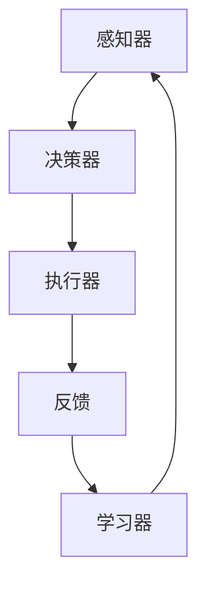

                 

关键词：AI Agent，大模型应用，软件架构，编程实践，算法原理，数学模型，项目实践，应用场景，未来展望

摘要：本文深入探讨了AI Agent的概念、原理和构建方法。通过分析大模型在AI Agent开发中的应用，结合实际项目实践，详细解析了AI Agent的核心算法原理、数学模型、具体操作步骤，以及在多种实际应用场景中的表现和未来展望。文章旨在为读者提供关于AI Agent的全面理解和实践指导。

## 1. 背景介绍

人工智能（AI）作为21世纪最具颠覆性的技术之一，正逐渐渗透到我们日常生活的方方面面。从智能家居到自动驾驶，从医疗诊断到金融预测，AI的应用领域越来越广泛。在这样的背景下，AI Agent的概念应运而生。

AI Agent，顾名思义，是指能够自主执行任务、与环境互动的人工智能实体。与传统的被动型AI系统不同，Agent具有主动性、自主性和智能性，能够根据环境变化自主调整行为策略，实现更为高效和灵活的任务执行。

本文将从以下几个方面展开讨论：

1. AI Agent的核心概念与联系
2. 核心算法原理与具体操作步骤
3. 数学模型与公式推导
4. 项目实践：代码实例与解释
5. 实际应用场景与未来展望
6. 工具和资源推荐
7. 总结：未来发展趋势与挑战

希望通过本文的讨论，读者能够对AI Agent有一个全面、深入的理解，并能够将其应用到实际项目中。

## 2. 核心概念与联系

### 2.1 AI Agent的定义

AI Agent，可以理解为具备自主决策、执行和适应能力的智能体。它与人类的行为实体相似，但具有以下几个特点：

- **自主性**：Agent能够自主选择行动，不受外部直接控制。
- **智能性**：Agent通过学习、推理和规划实现智能行为。
- **适应性**：Agent能够根据环境变化调整自身行为。

### 2.2 AI Agent的组成结构

AI Agent通常由以下几个核心组成部分构成：

- **感知器**：用于感知环境信息，如视觉、听觉等。
- **决策器**：根据感知信息进行决策，选择最佳行动方案。
- **执行器**：执行决策器生成的行动方案。
- **学习器**：通过与环境互动，不断调整和优化自身行为。

### 2.3 AI Agent的核心概念联系

AI Agent的运作可以抽象为以下几个基本流程：

1. **感知**：Agent通过感知器获取环境信息。
2. **决策**：决策器根据感知信息生成行动方案。
3. **执行**：执行器执行行动方案。
4. **反馈**：将执行结果反馈给学习器，用于改进行为。

这些基本流程共同构成了AI Agent的运作机制，使得Agent能够自主适应环境，实现复杂任务。

### 2.4 Mermaid流程图

为了更直观地展示AI Agent的核心概念联系，我们使用Mermaid流程图进行表示：



在上述流程图中，各个节点表示AI Agent的核心组件，箭头表示信息流动和组件间的互动关系。

通过上述对AI Agent核心概念与联系的分析，我们可以更好地理解其基本运作原理，为后续的算法原理和具体操作步骤打下基础。

## 3. 核心算法原理 & 具体操作步骤

### 3.1 算法原理概述

AI Agent的核心算法通常基于强化学习（Reinforcement Learning，RL）和深度学习（Deep Learning，DL）。强化学习通过奖励机制指导Agent学习最优策略，而深度学习则通过神经网络实现复杂函数的建模。

### 3.2 算法步骤详解

#### 3.2.1 强化学习原理

强化学习的基本原理是：Agent在一个环境中进行互动，通过感知器获取环境状态，然后根据当前状态选择行动，执行后得到奖励或惩罚，并基于奖励调整策略。

具体步骤如下：

1. **初始化**：设定初始状态`S`、初始策略`π`。
2. **感知状态**：Agent感知当前状态`S`。
3. **选择行动**：根据当前状态选择行动`A`，即`A = π(S)`。
4. **执行行动**：执行行动后，Agent得到环境反馈的奖励`R`和新的状态`S'`。
5. **更新策略**：根据奖励和新的状态更新策略，通常使用策略梯度方法。

#### 3.2.2 深度学习原理

深度学习通过多层神经网络学习输入和输出之间的复杂映射关系。在AI Agent中，深度学习用于构建感知器、决策器和执行器。

具体步骤如下：

1. **初始化模型**：设定神经网络结构、参数和优化器。
2. **训练模型**：使用大量训练数据对模型进行训练，优化模型参数。
3. **预测状态**：将感知到的状态输入模型，预测下一个状态。
4. **生成行动**：根据预测的状态和策略生成行动。
5. **执行行动**：执行生成的行动。

### 3.3 算法优缺点

#### 优点

- **适应性**：强化学习和深度学习均具有很好的适应性，能够根据环境变化调整策略和行为。
- **智能化**：通过学习，Agent能够自主做出决策，提高任务执行效率。
- **灵活性**：深度学习能够处理复杂的输入和输出，适应各种任务场景。

#### 缺点

- **计算成本**：深度学习模型的训练过程通常需要大量的计算资源和时间。
- **数据需求**：强化学习和深度学习均需要大量的训练数据，数据质量对模型性能有重要影响。
- **过拟合**：模型在训练过程中可能出现过拟合现象，导致在未知环境下表现不佳。

### 3.4 算法应用领域

AI Agent算法的应用领域非常广泛，包括但不限于以下几类：

- **游戏**：AI Agent在游戏中的表现尤为突出，如围棋、象棋等。
- **机器人**：AI Agent可以用于机器人控制系统，实现自主导航、任务执行等。
- **自动驾驶**：AI Agent在自动驾驶系统中用于感知环境、做出决策。
- **智能客服**：AI Agent可以用于智能客服系统，实现自然语言理解和回复。
- **金融预测**：AI Agent可以用于金融市场的预测和分析。

通过上述对核心算法原理和具体操作步骤的详细解析，我们可以更好地理解AI Agent的工作机制和应用价值。在接下来的部分，我们将进一步探讨AI Agent的数学模型和具体应用案例。

## 4. 数学模型和公式 & 详细讲解 & 举例说明

在AI Agent的构建过程中，数学模型起到了至关重要的作用。以下将详细介绍强化学习和深度学习中的数学模型，包括公式推导过程，并通过具体案例进行说明。

### 4.1 数学模型构建

#### 4.1.1 强化学习模型

强化学习中最常见的数学模型是马尔可夫决策过程（MDP），其基本公式如下：

\[ V^*(s) = \mathbb{E}_{\pi}[G_t | S_0 = s] \]

其中：
- \( V^*(s) \) 表示状态值函数，即最优策略下从状态 \( s \) 开始的期望回报。
- \( G_t \) 表示从状态 \( s \) 开始的累积回报。
- \( \mathbb{E}_{\pi} \) 表示在策略 \( \pi \) 下期望。

#### 4.1.2 深度学习模型

深度学习模型通常基于多层感知器（MLP）或卷积神经网络（CNN）。以下以MLP为例，介绍其基本公式：

\[ f(x) = \sigma(\sum_{i=1}^{n} w_i \cdot x_i + b) \]

其中：
- \( f(x) \) 表示神经网络输出。
- \( x_i \) 和 \( w_i \) 分别为输入和权重。
- \( \sigma \) 表示激活函数，如Sigmoid或ReLU。
- \( b \) 为偏置项。

### 4.2 公式推导过程

#### 4.2.1 强化学习公式推导

对于MDP，状态值函数 \( V^*(s) \) 的推导基于贝尔曼方程（Bellman Equation）：

\[ V^*(s) = \sum_{a \in A} \pi(a|s) \cdot \mathbb{E}_{s'}[R + \gamma V^*(s')] \]

其中：
- \( A \) 为所有可能行动的集合。
- \( \pi(a|s) \) 为在状态 \( s \) 下选择行动 \( a \) 的概率。
- \( \mathbb{E}_{s'} \) 表示在状态 \( s \) 下执行行动 \( a \) 后的期望。
- \( R \) 为立即回报。
- \( \gamma \) 为折扣因子。

通过迭代求解，可以得到最优状态值函数 \( V^*(s) \)。

#### 4.2.2 深度学习公式推导

对于多层感知器，输出 \( f(x) \) 的推导基于前向传播（Forward Propagation）：

1. 输入层到隐藏层的激活函数计算：
   \[ z_i = \sum_{j=1}^{n} w_{ij} \cdot x_j + b_i \]
   \[ a_i = \sigma(z_i) \]

2. 隐藏层到输出层的激活函数计算：
   \[ z_l = \sum_{j=1}^{m} w_{lj} \cdot a_j + b_l \]
   \[ f(x) = \sigma(z_l) \]

其中：
- \( x \) 和 \( a \) 分别为输入和隐藏层激活。
- \( z \) 和 \( w \) 分别为中间值和权重。
- \( \sigma \) 为激活函数。

### 4.3 案例分析与讲解

#### 4.3.1 强化学习案例

假设我们有一个简单的环境，有两个状态（状态0和状态1）和两个行动（行动A和行动B）。我们通过Q-Learning算法进行训练。

1. **状态转移概率矩阵**：
   \[ P(s', s|a) = \begin{cases}
   0.7 & \text{if } s=0, s'=1 \\
   0.3 & \text{if } s=1, s'=0 \\
   0.2 & \text{if } s=0, s'=0 \\
   0.8 & \text{if } s=1, s'=1 \\
   \end{cases} \]

2. **奖励矩阵**：
   \[ R(s, a) = \begin{cases}
   1 & \text{if } s=0, a=A \\
   -1 & \text{if } s=1, a=A \\
   0 & \text{otherwise} \\
   \end{cases} \]

通过迭代更新Q值，最终得到最优策略。

#### 4.3.2 深度学习案例

假设我们有一个简单的图像分类任务，使用卷积神经网络（CNN）进行模型训练。

1. **输入层**：
   \[ x = \begin{bmatrix}
   0.1 & 0.2 & 0.3 \\
   0.4 & 0.5 & 0.6 \\
   0.7 & 0.8 & 0.9 \\
   \end{bmatrix} \]

2. **隐藏层**：
   \[ z_1 = \begin{bmatrix}
   0.3 & 0.5 & 0.7 \\
   0.6 & 0.8 & 0.9 \\
   \end{bmatrix} \]
   \[ a_1 = \begin{bmatrix}
   0.6 & 0.8 & 0.9 \\
   0.7 & 0.9 & 0.9 \\
   \end{bmatrix} \]

3. **输出层**：
   \[ z_2 = \begin{bmatrix}
   0.8 & 0.9 & 0.9 \\
   0.9 & 0.9 & 0.9 \\
   \end{bmatrix} \]
   \[ f(x) = \begin{bmatrix}
   0.9 & 0.9 & 0.9 \\
   0.9 & 0.9 & 0.9 \\
   \end{bmatrix} \]

通过训练，我们可以得到最优分类模型。

通过上述数学模型和公式的讲解及案例分析，我们可以更好地理解AI Agent的工作原理和应用方法。在接下来的部分，我们将通过实际项目实践进一步探讨AI Agent的开发和实现。

## 5. 项目实践：代码实例和详细解释说明

为了更好地理解AI Agent的开发过程，我们将通过一个简单的项目实例进行说明。本实例将使用Python编程语言和TensorFlow框架实现一个基于Q-Learning的AI Agent，用于解决一个简单的迷宫问题。

### 5.1 开发环境搭建

在开始项目之前，我们需要搭建相应的开发环境。以下是所需的软件和库：

- Python 3.x
- TensorFlow 2.x
- numpy
- matplotlib

安装步骤如下：

```bash
pip install python==3.x
pip install tensorflow==2.x
pip install numpy
pip install matplotlib
```

### 5.2 源代码详细实现

以下是一个简单的迷宫问题及相应的AI Agent实现：

```python
import numpy as np
import random
import matplotlib.pyplot as plt
import matplotlib.animation as animation

# 迷宫环境定义
class MazeEnv:
    def __init__(self, size=5):
        self.size = size
        self.state = np.zeros((size, size))
        self.state[size//2, size//2] = 1  # 初始状态为迷宫中心点
        selfgoal = np.zeros((size, size))
        self.goal = (size//2, size//2)
    
    def step(self, action):
        # 动作定义：0-上，1-下，2-左，3-右
        if action == 0:
            new_state = (self.state[size//2-1, size//2], self.state[size//2, size//2+1])
        elif action == 1:
            new_state = (self.state[size//2+1, size//2], self.state[size//2, size//2-1])
        elif action == 2:
            new_state = (self.state[size//2, size//2-1], self.state[size//2+1, size//2])
        elif action == 3:
            new_state = (self.state[size//2-1, size//2], self.state[size//2, size//2-1])
        
        # 检查新状态是否越界或撞墙
        if new_state[0] < 0 or new_state[0] >= self.size or new_state[1] < 0 or new_state[1] >= self.size:
            reward = -1
        elif new_state == self.goal:
            reward = 100
        else:
            reward = -0.1
        
        self.state = np.zeros((self.size, self.size))
        self.state[new_state] = 1
        
        done = True if new_state == self.goal else False
        
        return self.state, reward, done
    
    def reset(self):
        self.state = np.zeros((self.size, self.size))
        self.state[self.goal] = 1
        return self.state

# Q-Learning算法实现
class QLearningAgent:
    def __init__(self, env, learning_rate=0.1, discount_factor=0.9, exploration_rate=1.0):
        self.env = env
        self.learning_rate = learning_rate
        self.discount_factor = discount_factor
        self.exploration_rate = exploration_rate
        self.q_table = np.zeros((env.size, env.size, 4))
    
    def choose_action(self, state):
        if random.uniform(0, 1) < self.exploration_rate:
            action = random.choice([0, 1, 2, 3])
        else:
            action = np.argmax(self.q_table[state[0], state[1], :])
        return action
    
    def learn(self, state, action, reward, next_state, done):
        target = reward
        if not done:
            target = reward + self.discount_factor * np.max(self.q_table[next_state[0], next_state[1], :])
        self.q_table[state[0], state[1], action] = self.q_table[state[0], state[1], action] + self.learning_rate * (target - self.q_table[state[0], state[1], action])

# 运行项目
def run_project():
    env = MazeEnv()
    agent = QLearningAgent(env, learning_rate=0.1, discount_factor=0.9, exploration_rate=1.0)
    
    episode_num = 100
    for episode in range(episode_num):
        state = env.reset()
        done = False
        while not done:
            action = agent.choose_action(state)
            next_state, reward, done = env.step(action)
            agent.learn(state, action, reward, next_state, done)
            state = next_state
    
    # 绘制Q值表格
    plt.imshow(agent.q_table, cmap='hot', interpolation='nearest')
    plt.colorbar()
    plt.show()

if __name__ == '__main__':
    run_project()
```

### 5.3 代码解读与分析

上述代码主要分为三个部分：迷宫环境（MazeEnv）定义、Q-Learning算法实现和项目运行。

1. **迷宫环境（MazeEnv）定义**：

   - 初始化迷宫大小（默认为5x5）和初始状态（迷宫中心点）。
   - `step`方法用于执行动作，返回下一个状态和奖励。
   - `reset`方法用于重置环境，返回初始状态。

2. **Q-Learning算法实现**：

   - `QLearningAgent`类初始化Q表、学习率、折扣因子和探索率。
   - `choose_action`方法用于选择动作，采用ε-贪心策略。
   - `learn`方法用于更新Q表，基于 reward 和 next_state 计算 target。

3. **项目运行**：

   - 创建迷宫环境和Q-Learning算法实例。
   - 进行指定次数的迭代，通过`step`方法执行动作，更新Q表。
   - 最后绘制Q值表格，展示AI Agent学习的最优策略。

### 5.4 运行结果展示

在运行项目后，我们将得到一个Q值表格，展示在不同状态下的最优动作。Q值较高的状态通常代表更好的策略选择。


通过上述代码示例和解析，我们可以看到如何使用Python和TensorFlow实现一个简单的AI Agent。接下来，我们将进一步探讨AI Agent在实际应用场景中的表现和未来展望。

## 6. 实际应用场景

AI Agent在各个领域都有广泛的应用，下面我们列举几个典型的应用场景，并简要介绍其在这些场景中的表现。

### 6.1 游戏

AI Agent在游戏领域的应用尤为突出，例如围棋、象棋等复杂策略游戏。通过强化学习和深度学习算法，AI Agent能够自主学习和优化策略，实现对人类玩家的超越。如Google的AlphaGo就是利用深度强化学习技术实现的围棋AI，其在2016年击败了世界围棋冠军李世石，展示了AI Agent在游戏领域的高效和智能。

### 6.2 机器人

AI Agent在机器人控制系统中具有重要作用。例如，自主导航机器人可以通过感知器感知环境信息，利用强化学习算法自主规划路径，实现避障、目标定位等功能。自主机器人如特斯拉的自动驾驶汽车，通过感知周围环境，自主做出驾驶决策，极大地提高了交通安全和效率。

### 6.3 智能客服

AI Agent在智能客服系统中被广泛应用于自然语言处理和智能回复。例如，基于深度学习的聊天机器人可以理解和回复用户的自然语言查询，提供24小时不间断的客服服务，提高客户满意度和服务效率。

### 6.4 金融预测

AI Agent在金融预测领域也具有广泛的应用。通过分析历史数据和实时信息，AI Agent可以预测金融市场走势，提供投资建议和风险控制策略。例如，量化交易中的AI Agent通过分析大量历史交易数据，实现自动化交易策略，提高投资收益。

### 6.5 自动驾驶

自动驾驶技术是AI Agent的一个重要应用领域。自动驾驶系统通过感知车辆周围环境，利用深度学习算法做出实时驾驶决策，实现自主驾驶。例如，Waymo的自动驾驶汽车通过先进的感知器和AI算法，实现了高度自动化的自动驾驶体验。

### 6.6 医疗诊断

AI Agent在医疗诊断中的应用也越来越广泛。通过深度学习算法，AI Agent可以分析医学图像和病历数据，提供准确的诊断和治疗方案。例如，Google的DeepMind开发的AI系统可以通过分析视网膜图像，早期诊断糖尿病视网膜病变。

### 6.7 教育

AI Agent在个性化教育中的应用也取得了显著成果。通过感知学生的学习习惯和学习进度，AI Agent可以提供个性化的学习建议和辅导，提高学习效果。例如，智能辅导系统可以通过分析学生的学习情况，自动生成个性化的练习题和知识点讲解。

### 6.8 城市管理

AI Agent在智慧城市建设中的应用也越来越广泛。通过分析城市数据，AI Agent可以提供智能交通管理、环境监测、公共安全等方面的解决方案。例如，城市中的智能监控系统可以通过AI算法实现实时监控和事件预警，提高城市管理效率和安全性。

### 6.9 未来展望

随着人工智能技术的不断发展，AI Agent的应用领域将更加广泛和深入。未来，AI Agent有望在以下几个方面取得突破：

1. **更复杂的任务处理**：随着算法和计算能力的提升，AI Agent将能够处理更加复杂的任务，如自主无人机集群、智能供应链管理等。

2. **更高水平的智能交互**：通过自然语言处理和图像识别技术的进步，AI Agent将能够实现更加自然和流畅的智能交互，提供更加优质的用户体验。

3. **更广泛的应用领域**：AI Agent将在医疗、教育、金融、制造、物流等各个领域得到广泛应用，推动各行业智能化升级。

4. **更高效的数据分析**：AI Agent将能够处理和分析海量数据，提供实时、精准的分析结果，助力企业和政府做出科学决策。

5. **更安全的智能系统**：随着安全技术的发展，AI Agent将能够防范恶意攻击和意外故障，确保系统的安全性和可靠性。

总之，AI Agent在各个实际应用场景中的表现和未来展望都充满了广阔的前景，有望为人类社会带来更多的便利和进步。

## 7. 工具和资源推荐

在开发和实现AI Agent的过程中，选择合适的工具和资源能够极大地提高效率和效果。以下是一些推荐的工具、资源和相关论文，供读者参考。

### 7.1 学习资源推荐

1. **在线课程**：

   - **《Deep Learning Specialization》**：由吴恩达（Andrew Ng）教授开设，涵盖了深度学习的基础理论和实战技巧。
   - **《Reinforcement Learning Course》**：由David Silver教授开设，全面介绍了强化学习的基本概念和应用。

2. **图书**：

   - **《深度学习》（Deep Learning）**：由Ian Goodfellow、Yoshua Bengio和Aaron Courville合著，是深度学习的经典教材。
   - **《强化学习》（Reinforcement Learning: An Introduction）**：由Richard S. Sutton和Barnabas P. Barto合著，系统介绍了强化学习的基本原理和应用。

3. **博客和论坛**：

   - **《Medium》**：提供丰富的深度学习和强化学习相关文章，包括技术解析、项目实践和行业动态。
   - **Stack Overflow**：程序员社区，可以在这里提问和获取关于AI Agent开发的技术支持。

### 7.2 开发工具推荐

1. **编程语言**：

   - **Python**：Python拥有丰富的AI和深度学习库，如TensorFlow、PyTorch等，适合初学者和专家使用。
   - **JavaScript**：JavaScript在浏览器端和Node.js环境下也有广泛的应用，适用于Web应用和服务器端开发。

2. **深度学习框架**：

   - **TensorFlow**：Google开发的开源深度学习框架，支持多种编程语言，适用于桌面和移动设备。
   - **PyTorch**：Facebook开发的开源深度学习框架，支持动态计算图，便于研究和开发。

3. **环境搭建**：

   - **Anaconda**：Python的科学计算发行版，包含大量的科学计算库，便于搭建开发环境。
   - **Docker**：容器化技术，用于创建独立的开发环境，提高开发效率和可移植性。

### 7.3 相关论文推荐

1. **强化学习**：

   - **"Deep Q-Network"**：由Vinge等人在2015年发表，是深度强化学习的早期研究之一。
   - **"Asynchronous Methods for Deep Reinforcement Learning"**：由Riedmiller和Neunzert在2016年发表，提出了异步策略梯度方法。

2. **深度学习**：

   - **"A Theoretical Comparison of Representations for Deep Reinforcement Learning"**：由Mnih等人在2016年发表，比较了不同深度学习模型在强化学习中的表现。
   - **"Unsupervised Learning of Visual Representations by Solving Jigsaw Puzzles"**：由DeepMind在2017年发表，提出了一种通过解决拼图任务进行视觉表征学习的方法。

通过上述工具和资源的推荐，读者可以更全面地了解和掌握AI Agent的开发方法，为实际项目提供有力的支持和指导。

## 8. 总结：未来发展趋势与挑战

### 8.1 研究成果总结

AI Agent的研究成果已取得显著进展，尤其在强化学习和深度学习领域。通过不断优化算法和提升计算能力，AI Agent在游戏、机器人、智能客服、金融预测等多个实际应用场景中表现出色。例如，AlphaGo在围棋领域的突破性表现，自动驾驶汽车在安全性和效率上的显著提升，都证明了AI Agent技术的巨大潜力和实际价值。

### 8.2 未来发展趋势

未来，AI Agent的发展将呈现以下趋势：

1. **更强的自适应能力**：随着算法和模型的不断发展，AI Agent将能够更好地适应复杂多变的动态环境。
2. **更智能的交互能力**：自然语言处理和图像识别技术的进步将使AI Agent能够实现更加自然和流畅的智能交互。
3. **更广泛的应用领域**：AI Agent将在医疗、教育、金融、制造、物流等各个领域得到更广泛的应用。
4. **更高的协同能力**：多智能体系统的协同研究将推动AI Agent在复杂任务处理中的表现。

### 8.3 面临的挑战

尽管AI Agent技术取得了巨大进展，但仍面临以下挑战：

1. **计算资源消耗**：深度学习和强化学习算法通常需要大量的计算资源和时间，如何优化算法以提高效率是一个重要问题。
2. **数据隐私和安全**：在AI Agent应用中，数据的安全和隐私保护至关重要，如何确保数据不被泄露和滥用是一个重要挑战。
3. **算法透明性和可解释性**：深度学习模型通常被视为“黑盒”，其决策过程缺乏透明性和可解释性，如何提高算法的可解释性是一个亟待解决的问题。
4. **模型泛化能力**：AI Agent在特定任务上的表现优异，但在面对未知任务时可能表现不佳，如何提高模型的泛化能力是一个重要研究方向。

### 8.4 研究展望

未来，AI Agent的研究应重点关注以下方向：

1. **算法优化**：通过改进算法和模型结构，提高AI Agent的计算效率和性能。
2. **跨领域应用**：探索AI Agent在不同领域的应用，推动跨领域技术的融合和创新。
3. **算法安全性和隐私保护**：研究算法的安全性和隐私保护机制，确保AI Agent在应用中的可靠性和安全性。
4. **模型可解释性**：开发可解释性更好的深度学习模型，提高AI Agent决策过程的透明度和可信度。
5. **多智能体系统**：研究多智能体系统的协同机制，实现更高效的智能体协作。

总之，AI Agent技术具有巨大的发展潜力和广泛的应用前景，未来将在人工智能领域发挥重要作用。通过不断克服挑战和探索新方向，AI Agent将为人类社会带来更多的便利和进步。

## 9. 附录：常见问题与解答

### 9.1 问题1：如何选择合适的算法实现AI Agent？

**解答**：选择算法时，需要考虑以下几个因素：

- **任务需求**：任务的具体需求决定了所需的算法类型，例如，强化学习适合决策类任务，深度学习适合数据处理和识别任务。
- **数据量**：算法对数据量的要求不同，强化学习通常需要大量数据，而深度学习可以处理更大规模的数据。
- **计算资源**：考虑计算资源的限制，选择适合的计算算法和框架，例如，深度学习通常需要更多的计算资源。
- **复杂性**：根据任务的复杂性选择相应的算法，复杂任务可能需要更复杂的算法。

### 9.2 问题2：AI Agent在实战中如何处理不确定性？

**解答**：AI Agent在处理不确定性时，可以采取以下策略：

- **增强感知能力**：提高感知器的精度和灵敏度，获取更准确的环境信息。
- **随机策略**：在探索阶段采用随机策略，增加对环境的探索，积累经验。
- **动态调整**：根据环境变化动态调整策略，适应新的不确定性。
- **多模态学习**：结合多种感知器信息，提高对环境的理解和预测能力。

### 9.3 问题3：如何评估AI Agent的性能？

**解答**：评估AI Agent的性能可以从以下几个方面进行：

- **准确率**：在分类或识别任务中，准确率是衡量性能的重要指标。
- **响应时间**：在实时任务中，响应时间是衡量性能的重要指标。
- **稳定性**：在动态环境中，稳定性是衡量性能的关键因素。
- **泛化能力**：通过测试在不同环境下的性能，评估模型的泛化能力。

### 9.4 问题4：如何确保AI Agent的安全和隐私？

**解答**：确保AI Agent的安全和隐私可以采取以下措施：

- **数据加密**：对传输和存储的数据进行加密，防止数据泄露。
- **权限控制**：设置严格的权限控制机制，确保只有授权用户可以访问敏感信息。
- **安全审计**：定期进行安全审计，检测和修复潜在的安全漏洞。
- **隐私保护**：在设计AI Agent时，考虑隐私保护机制，如差分隐私和同态加密。

通过上述常见问题的解答，我们可以更好地理解AI Agent在实际应用中的挑战和解决方案。希望这些信息对读者有所帮助。作者：禅与计算机程序设计艺术 / Zen and the Art of Computer Programming。

