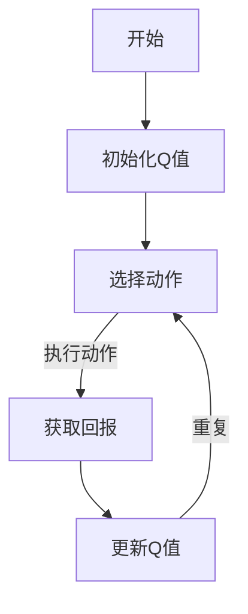

                 

关键词：Q-learning，强化学习，人工智能，机器学习，深度学习，智能算法，前沿研究

> 摘要：本文将探讨Q-learning算法在人工智能领域的研究前沿。Q-learning是强化学习中最基础的算法之一，其核心在于通过试错学习来最大化回报。本文将详细解析Q-learning的原理、数学模型、算法步骤、应用领域，并通过实际代码实例进行说明，旨在为读者提供一个全面深入的理解。

## 1. 背景介绍

随着人工智能技术的飞速发展，强化学习（Reinforcement Learning，RL）成为了一个热门的研究方向。强化学习是机器学习的一个重要分支，旨在通过试错和反馈来训练智能体（agent）完成特定任务。Q-learning作为强化学习中的一个核心算法，其研究与应用前景十分广阔。

Q-learning由理查德·萨顿（Richard S. Sutton）和安德鲁·巴沙姆（Andrew G. Barto）在1988年的著作《强化学习：一种解释》中首次提出。Q-learning通过一个Q值函数来评估每个状态-动作对的期望回报，并不断更新Q值以最大化累积回报。

## 2. 核心概念与联系

### 2.1 强化学习基本概念

强化学习由以下四个核心要素组成：

1. **智能体（Agent）**：执行动作并学习策略的主体。
2. **环境（Environment）**：智能体所处的环境，能够对智能体的动作进行响应。
3. **状态（State）**：智能体在环境中的一个特定情况。
4. **动作（Action）**：智能体在某个状态下可以执行的行为。

### 2.2 Q-learning原理

Q-learning的核心在于维护一个Q值函数，该函数用于估计每个状态-动作对的回报。Q值函数可以表示为：

\[ Q(s, a) = \sum_{s'} P(s'|s, a) \cdot R(s', a) + \gamma \cdot \max_{a'} Q(s', a') \]

其中：

- \( s \) 和 \( s' \) 分别为当前状态和下一状态。
- \( a \) 和 \( a' \) 分别为当前动作和下一动作。
- \( P(s'|s, a) \) 为智能体在状态 \( s \) 执行动作 \( a \) 后进入状态 \( s' \) 的概率。
- \( R(s', a) \) 为在状态 \( s' \) 执行动作 \( a \) 所获得的即时回报。
- \( \gamma \) 为折扣因子，表示对未来回报的期望。

### 2.3 Mermaid流程图



## 3. 核心算法原理 & 具体操作步骤

### 3.1 算法原理概述

Q-learning算法通过不断试错来学习最优策略。它通过以下步骤实现：

1. 初始化Q值函数。
2. 选择一个动作。
3. 执行动作并获取回报。
4. 更新Q值函数。

### 3.2 算法步骤详解

1. **初始化Q值函数**：通常初始化为0或者较小正值。

2. **选择动作**：根据当前状态和Q值函数选择动作。常用的策略有ε-贪心策略和ε-软策略。

3. **执行动作并获取回报**：在环境中执行选定的动作，并获得即时回报。

4. **更新Q值函数**：根据新的状态和回报更新Q值函数。

更新公式为：

\[ Q(s, a) \leftarrow Q(s, a) + \alpha \cdot (R(s', a) + \gamma \cdot \max_{a'} Q(s', a') - Q(s, a)) \]

其中，\( \alpha \) 为学习率。

### 3.3 算法优缺点

**优点**：

- 理论基础清晰，易于理解。
- 可以处理离散和连续动作空间。

**缺点**：

- 学习速度较慢，尤其是当状态和动作空间较大时。
- 可能会陷入局部最优解。

### 3.4 算法应用领域

Q-learning算法广泛应用于多个领域，包括：

- 游戏：如围棋、象棋等。
- 自动驾驶：用于决策和控制。
- 机器人：用于路径规划和任务执行。

## 4. 数学模型和公式 & 详细讲解 & 举例说明

### 4.1 数学模型构建

Q-learning算法的数学模型主要涉及Q值函数的更新过程。以下是一个简化的模型：

- 状态空间：\( S = \{ s_1, s_2, ..., s_n \} \)
- 动作空间：\( A = \{ a_1, a_2, ..., a_m \} \)
- Q值函数：\( Q(s, a) \)

### 4.2 公式推导过程

Q-learning算法的核心是Q值函数的更新过程。以下是一个简化的推导过程：

- 初始化Q值函数：\( Q(s, a) = 0 \)
- 选择动作：\( a_t = \arg\max_{a} Q(s_t, a) \)
- 执行动作：\( s_{t+1} = S | s_t, a_t \)
- 获取回报：\( R_t = R(s_{t+1}, a_t) \)
- 更新Q值：\( Q(s_t, a_t) \leftarrow Q(s_t, a_t) + \alpha \cdot (R_t + \gamma \cdot \max_{a'} Q(s_{t+1}, a') - Q(s_t, a_t)) \)

### 4.3 案例分析与讲解

假设一个简单的机器人环境，机器人可以在一个二维网格中移动。状态空间为 \( S = \{ (x, y) \} \)，动作空间为 \( A = \{ 上，下，左，右 \} \)。机器人每个动作的回报设置为1。

- 初始化Q值函数：\( Q(s, a) = 0 \)
- 选择动作：\( a_t = \arg\max_{a} Q(s_t, a) \)
- 执行动作：\( s_{t+1} = s_t + \Delta s \) （其中 \( \Delta s \) 为动作的方向向量）
- 获取回报：\( R_t = 1 \)
- 更新Q值：\( Q(s_t, a_t) \leftarrow Q(s_t, a_t) + \alpha \cdot (1 + \gamma \cdot \max_{a'} Q(s_{t+1}, a') - Q(s_t, a_t)) \)

## 5. 项目实践：代码实例和详细解释说明

### 5.1 开发环境搭建

- 环境要求：Python 3.8及以上版本，Numpy库
- 安装Python和Numpy库

```bash
pip install numpy
```

### 5.2 源代码详细实现

```python
import numpy as np

class QLearning:
    def __init__(self, actions, learning_rate=0.1, discount_factor=0.9):
        self.actions = actions
        self.learning_rate = learning_rate
        self.discount_factor = discount_factor
        self.Q = np.zeros((len(actions), len(actions)))

    def choose_action(self, state):
        if np.random.uniform() < 0.1:  # ε-greedy strategy
            action = np.random.choice(self.actions)
        else:
            action = np.argmax(self.Q[state])
        return action

    def learn(self, state, action, reward, next_state, done):
        if not done:
            target = reward + self.discount_factor * np.max(self.Q[next_state])
        else:
            target = reward

        self.Q[state, action] += self.learning_rate * (target - self.Q[state, action])

def run_episode(environment, agent):
    state = environment.reset()
    done = False
    total_reward = 0

    while not done:
        action = agent.choose_action(state)
        next_state, reward, done = environment.step(action)
        agent.learn(state, action, reward, next_state, done)
        state = next_state
        total_reward += reward

    return total_reward

def main():
    actions = ['up', 'down', 'left', 'right']
    agent = QLearning(actions)

    for episode in range(1000):
        total_reward = run_episode(environment, agent)
        print(f"Episode {episode}: Total Reward = {total_reward}")

if __name__ == "__main__":
    main()
```

### 5.3 代码解读与分析

- **QLearning类**：定义了Q-learning算法的基本结构，包括初始化Q值函数、选择动作、学习更新等。
- **choose_action方法**：实现ε-贪心策略，用于选择下一步动作。
- **learn方法**：更新Q值函数的核心方法，根据即时回报和折扣因子更新Q值。
- **run_episode函数**：模拟一次完整的学习过程，用于训练智能体。
- **main函数**：主程序入口，用于运行学习过程。

### 5.4 运行结果展示

运行上述代码，可以看到每完成一次学习过程，都会打印出相应的奖励值。这表明智能体在不断地学习并改进其策略。

## 6. 实际应用场景

Q-learning算法在实际应用中具有广泛的应用前景，以下是一些典型应用场景：

- **游戏**：例如围棋、象棋等策略性游戏。
- **自动驾驶**：用于路径规划和车辆控制。
- **机器人**：用于导航、路径规划和任务执行。
- **推荐系统**：通过用户行为数据优化推荐策略。

## 7. 工具和资源推荐

### 7.1 学习资源推荐

- 《强化学习：一种解释》（Richard S. Sutton，Andrew G. Barto著）
- 《深度强化学习》（Ian Goodfellow，Yoshua Bengio，Aaron Courville著）

### 7.2 开发工具推荐

- TensorFlow：用于构建和训练强化学习模型。
- OpenAI Gym：提供丰富的环境库，用于强化学习算法的实验。

### 7.3 相关论文推荐

- 《Q-learning》（Richard S. Sutton，Andrew G. Barto著）
- 《深度Q网络》（DeepMind团队著）

## 8. 总结：未来发展趋势与挑战

Q-learning算法作为强化学习的基础之一，在未来仍然具有重要的发展空间。以下是未来发展趋势与挑战：

### 8.1 研究成果总结

- **算法改进**：不断优化Q-learning算法，提高其收敛速度和稳定性。
- **多智能体强化学习**：研究多智能体环境中的Q-learning算法，提高协作与竞争能力。
- **实际应用**：将Q-learning算法应用于更多实际场景，如智能交通、医疗诊断等。

### 8.2 未来发展趋势

- **深度强化学习**：结合深度学习技术，提高智能体在复杂环境中的表现。
- **分布式强化学习**：研究分布式算法，提高大规模环境下的学习效率。
- **强化学习与博弈论结合**：探索强化学习在博弈场景中的应用，提高策略稳定性。

### 8.3 面临的挑战

- **计算资源**：处理大规模状态和动作空间时的计算资源需求。
- **数据稀缺**：在数据稀缺的场景中，如何提高算法的泛化能力。
- **安全性**：确保智能体在执行任务时的安全性和鲁棒性。

### 8.4 研究展望

Q-learning算法在未来将继续发展与完善，其在人工智能领域的重要性不可忽视。通过不断的理论研究与实际应用探索，Q-learning将推动人工智能技术的进步，为人类带来更多便利和效益。

## 9. 附录：常见问题与解答

### Q1：Q-learning算法的收敛性如何保证？

A1：Q-learning算法的收敛性可以通过以下两点保证：

- **经验回放**：通过经验回放机制，消除样本的相关性，提高算法的收敛速度。
- **ε-贪心策略**：在探索与利用之间取得平衡，避免过早陷入局部最优解。

### Q2：如何选择合适的折扣因子γ？

A2：折扣因子γ的选择对Q-learning算法的性能有重要影响。一般建议：

- **高回报**：当任务回报较高时，γ可以取较大值，以使未来回报对当前决策的影响更小。
- **低回报**：当任务回报较低时，γ可以取较小值，以使当前回报对决策的影响更大。

### Q3：Q-learning算法是否适用于连续动作空间？

A3：Q-learning算法主要用于离散动作空间。对于连续动作空间，可以采用一些变体，如深度Q网络（DQN）或演员-评论家算法（AC）等。这些算法通过神经网络来近似Q值函数，从而处理连续动作空间。

### Q4：Q-learning算法在多智能体环境中的应用如何？

A4：在多智能体环境中，Q-learning算法需要针对每个智能体独立训练。对于协作任务，可以通过经验共享机制来提高学习效率。对于竞争任务，需要研究如何在竞争环境中保持智能体的稳定性和鲁棒性。

