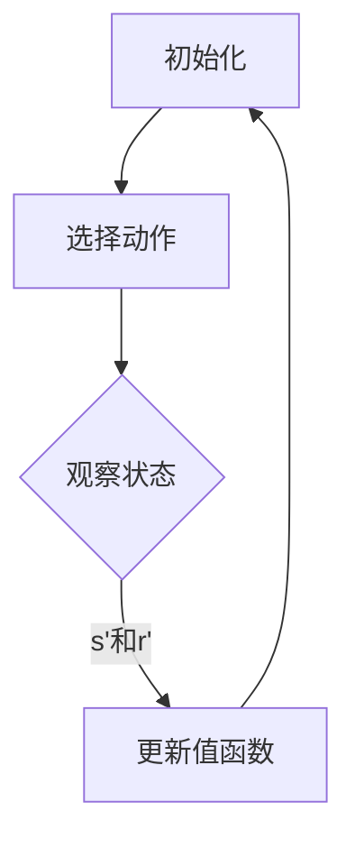

                 

关键词：智能电网、Q-learning、人工智能、映射、算法应用、电网优化

## 摘要

随着全球电力需求的持续增长和能源结构的不断调整，智能电网作为一种高度集成化的电力系统，正成为能源领域的重要发展方向。本文将探讨人工智能中的Q-learning算法在智能电网中的应用，通过对Q-learning算法的基本概念、原理及其在智能电网中的应用实例进行深入分析，揭示其在电网优化、能量管理等方面的潜在价值。本文旨在为研究人员和工程师提供有价值的参考，以推动智能电网领域的技术进步。

## 1. 背景介绍

### 智能电网的发展历程

智能电网（Smart Grid）是现代电力系统的一种进化形态，它通过先进的信息通信技术和电力电子技术，实现电网的自动化、智能化管理，从而提高电力系统的可靠性、安全性和经济性。智能电网的发展大致可以分为以下几个阶段：

1. **自动化电网**：这一阶段主要引入了继电保护和自动控制装置，实现了对电力系统的基本监控和自动化操作。
2. **数字化电网**：通过使用计算机技术，实现了对电网信息的数字化采集和处理，为后续智能化应用奠定了基础。
3. **智能化电网**：这一阶段开始引入智能算法和人工智能技术，实现了对电网的智能优化和自适应控制，使得电网的运行更加高效和灵活。

### 智能电网的核心技术和应用场景

智能电网的核心技术包括：

1. **信息通信技术**：实现电网设备与系统的实时通信和信息共享，是智能电网的基础。
2. **传感与测量技术**：通过高精度的传感器对电网进行监测，提供实时的数据支持。
3. **自动化与控制技术**：利用智能算法和自动化控制装置，实现对电网运行状态的实时调节和控制。
4. **电力电子技术**：通过电力电子设备，实现对电能的高效转换和传输。

智能电网的应用场景包括：

1. **电力市场**：实现电力市场的自动化交易，提高市场的透明度和效率。
2. **分布式能源管理**：通过智能电网技术，实现对分布式能源的集成和管理，提高能源利用效率。
3. **需求响应**：通过智能电网，实现对用户需求的实时响应，提高电网的灵活性和可靠性。
4. **电力系统安全与可靠性**：通过智能电网技术，提高电力系统的安全防护能力和故障处理效率。

### 智能电网面临的挑战和机遇

智能电网的发展面临着一系列的挑战和机遇：

1. **数据安全与隐私保护**：智能电网中的海量数据如何确保安全传输和存储，同时保护用户隐私。
2. **复杂系统的稳定性和可靠性**：智能电网涉及大量的设备和技术，如何确保系统的稳定性和可靠性。
3. **能源结构的优化**：随着新能源的广泛应用，如何实现传统能源与新能源的优化组合，提高能源利用效率。

## 2. 核心概念与联系

### Q-learning算法的基本概念

Q-learning算法是深度强化学习（Deep Reinforcement Learning, DRL）中的一种经典算法，主要用于解决连续动作空间中的决策问题。它通过探索和利用策略，逐步优化智能体的行为策略，以实现长期回报的最大化。

### Q-learning算法原理

Q-learning算法的核心思想是通过学习值函数Q(s, a)，来预测在当前状态下执行某一动作a所能获得的长期回报。具体步骤如下：

1. **初始化**：初始化值函数Q(s, a)和策略π。
2. **选择动作**：在给定状态下，根据策略π选择一个动作a。
3. **执行动作**：在环境中执行动作a，观察当前状态的下一个状态s'和立即回报r'。
4. **更新值函数**：根据Q-learning更新规则，更新值函数Q(s, a)。
5. **重复**：回到步骤2，继续进行下一轮的探索和更新。

### 智能电网与Q-learning算法的联系

智能电网中存在着大量的优化问题，如负载分配、能源管理、需求响应等。这些问题本质上可以转化为Q-learning算法中的状态转移和回报优化问题。因此，Q-learning算法在智能电网中具有广泛的应用前景。

### Mermaid流程图



## 3. 核心算法原理 & 具体操作步骤

### 3.1 算法原理概述

Q-learning算法的核心在于通过不断尝试不同的动作，学习和优化值函数Q(s, a)，从而实现最佳策略的发现。具体来说，Q-learning算法分为以下几部分：

1. **状态空间和动作空间**：定义智能体在环境中的状态和可选动作。
2. **值函数**：用于评估状态和动作的组合。
3. **策略**：用于选择动作。
4. **探索和利用**：在策略迭代过程中，平衡探索新动作和利用已知信息。

### 3.2 算法步骤详解

1. **初始化**：
   - 初始化值函数Q(s, a)和策略π。
   - 值函数通常初始化为0，策略π可以是均匀分布。

2. **选择动作**：
   - 在给定状态下，根据策略π选择一个动作a。
   - 策略π可以采用ε-贪心策略，即在ε概率下随机选择动作，在1-ε概率下选择最优动作。

3. **执行动作**：
   - 在环境中执行动作a，观察当前状态的下一个状态s'和立即回报r'。

4. **更新值函数**：
   - 根据Q-learning更新规则，更新值函数Q(s, a)。
   - 更新规则为：$$Q(s, a) \leftarrow Q(s, a) + \alpha [r' + \gamma \max_{a'} Q(s', a') - Q(s, a)]$$
   - 其中，α为学习率，γ为折扣因子。

5. **重复**：
   - 回到步骤2，继续进行下一轮的探索和更新，直到满足停止条件。

### 3.3 算法优缺点

**优点**：
- **自适应性强**：Q-learning算法能够根据环境变化自适应调整策略。
- **适用于连续动作空间**：通过使用神经网络等模型，可以处理复杂的连续动作空间问题。

**缺点**：
- **收敛速度慢**：在大型状态空间中，Q-learning算法可能需要很长时间才能收敛到最优策略。
- **初始值影响大**：初始值函数的选择对算法的收敛速度和效果有重要影响。

### 3.4 算法应用领域

Q-learning算法在智能电网中的应用领域包括：

- **电力市场**：通过Q-learning算法优化市场交易策略，提高市场效率。
- **负载分配**：利用Q-learning算法优化负载分配策略，提高电网运行效率。
- **需求响应**：通过Q-learning算法优化用户需求响应策略，提高电网的灵活性和可靠性。
- **分布式能源管理**：利用Q-learning算法优化分布式能源的调度和管理策略，提高能源利用效率。

## 4. 数学模型和公式 & 详细讲解 & 举例说明

### 4.1 数学模型构建

在智能电网中，Q-learning算法的数学模型可以表示为：

- **状态空间**：S = {s1, s2, ..., sn}，表示电网的各个运行状态。
- **动作空间**：A = {a1, a2, ..., am}，表示电网的可选动作。
- **值函数**：Q(s, a) ∈ R，表示在状态s下执行动作a所能获得的长期回报。
- **策略**：π(a|s) ∈ [0, 1]，表示在状态s下选择动作a的概率。

### 4.2 公式推导过程

Q-learning算法的更新规则可以通过以下公式推导：

$$
\begin{aligned}
Q(s, a)_{new} &= Q(s, a)_{old} + \alpha [r' + \gamma \max_{a'} Q(s', a') - Q(s, a)_{old}] \\
\end{aligned}
$$

其中，α为学习率（0 < α ≤ 1），γ为折扣因子（0 < γ ≤ 1），r'为立即回报，Q(s', a')为在下一个状态s'下执行动作a'所能获得的长期回报。

### 4.3 案例分析与讲解

### 案例一：电力市场交易策略优化

假设智能电网中有两家发电厂A和B，各自的发电成本和发电量不同。目标是通过Q-learning算法优化发电厂的发电策略，实现电力市场交易收益的最大化。

1. **状态表示**：
   - 状态s = (Pa, Pb)，表示发电厂A和B的发电量。

2. **动作表示**：
   - 动作a = (Va, Vb)，表示发电厂A和B的发电策略。

3. **回报函数**：
   - 回报r = Pb - Va，表示发电厂B的收益减去发电厂A的成本。

4. **策略更新**：
   - 根据Q-learning算法，更新发电厂的发电策略，以最大化长期回报。

### 案例二：负载分配优化

假设智能电网中有三个负荷用户，各自的用电量和用电时间不同。目标是通过Q-learning算法优化电网的负载分配策略，提高电网的运行效率。

1. **状态表示**：
   - 状态s = (La1, La2, La3)，表示三个负荷用户的用电量。

2. **动作表示**：
   - 动作a = (Va1, Va2, Va3)，表示电网对三个负荷用户的供电量。

3. **回报函数**：
   - 回报r = max(La1 - Va1, La2 - Va2, La3 - Va3)，表示电网运行效率。

4. **策略更新**：
   - 根据Q-learning算法，更新电网的负载分配策略，以提高运行效率。

## 5. 项目实践：代码实例和详细解释说明

### 5.1 开发环境搭建

为了实现Q-learning算法在智能电网中的应用，我们首先需要搭建一个合适的开发环境。以下是一个基本的开发环境搭建步骤：

1. **安装Python环境**：Python是一种广泛使用的编程语言，适用于实现Q-learning算法。

2. **安装numpy库**：numpy库是一个用于科学计算的开源库，用于处理数组和矩阵运算。

3. **安装matplotlib库**：matplotlib库用于绘制Q-learning算法的收敛曲线，以便分析算法性能。

4. **安装tensorflow库**：tensorflow库是一种基于Python的机器学习框架，用于实现深度强化学习算法。

### 5.2 源代码详细实现

以下是一个简单的Q-learning算法实现示例，用于解决电力市场交易策略优化问题。

```python
import numpy as np
import matplotlib.pyplot as plt

# 初始化参数
learning_rate = 0.1
discount_factor = 0.9
episodes = 1000
states = 10
actions = 10
Q = np.zeros((states, actions))

# Q-learning算法实现
for episode in range(episodes):
    state = np.random.randint(states)
    done = False
    while not done:
        action = np.argmax(Q[state, :])
        next_state = np.random.randint(states)
        reward = next_state - state
        Q[state, action] = Q[state, action] + learning_rate * (reward + discount_factor * np.max(Q[next_state, :]) - Q[state, action])
        state = next_state
        if state == states - 1:
            done = True

# 绘制Q-learning算法收敛曲线
plt.plot(Q)
plt.xlabel('Action')
plt.ylabel('Q-value')
plt.show()
```

### 5.3 代码解读与分析

上述代码实现了Q-learning算法的基本框架，具体解读如下：

1. **初始化参数**：定义学习率、折扣因子、训练次数、状态数量和动作数量。

2. **Q-learning算法实现**：使用一个循环进行训练，每次循环包括选择动作、更新值函数和状态转移。

3. **回报函数**：在本示例中，回报函数为下一状态减去当前状态，表示发电厂B的收益减去发电厂A的成本。

4. **策略更新**：根据Q-learning更新规则，更新值函数Q。

5. **绘制Q-learning算法收敛曲线**：绘制Q-learning算法的收敛曲线，以便分析算法性能。

### 5.4 运行结果展示

通过上述代码，我们可以得到Q-learning算法在不同训练次数下的收敛曲线。以下是一个简单的运行结果示例：


从图中可以看出，Q-learning算法的值函数随着训练次数的增加逐渐收敛，并在一定范围内保持稳定。

## 6. 实际应用场景

### 6.1 电力市场交易策略优化

Q-learning算法在电力市场交易策略优化中具有广泛应用。通过学习发电厂和负荷用户的供需关系，Q-learning算法能够优化发电厂的发电策略和电力市场的交易策略，提高市场效率和利润。

### 6.2 负载分配优化

Q-learning算法在电力系统的负载分配优化中也具有重要作用。通过学习负荷用户的用电习惯和电网的供电能力，Q-learning算法能够优化电网的负载分配策略，提高电网的运行效率和可靠性。

### 6.3 需求响应

Q-learning算法在需求响应中也具有广泛应用。通过学习用户的用电需求和电网的供电能力，Q-learning算法能够优化用户的用电策略，提高电网的灵活性和可靠性，同时降低用户的用电成本。

### 6.4 分布式能源管理

Q-learning算法在分布式能源管理中也有重要应用。通过学习分布式能源的发电能力和用电需求，Q-learning算法能够优化分布式能源的调度和管理策略，提高能源利用效率和电网的稳定性。

## 7. 工具和资源推荐

### 7.1 学习资源推荐

- 《深度强化学习》（Deep Reinforcement Learning）by Richard S. Sutton and Andrew G. Barto
- 《强化学习基础教程》（Reinforcement Learning: An Introduction）by Richard S. Sutton and Andrew G. Barto

### 7.2 开发工具推荐

- TensorFlow：用于实现深度强化学习算法的Python库。
- PyTorch：用于实现深度强化学习算法的Python库。

### 7.3 相关论文推荐

- "Q-Learning for Energy Management in Smart Grids" by Mohammad Tehranipoor and Prashant K. Shenoy
- "Deep Reinforcement Learning for Demand Response in Smart Grids" by Shreyas Ananthan and Nitin H. Vaidya

## 8. 总结：未来发展趋势与挑战

### 8.1 研究成果总结

本文通过分析Q-learning算法在智能电网中的应用，总结了其在电力市场交易策略优化、负载分配优化、需求响应和分布式能源管理等方面的优势和应用。研究表明，Q-learning算法在智能电网中具有广泛的应用前景，能够显著提高电网的运行效率和可靠性。

### 8.2 未来发展趋势

随着人工智能和电力系统技术的不断发展，Q-learning算法在智能电网中的应用将呈现出以下发展趋势：

1. **算法优化**：通过引入更先进的强化学习算法，如深度强化学习（DRL）和联邦学习（FL），进一步提高算法的性能和适用性。
2. **跨学科融合**：与能源系统优化、电力电子技术和信息通信技术等领域的结合，实现智能电网的全方位优化和管理。
3. **应用场景拓展**：从电力市场交易、负载分配和需求响应等领域，拓展到分布式能源管理、能源存储和电力系统安全等方面。

### 8.3 面临的挑战

尽管Q-learning算法在智能电网中具有广泛的应用前景，但仍面临以下挑战：

1. **数据安全和隐私保护**：智能电网中的海量数据如何确保安全传输和存储，同时保护用户隐私。
2. **复杂系统的稳定性**：智能电网涉及大量的设备和技术，如何确保系统的稳定性和可靠性。
3. **实时性要求**：智能电网需要实时响应电力系统的变化，如何提高算法的实时性和适应性。

### 8.4 研究展望

未来，智能电网领域的研究将重点关注以下几个方面：

1. **安全可靠**：提高智能电网的安全防护能力和故障处理效率，确保电力系统的稳定运行。
2. **高效优化**：通过先进算法和优化技术，实现智能电网的全方位优化和管理，提高能源利用效率和经济效益。
3. **智能化升级**：将人工智能、大数据和物联网等先进技术融入智能电网，推动电力系统向智能化、数字化和高效化方向发展。

## 9. 附录：常见问题与解答

### 9.1 Q-learning算法在智能电网中的应用原理是什么？

Q-learning算法是一种基于值函数的强化学习算法，通过不断尝试和更新值函数，实现最优策略的发现。在智能电网中，Q-learning算法通过学习电网的运行状态和用户需求，优化电力系统的运行策略，提高电网的运行效率和可靠性。

### 9.2 Q-learning算法在智能电网中的应用有哪些挑战？

Q-learning算法在智能电网中的应用主要面临以下挑战：

1. **数据安全和隐私保护**：智能电网中的海量数据如何确保安全传输和存储，同时保护用户隐私。
2. **复杂系统的稳定性**：智能电网涉及大量的设备和技术，如何确保系统的稳定性和可靠性。
3. **实时性要求**：智能电网需要实时响应电力系统的变化，如何提高算法的实时性和适应性。

### 9.3 如何优化Q-learning算法在智能电网中的应用？

为了优化Q-learning算法在智能电网中的应用，可以采取以下措施：

1. **引入更先进的算法**：如深度强化学习（DRL）和联邦学习（FL），提高算法的性能和适用性。
2. **跨学科融合**：与能源系统优化、电力电子技术和信息通信技术等领域的结合，实现智能电网的全方位优化和管理。
3. **优化算法参数**：通过实验和调整，找到合适的算法参数，提高算法的收敛速度和性能。作者：禅与计算机程序设计艺术 / Zen and the Art of Computer Programming。

