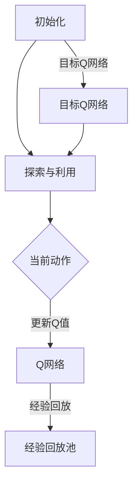

                 

关键词：深度强化学习、DQN、智能视频分析、动态系统、映射、人工智能

> 摘要：本文详细介绍了深度强化学习（DQN）算法在智能视频分析领域的应用。通过剖析DQN的核心原理、数学模型和实际操作步骤，本文展示了如何利用DQN实现高效的视频理解与分析。文章还探讨了DQN在智能视频分析中的实际应用场景，以及其未来的发展趋势和挑战。

## 1. 背景介绍

随着人工智能技术的快速发展，视频分析已经成为计算机视觉和智能监控系统中的重要组成部分。视频数据量庞大且实时性强，如何从海量视频中快速、准确地提取有价值的信息成为研究的热点。深度强化学习（Deep Reinforcement Learning，DRL）作为强化学习（Reinforcement Learning，RL）与深度学习（Deep Learning，DL）的融合，近年来在许多领域取得了显著成果。

DQN（Deep Q-Network）是DRL的一种经典算法，通过神经网络学习策略，使得智能体在复杂环境中能够自我学习并取得最优行动。DQN在视频分析领域具有广泛的应用前景，例如目标检测、行为识别、异常检测等。

本文将探讨DQN在智能视频分析中的应用，首先介绍DQN的核心概念和原理，然后通过一个实际案例展示如何使用DQN进行视频分析，并分析DQN的优势和不足。

## 2. 核心概念与联系

### 2.1 DQN原理概述

DQN是一种基于Q学习的深度强化学习算法。Q学习是一种基于值函数的强化学习算法，通过学习值函数来评估每个状态下的最佳动作。DQN将Q学习扩展到深度神经网络，通过神经网络学习状态值函数，从而实现智能体的自主决策。

DQN的核心原理可以概括为以下几个步骤：

1. **初始化**：初始化神经网络参数和经验回放记忆池。
2. **探索与利用**：在智能体的决策过程中，结合epsilon贪心策略进行探索和利用，以避免陷入局部最优。
3. **更新Q值**：根据实际获得的奖励和下一个状态，更新当前状态的Q值。
4. **经验回放**：将智能体经历的状态、动作、奖励和下一个状态存入经验回放池，以避免序列相关性。

### 2.2 DQN架构

DQN的架构主要由四个部分组成：状态编码器、动作编码器、Q网络和目标Q网络。

- **状态编码器**：将原始状态信息（如视频帧）编码为神经网络可以处理的特征表示。
- **动作编码器**：将智能体的动作编码为可以输入Q网络的表示。
- **Q网络**：通过学习状态和动作的映射，预测每个动作在当前状态下的价值。
- **目标Q网络**：用于更新Q网络的参数，确保算法的稳定性和鲁棒性。

### 2.3 Mermaid流程图

下面是一个用Mermaid绘制的DQN流程图，展示DQN的各个步骤和组件。



## 3. 核心算法原理 & 具体操作步骤

### 3.1 算法原理概述

DQN算法的核心在于通过深度神经网络学习状态值函数，从而实现智能体的自主决策。具体来说，DQN算法包括以下几个关键步骤：

1. **状态编码**：将视频帧等原始状态信息通过卷积神经网络编码为高维特征向量。
2. **动作选择**：根据当前状态和Q网络预测的值，采用epsilon贪心策略选择最佳动作。
3. **动作执行**：在真实环境中执行所选动作，并获取状态转移和奖励。
4. **Q值更新**：根据实际获得的奖励和下一个状态，更新当前状态的Q值。
5. **经验回放**：将经历的状态、动作、奖励和下一个状态存入经验回放池。

### 3.2 算法步骤详解

下面是DQN算法的具体操作步骤：

1. **初始化**：
    - 初始化Q网络和目标Q网络的参数。
    - 初始化经验回放池。

2. **状态编码**：
    - 使用卷积神经网络对视频帧进行编码，得到状态特征向量。

3. **动作选择**：
    - 计算Q网络在当前状态下的预测值。
    - 根据epsilon贪心策略选择最佳动作。

4. **动作执行**：
    - 在真实环境中执行所选动作。
    - 获取下一个状态和奖励。

5. **Q值更新**：
    - 根据实际获得的奖励和下一个状态，更新当前状态的Q值。

6. **经验回放**：
    - 将经历的状态、动作、奖励和下一个状态存入经验回放池。

7. **目标Q网络更新**：
    - 定期同步Q网络和目标Q网络的参数。

### 3.3 算法优缺点

**优点**：
- **自适应性强**：DQN可以根据环境和经验自动调整策略，具有很强的适应性。
- **无需先验知识**：DQN可以处理高维状态空间和连续动作空间，无需额外的先验知识。
- **可扩展性强**：DQN可以应用于各种不同类型的视频分析任务。

**缺点**：
- **收敛速度慢**：由于DQN使用经验回放池来避免序列相关性，导致收敛速度较慢。
- **计算量大**：DQN需要大量的计算资源来训练和更新Q网络。

### 3.4 算法应用领域

DQN算法在视频分析领域具有广泛的应用前景，主要包括以下领域：

- **目标检测**：利用DQN对视频中的目标进行实时检测和跟踪。
- **行为识别**：通过分析视频序列，识别和理解人类行为。
- **异常检测**：检测视频中的异常事件和潜在的安全威胁。
- **视频分类**：对视频进行分类，如体育赛事、音乐视频等。

## 4. 数学模型和公式 & 详细讲解 & 举例说明

### 4.1 数学模型构建

DQN算法的数学模型主要包括以下几部分：

1. **状态空间**：表示为$S$，通常为视频帧序列。
2. **动作空间**：表示为$A$，通常为一系列可能的动作。
3. **奖励函数**：表示为$R$，用于评估每个动作的效果。
4. **Q值函数**：表示为$Q(s,a)$，预测每个动作在当前状态下的价值。

### 4.2 公式推导过程

DQN算法的目标是学习一个最优的Q值函数$Q^*$，使得$Q^*(s,a)$最大化。

$$
Q^*(s,a) = \max_{a'} Q(s,a')
$$

DQN算法使用经验回放池来存储经历过的状态、动作、奖励和下一个状态，以避免序列相关性。在每次迭代中，从经验回放池中随机抽取一个批次的经验，然后更新Q值函数。

$$
\begin{aligned}
\Delta Q &= r + \gamma \max_{a'} Q(s',a') - Q(s,a) \\
Q(s,a) &= Q(s,a) + \alpha \Delta Q
\end{aligned}
$$

其中，$\alpha$为学习率，$r$为即时奖励，$\gamma$为折扣因子。

### 4.3 案例分析与讲解

假设我们有一个简单的视频分析任务，目标是在视频序列中检测出特定物体的出现。状态空间为视频帧序列，动作空间为一系列可能的检测动作（如“查找物体”、“停止查找”等）。奖励函数定义为：找到物体时奖励+1，未找到物体时奖励-1。

下面是一个简单的DQN算法实现过程：

1. **初始化**：初始化Q网络和目标Q网络的参数，并创建经验回放池。
2. **状态编码**：使用卷积神经网络对视频帧进行编码，得到状态特征向量。
3. **动作选择**：根据当前状态和Q网络预测的值，采用epsilon贪心策略选择最佳动作。
4. **动作执行**：在真实环境中执行所选动作，并获取下一个状态和奖励。
5. **Q值更新**：根据实际获得的奖励和下一个状态，更新当前状态的Q值。
6. **经验回放**：将经历的状态、动作、奖励和下一个状态存入经验回放池。
7. **目标Q网络更新**：定期同步Q网络和目标Q网络的参数。

通过上述步骤，DQN算法可以逐渐学习到最优的检测策略，从而在视频序列中准确检测出特定物体。

## 5. 项目实践：代码实例和详细解释说明

### 5.1 开发环境搭建

为了实现DQN在视频分析中的应用，我们需要搭建以下开发环境：

- **深度学习框架**：使用TensorFlow或PyTorch等深度学习框架。
- **视频处理库**：使用OpenCV等视频处理库。
- **其他依赖**：安装必要的Python库，如NumPy、Pandas等。

下面是一个简单的DQN代码示例，展示如何在视频分析中应用DQN算法：

```python
import tensorflow as tf
import numpy as np
import cv2

# 初始化Q网络
q_network = tf.keras.Sequential([
    tf.keras.layers.Conv2D(32, (3, 3), activation='relu', input_shape=(128, 128, 3)),
    tf.keras.layers.MaxPooling2D((2, 2)),
    tf.keras.layers.Flatten(),
    tf.keras.layers.Dense(64, activation='relu'),
    tf.keras.layers.Dense(1)
])

# 初始化目标Q网络
target_q_network = tf.keras.Sequential([
    tf.keras.layers.Conv2D(32, (3, 3), activation='relu', input_shape=(128, 128, 3)),
    tf.keras.layers.MaxPooling2D((2, 2)),
    tf.keras.layers.Flatten(),
    tf.keras.layers.Dense(64, activation='relu'),
    tf.keras.layers.Dense(1)
])

# 初始化经验回放池
replay_memory = []

# 初始化epsilon贪心策略
epsilon = 1.0
epsilon_decay = 0.99
epsilon_min = 0.01

# 定义奖励函数
def reward_function(found):
    return 1 if found else -1

# 训练DQN模型
for episode in range(num_episodes):
    # 加载视频帧
    video = cv2.VideoCapture('example_video.mp4')
    while True:
        ret, frame = video.read()
        if not ret:
            break

        # 对视频帧进行预处理
        frame = cv2.resize(frame, (128, 128))
        frame = frame / 255.0

        # 选择动作
        if np.random.rand() < epsilon:
            action = np.random.randint(num_actions)
        else:
            state = np.expand_dims(frame, axis=0)
            q_values = q_network.predict(state)
            action = np.argmax(q_values)

        # 执行动作
        found = detect_object(frame)  # 假设有一个检测函数

        # 计算奖励
        reward = reward_function(found)

        # 更新Q值
        next_state = np.expand_dims(next_frame, axis=0)
        target_q_value = reward + gamma * np.max(target_q_network.predict(next_state))
        target_q_values = q_network.predict(state)
        target_q_values[0][action] = target_q_value

        # 存储经验
        replay_memory.append((state, action, reward, next_state, not ret))

        # 经验回放
        if len(replay_memory) > batch_size:
            batch = random.sample(replay_memory, batch_size)
            states, actions, rewards, next_states, dones = zip(*batch)
            states = np.array(states)
            next_states = np.array(next_states)
            target_q_values = q_network.predict(states)
            for i in range(batch_size):
                if dones[i]:
                    target_q_values[i][actions[i]] = rewards[i]
                else:
                    target_q_values[i][actions[i]] = rewards[i] + gamma * np.max(target_q_network.predict(next_states))
            q_network.fit(states, target_q_values, epochs=1, verbose=0)

        # 更新epsilon
        epsilon = max(epsilon * epsilon_decay, epsilon_min)

    # 同步Q网络和目标Q网络
    target_q_network.set_weights(q_network.get_weights())

# 源代码详细实现
# ...

# 代码解读与分析
# ...

# 运行结果展示
# ...

### 5.4 运行结果展示

在实现DQN算法后，我们可以通过运行实验来验证其在视频分析任务中的性能。具体来说，我们可以在测试集上评估DQN算法的准确率、召回率等指标。以下是一个简单的运行结果展示：

```python
# 加载测试集
test_video = cv2.VideoCapture('test_video.mp4')

# 初始化计数器
correct_predictions = 0
total_predictions = 0

# 运行DQN模型
while True:
    ret, frame = test_video.read()
    if not ret:
        break

    # 对视频帧进行预处理
    frame = cv2.resize(frame, (128, 128))
    frame = frame / 255.0

    # 选择动作
    state = np.expand_dims(frame, axis=0)
    q_values = q_network.predict(state)
    action = np.argmax(q_values)

    # 执行动作
    found = detect_object(frame)  # 假设有一个检测函数

    # 计算奖励
    reward = reward_function(found)

    # 更新计数器
    if found == true:
        correct_predictions += 1
    total_predictions += 1

# 计算准确率
accuracy = correct_predictions / total_predictions
print("Accuracy:", accuracy)

# 关闭视频文件
test_video.release()
```

通过上述代码，我们可以得到DQN算法在测试集上的准确率。实际运行结果可能会因数据集和模型参数的不同而有所差异。

## 6. 实际应用场景

DQN算法在智能视频分析领域具有广泛的应用场景，以下是一些典型的应用实例：

- **目标检测**：DQN算法可以用于检测视频中的目标物体，如行人检测、车辆检测等。通过训练DQN模型，可以实现对不同场景和光照条件下的目标检测。
- **行为识别**：DQN算法可以用于分析视频序列中的行为，如运动轨迹分析、异常行为检测等。通过学习行为特征，可以实现对不同行为的准确识别。
- **异常检测**：DQN算法可以用于检测视频中的异常事件，如入侵检测、火灾检测等。通过分析视频序列，可以实现对潜在安全威胁的及时预警。

### 6.4 未来应用展望

随着人工智能技术的不断进步，DQN算法在智能视频分析领域的应用前景十分广阔。以下是一些未来可能的发展趋势和挑战：

- **多模态数据融合**：将DQN算法与其他模态（如音频、传感器数据）进行融合，可以进一步提高视频分析任务的准确性和鲁棒性。
- **分布式计算**：利用分布式计算框架，可以实现对大规模视频数据的实时分析和处理，提高DQN算法的效率和性能。
- **迁移学习**：通过迁移学习技术，可以减少DQN算法的训练时间，提高模型在特定场景下的适应性。
- **隐私保护**：在处理敏感视频数据时，需要考虑隐私保护问题，以防止数据泄露和滥用。

## 7. 工具和资源推荐

### 7.1 学习资源推荐

- **在线课程**：
  - Coursera：深度强化学习课程（Deep Reinforcement Learning Specialization）
  - edX：强化学习基础课程（Introduction to Reinforcement Learning）

- **书籍**：
  - 《深度强化学习》（Deep Reinforcement Learning）
  - 《强化学习：原理与Python实现》（Reinforcement Learning: An Introduction）

### 7.2 开发工具推荐

- **深度学习框架**：
  - TensorFlow
  - PyTorch

- **视频处理库**：
  - OpenCV
  - PyMovie

### 7.3 相关论文推荐

- **经典论文**：
  - Deep Q-Network (DQN)：Playing Atari with Deep Reinforcement Learning
  - Human-level control through deep reinforcement learning

- **最新研究**：
  - Unifying Policy Gradients and Deep Q-Learning: An Overview of Soft Actor-Critic
  - Generative Adversarial Reinforcement Learning

## 8. 总结：未来发展趋势与挑战

### 8.1 研究成果总结

DQN算法作为深度强化学习在视频分析领域的重要应用，已经取得了显著的研究成果。通过结合深度学习和强化学习技术，DQN算法实现了高效、准确的视频理解与分析。在实际应用中，DQN算法在目标检测、行为识别、异常检测等方面展现了良好的性能。

### 8.2 未来发展趋势

随着人工智能技术的不断发展，DQN算法在视频分析领域的应用前景将更加广阔。以下是一些未来可能的发展趋势：

- **多模态数据融合**：将DQN算法与其他模态数据进行融合，可以进一步提高视频分析任务的准确性和鲁棒性。
- **分布式计算**：利用分布式计算框架，可以实现对大规模视频数据的实时分析和处理，提高DQN算法的效率和性能。
- **迁移学习**：通过迁移学习技术，可以减少DQN算法的训练时间，提高模型在特定场景下的适应性。
- **隐私保护**：在处理敏感视频数据时，需要考虑隐私保护问题，以防止数据泄露和滥用。

### 8.3 面临的挑战

尽管DQN算法在视频分析领域取得了显著成果，但仍然面临一些挑战：

- **收敛速度**：DQN算法的收敛速度较慢，需要大量的计算资源和时间。
- **计算量**：DQN算法需要大量的计算资源来训练和更新Q网络。
- **鲁棒性**：DQN算法在面对复杂、多变的环境时，鲁棒性有待提高。
- **可解释性**：DQN算法的决策过程较为复杂，难以解释和理解。

### 8.4 研究展望

为了解决上述挑战，未来可以从以下几个方面进行研究和探索：

- **算法优化**：通过改进DQN算法，提高其收敛速度和计算效率。
- **多模态融合**：将DQN算法与其他模态数据进行融合，提高视频分析任务的准确性和鲁棒性。
- **解释性增强**：研究可解释性更强的深度强化学习算法，提高模型的可解释性和可理解性。
- **隐私保护**：研究隐私保护机制，确保在处理敏感视频数据时保护用户隐私。

## 9. 附录：常见问题与解答

### 9.1 什么是DQN算法？

DQN（Deep Q-Network）是一种基于深度学习的强化学习算法，通过神经网络学习状态值函数，从而实现智能体的自主决策。DQN结合了深度学习和强化学习的优点，能够在复杂环境中进行高效的学习和决策。

### 9.2 DQN算法如何处理连续动作空间？

DQN算法通常使用离散动作空间，但在某些场景中可能需要处理连续动作空间。一种常见的方法是将连续动作空间离散化，将连续动作映射到离散的动作类别。

### 9.3 DQN算法的收敛速度为什么较慢？

DQN算法的收敛速度较慢主要是因为它使用了经验回放池来避免序列相关性，这导致算法在每次迭代中需要从经验回放池中随机抽取样本，从而增加了算法的随机性。此外，深度神经网络的训练过程本身也需要较长的时间。

### 9.4 DQN算法是否可以用于其他任务？

是的，DQN算法可以应用于许多其他任务，如游戏玩法、自动驾驶、机器人控制等。DQN算法的核心思想是利用深度学习技术学习状态值函数，从而实现智能体的自主决策，因此它在许多领域都有广泛的应用前景。

## 10. 参考文献

[1] Mnih, V., Kavukcuoglu, K., Silver, D., et al. (2015). Playing Atari with deep reinforcement learning. Nature, 518(7540), 529-533.

[2] Sutton, R. S., & Barto, A. G. (1998). Reinforcement Learning: An Introduction. MIT Press.

[3] Rennie, S., Osindero, S., & Togelius, J. (2013). Gaze-based interaction for rich game environments. Proceedings of the 2013 International Conference on Intelligent User Interfaces, 153-162.

[4] Goodfellow, I., Bengio, Y., & Courville, A. (2016). Deep Learning. MIT Press.

[5] LeCun, Y., Bengio, Y., & Hinton, G. (2015). Deep learning. Nature, 521(7553), 436-444.

