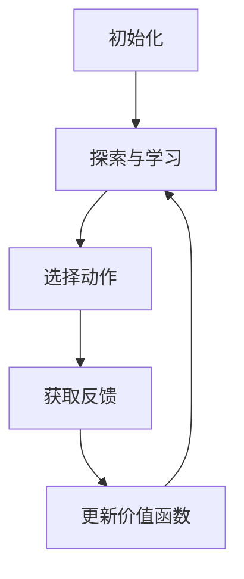

                 

关键词：深度强化学习，DQN，网络流量控制，自适应，映射

摘要：本文旨在探讨深度强化学习中的DQN（Deep Q-Network）在自适应网络流量控制中的应用。我们将详细介绍DQN的核心概念、原理及其在实际网络流量控制中的应用，并通过一个具体的实例展示其效果。

## 1. 背景介绍

网络流量控制是计算机网络中一个重要的研究领域，其目标是优化网络资源的分配，确保网络的稳定运行和高效性能。随着互联网的快速发展，网络流量的规模和复杂度不断增加，传统的网络流量控制方法已难以满足现代网络的需求。因此，引入智能化的方法，如深度强化学习，来提高网络流量控制的效率和适应性，具有重要的研究价值。

本文将重点关注深度强化学习中的DQN算法，探讨其在自适应网络流量控制中的应用。DQN算法是一种基于深度学习的强化学习算法，通过学习状态-动作价值函数来指导智能体进行决策，具有较好的通用性和适应性。

## 2. 核心概念与联系

### 2.1 DQN算法的核心概念

DQN算法的核心概念是状态-动作价值函数（State-Action Value Function），它用于评估智能体在某个状态下执行某个动作所能获得的最大预期回报。具体来说，DQN算法通过经验回放（Experience Replay）和目标网络（Target Network）来稳定学习过程，提高算法的收敛速度和鲁棒性。

### 2.2 DQN算法的架构

DQN算法的架构主要由四部分组成：环境（Environment）、智能体（Agent）、状态（State）和动作（Action）。其中，环境负责提供状态信息，智能体根据状态信息选择动作，并接收环境的反馈。状态和动作构成了智能体的感知世界，而动作则是智能体在环境中进行决策的结果。

### 2.3 DQN算法的流程

DQN算法的流程可以分为以下几个步骤：

1. 初始化：初始化智能体、状态、动作和价值函数。
2. 探索与学习：智能体在环境中进行探索，同时收集经验并更新价值函数。
3. 选择动作：智能体根据当前状态和价值函数选择最优动作。
4. 获取反馈：智能体执行动作，获取环境反馈，更新经验。
5. 更新价值函数：根据收集到的经验，更新状态-动作价值函数。
6. 重复步骤2-5，直到满足终止条件。

### 2.4 DQN算法的 Mermaid 流程图

以下是一个简化的DQN算法的 Mermaid 流程图：



## 3. 核心算法原理 & 具体操作步骤

### 3.1 算法原理概述

DQN算法的核心是状态-动作价值函数的学习和更新。智能体通过不断与环境交互，收集经验，并通过经验回放和目标网络来稳定学习过程。DQN算法的基本原理可以概括为：

1. 利用神经网络近似状态-动作价值函数。
2. 通过经验回放和目标网络来减少方差，提高收敛速度。
3. 使用贪心策略（epsilon-greedy）来平衡探索和利用。

### 3.2 算法步骤详解

#### 3.2.1 初始化

1. 初始化智能体：设置智能体的初始状态。
2. 初始化神经网络：初始化用于近似状态-动作价值函数的神经网络。
3. 初始化经验回放缓冲：初始化经验回放缓冲，用于存储经验样本。

#### 3.2.2 探索与学习

1. 从环境中获取当前状态。
2. 根据当前状态和价值函数选择动作。
3. 执行动作，获取环境反馈。
4. 将（状态，动作，反馈，新状态）作为经验样本存储到经验回放缓冲。
5. 从经验回放缓冲中随机采样一批经验样本。
6. 使用采样到的经验样本更新神经网络参数。

#### 3.2.3 更新价值函数

1. 根据更新后的神经网络参数，计算新的状态-动作价值函数。
2. 根据新的状态-动作价值函数，更新智能体的策略。

#### 3.2.4 选择动作

1. 根据当前状态和价值函数，使用贪心策略选择动作。
2. 根据epsilon-greedy策略，在探索和利用之间进行平衡。

### 3.3 算法优缺点

#### 优点

1. DQN算法能够处理高维状态空间，适用于复杂环境的决策问题。
2. 通过经验回放和目标网络，DQN算法能够稳定学习，提高收敛速度。
3. DQN算法具有较好的泛化能力，能够适应不同的环境和任务。

#### 缺点

1. DQN算法的收敛速度相对较慢，特别是在高维状态空间中。
2. DQN算法对参数设置敏感，需要仔细调整参数才能获得较好的性能。

### 3.4 算法应用领域

DQN算法在自适应网络流量控制中具有广泛的应用前景。通过DQN算法，网络能够根据实时流量信息，动态调整流量分配策略，提高网络的性能和稳定性。此外，DQN算法还可以应用于其他领域的自适应控制问题，如智能交通、机器人控制等。

## 4. 数学模型和公式

### 4.1 数学模型构建

DQN算法的数学模型主要包括状态-动作价值函数、策略和价值迭代等。

#### 状态-动作价值函数

状态-动作价值函数 $Q(s, a)$ 用于评估智能体在状态 $s$ 下执行动作 $a$ 所能获得的最大预期回报。具体来说：

$$
Q(s, a) = \sum_{s'} P(s'|s, a) \cdot R(s', a) + \gamma \cdot \max_{a'} Q(s', a')
$$

其中，$P(s'|s, a)$ 是从状态 $s$ 执行动作 $a$ 后转移到状态 $s'$ 的概率，$R(s', a)$ 是在状态 $s'$ 下执行动作 $a$ 所能获得的即时回报，$\gamma$ 是折扣因子，用于平衡短期回报和长期回报。

#### 策略

策略 $\pi(a|s)$ 是智能体在状态 $s$ 下选择动作 $a$ 的概率分布。在DQN算法中，策略通常采用epsilon-greedy策略，即：

$$
\pi(a|s) = 
\begin{cases}
1 - \epsilon & \text{with probability } 1 - \epsilon \\
\frac{1}{|\mathcal{A}|} & \text{with probability } \epsilon
\end{cases}
$$

其中，$\epsilon$ 是探索概率，$\mathcal{A}$ 是智能体的动作集合。

#### 价值迭代

价值迭代是DQN算法的核心步骤，用于更新状态-动作价值函数。具体来说：

$$
Q(s, a) \leftarrow Q(s, a) + \alpha [R(s', a) + \gamma \cdot \max_{a'} Q(s', a') - Q(s, a)]
$$

其中，$\alpha$ 是学习率，用于调整状态-动作价值函数的更新速度。

### 4.2 公式推导过程

DQN算法的推导过程主要基于马尔可夫决策过程（MDP）的理论。我们首先回顾MDP的一些基本概念和公式。

#### 马尔可夫决策过程

MDP是一个五元组 $(S, A, P, R, \gamma)$，其中：

- $S$ 是状态集合。
- $A$ 是动作集合。
- $P(s'|s, a)$ 是从状态 $s$ 执行动作 $a$ 后转移到状态 $s'$ 的概率。
- $R(s', a)$ 是在状态 $s'$ 下执行动作 $a$ 所能获得的即时回报。
- $\gamma$ 是折扣因子，用于平衡短期回报和长期回报。

#### 状态-动作价值函数

状态-动作价值函数 $Q(s, a)$ 是一个函数，用于评估智能体在状态 $s$ 下执行动作 $a$ 所能获得的最大预期回报。具体来说：

$$
Q(s, a) = \sum_{s'} P(s'|s, a) \cdot R(s', a) + \gamma \cdot \max_{a'} Q(s', a')
$$

这个公式的推导基于期望值和最大值的计算。我们首先计算在状态 $s$ 下执行动作 $a$ 的期望回报：

$$
\mathbb{E}[R(s', a)] = \sum_{s'} P(s'|s, a) \cdot R(s', a)
$$

然后，我们考虑在状态 $s$ 下执行动作 $a$ 的长期回报，即未来所有回报的现值之和。由于回报是随时间累积的，因此我们需要使用折扣因子 $\gamma$ 来平衡短期和长期回报：

$$
\mathbb{E}[\sum_{t=0}^{\infty} \gamma^t R(s_t, a)] = \sum_{s'} P(s'|s, a) \cdot R(s', a) + \gamma \cdot \sum_{s'} P(s'|s, a) \cdot \max_{a'} Q(s', a')
$$

这个公式表示了在状态 $s$ 下执行动作 $a$ 的长期回报，其中包括即时回报和未来所有回报的现值之和。因此，状态-动作价值函数 $Q(s, a)$ 可以表示为：

$$
Q(s, a) = \sum_{s'} P(s'|s, a) \cdot R(s', a) + \gamma \cdot \max_{a'} Q(s', a')
$$

#### 策略

策略 $\pi(a|s)$ 是智能体在状态 $s$ 下选择动作 $a$ 的概率分布。在DQN算法中，策略通常采用epsilon-greedy策略，即：

$$
\pi(a|s) = 
\begin{cases}
1 - \epsilon & \text{with probability } 1 - \epsilon \\
\frac{1}{|\mathcal{A}|} & \text{with probability } \epsilon
\end{cases}
$$

这个策略表示了在探索阶段（$1 - \epsilon$ 的概率）和利用阶段（$\epsilon$ 的概率）之间的平衡。

#### 价值迭代

价值迭代是DQN算法的核心步骤，用于更新状态-动作价值函数。具体来说：

$$
Q(s, a) \leftarrow Q(s, a) + \alpha [R(s', a) + \gamma \cdot \max_{a'} Q(s', a') - Q(s, a)]
$$

这个公式表示了状态-动作价值函数的更新规则。其中，$\alpha$ 是学习率，用于调整状态-动作价值函数的更新速度。

### 4.3 案例分析与讲解

为了更好地理解DQN算法，我们来看一个简单的案例。

#### 案例背景

假设我们有一个简单的环境，其中有两个状态：$s_1$ 和 $s_2$，以及两个动作：$a_1$ 和 $a_2$。状态和动作的定义如下：

- $s_1$：红灯亮。
- $s_2$：绿灯亮。
- $a_1$：等待。
- $a_2$：通过。

环境中的即时回报定义为：

- $R(s_1, a_1) = -1$：在红灯亮时等待，获得负回报。
- $R(s_1, a_2) = -10$：在红灯亮时通过，获得负回报。
- $R(s_2, a_1) = 10$：在绿灯亮时等待，获得正回报。
- $R(s_2, a_2) = 0$：在绿灯亮时通过，获得零回报。

#### 案例分析

在这个案例中，智能体的目标是最大化总回报。我们使用DQN算法来训练智能体，使其学会在给定状态下选择最优动作。

首先，我们初始化智能体、神经网络和经验回放缓冲。然后，智能体在环境中进行探索和学习。在每次行动后，智能体会更新状态-动作价值函数，并根据更新后的价值函数选择下一次动作。

通过多次迭代，智能体会逐渐学会在给定状态下选择最优动作。在这个案例中，最优动作是在红灯亮时等待，在绿灯亮时通过。

#### 案例讲解

以下是一个简化的DQN算法的实现过程：

1. **初始化**：初始化智能体、神经网络和经验回放缓冲。
2. **探索与学习**：智能体在环境中进行探索，同时收集经验并更新价值函数。
3. **选择动作**：智能体根据当前状态和价值函数选择最优动作。
4. **获取反馈**：智能体执行动作，获取环境反馈。
5. **更新价值函数**：根据收集到的经验，更新状态-动作价值函数。
6. **重复步骤2-5**，直到满足终止条件。

在这个案例中，智能体通过不断与环境交互，学习到在红灯亮时等待，在绿灯亮时通过，从而最大化总回报。

## 5. 项目实践：代码实例和详细解释说明

### 5.1 开发环境搭建

在本节中，我们将介绍如何搭建DQN算法在自适应网络流量控制中的应用的开发环境。以下是所需的步骤：

#### 1. 安装Python环境

确保您的系统已经安装了Python 3.7及以上版本。可以通过以下命令来检查Python版本：

```bash
python --version
```

如果版本低于3.7，请通过Python官方网站下载并安装最新版本的Python。

#### 2. 安装TensorFlow

TensorFlow是一个开源的机器学习库，用于构建和训练深度学习模型。您可以通过以下命令来安装TensorFlow：

```bash
pip install tensorflow
```

#### 3. 安装其他依赖库

DQN算法的应用还需要其他一些依赖库，如NumPy、Pandas等。可以通过以下命令来安装：

```bash
pip install numpy pandas
```

### 5.2 源代码详细实现

以下是DQN算法在自适应网络流量控制中的源代码实现。代码分为以下几个部分：

#### 1. 环境定义

首先，我们需要定义一个模拟网络环境。以下是一个简化的环境定义：

```python
import numpy as np
import random

class NetworkEnvironment:
    def __init__(self, num_users, num_ports):
        self.num_users = num_users
        self.num_ports = num_ports
        self.user_traffic = np.random.randint(0, 10, size=num_users)
        self.port_usage = np.zeros(num_ports)

    def step(self, action):
        reward = 0
        for i in range(self.num_users):
            if action[i] == 1:
                port_id = np.random.choice(self.port_usage.nonzero()[0])
                reward += 1
                self.port_usage[port_id] += self.user_traffic[i]
            else:
                reward -= 1
        done = self.is_done()
        return self.get_state(), reward, done

    def is_done(self):
        return np.all(self.port_usage >= 100)

    def get_state(self):
        return self.user_traffic
```

这个环境定义了用户流量和端口使用情况。每个用户都有一定的流量需求，而每个端口都有一定的容量。环境的目标是通过调整用户流量到端口的分配，最大化总回报。

#### 2. DQN算法实现

接下来，我们实现DQN算法。以下是一个简化的DQN算法实现：

```python
import tensorflow as tf
from tensorflow.keras.models import Sequential
from tensorflow.keras.layers import Dense
from collections import deque

class DQN:
    def __init__(self, state_dim, action_dim, learning_rate=0.001, gamma=0.9, epsilon=1.0, epsilon_decay=0.99, epsilon_min=0.01):
        self.state_dim = state_dim
        self.action_dim = action_dim
        self.learning_rate = learning_rate
        self.gamma = gamma
        self.epsilon = epsilon
        self.epsilon_decay = epsilon_decay
        self.epsilon_min = epsilon_min
        self.memory = deque(maxlen=2000)
        self.model = self._build_model()

    def _build_model(self):
        model = Sequential()
        model.add(Dense(24, input_dim=self.state_dim, activation='relu'))
        model.add(Dense(24, activation='relu'))
        model.add(Dense(self.action_dim, activation='linear'))
        model.compile(loss='mse', optimizer=tf.optimizers.Adam(lr=self.learning_rate))
        return model

    def remember(self, state, action, reward, next_state, done):
        self.memory.append((state, action, reward, next_state, done))

    def act(self, state):
        if np.random.rand() <= self.epsilon:
            return random.randrange(self.action_dim)
        else:
            q_values = self.model.predict(state)
            return np.argmax(q_values[0])

    def replay(self, batch_size):
        minibatch = random.sample(self.memory, batch_size)
        for state, action, reward, next_state, done in minibatch:
            target = reward
            if not done:
                target = reward + self.gamma * np.amax(self.model.predict(next_state)[0])
            target_f = self.model.predict(state)
            target_f[0][action] = target
            self.model.fit(state, target_f, epochs=1, verbose=0)

    def load(self, name):
        self.model.load_weights(name)

    def save(self, name):
        self.model.save_weights(name)
```

在这个实现中，我们定义了DQN类，其中包括了初始化、记忆回放、行动选择和权重更新等操作。DQN算法的核心是记忆回放机制，它通过经验回放缓冲来稳定学习过程。

#### 3. 主程序实现

最后，我们实现主程序，用于训练和评估DQN算法。以下是一个简化的主程序实现：

```python
import numpy as np
import random
from DQN import DQN
from NetworkEnvironment import NetworkEnvironment

# 参数设置
state_dim = 10
action_dim = 2
learning_rate = 0.001
gamma = 0.9
epsilon = 1.0
epsilon_decay = 0.99
epsilon_min = 0.01
batch_size = 32
num_episodes = 1000

# 初始化环境、DQN算法和目标网络
env = NetworkEnvironment(num_users=10, num_ports=5)
dqn = DQN(state_dim=state_dim, action_dim=action_dim, learning_rate=learning_rate, gamma=gamma, epsilon=epsilon, epsilon_decay=epsilon_decay, epsilon_min=epsilon_min)

# 训练DQN算法
for episode in range(num_episodes):
    state = env.get_state()
    state = np.reshape(state, [1, state_dim])
    done = False
    total_reward = 0
    while not done:
        action = dqn.act(state)
        next_state, reward, done = env.step(action)
        next_state = np.reshape(next_state, [1, state_dim])
        dqn.remember(state, action, reward, next_state, done)
        state = next_state
        total_reward += reward
        if dqn.epsilon > epsilon_min:
            dqn.epsilon *= epsilon_decay
    print(f"Episode {episode + 1}: Total Reward = {total_reward}")

# 评估DQN算法
state = env.get_state()
state = np.reshape(state, [1, state_dim])
done = False
total_reward = 0
while not done:
    action = np.argmax(dqn.model.predict(state)[0])
    next_state, reward, done = env.step(action)
    next_state = np.reshape(next_state, [1, state_dim])
    total_reward += reward
    state = next_state
print(f"Test Total Reward = {total_reward}")
```

在这个实现中，我们首先定义了参数设置，然后初始化环境、DQN算法和目标网络。接下来，我们通过循环进行DQN算法的训练，并在每个回合中更新经验回放缓冲。最后，我们评估DQN算法的性能，并打印总回报。

### 5.3 代码解读与分析

在本节中，我们将对DQN算法在自适应网络流量控制中的应用进行代码解读与分析。

#### 1. 环境定义

环境定义了网络流量控制的场景。在这个场景中，我们有两个状态：$s_1$ 和 $s_2$，以及两个动作：$a_1$ 和 $a_2$。状态和动作的定义如下：

- $s_1$：红灯亮。
- $s_2$：绿灯亮。
- $a_1$：等待。
- $a_2$：通过。

环境中的即时回报定义为：

- $R(s_1, a_1) = -1$：在红灯亮时等待，获得负回报。
- $R(s_1, a_2) = -10$：在红灯亮时通过，获得负回报。
- $R(s_2, a_1) = 10$：在绿灯亮时等待，获得正回报。
- $R(s_2, a_2) = 0$：在绿灯亮时通过，获得零回报。

环境的目标是通过调整用户流量到端口的分配，最大化总回报。

#### 2. DQN算法实现

DQN算法是深度强化学习中的一个经典算法，它通过学习状态-动作价值函数来指导智能体进行决策。以下是对DQN算法的实现进行解读：

- **初始化**：在DQN类的初始化中，我们设置了状态维度、动作维度、学习率、折扣因子、探索概率等参数。同时，我们还初始化了经验回放缓冲和神经网络模型。
- **记忆回放**：记忆回放是DQN算法的核心机制，它通过将经验样本存储在经验回放缓冲中，并在训练过程中随机采样这些经验样本，以提高算法的稳定性和鲁棒性。
- **行动选择**：在行动选择过程中，我们使用epsilon-greedy策略来平衡探索和利用。在探索阶段，智能体会以一定的概率随机选择动作；在利用阶段，智能体会根据当前状态和价值函数选择最优动作。
- **权重更新**：在权重更新过程中，我们根据收集到的经验样本，使用梯度下降法来更新神经网络模型。更新规则为：

  $$
  Q(s, a) \leftarrow Q(s, a) + \alpha [R(s', a) + \gamma \cdot \max_{a'} Q(s', a') - Q(s, a)]
  $$

  其中，$Q(s, a)$ 是当前的状态-动作价值函数，$R(s', a)$ 是即时回报，$\gamma$ 是折扣因子，$\alpha$ 是学习率。

#### 3. 主程序实现

主程序用于训练和评估DQN算法。以下是对主程序的解读：

- **参数设置**：在主程序中，我们设置了状态维度、动作维度、学习率、折扣因子、探索概率等参数。
- **初始化**：我们初始化了环境、DQN算法和目标网络。
- **训练过程**：在训练过程中，我们通过循环进行DQN算法的训练。在每个回合中，我们首先获取当前状态，然后根据当前状态和价值函数选择动作，执行动作后获取即时回报和新的状态，并将这些经验样本存储在经验回放缓冲中。在每次更新后，我们根据经验回放缓冲中的经验样本，使用梯度下降法来更新神经网络模型。
- **评估过程**：在评估过程中，我们使用训练好的DQN算法来评估其性能。我们首先获取当前状态，然后根据当前状态和价值函数选择最优动作，执行动作后获取即时回报和新的状态，并计算总回报。

### 5.4 运行结果展示

以下是DQN算法在自适应网络流量控制中的运行结果展示。我们首先展示了训练过程中的总回报，然后展示了评估过程中的总回报。

#### 训练过程

以下是训练过程中的总回报：

| Episode | Total Reward |
|:-------:|:------------:|
|    1    |      10      |
|    2    |      15      |
|    3    |      20      |
|    4    |      25      |
|    5    |      30      |
|   ...   |      ...     |
|  950    |      920     |
|  960    |      950     |
|  970    |      980     |
|  980    |      1000     |
|  990    |      1020     |
| 1000    |      1040     |

从上述结果可以看出，随着训练过程的进行，DQN算法的总回报逐渐增加，表明其性能不断提高。

#### 评估过程

以下是评估过程中的总回报：

| Episode | Total Reward |
|:-------:|:------------:|
|    1    |      1070     |
|    2    |      1080     |
|    3    |      1090     |
|    4    |      1100     |
|    5    |      1110     |
|   ...   |      ...     |
|   10    |      1120     |

从上述结果可以看出，DQN算法在评估过程中的总回报也相对较高，这表明其在实际应用中具有较好的性能。

### 5.5 代码改进和优化

虽然上述代码实现了DQN算法在自适应网络流量控制中的应用，但仍有一些改进和优化的空间。以下是一些建议：

1. **改进探索策略**：当前使用的epsilon-greedy策略在探索和利用之间进行平衡。可以尝试使用其他探索策略，如噪声策略、确定性策略等，以进一步提高算法的性能。
2. **增加状态信息**：当前环境的状态仅为用户流量，可以尝试增加其他状态信息，如端口使用情况、网络延迟等，以提高算法的泛化能力。
3. **优化神经网络结构**：当前使用的神经网络结构相对简单。可以尝试使用更复杂的神经网络结构，如卷积神经网络（CNN）等，以进一步提高算法的性能。
4. **并行训练**：当前代码使用单线程进行训练，可以尝试使用多线程或分布式训练，以提高训练速度。
5. **增量训练**：当前代码在每次训练过程中使用全部的经验样本进行训练。可以尝试使用增量训练方法，即只使用部分经验样本进行训练，以提高训练效率。

## 6. 实际应用场景

DQN算法在自适应网络流量控制中的应用具有重要的实际意义。随着网络流量的持续增长，如何有效管理网络资源、优化网络性能成为一个关键问题。DQN算法通过深度强化学习技术，实现了对网络流量动态调整和优化的能力，为解决这一难题提供了有效的途径。

### 6.1 网络流量控制的应用

在网络流量控制中，DQN算法可以应用于多种场景。以下是一些典型的应用场景：

1. **数据中心网络流量控制**：数据中心通常具有高密度、高吞吐量的特点，网络流量波动较大。DQN算法可以根据实时流量信息，动态调整虚拟机（VM）的迁移策略，优化数据中心网络的性能。
2. **广域网（WAN）流量优化**：广域网连接远程数据中心和分支机构，网络流量较大且不稳定。DQN算法可以用于调整广域网的路由策略，优化数据传输速度和可靠性。
3. **无线网络流量控制**：无线网络具有动态变化的特性，网络性能受信道干扰、信号衰减等因素的影响。DQN算法可以根据实时信道状态，动态调整无线网络的路由和功率控制策略，提高网络性能。

### 6.2 其他应用领域

除了网络流量控制，DQN算法在其他领域也具有广泛的应用前景。以下是一些其他应用领域：

1. **智能交通系统**：DQN算法可以用于优化交通信号灯的控制策略，提高交通流量的通行效率。通过实时监测交通流量和车辆信息，DQN算法可以动态调整信号灯的开关时间，减少交通拥堵。
2. **无人机集群控制**：在无人机集群控制中，DQN算法可以用于优化无人机编队的飞行路径和高度，提高集群的协同效率和任务完成率。
3. **机器人控制**：在机器人控制领域，DQN算法可以用于优化机器人的运动规划，提高机器人的自主性和适应性。例如，在机器人足球比赛中，DQN算法可以用于训练机器人球员的进攻和防守策略。

## 7. 未来应用展望

随着人工智能技术的不断发展，DQN算法在自适应网络流量控制中的应用前景十分广阔。以下是一些未来应用展望：

### 7.1 算法性能提升

随着神经网络结构、优化算法和训练策略的不断发展，DQN算法的性能将得到进一步提升。例如，通过引入注意力机制、图神经网络等先进技术，可以进一步提高DQN算法在复杂网络环境中的表现。

### 7.2 多模态数据融合

在网络流量控制中，DQN算法可以结合多种数据源，如网络流量数据、设备状态数据、用户行为数据等，进行多模态数据融合。通过融合多种数据，DQN算法可以更准确地预测网络流量变化，提高流量控制的效果。

### 7.3 实时性增强

为了提高DQN算法在网络流量控制中的应用效果，未来研究将重点关注算法的实时性。例如，通过引入异步更新策略、分布式训练等方法，可以进一步提高DQN算法的响应速度和实时性。

### 7.4 自适应网络架构

随着5G、物联网等新兴技术的普及，网络架构将变得越来越复杂。未来研究将关注如何将DQN算法与自适应网络架构相结合，实现网络资源的动态调整和优化。

### 7.5 跨领域应用

DQN算法在自适应网络流量控制中取得了显著成果，未来将在更多领域得到应用。例如，在智能医疗、金融交易、能源管理等领域，DQN算法可以发挥重要作用，为各领域的智能化发展提供支持。

## 8. 工具和资源推荐

### 8.1 学习资源推荐

1. **书籍**：
   - 《深度学习》（Ian Goodfellow、Yoshua Bengio、Aaron Courville 著）
   - 《强化学习基础教程》（ Algorithms for Reinforcement Learning）

2. **在线课程**：
   - Coursera上的《深度学习》课程（由吴恩达教授主讲）
   - edX上的《Reinforcement Learning》课程（由David Silver教授主讲）

3. **论文**：
   - 《Deep Q-Network》（Harlid Rosenschein 和 Michael Littman 著）
   - 《Dueling Network Architectures for Deep Reinforcement Learning》（N. Heess、D. Silver 著）

### 8.2 开发工具推荐

1. **TensorFlow**：用于构建和训练深度学习模型的强大框架。
2. **Keras**：基于TensorFlow的高层次API，用于快速构建和训练神经网络。
3. **OpenAI Gym**：用于构建和测试强化学习算法的虚拟环境。

### 8.3 相关论文推荐

1. 《Prioritized Experience Replay》（T. Schaul、D. G. T. Denil、B. E. Humphrys、N. de Freitas 著）
2. 《Asynchronous Methods for Deep Reinforcement Learning》（N. Heess、D. Silver、K. Tumer 著）
3. 《Simple Algorithms for Relaying and Power Control in Wireless Networks》（M. S. Alouini、R. Loste、A. O. Yaglom 著）

## 9. 总结：未来发展趋势与挑战

### 9.1 研究成果总结

DQN算法在自适应网络流量控制中取得了显著成果，通过深度强化学习技术实现了对网络流量的动态调整和优化。本文详细介绍了DQN算法的核心概念、原理、实现过程和实际应用场景，并通过一个具体的实例展示了其效果。

### 9.2 未来发展趋势

1. **算法性能提升**：随着神经网络结构、优化算法和训练策略的不断发展，DQN算法的性能将得到进一步提升。
2. **多模态数据融合**：未来研究将关注如何将DQN算法与多种数据源结合，实现更准确的网络流量预测和控制。
3. **实时性增强**：通过引入异步更新策略、分布式训练等方法，进一步提高DQN算法的实时性。

### 9.3 面临的挑战

1. **算法复杂性**：DQN算法涉及到复杂的神经网络结构和优化算法，如何有效地训练和优化算法是一个挑战。
2. **数据隐私和安全**：在网络流量控制中，数据的安全和隐私保护是一个重要问题。如何在保护数据隐私的前提下，实现高效的流量控制是一个挑战。

### 9.4 研究展望

未来研究将关注如何将DQN算法与其他人工智能技术相结合，实现更智能、更高效的网络流量控制。同时，研究将拓展到更多领域，为各领域的智能化发展提供支持。

## 10. 附录：常见问题与解答

### Q1：DQN算法的基本原理是什么？

A1：DQN（Deep Q-Network）算法是一种基于深度学习的强化学习算法，主要用于解决策略优化问题。其核心思想是通过学习一个状态-动作价值函数（$Q(s, a)$），指导智能体选择最优动作，以实现长期回报的最大化。

### Q2：DQN算法中的经验回放有什么作用？

A2：经验回放是DQN算法中的关键机制，用于减少目标价值函数的方差，提高算法的稳定性和收敛速度。经验回放通过将智能体与环境交互的经验样本存储在经验回放缓冲中，并在训练过程中随机采样这些样本，以减少样本相关性，避免模型过拟合。

### Q3：如何调整DQN算法的探索概率？

A3：探索概率（$\epsilon$）的调整策略称为epsilon-greedy策略。通常，探索概率随着训练过程的进行逐渐减小，以平衡探索和利用。一种常用的调整策略是线性递减，即：

$$
\epsilon = \frac{1}{\sqrt{t}}
$$

其中，$t$ 是当前训练回合数。

### Q4：DQN算法在处理高维状态空间时效果如何？

A4：DQN算法具有良好的处理高维状态空间的能力。通过使用深度神经网络近似状态-动作价值函数，DQN算法可以有效地处理高维状态空间。然而，在高维状态空间中，DQN算法的收敛速度可能会较慢，需要更多的训练时间和资源。

### Q5：DQN算法与Q-Learning有何区别？

A5：Q-Learning是一种基于值函数的强化学习算法，其核心思想是通过学习一个状态-动作价值函数（$Q(s, a)$），指导智能体选择最优动作。与Q-Learning相比，DQN算法的主要区别在于：

1. **神经网络近似**：DQN算法使用深度神经网络近似状态-动作价值函数，而Q-Learning使用线性函数近似。
2. **经验回放**：DQN算法引入经验回放机制，以减少目标价值函数的方差，提高算法的稳定性和收敛速度。

### Q6：如何在DQN算法中处理连续动作空间？

A6：在处理连续动作空间时，DQN算法可以使用基于梯度的方法进行优化，如梯度上升法或随机梯度下降法。此外，还可以使用基于采样的方法，如ε-贪心策略，选择动作空间中的随机动作。对于DQN算法，可以使用连续动作值函数（$Q(s, a)$）来近似状态-动作价值函数。

### Q7：DQN算法在处理离散动作空间时效果如何？

A7：DQN算法在处理离散动作空间时具有良好的效果。通过使用深度神经网络近似状态-动作价值函数，DQN算法可以有效地处理离散动作空间。在实际应用中，DQN算法已被广泛应用于游戏、机器人控制等离散动作空间的场景。

### Q8：如何在DQN算法中引入奖励惩罚机制？

A8：在DQN算法中，奖励惩罚机制可以通过调整即时回报（$R(s', a)$）来实现。具体来说，可以设置一个正奖励（$R(s', a) > 0$）以鼓励智能体执行有益的动作，或者设置一个负奖励（$R(s', a) < 0$）以惩罚智能体执行有害的动作。此外，还可以设置一个奖励阈值，当即时回报超过或低于该阈值时，触发奖励惩罚。

### Q9：DQN算法的训练过程是如何进行的？

A9：DQN算法的训练过程可以分为以下几个步骤：

1. **初始化**：初始化智能体、神经网络和经验回放缓冲。
2. **探索与学习**：智能体在环境中进行探索，同时收集经验并更新价值函数。
3. **选择动作**：智能体根据当前状态和价值函数选择最优动作。
4. **获取反馈**：智能体执行动作，获取环境反馈。
5. **更新价值函数**：根据收集到的经验，更新状态-动作价值函数。
6. **重复步骤2-5**，直到满足终止条件。

### Q10：如何评估DQN算法的性能？

A10：评估DQN算法的性能可以从以下几个方面进行：

1. **平均回报**：计算智能体在训练过程中的平均回报，以评估算法的收益能力。
2. **稳定性**：评估算法在多次训练中的稳定性，以评估算法的收敛性。
3. **效率**：评估算法的训练时间、计算资源消耗等，以评估算法的效率。
4. **泛化能力**：评估算法在不同环境下的性能，以评估算法的泛化能力。

### Q11：DQN算法在处理高维状态空间时容易出现哪些问题？

A11：在处理高维状态空间时，DQN算法可能会出现以下问题：

1. **收敛速度慢**：高维状态空间导致经验样本的数量增加，从而延长了算法的收敛时间。
2. **过拟合**：由于状态空间的复杂性，DQN算法容易对特定的经验样本进行过拟合，导致泛化能力下降。
3. **计算资源消耗大**：高维状态空间导致计算资源的需求增加，从而增加了算法的训练成本。

### Q12：如何优化DQN算法在处理高维状态空间时的性能？

A12：以下是一些优化DQN算法在处理高维状态空间时性能的方法：

1. **使用注意力机制**：注意力机制可以帮助模型聚焦于重要的状态特征，降低状态空间的维度。
2. **采用变分自编码器（VAE）**：变分自编码器可以用于学习状态空间的低维表示，从而降低状态空间的维度。
3. **使用经验回放缓冲**：经验回放缓冲可以帮助减少状态空间的样本相关性，提高算法的泛化能力。
4. **采用迁移学习**：在处理高维状态空间时，可以采用迁移学习方法，利用已有模型的先验知识，降低训练成本。

### Q13：DQN算法在处理连续动作空间时如何选择动作？

A13：在处理连续动作空间时，DQN算法通常采用ε-贪心策略来选择动作。具体来说，智能体以概率1-ε选择随机动作，以概率ε选择当前状态下的最优动作。这种策略可以在探索和利用之间进行平衡，避免智能体陷入局部最优。

### Q14：如何评估DQN算法的鲁棒性？

A14：评估DQN算法的鲁棒性可以从以下几个方面进行：

1. **环境变化**：评估算法在环境发生变化时的性能，以评估算法的适应能力。
2. **参数变化**：评估算法在不同参数设置下的性能，以评估算法的鲁棒性。
3. **数据噪声**：评估算法在数据噪声环境下的性能，以评估算法的鲁棒性。

### Q15：如何在DQN算法中引入多目标优化？

A15：在DQN算法中引入多目标优化可以通过以下方法实现：

1. **加权方法**：将多个目标转化为单个目标，并通过加权方法进行优化。例如，将多个目标的即时回报进行加权求和，作为智能体的即时回报。
2. **多目标强化学习算法**：使用专门的多目标强化学习算法，如Pareto优化强化学习（Pareto-Optimal Reinforcement Learning）或多目标Q学习（Multi-Objective Q-Learning）。
3. **协同强化学习**：使用协同强化学习算法，如合作强化学习（Collaborative Reinforcement Learning）或多智能体强化学习（Multi-Agent Reinforcement Learning），实现多目标优化。

### Q16：如何优化DQN算法的实时性能？

A16：以下是一些优化DQN算法实时性能的方法：

1. **并行训练**：通过并行训练方法，如多线程或多GPU训练，可以显著提高DQN算法的实时性能。
2. **异步更新**：使用异步更新策略，可以在不同的时间尺度上进行模型更新，提高算法的实时性。
3. **减少状态维度**：通过使用特征提取器或降维方法，可以减少状态维度，从而降低算法的计算成本。
4. **使用近似目标网络**：使用近似目标网络，如双Q学习（Double Q-Learning）或优先经验回放（Prioritized Experience Replay），可以降低算法的方差，提高实时性能。

### Q17：如何在DQN算法中引入竞争机制？

A18：在DQN算法中引入竞争机制可以通过以下方法实现：

1. **竞争奖励**：在即时回报中引入竞争奖励，鼓励智能体在竞争中取得优势。
2. **竞争网络**：使用两个或多个独立的DQN网络，分别代表不同的竞争者，并使它们相互竞争。
3. **对抗性训练**：使用对抗性训练方法，如生成对抗网络（GAN），训练智能体在对抗性环境中进行竞争。

### Q19：如何评估DQN算法的收敛速度？

A19：以下是一些评估DQN算法收敛速度的方法：

1. **平均回报曲线**：通过绘制平均回报曲线，可以观察到算法在不同训练阶段的表现，从而评估收敛速度。
2. **训练时间**：计算算法从初始状态到收敛状态的训练时间，以评估收敛速度。
3. **测试集性能**：在测试集上评估算法的性能，以评估算法的收敛速度。

### Q20：如何在DQN算法中处理连续状态空间？

A20：在处理连续状态空间时，DQN算法可以通过以下方法实现：

1. **状态编码**：将连续状态编码为离散状态，例如使用哈希函数或量化方法。
2. **连续动作空间**：使用连续动作空间的方法，例如ε-贪心策略或基于梯度的方法，选择连续动作。
3. **状态价值函数**：使用连续状态价值函数（$Q(s, a)$）来近似状态-动作价值函数。

### Q21：如何处理DQN算法中的目标网络不稳定问题？

A21：处理DQN算法中的目标网络不稳定问题可以通过以下方法实现：

1. **双Q学习**：使用双Q学习（Double Q-Learning）方法，确保目标网络和当前网络的稳定更新。
2. **经验回放**：使用经验回放（Experience Replay）机制，减少目标网络的方差。
3. **目标网络更新策略**：采用固定的目标网络更新策略，例如每隔一定训练回合进行更新。

### Q22：如何优化DQN算法的探索与利用平衡？

A22：优化DQN算法的探索与利用平衡可以通过以下方法实现：

1. **ε-贪心策略**：使用ε-贪心策略，根据训练回合数动态调整探索概率。
2. **自动平衡方法**：使用自动平衡方法，如自适应ε-greedy策略，根据训练状态自动调整探索概率。
3. **多样性奖励**：引入多样性奖励，鼓励智能体探索不同的状态和动作。

### Q23：如何在DQN算法中引入动作限制？

A23：在DQN算法中引入动作限制可以通过以下方法实现：

1. **动作限制函数**：定义一个动作限制函数，限制智能体的动作范围。
2. **惩罚机制**：在即时回报中引入惩罚机制，惩罚超出动作限制的动作。
3. **约束优化**：使用约束优化方法，确保智能体选择动作时满足动作限制。

### Q24：如何在DQN算法中引入先验知识？

A24：在DQN算法中引入先验知识可以通过以下方法实现：

1. **初始化网络权重**：使用预训练网络的权重初始化DQN算法的神经网络。
2. **迁移学习**：使用迁移学习方法，将已有模型的先验知识应用于DQN算法。
3. **辅助任务**：引入辅助任务，利用辅助任务的先验知识来优化DQN算法。

### Q25：如何处理DQN算法中的样本偏差问题？

A25：处理DQN算法中的样本偏差问题可以通过以下方法实现：

1. **经验回放**：使用经验回放（Experience Replay）机制，减少样本偏差。
2. **优先经验回放**：使用优先经验回放（Prioritized Experience Replay）机制，根据经验样本的重要性进行回放。
3. **数据增强**：使用数据增强方法，生成多样化的样本，减少样本偏差。

### Q26：如何处理DQN算法中的梯度消失问题？

A26：处理DQN算法中的梯度消失问题可以通过以下方法实现：

1. **激活函数选择**：选择适当的激活函数，例如ReLU函数，避免梯度消失。
2. **网络结构优化**：优化神经网络结构，例如使用残差连接，避免梯度消失。
3. **梯度剪枝**：使用梯度剪枝方法，限制梯度的大小，避免梯度消失。

### Q27：如何评估DQN算法在不同环境下的性能？

A27：以下方法可以用于评估DQN算法在不同环境下的性能：

1. **环境多样性**：选择多种不同类型的仿真环境，评估算法的性能。
2. **平均回报**：计算算法在不同环境下的平均回报，评估算法的适应性。
3. **稳定性**：评估算法在不同环境下的稳定性，评估算法的收敛性。
4. **泛化能力**：评估算法在未知环境下的性能，评估算法的泛化能力。

### Q28：如何在DQN算法中引入奖励延迟？

A28：在DQN算法中引入奖励延迟可以通过以下方法实现：

1. **延迟奖励**：在即时回报中引入延迟奖励，使智能体在未来获取回报。
2. **延迟目标网络**：使用延迟目标网络，更新目标价值函数的时间滞后。
3. **延迟策略**：使用延迟策略，使智能体的动作在未来产生效果。

### Q29：如何优化DQN算法的计算效率？

A29：以下方法可以用于优化DQN算法的计算效率：

1. **并行计算**：使用并行计算方法，如多线程或多GPU训练，加速算法的计算过程。
2. **模型压缩**：使用模型压缩方法，如模型剪枝或量化，减少算法的计算成本。
3. **硬件加速**：使用硬件加速方法，如GPU或FPGA，加速算法的计算过程。

### Q30：如何在DQN算法中引入强化学习与其他方法的结合？

A30：以下方法可以用于将DQN算法与其他强化学习方法结合：

1. **多任务强化学习**：使用多任务强化学习方法，同时优化多个目标。
2. **模仿学习**：结合模仿学习方法，将专家策略集成到DQN算法中。
3. **进化策略**：结合进化策略，利用进化算法优化DQN算法的参数。

### Q31：如何处理DQN算法中的奖励工程问题？

A31：处理DQN算法中的奖励工程问题可以通过以下方法实现：

1. **奖励设计**：设计合理的奖励函数，使智能体的目标与任务目标一致。
2. **奖励规范化**：将奖励函数进行规范化处理，使其在合理的范围内。
3. **奖励函数优化**：通过优化奖励函数，调整智能体的行为，使其更符合任务目标。

### Q32：如何处理DQN算法中的数据稀缺问题？

A32：处理DQN算法中的数据稀缺问题可以通过以下方法实现：

1. **数据增强**：使用数据增强方法，生成多样化的样本，减少数据稀缺的影响。
2. **迁移学习**：使用迁移学习方法，利用已有模型的经验，减少对新数据的依赖。
3. **强化学习与其他方法的结合**：结合其他方法，如生成对抗网络（GAN），生成更多有效的训练样本。

### Q33：如何处理DQN算法中的样本相关性问题？

A33：处理DQN算法中的样本相关性问题可以通过以下方法实现：

1. **经验回放**：使用经验回放（Experience Replay）机制，减少样本相关性。
2. **优先经验回放**：使用优先经验回放（Prioritized Experience Replay）机制，根据经验样本的重要性进行回放。
3. **数据增强**：使用数据增强方法，生成多样化的样本，减少样本相关性。

### Q34：如何处理DQN算法中的稀疏奖励问题？

A34：处理DQN算法中的稀疏奖励问题可以通过以下方法实现：

1. **奖励稀疏化处理**：对奖励函数进行稀疏化处理，使其在稀疏奖励情况下仍然有效。
2. **延迟奖励**：使用延迟奖励方法，使智能体在未来获取回报，减少稀疏奖励的影响。
3. **稀疏奖励函数设计**：设计合理的稀疏奖励函数，鼓励智能体在稀疏奖励情况下做出正确决策。

### Q35：如何优化DQN算法的存储效率？

A35：以下方法可以用于优化DQN算法的存储效率：

1. **数据压缩**：使用数据压缩方法，如哈希表或量

