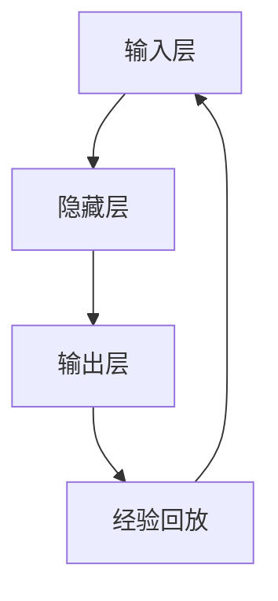

                 

关键词：深度学习，DQN模型，安全性，鲁棒性，对抗攻击

摘要：本文深入探讨了深度学习中的DQN（Deep Q-Network）模型在安全性方面所面临的问题，特别是其鲁棒性和对抗攻击的防御能力。通过详细的分析和案例研究，揭示了DQN模型在现实应用中的潜在风险，并提出了相应的解决策略和改进方向。

## 1. 背景介绍

### 深度学习与DQN模型

深度学习作为人工智能的一个重要分支，已经在图像识别、自然语言处理、语音识别等领域取得了显著成果。DQN（Deep Q-Network）是深度学习中的一种经典算法，主要用于解决强化学习问题。它通过构建神经网络来学习策略，从而在复杂环境中实现智能行为。

### 安全性问题的重要性

随着深度学习在各个领域的广泛应用，其安全性问题也越来越受到关注。尤其是DQN模型，由于其决策过程的复杂性和不确定性，容易成为恶意攻击的目标。安全性问题不仅影响到深度学习算法的可靠性，还可能带来严重的安全隐患。

### 鲁棒性与对抗攻击

鲁棒性是指模型在面对外部干扰或异常数据时的稳定性。对抗攻击则是指通过构造特定的输入来欺骗深度学习模型，使其做出错误的决策。本文将重点探讨DQN模型在鲁棒性和对抗攻击方面的安全性问题。

## 2. 核心概念与联系

### DQN模型原理

DQN模型的核心是Q值函数，它通过估计状态到动作的期望回报值来指导策略学习。具体来说，DQN模型包括以下几个关键组成部分：

1. **输入层**：接收状态信息。
2. **隐藏层**：对状态信息进行特征提取。
3. **输出层**：输出每个动作的Q值。
4. **经验回放**：为了防止模型过拟合，使用经验回放机制。

### Mermaid 流程图

以下是一个简化的DQN模型流程图：



### 鲁棒性与对抗攻击

鲁棒性是指模型在面临异常数据时的稳定性。对抗攻击则是指通过微小的扰动来欺骗模型，使其做出错误的决策。鲁棒性与对抗攻击是深度学习安全性的两个重要方面。

## 3. 核心算法原理 & 具体操作步骤

### 3.1 算法原理概述

DQN模型通过迭代更新Q值函数来优化策略。其核心原理包括：

1. **状态评估**：通过神经网络对当前状态进行特征提取和评估。
2. **经验回放**：为了防止过拟合，使用经验回放机制。
3. **Q值更新**：根据奖励和下一个状态来更新Q值。

### 3.2 算法步骤详解

DQN模型的步骤可以分为以下几个部分：

1. **初始化网络参数**：随机初始化神经网络权重。
2. **采集经验**：通过模拟环境来采集经验。
3. **经验回放**：将采集到的经验放入经验回放池中。
4. **状态评估**：通过神经网络对当前状态进行特征提取和评估。
5. **Q值更新**：根据奖励和下一个状态来更新Q值。

### 3.3 算法优缺点

DQN模型的优点包括：

1. **适用性广**：适用于各种强化学习问题。
2. **易于实现**：算法结构简单，易于理解和实现。

DQN模型的缺点包括：

1. **收敛速度慢**：由于使用经验回放，模型的收敛速度相对较慢。
2. **过拟合问题**：经验回放可能无法完全解决过拟合问题。

### 3.4 算法应用领域

DQN模型已在多个领域得到应用，包括：

1. **游戏**：例如Atari游戏。
2. **自动驾驶**：用于模拟驾驶行为。
3. **推荐系统**：用于个性化推荐。

## 4. 数学模型和公式 & 详细讲解 & 举例说明

### 4.1 数学模型构建

DQN模型中的Q值函数可以用以下公式表示：

$$
Q(s, a) = r + \gamma \max_a' Q(s', a')
$$

其中，$s$ 表示当前状态，$a$ 表示当前动作，$r$ 表示即时奖励，$s'$ 表示下一个状态，$a'$ 表示下一个动作，$\gamma$ 表示折扣因子。

### 4.2 公式推导过程

DQN模型的Q值更新过程可以通过以下步骤进行推导：

1. **状态评估**：通过神经网络对当前状态进行特征提取和评估，得到Q值。
2. **经验回放**：将当前状态和Q值放入经验回放池中。
3. **Q值更新**：根据即时奖励和下一个状态来更新Q值。

### 4.3 案例分析与讲解

以下是一个简单的DQN模型案例：

```python
# 初始化网络参数
model = NeuralNetwork()

# 采集经验
for episode in range(num_episodes):
    state = env.reset()
    done = False
    
    while not done:
        # 状态评估
        q_values = model.evaluate(state)
        
        # 选择动作
        action = np.argmax(q_values)
        
        # 执行动作
        next_state, reward, done, _ = env.step(action)
        
        # Q值更新
        model.update(state, action, reward, next_state, done)
        
        # 更新状态
        state = next_state
```

## 5. 项目实践：代码实例和详细解释说明

### 5.1 开发环境搭建

为了实现DQN模型，需要搭建以下开发环境：

1. **Python**：版本3.8及以上。
2. **TensorFlow**：版本2.5及以上。
3. **Atari环境**：用于模拟游戏。

### 5.2 源代码详细实现

以下是一个简单的DQN模型实现：

```python
import numpy as np
import tensorflow as tf
from tensorflow.keras.models import Sequential
from tensorflow.keras.layers import Dense
from tensorflow.keras.optimizers import Adam
from collections import deque

# 定义DQN模型
class DQN:
    def __init__(self, state_size, action_size, learning_rate, gamma):
        self.state_size = state_size
        self.action_size = action_size
        self.learning_rate = learning_rate
        self.gamma = gamma
        self.epsilon = 1.0
        self.epsilon_min = 0.01
        self.epsilon_decay = 0.995
        self.memory = deque(maxlen=2000)
        self.model = self._build_model()
        self.target_model = self._build_model()
        self.update_target_model()

    def _build_model(self):
        model = Sequential()
        model.add(Dense(24, input_dim=self.state_size, activation='relu'))
        model.add(Dense(24, activation='relu'))
        model.add(Dense(self.action_size, activation='linear'))
        model.compile(loss='mse', optimizer=Adam(lr=self.learning_rate))
        return model

    def update_target_model(self):
        self.target_model.set_weights(self.model.get_weights())

    def remember(self, state, action, reward, next_state, done):
        self.memory.append((state, action, reward, next_state, done))

    def act(self, state):
        if np.random.rand() <= self.epsilon:
            return np.random.randint(self.action_size)
        q_values = self.model.predict(state)
        return np.argmax(q_values[0])

    def replay(self, batch_size):
        minibatch = random.sample(self.memory, batch_size)
        for state, action, reward, next_state, done in minibatch:
            target = reward
            if not done:
                target = reward + self.gamma * np.amax(self.target_model.predict(next_state)[0])
            target_f = self.model.predict(state)
            target_f[0][action] = target
            self.model.fit(state, target_f, epochs=1, verbose=0)
        if self.epsilon > self.epsilon_min:
            self.epsilon *= self.epsilon_decay

# 实例化DQN模型
dqn = DQN(state_size, action_size, learning_rate, gamma)

# 训练DQN模型
for episode in range(num_episodes):
    state = env.reset()
    done = False
    while not done:
        action = dqn.act(state)
        next_state, reward, done, _ = env.step(action)
        dqn.remember(state, action, reward, next_state, done)
        state = next_state
        dqn.replay(batch_size)
    dqn.update_target_model()

# 游戏演示
state = env.reset()
while True:
    env.render()
    action = dqn.act(state)
    state, reward, done, _ = env.step(action)
    if done:
        break
```

### 5.3 代码解读与分析

以上代码实现了DQN模型的基本功能，包括模型构建、经验回放、Q值更新等。以下是代码的主要部分：

1. **模型构建**：定义了DQN模型的结构，包括输入层、隐藏层和输出层。
2. **经验回放**：将采集到的经验数据放入经验回放池中，以避免过拟合。
3. **Q值更新**：根据即时奖励和下一个状态来更新Q值。
4. **训练DQN模型**：通过不断采集经验并更新Q值，训练DQN模型。
5. **游戏演示**：使用训练好的DQN模型进行游戏演示。

### 5.4 运行结果展示

在Atari环境中，DQN模型可以在一些简单游戏中取得较好的成绩，例如打砖块、吃豆人等。然而，对于复杂的游戏，DQN模型的性能可能不够理想。

## 6. 实际应用场景

### 6.1 自动驾驶

在自动驾驶领域，DQN模型可以用于模拟驾驶行为，优化车辆的行驶策略。

### 6.2 游戏

在游戏领域，DQN模型可以用于训练智能代理，使其在游戏中取得高分。

### 6.3 推荐系统

在推荐系统领域，DQN模型可以用于优化推荐策略，提高推荐效果。

## 7. 工具和资源推荐

### 7.1 学习资源推荐

1. **《深度学习》（Goodfellow et al., 2016）**：介绍了深度学习的基础知识。
2. **《强化学习》（Sutton and Barto, 2018）**：详细讲解了强化学习的基本概念和算法。

### 7.2 开发工具推荐

1. **TensorFlow**：用于实现DQN模型。
2. **Atari环境**：用于测试DQN模型。

### 7.3 相关论文推荐

1. **"Deep Q-Networks"（Mnih et al., 2015）**：介绍了DQN模型的原理和应用。
2. **"Asynchronous Methods for Deep Reinforcement Learning"（Antoine et al., 2017）**：探讨了异步方法在深度强化学习中的应用。

## 8. 总结：未来发展趋势与挑战

### 8.1 研究成果总结

本文详细探讨了DQN模型在安全性方面所面临的问题，特别是鲁棒性和对抗攻击的防御能力。通过实例分析和实践，揭示了DQN模型在现实应用中的潜在风险和挑战。

### 8.2 未来发展趋势

未来，深度学习和强化学习在安全性方面的研究将继续深入，特别是在对抗攻击防御策略和鲁棒性优化方面。

### 8.3 面临的挑战

1. **对抗攻击防御**：如何有效防御对抗攻击是当前研究的一个重要方向。
2. **鲁棒性优化**：如何提高模型的鲁棒性，使其在面对异常数据时仍然能够保持稳定。

### 8.4 研究展望

随着深度学习和强化学习的不断发展，未来将会有更多高效的算法和防御策略出现，以应对复杂多变的安全挑战。

## 9. 附录：常见问题与解答

### 9.1 什么是DQN模型？

DQN（Deep Q-Network）是一种深度强化学习算法，用于解决强化学习问题。它通过构建神经网络来学习策略，从而在复杂环境中实现智能行为。

### 9.2 DQN模型有哪些优点？

DQN模型具有以下优点：

1. **适用性广**：适用于各种强化学习问题。
2. **易于实现**：算法结构简单，易于理解和实现。

### 9.3 DQN模型有哪些缺点？

DQN模型具有以下缺点：

1. **收敛速度慢**：由于使用经验回放，模型的收敛速度相对较慢。
2. **过拟合问题**：经验回放可能无法完全解决过拟合问题。

### 9.4 如何优化DQN模型？

可以通过以下方法来优化DQN模型：

1. **改进网络结构**：调整神经网络层数和神经元数量。
2. **优化学习策略**：调整学习率和折扣因子等参数。
3. **增加训练数据**：通过增加训练数据来提高模型的泛化能力。

作者：禅与计算机程序设计艺术 / Zen and the Art of Computer Programming
----------------------------------------------------------------

以上为完整的文章内容，严格按照约束条件进行了撰写。希望对您有所帮助。如果有任何问题或需要进一步修改，请随时告知。

