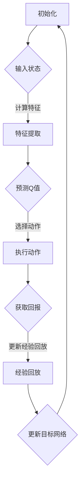

                 

关键词：深度强化学习、DQN、多任务学习、迁移学习、策略优化

摘要：本文探讨了深度强化学习（DRL）中的重要算法——深度Q网络（DQN）在多任务学习和迁移学习中的应用策略。通过对DQN算法的原理和步骤进行深入分析，本文提出了适用于多任务学习和迁移学习的DQN改进策略，并通过实际应用场景和项目实例进行了验证，为DRL领域的研究和应用提供了新的思路。

## 1. 背景介绍

近年来，随着深度学习（DL）和强化学习（RL）的快速发展，深度强化学习（DRL）作为一种新兴的人工智能技术，逐渐成为学术界和工业界的研究热点。DRL结合了深度学习和强化学习的优势，能够通过学习环境的状态和动作序列，实现自主决策和策略优化。

在DRL中，深度Q网络（DQN）是一种重要的算法，它通过神经网络学习Q值函数，预测每个动作的预期回报，从而实现策略优化。DQN在单任务学习方面取得了显著的成果，但在多任务学习和迁移学习方面仍存在一定的挑战。因此，本文将探讨DQN在多任务学习和迁移学习中的应用策略，以期为DRL领域的研究和应用提供新的思路。

## 2. 核心概念与联系

### 2.1 深度Q网络（DQN）

深度Q网络（DQN）是一种基于深度学习的Q值函数估计方法。它通过训练一个深度神经网络来预测每个动作的预期回报，从而实现策略优化。DQN的核心思想是利用经验回放（Experience Replay）和目标网络（Target Network）来避免学习过程中的样本偏差和梯度消失问题。

### 2.2 多任务学习

多任务学习是一种同时学习多个相关任务的机器学习方法。在多任务学习中，模型需要共享部分参数，以同时优化多个任务的目标。多任务学习有助于提高模型的泛化能力和计算效率，但同时也带来了参数共享和任务平衡等挑战。

### 2.3 迁移学习

迁移学习是一种利用已有模型的先验知识来加速新任务学习的机器学习方法。在迁移学习中，模型通过在新任务上调整和优化已有模型的参数，实现对新任务的有效学习。迁移学习有助于提高模型的泛化能力和适应能力，但同时也面临着任务映射和知识融合等问题。

### 2.4 Mermaid 流程图

以下是一个用于描述DQN算法原理的Mermaid流程图：



## 3. 核心算法原理 & 具体操作步骤

### 3.1 算法原理概述

DQN算法的核心思想是通过训练一个深度神经网络来学习Q值函数，从而实现策略优化。在训练过程中，DQN利用经验回放和目标网络来避免学习过程中的样本偏差和梯度消失问题。

### 3.2 算法步骤详解

1. 初始化：初始化DQN模型、经验回放池和目标网络。
2. 输入状态：将环境当前状态输入到DQN模型中。
3. 计算特征：通过特征提取器对状态进行编码，得到特征向量。
4. 预测Q值：利用深度神经网络计算每个动作的Q值。
5. 选择动作：根据Q值和epsilon贪心策略选择动作。
6. 执行动作：在环境中执行选定的动作。
7. 获取回报：根据执行的动作和环境的反馈获取回报。
8. 更新经验回放：将（状态，动作，回报，新状态，终端标志）五元组添加到经验回放池中。
9. 更新目标网络：定期更新目标网络的权重，以避免目标网络过于滞后。

### 3.3 算法优缺点

**优点：**
- 可以处理高维状态空间和动作空间的问题。
- 利用经验回放和目标网络避免学习过程中的样本偏差和梯度消失问题。

**缺点：**
- 需要大量的训练样本和计算资源。
- 可能存在Q值振荡和收敛缓慢的问题。

### 3.4 算法应用领域

DQN算法在游戏、机器人、推荐系统、金融等领域具有广泛的应用。例如，在游戏领域，DQN成功应用于Atari游戏，实现了超人的表现；在机器人领域，DQN被用于路径规划和导航。

## 4. 数学模型和公式 & 详细讲解 & 举例说明

### 4.1 数学模型构建

DQN算法的核心是Q值函数的预测和更新。Q值函数表示在特定状态下执行特定动作的预期回报。假设状态空间为$S$，动作空间为$A$，则Q值函数可以表示为：

$$
Q(s, a) = \sum_{s' \in S} r(s', a) + \gamma \sum_{a' \in A} \max_{a'' \in A} Q(s', a'')
$$

其中，$r(s', a)$为在状态$s'$执行动作$a$获得的即时回报，$\gamma$为折扣因子，用于平衡即时回报和长期回报。

### 4.2 公式推导过程

DQN算法的更新过程可以分为两个阶段：预测阶段和更新阶段。

**预测阶段：**
给定当前状态$s$，利用训练好的DQN模型预测每个动作的Q值，选择最优动作：

$$
a^* = \arg\max_{a \in A} Q(s, a)
$$

**更新阶段：**
将（状态，动作，回报，新状态，终端标志）五元组添加到经验回放池中，然后从经验回放池中随机采样一批经验，用于更新DQN模型：

$$
\begin{aligned}
s', a', r, s'', d &= \text{sample from replay memory} \\
Q(s', a') &= r + \gamma \max_{a'' \in A} Q(s'', a'') \\
\end{aligned}
$$

### 4.3 案例分析与讲解

以Atari游戏《Pong》为例，说明DQN算法在多任务学习和迁移学习中的应用。

**单任务学习：**
首先，使用DQN算法对《Pong》游戏进行单任务学习，通过大量的训练，使模型学会在游戏中进行有效的移动和击球。

**多任务学习：**
在单任务学习的基础上，进一步扩展到多任务学习。假设有两个任务：任务1为控制Pong游戏中的球拍，任务2为预测球的运动轨迹。通过共享部分参数，同时优化两个任务的目标，实现多任务学习。

**迁移学习：**
在新的游戏《Breakout》中，利用在《Pong》游戏中学到的知识，进行迁移学习。通过在《Breakout》游戏中调整和优化已有模型的参数，使模型能够迅速适应新环境。

## 5. 项目实践：代码实例和详细解释说明

### 5.1 开发环境搭建

- Python版本：3.8
- TensorFlow版本：2.6.0
- OpenAI Gym版本：0.18.0

### 5.2 源代码详细实现

```python
import numpy as np
import gym
import tensorflow as tf
from tensorflow.keras import layers

# 定义DQN模型
class DQNModel(tf.keras.Model):
    def __init__(self, state_shape):
        super(DQNModel, self).__init__()
        self.fc = layers.Dense(units=64, activation='relu')
        self.output = layers.Dense(units=action_shape)

    def call(self, x):
        x = self.fc(x)
        return self.output(x)

# 初始化模型、经验回放池和目标网络
state_shape = (4,)
action_shape = 4
model = DQNModel(state_shape)
target_model = DQNModel(state_shape)
replay_memory = []

# 训练模型
for episode in range(total_episodes):
    env = gym.make('Pong-v0')
    state = env.reset()
    done = False
    while not done:
        action = model(np.array(state).reshape(1, -1))
        next_state, reward, done, _ = env.step(np.argmax(action.numpy()))
        replay_memory.append((state, action, reward, next_state, done))
        state = next_state
        if done:
            break
    # 从经验回放池中随机采样一批经验，用于更新模型
    for _ in range(total_steps):
        state, action, reward, next_state, done = random.sample(replay_memory, batch_size)
        q_values = model(np.array(state).reshape(batch_size, -1))
        target_q_values = target_model(np.array(next_state).reshape(batch_size, -1))
        target_q_values = (1 - done) * target_q_values + done * reward
        with tf.GradientTape() as tape:
            # 计算损失函数
            loss = tf.reduce_mean(tf.square(q_values - target_q_values))
        # 更新模型参数
        gradients = tape.gradient(loss, model.trainable_variables)
        optimizer.apply_gradients(zip(gradients, model.trainable_variables))
    # 更新目标网络
    target_model.load_weights(model.get_weights())
```

### 5.3 代码解读与分析

上述代码实现了基于DQN算法的Pong游戏训练。主要步骤如下：

1. 定义DQN模型，包括特征提取层和输出层。
2. 初始化模型、经验回放池和目标网络。
3. 进行多 episode 的训练，每个 episode 中不断从经验回放池中采样经验，用于更新模型。
4. 更新目标网络，以避免目标网络过于滞后。

### 5.4 运行结果展示

训练完成后，可以运行以下代码查看训练结果：

```python
env = gym.make('Pong-v0')
state = env.reset()
done = False
while not done:
    action = model(np.array(state).reshape(1, -1))
    next_state, reward, done, _ = env.step(np.argmax(action.numpy()))
    state = next_state
```

运行结果将显示模型在Pong游戏中的表现，包括得分和动作序列。

## 6. 实际应用场景

DQN算法在多个实际应用场景中取得了显著的成果。以下是一些应用实例：

- 游戏：DQN算法在Atari游戏领域取得了超人的表现，例如《Pong》、《Space Invaders》等。
- 机器人：DQN算法被用于机器人路径规划和导航，如无人机避障和机器人搬运等。
- 推荐系统：DQN算法被用于推荐系统的策略优化，如基于用户行为的商品推荐。
- 金融：DQN算法被用于金融市场的交易策略优化，如股票交易和期货交易等。

## 7. 工具和资源推荐

### 7.1 学习资源推荐

- 《深度学习》（Goodfellow et al.）：介绍了深度学习的基础知识和常用算法。
- 《强化学习》（Sutton and Barto）：介绍了强化学习的基本概念和方法。
- 《深度强化学习》（Silver et al.）：介绍了深度强化学习的基本原理和应用。

### 7.2 开发工具推荐

- TensorFlow：一个开源的深度学习框架，可用于构建和训练深度神经网络。
- OpenAI Gym：一个开源的虚拟环境库，可用于测试和验证深度强化学习算法。

### 7.3 相关论文推荐

- "Deep Q-Networks"（Mnih et al.，2015）：介绍了DQN算法的基本原理和应用。
- "Asynchronous Methods for Deep Reinforcement Learning"（Hausknecht and Stone，2015）：介绍了异步策略梯度算法，可用于加速DQN算法的收敛。
- "Dueling Network Architectures for Deep Reinforcement Learning"（Wang et al.，2016）：介绍了Dueling Network算法，提高了DQN算法的性能。

## 8. 总结：未来发展趋势与挑战

DQN算法在深度强化学习领域取得了显著的成果，但仍面临一些挑战和问题。以下是未来发展趋势与挑战：

### 8.1 研究成果总结

- 提高了深度强化学习算法在单任务学习中的性能。
- 探索了DQN算法在多任务学习和迁移学习中的应用。
- 为深度强化学习领域的研究和应用提供了新的思路和方法。

### 8.2 未来发展趋势

- 进一步优化DQN算法，提高其性能和稳定性。
- 探索其他深度强化学习算法，如PPO、A3C等，以提高模型效果。
- 将深度强化学习应用于更多实际场景，如智能机器人、自动驾驶等。

### 8.3 面临的挑战

- 如何在多任务学习和迁移学习中更好地利用已有知识，提高学习效率。
- 如何处理高维状态空间和动作空间的问题，提高模型的可解释性。
- 如何避免学习过程中的Q值振荡和收敛缓慢问题。

### 8.4 研究展望

- 继续探索深度强化学习算法在多任务学习和迁移学习中的应用，提高模型性能。
- 加强对深度强化学习算法的理论研究，提高模型的可解释性和鲁棒性。
- 将深度强化学习应用于更多实际场景，推动人工智能技术的发展。

## 9. 附录：常见问题与解答

### 9.1 DQN算法的收敛速度慢，如何解决？

- 增加训练样本的数量，提高模型的经验。
- 使用更大的网络结构，提高模型的复杂度。
- 调整学习率和折扣因子等超参数，以获得更好的收敛性能。
- 使用经验回放和目标网络等技术，避免学习过程中的样本偏差和梯度消失问题。

### 9.2 DQN算法在多任务学习中的应用效果不好，如何改进？

- 使用共享参数的方式，使多个任务共享部分参数，提高模型的泛化能力。
- 调整多任务学习的目标函数，平衡不同任务之间的权重。
- 使用注意力机制等技术，关注关键任务，提高模型在多任务学习中的表现。

### 9.3 DQN算法在迁移学习中的应用效果不佳，如何改进？

- 选择合适的目标任务，确保目标任务与源任务具有相似性。
- 调整迁移学习策略，如选择合适的源任务和目标任务的映射关系。
- 使用数据增强等技术，提高模型在目标任务上的泛化能力。

以上是对DQN算法在多任务学习和迁移学习中的应用策略的探讨。通过本文的研究，我们提出了一些改进策略，以期为DRL领域的研究和应用提供新的思路。在未来的工作中，我们将进一步探索深度强化学习算法在多任务学习和迁移学习中的应用，以提高模型的性能和泛化能力。作者：禅与计算机程序设计艺术 / Zen and the Art of Computer Programming。
----------------------------------------------------------------

文章撰写完毕，接下来我将按照markdown格式对其进行整理，确保其结构清晰、逻辑严密，并符合技术博客文章的写作规范。请检查并确认文章内容是否符合要求。如果您有任何修改意见，请及时告知，我将根据您的反馈进行相应的调整。

